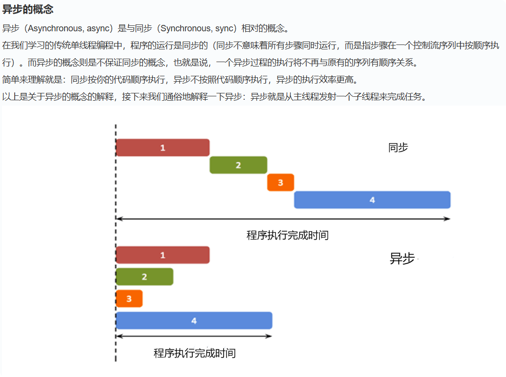
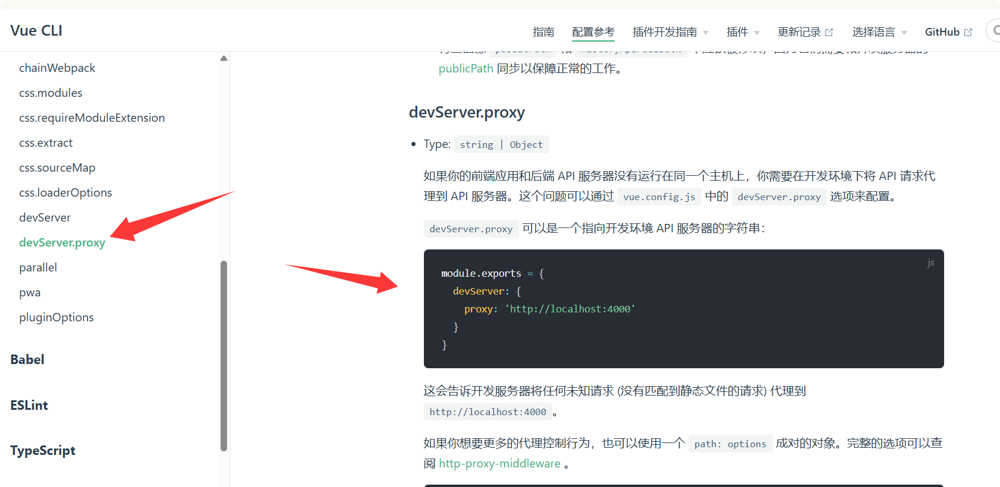
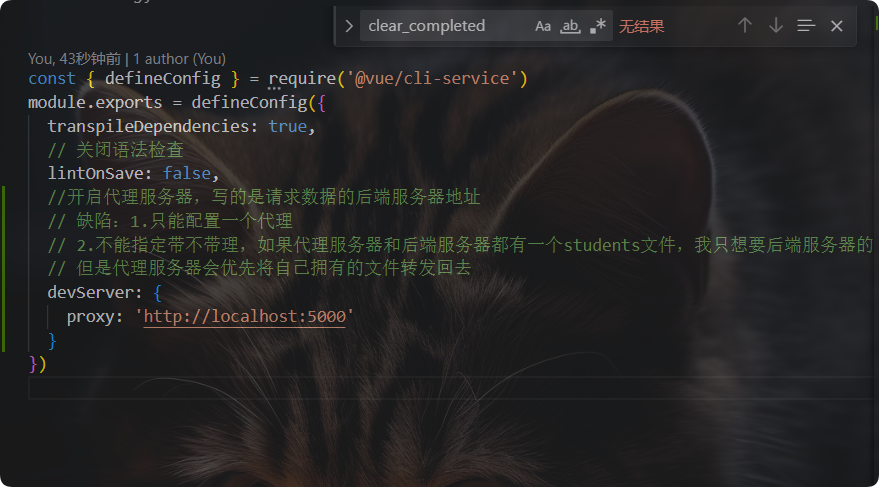
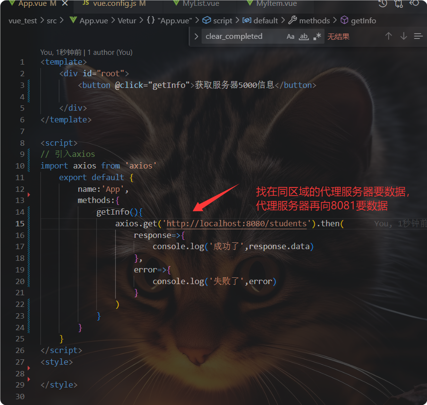
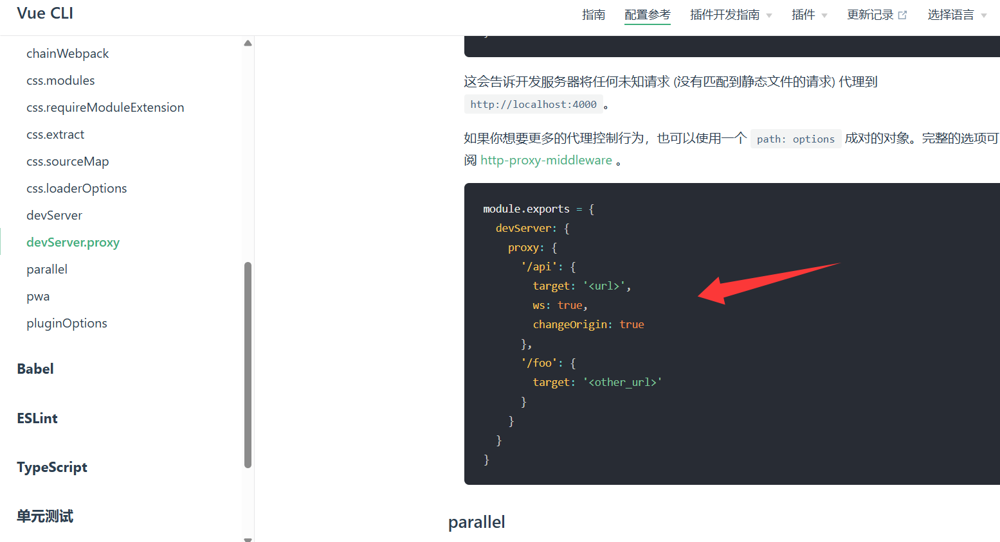
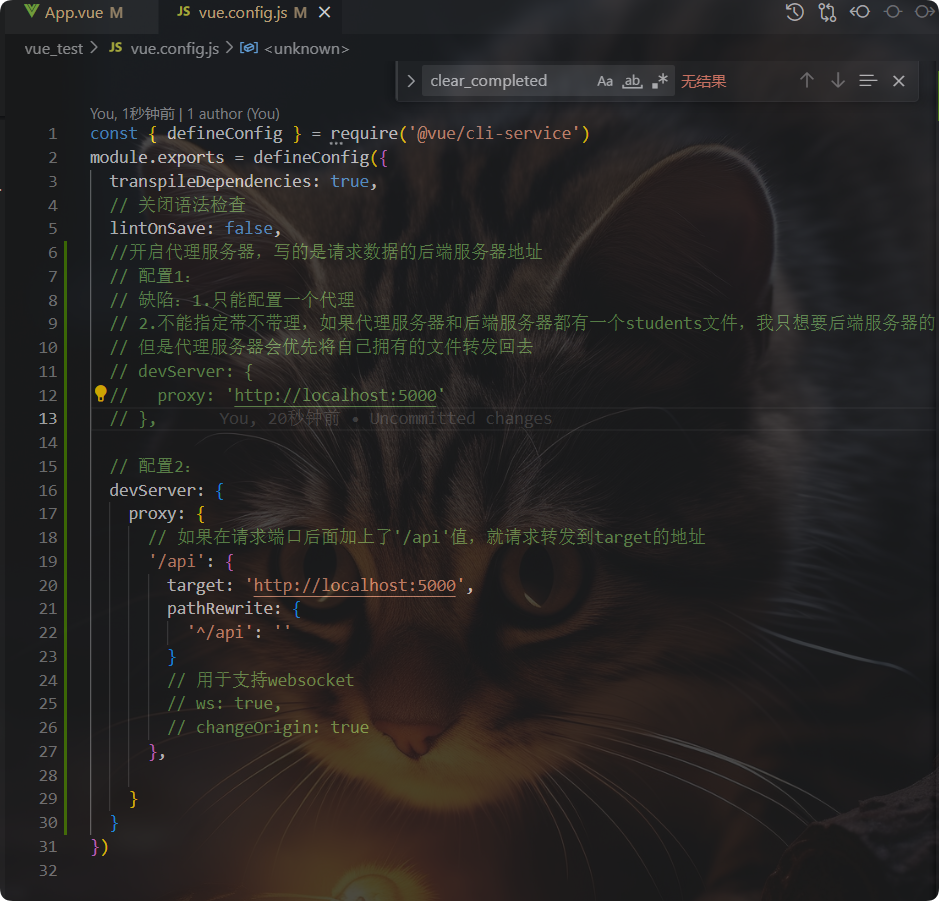
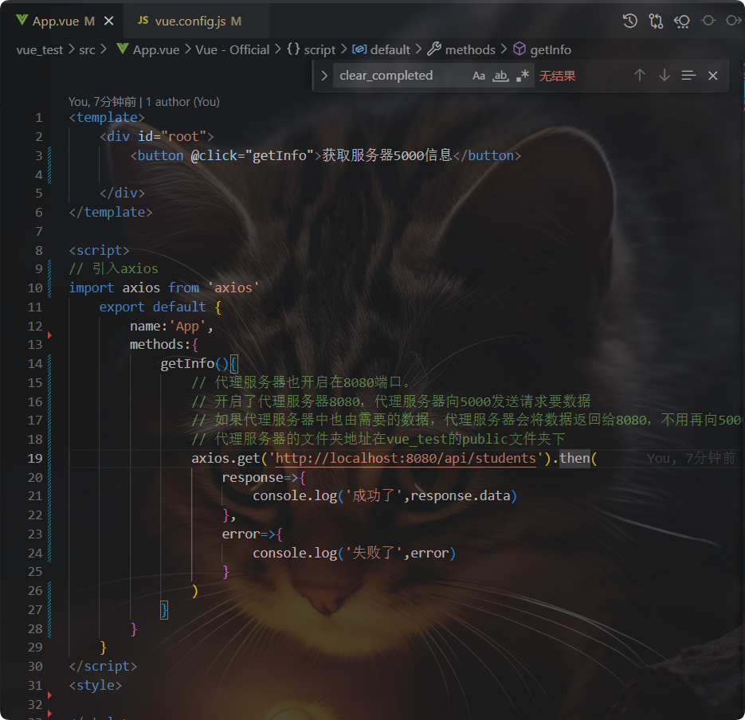
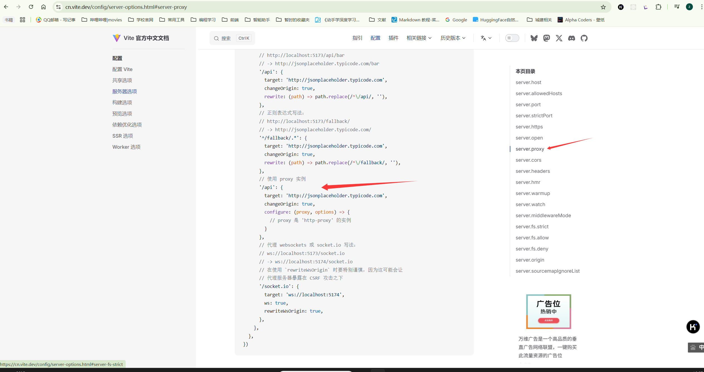

## AJAX

### POST和ge请求有什么区别

`GET` 和 `POST` 是 HTTP 协议中最常用的两种请求方法，它们在功能、用途、安全性和性能等方面存在显著区别。以下是它们的主要区别：

---

1. **用途**

- **GET 请求**：
  - **用途**：用于从服务器**获取资源**，例如请求网页内容、API 数据等。
  - **特点**：GET 请求不会对服务器上的资源进行修改，因此是**幂等的**（即多次请求的结果相同）。

- **POST 请求**：
  - **用途**：用于向服务器**提交数据**，例如提交表单、创建新资源等。
  - **特点**：POST 请求通常会修改服务器上的资源，因此是**非幂等的**（多次请求可能会导致不同的结果）。

---

2. **请求参数的传递方式**

- **GET 请求**：

  - **参数传递**：通过 URL 的查询字符串（`?key=value`）传递参数。
  - **示例**：`https://example.com/data?id=123&name=Kimi`
  - **限制**：由于 URL 的长度有限制（通常在 2048 个字符以内），因此 GET 请求适合传递少量参数。
  - **可见性**：参数直接暴露在 URL 中，容易被用户看到和记录。

- **POST 请求**：

  - **参数传递**：通过请求正文（Body）传递参数，支持多种格式（如 JSON、表单数据等）。

  - **示例**：

    ```http
    POST /api HTTP/1.1
    Host: example.com
    Content-Type: application/json
    {
        "id": 123,
        "name": "Kimi"
    }
    ```

  - **限制**：请求正文的大小通常没有限制，适合传递大量数据。

  - **可见性**：参数隐藏在请求正文中，不会暴露在 URL 中，相对更安全。

---

3. **安全性**

- **GET 请求**：
  - **安全性较低**：由于参数暴露在 URL 中，容易被记录在浏览器历史、服务器日志或网络代理中，不适合传递敏感信息（如密码、个人隐私等）。

- **POST 请求**：
  - **安全性较高**：参数隐藏在请求正文中，不会暴露在 URL 中，相对更安全。但需要注意，POST 请求本身并不加密，数据仍然可能被中间人攻击截获。如果需要更高的安全性，应使用 HTTPS 协议。

---

4. **幂等性**

- **GET 请求**：
  - **幂等的**：多次发送相同的 GET 请求，结果是相同的，不会对服务器产生副作用。

- **POST 请求**：
  - **非幂等的**：多次发送相同的 POST 请求可能会导致不同的结果（例如多次提交表单可能会创建多个资源）。

---

5. **缓存机制**

- **GET 请求**：
  - **可缓存**：由于 GET 请求是幂等的，浏览器和服务器可以对 GET 请求的结果进行缓存，提高性能。

- **POST 请求**：
  - **不可缓存**：POST 请求通常不会被缓存，因为它们可能会修改服务器的状态。

---

6. **收藏和书签**

- **GET 请求**：
  - **可收藏**：由于 GET 请求的 URL 包含所有参数，可以直接被收藏或作为书签使用。

- **POST 请求**：
  - **不可收藏**：POST 请求的参数在请求正文中，无法通过 URL 表示，因此不适合收藏或作为书签。

### 


---

使用场景

- **使用 GET 请求**：
  - 搜索结果页面（如 `https://example.com/search?q=keyword`）。
  - 获取网页内容或 API 数据。
  - 链接（如 `<a href="https://example.com/data?id=123">`）。

- **使用 POST 请求**：
  - 提交表单（如用户注册、登录）。
  - 创建新资源（如上传文件、提交评论）。
  - 修改服务器状态（如更新用户信息）。

---

示例代码

GET 请求示例

```javascript
var xhr = new XMLHttpRequest();
xhr.open("GET", "https://example.com/data?id=123", true);
//监听事件是否发生了改变。
xhr.onreadystatechange = function () {
    if (xhr.readyState === 4 && xhr.status === 200) {
        console.log("Response:", xhr.responseText);
    }
};
xhr.send();
```

POST 请求示例

```javascript
var xhr = new XMLHttpRequest();
xhr.open("POST", "https://example.com/api", true);
xhr.setRequestHeader("Content-Type", "application/json;charset=UTF-8");

var data = JSON.stringify({
    id: 123,
    name: "Kimi"
});
xhr.send(data);
xhr.onreadystatechange = function () {
    if (xhr.readyState === 4 && xhr.status === 200) {
        console.log("Response:", xhr.responseText);
    }
};
```

希望这些信息能帮助你更好地理解 GET 和 POST 请求的区别！

### send()有什么用

在 `XMLHttpRequest` 对象中，`send()` 方法是一个关键的方法，用于实际发送 HTTP 请求。它的作用是将请求发送到服务器，并等待服务器的响应。`send()` 的行为会根据请求的类型（如 GET、POST、PUT 等）和请求的配置（如请求头部、请求正文等）而有所不同。

`send()` 的作用

1. **发送请求**：
   - `send()` 是将客户端的请求发送到服务器的实际动作。在调用 `send()` 之前，你需要通过 `XMLHttpRequest` 对象配置好请求的类型（通过 `open()` 方法）、URL、请求头部等信息。
   - 调用 `send()` 之后，请求会被发送到指定的服务器地址。

2. **处理请求正文**：
   - 对于某些请求类型（如 GET 请求），`send()` 方法通常不需要传递任何参数，因为 GET 请求的参数通常通过 URL 的查询字符串传递。
   - 对于 POST、PUT 等请求，`send()` 方法可以接受一个参数，这个参数是请求的正文（Body）。正文的格式可以是字符串、JSON、表单数据等，具体取决于请求的 `Content-Type`。

3. **触发异步处理**：
   - 如果 `XMLHttpRequest` 是以异步方式配置的（`open()` 方法的第三个参数为 `true`），`send()` 方法会立即返回，而不会等待服务器响应。客户端可以通过监听 `onreadystatechange` 事件或使用 `Promise`（在现代开发中更推荐使用 `fetch` API）来处理服务器的响应。
   - 如果是同步请求（`open()` 方法的第三个参数为 `false`），`send()` 方法会阻塞，直到服务器返回响应。

示例

示例 1：发送 GET 请求

```javascript
var xhr = new XMLHttpRequest();
xhr.open("GET", "https://example.com/data", true); // 异步请求
xhr.onreadystatechange = function () {
    if (xhr.readyState === 4 && xhr.status === 200) {
        console.log("Response:", xhr.responseText);
    }
};
xhr.send(); // 发送 GET 请求，无需传递参数
```

示例 2：发送 POST 请求

```javascript
var xhr = new XMLHttpRequest();
xhr.open("POST", "https://example.com/api", true); // 异步请求
xhr.setRequestHeader("Content-Type", "application/json;charset=UTF-8");
xhr.onreadystatechange = function () {
    if (xhr.readyState === 4 && xhr.status === 200) {
        console.log("Response:", xhr.responseText);
    }
};
var data = JSON.stringify({
    name: "Kimi",
    age: 25
});
xhr.send(data); // 发送 POST 请求，传递 JSON 格式的请求正文
```

`send()` 的参数

- **无参数**：对于 GET 请求，`send()` 不需要参数。
- **有参数**：对于 POST、PUT 等请求，`send()` 可以传递以下类型的参数：
  - **字符串**：如 JSON 格式的字符串。
  - **`FormData` 对象**：用于发送表单数据。
  - **`Blob` 或 `File` 对象**：用于上传文件。
  - **`Document` 对象**：用于发送 XML 数据。

### 同步和异步请求实例



<u>**同步请求场景**</u>

1. **用户登录验证**：
   - 用户在登录页面输入用户名和密码后，点击“登录”按钮。
   - 系统需要立即验证用户名和密码是否正确，并在验证完成后才允许用户继续操作。
   - **同步请求**：系统会等待服务器返回验证结果，期间用户无法进行其他操作，直到验证完成。

2. **数据一致性要求高的场景**：
   - 例如，在银行转账系统中，用户提交转账请求后，必须等待服务器确认转账成功，才能显示转账完成的结果。
   - **同步请求**：确保数据的一致性，用户在等待期间无法进行其他操作，直到服务器返回结果。

3. **表单提交后的确认页面**：
   - 用户填写表单并提交后，系统需要立即处理表单数据，并在处理完成后显示确认页面。
   - **同步请求**：系统会等待服务器处理表单数据，并在处理完成后才显示确认页面，期间用户无法进行其他操作。

***<u>异步请求场景</u>***

1. **搜索建议**：
   - 用户在搜索引擎中输入关键词时，搜索引擎会实时提供搜索建议。
   - **异步请求**：用户输入关键词的同时，系统会异步发送请求到服务器，获取搜索建议，并在用户继续输入时实时更新建议列表，用户可以继续输入，不会感到界面卡顿。

2. **社交媒体动态更新**：
   - 用户在社交媒体平台上浏览动态时，平台会自动加载更多的动态。
   - **异步请求**：用户浏览动态时，系统会异步发送请求到服务器，获取更多的动态数据，并在数据返回后更新页面，用户可以继续浏览，不会感到界面卡顿。

3. **在线购物的实时库存检查**：
   - 用户在在线购物网站上选择商品时，系统会实时检查库存，并显示是否有货。
   - **异步请求**：用户选择商品的同时，系统会异步发送请求到服务器，检查库存，并在数据返回后更新库存显示，用户可以继续浏览商品，不会感到界面卡顿。

4. **网页版的即时通讯工具**：
   - 用户在聊天窗口中发送消息后，系统会实时发送消息并显示对方的回复。
   - **异步请求**：用户发送消息的同时，系统会异步发送请求到服务器，发送消息后，用户可以继续输入其他内容，不会感到界面卡顿。

总结

- **同步请求**：
  - 适用于需要立即获取结果且不允许中断的操作。
  - 例如：用户登录验证、数据一致性要求高的场景、表单提交后的确认页面。
  - 特点：阻塞后续代码执行，界面冻结，用户体验差。

- **异步请求**：
  - 适用于大多数需要后台处理的场景，用户可以继续进行其他操作。
  - 例如：搜索建议、社交媒体动态更新、在线购物的实时库存检查、网页版的即时通讯工具。
  - 特点：不阻塞后续代码执行，界面保持响应，用户体验好。

通过这些现实场景，你可以更好地理解同步和异步请求的区别以及它们的适用场景。

### axios

封装了ajax，简化了操作指令

```
axios.get('http://localhost:5000/students').then(
					response=>{
						console.log('成功了',response.data)
					},
					error=>{
						console.log('失败了',error)
					}
				)
```


```
    mounted(){
    	axios.get('http://localhost:8080/api/students').then(
					response=>{
						console.log('成功了',response.data)
                        this.personList=response.data
                         console.log(this.personList,1)//能够正确打印结果

					},
					error=>{
						console.log('失败了',error)
					}
				)
		console.log(this.personList,1)//不能够正确打印结果，因为axios是一个异步操作，等待服务器返回数据的同时，之后的代码会继续执行，也就是这行语句比axios先执行完。
    },
```


### 跨域

跨域本身是浏览器向服务器请求数据时出现的问题。

以下是一些常见的跨域场景：

- **不同域名**：`http://example.com` 和 `http://anotherexample.com`。
- **不同端口**：`http://example.com:8080` 和 `http://example.com:9090`。
- **不同协议**：`http://example.com` 和 `https://example.com`。

**解决方案：代理服务器**

1.nginx

2.vue-cli开启代理服务器

在vue中配置代理服务器

打开vue-cli官方网站：

#### 使用vue-cli代理：








第二种方式：








#### 使用vite代理：

后端服务器地址：http://localhost:5000//students

浏览器请求地址:http://localhost:5173

代理服务器地址：http://localhost:5173



```
//vite.config.ts
   server: {
      proxy: {
        '/api': {
          target: 'http://localhost:5000', // 后端地址
          changeOrigin: true,
          rewrite: (path) => path.replace(/^\/api/, ''), // 可选：去掉 `/api` 前缀
        },
      },
    },

```

**是否需要保留 `/api`**：

- 如果后端接口本身有 `/api` 前缀（如 `http://localhost:5000/api/students`），则不需要 `rewrite`
- 如果后端接口没有 `/api` 前缀（如 `http://localhost:5000/students`），则需要 `rewrite` 去除前缀

发送数据请求：


```
let getData = () => {
    // http://localhost:5173
    axios.get('/api/students').then(
        res => {
            console.log(res.data, 45667)
        },
        err => {
            console.log(err)
        }
    )
}
```


