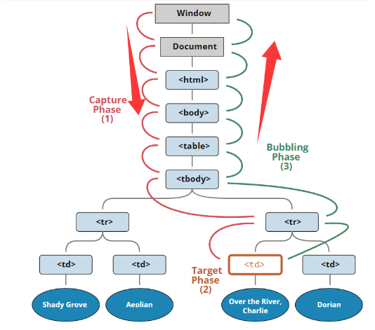

---
title:JavaScript
---

[TOC]


# js

### 1.全局事件对象window

在 JavaScript 中，window 是一个非常重要的全局对象，尤其是在浏览器环境中。它代表了浏览器窗口本身，是浏览器与 JavaScript 交互的核心接口

1. **window 是全局对象**

在浏览器环境中，window 是 JavaScript 的全局对象。这意味着：

- 所有未明确指定作用域的变量和函数都会被挂载到 window 上。
- 如果你在全局作用域中声明了一个变量或函数，它们实际上会成为 window 的属性或方法。

```js
#var a 是函数级或全局级作用域变量，会被提升到全局作用域，并且会成为 window 的属性。
var x = 10;
#let  是块级作用域变量，不会被添加到 window。
let y = 20;
#const 也具有块级作用域，不会被添加到 window。
const z = 30
function sayHello() {
  console.log("Hello!");
}

console.log(window.x); // 输出：10
console.log(window.y); // 输出：undefined
console.log(window.z); // 输出：undefined
console.log(window.sayHello);
//在这个例子中，x 和 sayHello 都是全局变量和函数，它们自动成为 window 的属性和方法
//同样的，如果把，函数sayhello()复制给let、const变量，最后也会输出undefined
```

2. **window 的作用**

window 对象不仅是一个全局作用域的容器，它还提供了许多与浏览器交互的功能。以下是一些常见的用途：

**(1) 浏览器窗口操作**

window 提供了控制浏览器窗口的方法，例如：

- window.open(url)：打开一个新的浏览器窗口。
- window.close()：关闭当前窗口。
- window.resizeTo(width, height)：调整窗口大小。
- window.moveTo(x, y)：移动窗口位置。

**(2) 浏览器状态和导航**

window 还提供了与浏览器状态和导航相关的属性和方法：

- window.location：表示当前页面的 URL，可以用来获取或设置页面地址。
- window.history：提供对浏览器历史记录的访问，例如 history.back() 和 history.forward()。
- window.innerHeight/innerWidth：获取浏览器窗口的内部宽度和高度（不包括工具栏和滚动条）。
- window.outerHeight/outerWidth：获取浏览器窗口的外部宽度和高度（包括工具栏和滚动条）。

**(3) 事件监听**

window 是全局事件的监听器，可以用来监听诸如 load、resize、scroll 等事件：

```js
window.addEventListener("load", function() {
  console.log("页面加载完成");
});
```

------

3. **window 与 this 的关系**

在非严格模式下，如果代码运行在全局作用域中，this 默认指向 window。这也是为什么在非严格模式下，this 被设置为 null 或 undefined 时，会自动指向 window。

**示例：**

```js
function showThis() {
  console.log(this);
}

showThis(); // 非严格模式下输出：Window
showThis.call(null); // 非严格模式下输出：Window，严格模式下为null
```

在严格模式下，this 的行为会有所不同，不会自动指向 window，而是保持为 null 或 undefined。

------

4. **window 的特殊性**

虽然 window 是全局对象，但它也有一些特殊性：

- 它是 Window 构造函数的实例，同时也是 Window 的原型。
- 在浏览器环境中，window 和 globalThis 是等价的，都表示全局对象。

```js
console.log(window === globalThis); // true
```

------

总结

window 是浏览器环境中的全局对象，它不仅是全局变量和函数的容器，还提供了许多与浏览器交互的功能。在非严格模式下，window 是 this 的默认指向，而在严格模式下，this 的行为会更加严格，不会自动指向 window。


### 2.事件对象

```html
<body>
  <button>点击</button>
  <input type="text">
  <script>
    const btn = document.querySelector('button')
    btn.addEventListener('click', function (e) {
      console.log(e.type)//click
    })

    const input = document.querySelector('input')
    input.addEventListener('keyup', function (e) {
      console.log(11)
      console.log(e.key,e.type)//按下按钮的按键   keyup
      if (e.key === 'Enter') {
        console.log('我按下了回车键')
      }
    })
    const btn = document.querySelector('button')
    btn.addEventListener('click',(e)=>{
        console.log(e.target) //<button>点击</button>
    })
  </script>
</body>
```

事件对象（通常命名为 `e` 或 `event`）是浏览器在触发事件时自动创建的一个对象，它包含了与事件相关的所有信息。无论是点击、键盘输入、鼠标移动还是其他事件，事件对象都会提供关键的上下文数据。

一、**事件对象的作用**

事件对象 `e` 主要用于：

1. **获取事件信息**：如触发事件的元素、事件类型、坐标、按键等。
2. **控制事件行为**：阻止默认行为（如禁止表单提交）、停止事件传播（阻止冒泡）。
3. **处理事件细节**：如判断是否按下了 `Shift` 键、鼠标左键还是右键。

**二、事件对象的获取**

在事件处理函数中，浏览器会 **自动传递事件对象** 作为第一个参数。你需要通过形参（如 `e`）来接收它。

javascript

```javascript
button.addEventListener("click", function(e) {
  console.log(e); // 事件对象
});
```

**三、事件对象的常见属性和方法**

**1. 通用属性**

|       属性/方法       |                             说明                             |
| :-------------------: | :----------------------------------------------------------: |
|      `e.target`       | **实际触发事件的元素**，包含儿子，孙子。。。（事件发生的源头，可能在冒泡阶段变化） |
|   `e.currentTarget`   |   **当前处理事件的元素**（绑定事件的元素，与 `this` 相同）   |
|       `e.type`        |            事件类型（如 `"click"`、`"keydown"`）             |
| `e.preventDefault()`  |         **阻止默认行为**（如禁止链接跳转、表单提交）         |
| `e.stopPropagation()` |            **停止事件传播**（阻止事件冒泡或捕获）            |
|      `e.bubbles`      |                        事件是否会冒泡                        |

**2. 鼠标事件特有属性**

|            属性            |                         说明                          |
| :------------------------: | :---------------------------------------------------: |
| `e.clientX` / `e.clientY`  |           鼠标相对于 **浏览器窗口** 的坐标            |
|   `e.pageX` / `e.pageY`    |    鼠标相对于 **整个文档** 的坐标（包含滚动偏移）     |
|         `e.button`         | 按下的鼠标按钮：`0`（左键）、`1`（中键）、`2`（右键） |
| `e.ctrlKey` / `e.shiftKey` |            是否按下了 `Ctrl` 或 `Shift` 键            |

------

**3. 键盘事件特有属性**

|           属性           |                         说明                         |
| :----------------------: | :--------------------------------------------------: |
|         `e.key`          |       按下的键的字符值（如 `"a"`、`"Enter"`）        |
|         `e.code`         |     按下的键的物理键码（如 `"KeyA"`、`"Enter"`）     |
| `e.altKey` / `e.metaKey` | 是否按下了 `Alt` 或 `Meta` 键（Mac 的 `Command` 键） |

**四、事件对象的使用场景**

**1. 阻止默认行为**

html

```html
<a href="https://example.com" id="link">点击我</a>
<script>
  document.getElementById("link").addEventListener("click", function(e) {
    e.preventDefault(); // 禁止跳转
    console.log("链接点击被阻止");
  });
</script>
```

------

**2. 停止事件冒泡*

```html
<div id="parent">
  <button id="child">点击我</button>
</div>
<script>
  document.getElementById("parent").addEventListener("click", function() {
    console.log("父元素被点击");
  });

  document.getElementById("child").addEventListener("click", function(e) {
    e.stopPropagation(); // 阻止事件冒泡到父元素
    console.log("子元素被点击");
  });
</script>
```

------

**3. 获取事件目标**

html

```html
<ul id="list">
  <li>项目1</li>
  <li>项目2</li>
</ul>
<script>
  document.getElementById("list").addEventListener("click", function(e) {
    // 点击 li 时，e.target 是 li，e.currentTarget 是 ul
    console.log("点击的元素：", e.target.tagName); // 输出 "LI"
    console.log("绑定事件的元素：", e.currentTarget.tagName); // 输出 "UL"
  });
</script>
```

------

**4. 处理键盘输入**

javascript

```javascript
document.addEventListener("keydown", function(e) {
  if (e.key === "Enter") {
    console.log("按下了回车键");
  }
});
```

**五、事件对象的注意事项**

**1. 事件对象的兼容性**

- 现代浏览器均支持标准事件对象，但旧版 IE（IE8 及以下）使用

  ```
  window.event
  ```

  ```javascript
  function handleClick(e) {
    e = e || window.event; // 兼容旧版 IE
    console.log(e);
  }
  ```

------

**2. 箭头函数中的 `this` 与 `e.currentTarget`**

在箭头函数中，`this` 不会指向绑定事件的元素，但 `e.currentTarget` 仍然有效：

```javascript
button.addEventListener("click", (e) => {
  console.log(this); // 可能是 window 或外层 this
  console.log(e.currentTarget); // 正确指向 button 元素
});
```

------

**3. 事件委托中的 `e.target`**

在事件委托（利用冒泡）时，通过 `e.target` 精准定位实际触发事件的子元素：

```html
<ul id="menu">
  <li>菜单1</li>
  <li>菜单2</li>
</ul>
<script>
  document.getElementById("menu").addEventListener("click", function(e) {
    if (e.target.tagName === "LI") {
      console.log("点击了菜单项：", e.target.textContent);
    }
  });
</script>
```

------

**六、总结表**

|        功能        |         属性/方法          |                  示例                  |
| :----------------: | :------------------------: | :------------------------------------: |
|    获取触发元素    |         `e.target`         |       `console.log(e.target.id)`       |
| 获取绑定事件的元素 |     `e.currentTarget`      | `console.log(e.currentTarget.tagName)` |
|    阻止默认行为    |    `e.preventDefault()`    |              禁止表单提交              |
|    停止事件传播    |   `e.stopPropagation()`    |           防止父元素收到事件           |
|     判断组合键     | `e.ctrlKey` / `e.shiftKey` |   `if (e.ctrlKey && e.key === 's')`    |

### 3.this的指向问题

在 JavaScript 中，`this` 的指向是动态绑定的，普通函数和箭头函数在处理 `this` 时有本质区别。以下将从 **底层机制**、**使用场景**、**代码表现** 三个维度详细解析它们的差异。

---

#### 一、普通函数的 `this` 指向规则

普通函数的 `this` 在 **调用时确定**，遵循 **“谁调用，指向谁”** 的规则。具体可分为以下场景：

1. **全局调用**  

函数在全局作用域中被直接调用时，`this` 指向全局对象（浏览器中为 `window`，Node.js 中为 `global`）。

```javascript
function showThis() {
  console.log(this); // window（严格模式下为 undefined）
}
showThis(); // 等同于 window.showThis()
```

2. **对象方法调用**  

函数作为对象的方法被调用时，`this` 指向 **调用该方法的对象**。

```javascript
const obj = {
  name: "Alice",
  greet: function() {
    console.log(this.name); // "Alice"
  }
};
obj.greet();
```

3. **构造函数调用**  

通过 `new` 关键字调用函数时，`this` 指向 **新创建的实例对象**。

```javascript
function Person(name) {
  this.name = name; // this 指向新实例
}
const person = new Person("Bob");
console.log(person.name); // "Bob"
```

4. **通过 `call`/`apply`/`bind` 显式绑定**  

可以通过这些方法强制修改 `this` 的指向。

```javascript
function sayHi() {
  console.log(this.name);
}
const user = { name: "Charlie" };
sayHi.call(user); // "Charlie"
```

5. **DOM 事件处理函数**  

在事件监听器中，`this` 默认指向 **触发事件的 DOM 元素**。

```javascript
button.addEventListener("click", function() {
  console.log(this); // 指向 button 元素
});
```

---

#### 二、箭头函数的 `this` 指向规则

箭头函数 **没有自己的 `this`**，它会继承定义时 **外层作用域的 `this`**，且 **无法被修改**（如 `call`/`apply`/`bind` 无效）。

1. **词法作用域继承**  

箭头函数的 `this` 在 **定义时** 确定，与调用方式无关。

字面量{}不会创建作用域，所以该this指向更外层的window

```javascript
const obj = {
  name: "David",
  greet: () => {
    console.log(this.name); // window（因为外层是全局作用域）
  }
};
obj.greet(); // 输出 undefined（如果全局没有 name 属性）
```

2. **嵌套函数中的表现**  

当箭头函数嵌套在普通函数中时，继承外层普通函数的 `this`。

创建函数的时候会创建作用域。

```javascript
const obj = {
  name: "Eve",
  greet: function() {
    const inner = () => {
      console.log(this.name); // "Eve"（继承 greet 函数的 this）
    };
    inner();
  }
};
obj.greet();
```

3. **DOM 事件监听器的陷阱**  

在事件监听器中使用箭头函数时，`this` 不会指向 DOM 元素。

```javascript
button.addEventListener("click", () => {
  console.log(this); // 指向外层作用域的 this（通常是 window）
});
```

4. **无法通过 `call`/`apply`/`bind` 修改**  

箭头函数的 `this` 固定，无法动态改变。

```javascript
const showThis = () => console.log(this);
showThis.call({ name: "Frank" }); // 依然指向外层 this
```

---

总结：箭头函数的this与其外层的作用域this指向一致

三、核心差异对比表

| **特征**                | **普通函数**                               | **箭头函数**                         |
| ----------------------- | ------------------------------------------ | ------------------------------------ |
| **`this` 绑定时机**     | 运行时动态绑定                             | 定义时静态继承外层 `this`            |
| **能否修改 `this`**     | 可以（通过 `call`/`apply`/`bind`/`new`）   | 不能                                 |
| **适用场景**            | 对象方法、构造函数、需要动态 `this` 的场景 | 回调函数、需要固定 `this` 的闭包场景 |
| **是否可用作构造函数**  | 是                                         | 否（没有 `prototype`，无法 `new`）   |
| **严格模式下的 `this`** | 可以是任意值                               | 同普通函数的外层作用域 `this`        |

---

四、常见使用场景与陷阱

1. **正确使用箭头函数的场景**

• **需要固定 `this` 的回调函数**（如定时器、Promise）：

  ```javascript
class Timer {
  constructor() {
    this.seconds = 0;
    setInterval(() => {
      this.seconds++; // 正确继承外层 this（Timer 实例）
    }, 1000);
  }
}
  ```

• **简化闭包中的 `this` 处理**：

  ```javascript
const obj = {
  values: [1, 2, 3],
  process: function() {
    this.values.forEach((value) => {
      console.log(value, this); // this 指向 obj
    });
  }
};
  ```

2. **避免箭头函数的场景**

• **对象方法**（除非明确需要继承外层 `this`）：

  ```javascript
// 错误示例
const counter = {
  count: 0,
  increment: () => {
    this.count++; // this 指向 window（预期是 counter）
  }
};
  ```

• **DOM 事件监听器**（需访问触发元素）：

  ```javascript
// 错误示例
button.addEventListener("click", () => {
  this.style.color = "red"; // this 指向 window（无法操作元素）
});
  ```

3. **严格模式下的特殊表现**

普通函数在严格模式中，全局调用的 `this` 为 `undefined`，而箭头函数仍继承外层 `this`：

```javascript
"use strict";
function normalFunc() {
  console.log(this); // undefined
}
const arrowFunc = () => {
  console.log(this); // window（严格模式不影响箭头函数）
};
normalFunc();
arrowFunc();
```

---

五、总结

• **普通函数**：`this` 动态绑定，适用于需要灵活 `this` 的场景（如对象方法、构造函数）。
• **箭头函数**：`this` 静态继承，适用于固定 `this` 的场景（如闭包、回调函数），但需注意外层作用域的 `this` 是否符合预期。

理解两者的差异，能帮助你在代码中精准控制 `this` 的指向，避免因作用域问题导致的 Bug。


### 4.关于回调函数

好的！回调函数是 JavaScript 中非常重要的编程模式，尤其在异步操作、事件处理和高阶函数中广泛应用。以下是回调函数的核心应用场景和注意事项，结合代码示例和常见问题展开说明：

------

**回调函数是什么？**

回调函数（Callback）是一个 **作为参数传递给其他函数的函数**，它会在特定条件（如异步操作完成、事件触发、任务结束）时被调用。

```js
// 示例：一个简单回调函数
function doSomething(callback) {
  // 模拟耗时操作
  setTimeout(() => {
    callback("操作完成！");
  }, 1000);
}

---------------调用-----------------
let callback=function(result){
    console.log(result)
}
doSomething(callback)
----------------调用（简化方式）---------------
doSomething((result) => {
  console.log(result); // 1秒后输出："操作完成！"
});

```

**回调函数处理场景**

1.异步操作

处理需要等待的任务（如网络请求、文件读写、定时器）。

```js
// 模拟网络请求
function fetchData(url, successCallback, errorCallback) {
  setTimeout(() => {
    const data = { id: 1, name: "Alice" };
    const error = Math.random() > 0.5 ? null : "请求失败";
    error ? errorCallback(error) : successCallback(data);
  }, 1000);
}

fetchData(
  "https://api.example.com",
  (data) => console.log("成功:", data),
  (err) => console.error("失败:", err)
);
```

2.事件监听

处理用户交互（点击、滚动等）或系统事件（如页面加载完成）。

```js
document.addEventListener("click", function(event) {
  console.log("点击坐标:", event.clientX, event.clientY);
});
```

3.高阶函数

对数组、对象等进行遍历或处理逻辑时，传递回调函数。

```js
// 同步回调示例
const numbers = [1, 2, 3];
#此处是调用forEach()函数，numbers如何将一个个内容传递到函数内，的查看源码
numbers.forEach((num) => console.log(num * 2)); // 输出：2, 4, 6
```

forEach的执行逻辑大致为：

```js
Array.prototype.myForEach = function(callback, thisArg) {
  // 1. 检查 this 是否是合法对象
  if (this == null) {
    throw new TypeError("Array.prototype.forEach called on null or undefined");
  }

  // 2. 检查 callback 是否是函数
  if (typeof callback !== "function") {
    throw new TypeError(callback + " is not a function");
  }

  // 3. 将 this 转换为对象（处理原始类型的数组）
  const array = Object(this);
  
  // 4. 获取数组长度（处理可能被修改的 length）
  const length = array.length >>> 0; // 无符号右移确保为整数

  // 5. 遍历数组
  let index = 0;
  while (index < length) {
    // 跳过空位（稀疏数组的空槽，如 [1, , 3]）
    if (index in array) {
      // 调用回调函数，传递三个参数：
      // 当前元素、索引、原数组
      callback.call(
        thisArg,              // 绑定的 this
        array[index],         // 元素值
        index,                // 索引
        array                 // 原数组
      );
    }
    index++;
  }
};
```


### 5. .call()函数

`.call()` 是 JavaScript 中函数对象的一个方法，它的核心作用是 **显式指定函数执行时的 `this` 指向**，并允许你传递参数。

**.call()的作用**

**1. 改变函数内部的 `this` 指向**

JavaScript 中，函数内部的 `this` 默认指向调用它的对象。但通过 `.call()`，你可以强制让函数中的 `this` 指向任意对象

```js
const person = {
  name: "小明",
  sayHi: function() {
    console.log("你好，我是" + this.name);
  }
};
const anotherPerson = { name: "小红" };
// 默认调用：this 指向 person
person.sayHi(); // 输出："你好，我是小明"
// 用 .call() 让 this 指向 anotherPerson
person.sayHi.call(anotherPerson); // 输出："你好，我是小红"
```

**2. 借用其他对象的方法**

如果一个对象没有某个方法，但另一个对象有，可以通过 `.call()` “借用”。

```js
const dog = {
  sound: "汪汪",
  makeSound: function() {
    console.log(this.sound);
  }
};

const cat = {
  sound: "喵喵"
};

// 狗的方法借给猫用
dog.makeSound.call(cat); // 输出："喵喵"
```

**3. 传递参数**

`.call()` 的第一个参数是 `this` 指向的对象，后续参数可以逐个传递给函数。

```js
function introduce(greeting, punctuation) {
  console.log(greeting + "，我是" + this.name + punctuation);
}

const user = { name: "张三" };

introduce.call(user, "你好", "！"); 
// 输出："你好，我是张三！"
```

好的！`.call()` 是 JavaScript 中函数对象的一个方法，它的核心作用是 **显式指定函数执行时的 `this` 指向**，并允许你传递参数。下面我会用通俗易懂的语言和示例讲解它的作用、用法和注意事项。

------

**一、`.call()` 的作用**

**1. 改变函数内部的 `this` 指向**

JavaScript 中，函数内部的 `this` 默认指向调用它的对象。但通过 `.call()`，你可以强制让函数中的 `this` 指向任意对象。

**示例**：

javascript

```javascript
const person = {
  name: "小明",
  sayHi: function() {
    console.log("你好，我是" + this.name);
  }
};

const anotherPerson = { name: "小红" };

// 默认调用：this 指向 person
person.sayHi(); // 输出："你好，我是小明"

// 用 .call() 让 this 指向 anotherPerson
person.sayHi.call(anotherPerson); // 输出："你好，我是小红"
```

------

**2. 借用其他对象的方法**

如果一个对象没有某个方法，但另一个对象有，可以通过 `.call()` “借用”。

**示例**：

javascript

```javascript
const dog = {
  sound: "汪汪",
  makeSound: function() {
    console.log(this.sound);
  }
};

const cat = {
  sound: "喵喵"
};

// 狗的方法借给猫用
dog.makeSound.call(cat); // 输出："喵喵"
```

------

**3. 传递参数**

`.call()` 的第一个参数是 `this` 指向的对象，后续参数可以逐个传递给函数。

**示例**：

javascript

```javascript
function introduce(greeting, punctuation) {
  console.log(greeting + "，我是" + this.name + punctuation);
}

const user = { name: "张三" };

introduce.call(user, "你好", "！"); 
// 输出："你好，我是张三！"
```

------

**二、`.call()` 的基本语法**

```
函数名.call(this指向的对象, 参数1(指的是传递个函数的参数), 参数2, ...);
```

**三、注意事项**

**1. 如果不需要改变 `this`，可以传 `null` 或 `undefined`**

如果函数不依赖 `this`，可以用 `.call(null)` 或 `.call(undefined)`，此时 `this` 在非严格模式下指向全局对象（如 `window`），严格模式下为 `null`/`undefined`

```
function showMessage() {
  console.log(this); // 非严格模式输出：window；严格模式输出：null
}

showMessage.call(null);
```

**2. 不要遗漏 `this` 参数**

如果忘记传递 `this` 指向的对象，函数中的 `this` 可能指向全局对象（如浏览器中的 `window`），导致意外行为。

**错误示例**：

javascript

```javascript
//const是块级，不属于window，只有var属于
const data = { value: 100 };

function printValue() {
  console.log(this.value); 
}

printValue.call(); // 输出：undefined（严格模式）或 window.value（非严格模式）
```

**正确做法**：

javascript

```javascript
printValue.call(data); // 输出：100
```

**3. 箭头函数无法通过 `.call()` 改变 `this`**

箭头函数的 `this` 在定义时就已经固定，无法通过 `.call()` 修改。

```js
const obj = { name: "对象" };
const arrowFunc = () => {
  console.log(this.name); // 箭头函数的 this 指向外层作用域的 this
};
arrowFunc.call(obj); // 输出：外层 this 的 name（如全局的 name，可能为 undefined）
```

**四、常见使用场景**

**1. 调用数组方法处理类数组对象**

类数组对象（如 `arguments`、DOM 元素集合）没有数组方法，可以通过 `.call()` 借用。

```javascript
function sumArguments() {
  // 将 arguments 转为数组，再用 reduce 求和
  const argsArray = Array.prototype.slice.call(arguments);
  return argsArray.reduce((sum, num) => sum + num, 0);
}

console.log(sumArguments(1, 2, 3)); // 输出：6
```

------

**2. 实现链式调用**

在自定义对象中，通过返回 `this` 实现链式调用。

```javascript
const calculator = {
  value: 0,
  add: function(num) {
    this.value += num;
    return this; // 返回 this 以便链式调用
  },
  multiply: function(num) {
    this.value *= num;
    return this;
  }
};

calculator.add(5).multiply(2).add(3);
console.log(calculator.value); // 输出：(5 * 2) + 3 = 13
```

### 6.添加事件监听的方法

**1. 使用 `addEventListener` 方法**

`addEventListener` 是现代 JavaScript 中推荐的事件监听方式，它允许为元素添加多个事件监听器，并且可以灵活控制事件的捕获和冒泡阶段。

```javascript
element.addEventListener(eventType, eventListener, options);
```

- **`eventType`**：事件类型，如 `"click"`、`"mouseover"` 等。
- **`eventListener`**：事件处理函数，当事件触发时执行。
- **`options`**：可选参数，可以是一个布尔值或一个对象，用于控制事件的捕获阶段、是否只触发一次等。

示例：

```javascript
const button = document.querySelector("button");
// 添加点击事件监听器
button.addEventListener("click", () => {
  console.log("按钮被点击了！");
});
// 使用选项对象
button.addEventListener("click", () => {
  console.log("这个事件监听器只会触发一次");
}, { once: true }); // 事件监听器只触发一次后自动移除
```

**2. 使用 `on[event]` 属性**

在 HTML 元素上直接使用 `on[event]` 属性来绑定事件监听器。这种方式是早期 JavaScript 的事件绑定方式，但仍然被广泛使用。

```html
<button onclick="handleClick()">点击我</button>
<script>
  function handleClick() {
    console.log("按钮被点击了！");
  }
</script>
```

或者通过 JavaScript 设置：

```javascript
const button = document.querySelector("button");
button.onclick = function() {
  console.log("按钮被点击了！");
```

**4. 使用事件委托**

事件委托是一种高效的事件处理方式，它利用事件冒泡机制，将事件监听器绑定到父级元素上，而不是直接绑定到每个子元素上。这种方式可以减少事件监听器的数量，并且可以动态处理新增的子元素。


```html
<ul id="list">
  <li>项目 1</li>
  <li>项目 2</li>
  <li>项目 3</li>
</ul>
<script>
  const list = document.getElementById("list");

  list.addEventListener("click", function(event) {
    if (event.target.tagName === "LI") {
      console.log("点击的项目是：" + event.target.textContent);
    }
  });
</script>
```

特点：

1. **高效**：减少事件监听器的数量，提高性能。
2. **动态处理**：可以处理动态添加的子元素，而无需重新绑定事件。
3. **利用事件冒泡**：基于事件冒泡机制实现。

**5. 使用现代框架或库的事件绑定方式**

在现代前端开发中，通常会使用框架（如 Vue、React、Angular）或库（如 jQuery）来简化事件绑定。

**Vue 示例：**

```vue
<template>
  <button @click="handleClick">点击我</button>
</template>

<script>
export default {
  methods: {
    handleClick() {
      console.log("按钮被点击了！");
    }
  }
};
</script>
```


### 7.关于事件监听参数

**elem.addEventListener("click", showTagName, true)事件监听第三个参数有什么作用**




`addEventListener` 方法的第三个参数用于控制事件监听的阶段。具体来说，这个参数可以是一个布尔值或一个对象，用来指定事件监听器是在捕获阶段、冒泡阶段还是两者都监听。

1. **布尔值参数**

- **`true`**：表示事件监听器会在事件的**捕获阶段**触发。
- **`false`**：表示事件监听器会在事件的**冒泡阶段**触发（这是默认行为）。

2. **事件传播的三个阶段**

- **捕获阶段**：事件从 `window` 开始，逐级向下传播到目标元素。
- **目标阶段**：事件到达目标元素。
- **冒泡阶段**：事件从目标元素逐级向上传播到 `window`

4. **对象参数**

从 ECMAScript 2015（ES6）开始，`addEventListener` 的第三个参数也可以是一个对象，例如

```
elem.addEventListener("click", showTagName, {
    capture: true, // 等同于第三个参数为 true
    once: true,    // 表示事件监听器只触发一次后自动移除
    passive: true  // 表示事件监听器不会调用 preventDefault()
});
```

- **`capture`**：布尔值，等同于直接传入 `true` 或 `false`。
- **`once`**：布尔值，表示事件监听器只触发一次后自动移除。
- **`passive`**：布尔值，表示事件监听器不会调用 `preventDefault()`，主要用于优化滚动事件等。

```js
<div id="outer">
  <div id="middle">
    <div id="inner">点击我</div>
  </div>
</div>
const outer = document.getElementById("outer");
const middle = document.getElementById("middle");
const inner = document.getElementById("inner");

// 捕获阶段的事件监听器
outer.addEventListener("click", () => {
  console.log("Outer - 捕获阶段");
}, true); // 第三个参数为 true，表示在捕获阶段触发

middle.addEventListener("click", () => {
  console.log("Middle - 捕获阶段");
}, true);

inner.addEventListener("click", () => {
  console.log("Inner - 捕获阶段");
}, true);

// 冒泡阶段的事件监听器
outer.addEventListener("click", () => {
  console.log("Outer - 冒泡阶段");
}, false); // 第三个参数为 false（或省略），表示在冒泡阶段触发

middle.addEventListener("click", () => {
  console.log("Middle - 冒泡阶段");
}, false);

inner.addEventListener("click", () => {
  console.log("Inner - 冒泡阶段");
}, false);
输出：
Outer - 捕获阶段
Middle - 捕获阶段
Inner - 捕获阶段
Inner - 冒泡阶段
Middle - 冒泡阶段
Outer - 冒泡阶段
```

**制止传播冒泡**

```html
<!DOCTYPE html>
<html lang="en">
<head>
    <meta charset="UTF-8">
    <title>JavaScript</title>
    <style type="text/css">
        div, p, a {
            padding: 15px 30px;
            display: block;
            border: 2px solid #000;
            background: #fff;
        }
    </style>
</head>
<body>
    <div id="wrap">DIV
        <p class="hint">P
            <a href="#">A</a>
        </p>
    </div>
    <script>
        function showAlert(event) {
            alert("您点击了 "+ this.tagName + " 标签");
            event.stopPropagation();
        }

        var elems = document.querySelectorAll("div, p, a");
        for(let elem of elems) {
            elem.addEventListener("click", showAlert);
        }
    </script>
</body>
</html>以上代码stopPropagarion会作用于哪一层，输出结果是什么
```

每个元素（`div`、`p` 和 `a`）都绑定了一个点击事件监听器 `showAlert`，该函数会弹出一个提示框显示当前点击的元素标签名，并调用 `event.stopPropagation()`。

事件传播过程

1. **点击 `<a>` 标签**：
   - 事件首先触发 `<a>` 标签上的事件监听器。
   - 弹出提示框：“您点击了 A 标签”。
   - `event.stopPropagation()` 被调用，阻止事件继续向上传播到 `<p>` 和 `<div>`。
2. **点击 `<p>` 标签**：
   - 事件触发 `<p>` 标签上的事件监听器。
   - 弹出提示框：“您点击了 P 标签”。
   - `event.stopPropagation()` 被调用，阻止事件继续向上传播到 `<div>`。
3. **点击 `<div>` 标签**：
   - 事件触发 `<div>` 标签上的事件监听器。
   - 弹出提示框：“您点击了 DIV 标签”。
   - `event.stopPropagation()` 被调用，但因为这是最外层的元素，没有更高层级的元素可以阻止传播。

输出结果:

根据上述分析，输出结果如下：

1. 如果你点击 `<a>` 标签：
   - 弹出框显示：“您点击了 A 标签”。
   - 不会触发 `<p>` 和 `<div>` 的事件监听器。
2. 如果你点击 `<p>` 标签：
   - 弹出框显示：“您点击了 P 标签”。
   - 不会触发 `<div>` 的事件监听器。
3. 如果你点击 `<div>` 标签：
   - 弹出框显示：“您点击了 DIV 标签”。
   - 不会触发更高层级的事件监听器（因为没有更高层级的元素）。

### 8.获取children的多种方式

```html
<ul>
	<li></li>
	<li></li>
	<li></li>    
	<li></li>
	<li></li>
	<li></li>     
</ul>
```


方法 1：使用 `children` 属性

`children` 属性返回一个 HTMLCollection，包含元素的所有子元素。你可以通过索引访问特定的子元素并删除它。

示例代码：

```javascript
const theUl = document.querySelector("ul"); // 获取 ul 元素

// 删除第 4 个 li（索引从 0 开始，第 4 个的索引是 3）
theUl.children[3].remove();
```

方法 2：使用 `querySelectorAll` 和索引

你也可以通过 `querySelectorAll` 获取所有 `li` 元素，然后通过索引删除指定的元素。

示例代码：

```javascript
const theUl = document.querySelector("ul"); // 获取 ul 元素
const lis = theUl.querySelectorAll("li"); // 获取所有 li 元素

// 删除第 4 个 li（索引从 0 开始）
lis[3].remove();
```

方法 3：使用 `children` 和 `forEach`（适用于动态删除）

如果你需要根据条件动态删除某个 `li`，可以结合 `forEach` 或 `for` 循环。

示例代码：

```javascript
const theUl = document.querySelector("ul"); // 获取 ul 元素

// 删除第 4 个 li（索引从 0 开始）
Array.from(theUl.children).forEach((li, index) => {
  if (index === 3) {
    li.remove();
  }
});
```

### 9.一些函数


在 JavaScript 中，`filter`、`map` 和 `forEach` 都是数组的高阶函数（Higher-Order Functions），但它们的作用和返回值有显著区别。以下是三者的详细对比和使用场景：

---

**核心区别速查表**

| 方法        | 用途                   | 返回值      | 是否修改原数组 | 适用场景                           |
| ----------- | ---------------------- | ----------- | -------------- | ---------------------------------- |
| `forEach()` | **遍历数组并执行操作** | `undefined` | ❌              | 执行副作用（如修改元素、日志输出） |
| `map()`     | **映射数组到新数组**   | 新数组      | ❌              | 数据转换（一对一映射）             |
| `filter()`  | **筛选符合条件的元素** | 新数组      | ❌              | 数据过滤（根据条件保留元素）       |

---

#### **1. `forEach()`**

用途

• 遍历数组，为每个元素执行回调函数（通常用于副作用操作）。
• **不返回任何值，undifined**，直接修改原数组或执行其他操作。

语法

```javascript
array.forEach((element, index, array) => { /* ... */ }, thisArg);
```

示例

```javascript
const numbers = [1, 2, 3];

// 修改原数组元素
numbers.forEach((num, index, arr) => {
  arr[index] = num * 2;
});
console.log(numbers); // [2, 4, 6]

// 执行其他操作（如日志输出）
numbers.forEach(num => console.log(num)); // 输出 2, 4, 6
```

forEach的执行逻辑大致为：

```js
Array.prototype.myForEach = function(callback, thisArg) {
  // 1. 检查 this 是否是合法对象
  if (this == null) {
    throw new TypeError("Array.prototype.forEach called on null or undefined");
  }

  // 2. 检查 callback 是否是函数
  if (typeof callback !== "function") {
    throw new TypeError(callback + " is not a function");
  }

  // 3. 将 this 转换为对象（处理原始类型的数组）
  const array = Object(this);
  
  // 4. 获取数组长度（处理可能被修改的 length）
  const length = array.length >>> 0; // 无符号右移确保为整数

  // 5. 遍历数组
  let index = 0;
  while (index < length) {
    // 跳过空位（稀疏数组的空槽，如 [1, , 3]）
    if (index in array) {
      // 调用回调函数，传递三个参数：
      // 当前元素、索引、原数组
      callback.call(
        thisArg,              // 绑定的 this
        array[index],         // 元素值
        index,                // 索引
        array                 // 原数组
      );
    }
    index++;
  }
};
```


特点

• **无法中途终止**：不能用 `break` 或 `return` 终止循环。
• **适合场景**：不需要返回新数组的遍历操作（如 DOM 操作、API 调用）。

---

#### **2. `map()`**

用途

• 遍历数组，将每个元素映射为新值，返回新数组。
• **不修改原数组**，适合纯函数场景。,可以自己设置返回值

语法

```javascript
const newArray = array.map((element, index, array) => { /* ... */ }, thisArg);
```

示例

```javascript
const numbers = [1, 2, 3];

// 转换为新数组
const doubled = numbers.map(num => num * 2);
console.log(doubled); // [2, 4, 6]
console.log(numbers); // [1, 2, 3]（原数组未变）

// 提取对象属性
const users = [
  { id: 1, name: "Alice" },
  { id: 2, name: "Bob" }
];
const names = users.map(user => user.name);
console.log(names); // ["Alice", "Bob"]
```

特点

• **必须返回值**：回调函数需返回新元素，否则新数组对应位置为 `undefined`。
• **适合场景**：数据清洗、格式转换、提取子集。

---

#### **3. `filter()`**

用途

• 筛选数组中符合条件的元素，返回新数组。
• **不修改原数组**，适合数据过滤。

语法

```javascript
const newArray = array.filter((element, index, array) => { /* ... */ }, thisArg);
```

示例

```javascript
const numbers = [1, 2, 3, 4, 5];

// 筛选偶数
const evens = numbers.filter(num => num % 2 === 0);
console.log(evens); // [2, 4]

// 筛选对象属性
const users = [
  { id: 1, age: 25 },
  { id: 2, age: 17 }
];
const adults = users.filter(user => user.age >= 18);
console.log(adults); // [{ id: 1, age: 25 }]
```

filter的大致执行逻辑是：

```
Array.prototype.filter = function (cb) {
  // TODO：待补充代码
  console.log(this)
  let index = 0
  let arr =[]
  while(index < this.length){
    if(cb(this[index])){
      console.log(arr.push(this[index]))
    }
    index++
  }
  return arr
};


 let newcardList = cardList.filter(
   (item) => item.category == "werewolf"
 );
```

```
更简洁的写法：
Array.prototype.myarray = function (cb) {
  return this.reduce((total,cur) => cb(cur) ? total.push(cur) && total : total,[])
};
// total.push(cur) && total:total.push(cur)返回的是total数组的长度，&&运算符规则是：若第一个表达式为真，则返回第二个表达式的值，如果为假的话，则返回第一个表达式的值。代码要实现的就是返回的是更新后的数组total
```


特点

• **返回布尔值**：回调函数返回 `true` 保留元素，`false` 丢弃。
• **适合场景**：条件筛选、数据去重（结合 `indexOf` 或 `Set`）。

---

**常见组合用法**

链式调用（Chaining）

```javascript
const products = [
  { name: "Laptop", price: 1000, stock: 5 },
  { name: "Phone", price: 500, stock: 0 },
  { name: "Tablet", price: 300, stock: 2 }
];

// 筛选有库存的商品 → 提取名称 → 遍历输出
products
  .filter(product => product.stock > 0)
  .map(product => product.name)
  .forEach(name => console.log(name)); // 输出 "Laptop", "Tablet"
```

---

**注意事项**

1. **引用类型数据**  
   • `map` 和 `filter` 返回的新数组中的对象是原数组的引用（浅拷贝）。

   ```javascript
   const items = [{ value: 1 }];
   const newItems = items.map(item => item);
   newItems[0].value = 100;
   console.log(items[0].value); // 100（原数组被修改）
   ```

2. **性能差异**  
   • `forEach` 通常比 `for` 循环慢，但在可读性要求高时优先使用。
   • 大数据量时，链式调用 `map` + `filter` 可能生成中间数组，可改用 `reduce` 优化。

3. **空元素处理**  
   • 稀疏数组（如 `[1, , 3]`）中，空元素会被跳过。

   ```javascript
   const arr = [1, , 3];
   arr.forEach(num => console.log(num)); // 输出 1, 3
   ```

---

**总结**

• **`forEach`**：遍历数组并执行操作，无返回值。
• **`map`**：映射数组到新数组，适合数据转换。
• **`filter`**：筛选符合条件的元素，适合数据过滤。

根据需求选择方法：
• 需要修改原数组 → `forEach`
• 需要生成新数组 → `map` 或 `filter`
• 需要组合操作 → 链式调用 `map` + `filter` + `reduce`

#### 4. eval()

在JavaScript中，`eval()` 是一个全局函数，用于将传入的字符串作为代码动态执行。它的主要用途和特点如下：

---

**1. 动态执行代码字符串**

`eval()` 会将传入的字符串当作 JavaScript 代码执行：

```javascript
const code = 'console.log("Hello, world!")';
eval(code); // 输出: Hello, world!
```

---

**2. 访问或修改当前作用域**

`eval()` 执行的代码能访问和修改当前作用域的变量：

```javascript
let x = 10;
eval('x += 5;');
console.log(x); // 输出: 15
```

**注意**：在严格模式（`'use strict'`）下，`eval()` 会创建自己的作用域，避免污染外部变量。

---

**3. 解析JSON（历史用法）**

早期 JSON 未被广泛支持时，`eval()` 用于解析 JSON 字符串：

```javascript
const jsonStr = '{"name": "Alice", "age": 25}';
const data = eval('(' + jsonStr + ')'); // 不推荐！
console.log(data.name); // 输出: Alice
```

**现代替代方案**：使用 `JSON.parse()` 更安全、高效。

---

**4. 动态生成代码**

在需要动态生成函数或表达式的场景（如数学公式计算）中可能用到：

```javascript
const expression = '2 + 3 * 4';
const result = eval(expression); // 输出: 14
```

**替代方案**：使用 `Function` 构造函数或表达式解析库（如 `math.js`）。

**5：动态访问变量或属性（慎用！）**

```
const key = 'price';
const obj = { price: 100 };
const value = eval('obj.' + key);
console.log(value); // 输出: 100
```

---

**现代替代方案**

• **动态代码执行**：使用 `Function` 构造函数。
• **JSON 解析**：`JSON.parse()`。
• **动态属性访问**：如 `obj[key]` 替代 `eval('obj.' + key)`。

---

**总结**

`eval()` 虽然灵活，但几乎总是应该避免使用。它的安全隐患、性能问题和作用域副作用使得现代开发中极少需要它。务必优先选择更安全的替代方案。

#### 5.replaceAll

在 JavaScript 中，`replaceAll()` 是用于**替换字符串中所有匹配项**的方法（ES2021 新增）。与传统的 `replace()` 不同，它默认替换所有匹配内容，无需正则表达式的全局标志（`g`）。以下是详细用法及示例：

---

**1. 基础语法**

```javascript
str.replaceAll(searchValue, replaceValue);
```

- **参数**：
  - `searchValue`：要查找的内容（可以是字符串或带 `g` 标志的正则表达式）。
  - `replaceValue`：替换的内容（可以是字符串或函数）。
- **返回值**：替换后的新字符串（原字符串不变）。

---

**2. 使用示例**

**(1) 替换所有匹配的字符串**

```javascript
const text = "apple,banana,apple,orange";
const newText = text.replaceAll("apple", "grape");
console.log(newText); // "grape,banana,grape,orange"
```

**(2) 使用正则表达式（必须带 `g` 标志）**

```javascript
const text = "Hello 2023, welcome to 2023!";
#/d+:匹配数字，至少一个，g：全局
const newText = text.replaceAll(/\d+/g, "2024");
console.log(newText); // "Hello 2024, welcome to 2024!"
```

**(3) 动态替换（使用函数）**

```javascript
const text = "a1 b2 c3";
const newText = text.replaceAll(/\d/g, (match) => Number(match) * 2);
console.log(newText); // "a2 b4 c6"
```

---

**3. 与 `replace()` 的区别**

| 方法           | 替换所有匹配项 | 是否需要正则 `g` 标志 | 直接支持字符串替换全部 |
| -------------- | -------------- | --------------------- | ---------------------- |
| `replace()`    | ❌ 仅第一个     | 是（若用正则）        | ❌ 需手动加 `g`         |
| `replaceAll()` | ✅ 所有         | 是（若用正则）        | ✅ 直接替换所有         |

**示例对比**：

```javascript
const text = "cat dog cat";

// 使用 replace() 替换所有
const result1 = text.replace(/cat/g, "bird"); // 需正则 + g
console.log(result1); // "bird dog bird"

// 使用 replaceAll() 替换所有
const result2 = text.replaceAll("cat", "bird"); // 无需正则
console.log(result2); // "bird dog bird"
```

---

**4. 注意事项**

1. **兼容性**  
   `replaceAll()` 是 ES2021 新增方法，旧浏览器（如 IE、早期 Chrome/Firefox）不支持。需通过 Babel 等工具转译或添加 Polyfill：

   ```javascript
   if (!String.prototype.replaceAll) {
     String.prototype.replaceAll = function (str, newStr) {
       return this.replace(new RegExp(str, 'g'), newStr);
     };
   }
   ```

2. **正则表达式必须带 `g` 标志**  
   如果 `searchValue` 是正则表达式，必须包含 `g` 标志，否则会报错：

   ```javascript
   // ❌ 报错：TypeError
   "abc".replaceAll(/a/, "x");
   
   // ✅ 正确写法
   "abc".replaceAll(/a/g, "x"); // "xbc"
   ```

3. **特殊字符转义**  
   当 `searchValue` 是字符串时，如果包含正则特殊字符（如 `.*+?^${}()|[]\`），需手动转义：

   ```javascript
   const text = "1 + 2 = 3";
   const escapedSearch = "+";
   const newText = text.replaceAll(escapedSearch, "-");
   console.log(newText); // "1 - 2 = 3"
   ```

---

**5. 常见应用场景**

1. **批量替换敏感词**  

   ```javascript
   const content = "这个产品太糟糕了，简直糟糕透顶！";
   const filtered = content.replaceAll("糟糕", "优秀");
   console.log(filtered); // "这个产品太优秀了，简直优秀透顶！"
   ```

2. **格式化字符串**  

   ```javascript
   const date = "2023-08-15";
   const formatted = date.replaceAll("-", "/");
   console.log(formatted); // "2023/08/15"
   ```

3. **模板变量替换**  

   ```javascript
   const template = "Hello {{name}}, your code is {{code}}.";
   const data = { name: "Alice", code: "1234" };
   
   const result = template
     .replaceAll("{{name}}", data.name)
     .replaceAll("{{code}}", data.code);
   
   console.log(result); // "Hello Alice, your code is 1234."
   ```

---

**总结**

- **简单替换**：直接使用字符串参数（`replaceAll("old", "new")`）。
- **复杂匹配**：使用带 `g` 标志的正则表达式（`replaceAll(/pattern/g, "new")`）。
- **兼容旧环境**：降级为 `replace()` + 正则表达式或添加 Polyfill。

在JavaScript中，`find()`和`findAll()`方法通常用于数组或类数组对象的元素查找，但需要注意它们的原生支持情况和实际用法：

---


#### 6. **`find()` 方法**

**原生支持**：是ES6标准方法  
**用途**：查找数组中**第一个**满足条件的元素  
**语法**：  

```javascript
array.find(callback(element, index, array))
```

**特点**：  
• 遍历数组直到找到第一个符合条件的元素  
• 未找到时返回`undefined`  
• 不会改变原数组  

**示例**：  

```javascript
const numbers = [5, 12, 8, 130, 44];
const result = numbers.find(num => num > 10);
console.log(result); // 12（第一个大于10的元素）
```

---

#### 7.join()

JavaScript 中的 `join()` 函数是数组对象的内置方法，用于将数组的所有元素连接成一个字符串，并支持自定义分隔符。以下是其核心要点：

---

一、基本语法与参数

```javascript
array.join([separator])
```

• **`separator`（可选）**：指定元素间的分隔符，默认为逗号 `,`。
• **返回值**：由数组元素组成的字符串，若数组为空则返回空字符串 `""`。

---

二、使用示例

1. **默认分隔符**（逗号）：

   ```javascript
   const fruits = ['apple', 'banana', 'orange'];
   console.log(fruits.join()); // 输出："apple,banana,orange"
   ```

2. **自定义分隔符**：

   ```javascript
   const colors = ['red', 'green', 'blue'];
   console.log(colors.join(' - ')); // 输出："red - green - blue"
   ```

3. **空分隔符**（直接拼接）：

   ```javascript
   console.log(colors.join('')); // 输出："redgreenblue"
   ```

---

三、特殊元素处理

• **`null`/`undefined`**：会被转换为空字符串。

  ```javascript
 const arr = [null, 'a', undefined];
 console.log(arr.join('|')); // 输出："|a|"
  ```

• **非字符串元素**（如数字、布尔值）：自动转换为字符串类型。

  ```javascript
 const nums = [1, 2, 3];
 console.log(nums.join('+')); // 输出："1+2+3"
  ```

---

四、常见应用场景

1. **数据展示**：将标签数组转换为逗号分隔的字符串。

   ```javascript
   const tags = ['JS', 'Vue', 'CSS'];
   console.log(`标签：${tags.join(', ')}`); // 输出："标签：JS, Vue, CSS"
   ```

2. **动态生成内容**：拼接 CSS 类名或 URL 参数。

   ```javascript
   // CSS 类名
   const classes = ['btn', 'active'];
   element.className = classes.join(' '); // 输出："btn active"
   
   // URL 参数
   const params = ['name=John', 'age=30'];
   const query = params.join('&'); // 输出："name=John&age=30"
   ```


### 10. reduce()

`reduce()` 是 JavaScript 中功能最强大的数组高阶函数，它通过遍历数组将元素**累积**为一个最终值，适用于汇总计算、数据转换、结构重组等场景。以下是详细用法和示例：

---

**核心语法**

```javascript
array.reduce(callback(accumulator, currentValue, index, array), initialValue);
```

• **参数**：
  • **`callback`**：处理每个元素的函数，返回新的累加值。
    ◦ `accumulator`：累积值（上一次回调的返回值或初始值）。
    ◦ `currentValue`：当前处理的元素。
    ◦ `index`（可选）：当前元素索引。
    ◦ `array`（可选）：原数组。
  • **`initialValue`**（可选）：初始累积值（若省略，默认使用数组第一个元素）。

• **返回值**：最终累积结果（可以是任意类型：数字、数组、对象等）。

---

**基础用法示例**

1. **计算数组元素总和**

```javascript
const numbers = [1, 2, 3, 4];

const sum = numbers.reduce((acc, num) => acc + num, 0);
console.log(sum); // 10
```

• **步骤解析**：
  • 初始值 `acc = 0`
  • 第1次：`acc = 0 + 1 = 1`
  • 第2次：`acc = 1 + 2 = 3`
  • 第3次：`acc = 3 + 3 = 6`
  • 第4次：`acc = 6 + 4 = 10`

2. **查找最大值**

```javascript
const max = numbers.reduce((acc, num) => Math.max(acc, num), -Infinity);
console.log(max); // 4
```

---

**进阶用法示例**

1. **将数组转换为对象**

按元素属性分组：

```javascript
const users = [
  { id: 1, name: "Alice", role: "admin" },
  { id: 2, name: "Bob", role: "user" },
  { id: 3, name: "Charlie", role: "admin" }
];

const groupedByRole = users.reduce((acc, user) => {
  const role = user.role;
  if (!acc[role]) acc[role] = [];
  acc[role].push(user);
  return acc;
}, {});

console.log(groupedByRole);
// 输出：
// {
//   admin: [{ id: 1, name: "Alice", ... }, { id: 3, name: "Charlie", ... }],
//   user: [{ id: 2, name: "Bob", ... }]
// }
```

2. **扁平化嵌套数组**

```javascript
const nestedArray = [[1, 2], [3, 4], [5]];

const flatArray = nestedArray.reduce((acc, arr) => acc.concat(arr), []);
console.log(flatArray); // [1, 2, 3, 4, 5]
```

3. **统计元素出现次数**

```javascript
const fruits = ["apple", "banana", "apple", "orange", "banana"];

const count = fruits.reduce((acc, fruit) => {
  acc[fruit] = (acc[fruit] || 0) + 1;
  return acc;
}, {});

console.log(count); // { apple: 2, banana: 2, orange: 1 }
```

---

**关键注意事项**

1. **始终提供初始值**  
   • 空数组 + 无初始值 → 抛出错误：

     ```javascript
   [].reduce((acc, num) => acc + num); // TypeError
     ```

   • 安全做法：明确设置初始值（如 `0`、`[]`、`{}`）。

2. **不可变操作**  
   避免直接修改 `accumulator`，应返回新对象/数组：

   ```javascript
   // ❌ 错误：直接修改 acc
   const badExample = users.reduce((acc, user) => {
     acc[user.id] = user; // 直接修改原对象
     return acc;
   }, {});
   
   // ✅ 正确：返回新对象
   const goodExample = users.reduce((acc, user) => ({
     ...acc,
     [user.id]: user
   }), {});    ????????
   ```

3. **替代 `map` 或 `filter`**  
   `reduce` 可以实现其他方法的功能，但需权衡可读性：

   ```javascript
   // 用 reduce 实现 map
   const mapped = arr.reduce((acc, num) => [...acc, num * 2], []);
   
   // 用 reduce 实现 filter
   const filtered = arr.reduce((acc, num) => num % 2 === 0 ? [...acc, num] : acc, []);
   ```

---

**总结**

• **适用场景**：
  • **聚合计算**（总和、最大值、平均值）。
  • **数据重组**（数组→对象、嵌套结构扁平化）。
  • **复杂转换**（多步处理合并为单次遍历）。
• **优势**：
  • 灵活处理任意类型的累积值。
  • 单次遍历完成复杂操作，提升性能（相比多次链式调用 `map` + `filter`）。
• **替代方案**：
  • 简单遍历 → `forEach`
  • 数据转换 → `map`
  • 元素筛选 → `filter`

### 11. 对象类型遍历方法

```
const ob ={
  "code": 200,
  "desc": "请求成功",
  "data": {
    "2017": { "wheat": 431, "soybean": 142, "potato": 232, "corn": 642 },
    "2018": { "wheat": 417, "soybean": 156, "potato": 258, "corn": 643 },
    "2019": { "wheat": 416, "soybean": 168, "potato": 269, "corn": 650 },
    "2020": { "wheat": 436, "soybean": 174, "potato": 277, "corn": 680 },
    "2021": { "wheat": 441, "soybean": 186, "potato": 289, "corn": 692 },
    "2022": { "wheat": 445, "soybean": 201, "potato": 315, "corn": 706 }
  }
}
```

**1.获取键值**

```
console.log(Object.keys(ob))  ['code', 'desc', 'data']
console.log(Object.keys(ob) instanceof Array) //true
```

2.获取值

```
console.log(Object.values(ob) ) //[200, '请求成功', {…}]

```


对象不能够使用foreach来进行遍历，这是数组的特有方法

```
Object.keys(ob).forEach(key=>{
	console.log(ob[key])
})
```


### 12.深拷贝和浅拷贝

以map函数为例：


在 JavaScript 中，`map()` 函数返回的新数组中的元素是原数组元素的 **浅拷贝（Shallow Copy）**。这意味着：

• 对于 **基本类型（Primitive Types）**（如 `number`, `string`, `boolean`），新数组会存储这些值的独立副本。
• 对于 **引用类型（Reference Types）**（如 `object`, `array`, `function`），新数组中的元素与原数组中的元素指向 **同一内存地址**，修改其中一个会影响另一个。

---

**如何证明 `map()` 是浅拷贝？**

1. **针对引用类型（对象）的验证**

```javascript
const original = [{ value: 1 }, { value: 2 }];
const mapped = original.map(item => item);

// 修改新数组中第一个对象的属性
mapped[0].value = 100;

console.log(original[0].value); // 100（原数组也被修改）
```

**结果**：原数组中的对象被修改，说明 `map()` 复制的是引用地址，而非对象本身。

---

2. **针对基本类型（数字）的验证**

```javascript
const original = [1, 2, 3];
const mapped = original.map(item => item);

// 修改新数组的第一个元素
mapped[0] = 100;

console.log(original[0]); // 1（原数组未被修改）
```

**结果**：原数组的值未受影响，说明基本类型是独立的副本。

---

**为什么说这是“浅拷贝”？**

`map()` 只复制最外层数据：
• 对于对象，新数组中的元素和原数组中的元素指向同一个对象（**共享引用**）。
• 如果对象内部有嵌套结构（如对象中的对象），修改嵌套部分仍然会影响原数据：

  ```javascript
  const original = [{ data: { value: 1 } }];
  const mapped = original.map(item => item);

  mapped[0].data.value = 100;
  console.log(original[0].data.value); // 100（原数据被修改）
  ```

---

**深拷贝**

**深拷贝（Deep Copy）** 是指创建一个新对象或数组，并递归地复制其所有嵌套层级的属性和元素，使得新对象与原对象**完全独立**，修改新对象不会影响原对象。与**浅拷贝（Shallow Copy）** 不同，深拷贝会逐层复制所有引用类型的数据，而不是仅复制引用地址。

---

**深拷贝 vs 浅拷贝**

| 特性     | 深拷贝                                         | 浅拷贝                                  |
| -------- | ---------------------------------------------- | --------------------------------------- |
| 复制层级 | 递归复制所有嵌套层级的对象和数组               | 仅复制最外层，内部嵌套对象/数组保持引用 |
| 内存占用 | 高（完全独立副本）                             | 低（共享内部引用）                      |
| 修改影响 | 新对象与原对象完全独立，互不影响               | 修改嵌套对象会影响原对象                |
| 使用场景 | 需要完全隔离数据的场景（如状态管理、数据保护） | 仅需复制外层结构的场景（如临时操作）    |


原对象

```javascript
const original = {
  name: "Alice",
  address: {
    city: "Beijing",
    country: "China"
  }
};
```

浅拷贝（`Object.assign` 或展开运算符）

```javascript
const shallowCopy = { ...original };
shallowCopy.address.city = "Shanghai";

console.log(original.address.city); // "Shanghai"（原对象被修改）
```

深拷贝（手动实现或工具函数）

```javascript
const deepCopy = JSON.parse(JSON.stringify(original));
deepCopy.address.city = "Shanghai";

console.log(original.address.city); // "Beijing"（原对象不受影响）
```

---

**如何实现深拷贝？**

1. **手动递归复制**

适用于简单对象和数组：

```javascript
function deepClone(obj) {
  if (typeof obj !== "object" || obj === null) return obj;
  const clone = Array.isArray(obj) ? [] : {};
  for (const key in obj) {
    clone[key] = deepClone(obj[key]);
  }
  return clone;
}
```

2. **`JSON.parse(JSON.stringify())`**

快速但局限性大：
• **无法复制**：函数、`undefined`、`Symbol`、循环引用。
• **不保留原型链**。

```javascript
const copy = JSON.parse(JSON.stringify(original));
```

3. **第三方库（推荐）**

• **Lodash** 的 `_.cloneDeep()`：

  ```javascript
import _ from "lodash";
const copy = _.cloneDeep(original);
  ```

• **jQuery** 的 `$.extend(true, {}, obj)`：

  ```javascript
const copy = $.extend(true, {}, original);
  ```

4. **现代 JavaScript API**

使用 `structuredClone`（支持大多数现代浏览器）：

```javascript
const copy = structuredClone(original);
```

• **支持**：循环引用、`Date`、`RegExp`、`Map`、`Set` 等。
• **不支持**：函数、DOM 节点。

---

**深拷贝的应用场景**

1. **状态管理（如 Redux）**  
   确保每次状态更新生成全新对象，避免副作用。
2. **数据隔离**  
   保护原始数据不被意外修改（如配置对象、API 响应数据）。
3. **复杂对象操作**  
   需要修改嵌套数据但保留原数据的完整性。

---

**总结**

• **深拷贝**：递归复制所有层级的数据，实现完全独立的对象副本。
• **关键工具**：`structuredClone`、`JSON.parse(JSON.stringify())`、Lodash 的 `cloneDeep`。
• **注意事项**：根据数据类型选择合适方法，避免因未完全复制导致的逻辑错误。

### 13...args:拓展运算符

“const shallowCopy = { ...original };” 这句代码是 JavaScript 中利用扩展运算符（...）实现对象浅拷贝的操作。

- **shallowCopy**：是新创建的对象变量名，用于存储拷贝后的对象。

- **{ ...original }**：这是扩展运算符的用法，它会将**original**对象中的所有可枚举的自身属性（不包括继承的属性）的键值对复制到新创建的对象中，从而实现对象的浅拷贝。

- 所谓“浅拷贝”，是指如果**original**对象的属性值是基本数据类型（如字符串、数字等），那么在拷贝时会直接复制其值；

  但如果属性值是引用类型（如对象、数组等），则只是复制了引用，而不是复制了引用所指向的对象或数组的内容。也就是说，拷贝后的新对象和原对象在引用类型的属性上会共享同一个对象或数组实例。

例如，假设**original**对象如下：

```javascript
const original = {
  name: "Alice",
  address: {
    city: "Beijing",
    country: "China"
  }
};
```

执行“const shallowCopy = { ...original };”后，**shallowCopy**对象会是这样的：

```javascript
{
  name: "Alice",
  address: {
    city: "Beijing",
    country: "China"
  }
}
```

这句话的意思是，某些操作（如扩展运算符`...`）可以将一个包含多个值的可迭代对象（如数组、对象等）“展开”，使其内部的元素或属性变成独立的单元，而不是以整体的形式存在。这种展开操作在处理数据时非常有用，尤其是在需要将多个值逐个传递或处理的场景中。

1. **“不独立的元素或属性”是什么意思？**

“不独立的元素或属性”通常指的是那些仍然以集合形式存在，没有被单独提取出来的值。例如：

- **数组中的元素**：在没有展开之前，数组是一个整体，里面的元素是“不独立”的，因为它们被包裹在数组结构中。
- **对象的属性**：在没有展开之前，对象的属性也是“不独立”的，因为它们被包裹在对象结构中。

2. **举例说明“不独立”和“独立”的区别**

**数组的例子**

假设有一个数组：

```javascript
const arr = [1, 2, 3];
```

- **不独立的状态**：`arr`是一个数组，里面的`1`、`2`、`3`是数组的元素，但它们被包裹在数组结构中，没有被单独提取出来。

- **独立的状态**：如果使用扩展运算符将数组展开：

  ```javascript
  const [a, b, c] = arr; // a = 1, b = 2, c = 3
  ```

  或者：

  ```javascript
  const newArr = [...arr]; // 新数组包含 1, 2, 3
  ```

  这时，`1`、`2`、`3`就被独立地提取出来了。

**对象的例子**

假设有一个对象：

```javascript
const obj = { name: "Alice", age: 25 };
```

- **不独立的状态**：`obj`是一个对象，`name`和`age`是对象的属性，但它们被包裹在对象结构中，没有被单独提取出来。

- **独立的状态**：如果使用扩展运算符将对象展开：

  ```javascript
  const { name, age } = obj; // name = "Alice", age = 25
  ```

  或者：

  ```javascript
  const newObj = { ...obj }; // 新对象包含 { name: "Alice", age: 25 }
  ```

  这时，`name`和`age`就被独立地提取出来了。

3. **常见的“不独立”和“独立”的场景**

**不独立的场景**

- **数组**：数组是一个整体，里面的元素默认是“不独立”的。

  ```javascript
  const arr = [1, 2, 3];
  console.log(arr); // 输出整个数组 [1, 2, 3]
  ```

- **对象**：对象是一个整体，里面的属性默认是“不独立”的。

  ```javascript
  const obj = { name: "Alice", age: 25 };
  console.log(obj); // 输出整个对象 { name: "Alice", age: 25 }
  ```

**独立的场景**

- **数组展开**：

  ```javascript
  const arr = [1, 2, 3];
  const [a, b, c] = arr; // 展开成独立的变量 a = 1, b = 2, c = 3
  ```

- **对象展开**：

  ```javascript
  const obj = { name: "Alice", age: 25 };
  const { name, age } = obj; // 展开成独立的变量 name = "Alice", age = 25
  ```

- **函数参数展开**：

  ```javascript
  const arr = [1, 2, 3];
  function sum(a, b, c) {
    return a + b + c;
  }
  console.log(sum(...arr)); // 使用扩展运算符将数组展开为独立的参数
  ```

```js
const redPuzzles = ["四时运转", "灾变", "四时运转", "天象"];
const bluePuzzles = ["四时运转", "月令禁忌", "天象"];
const greenPuzzles = ["月令禁忌", "天象", "四时运转", "天象"];
const resultPuzzles = collectPuzzle(
redPuzzles,
bluePuzzles,
greenPuzzles
);
      
function collectPuzzle(...puzzles) {
console.log(puzzles)//[Array(4), Array(3), Array(4)]
// [['四时运转', '灾变', '四时运转', '天象'], ['四时运转', '月令禁忌', '天象'],['月令禁忌', '天象', '四时运转', '天象']]
let arr =puzzles.flat(1)//降维度
//arr:['四时运转', '灾变', '四时运转', '天象','四时运转', '月令禁忌', '天象','月令禁忌', '天象', '四时运转', '天象']
//去重
let set = new Set(arr)
arr =[...set]
//arr=Array.from(set)
}     
      
```

2. **为什么说“展开”**

“展开”并不意味着元素会脱离数组结构，而是说它们不再是原数组的一部分，而是被重新组合到一个**新的数组**中。换句话说，`newArr` 是一个独立的数组，与原数组 `arr` 没有直接关联。

```javascript
const arr = [1, 2, 3];
const newArr = [...arr];
console.log(newArr); // 输出：[1, 2, 3]
```

虽然 `newArr` 仍然是一个数组，但它的内容是通过“展开”原数组 `arr` 的元素后重新组合而成的。

3. **展开和浅拷贝的关系**

对于数组，`const newArr = [...arr];` 实际上是一个**浅拷贝**操作。这意味着：

- 如果数组中的元素是**基本数据类型**（如数字、字符串），那么它们会被直接复制到新数组中。
- 如果数组中的元素是**引用类型**（如对象、数组），那么它们的引用会被复制，而不是它们的内容。

例如：

```javascript
const arr = [1, 2, { name: "Alice" }];
const newArr = [...arr];
console.log(newArr); // 输出：[1, 2, { name: "Alice" }]
```

在这个例子中：

- 数字 `1` 和 `2` 是基本数据类型，它们被直接复制到 `newArr` 中。
- 对象 `{ name: "Alice" }` 是引用类型，`newArr` 中的第三个元素仍然指向原对象。

4. **展开的意义**

尽管 `newArr` 仍然是一个数组，但“展开”操作的意义在于：

- **创建一个独立的副本**：`newArr` 和 `arr` 是两个独立的数组，修改一个不会影响另一个。

- **组合多个数组**：扩展运算符可以用来合并多个数组。例如：

  ```javascript
  const arr1 = [1, 2];
  const arr2 = [3, 4];
  const newArr = [...arr1, ...arr2]; // 输出：[1, 2, 3, 4]
  ```

总结

所以，当我们说“通过扩展运算符展开数组”时，并不是说元素会脱离数组结构，而是说数组中的元素被逐个展开后重新组合成一个新的数组。这个新数组是独立的，与原数组没有直接关联。这就是“展开”的意义。


### 14. 闭包closure

#### 1.概念

一个变量+调用这个变量的函数就构成了闭包

```
function funOne(){    // 外部函数
    var num = 0;      // 局部变量
    function funTwo(){   // 内部函数
        num++;                 
        return num;
    }  //内部函数+局部变量就构成了闭包
    return funTwo;
}
var fun = funOne();             // 返回函数 funTwo
fun();      // 输出：1
fun();      // 输出：2
fun();      // 输出：3
fun();      // 输出：4
```

> [!note]
>
> funOne()函数的返回值为函数funTwo(),所以执行fun()，就等于执行funTwo(),每次执行fun都是从内部函数funTwo开始执行的，并不会使得num归零。

高级用法：在实际开发中，通常会将闭包与匿名函数结合使用

```
var funOne = (function(){
    var num = 0;
    return function(){
        num++;
        return num;
    }
})(); //第一个括号内部的返回值是一个函数
console.log(funOne());      // 输出：1
console.log(funOne());      // 输出：2
console.log(fnOne()); [!Note]
```

#### 2.闭包+...args

```// function mentalMethod(...args) {
function mentalMethod(...args) {
    // console.log(args)
    //args作为闭包变量传递下去
     function fn(...args1){
        if(args1.length == 0){
            return `战胜${args.join(',')}`
        }else{
           return mentalMethod(...args,...args1)
        }
    }
    return fn
}
```

执行：

```
console.log(mentalMethod('峨眉')('武当')('少林')());
console.log(mentalMethod('峨眉', '武当')('少林')());
console.log(mentalMethod('峨眉', '武当', '少林')());
//args作为闭包变量传递下去
//战胜峨眉,武当,少林
//战胜峨眉,武当,少林
//战胜峨眉,武当,少林

```

简写：

```
function mentalMethod(...args) {
    return (...args1) => !args1.length? `战胜${args.join(',')}` : mentalMethod(...args,...arg1)
}
```


### 15.跟踪搜索框值

**1.使用@input原生事件绑定事件**

```
<!-- TODO：待补充代码 -->
    <div class="search-form">
      <input @input="search" v-model="val" type="text" id="search" class="search" placeholder="词牌名 词句 词人"/>
      <ul class="suggestions">
        <li v-for="item in showList" :key="item.title">
          <span class="poet" v-html="highlight(item.poetry_content)"></span>
          <span class="title" v-html="highlight(item.title) + '-' + highlight(item.author)"></span>
        </li>
      </ul>
    </div>

// TODO：待补充代码
      data:{
        val:'',
        list:[],
        showList:[]
      },
      created(){
        axios.get("./data.json").then(res=>{
          this.list = res.data
        })
      },
      methods:{
        search(){
          if (this.val) {
            this.showList = this.list.filter(item=>{
              return item.poetry_content.includes(this.val) || item.title.includes(this.val) || item.author.includes(this.val)
            })
          }else {
            this.showList = []
          }
        },
        highlight(str){
          let reg = new RegExp(this.val,'g');
          return str.replace(reg, `<span class="highlight">$&</span>`)
        }
      }
```


**2.使用计算属性**

将input的值使用v-model绑定

```
<!-- TODO：待补充代码 -->
<div class="search-form">
  <input type="text" id="search" class="search" placeholder="词牌名 词句 词人" v-model="keyword" />
  <ul class="suggestions">
    <li v-for="item in dataList">
      <span class="poet" v-html="highlight(item.poetry_content)"></span>
      <span class="title">
        <span v-html="highlight(item.title)"></span>
        -
        <span v-html="highlight(item.author)"></span>
      </span>
    </li>
  </ul>
</div>
```

```
// TODO：待补充代码

data() {
  return {
    data: [],
    keyword: ''
  }
},

created() {
  axios.get('./data.json').then((res) => {
    this.data = res.data;
    console.log(this.data);
  })
},

computed: {
  dataList() {
    return this.keyword ? this.data.filter(e =>
      e.poetry_content.includes(this.keyword) ||
      e.title.includes(this.keyword) ||
      e.author.includes(this.keyword)
    ) : []
  }
},

methods: {
  highlight(v) {
    return v.replaceAll(this.keyword, `<span class="highlight">$&</span>`)
  }
}
```

**3.使用事件监听**

```
<!DOCTYPE html>
<html lang="en">

<head>
  <meta charset="UTF-8" />
  <title>绝美宋词</title>
  <link rel="stylesheet" href="css/style.css" />
  <script src="./js/vue.min.js"></script>
  <script src="./js/axios.min.js"></script>
</head>

<body>
  <div id="app">
    <h1 style="text-align: center">输入关键字，找一首词</h1>
    <div class="search-form">
      <input @input="search" v-model="val" type="text" id="search" class="search" placeholder="词牌名 词句 词人"/>
      <ul class="suggestions">
        <li v-for="item in showList" :key="item.title">
          <span class="poet" v-html="highlight(item.poetry_content)"></span>
          <span class="title" v-html="highlight(item.title) + '-' + highlight(item.author)"></span>
        </li>
      </ul>
    </div>
  </div>
  <script>
    let vm = new Vue({
      el:'#app',
      // TODO：待补充代码
      data(){
        return{
          inpVal:'',
          list:[],
          newList:[],
        }
      },

      watch:{
        inpVal(newVal){
          this.newList = []
          this.list.forEach(item=>{
            if(item.poetry_content.includes(this.inpVal) || item.title.includes(this.inpVal) || item.author.includes(this.inpVal)){
              this.newList.push(item)
            }
          })
        },

      },
      methods:{
        hightlight(v){
          return v.replaceAll(this.inpVal,`<span class="highlight">$&</span> `)
        }

      mounted(){
        axios.get('./data.json').then(
          res=>{
            this.list = res.data
            console.log(this.list)
          }
        )
      },
    })
  </script>
</body>

</html>
```


### ~onChange事件

在 JavaScript 中，`onchange` 事件用于在表单元素的值发生**变化且失去焦点**时触发特定的操作。以下是它的使用方法和示例：

---

一、基本用法

1. 直接在 HTML 元素中绑定

```html
<input type="text" id="myInput" onchange="handleChange()">
<select id="mySelect" onchange="handleSelectChange(event)">
  <option value="1">选项1</option>
  <option value="2">选项2</option>
</select>

<script>
  function handleChange() {
    console.log("输入框的值已改变！");
  }

  function handleSelectChange(event) {
    const selectedValue = event.target.value;
    console.log("选中的值:", selectedValue);
  }
</script>
```

2. 通过 JavaScript 动态绑定

```javascript
const inputElement = document.getElementById("myInput");
const selectElement = document.getElementById("mySelect");

// 绑定 onchange 事件
inputElement.onchange = function() {
  console.log("新值:", this.value); // this 指向当前元素
};

// 使用 addEventListener (推荐)
selectElement.addEventListener("change", function(event) {
  console.log("选中的值:", event.target.value);
});
```

---

二、适用场景

1. **输入框（Input）**：当用户修改内容并离开输入框（失去焦点）时触发。

2. **下拉菜单（Select）**：当用户选择不同选项时触发。

3. **文件上传（File Input）**：当用户选择文件后触发。

   ```html
   <input type="file" id="fileInput">
   <script>
     document.getElementById("fileInput").onchange = function(e) {
       const file = e.target.files[0];
       console.log("选中的文件:", file.name);
     };
   </script>
   ```

---

三、与 `oninput` 的区别

- **`onchange`**：值变化 **且元素失去焦点** 后触发。
- **`oninput`**：值每次变化时 **立即触发**（如实时搜索）。

```javascript
// 实时监听输入（无需失去焦点）
document.getElementById("myInput").addEventListener("input", function(e) {
  console.log("实时输入:", e.target.value);
});
```

---

四、注意事项

1. **动态创建的元素**：需通过 `addEventListener` 重新绑定事件。

2. **事件冒泡**：`change` 事件支持冒泡，可通过事件委托处理动态内容：

   ```javascript
   document.body.addEventListener("change", function(e) {
     if (e.target.matches(".dynamic-input")) {
       console.log("动态元素的值变化:", e.target.value);
     }
   });
   ```

---

完整示例

```html
<input type="text" id="username" placeholder="输入用户名">
<select id="country">
  <option value="">选择国家</option>
  <option value="CN">中国</option>
  <option value="US">美国</option>
</select>

<script>
  // 输入框示例
  document.getElementById("username").addEventListener("change", function() {
    if (this.value.length < 3) {
      alert("用户名至少3个字符！");
    }
  });

  // 下拉菜单示例
  document.getElementById("country").addEventListener("change", function(e) {
    const countryCode = e.target.value;
    if (countryCode === "CN") {
      console.log("欢迎中国用户！");
    }
  });
</script>
```

通过 `onchange` 事件，你可以轻松实现表单验证、动态内容更新等功能。根据需求选择合适的事件绑定方式！

### ~select标签的

获取select框的值，使用@change原生事件，选框发生改变自动执行。

```
<select @change="handleChange">
        <option value="" >Select Country</option>
        <option 
        :value="country.Country" 
        v-for="(country,index) in dataList"
        >{{country.Country}}</option>
</select>

handleChange(e){
//获取value
	console.log(e.target.value)
	//获取索引
	console.log(e.target.selectedIndex)
	
}
```


option属性

```
var province = document.getElementById("param_province");
  province.length = provinces.length;
  console.dir(province)
  for (var i = 0; i < provinces.length; i++) {
    province.options[i].text = provinces[i];
    province.options[i].value = provinces[i];
  }
```


在 JavaScript 中，`<select>` 元素的 `options` 属性表示下拉菜单（`<select>`）中所有 `<option>` 子元素的集合。你的代码片段中操作的是 `<option>` 元素的 `text` 和 `value` 属性。以下是详细解释：

---

一、`options` 属性

- **`options`** 是 `<select>` 元素的属性，返回一个 `HTMLOptionsCollection`（类似数组的对象），包含所有 `<option>` 元素。

- 可以通过索引访问或修改某个 `<option>`：

  ```javascript
  // 获取第一个 option
  const firstOption = province.options[0];
  //内容可能为：
  <option>上海</option>
  
  ```

二、`<option>` 的属性

在代码 `province.options[i].text = provinces[i]` 和 `province.options[i].value = provinces[i]` 中：

1. **`.text`**：  

   - 表示 `<option>` **显示在界面上的文本**（用户看到的选项内容）。  

   - 等同于 HTML 中 `<option>显示的文本</option>` 的内容。  

   - 例如：

     ```html
     <option value="BJ">北京</option>  <!-- .text 是 "北京" -->
     ```

2. **`.value`**：  

   - 表示 `<option>` **提交到服务器时的值**（表单提交时传递的值）。  

   - 等同于 HTML 中 `<option value="值">...</option>` 的 `value` 属性。  

   - 例如：

     ```html
     <option value="BJ">北京</option>  <!-- .value 是 "BJ" -->
     ```

---

三、你的代码行为

你的代码做了以下事情：

```javascript
// 1. 获取 id 为 param_province 的下拉菜单元素
const province = document.getElementById("param_province");

// 2. 将下拉菜单的选项数量设置为 provinces 数组的长度
//    （假设 provinces 是一个包含省份名称的数组，如 ["北京", "上海", ...]）
province.length = provinces.length; // 清空并创建对应数量的空选项

// 3. 遍历 provinces 数组，为每个选项设置 text 和 value
for (let i = 0; i < provinces.length; i++) {
  province.options[i].text = provinces[i]; // 设置显示文本
  province.options[i].value = provinces[i]; // 设置表单提交值
}
```


--------------------------------------------------------------------------------------------------------------------------------------------------------------------------------------

### ~动态设置样式

```
function createWatermark(text, color, deg, opacity, count) {
  // 创建水印容器
  const container = document.createElement("div");
  container.className = "watermark";
	//方法一：
  // TODO: 根据输入参数创建文字水印
  // for(let i =0 ;i<count;i++){
  //   let span =document.createElement('span')
  //   span.innerHTML = text
  //   console.log(span)
  //   span.style.color = color
  //   span.style.opacity = opacity
  //   span.style.transform = `rotate(${deg}deg)`
  //   container.appendChild(span)
  // }


//方法二：
  for(let i =0 ;i<count;i++){

   container.innerHTML += `<span 	                					style="color:${color};opacity:${opacity};transform:rotate(${deg}deg)">${text}</span>`

  }

  return container;
}
```


--------------------------------------------------------------------------------------------------------------------------------------------------------------------------------------

### ~获取集合set的值

```
const set = new Set([1, 2, 3]);
//访问set的长度：
set.size
// 方法1：转为数组后访问
const arrayFromSet = Array.from(set);
console.log(arrayFromSet[0]); // 1

// 方法2：遍历
set.forEach(value => console.log(value)); // 1, 2, 3
```


--------------------------------------------------------------------------------------------------------------------------------------------------------------------------------------

### ~Map和对象的区别

在 JavaScript 中，`Map` 和普通对象（`Object`）都可以用来存储键值对，但它们在设计目的和使用场景上有显著差异。以下是两者的核心区别：

---

**1. 键（Key）的类型**

| **特性**     | **Map**                                | **Object**                                                |
| ------------ | -------------------------------------- | --------------------------------------------------------- |
| **键的类型** | 允许 **任何类型**（对象、函数、NaN等） | 键只能是 **字符串** 或 **Symbol**（其他类型会被自动转换） |
| **示例**     | `map.set({}, 'value')`                 | `obj[123] = 'value'` → 键会被转为字符串 `"123"`           |

---

**2. 键的顺序**

| **特性**     | **Map**                                               | **Object**                                                   |
| ------------ | ----------------------------------------------------- | ------------------------------------------------------------ |
| **插入顺序** | **严格保留** 键值对的插入顺序                         | 普通对象不保证顺序（ES6 后虽然遍历顺序按插入顺序，但存在例外，如数字键会被排序） |
| **示例**     | `map.set('a', 1).set('b', 2)` → 遍历顺序是 `'a', 'b'` | `{a:1, 2:'b'}` → 遍历顺序可能为 `'2', 'a'`                   |

---

**3. 性能差异**

| **场景**         | **Map**                    | **Object**                         |
| ---------------- | -------------------------- | ---------------------------------- |
| **频繁增删键值** | 优化过的增删操作，性能更好 | 增删性能较差（受原型链等因素影响） |
| **大数据量**     | 更适合存储大量动态键值对   | 可能因哈希表实现导致性能下降       |

---

**4. 内置方法与属性**

| **特性**     | **Map**                                     | **Object**                                         |
| ------------ | ------------------------------------------- | -------------------------------------------------- |
| **大小获取** | `map.size` 直接获取键值对数量               | 需要手动计算：`Object.keys(obj).length`            |
| **迭代方法** | 原生支持 `forEach`、`keys()`、`values()` 等 | 需通过 `Object.keys(obj)` 转换后迭代               |
| **默认键**   | 无默认键（纯净存储）                        | 继承原型链上的属性（如 `constructor`, `toString`） |

---

**5. 序列化与兼容性**

| **特性**        | **Map**                                | **Object**   |
| --------------- | -------------------------------------- | ------------ |
| **JSON 序列化** | 无法直接通过 `JSON.stringify()` 序列化 | 可直接序列化 |
| **兼容性**      | ES6+ 支持                              | 所有环境支持 |

---

**6. 典型使用场景**

| **场景**         | **推荐使用**                | **示例**                          |
| ---------------- | --------------------------- | --------------------------------- |
| **键类型复杂**   | Map（如用对象、函数作为键） | 缓存 DOM 节点与数据关联           |
| **需要保证顺序** | Map（如记录操作步骤）       | 记录用户操作的时间线              |
| **频繁增删键值** | Map（性能更优）             | 实时更新数据集合                  |
| **简单配置存储** | Object（直观、易序列化）    | 存储静态配置：`{ theme: 'dark' }` |

---

**代码示例**

#### **Map 的用法**

```javascript
const map = new Map();
const keyObj = { id: 1 };

map.set(keyObj, "value"); // 对象作为键
map.set(NaN, "Not a Number"); // NaN 作为键
map.set("name", "Alice");

console.log(map.get(keyObj)); // "value"
console.log(map.size); // 3
map.forEach((value, key) => console.log(key, value));
```

#### **Object 的用法**

```javascript
const obj = {};
const keyObj = { id: 1 };

obj[keyObj] = "value"; // 键会被转为字符串 "[object Object]"
obj[NaN] = "Not a Number"; // 键会被转为字符串 "NaN"
obj.name = "Alice";

console.log(obj[keyObj]); // "value"（但所有对象键都会被转为 "[object Object]"）
console.log(Object.keys(obj).length); // 3
for (const key in obj) {
  console.log(key, obj[key]); // 注意原型链污染问题
}
```


### ~append  appendChild innerHTML 


1.append

**功能**：插入多个节点或字符串（自动转文本节点）到父元素末尾

```
const parent = document.getElementById('list');

// 插入节点对象和字符串
const li = document.createElement('li');
li.textContent = 'Item 1';
parent.append(li, '纯文本内容', document.createElement('div'));

最后list的结果为：
<div>
<li>Item 1</li>
纯文本内容
<div></div>
</div>
```

2.appendChild

- **功能**：插入单个节点对象到父元素末尾。

```
const parent = document.getElementById('list');
const li = document.createElement('li');
li.textContent = 'Item 1';

// 只能插入节点对象
parent.appendChild(li);
parent.appendChild(li,'nihaoma',document.createElement('div'))//只有个第一个li被成功插入
```

3.innerHTML

- **功能**：通过HTML==字符串==直接替换或追加内容（自动解析为DOM）。

```
const parent = document.getElementById('list');

// 追加内容（保留原有元素）
parent.innerHTML += '<li>New Item</li>'; 

// 替换全部内容
parent.innerHTML = '<li>Replaced Item</li>';
```

优化：

- **避免频繁操作**：多次调用 `innerHTML +=` 会触发重复渲染，推荐使用 `DocumentFragment` 或字符串拼接后一次性插入。

```
// 高性能批量插入
const fragment = document.createDocumentFragment();
for (let i = 0; i < 100; i++) {
  const li = document.createElement('li');
  fragment.appendChild(li);
}
parent.appendChild(fragment);
```


### ~innerHTML和textContent的区别

在 HTML 的 `div` 元素中，`innerHTML` 和 `textContent` 是两种常用的属性，它们的核心区别在于 **对内容解析方式的不同**。以下是详细对比：


二、实际示例

假设有以下 HTML 结构：

html

```html
<div id="example">
  Hello <span style="color: red;">World!</span>
  <script>alert('XSS');</script>
</div>
```

1. 使用 `innerHTML`

javascript

```javascript
console.log(document.getElementById('example').innerHTML);
```

**输出**：

html

```html
"  Hello <span style="color: red;">World!</span>
  <script>alert('XSS');</script>"
```

- 包含完整的 HTML 标签和结构
- `<script>` 标签会被保留（但不会执行）

2. 使用 `textContent`

```javascript
console.log(document.getElementById('example').textContent);
```

**输出**：

```
"  Hello World!
  alert('XSS');"
```

- 所有标签被剥离，只保留文本内容
- 保留换行符和缩进


### -location.reload

`document.location.reload()` 是 JavaScript 中用于重新加载当前页面的方法。它的作用类似于用户手动点击浏览器的刷新按钮，但可以通过代码控制。以下是它的详细用法和注意事项：

---

**基本语法**

```javascript
document.location.reload(forceGet = false);
```

- **参数** `forceGet`（可选）：
  - **默认值**：`false`（从浏览器缓存重新加载页面）。
  - **设为 `true`**：强制从服务器重新加载页面（绕过缓存）。

---

**使用场景**

1. **普通重新加载（使用缓存）**

```javascript
// 重新加载当前页面（优先使用缓存）
document.location.reload();
// 或简写为
location.reload();
```

2. **强制从服务器重新加载（绕过缓存）**

```javascript
// 强制从服务器获取最新内容（忽略缓存）
document.location.reload(true);
```

---

**示例**

示例 1：点击按钮刷新页面

```html
<button onclick="refreshPage()">刷新页面</button>

<script>
function refreshPage() {
  location.reload(); // 普通刷新（使用缓存）
}
</script>
```

示例 2：表单提交后强制刷新

```javascript
function submitForm() {
  // 提交表单逻辑...
  // 提交完成后强制刷新页面
  location.reload(true); // 绕过缓存
}
```

---

**注意事项**

1. **缓存问题**：

   - 默认行为（`reload(false)`）可能不会加载服务器的最新内容，浏览器可能返回缓存版本。
   - 若需强制更新，需显式传递 `true`。

2. **参数类型**：

   - 参数必须是布尔值。非布尔值会被隐式转换：

     ```javascript
     location.reload(1); // 等效于 true（强制刷新）
     location.reload(0); // 等效于 false（普通刷新）
     ```

3. **浏览器兼容性**：

   - 所有现代浏览器均支持 `location.reload()`。
   - 部分旧版浏览器（如 IE）对 `forceGet` 参数支持可能不完整，但通常不影响基本功能。

4. **安全限制**：

   - 若页面是通过 `window.open()` 打开的，某些浏览器可能限制跨域页面的 `reload()` 调用。

---

**替代写法**

- `window.location.reload()` 与 `document.location.reload()` 完全等价。
- 更简洁的写法是直接使用 `location.reload()`（省略 `window` 或 `document`）。

---

**常见错误**

错误 1：忽略参数类型

```javascript
location.reload("true"); // 字符串参数会被转为 true
// 正确写法：location.reload(true);
```

错误 2：链式调用

```javascript
// 以下代码会立即执行 reload()，按钮点击无效！
document.querySelector("button").onclick = location.reload();
// 正确写法应绑定函数：
document.querySelector("button").onclick = () => location.reload();
```

---

**总结**

- **普通刷新**：`location.reload()` 或 `location.reload(false)`。
- **强制刷新**：`location.reload(true)`。
- **适用场景**：数据更新后重新加载、表单提交后清理状态、手动触发页面刷新等。
- **最佳实践**：优先使用缓存刷新（避免服务器压力），仅在必要时强制刷新。

### -微任务|宏任务队列

“微任务队列”（Microtask Queue）是 JavaScript 事件循环（Event Loop）中的一个核心概念，它和“宏任务队列”（Macrotask Queue）共同决定了异步代码的执行顺序。理解微任务队列是掌握 JavaScript 异步机制的关键！

---

**什么是微任务队列？**

1. **微任务（Microtask）**：
   - 一类优先级较高的异步任务，例如：
     - `Promise.then()` / `Promise.catch()` / `Promise.finally()` 的回调
     - `MutationObserver`（监听 DOM 变化的 API）
     - `queueMicrotask()` 手动添加的微任务
   - **特点**：微任务会在当前同步代码执行完毕后、下一个宏任务之前**立即全部执行**。

2. **宏任务（Macrotask）**：
   - 一类优先级较低的异步任务，例如：
     - `setTimeout` / `setInterval`
     - DOM 事件（点击、滚动等）
     - `requestAnimationFrame`
     - I/O 操作（如文件读写）
   - **特点**：宏任务会在事件循环的每一轮（每个“tick”）中执行**一个**。

---

**事件循环的执行顺序**

事件循环的工作流程如下：

1. 执行当前**同步代码**（栈中的代码）。
2. 检查**微任务队列**：
   - 如果队列中有微任务，**全部执行完毕**（直到队列为空）。
3. 检查**宏任务队列**：
   - 取出**第一个宏任务**执行。
4. 重复上述过程。

---

🌰 **举个例子：微任务 vs 宏任务**

```javascript
console.log("同步代码 1");

setTimeout(() => {
  console.log("宏任务（setTimeout）");
}, 0);

Promise.resolve().then(() => {
  console.log("微任务（Promise）");
});

console.log("同步代码 2");

// 输出顺序：
// 同步代码 1
// 同步代码 2
// 微任务（Promise）
// 宏任务（setTimeout）
```

**执行过程**：

1. 执行所有同步代码，输出 `同步代码 1` 和 `同步代码 2`。
2. 检查微任务队列，发现 Promise 的回调，执行并输出 `微任务（Promise）`。
3. 最后执行宏任务队列中的 `setTimeout`，输出 `宏任务（setTimeout）`。

---

**为什么需要微任务？**

微任务的**高优先级特性**让某些操作可以更及时地执行。例如：

- **Promise 链式调用**：保证多个 `.then()` 连续执行，避免中间插入其他任务。
- **DOM 更新**：Vue/React 等框架利用微任务在 DOM 更新后立即执行回调（如 `Vue.nextTick()`）。

---

**关键区别：微任务 vs 宏任务**

| 特性         | 微任务（Microtask）            | 宏任务（Macrotask）         |
| ------------ | ------------------------------ | --------------------------- |
| 示例         | `Promise.then()`               | `setTimeout`、`setInterval` |
| 执行时机     | 当前同步代码结束后**立即**执行 | 事件循环的下一轮            |
| 队列处理方式 | **清空全部**微任务             | 每轮执行**一个**宏任务      |
| 优先级       | 高                             | 低                          |


### promise

> 什么是promise

Promise 是一个代表异步操作最终结果的对象。你可以把它理解为一个"承诺"——现在可能还没有结果，但承诺将来会给你一个结果（成功或失败）。

Promise有三种状态

- **pending（等待中）**：初始状态，既没有成功也没有失败
- **fulfilled（已完成）**：操作成功完成
- **rejected（已拒绝）**：操作失败

状态只能从 pending 变为 fulfilled 或 rejected，且状态一旦改变就不能再变。

在 JavaScript 中返回一个 Promise 对象需要遵循其基本语法规则。以下是不同场景下的实现方式：

**resolve 和 reject**：这是 Promise 构造函数提供的两个函数参数。当异步操作成功时调用 resolve，失败时调用 reject。

**then、catch、finally**：

- `then()`：处理成功的结果
- `catch()`：处理失败的情况
- `finally()`：无论成功失败都会执行

关于，执行顺序可以暂时先简单的这样来理解：在promise中有一个状态变量，初始为pending，`resolve`函数的作用是，将`Promise`对象的状态从“未完成”变为“成功”（即从 pending 变为 resolved），在异步操作成

功时调用，并将异步操作的结果，作为参数传递出去；`reject`函数的作用是，将`Promise`对象的状态从“未完成”变为“失败”（即从 pending 变为 rejected），在异步操作失败时调用，并将异步操作报出的错误，作

为参数传递出去。

Promise 状态变化：
pending → resolve(data) → .then(成功回调) 
       → reject(error) → .then(失败回调) 或 .catch(错误回调)

以下两种写法是等价的：

```
// 写法1：
promise.then(成功处理, 失败处理);

// 写法2（更常用）：
promise
  .then(成功处理)
  .catch(失败处理);
```


`resolve`和`reject`调用执行：

**resolve() 被调用** → 执行 `.then()` 中的**第一个函数**（成功回调）

**reject() 被调用** → 执行 `.then()` 中的**第二个函数**（失败回调）或 `.catch()` 中的函数

```
promise.then(function(value) {
  // success
}, function(error) {
  // failure
});

then方法可以接受两个回调函数作为参数。第一个回调函数是Promise对象的状态变为`fulfilled`时调用，第二个回调函数是Promise对象的状态变为rejected时调用。这两个函数都是可选的，不一定要提供。它们都接受
Promise对象传出的值作为参数。当执行resolve的时候，状态pending→fuilfilled，执行	then里的第一个函数；当执行reject的时候，状态pending→rejected，执行then里的第二个函数，或者是紧跟着的.catch()。关于执行时机，我觉得可以理解为，首先执行外部方法，返回一个promise对象实例，然后执行实例对象内部的逻辑，如果执行到了resolve，就进行状态转换，并执行对应的函数部分。reject同理。
```


#### 1.promise实例展示

【实例1 文件读取】

```js
// 原始的回调函数版本
function readFile(filename, callback) {
  setTimeout(() => {
    if (filename.endsWith('.txt')) {
      callback(null, `这是 ${filename} 的内容`);
    } else {
      callback(new Error('只支持 .txt 文件'));
    }
  }, 1000);
}

// 使用回调函数（旧方式）
readFile('document.txt', (error, data) => {
  if (error) {
    console.log('错误：', error.message);
  } else {
    console.log('文件内容：', data);
  }
});
```

```js
// 改造为 Promise 版本
function readFilePromise(filename) {
  return new Promise((resolve, reject) => {
    setTimeout(() => {
      if (filename.endsWith('.txt')) {
        resolve(`这是 ${filename} 的内容`);
      } else {
        reject(new Error('只支持 .txt 文件'));
      }
    }, 1000);
  });
}

// 使用 Promise（新方式）
readFilePromise('document.txt')
  .then(data => {
    console.log('文件内容：', data);
  })
  .catch(error => {
    console.log('错误：', error.message);
  });

```

【实例2 用户登录验证】

```js
// 原始版本
function loginUser(username, password, callback) {
  setTimeout(() => {
    if (username === 'admin' && password === '123456') {
      callback(null, {
        id: 1,
        name: 'admin',
        token: 'abc123'
      });
    } else {
      callback(new Error('用户名或密码错误'));
    }
  }, 800);
}

// 使用回调函数
loginUser('admin', '123456', (error, user) => {
  if (error) {
    console.log('登录失败：', error.message);
  } else {
    console.log('登录成功：', user);
  }
});

```

```js
// Promise 版本
function loginUserPromise(username, password) {
  return new Promise((resolve, reject) => {
    setTimeout(() => {
      if (username === 'admin' && password === '123456') {
        resolve({
          id: 1,
          name: 'admin',
          token: 'abc123'
        });
      } else {
        reject(new Error('用户名或密码错误'));
      }
    }, 800);
  });
}

// 使用 Promise
loginUserPromise('admin', '123456')
  .then(user => {
    console.log('登录成功：', user);
  })
  .catch(error => {
    console.log('登录失败：', error.message);
  });


```

【实例4 多异步操作】

```js
// 场景：获取用户信息 -> 获取用户权限 -> 获取用户订单

// 回调函数版本（回调地狱）
function getUserInfo(userId, callback) {
  setTimeout(() => callback(null, { id: userId, name: '用户' + userId }), 300);
}

function getUserPermissions(user, callback) {
  setTimeout(() => callback(null, ['read', 'write']), 300);
}

function getUserOrders(user, callback) {
  setTimeout(() => callback(null, [{ orderId: 1, amount: 100 }]), 300);
}

// 回调地狱
getUserInfo(123, (err, user) => {
  if (err) return console.log('错误1：', err);
  
  getUserPermissions(user, (err, permissions) => {
    if (err) return console.log('错误2：', err);
    
    getUserOrders(user, (err, orders) => {
      if (err) return console.log('错误3：', err);
      
      console.log('最终结果：', { user, permissions, orders });
    });
  });
});

```

```js
// Promise 版本
function getUserInfoPromise(userId) {
  return new Promise(resolve => {
    setTimeout(() => resolve({ id: userId, name: '用户' + userId }), 300);
  });
}

function getUserPermissionsPromise(user) {
  return new Promise(resolve => {
    setTimeout(() => resolve(['read', 'write']), 300);
  });
}

function getUserOrdersPromise(user) {
  return new Promise(resolve => {
    setTimeout(() => resolve([{ orderId: 1, amount: 100 }]), 300);
  });
}

// Promise 链式调用（清晰多了）
getUserInfoPromise(123)
  .then(user => {
    console.log('获取用户信息：', user);
    return getUserPermissionsPromise(user);
  }) //这里返回一个promise，继续使用链式调用
  .then(permissions => {
    console.log('获取用户权限：', permissions);
    return getUserOrdersPromise({ id: 123 });
  })
  .then(orders => {
    console.log('获取用户订单：', orders);
    console.log('所有数据获取完成！');
  })
  .catch(error => {
    console.log('出现错误：', error);
  });
```

【实例4 async/await使用】

```js
// 使用 async/await 让代码更像同步代码，使用async/await来代替then链式调用，代码看起来会更加简单。
async function getAllUserData() {
  try {
    const user = await getUserInfoPromise(123);
    console.log('用户信息：', user);
    
    const permissions = await getUserPermissionsPromise(user);
    console.log('用户权限：', permissions);
    
    const orders = await getUserOrdersPromise(user);
    console.log('用户订单：', orders);
    
    return { user, permissions, orders };
  } catch (error) {
    console.log('获取数据失败：', error);
  }
}

getAllUserData();

```

【实例5 网络请求模拟】

```js
// 传统 XMLHttpRequest 改造为 Promise
function httpRequest(url) {
  return new Promise((resolve, reject) => {
    // 模拟网络延迟
    setTimeout(() => {
      if (url.includes('success')) {
        resolve({
          status: 200,
          data: { message: '请求成功', timestamp: Date.now() }
        });
      } else if (url.includes('notfound')) {
        reject({
          status: 404,
          message: '页面未找到'
        });
      } else {
        reject({
          status: 500,
          message: '服务器错误'
        });
      }
    }, Math.random() * 1000 + 500); // 500-1500ms 随机延迟
  });
}

// 使用示例
async function fetchData() {
  try {
    console.log('开始请求数据...');
    const response = await httpRequest('https://api.example.com/success');
    console.log('请求成功：', response);
  } catch (error) {
    console.log('请求失败：', error);
  }
}

fetchData();
```

#### 2.promise的一些其他方法

【promise静态方法】

1. **Promise.resolve() - 创建一个已完成的 Promise**

```js
const resolvedPromise = Promise.resolve("立即成功");
resolvedPromise.then(result => console.log(result));
```

2.  Promise.reject() - 创建一个已拒绝的 Promise  

```js
const rejectedPromise = Promise.reject("立即失败");
rejectedPromise.catch(error => console.log(error));
```


3.  Promise.all() - 等待所有 Promise 完成

```js
const promise1 = Promise.resolve(1);
const promise2 = Promise.resolve(2);
const promise3 = Promise.resolve(3);

Promise.all([promise1, promise2, promise3])
  .then(results => {
    console.log("所有结果：", results); // [1, 2, 3]
  });
```


4. Promise.race() - 返回最先完成的 Promise

```js
const fastPromise = new Promise(resolve => setTimeout(() => resolve("快"), 100));
const slowPromise = new Promise(resolve => setTimeout(() => resolve("慢"), 500));

Promise.race([fastPromise, slowPromise])
  .then(result => {
    console.log("最快的结果：", result); // "快"
  });
```

5. async/await - 更简洁的语法

```js
async function getUserInfo() {
  try {
    const user = await fetchUserData(123);
    console.log("用户信息：", user);
    
    const posts = await fetchUserPosts(user);
    console.log("用户文章：", posts);
    
    return { user, posts };
  } catch (error) {
    console.log("错误：", error);
  }
```


**链式调用**：Promise 的 then 方法会返回一个新的 Promise，所以可以连续调用，避免了"回调地狱"的问题。

#### 3.Promise 的优势

传统的回调函数容易造成"回调地狱"：

```javascript
getData(function(a) {
  getMoreData(a, function(b) {
    getEvenMoreData(b, function(c) {
      // 嵌套太深，难以维护
    });
  });
});
```

而 Promise 让代码更清晰：

```javascript
getData()
  .then(a => getMoreData(a))
  .then(b => getEvenMoreData(b))
  .then(c => {
    // 代码更清晰易读
  })
  .catch(error => {
    // 统一错误处理
  });
```

#### 4.常见错误及修复

错误 1：未返回 Promise

```javascript
// ❌ 错误：没有返回 Promise
function badExample() {
  new Promise(resolve => resolve(42));
}

// ✅ 修复：添加 return
function goodExample() {
  return new Promise(resolve => resolve(42));
}
```

错误 2：未处理 reject

```javascript
// ❌ 错误：未处理 reject 导致 UnhandledPromiseRejectionWarning
function riskyOperation() {
  return new Promise((resolve, reject) => {
    reject(new Error("Oops!"));
  });
}
// ✅ 修复：添加 catch
riskyOperation().catch(err => console.error(err));
```

> [!important]
>
> 误区：
>
> - 错误：认为 `resolve()` 后 `.then()` 回调会立即执行。
> - 正确：`resolve()` 只是同步改变状态并保存值，回调必须等待同步代码执行完毕后才会异步触发。
> - 补充：状态变为fulfilled后，.then会直接将回调加入到微任务队列。
>
> 以下是各种任务的执行顺序：
>
> - 执行所有同步代码，输出 `同步代码 1` 和 `同步代码 2`。
> - 检查微任务队列，发现 Promise 的回调，执行并输出 `微任务（Promise）`。
> - 最后执行宏任务队列中的 `setTimeout`，输出 `宏任务（setTimeout）`。

`resolve（）`在同步代码之后执行，

```javascript
console.log("Start");

new Promise((resolve) => {
  console.log("执行器中"); // 同步执行
  resolve("结果");        // 同步改变状态为 fulfilled
  console.log("resolve之后"); // 继续同步执行
}).then((value) => {
  console.log("then回调:", value); // 异步执行（微任务）
});

console.log("End");

// 输出顺序：
// Start → 执行器中 → resolve之后 → End → then回调: 结果

```

#### 5.链式调用传递的条件

链式调用能够继续传递下去，也就是说能够执行`.then()`,可以调用`.then()`的对象包括：

**1.标准 Promise 对象**

- `new Promise()`
- `Promise.resolve()`
- `Promise.reject()`

**2.自定义的 thenable 对象**

- 只要有 `then` 方法就行

**3.其他 Promise 库的对象**

- jQuery 的 Deferred
- Bluebird Promise
- 等等

```js

// ===== 标准的 Promise 对象 =====
console.log('=== 1. 标准 Promise ===');

// 这些都可以调用 .then()
const promise1 = new Promise(resolve => resolve('Promise对象'));
const promise2 = Promise.resolve('Promise.resolve()');
const promise3 = Promise.reject('Promise.reject()');

promise1.then(result => console.log('✅', result));
promise2.then(result => console.log('✅', result));
promise3.catch(error => console.log('❌', error));

```

```js
function goodExample() {
  return new Promise(resolve => resolve(42));
}
goodExample().then((e)=>{
    console.log(e)
    //返回resolve，可以继续使用链式调用
    return resolve(84)
}).then((e)=>{
    console.log(e*10)
})
```


------


### instance of 和typeof

你观察到的现象并不冲突，而是由JavaScript类型判断机制的特性决定的。以下是详细解释：

一、`instanceof`和`typeof`的不同设计目标


1. **`instanceof`的作用**  
   该运算符通过原型链检查判断对象是否属于特定类型。当执行 `key instanceof Array` 返回 `true` 时，说明变量 `key` 的原型链中存在 `Array.prototype`，即 `key` 是通过数组构造函数创建的实例。

2. **`typeof`的局限性**  
   `typeof` 返回基本类型标识符，但对引用类型只能统一返回 `"object"`，包括数组、普通对象、`null` 等。例如：

   ```javascript
   typeof [] === "object"  // true
   typeof {} === "object"  // true
   typeof null === "object" // true（历史遗留问题）
   ```

> [!Note]
>
> +('a') 意思是将字符串a转化为Number类型，结果为NAN，这是一种特殊的Number类型，仍然属于Number的范畴，因此console.log(typeof +('a'))的结果为Number

二、具体场景解析

你的实验结果解释：

```javascript
console.log(key instanceof Array); // true → 确认是数组实例
console.log(typeof key); // "object" → 所有引用类型的通用标识
```

看似矛盾的深层原因：

1. **数组的本质**  
   数组在JS中属于特殊对象（`Array`继承自`Object`），`typeof`无法区分数组与普通对象。

2. **原型链机制验证**  
   `instanceof`会检查原型链关系：

   ```javascript
   const arr = [];
   arr.__proto__ === Array.prototype // true
   Array.prototype.__proto__ === Object.prototype // true
   ```

   因此 `arr instanceof Object` 也会返回 `true`

三、更准确的类型判断方法

| 方法                        | 示例                                                    | 优势说明         | 来源 |
| --------------------------- | ------------------------------------------------------- | ---------------- | ---- |
| `Array.isArray()`           | `Array.isArray([])` → true                              | 专为数组检测设计 |      |
| `Object.prototype.toString` | `Object.prototype.toString.call([])` → `[object Array]` | 精准区分所有类型 |      |

四、总结建议

1. **优先使用专用方法**：涉及数组判断时，推荐 `Array.isArray()` 代替 `instanceof`，避免跨窗口/框架的兼容性问题（如iframe环境下的原型链隔离）
2. **理解类型系统特性**：  
   • `typeof` 适合基本类型判断（`number/string/boolean`等）
   • `instanceof` 用于对象类型层级验证
3. **复杂场景的综合方案**：结合多种方法实现可靠类型检测：

```javascript
function getType(obj) {
  return Object.prototype.toString.call(obj)
    .match(/\[object (\w+)\]/)[1].toLowerCase();
}
// getType([]) → "array"
```

> 实验结果表明你的 `key` 变量确实是一个数组实例，而 `typeof` 的 `"object"` 返回值是JS语言设计的历史遗留特征，二者并不矛盾。

### -获取radio或checkbox后的文字

```
<div class="form-group">
          <h3>2.你的性别是</h3>
          <label for=""
            ><input type="radio" name="male" id="male" value="0" />男
          </label>
          <label for=""
            ><input type="radio" name="male" id="female" value="1" />女</label
          >
        </div>
        <div class="form-group">
          <h3>3.你在下面哪些地点健身锻炼</h3>
          <div class="form-item">
            <input type="checkbox" name="place" id="park" value="1" />公园
          </div>
          <div class="form-item">
            <input type="checkbox" name="place" id="gym" value="2" />健身房
          </div>
          <div class="form-item">
            <input type="checkbox" name="place" id="outdoor" value="3" />户外
          </div>
        </div>
```

```
获取性别
const gender = document.querySelector('[type='radio']:checked').nextSibling.textContent.trim()
//获取已勾选的radio，获取其下一个元素，获取下一个元素的文本内容，去除开头和结尾的空格
//获取checkbox的值，并转换为字符串，使用、分割
const place = document.querySelector('[name="place"]:checked')
let placeArr=[]
place.forEach(item=>{
	placeArr.push(item.nextSibling.textContent.trim())
})
placeArr =placeArr.join('、')
```

### -如何获取上一个和下一个兄弟节点

---

一、`nextSibling` 属性

**定义**：  
返回当前节点的**下一个兄弟节点**，包括元素节点、文本节点（如换行/空格）或注释节点。

**语法**：

```javascript
const nextNode = node.nextSibling;
```

**特点**：

**返回值**：
• 元素节点（如`<div>`）、文本节点（如换行符）或注释节点。
• 若不存在下一个兄弟节点，返回`null`。

**示例**：

```html
<ul>
  <li id="item1">A</li>
  <li id="item2">B</li>
</ul>
<script>
  const item1 = document.getElementById('item1');
  const next = item1.nextSibling; // 可能返回换行符的文本节点
</script>
```

---

二、`nextElementSibling` 属性

**定义**：  
返回当前节点的**下一个兄弟元素节点**，**仅包含元素节点**（忽略文本、注释节点）。

**语法**：

```javascript
const nextElement = node.nextElementSibling;
```

**特点**：

1. **返回值**：
   • 元素节点或`null`（若不存在）。
2. **优势**：
   • 直接跳过文本节点，避免手动过滤。

**示例**：

```html
<div id="parent">
  <p>A</p>
  <p id="current">B</p>
    hello
  <p>C</p>
</div>
<script>
  const current = document.getElementById('current');
  const next = current.nextElementSibling; // 返回第三个<p>C</p>
</script>
```

---

三、`previousElementSibling` 属性

**定义**：  
返回当前节点的**上一个兄弟元素节点**，行为与`nextElementSibling`类似，但方向相反。

**语法**：

```javascript
const prevElement = node.previousElementSibling;
```

**特点**：

1. **返回值**：
   • 元素节点或`null`。
2. **应用场景**：
   • 表单验证时定位前一个输入字段，或遍历菜单项。

**示例**：

```html
<ul>
  <li>Item 1</li>
  <li id="target">Item 2</li>
  <li>Item 3</li>
</ul>
<script>
  const target = document.getElementById('target');
  const prev = target.previousElementSibling; // 返回第一个<li>Item 1</li>
</script>
```

---

对比总结

| 属性                     | 返回内容             | 兼容性             | 适用场景               |
| ------------------------ | -------------------- | ------------------ | ---------------------- |
| `nextSibling`            | 所有兄弟节点         | 全浏览器           | 需处理文本/注释节点时  |
| `nextElementSibling`     | 仅元素节点           | 现代浏览器（IE9+） | 直接获取下一个元素节点 |
| `previousElementSibling` | 仅元素节点（上一个） | 现代浏览器（IE9+） | 获取前一个元素节点     |

---

### -如何获得父节点、子节点

---

一、获取父节点的方法

#### 1. **`parentNode` 属性**  

返回当前元素的直接父节点，包括元素节点、文档节点等。若父节点不存在（如根元素），则返回 `null`。  
**示例**：  

```javascript
const child = document.getElementById('child');
const parent = child.parentNode; // 返回最近的父元素或文档节点
```

**特点**：  
• 兼容性最好，支持所有浏览器。
• 若需要严格获取元素节点，需配合 `nodeType` 过滤。

2. **`parentElement` 属性**  

返回当前元素的直接父元素节点（仅限 Element 类型），若父节点非元素则返回 `null`。  
**示例**：  

```javascript
const parent = child.parentElement; // 仅返回元素类型父节点
```

**适用场景**：  
• 需要确保父节点为 HTML 元素时使用。

---

二、获取子节点的方法

#### 1. **`childNodes` 属性**  

返回包含所有子节点的 NodeList（包括元素、文本、注释节点）。  
**示例**：  

```javascript
const parent = document.getElementById('parent');
const allChildren = parent.childNodes; // 包含文本节点（如换行符）
```

**注意事项**：  
• 需手动过滤非元素节点（如文本节点）。

#### 2. **`children` 属性**  

返回仅包含元素子节点的 HTMLCollection。  
**示例**：  

```javascript
const elementChildren = parent.children; // 仅返回元素节点（如 div、span）
```

**优势**：  
• 自动跳过文本和注释节点，推荐常用。

#### 3. **`querySelectorAll()` 方法**  

通过 CSS 选择器获取所有符合条件的子元素。  
**示例**：  

```javascript
const divChildren = parent.querySelectorAll('div'); // 返回所有子 div 元素
```

**灵活性**：  
• 支持复杂选择器（如 `.class`、`[attribute]`）。

#### 4. **首尾子节点获取**  

• **`firstChild` / `lastChild`**：返回第一个/最后一个子节点（可能为文本节点）。
• **`firstElementChild` / `lastElementChild`**：返回第一个/最后一个元素子节点（跳过非元素节点）。

---


---

方法对比总结

| **方法**             | **返回内容**         | **适用场景**       | **兼容性**   |
| -------------------- | -------------------- | ------------------ | ------------ |
| `parentNode`         | 父节点（任意类型）   | 通用场景           | 全浏览器支持 |
| `parentElement`      | 父元素节点           | 需确保父节点为元素 | IE9+         |
|                      |                      |                    |              |
| `children`           | 子元素集合           | 快速获取元素子节点 | IE9+         |
| `querySelectorAll()` | 符合条件的所有子元素 | 精确选择特定元素   | 全浏览器支持 |

---

### -对象值的访问

```
const res={
code:200
data:{"articleOne":"AI研究"，"articleTwo":"nlp"}
}
const te ={
value:"data"
}
console.log(res.data.articleOne) //AI研究,正确
console.log(res[data]) //错误，没有data这个字符串
console.log(res['data'])//正确
console.log(res.data[te.value])//right
console.log(res.data.te.value)//wrong
```

### -Object.assign()

**`Object.assign(attrParams, { ... })` 的作用**
`Object.assign()` 是 JavaScript 的一个方法，用于 合并对象。它会将第二个参数（及后续参数）的所有 可枚举属性 复制到第一个参数（目标对象）上，并返回目标对象。

---

**在你的代码中的具体作用**

```javascript
Object.assign(attrParams, {
    attrName: "",           // 清空属性名称
    attrValueList: [],      // 清空属性值列表
    categoryId: categoryStore.c3Id,  // 更新为当前三级分类ID
    categoryLevel: 3,       // 固定为三级分类
})
```

这段代码的作用是 重置 `attrParams` 对象，确保：

1. `attrName` 被清空（`""`），避免残留上一次编辑的值。
2. `attrValueList` 被清空（`[]`），避免残留旧的属性值。
3. `categoryId` 更新为当前选中的三级分类ID（`categoryStore.c3Id`）。
4. `categoryLevel` 固定为 3（表示三级分类）。

---

**为什么用 `Object.assign` 而不是直接赋值？**

1. `attrParams` 是 `reactive` 对象（由 `reactive()` 创建），直接修改它的属性会触发 Vue 的响应式更新。

2. `Object.assign` 会保留 `attrParams` 的响应式，而直接 `attrParams = { ... }` 会导致响应式丢失（因为替换了整个对象）。

3. 更简洁：一行代码完成多个属性的更新，避免逐个赋值：

   ```javascript
   // 等效的逐个赋值写法（不推荐）
   attrParams.attrName = "";
   attrParams.attrValueList = [];
   attrParams.categoryId = categoryStore.c3Id;
   attrParams.categoryLevel = 3;
   ```

---

**适用场景**
• 表单重置：在打开编辑弹窗时清空表单数据。

• 数据更新：确保对象的部分属性被覆盖，而其他属性保持不变。

• 避免响应式丢失：对 `reactive` 或 `ref` 对象进行部分更新时。


---

**注意事项**

1. 浅拷贝：`Object.assign` 只会复制对象的 第一层属性（如果属性值是对象，仍然是引用）。

   ```javascript
   const obj1 = { a: { b: 1 } };
   const obj2 = Object.assign({}, obj1);
   obj2.a.b = 2; // obj1.a.b 也会变成 2！
   ```

2. 响应式对象：Vue 的 `reactive` 对象已经处理了响应式，所以 `Object.assign` 可以直接使用。

---

**总结**

| 代码                                 | 作用                                        |
| ------------------------------------ | ------------------------------------------- |
| `Object.assign(attrParams, { ... })` | 重置 `attrParams`，清空表单数据并更新分类ID |
| `attrParams = { ... }`               | 错误！ 会丢失响应式                         |
| 逐个属性赋值                         | 可行，但代码冗余                            |

✅ 推荐使用 `Object.assign` 来安全地更新响应式对象！


### 防抖节流

#### 防抖

**概念**：在事件被触发后，延迟执行函数，如果在延迟期间再次触发，则重新计时。

**特点**：只有在停止触发一段时间后才执行，适合"只关心最后一次"的场景。

例如我们在输入框输入一个单词‘china’，当单词输入完毕的时候，我们希望控制台输入单词‘china’，代码如下

```js
<!DOCTYPE html>
<html lang="en">
<head>
    <meta charset="UTF-8">
    <meta name="viewport" content="width=device-width, initial-scale=1.0">
    <title>Document</title>
</head>
<body>
    <div >
        <input type="text" class="fangdou">
    </div>
    </body>
<script>
    const input=document.querySelector('.fangdou')
    input.addEventListener('input',output)
    function output(e){
        console.log(e.target.value)
    }
</script>
</html>
```


可是结果并不如我们想的那样，输入一个单词，控制台就输出一次，那么我们可以想一个办法，让控制台只输出最后一次输入时，input框里的结果。

```js
const input=document.querySelector('.fangdou')
input.addEventListener('input',debounce)
let timer=null;
function debounce(e){
 //这里可以加一个定时器，输入1s后输出，并且只保留最后一次一次的输出结果，也就是没开启一个定时器就把之前的定时器给清除掉
if(timer) clearTimeout(timer)
timer=setTimeout(()=>{
    console.log(e.target.value)
},1000)
}

```

但是在实际的使用过程当中，如果是应对单一的输入框场景，可以完美的解决问题，但是遇到了复杂的项目，就会出现诸多难以解决的问题

- 如果有多个input，全部都绑定到了debounce函数，那么多个input就有可能会互相干扰，因为他们共用一个timer，input1就有可能把input2的timer给清除了。
- 复用性不高，核心的部分是console.log,这部分内容可能会经常发生变动,不能把它的内容给写死了,不然就无法复用和定制了.
- 耦合性强,延迟时间是写死的


所以我们需要做一些更改:

```

<script>
    const input=document.querySelector('.fangdou')
	//fa()是立即执行这个函数，最后返回核心逻辑函数。
    const debounce=fa()
    function fa(){
        let timer=null;
        return function(e){
            if(timer) clearTimeout(timer)
            timer=setTimeout(()=>{
                console.log(e.target.value)
            },1000)
        }
    }
    input.addEventListener('input',debounce)

</script>
```

也可以写成：

```js

<script>
    const input=document.querySelector('.fangdou')
    //debounce绑定立即执行函数的返回结果，也就是一个函数
    const debounce=(function(){
         let timer=null;
        return function(e){
            if(timer) clearTimeout(timer)
            timer=setTimeout(()=>{
                console.log(e.target.value)
            },1000)
        }
    })()
    input.addEventListener('input',debounce)
</script>
```

让我们再提高一下复用性，为了方便传参，我们将debounce写成能够接受参数的形式

```js

  


<script>
    const input=document.querySelector('.fangdou')
    const fn=function(e){
        console.log(e.target.value)
    }
    const debounce=function(fn,delay){
         let timer=null;
        return function(...args){
            if(timer) clearTimeout(timer)
            timer=setTimeout(()=>{
                fn.apply(this,args)
            },delay)
        }
    }
      input.addEventListener('input',debounce(fn,1000))
</script>
```

不如写的再简便一点：

```js

<script>
    const input=document.querySelector('.fangdou')
    input.addEventListener('input',debounce(fn,1000))
    //将事件处理的逻辑封装一下，便于复用。
    function fn(e){
        console.log(e.target.value)
    }   
    function debounce(fn,delay){
        let timeout;
        // 当点击事件发生的时候，就会返回这个函数作为input事件的执行函数，
        // 然后将input事件对象e传递给这个函数，记args
        //箭头函数没有this，其继承外层普通函数的this，返回的外层普通函数是由输入事件触发的，传入的参数也是输入事件，this指的就是input事件，this===e.target
        return function(...args){
            if(timeout) clearTimeout(timeout)
            timeout=setTimeout(()=>{
                fn.apply(this,args)
            },delay)
        }
    }
</script>
```

对于简单的fn，直接传递即可：

```js

<script>
    const input=document.querySelector('.fangdou')
    input.addEventListener('input',debounce(function(e){
         console.log(e.target.value)
    },1000))
    function debounce(fn,delay){
        let timeout;
        // 当点击事件发生的时候，就会返回这个函数作为input事件的执行函数，
        // 然后将input事件对象e传递给这个函数，记args
        //箭头函数没有this，其继承外层普通函数的this，返回的外层普通函数是由输入事件触发的，传入的参数也是输入事件，this指的就是input事件，this===e.target
        return function(...args){
            if(timeout) clearTimeout(timeout)
            timeout=setTimeout(()=>{
                fn.apply(this,args)
            },delay)
        }
    }
</script>
```


#### 节流

**节流和防抖的区别？**

防抖：停止触发t秒后执行1次

节流：每t秒最多执行1次，用于放置重复提交，定期搜集数据等。

```js
<script>
    const input=document.querySelector('.fangdou')
    const btn=document.querySelector('.btn')
    btn.addEventListener('click',throttle(function(e){
        console.log(e.target.value,'点击了按钮')
    },2000))
    function throttle(fn,delay){
        let timer=null;
        return function(...args){
            //如果timer为空，那么我就是第一个点击的，后续的2s内的点击都不会通过此语句的判断。
            if(!timer){
                timer=setTimeout(()=>{
                    fn.apply(this,args)
                    timer=null
                },delay)
            }
        }
    }
</script>
```

