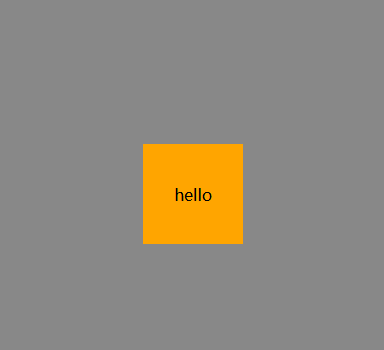

## html+css

### 让一个块水平（垂直）居中

方法一、方法二实现水平居中

方法一：

```html
#让bottom-list水平居中
<div class="bottom">
  <div class="bottom-list">这是一个测试行</div>
</div>
```

```css
#其生效的前提是bottom-list必须要有一个明确的宽度
margin:0 auto
#文字“这是一个测试行”并不会居中
如果想要bottom-list垂直居中呢？在bottom中使用line-height=height是不可行的，这种方法确实能让元素内部的文本垂直居中，但这种方法对非文本内容（如 div 子元素）没有效果，不过可以让bottom-list中的单行文本垂直居中
```

方法二：

```html
#父元素使用text-align：center可以使得子元素居中
#生效条件：子元素必须是文字、行内块、行内元素 #如果不是，需要使用display更改属性
<div class="test">
  <div class="test-inner">测试行</div>
  <ul>
    <li>nihao</li>
    <li>wohenhao</li>
  </ul>
</div>
```

```
.test{
text-align:center;
}
ul{
display:inline-block;
}
```

方法三（水平垂直居中）：

```html
<div class="outer">
  <div class="inner">
    <span>hello</span>
  </div>
</div>
```

1.使 inner 居中

```css
.outer{
    //使用弹性盒子布局，直接子元素变为弹性元素
    diaplay:flex;
    #主轴方向元素居中
    justify-content:center;
    #侧轴方向元素居中
    align-items:center;
}

```

2.令元素 span 中文字居中

```
.outer{
    //使用弹性盒子布局，直接子元素变为弹性元素
    diaplay:flex;
    #主轴方向元素居中
    justify-content:center;
    #侧轴方向元素居中
    align-items:center;
}
.inner{
	display:flex;
	    #主轴方向元素居中
    justify-content:center;
    #侧轴方向元素居中
    align-items:center;
}
```



方法四（水平垂直居中）：

```html
<div class="outer">
  <div class="inner">
    <span>hello</span>
  </div>
</div>
```

1.使 inner 居中

```css
.outer {
  //使用弹性盒子布局，直接子元素变为弹性元素
  diaplay: flex;
  margin: auto;
}
```

2.令元素 span 中文字居中

```css
.outer {
  //使用弹性盒子布局，直接子元素变为弹性元素
  diaplay: flex;
  margin: auto;
}
.inner {
  display: flex;
  margin: auto;
}
```

### 什么是预处理器语法

预处理器语法，通常指的是一种**非标准、增强型的语言语法**。它本身不能被浏览器直接解析，而需要通过一个**预处理器（preprocessor）**或**编译器（compiler）**将其转换成标准的、浏览器可识别的语言。

这个概念在前端开发中非常常见，比如：

- **样式预处理器**：如 **Sass**、**Less**、**Stylus**，它们将增强的语法（如变量、嵌套、混入）编译成标准的 **CSS**。
- **JavaScript 预处理器**：如 **TypeScript**，它将带有类型注解的语法编译成标准的 **JavaScript**。

---

`预处理器语法的核心思想`

预处理器语法的核心思想是**用更强大、更高效的语法来编写代码，然后让工具去处理那些繁琐的转换工作**。

它提供了一系列标准语言不具备的特性，让开发者能够：

- **提高开发效率**：比如，使用变量来存储颜色，当需要修改主题时，只需改变一个变量的值，而无需手动修改每个地方。
- **增强代码的可维护性**：通过嵌套、模块化等功能，代码结构更加清晰，更容易理解和维护。
- **减少重复**：通过混入（mixins）和函数，可以将重复的代码块封装起来，在需要时重复使用，避免了冗余。

简而言之，预处理器语法就是为了**解决标准语言在大型项目中可能出现的痛点**而诞生的。它本质上是一种**“高级”语法**，目的是让开发者写得更爽，然后让机器去完成剩下的工作。

### 什么是 scss

在 vue3 中，通过以下来指定将预处理器设置为 scss。表明接下来我要使用 scss 风格的代码了，需要使用预处理器 scss 来处理解析为 css 格式。

```
<style lang="scss"></style>
```

相比于原生 css，scss 有着许多优势：

**变量（Variables）**: 你可以定义变量来存储颜色、字体大小等值，并在整个样式中使用。这使得修改主题或样式变得非常简单，只需更改变量的值即可。

**嵌套（Nesting）**: 你可以在父选择器内部嵌套子选择器，从而避免重复编写长选择器，并使代码结构更清晰。

**混合（Mixins）**: Mixins 可以让你创建可重用的样式代码块，并在需要时通过 `@include` 引入，这大大减少了代码冗余。

**函数（Functions）**: SCSS 内置了许多有用的函数，你也可以自定义函数来处理颜色、计算值等。

**模块化（@use and @forward）**: SCSS 提供了 `@use` 和 `@forward` 规则，帮助你更好地组织和导入样式文件，实现样式模块化。

> 总得来说，scss 是 css 的一个超集，它在 css 的基础上，增添了许多强大的功能，使得编写和样式维护变得更加简单和高效。
>
> 另外，css 是一种浏览器可以直接解析的语言，而 scss 是一种预处理器语言，这意味着编写完 scss 代码后，还需要使用编译工具，例如 sass 来将其处理转换为标准的 css 代码，然后浏览器才能够识别处理。
