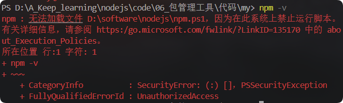
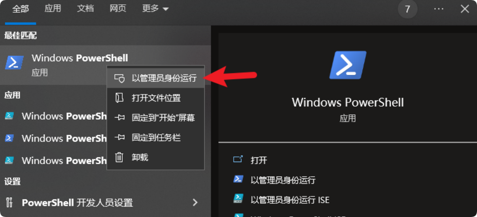
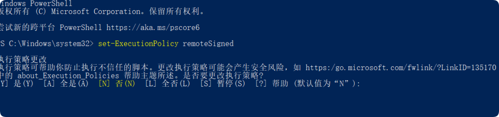

---
title:nodejs
---


## nodejs

### 1.全局安装nodemon

```
npm i -g nodemon
//nodemon 可以代替node去执行脚本
nodemon index.js
```

改包的作用是当服务器内容发生改变的时候，可以自动重启

可以通过 npm root -g 可以查看全局安装包的位置

### 2.修改window执行策略

window会对全局安装的包进行限制



1. 以 管理员身份 打开 powershell 命令行



2. 键入命令 set-ExecutionPolicy remoteSigned



3. 键入 A 然后敲回车 👌 
4. 如果不生效，可以尝试重启 vscode

### 3.Express

基于node.js平台的web应用开发框架，它是一个封装好的工具包，封装了很多功能，便于开发web应用（http服务）

1.res.end()和res.send()


在 Express 框架中，`res.end()` 和 `res.send()` 是用于结束 HTTP 响应的两种方法，但它们在使用场景和功能上有显著差异：

1. **来源与功能**

• **`res.end()`**：  
  源自 Node.js 原生的 `http` 模块。它直接调用底层的 `end()` 方法，仅支持发送 **字符串（String）** 或 **Buffer** 类型的数据。若需要发送其他类型数据（如对象），需手动转换为字符串或 Buffer，并自行设置响应头（如 `Content-Type`）。

  ```javascript
res.setHeader('Content-Type', 'application/json');
res.end(JSON.stringify({ message: 'Hello' }));
  ```

• **`res.send()`**：  
  由 Express 框架封装。支持多种数据类型（字符串、对象、数组、Buffer 等），并自动处理以下内容：
  • **自动设置 `Content-Type`**：根据数据类型推断（如 JSON 对象会设为 `application/json`）。
  • **转换数据格式**：自动将对象/数组转为 JSON，数字转为字符串等。
  • **自动结束响应**：调用后无需再调用 `end()`。

  ```javascript
res.send({ message: 'Hello' }); // 自动为 JSON，状态码 200
  ```

 **注意事项**

• **不可重复调用**：  
  无论是 `res.send()` 还是 `res.end()`，一旦调用，响应即结束，后续再调用会抛错：

  ```javascript
res.send('Hello');
res.send('World'); // Error: Cannot send after headers are sent
  ```

• **响应头设置时机**：  
  在调用两者之前需完成所有响应头的设置，否则可能失效：

  ```javascript
res.send('Hello');
res.setHeader('Content-Type', 'text/plain'); // 无效！响应已发送
  ```

• **状态码处理**：  
  `res.send()` 会保留先前通过 `res.status()` 设置的状态码，而 `res.end()` 需显式设置：

  ```javascript
res.status(404).send('Not Found'); // 正确
res.status(404).end('Not Found');  // 正确（但需手动处理数据类型）
  ```

---

 **对比总结**

| **特性**                  | `res.send()`                  | `res.end()`                |
| ------------------------- | ----------------------------- | -------------------------- |
| **数据类型支持**          | 字符串、对象、数组、Buffer 等 | 仅字符串或 Buffer          |
| **自动设置 Content-Type** | 是                            | 否（需手动设置）           |
| **自动结束响应**          | 是                            | 是（但需自行处理数据格式） |
| **适用场景**              | 快速发送结构化数据或通用响应  | 底层控制、流式传输或空响应 |

---

示例代码

```javascript
// 使用 res.send() 发送 JSON
app.get('/data', (req, res) => {
  res.send({ id: 1, name: 'Alice' }); // 自动设置 Content-Type: application/json
});

// 使用 res.end() 发送纯文本
app.get('/text', (req, res) => {
  res.set('Content-Type', 'text/plain');
  res.end('Plain Text');
});

// 发送空响应
app.get('/empty', (req, res) => {
  res.status(204).end();
});
```

**总结**：在 Express 中优先使用 `res.send()` 以简化代码；仅在需要底层控制或发送简单数据时使用 `res.end()`。

