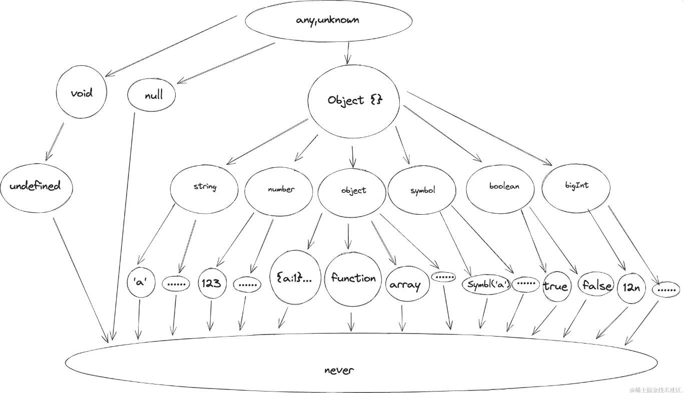

## typescript

### ~不同类型之间的关系



https://juejin.cn/post/7304924998576259106

### -implement和extends有什么区别

`extends` 和 `implements` 的区别

在 TypeScript 中，`extends` 和 `implements` 都是用于类型继承的关键字，但它们的使用场景和行为有重要区别：

1. `extends` (继承)

用于类继承

```typescript
class Animal {
  move() {
    console.log("Moving...");
  }
}

class Dog extends Animal {  // Dog 继承 Animal
  bark() {
    console.log("Woof!");
  }
}

const dog = new Dog();
dog.move(); // 继承的方法
dog.bark(); // 自身的方法
```

用于接口继承

```typescript
interface Shape {
  color: string;
}

interface Square extends Shape {  // Square 继承 Shape
  sideLength: number;
}

const square: Square = {
  color: "blue",
  sideLength: 10
};
```

特点：
• 可以继承类或接口

• 继承所有成员（属性和方法）

• 可以重写方法（类继承时）

• 可以添加新成员


2. `implements` (实现)

用于类实现接口

```typescript
interface Animal {
  move(): void;
}

class Dog implements Animal {  // Dog 实现 Animal 接口
  move() {
    console.log("Running...");
  }
  
  bark() {
    console.log("Woof!");
  }
}
```

特点：
• 只能用于类实现接口

• 必须实现接口中的所有成员

• 不能继承实现（只是保证类符合接口定义）

• 可以添加额外成员


主要区别

| 特性     | `extends`                    | `implements`               |
| -------- | ---------------------------- | -------------------------- |
| 适用对象 | 类继承类，接口继承接口       | 类实现接口                 |
| 成员继承 | 继承所有成员                 | 不继承，必须重新实现       |
| 方法重写 | 可以重写父类方法             | 必须实现接口定义的所有方法 |
| 新增成员 | 可以添加新成员               | 可以添加新成员             |
| 多继承   | 类只能单继承，接口可以多继承 | 类可以实现多个接口         |

使用场景

• 用 `extends` 当你想：

  • 复用已有类的实现

  • 建立类之间的层次关系

  • 扩展接口定义


• 用 `implements` 当你想：

  • 确保类符合特定接口

  • 实现多接口（TypeScript不支持多类继承）

  • 定义契约而不关心具体实现


组合使用示例

```typescript
interface Animal {
  move(): void;
}

interface Pet {
  name: string;
}

class Dog implements Animal, Pet {  // 实现多个接口
  constructor(public name: string) {}
  
  move() {
    console.log(`${this.name} is running`);
  }
}

class GuardDog extends Dog {  // 继承类
  bark() {
    console.log("Warning bark!");
  }
}
```


