# VUE


### 关于vue的项目结构

一个典型的Vue前端项目结构通常包含以下文件夹和文件：

1. **`public`**：这个文件夹包含不会被Vue CLI处理的静态资源文件，比如`index.html`和`robots.txt`。`index.html`是项目的入口文件。

   还可以包含网站或Web应用程序的图标文件--facicon.ico,介绍如下：

   ````favicon.ico` 是一个网站或Web应用程序的图标文件，通常用于在浏览器标签页、书签列表和历史记录中显示。它是一种视觉提示，帮助用户快速识别和区分不同的网站。


   ### 为什么使用 `favicon.ico`？


   - **品牌识别**：`favicon.ico` 有助于增强品牌识别度，因为它在多个地方显示，如浏览器标签、书签栏等。

   - **用户体验**：提供一个专业的`favicon.ico`可以提升用户体验，让用户感觉到网站的专业性和完整性。


   ### 如何添加 `favicon.ico`？


      1. **准备图标文件**：
    
         - 通常，`favicon.ico` 文件是一个16x16或32x32像素的图标文件，格式为ICO。
    
         - 你也可以使用PNG、GIF或SVG格式，但ICO格式在所有浏览器中的兼容性最好。


      2. **上传到服务器**：
    
         - 将`favicon.ico` 文件上传到你的网站服务器的根目录。例如，如果你的网站是`example.com`，那么`favicon.ico` 应该放在`example.com/favicon.ico`。


   3. **在HTML中指定**：

      - 在你的网站的HTML文件的`<head>`部分添加以下代码：

        ```html
        <link rel="icon" type="image/x-icon" href="/favicon.ico">
        <link rel="shortcut icon" type="image/x-icon" href="/favicon.ico">
        ```

      - 这段代码告诉浏览器在哪里找到`favicon.ico` 文件。

   4. **测试**：

      - 保存你的HTML文件并刷新浏览器，检查浏览器标签页是否显示了新的`favicon.ico`。

   ### 注意事项

   - 确保`favicon.ico` 文件的路径正确无误。
   - 考虑到不同设备的显示效果，可能需要为不同的设备和屏幕尺寸准备多个尺寸的图标。
   - 使用在线工具可以方便地将PNG或SVG文件转换为ICO格式，并生成适合不同用途的图标集。

   通过这些步骤，你可以为你的Vue前端项目或其他任何网站添加一个`favicon.ico`，提升网站的专业性和用户体验。

   ```

   ```

2. **`src`**：这是源代码的主要目录，包含所有的Vue组件、Vuex状态管理、路由配置等。

   - **`assets`**：存放静态资源文件，如CSS、图片等。
   - **`components`**：存放Vue组件。
   - **`views`**：存放页面级别的Vue组件，通常用于Vue Router。
   - **`router`**：存放路由配置文件。
   - **`store`**：存放Vuex状态管理文件。
   - **`App.vue`**：根Vue组件。
   - **`main.js`** 或 **`main.ts`**：项目的入口文件，用于创建Vue实例并挂载到DOM上。
   - **`.env`**：环境变量配置文件。

3. **`tests`**：存放单元测试或端到端测试文件。

4. **`node_modules`**：存放项目依赖的第三方库和模块，这些是通过npm或yarn安装的。

5. **`dist`** 或 **`build`**：构建（编译）后的文件，用于生产环境部署。

6. **`static`**：存放静态文件，这些文件在构建时会被复制到`dist`目录。

7. **`.babelrc`** 或 **`babel.config.js`**：Babel配置文件，用于转译ES6+代码。

8. **`.eslintrc.js`** 或 **`.eslintignore`**：ESLint配置文件，用于代码风格检查和代码质量保证。

9. **`.gitignore`**：Git配置文件，用于忽略不需要版本控制的文件。

10. **`package.json`**：定义项目的依赖、脚本和元数据。

11. **`README.md`**：项目说明文件。

12. **`vue.config.js`** 或 **`vue.config.ts`**：Vue CLI的配置文件，用于自定义构建、开发服务器等。

13. **`.nuxt`**（如果使用Nuxt.js）：Nuxt.js特有的目录，存放生成的文件。

请注意，这只是一个基本的项目结构，具体的项目可能会根据需求和开发团队的偏好有所不同。此外，随着Vue.js和相关工具的发展，项目结构也可能会有变化。

### API

包含vue的所有的函数、方法

### B/S AND C/S

举个例子，原生的手机app-微信、淘宝，电脑app从后台获取数据后，在app中生成页面并显示的就叫做CS架构，像b站或淘宝网页版，直接从后台获取数据和html页面，就叫做BS架构

### span、div、template

### div和span的区别

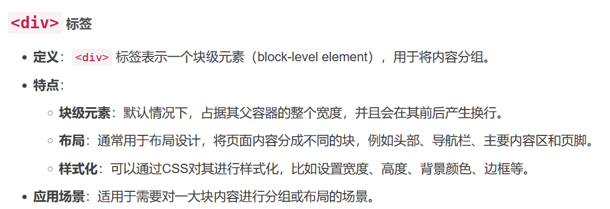


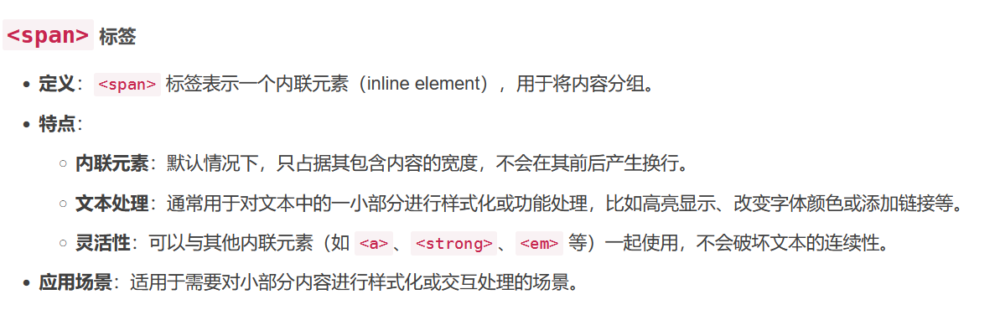

```
<!DOCTYPE html>
<html>
<head>
    <title>div 示例</title>
    <style>
        .container {
            width: 80%;
            margin: 0 auto;
            background-color: #f0f0f0;
            padding: 20px;
        }
        .header, .footer {
            background-color: #ccc;
            padding: 10px;
        }
        .main {
            background-color: #fff;
            padding: 20px;
        }
    </style>
</head>
<body>
    <div class="container">
        <div class="header">这是头部</div>
        <div class="main">这是主要内容区</div>
        <div class="footer">这是页脚</div>
    </div>
</body>
</html>

```

```
<!DOCTYPE html>
<html>
<head>
    <title>span 示例</title>
    <style>
        .highlight {
            color: red;
            font-weight: bold;
        }
    </style>
</head>
#用于将文本或者是行内内容包裹起来
<body>
    <p>这是一段文字，其中<span class="highlight">这部分文字被高亮显示</span>。</p>
</body>
</html>

```

### div和template的区别

- div 标签包裹后，会打破原来结构
- template 标签包裹后，渲染时不会打破原来结构

使用v-for：

```html
<div class="index">
    <div v-for="item in list"> //这里使用的是 div
      <div>{{ item.id }}</div>
      <div>{{ item.name }}</div>
      <div>{{ item.music }}</div>
    </div>
  </div>
1234567
```

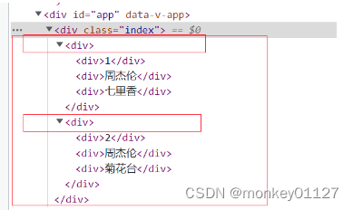

使用template：

```html
 <div class="index">
    <template v-for="item in list"> //这里使用的template
      <div>{{ item.id }}</div>
      <div>{{ item.name }}</div>
      <div>{{ item.music }}</div>
    </template>
  </div>
1234567
```

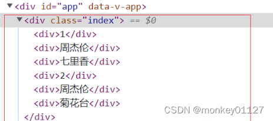

结论：

- 可以看到template并没有被渲染，相较于使用div 会节省一个没必要的div标签的空间
- template是作为占位符模板，用于包裹元素，自身并没有被渲染出来。

扩展：

v-show控制元素显示隐藏时，我们都知道 v-show隐藏元素的原理是 控制其元素的display:none

```html
<div class="index">
    <template v-for="item in list" v-show="false">
      <div>{{ item.id }}</div>
      <div>{{ item.name }}</div>
      <div>{{ item.music }}</div>
    </template>
  </div>
1234567
```

其结果列表并没有被隐藏，可以理解为 template并没有被作为 dom元素被渲染出来， 所有==无法控制其 display：none ==（换成v-if 任然能控制隐藏）


### Vue2的响应式原理

```
let person = {
				name:'张三',
				sex:'男',
				age:1,
			}
let number = 18			
// 传入三个参数：要给谁添加属性，要添加的属性名，配置对象
// 使用这种方式添加的属性默认不能够枚举、遍历，并且默认不能够被修改，默认不能够被删除
// 一、将属性包装起来，不能够被外界随意的修改
// 如果开始我让person{n:number},n=number=18,但是如果之后修改了number=1，这时n还是为18，没有讲number和n联系到一起
// 通过get方法，每次读取n的时候，都去访问get，get去获取number的值
// 通过set方法，每次修改n的时候，执行set方法，传入新的值，让number为新的值，从而传递到n上
Object.defineProperty(person,'age',{
    // value:18,
    // enumerable:true, //控制属性是否可以枚举，默认值是false
    // writable:true, //控制属性是否可以被修改，默认值是false
    // configurable:true //控制属性是否可以被删除，默认值是false

    //当有人读取person的age属性时，get函数(getter)就会被调用，且返回值就是age的值
    // get:function(){}
    // ------->简写：
    get(){
        console.log('有人读取age属性了')
        return number
    },

    //当有人修改person的age属性时，set函数(setter)就会被调用，且会收到修改的具体值
    set(value){
        console.log('有人修改了age属性，且值是',value)
        number = value
    }
})
person.age=10
console.log(person.age)--》10
//set(10)==>number=10 ---> get()-->return number 10
```

```
let person = {
				name:'张三',
				sex:'男',
				age:1,
			}
Object.defineProperty(person,'age',{
    get(){
        return person.age
    },
    set(value){
        person.age = value
    }
})
//这种写法是错误的，会导致不断的循环，最后栈溢出
//1.读取
console.log(person.age)
//被拦截--》get-->找person.age的值--》拦截--》get--》找person.age的值。。。。。
//2.赋值
person.age=10
//被拦截--》set--》为person.age赋值--》被拦截--》set-->为person.age赋值.......
```


 ### 由Vue所管理的函数

其中的this都指向的是vue实例对象：

==methods属性中的函数==

```
	methods:{
			add(){
				console.log(this)//Vue{}
				this.a++
			}
		},
```

computed属性中的get和set函数，及其简写形式

```js
	computed:{
				fullName:{
					get(){
						console.log(this)//Vue{...}
						return this.firstName + '-' +this.lastName
					},
					set(value){
                        console.log(this)//Vue{...}
						let arr = value.split('-')
						this.firstName = arr[0]
						this.lastName =arr[1]
					}
				}
			}
```

```js
//简写(前提：当确定了只读不该的时候) 
            // 将fullName:function(){}当成一个函数用
            // --简化：fullName(){}
            fullName(){
                console.log(this)//vue
                return this.firstName + '-' + this.lastName
            }
```

 watch属性简写的时候，简写的函数isHot以及hanlder函数

```
#简写
watch:{
				firstName(newValue){
					console.log(this)//vue
					this.fullName=newValue + '-' + this.lastName
				},
			}
```

```
watch:{
        firstName:{
            handler(newValue){
            console.log(this)
            this.fullName=newValue + '-' + this.lastName
            }
        },

    }
```

所有的生命周期函数：

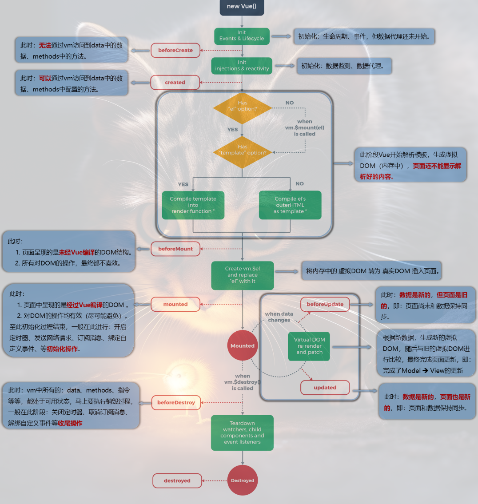

### 不由Vue所管理的函数

定时器的回调函数、ajax的回调函数等、Promise的回调函数

### 在Vue中如何控制标签（不适用dom)

1. **使用 Vue 的 `ref`**

   Vue 提供了 `ref` 属性，用于在组件内部引用 DOM 元素或子组件。通过 `ref`，你可以获取到 DOM 元素的引用，而不需要直接使用 `querySelector`。

   ```html
   <body>
   		<div id="root">
   		  <a href="#" ref="myLink">点击我</a>
   		  <button @click="handleClick">获取链接</button>
   		</div>
   	  <script>
   		new Vue({
   			el:'#root',
   			methods:{
   				handleClick(){
   					this.link = this.$refs.myLink
   					console.log(this.$refs) //{myLink: a}
   					console.log(this.link)
   					alert("链接地址为："+this.link.href)//  <a href="#">点击我</a>
   				}
   			}
   
   		}	
   		) 
   		</script>
   </body>
   ```

   2. **使用 Vue 的 `v-for` 和动态 `ref`**

```html
<template>
  <div>
    <div
      v-for="(item, index) in items"
      :key="index" //Vue 要求在 v-for 中为每个循环项设置一个唯一的 key，这里使用 index 作为键值。
      :ref="`item-${index}`"  //ref 是 Vue 提供的属性，用于引用 DOM 元素。这里通过模板字符串动态生成每个 ref 的key值，例如：
                                //第一个 <div> 的 ref 是 item-0。
                                //第二个 <div> 的 ref 是 item-1。
                                //第三个 <div> 的 ref 是 item-2
    >
      {{ item }}
    </div>
    <button @click="handleClick">获取所有元素</button>
  </div>
</template>

<script>
export default {
  data() {
    return {
      items: ["Item 1", "Item 2", "Item 3"]
    };
  },
  methods: {
    handleClick() {
      // 使用 this.$refs 获取所有动态 ref 的 DOM 元素
      console.log(this.$refs)  //{item-0: Array(1), item-1: Array(1), item-2: Array(1)} 如：item-0: [div]
   		//{
  		//"item-0": [<div>Item 1</div>],
  		//"item-1": [<div>Item 2</div>],
  		//"item-2": [<div>Item 3</div>]
		//	}   //注意：使用动态ref的时候，会将对应的value值包裹在数组的一个元素里，第一个div获取：this.$refs['item-0'][0-]
      for (let key in this.$refs) {
        const element = this.$refs[key][0];
        console.log(element.textContent);//使用innerHTML也可以
      }
    }
  }
};
</script>
```


3. **使用 Vue 的事件系统**

在 Vue 中，推荐通过事件系统来处理用户交互，而不是直接操作 DOM。例如，你可以为元素绑定事件监听器，并通过 Vue 的方法来处理逻辑。

```
<template>
  <div>
    <a href="#" @click="handleClick">点击我</a>
  </div>
</template>

<script>
export default {
  methods: {
    handleClick(event) {
      // 通过事件对象获取 DOM 元素
      alert("您点击了：" + event.target.tagName);
    }
  }
};
</script>
```

4. **使用 Vue 的 `v-if` 或 `v-show` 控制元素显示**

如果你需要控制元素的显示或隐藏，Vue 提供了 `v-if` 和 `v-show` 指令，而不是直接操作 DOM 的 `style` 或 `class`。

示例代码：

```vue
<template>
  <div>
    <button @click="toggleVisibility">切换显示</button>
    <div v-if="isVisible">这是动态显示的内容</div>
  </div>
</template>

<script>
export default {
  data() {
    return {
      isVisible: true
    };
  },
  methods: {
    toggleVisibility() {
      this.isVisible = !this.isVisible;
    }
  }
};
</script>
```


### input框中数据绑定生效的原理

#### radio

```
男<input type='radio' name='sex' v-model='userInfo.sex' value='male'>
女<input type='radio' name='sex' v-model='userInfo.sex' value='female'>


data:{
userInfo:{
    sex:'female'
    }
}
```

---

✅ 正确机制解析（Vue2 实现原理）

1. **用户操作触发更新（View → Model）**

当用户点击 radio 时：

```html
<input type="radio" v-model="userInfo.sex" value="female">
```

执行流程：

1. 浏览器触发原生 `change` 事件

2. Vue 监听该事件，执行以下操作：

   ```javascript
   // 伪代码演示
   const selectedValue = event.target.value; // 获取当前 radio 的 value 值
   this.userInfo.sex = selectedValue;        // 更新 Vue 数据
   ```

radio.checked = (radio.value === userInfo.value); 

2. **数据变化触发视图更新（Model → View）**

当 `userInfo.sex` 被修改时：

```javascript
// 例如在代码中执行
this.userInfo.sex = 'male';
```

执行流程：

1. Vue 的响应式系统检测到数据变化

2. 遍历所有绑定了 `v-model="userInfo.sex"` 的 radio 元素

3. 执行值比对：

   ```javascript
   radio.checked = (radio.value === currentValue); 
   // currentValue 是 userInfo.sex 的最新值
   ```

4. 只有 `value` 匹配的 radio 会被选中

---

🔧 底层等价代码（v-model 的语法糖）

Vue 会把你的 radio 代码：

```html
<input type="radio" v-model="userInfo.sex" value="female">
```

编译为：

```html
<input 
  type="radio" 
  :value="'female'" 
  :checked="userInfo.sex === 'female'"
  @change="userInfo.sex = $event.target.value"
>
```

---

📊 双向绑定对照表

| 操作方向       | 执行动作                                      |
| -------------- | --------------------------------------------- |
| 用户选择 radio | 将 `userInfo.sex` 设置为被选 radio 的 `value` |
| 代码修改数据   | 自动选中 `value` 等于 `userInfo.sex` 的 radio |

---

⚠️ 常见误区澄清

1. **不是简单的 "value=userInfo"**  
   实际是 **严格相等判断**（`checked = (radio.value === userInfo.sex)`）

2. **没有隐式的 "chang 方法"**  
   Vue 监听的是原生 `change` 事件，不需要手动定义方法

3. **为什么必须写 `value`**  
   因为 Vue 需要通过 `value` 属性知道：
   • 用户选择时应该给数据赋什么值
   • 数据变化时应该选中哪个 radio

---

🌰 实际场景演示

假设数据初始状态：

```javascript
userInfo: { sex: 'male' }
```

模板代码：

```html
男 <input type="radio" v-model="userInfo.sex" value="male">
女 <input type="radio" v-model="userInfo.sex" value="female">
```

运行结果：

1. "男" radio 的 `checked` 状态为 `true`

2. 用户点击"女" radio 后：
   • `userInfo.sex` 变为 `'female'`
   • "女" radio 自动被选中

3. 如果通过代码强制修改：

   ```javascript
   this.userInfo.sex = 'female';
   ```

   "女" radio 会立即呈现选中状态

   **如果不给 radio 加 `value` 会怎样？**

   ```html
   <!-- 错误示例 -->
   男 <input type="radio" name="sex" v-model="userInfo.sex">
   女 <input type="radio" name="sex" v-model="userInfo.sex">
   ```

   #### 后果：

   1. **所有 radio 的 `value` 默认为空字符串 (`''`)
   2. 用户选择任意选项 → `userInfo.sex` 会被赋值为 `''`
   3. **无法区分选项**，所有选择都会得到相同的值
   4. 数据绑定完全失效

---

**普通的inpu框不需要预定义value的原因是：**

---

🌟 核心原因

| 表单元素类型 | 是否需要显式 `value` | 原因                                                      |
| ------------ | -------------------- | --------------------------------------------------------- |
| 普通输入框   | ❌ **不需要**         | `v-model` 直接绑定用户输入的内容（自动关联 `value` 属性） |
| 单选按钮组   | ✅ **必须显式声明**   | 需要明确每个选项对应的值，用于判断选中状态和数据绑定      |

---

一、普通输入框（input/text/password）的机制

```html
<input type="text" v-model="userInfo.name">
```

工作原理：

1. **自动绑定**：`v-model` 默认绑定 `value` 属性（输入框的值）
2. **事件监听**：自动监听 `input` 事件（用户输入时触发）
3. **数据流**：
   • 用户输入 → 更新 `userInfo.name`
   • `userInfo.name` 变化 → 输入框内容自动更新

**不需要显式 `value` 的原因：**

• 输入框的值本质就是用户输入的内容，`v-model` 直接映射到绑定的数据，无需预定义值

---

二、单选按钮（radio）的机制

```html
男 <input type="radio" name="sex" v-model="userInfo.sex" value="male">
女 <input type="radio" name="sex" v-model="userInfo.sex" value="female">
```

工作原理：

1. **显式声明 `value`**：每个 radio 必须定义 `value` 属性（用于标识选项）
2. **匹配逻辑**：
   • 当 `userInfo.sex === 'male'` → 男性单选按钮自动选中
   • 当 `userInfo.sex === 'female'` → 女性单选按钮自动选中
3. **事件监听**：自动监听 `change` 事件（用户选择时触发）

必须显式 `value` 的原因：

• 单选框的值是 **预定义的选项值**，需要明确告诉 Vue：
  • 用户选择了哪个预定义的值
  • 如何根据数据反向选中对应的按钮

---

三、对比表格（Vue2 规则）

| 特性              | 普通输入框                 | 单选按钮组                     |
| ----------------- | -------------------------- | ------------------------------ |
| `v-model`绑定目标 | 输入框的实时内容（字符串） | 选中的预定义值（字符串/数字）  |
| 是否需要 `value`  | 自动处理，无需声明         | 必须显式声明每个选项的 `value` |
| 底层事件          | `input` 事件               | `change` 事件                  |
| 数据更新方向      | 双向同步（输入 ↔ 数据）    | 双向同步（选择 ↔ 数据）        |


---

最佳实践总结

1. **输入框**：直接使用 `v-model`，无需额外配置

   ```html
   <input type="text" v-model="userInfo.name">
   ```

2. **单选按钮**：必须为每个选项定义 `value`

   ```html
   <label>
     <input type="radio" v-model="userInfo.sex" value="male"> 男
   </label>
   <label>
     <input type="radio" v-model="userInfo.sex" value="female"> 女
   </label>
   ```

3. **其他表单元素**：
   • 复选框（checkbox）：使用 `true-value` 和 `false-value`
   • 下拉框（select）：在 `<option>` 中定义 `value`
   • 多选框（checkbox 组）：绑定到数组

这种设计让 Vue 的表单处理既强大又符合直觉，你只需要记住：**当元素需要从预定义选项中选择值时，必须明确声明每个选项的标识值（`value`）** 🚀

#### checkbox

checkbox实现勾选的原理和radio不太一样

在 Vue 2 中，radio 和 checkbox 的 checked 认定方式有一些不同，尽管它们都涉及到浏览器对表单元素的处理和 Vue 的 v-model 指令。下面我将详细讲解它们的原理，并提供等价的代码示例。

1. radio 的 checked 认定方式

对于 radio 元素，`v-model` 绑定的是一个变量，该变量的值与被选中 radio 的 value 属性值一致。当 radio 被选中时，`v-model` 绑定的变量会被更新为该 radio 的 value 值。浏览器会根据 radio 的选中状态自动设置其 checked 属性为 true 或 false。

```html
<template>
  <div>
    <input type="radio" id="male" value="男" v-model="sex">
    <label for="male">男</label>
    
    <input type="radio" id="female" value="女" v-model="sex">
    <label for="female">女</label>
    
    <p>选中的性别：{{ sex }}</p>
  </div>
</template>

<script>
export default {
  data() {
    return {
      sex: '' // 初始为空字符串
    };
  }
};
</script>
```

等价的代码实现

如果没有使用 `v-model`，可以通过监听 `change` 事件并手动更新数据来实现相同的效果：

```html
<template>
  <div>
    <input type="radio" id="male" value="男" @change="handleRadioChange" :checked="sex === '男'">
    <label for="male">男</label>
    
    <input type="radio" id="female" value="女" @change="handleRadioChange" :checked="sex === '女'">
    <label for="female">女</label>
    
    <p>选中的性别：{{ sex }}</p>
  </div>
</template>

<script>
export default {
  data() {
    return {
      sex: ''
    };
  },
  methods: {
    handleRadioChange(event) {
      this.sex = event.target.value;
    }
  }
};
</script>
```

2. checkbox 的 checked 认定方式

对于 checkbox 元素，`v-model` 的行为取决于是否设置了 value 属性：

- **未设置 value 属性**：`v-model` 绑定的是一个布尔值，选中时为 true，未选中时为 false。
- **设置了 value 属性**：`v-model` 绑定的是一个数组，选中时会将该 checkbox 的 value 值添加到数组中，未选中时会从数组中移除该值。

浏览器会根据 checkbox 的选中状态自动设置其 checked 属性为 true 或 false。

```html
<template>
  <div>
    <input type="checkbox" id="agree" v-model="isAgree">
    <label for="agree">同意</label>
    
    <input type="checkbox" id="apple" value="apple" v-model="fruits">
    <label for="apple">苹果</label>
    
    <input type="checkbox" id="banana" value="banana" v-model="fruits">
    <label for="banana">香蕉</label>
    
    <p>是否同意：{{ isAgree }}</p>
    <p>选中的水果：{{ fruits }}</p>
  </div>
</template>

<script>
export default {
  data() {
    return {
      isAgree: false,
      fruits: []
    };
  }
};
</script>
```

等价的代码实现

```html
<template>
  <div>
    <input type="checkbox" id="agree" @change="handleAgreeChange" :checked="isAgree">
    <label for="agree">同意</label>
    
    <input type="checkbox" id="apple" value="apple" @change="handleFruitsChange" :checked="fruits.includes('apple')">
    <label for="apple">苹果</label>
    
    <input type="checkbox" id="banana" value="banana" @change="handleFruitsChange" :checked="fruits.includes('banana')">
    <label for="banana">香蕉</label>
    
    <p>是否同意：{{ isAgree }}</p>
    <p>选中的水果：{{ fruits }}</p>
  </div>
</template>

<script>
export default {
  data() {
    return {
      isAgree: false,
      fruits: []
    };
  },
  methods: {
    handleAgreeChange(event) {
      this.isAgree = event.target.checked;
    },
    handleFruitsChange(event) {
      const fruit = event.target.value;
      if (event.target.checked) {
        this.fruits.push(fruit);
      } else {
        this.fruits = this.fruits.filter(item => item !== fruit);
      }
    }
  }
};
</script>
```


总结

- **radio 的 checked 认定方式**：`v-model` 绑定的是一个变量，该变量的值与被选中 radio 的 value 属性值一致。浏览器会根据选中状态自动设置 checked 属性。
- **checkbox 的 checked 认定方式**：`v-model` 绑定的是一个布尔值或数组，具体取决于是否设置了 value 属性。浏览器会根据选中状态自动设置 checked 属性。

通过这种方式，Vue 实现了数据和视图之间的双向绑定，使得开发者可以更方便地处理用户交互。

> [!IMPORTANT]
>
> 需要注意的是：checkbox的checked的值是通过浏览器操作dom对象实现的
>
> 浏览器更新复选框（`<input type="checkbox">`）的 `checked` 值是通过其内置的 DOM（文档对象模型）行为实现的。当用户与复选框交互时，浏览器会自动更新其 `checked` 属性的状态，以反映当前的选中状态。以下是浏览器实现这一功能的原理和过程：
>
> **用户交互与事件**
>
> 当用户点击复选框时，浏览器会触发一系列事件，并自动更新复选框的 `checked` 状态：
>
> - **`click` 事件**：当用户点击复选框时，浏览器首先触发 `click` 事件。
> - **`change` 事件**：在 `click` 事件之后，浏览器会触发 `change` 事件，表示复选框的状态发生了变化。
> - **自动更新 `checked` 属性**：浏览器会根据用户的点击操作，自动更新复选框的 `checked` 属性值。如果复选框原本未被选中，点击后会将其 `checked` 属性设置为 `true`；如果原本已被选中，点击后会将其 `checked` 属性设置为 `false`。
>
>  **JavaScript 的访问与操作**
>
> 开发者可以通过 JavaScript 访问和操作复选框的 `checked` 属性：
>
> - **读取 `checked` 状态**：
>
>   ```javascript
>   const checkbox = document.querySelector('input[type="checkbox"]');
>   console.log(checkbox.checked); // 输出当前的 checked 状态（true 或 false）
>   ```
>
> - **设置 `checked` 状态**：
>
>   ```javascript
>   checkbox.checked = true; // 选中复选框
>   checkbox.checked = false; // 取消选中复选框
>   ```
>
> 当通过 JavaScript 手动设置 `checked` 属性时，浏览器会同步更新复选框的视觉状态，使其与 `checked` 属性的值一致。
>
> 

### Vue和Vue原型对象(Vue.prototype)的关系

首先需要确定的是，Vue.prototype是一个工具，内置到vue中的一个对象属性prototype:{}，供vue创建对象时，为实例对象添加属性用的。  

> [!NOTE]
> 需要注意的是，在控制台里，[[prototype]]就等同于_ prototype_,写法的问题，意思是一样的,都表明的是隐式原型属性
>
> 而显示原型属性prototype执行构造函数才拥有
>
> 

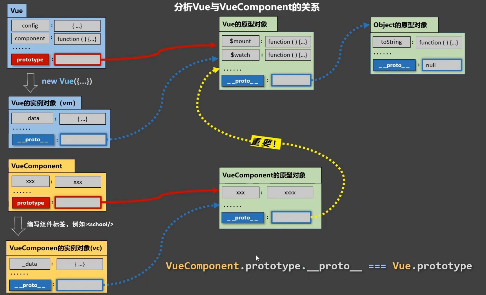

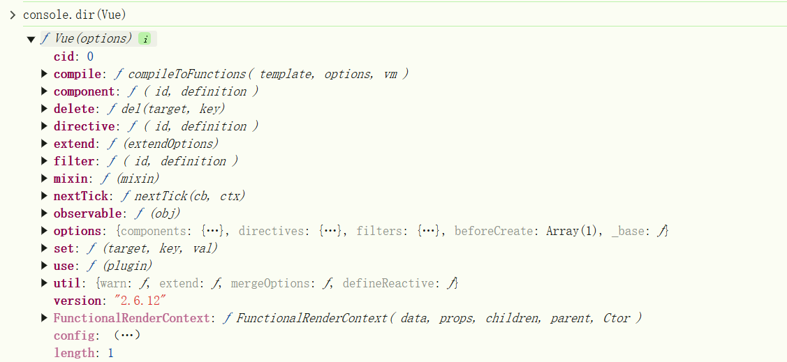

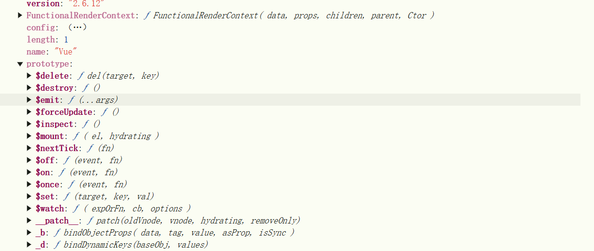

---

1. **`Vue` 是什么？**

想象一下，你有一个做蛋糕的工厂。这个工厂的 **蓝图（设计图）** 就是 `Vue`。  
• **作用**：`Vue` 就像工厂的蓝图，告诉工厂怎么造蛋糕（创建 Vue 实例）。  
• **你能用它做什么**：  
  比如，你想造一个蛋糕（创建一个 Vue 应用），就要按照这个蓝图来操作：  

  ```javascript
new Vue({
  el: '#app',  // 告诉工厂把蛋糕放在哪个盒子里（挂载到页面的某个元素）
  data: {      // 蛋糕的材料（数据）
    flavor: '巧克力'
  }
});
  ```

---

2. **`Vue.prototype` 是什么？**

现在，你的蛋糕工厂里有一些 **所有蛋糕通用的工具**，比如搅拌器、烤箱。  
• **作用**：`Vue.prototype` 就是存放这些通用工具的地方。  
• **为什么需要它**：  
  假设所有蛋糕都要用同一个搅拌器搅拌，你不需要每个蛋糕都配一个搅拌器，直接放在工厂的公共区域（`Vue.prototype`）就行。  

例子：

```javascript
// 给工厂的公共区域放一个搅拌器（添加全局方法）
Vue.prototype.$mix = function() {
  console.log('搅拌材料！');
};

// 现在所有蛋糕（Vue实例）都能用这个搅拌器
new Vue({
  created() {
    this.$mix(); // 输出：搅拌材料！
  }
});
```

---

3. **重点比喻理解**

| **概念**            | **比喻**             | **小白解释**                            |
| ------------------- | -------------------- | --------------------------------------- |
| **`Vue`**           | 蛋糕工厂的蓝图       | 告诉工厂如何造一个蛋糕（创建 Vue 实例） |
| **`Vue.prototype`** | 工厂的公共工具箱     | 所有蛋糕都能用的工具（全局方法/属性）   |
| **`this.$xxx`**     | 蛋糕用工具箱里的工具 | 在蛋糕内部，用 `this.$xxx` 调用公共工具 |

|   **特性**   |           **Vue**            |             **Vue.prototype**              |
| :----------: | :--------------------------: | :----------------------------------------: |
|   **定义**   |       Vue 核心构造函数       |           Vue 构造函数的原型对象           |
|   **作用**   | 创建 Vue 实例，管理全局配置  |     定义所有 Vue 实例共享的属性和方法      |
| **使用场景** | 初始化应用，创建根实例或组件 |             添加全局方法或属性             |
| **访问方式** |        直接使用 `Vue`        |      通过 `Vue.prototype` 添加或访问       |
|   **示例**   |       `new Vue({...})`       | `Vue.prototype.$method = function() {...}` |

4. **为什么分这么清楚？**

• **分工明确**：  
  • `Vue` 负责 **造蛋糕**（创建实例）。  
  • `Vue.prototype` 负责 **给所有蛋糕提供工具**（共享功能）。  

• **避免重复**：  
  比如你想让所有蛋糕都能调用一个 `$api` 方法去请求数据，不用在每个蛋糕里重复写代码，直接挂在 `Vue.prototype` 上就行。

---

5. **举个实际场景**

假设你要做一个网页，所有页面都需要弹出一个提示框：  

```javascript
// 在工厂的公共区域放一个提示工具
Vue.prototype.$alert = function(text) {
  alert(text);
};

// 任何蛋糕（组件）都能用这个工具
new Vue({
  mounted() {
    this.$alert('加载完成！'); // 页面加载完弹出提示
  }
});
```

---

在 Vue.js 中，`Vue` 和 `Vue 的原型对象（Vue.prototype）` 是两个紧密相关但作用不同的概念。以下是它们的区别和关系：

------

1. **`Vue`**

- **定义**：`Vue` 是 Vue.js 的核心构造函数，用于创建 Vue 实例（根实例或组件实例）。

- **作用**：`Vue` 是全局对象，用于初始化 Vue 应用，管理全局配置、插件、指令等。

- 

  示例

  ：

  javascript

  ```javascript
  import Vue from 'vue';
  new Vue({
    el: '#app',
    data: {
      message: 'Hello Vue!'
    }
  });
  ```

------

2. **`Vue.prototype`**

- **定义**：`Vue.prototype` 是 `Vue` 构造函数的原型对象，用于定义所有 Vue 实例（包括根实例和组件实例）共享的属性和方法。

- **作用**：通过 `Vue.prototype`，可以为所有 Vue 实例添加全局方法或属性，这些方法和属性可以在任何 Vue 实例中访问。

- 

  示例

  ：

  javascript

  ```javascript
  import Vue from 'vue';
  // 在 Vue.prototype 上添加一个全局方法
  Vue.prototype.$greet = function() {
    console.log('Hello from Vue.prototype!');
  };
  
  // 在 Vue 实例中使用
  new Vue({
    created() {
      this.$greet(); // 输出: Hello from Vue.prototype!
    }
  });
  ```

------

3. **区别**

|   **特性**   |           **Vue**            |             **Vue.prototype**              |
| :----------: | :--------------------------: | :----------------------------------------: |
|   **定义**   |       Vue 核心构造函数       |           Vue 构造函数的原型对象           |
|   **作用**   | 创建 Vue 实例，管理全局配置  |     定义所有 Vue 实例共享的属性和方法      |
| **使用场景** | 初始化应用，创建根实例或组件 |             添加全局方法或属性             |
| **访问方式** |        直接使用 `Vue`        |      通过 `Vue.prototype` 添加或访问       |
|   **示例**   |       `new Vue({...})`       | `Vue.prototype.$method = function() {...}` |

------

4. **关系**

- `Vue.prototype` 是 `Vue` 构造函数的原型对象，所有通过 `Vue` 创建的实例（包括根实例和组件实例）都会继承 `Vue.prototype` 上的属性和方法。
- 通过 `Vue.prototype` 添加的属性和方法可以在任何 Vue 实例中通过 `this` 访问。

------

5. **总结**

- `Vue` 是构造函数，用于创建 Vue 实例。
- `Vue.prototype` 是 `Vue` 的原型对象，用于定义所有 Vue 实例共享的属性和方法。
- 通过 `Vue.prototype`，可以扩展 Vue 的功能，添加全局方法或属性，例如常见的 `$router` 和 `$store` 就是通过 `Vue.prototype` 添加的。

如果你需要在所有 Vue 实例中共享某些功能，可以使用 `Vue.prototype`；如果是初始化应用或创建实例，则直接使用 `Vue`。


vm{......

//Vue原型对象Vue.component

 prototype:{

........

//object原型对象

prototype:{

....

//object无prototype

}

}}

**函数原型对象**

当你定义一个普通函数时：

- **函数本身是一个对象**，它的 **隐式原型（`__proto__`）指向 `Function.prototype`**（所有函数的公共工具箱）。
- **函数的 `prototype` 属性**是一个独立对象，只有当你把函数当作构造函数（用 `new` 调用）时，这个对象才会生效。

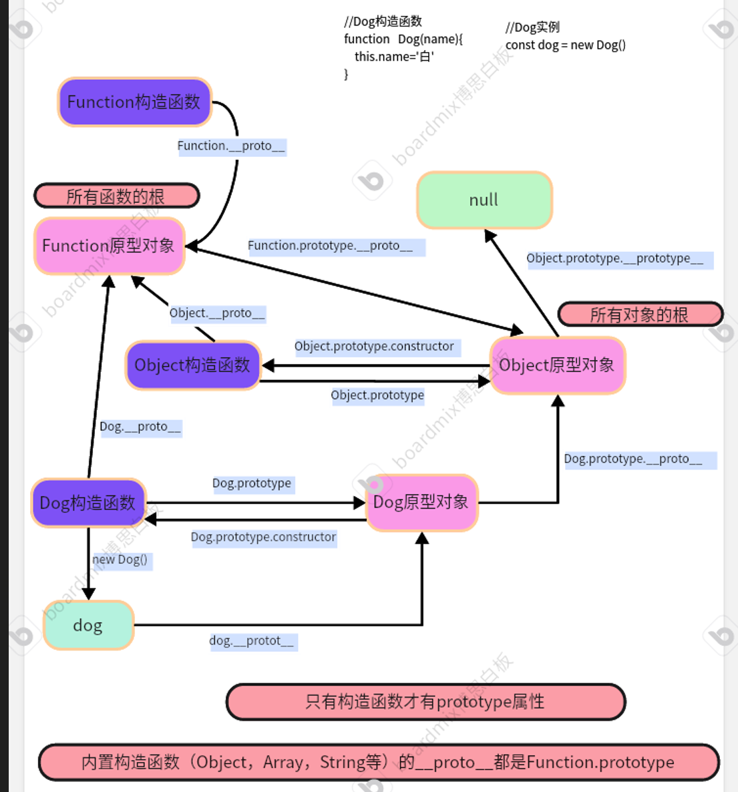


#### v-bind

`v-bind` 是 Vue3 中非常重要的一个指令，它的作用是用来动态地绑定一个或多个 attribute，或者一个组件 prop 到表达式。

通俗地讲，它就是 Vue **让 HTML 的 attribute 和 JavaScript 的数据变量建立起连接** 的桥梁。当数据发生变化时，`v-bind` 绑定的 attribute 也会自动更新。

**1.单独绑定一个属性，动态绑定属性值class**

```vue
//类名可以根据activeClass动态变换
<template>
  <!-- v-bind的使用 -->
  <div class="use_v-bild">
    <div v-bind:class="activeClass"></div>
  </div>
</template>

<script setup lang="ts">
import { ref } from 'vue'
let activeClass = ref('active')
activeClass.value = 'deactive'
</script>

<style scoped lang="scss">
.active {
  width: 100px;
  height: 100px;
  background-color: red;
}
.deactive {
  width: 100px;
  height: 100px;
  background-color: blue;
}
</style>

```

`v-bind的简写形式为`

```
v-bind:class="activeClass" 等同于 :class="activeClass"
```

```vue
<template>
  <!-- v-bind的使用 -->
  <div class="use_v-bild">
      //加上括号是对象语法，它的结构是 { '键': 布尔值表达式 }
      //这种写法是不对的，不符合键值的形式
    <div :class="{has?'active':'deactive'}"></div>
      //这种写法正确，三元表达式
    <div :class="has ? 'active' : 'deactive'"></div>
      //这种写法是正确的对象语法形式
    <div :class="{'active':has}"></div>
  </div>
</template>

<script setup lang="ts">
import { ref } from 'vue'
let activeClass = ref('active')
activeClass.value = 'deactive'
</script>

<style scoped lang="scss">
.active {
  width: 100px;
  height: 100px;
  background-color: red;
}
.deactive {
  width: 100px;
  height: 100px;
  background-color: blue;
}
</style>

```

**2.动态绑定style**

```vue
<template>
  <!-- v-bind的使用 -->
  <div class="use_v-bild">
    <div :class="{ 'active': has }" :style="{ 'color': color1,'fontSize':size+'px' }">123</div>
  </div>
</template>

<script setup lang="ts">
import { ref } from 'vue'
let color1 = ref('skyblue')
let size=ref(40)
</script>

<style scoped lang="scss">
.active {
  width: 100px;
  height: 100px;
  background-color: red;
}
.deactive {
  width: 100px;
  height: 100px;
  background-color: blue;
}
</style>

```

**3.绑定组件props**

父组件向子组件传递数据

```vue
<template>
  <div>404</div>
  <Bind :texta="text" :isright="isright"></Bind>
  <div v-bind="obj"></div>
  <div class="active" id="Elcontainer"></div>
</template>

<script setup lang="ts">
import Bind from './v-bind.vue'
import { ref, reactive } from 'vue'
let text = ref('beautiful')
let isright = ref(false)
let obj = reactive({
  id: 'ElContainer',
  class: 'active',
})
</script>

<style scoped>
.active {
  width: 100px;
  height: 100px;
  color: red;
  background-color: yellow;
}
</style>

```

子组件接收调用数据

```vue
<template>
  <div>{{ texta }}+{{ isright }}</div>
</template>

<script setup lang="ts">
const props = defineProps({
  texta: {
    type: String,
    required: true,
  },
  isright: Boolean,
})
// 你可以直接在模板中使用 props 中定义的变量
// 例如: {{ texta }} 和 {{ isright }}
// 在 <script setup> 内部，你可以通过 props.texta 访问
console.log(props.texta)
</script>

<style scoped></style>

```

**4.绑定所有属性（对象展开）**

如果你想一次性绑定一个对象中的所有属性，可以使用不带参数的 `v-bind`。

```vue
<template>
  <div v-bind="obj"></div>
//结果等同于
</template>

<script setup lang="ts">
let obj = reactive({
  id: 'ElContainer',
  class: 'active',
})
</script>

<style scoped>
.active {
  width: 100px;
  height: 100px;
  background-color: yellow;
}
</style>

```


**5.传递函数**

```vue
//父组件传递参数

<template>
  <Bind :greet="fgreet"></Bind>
</template>
<script setup lang="ts">
import Bind from './v-bind.vue'
function fgreet(content: string) {
  console.log(content)
}
</script>
<style scoped></style>

```


```vue
//子组件接受函数

<template>
  <button @click="callParentMethod"></button>
</template>

<script setup lang="ts">
const props = defineProps({
  greet: {
    type: Function,
    required: true,
  },
})
const callParentMethod = () => {
  props.greet('hello from child component')
}
</script>

<style scoped></style>

```


### 组件间传递数据的方式

#### **一、子组件向父组件传递数据**

前置知识：

在父组件通过v-bind传递数据给子组件的的时候：

1. **基本类型 vs 引用类型**

- **基本类型（如 `String`, `Number`）**：
  通过 `v-bind` 传递时，子组件接收到的是值的**拷贝**，直接修改不会影响父组件。

- **引用类型（如 `Object`, `Array`）**：
  通过 `v-bind` 传递时，子组件接收到的是父组件数据的**引用**。如果子组件直接修改引用类型的属性（例如 `this.data.key = 'new'`），​**父组件的数据会同步改变**，因为双方操作的是同一个内存地址的对象。

  使用v-bind，子组件可以**绕过 Vue 的警告**直接修改父组件数据（尤其是对象/数组），但这是 **Vue 不推荐的做法**，违背了单向数据流原则，会导致代码难以维护，最好还是使用v-model

2. **函数**

   同样的，子组件接受到的函数是父组件函数的引用，子组件执行该函数，本质上还是使用父组件的函数，传递的数据也会在父组件那里接收到。这个地方有些难以理解，可以使用以下代码帮助理解以下，类似

   于指针：

   ```
   const parent = {
     name: "Parent",
     sayHello: function(message) {
       console.log(`Hello from ${this.name}, message: ${message}`);
     }
   };
   
   const child = {
     name: "Child",
     parentMethod: null // 用于存储父组件的方法
   };
   
   // 父组件将方法传递给子组件
   child.parentMethod = parent.sayHello;
   
   // 子组件调用父组件的方法
   child.parentMethod("Hi from Child");
   输出结果：
   Hello from Parent, message: Hi from Child
   
   解释：
   //child.parentMethod = parent.sayHello;
   这里虽然调用是在子组件中进行的，但 parentMethod 实际上是父组件的 sayHello 方法。
   当 sayHello 被调用时，this 指向的是 它被定义时所在的对象，即 parent。
   因此，this.name 的值是 "Parent"，而不是 "Child"。
   ```

   


**1.通过父组件传递回调函数**

父组件将一个回调函数通过 `props` 传递给子组件，子组件调用该函数传值。
**父组件 (`App`)**：

```vue
<template>
  <MyHeader :onData="handleData" />
</template>

<script>
export default {
  methods: {
    handleData(data) {
      console.log("接收到的数据：", data);
    },
  },
};
</script>
```

**子组件 (`MyHeader`)**：


```vue
<script>
export default {
  props: ['onData'],
  methods: {
    sendData() {
      this.onData("来自子组件的数据"); // 调用父组件的回调函数
    },
  },
};
</script>
```

**2.子组件使用$emit属性定义触发自定义事件，父组件使用v-on监听事件**

```vue
#假设你有一个子组件 `ChildComponent`
<template>
  <button @click="sendMessage">触发自定义事件：发送数据到父组件</button>
  <button @click="unbind">解绑自定义事件</button>
</template>

<script>
export default {
  methods: {
    sendMessage() {
        //定义并触发自定义事件customMethod
        //只是定义了一个事件名称，并没有相应的执行逻辑，触发后到底要怎么做，需要传入一个回调函数
      this.$emit("customMethod", "传递的数据");
    }，
      unbind(){
        //解绑单个自定义事件
        this.$off('customMethod')
         //解绑多个自定义事件
       // this.$off(['customMethod','xx','xx'])
}
  }
};
</script>
```

```vue
#父组件
<template>
//监听自定义事件，并在父组件中定义相应的逻辑
  <ChildComponent @customMethod="handleEvent" />
</template>

<script>
import ChildComponent from "./ChildComponent.vue";

export default {
  components: { ChildComponent },
  methods: {
    handleEvent(data) {
      console.log("收到子组件传递的数据：", data); // 输出：传递的数据，在后续事件触发的时候可以接受得到
    }
  }
};
</script>
```

`this.$emit("customMethod", "传递的数据")` 这行代码就是自定义事件的**定义和触发**的地方。具体来说：

1. **事件的定义**  
   在 Vue.js 中，自定义事件并不是通过某种“声明式”的方式定义的，而是通过 **触发事件的行为** 来定义的。换句话说，当你在子组件中调用 `this.$emit` 方法时，就隐式地定义

2. 了一个事件`customMethod`，并且触发了它。

   - `this.$emit("customMethod", "传递的数据")` 中的 `"customMethod"` 是事件的名称。

   - `"传递的数据"` 是事件触发时传递的参数。

     自定义事件不是vue自带的方法，类似click，change，mouseover等，通过字面意思就能够知道该如何触发，想要触发该方法就应该将触发语句this.$emit()包裹在一个事件当中，例如click等。

   这行代码的作用是：

   - **定义** 一个名为 `"customMethod"` 的事件。
   - **触发** 这个事件，并将 `"传递的数据"` 传递给监听这个事件的父组件。

3. **事件的监听**  
   父组件需要通过某种方式监听这个事件。`监听`的方式有两种：

   - **通过模板语法 `v-on` 或 `@`**：  

     ```vue
     <template>
       <ChildComponent @customMethod="handleEvent" />
     </template>
     ```

   - **通过 `$refs` 和 `$on` 动态监听**：  

     ```javascript
     this.$refs.child.$on("customMethod", this.handleEvent);
     ```

在 Vue.js 中，事件的名称（如 `"customMethod"`）是完全由开发者动态决定的。你可以在任何地方通过 `this.$emit` 触发一个事件，只要父组件监听了这个事件名称，就会触发对应的执行函数`handleEvent`。

**3.子组件使用$emit属性定义触发事件，父组件ref进行监听**

```
#假设你有一个子组件 `ChildComponent`
<template>
  <button @click="sendMessage">点击发送事件</button>
</template>

<script>
export default {
  methods: {
    sendMessage() {
        //定义并触发自定义事件customMethod
        //只是定义了一个事件名称，并没有相应的执行逻辑，触发后到底要怎么做，需要传入一个回调函数
      this.$emit("customMethod", "传递的数据");
    }
  }
};
</script>
```

```js
#父组件
<template>
//监听自定义事件，并在父组件中定义相应的逻辑
  <ChildComponent ref='child' />
</template>

<script>
import ChildComponent from "./ChildComponent.vue";

export default {
  components: { ChildComponent },
  methods: {
    handleEvent(data) {
      console.log("收到子组件传递的数据：", data); // 输出：传递的数据，在后续事件触发的时候可以接受得到
    }
  },
  mounted:{
  	this.$refs.child.$on('customEvent',this.handleEvent)
  }
  
};
</script>
```

$on：用于自定义事件监听，监听事件customEvent的同时，触发后面的回调函数。

这种方式适用于以下场景：

1. **动态绑定事件**：在某些情况下，你可能需要在代码中动态地绑定事件，而不是在模板中通过 `v-on` 静态绑定。
2. **灵活的事件管理**：通过 `$on`，你可以在组件实例上灵活地添加或移除事件监听器。


#### **二、父组件向子组件传递数据**

`1.使用props`

1. **父组件向子组件传递数据：**  
   使用 **`props`**  

   - 父组件通过 `props` 将数据传递给子组件。    

     ```vue
     <!-- 父组件 -->
     <template>
       <ChildComponent :message="parentMessage" />
     </template>
     
     <script>
     import ChildComponent from './ChildComponent.vue';
     
     export default {
       components: { ChildComponent },
       data() {
         return {
           parentMessage: 'Hello from Parent'
         };
       }
     };
     </script>
     ```

     ```vue
     <!-- 子组件 -->
     <template>
       <div>{{ message }}</div>
     </template>
     
     <script>
     export default {
       props: ['message']
     };
     </script>
     ```

   

2. **父组件调用子组件的方法：**  
   使用 **`ref`**  

   - 父组件通过 `ref` 引用子组件实例，直接调用子组件的方法。  

   - 示例：  

     ```vue
     <!-- 父组件 -->
     <template>
       <ChildComponent ref="child" />
       <button @click="callChildMethod">Call Child Method</button>
     </template>
     
     <script>
     import ChildComponent from './ChildComponent.vue';
     
     export default {
       components: { ChildComponent },
       methods: {
         callChildMethod() {
           this.$refs.child.childMethod();
              //似乎也可以通过这种方式来获取子组件的数据，在mounted及以后的阶段才能够使用，适用于简单的业务场景
           console.log(this.$refs.child.a);
         }
       }
     };
     </script>
     ```

     ```vue
     <!-- 子组件 -->
     <template>
       <div>Child Component</div>
     </template>
     
     <script>
     export default {
       data(){
           return {
               a:234,
           }
       },
       methods: {
         childMethod() {
           console.log('Method called from Child');
         }
       }
     };
     </script> 
      
     ```

   

#### 三、**非父子组件传递数据**


**全局事件总线**

> [!NOTE]
>
> 可以实现任意组件之间通信

将数据放到事件总线，首先想到应该放到所有的组件都能够访问得到的地方，想到了组件VueComponent的原型对象

执行：

```
VueComponent.prototype={a:1,b:2}
```

会发现这种方式行不通，因为每一个VueComponent是由Vue.extend()创建的，所以school=Vue.extend()是一个构造函数

每次调用Vue.extend()，生成的都是新的VueComponent,所以VueComponent的原型对象不是所有组件都能够访问到的地方。

这时想到了Vue.prototype

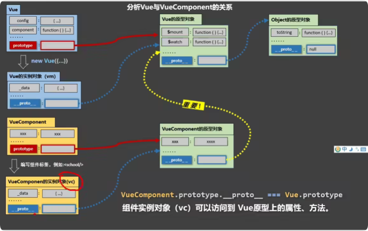

所以将数据放到Vue.prototype，放到原型对象的数据也是有要求的，因为后续需要使用到$$on, $off,$emit，所有数据必须放到vm或者是vc身上，只有他们两个才有这些属性

```
const vc= Vue.extend{()}//创建了vc构造函数
const vcc = new vc() //创建vc实例
Vue.prototype.x=vcc
------------------->
但是上面的写法有一些麻烦，vue实例对象也能够访问到Vue.prototype
在创建Vue实力的beforcreated事件给其原型对象添加
```

这样就创建了一个总线。

main.js

```
//引入Vue
import Vue from 'vue'
//引入App
import App from './App.vue'
//关闭Vue的生产提示
Vue.config.productionTip = false

//const vc = Vue.extend()
//const vcc = new vc()
//Vue.prototype.x=vcc

//创建vm
new Vue({
	el:'#app',
	render: h => h(App)
	//安装全局事件总线
	beforeCreate(){
	Vue.prototype.$bus=this
}4
	
})
```

.Vue

```
<template>
    <div>
        <h1 class="student">学生年龄{{info.age}}</h1>
        <h1 class="student">学生姓名{{info.name}}</h1>
        <button @click="sendData">把数据传递给school</button>
    </div>

</template>

<script>
export default {
    name:'StudentView',
    data(){
        return {
            info:{
                name:"zhankang",
                age:24
            }
        }
    },
    methods:{
        sendData(){
        	//定义和触发自定义事件：sendData
            this.$bus.$emit('sendDataToSchool',this.info)
        }
    }
}
</script>

<style>
    .student{
        background-color: blue;
    }
</style>
```

SchoolView.Vue

```
<template>
	<div>
		<h1>{{msg}}</h1>
		<h2>学校年龄：{{myAge}}</h2>
	</div>
</template>

<script>
	export default {
		name:'StudentView',
		data() {
			return {
				msg:'cdut',
				myAge:180
			}
		},
		mounted(){
		//监听并执行事件
			this.$bus.$on('sendDataToSchool',(data)=>{
				console.log(data)
			})
		}

	}
</script>
```

==事件总线全流程==

1. 在 Vue.prototype 上定义 $bus

通过在 Vue.prototype 上定义 `$bus`，所有组件实例都可以通过 `this.$bus` 访问到这个事件总线实例，·`$bus是一个vue实例`。

```javascript
Vue.prototype.$bus = new Vue();
```

2. 组件 StudnetView触发事件

组件 StudnetView使用 `this.$bus.$emit('sendData', data1)` 触发事件。通过 `this.$bus` 一步步向上到vue.pototype访问到事件总线实例，并调用 `$emit` 方法触发事件。

```javascript
this.$bus.$emit('sendData', data1);
//在vue.pototype的$bus上创建了事件senData
```

3. 组件 SchoolView 监听事件

组件 BSchoolView使用 `this.$bus.$on('sendData', (data) => {})` 监听事件。组件 SchoolView 通过 `this.$bus` 访问到事件总线实例，并调用 `$on` 方法监听事件。

JavaScript复制

```javascript
this.$bus.$on('sendData', (data) => {
  // 处理逻辑
});
```


### 组件的自定义事件

**子组件使用$emit属性定义触发自定义事件，父组件使用v-on监听事件**

```vue
#假设你有一个子组件 `ChildComponent`
<template>
  <button @click="sendMessage">触发自定义事件：发送数据到父组件</button>
  <button @click="unbind">解绑自定义事件</button>
</template>

<script>
export default {
  methods: {
    sendMessage() {
        //定义并触发自定义事件customMethod
        //只是定义了一个事件名称，并没有相应的执行逻辑，触发后到底要怎么做，需要传入一个回调函数
      this.$emit("customMethod", "传递的数据");
    }，
      unbind(){
        //解绑单个自定义事件
        this.$off('customMethod')
         //解绑多个自定义事件
       // this.$off(['customMethod','xx','xx'])
}
  }
};
</script>
```

```vue
#父组件
<template>
//监听自定义事件，并在父组件中定义相应的逻辑
  <ChildComponent @customMethod="handleEvent" />
</template>

<script>
import ChildComponent from "./ChildComponent.vue";

export default {
  components: { ChildComponent },
  methods: {
    handleEvent(data) {
      console.log("收到子组件传递的数据：", data); // 输出：传递的数据，在后续事件触发的时候可以接受得到
    }
  }
};
</script>
```

`this.$emit("customMethod", "传递的数据")` 这行代码就是自定义事件的**定义和触发**的地方。具体来说：

1. **事件的定义**  
   在 Vue.js 中，自定义事件并不是通过某种“声明式”的方式定义的，而是通过 **触发事件的行为** 来定义的。换句话说，当你在子组件中调用 `this.$emit` 方法时，就隐式地定义了一个事件`customMethod`，并且触发了它。

   - `this.$emit("customMethod", "传递的数据")` 中的 `"customMethod"` 是事件的名称。

   - `"传递的数据"` 是事件触发时传递的参数。

     自定义事件不是vue自带的方法，类似click，change，mouseover等，通过字面意思就能够知道该如何触发，想要触发该方法就应该将触发语句this.$emit()包裹在一个事件当中，例如click等。

   这行代码的作用是：

   - **定义** 一个名为 `"customMethod"` 的事件。
   - **触发** 这个事件，并将 `"传递的数据"` 传递给监听这个事件的父组件。

2. **事件的监听**  
   父组件需要通过某种方式监听这个事件。`监听`的方式有两种：

   - **通过模板语法 `v-on` 或 `@`**：  

     ```vue
     <template>
       <ChildComponent @customMethod="handleEvent" />
     </template>
     ```

   - **通过 `$refs` 和 `$on` 动态监听**：  

     ```javascript
     this.$refs.child.$on("customMethod", this.handleEvent);
     ```

> [!WARNING]
>
> ```
> <template>
> <ChildComponent @click="handleEvent" />
> </template>
> ```
>
> 这里会出现问题，会发现原生的click事件无法使用了，必须在子组件中定义触发click
>
> this.$emit('click')
>
> //也就是无法分辨原生事件和自定义事件了。
>
> 解决办法，在click事件后加上native属性，表明原生身份。
>
> ```
> <template>
> <ChildComponent @click.native="handleEvent" />
> </template>
> ```

vue3版本：

```js
#假设你有一个子组件 `ChildComponent`
<template>
  <button @click="sendMessage">触发自定义事件：发送数据到父组件</button>
</template>

<script setup>
let $emits=defineEmits(['customMethod'])
const sendMessage-=()=> {
        //定义并触发自定义事件customMethod
        //只是定义了一个事件名称，并没有相应的执行逻辑，触发后到底要怎么做，需要传入一个回调函数
    $emits('customMethod','传递的数据')
}，
</script>
```

```js
#父组件
<template>
//监听自定义事件，并在父组件中定义相应的逻辑
  <ChildComponent @customMethod="handleEvent" />
</template>
<script setup>
import ChildComponent from "./ChildComponent.vue";
  components: { ChildComponent },
const handleEvent=(data)=> {
      console.log("收到子组件传递的数据：", data); // 输出：传递的数据，在后续事件触发的时候可以接受得到
    }
</script>
```


 

### vuex


先写一个纯vue的求和案例

```html
<template>
  <div >
      <h1>sum:{{sum}}</h1>
      <select v-model.number="number">
        <option value="1">1</option>
        <option value="2">2</option>
        <option value="3">3</option>
      </select>
      <button @click="increment">+</button>
      <button @click="decrement">➖</button>
      <button @click="incrementOdd">偶数点击增加</button>
      <button @click="incrementWait">等一等再加</button>


  </div>
</template>

<script>
export default {
    name: 'count',
    data(){
        return {
          sum:0,
          number:1,
           
        }
    },
    methods:{
      increment(){
        this.sum+=this.number
      },
      decrement(){
        this.sum-=this.number
      },
      incrementOdd(){
        if(this.number % 2 === 0){
          this.sum+=this.number
        }
      },
      incrementWait(){
        setTimeout(()=>{
          this.sum+=this.number
        },1000)
        }
      },

    }

</script>

```


以下是vuex的工作流程图

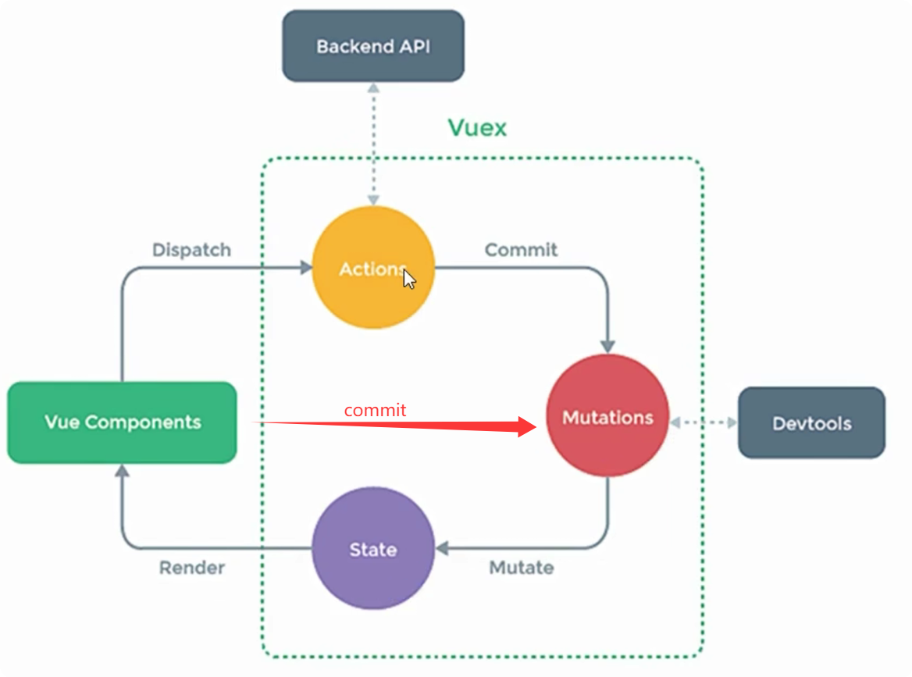

**vuex配置**

<u>安装vuex</u>

```
npm i vuex@3
```

<u>文件配置</u>

创建store文件夹，其下创建index.js文件

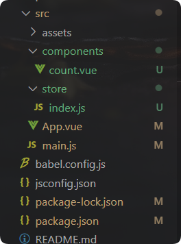


文件内容为：

```
// 该文件用于创建vuex中最为核心的store
import Vue from 'vue'
//引入vuex
import Vuex from 'vuex'
// 使用插件
Vue.use(Vuex)
// 使用了VueX之后，创建的每一个Vue实例，都会有一个$store的属性

//准备actions--用于相应组件中的动作
// 需要到后端去请求数据的时候，发送ajax请求，就是再actions中进行的
const actions = {}

//准备mutations--用于操作数据（state）
const mutations = {}

//准备state-用于存储数据,之所以叫做状态，是因为为每个数据都配置了setter和getter方法
const state = {
    sum:0,

}

//创建store
// const store = new Vuex.Store({
//     actions: actions,
//     mutations: mutations,
//     state: state
// })
// ----> 简写
/*const store = new Vuex.Store({
    actions,
    mutations,
    state
})
export default store*/
// ----->简写
export default  new Vuex.Store({
    actions,
    mutations,
    state
})

```

**求和案例vuex版本**

**count.vue**

```
<template>
  <div >
      <h1>sum:{{ $store.state.sum }}</h1>
      <select v-model.number="number">
        <option value="1">1</option>
        <option value="2">2</option>
        <option value="3">3</option>
      </select>
      <button @click="increment">+</button>
      <button @click="decrement">➖</button>
      <button @click="incrementOdd">偶数点击增加</button>
      <button @click="incrementWait">等一等再加</button>


  </div>
</template>

<script>
export default {
    name: 'count',
    data(){
        return {
          number:1,
           
        }
    },
    methods:{
       increment(){
       //交给actions
         this.$store.dispatch('increment',this.number)
       },
       decrement(){
         this.$store.dispatch('decrement',this.number)
       },

       //需要复杂判断的业务逻辑，可以在actions中处理
       incrementOdd(){
         if(this.number % 2 === 0){
           this.$store.dispatch('increment',this.number)
         } 
       },
       incrementWait(){
         setTimeout(()=>{
           this.$store.dispatch('increment',this.number)
         },1000)
         }
      
    }

  }

</script>

```

**index.js文件**

```
// 该文件用于创建vuex中最为核心的store
import Vue from 'vue'
//引入vuex
import Vuex from 'vuex'
// 使用插件
Vue.use(Vuex)
// 使用了VueX之后，创建的每一个Vue实例，都会有一个$store的属性

//准备actions--用于相应组件中的动作
// 需要到后端去请求数据的时候，发送ajax请求，就是再actions中进行的
//第一个参数为：上下文对象context，到了actions这一步，需要调用commit方法了
// context对象其实类似于一个迷你版的store对象，包含了store对象上的大部分属性和方法
// 系统将actions环节需要的数据和方法并没有直接传递给actions，而是通过context对象传递给actions
// context对象中有一个commit方法，可以用来调用mutations中的方法
// 第二个参数为：调用actions时传递的参数,可以是一个也可以是多个,如果是加法，该参数就是加的值是几
const actions = {
     increment(context,value){
         console.log('jiale')
         // 将接下来要进行的操作，交给mutations，通过commit方法
         // 一般来说，mutations中的方法名都是大写
         context.commit('INCREMENT',value)
     },
     decrement(context,value){
         context.commit('DECREMENT',value)
     },
    incrementOdd(context,value){
        if(value % 2 === 0){
            context.commit('INCREMENT',value)
        }

    },
    incrementWait(context,value){
        setTimeout(() =>{
            context.commit('INCREMENT',value)
        },1000)

    },


}

//准备mutations--用于操作数据（state）
// 第一个参数为：state对象
// 第二个参数为：actions调用mutations时传递的第二个参数value
const mutations = {
    INCREMENT(state,value){
        state.sum += value
    },
    DECREMENT(state,value){
        this.state.sum -= value
    }

}

//准备state-用于存储数据,之所以叫做状态，是因为为每个数据都配置了setter和getter方法
const state = {
    sum:0,

}

//创建store
// const store = new Vuex.Store({
//     actions: actions,
//     mutations: mutations,
//     state: state
// })
// ----> 简写
/*const store = new Vuex.Store({
    actions,
    mutations,
    state
})
export default store*/
// ----->简写
export default  new Vuex.Store({
    actions,
    mutations,
    state
})

```

==简化操作==

**count.vue**

```
<template>
  <div >
      <h1>sum:{{ $store.state.sum }}</h1>
      <select v-model.number="number">
        <option value="1">1</option>
        <option value="2">2</option>
        <option value="3">3</option>
      </select>
      <button @click="increment">+</button>
      <button @click="decrement">➖</button>
      <button @click="incrementOdd">偶数点击增加</button>
      <button @click="incrementWait">等一等再加</button>


  </div>
</template>

<script>
export default {
    name: 'count',
    data(){
        return {
          number:1,
           
        }
    },
    methods:{
      // 不需要复杂判断的业务逻辑、isesle判断一类的，可以跳过actions，直接交给mutations处理
      increment(){
        this.$store.commit('INCREMENT',this.number)
      },
      decrement(){
        this.$store.commit('DECREMENT',this.number)
      },


      // 需要复杂判断的业务逻辑，可以在actions中处理
      incrementOdd(){
          this.$store.dispatch('incrementOdd',this.number)

      },
      incrementWait(){
        this.$store.dispatch('incrementWait',this.number)
      }

    }

  }

</script>

```

**index.js**

```
// 该文件用于创建vuex中最为核心的store
import Vue from 'vue'
//引入vuex
import Vuex from 'vuex'
// 使用插件
Vue.use(Vuex)
// 使用了VueX之后，创建的每一个Vue实例，都会有一个$store的属性

//准备actions--用于相应组件中的动作
// 需要到后端去请求数据的时候，发送ajax请求，就是再actions中进行的
//第一个参数为：上下文对象context，到了actions这一步，需要调用commit方法了
// context对象其实类似于一个迷你版的store对象，包含了store对象上的大部分属性和方法
// 系统将actions环节需要的数据和方法并没有直接传递给actions，而是通过context对象传递给actions
// context对象中有一个commit方法，可以用来调用mutations中的方法
// 第二个参数为：调用actions时传递的参数,可以是一个也可以是多个,如果是加法，该参数就是加的值是几
const actions = {

    // 简单逻辑直接跳过actiuons，直接在组件中调用mutations
    // increment(context,value){
    //     console.log('jiale')
    //     // 将接下来要进行的操作，交给mutations，通过commit方法
    //     // 一般来说，mutations中的方法名都是大写
    //     context.commit('INCREMENT',value)
    // },

    // decrement(context,value){
    //     context.commit('DECREMENT',value)
    // },
    incrementOdd(context,value){
        if(value % 2 === 0){
            context.commit('INCREMENT',value)
        }

    },
    incrementWait(context,value){
        setTimeout(() =>{
            context.commit('INCREMENT',value)
        },1000)

    },


}

//准备mutations--用于操作数据（state）
// 第一个参数为：state对象
// 第二个参数为：actions调用mutations时传递的第二个参数value
const mutations = {
    INCREMENT(state,value){
        state.sum += value
    },
    DECREMENT(state,value){
        this.state.sum -= value
    }

}

//准备state-用于存储数据,之所以叫做状态，是因为为每个数据都配置了setter和getter方法
const state = {
    sum:0,

}

//创建store
// const store = new Vuex.Store({
//     actions: actions,
//     mutations: mutations,
//     state: state
// })
// ----> 简写
/*const store = new Vuex.Store({
    actions,
    mutations,
    state
})
export default store*/
// ----->简写
export default  new Vuex.Store({
    actions,
    mutations,
    state
})

```

### Vue3的响应式原理
