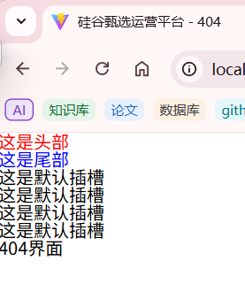

# VUE


### 关于vue的项目结构

一个典型的Vue前端项目结构通常包含以下文件夹和文件：

1. **`public`**：这个文件夹包含不会被Vue CLI处理的静态资源文件，比如`index.html`和`robots.txt`。`index.html`是项目的入口文件。

   还可以包含网站或Web应用程序的图标文件--facicon.ico,介绍如下：

   ````favicon.ico` 是一个网站或Web应用程序的图标文件，通常用于在浏览器标签页、书签列表和历史记录中显示。它是一种视觉提示，帮助用户快速识别和区分不同的网站。


   ### 为什么使用 `favicon.ico`？


   - **品牌识别**：`favicon.ico` 有助于增强品牌识别度，因为它在多个地方显示，如浏览器标签、书签栏等。

   - **用户体验**：提供一个专业的`favicon.ico`可以提升用户体验，让用户感觉到网站的专业性和完整性。


   ### 如何添加 `favicon.ico`？


      1. **准备图标文件**：
    
         - 通常，`favicon.ico` 文件是一个16x16或32x32像素的图标文件，格式为ICO。
    
         - 你也可以使用PNG、GIF或SVG格式，但ICO格式在所有浏览器中的兼容性最好。


      2. **上传到服务器**：
    
         - 将`favicon.ico` 文件上传到你的网站服务器的根目录。例如，如果你的网站是`example.com`，那么`favicon.ico` 应该放在`example.com/favicon.ico`。


   3. **在HTML中指定**：

      - 在你的网站的HTML文件的`<head>`部分添加以下代码：

        ```html
        <link rel="icon" type="image/x-icon" href="/favicon.ico">
        <link rel="shortcut icon" type="image/x-icon" href="/favicon.ico">
        ```

      - 这段代码告诉浏览器在哪里找到`favicon.ico` 文件。

   4. **测试**：

      - 保存你的HTML文件并刷新浏览器，检查浏览器标签页是否显示了新的`favicon.ico`。

   ### 注意事项

   - 确保`favicon.ico` 文件的路径正确无误。
   - 考虑到不同设备的显示效果，可能需要为不同的设备和屏幕尺寸准备多个尺寸的图标。
   - 使用在线工具可以方便地将PNG或SVG文件转换为ICO格式，并生成适合不同用途的图标集。

   通过这些步骤，你可以为你的Vue前端项目或其他任何网站添加一个`favicon.ico`，提升网站的专业性和用户体验。

   ```

   ```

2. **`src`**：这是源代码的主要目录，包含所有的Vue组件、Vuex状态管理、路由配置等。

   - **`assets`**：存放静态资源文件，如CSS、图片等。
   - **`components`**：存放Vue组件。
   - **`views`**：存放页面级别的Vue组件，通常用于Vue Router。
   - **`router`**：存放路由配置文件。
   - **`store`**：存放Vuex状态管理文件。
   - **`App.vue`**：根Vue组件。
   - **`main.js`** 或 **`main.ts`**：项目的入口文件，用于创建Vue实例并挂载到DOM上。
   - **`.env`**：环境变量配置文件。

3. **`tests`**：存放单元测试或端到端测试文件。

4. **`node_modules`**：存放项目依赖的第三方库和模块，这些是通过npm或yarn安装的。

5. **`dist`** 或 **`build`**：构建（编译）后的文件，用于生产环境部署。

6. **`static`**：存放静态文件，这些文件在构建时会被复制到`dist`目录。

7. **`.babelrc`** 或 **`babel.config.js`**：Babel配置文件，用于转译ES6+代码。

8. **`.eslintrc.js`** 或 **`.eslintignore`**：ESLint配置文件，用于代码风格检查和代码质量保证。

9. **`.gitignore`**：Git配置文件，用于忽略不需要版本控制的文件。

10. **`package.json`**：定义项目的依赖、脚本和元数据。

11. **`README.md`**：项目说明文件。

12. **`vue.config.js`** 或 **`vue.config.ts`**：Vue CLI的配置文件，用于自定义构建、开发服务器等。

13. **`.nuxt`**（如果使用Nuxt.js）：Nuxt.js特有的目录，存放生成的文件。

请注意，这只是一个基本的项目结构，具体的项目可能会根据需求和开发团队的偏好有所不同。此外，随着Vue.js和相关工具的发展，项目结构也可能会有变化。

### API

包含vue的所有的函数、方法

### B/S AND C/S

举个例子，原生的手机app-微信、淘宝，电脑app从后台获取数据后，在app中生成页面并显示的就叫做CS架构，像b站或淘宝网页版，直接从后台获取数据和html页面，就叫做BS架构

### span、div、template

### div和span的区别


```
<!DOCTYPE html>
<html>
<head>
    <title>div 示例</title>
    <style>
        .container {
            width: 80%;
            margin: 0 auto;
            background-color: #f0f0f0;
            padding: 20px;
        }
        .header, .footer {
            background-color: #ccc;
            padding: 10px;
        }
        .main {
            background-color: #fff;
            padding: 20px;
        }
    </style>
</head>
<body>
    <div class="container">
        <div class="header">这是头部</div>
        <div class="main">这是主要内容区</div>
        <div class="footer">这是页脚</div>
    </div>
</body>
</html>

```

```
<!DOCTYPE html>
<html>
<head>
    <title>span 示例</title>
    <style>
        .highlight {
            color: red;
            font-weight: bold;
        }
    </style>
</head>
#用于将文本或者是行内内容包裹起来
<body>
    <p>这是一段文字，其中<span class="highlight">这部分文字被高亮显示</span>。</p>
</body>
</html>

```

### div和template的区别

- div 标签包裹后，会打破原来结构
- template 标签包裹后，渲染时不会打破原来结构

使用v-for：

```html
<div class="index">
    <div v-for="item in list"> //这里使用的是 div
      <div>{{ item.id }}</div>
      <div>{{ item.name }}</div>
      <div>{{ item.music }}</div>
    </div>
  </div>
1234567
```


使用template：

```html
 <div class="index">
    <template v-for="item in list"> //这里使用的template
      <div>{{ item.id }}</div>
      <div>{{ item.name }}</div>
      <div>{{ item.music }}</div>
    </template>
  </div>
1234567
```


结论：

- 可以看到template并没有被渲染，相较于使用div 会节省一个没必要的div标签的空间
- template是作为占位符模板，用于包裹元素，自身并没有被渲染出来。

扩展：

v-show控制元素显示隐藏时，我们都知道 v-show隐藏元素的原理是 控制其元素的display:none

```html
<div class="index">
    <template v-for="item in list" v-show="false">
      <div>{{ item.id }}</div>
      <div>{{ item.name }}</div>
      <div>{{ item.music }}</div>
    </template>
  </div>
1234567
```

其结果列表并没有被隐藏，可以理解为 template并没有被作为 dom元素被渲染出来， 所有==无法控制其 display：none ==（换成v-if 任然能控制隐藏）


### Vue2的响应式原理

```
let person = {
				name:'张三',
				sex:'男',
				age:1,
			}
let number = 18			
// 传入三个参数：要给谁添加属性，要添加的属性名，配置对象
// 使用这种方式添加的属性默认不能够枚举、遍历，并且默认不能够被修改，默认不能够被删除
// 一、将属性包装起来，不能够被外界随意的修改
// 如果开始我让person{n:number},n=number=18,但是如果之后修改了number=1，这时n还是为18，没有讲number和n联系到一起
// 通过get方法，每次读取n的时候，都去访问get，get去获取number的值
// 通过set方法，每次修改n的时候，执行set方法，传入新的值，让number为新的值，从而传递到n上
Object.defineProperty(person,'age',{
    // value:18,
    // enumerable:true, //控制属性是否可以枚举，默认值是false
    // writable:true, //控制属性是否可以被修改，默认值是false
    // configurable:true //控制属性是否可以被删除，默认值是false

    //当有人读取person的age属性时，get函数(getter)就会被调用，且返回值就是age的值
    // get:function(){}
    // ------->简写：
    get(){
        console.log('有人读取age属性了')
        return number
    },

    //当有人修改person的age属性时，set函数(setter)就会被调用，且会收到修改的具体值
    set(value){
        console.log('有人修改了age属性，且值是',value)
        number = value
    }
})
person.age=10
console.log(person.age)--》10
//set(10)==>number=10 ---> get()-->return number 10
```

```
let person = {
				name:'张三',
				sex:'男',
				age:1,
			}
Object.defineProperty(person,'age',{
    get(){
        return person.age
    },
    set(value){
        person.age = value
    }
})
//这种写法是错误的，会导致不断的循环，最后栈溢出
//1.读取
console.log(person.age)
//被拦截--》get-->找person.age的值--》拦截--》get--》找person.age的值。。。。。
//2.赋值
person.age=10
//被拦截--》set--》为person.age赋值--》被拦截--》set-->为person.age赋值.......
```


 ### 由Vue所管理的函数

其中的this都指向的是vue实例对象：

==methods属性中的函数==

```
	methods:{
			add(){
				console.log(this)//Vue{}
				this.a++
			}
		},
```

computed属性中的get和set函数，及其简写形式

```js
	computed:{
				fullName:{
					get(){
						console.log(this)//Vue{...}
						return this.firstName + '-' +this.lastName
					},
					set(value){
                        console.log(this)//Vue{...}
						let arr = value.split('-')
						this.firstName = arr[0]
						this.lastName =arr[1]
					}
				}
			}
```

```js
//简写(前提：当确定了只读不该的时候) 
            // 将fullName:function(){}当成一个函数用
            // --简化：fullName(){}
            fullName(){
                console.log(this)//vue
                return this.firstName + '-' + this.lastName
            }
```

 watch属性简写的时候，简写的函数isHot以及hanlder函数

```
#简写
watch:{
				firstName(newValue){
					console.log(this)//vue
					this.fullName=newValue + '-' + this.lastName
				},
			}
```

```
watch:{
        firstName:{
            handler(newValue){
            console.log(this)
            this.fullName=newValue + '-' + this.lastName
            }
        },

    }
```

所有的生命周期函数：


### 不由Vue所管理的函数

定时器的回调函数、ajax的回调函数等、Promise的回调函数

### 在Vue中如何控制标签（不适用dom)

1. **使用 Vue 的 `ref`**

   Vue 提供了 `ref` 属性，用于在组件内部引用 DOM 元素或子组件。通过 `ref`，你可以获取到 DOM 元素的引用，而不需要直接使用 `querySelector`。

   ```html
   <body>
   		<div id="root">
   		  <a href="#" ref="myLink">点击我</a>
   		  <button @click="handleClick">获取链接</button>
   		</div>
   	  <script>
   		new Vue({
   			el:'#root',
   			methods:{
   				handleClick(){
   					this.link = this.$refs.myLink
   					console.log(this.$refs) //{myLink: a}
   					console.log(this.link)
   					alert("链接地址为："+this.link.href)//  <a href="#">点击我</a>
   				}
   			}
   
   		}	
   		) 
   		</script>
   </body>
   ```

   2. **使用 Vue 的 `v-for` 和动态 `ref`**

```html
<template>
  <div>
    <div
      v-for="(item, index) in items"
      :key="index" //Vue 要求在 v-for 中为每个循环项设置一个唯一的 key，这里使用 index 作为键值。
      :ref="`item-${index}`"  //ref 是 Vue 提供的属性，用于引用 DOM 元素。这里通过模板字符串动态生成每个 ref 的key值，例如：
                                //第一个 <div> 的 ref 是 item-0。
                                //第二个 <div> 的 ref 是 item-1。
                                //第三个 <div> 的 ref 是 item-2
    >
      {{ item }}
    </div>
    <button @click="handleClick">获取所有元素</button>
  </div>
</template>

<script>
export default {
  data() {
    return {
      items: ["Item 1", "Item 2", "Item 3"]
    };
  },
  methods: {
    handleClick() {
      // 使用 this.$refs 获取所有动态 ref 的 DOM 元素
      console.log(this.$refs)  //{item-0: Array(1), item-1: Array(1), item-2: Array(1)} 如：item-0: [div]
   		//{
  		//"item-0": [<div>Item 1</div>],
  		//"item-1": [<div>Item 2</div>],
  		//"item-2": [<div>Item 3</div>]
		//	}   //注意：使用动态ref的时候，会将对应的value值包裹在数组的一个元素里，第一个div获取：this.$refs['item-0'][0-]
      for (let key in this.$refs) {
        const element = this.$refs[key][0];
        console.log(element.textContent);//使用innerHTML也可以
      }
    }
  }
};
</script>
```


3. **使用 Vue 的事件系统**

在 Vue 中，推荐通过事件系统来处理用户交互，而不是直接操作 DOM。例如，你可以为元素绑定事件监听器，并通过 Vue 的方法来处理逻辑。

```
<template>
  <div>
    <a href="#" @click="handleClick">点击我</a>
  </div>
</template>

<script>
export default {
  methods: {
    handleClick(event) {
      // 通过事件对象获取 DOM 元素
      alert("您点击了：" + event.target.tagName);
    }
  }
};
</script>
```

4. **使用 Vue 的 `v-if` 或 `v-show` 控制元素显示**

如果你需要控制元素的显示或隐藏，Vue 提供了 `v-if` 和 `v-show` 指令，而不是直接操作 DOM 的 `style` 或 `class`。

示例代码：

```vue
<template>
  <div>
    <button @click="toggleVisibility">切换显示</button>
    <div v-if="isVisible">这是动态显示的内容</div>
  </div>
</template>

<script>
export default {
  data() {
    return {
      isVisible: true
    };
  },
  methods: {
    toggleVisibility() {
      this.isVisible = !this.isVisible;
    }
  }
};
</script>
```


### input框中数据绑定生效的原理

#### radio

```
男<input type='radio' name='sex' v-model='userInfo.sex' value='male'>
女<input type='radio' name='sex' v-model='userInfo.sex' value='female'>


data:{
userInfo:{
    sex:'female'
    }
}
```

---

✅ 正确机制解析（Vue2 实现原理）

1. **用户操作触发更新（View → Model）**

当用户点击 radio 时：

```html
<input type="radio" v-model="userInfo.sex" value="female">
```

执行流程：

1. 浏览器触发原生 `change` 事件

2. Vue 监听该事件，执行以下操作：

   ```javascript
   // 伪代码演示
   const selectedValue = event.target.value; // 获取当前 radio 的 value 值
   this.userInfo.sex = selectedValue;        // 更新 Vue 数据
   ```

radio.checked = (radio.value === userInfo.value); 

2. **数据变化触发视图更新（Model → View）**

当 `userInfo.sex` 被修改时：

```javascript
// 例如在代码中执行
this.userInfo.sex = 'male';
```

执行流程：

1. Vue 的响应式系统检测到数据变化

2. 遍历所有绑定了 `v-model="userInfo.sex"` 的 radio 元素

3. 执行值比对：

   ```javascript
   radio.checked = (radio.value === currentValue); 
   // currentValue 是 userInfo.sex 的最新值
   ```

4. 只有 `value` 匹配的 radio 会被选中

---

🔧 底层等价代码（v-model 的语法糖）

Vue 会把你的 radio 代码：

```html
<input type="radio" v-model="userInfo.sex" value="female">
```

编译为：

```html
<input 
  type="radio" 
  :value="'female'" 
  :checked="userInfo.sex === 'female'"
  @change="userInfo.sex = $event.target.value"
>
```

---

📊 双向绑定对照表

| 操作方向       | 执行动作                                      |
| -------------- | --------------------------------------------- |
| 用户选择 radio | 将 `userInfo.sex` 设置为被选 radio 的 `value` |
| 代码修改数据   | 自动选中 `value` 等于 `userInfo.sex` 的 radio |

---

⚠️ 常见误区澄清

1. **不是简单的 "value=userInfo"**  
   实际是 **严格相等判断**（`checked = (radio.value === userInfo.sex)`）

2. **没有隐式的 "chang 方法"**  
   Vue 监听的是原生 `change` 事件，不需要手动定义方法

3. **为什么必须写 `value`**  
   因为 Vue 需要通过 `value` 属性知道：
   • 用户选择时应该给数据赋什么值
   • 数据变化时应该选中哪个 radio

---

🌰 实际场景演示

假设数据初始状态：

```javascript
userInfo: { sex: 'male' }
```

模板代码：

```html
男 <input type="radio" v-model="userInfo.sex" value="male">
女 <input type="radio" v-model="userInfo.sex" value="female">
```

运行结果：

1. "男" radio 的 `checked` 状态为 `true`

2. 用户点击"女" radio 后：
   • `userInfo.sex` 变为 `'female'`
   • "女" radio 自动被选中

3. 如果通过代码强制修改：

   ```javascript
   this.userInfo.sex = 'female';
   ```

   "女" radio 会立即呈现选中状态

   **如果不给 radio 加 `value` 会怎样？**

   ```html
   <!-- 错误示例 -->
   男 <input type="radio" name="sex" v-model="userInfo.sex">
   女 <input type="radio" name="sex" v-model="userInfo.sex">
   ```

   #### 后果：

   1. **所有 radio 的 `value` 默认为空字符串 (`''`)
   2. 用户选择任意选项 → `userInfo.sex` 会被赋值为 `''`
   3. **无法区分选项**，所有选择都会得到相同的值
   4. 数据绑定完全失效

---

**普通的inpu框不需要预定义value的原因是：**

---

🌟 核心原因

| 表单元素类型 | 是否需要显式 `value` | 原因                                                      |
| ------------ | -------------------- | --------------------------------------------------------- |
| 普通输入框   | ❌ **不需要**         | `v-model` 直接绑定用户输入的内容（自动关联 `value` 属性） |
| 单选按钮组   | ✅ **必须显式声明**   | 需要明确每个选项对应的值，用于判断选中状态和数据绑定      |

---

一、普通输入框（input/text/password）的机制

```html
<input type="text" v-model="userInfo.name">
```

工作原理：

1. **自动绑定**：`v-model` 默认绑定 `value` 属性（输入框的值）
2. **事件监听**：自动监听 `input` 事件（用户输入时触发）
3. **数据流**：
   • 用户输入 → 更新 `userInfo.name`
   • `userInfo.name` 变化 → 输入框内容自动更新

**不需要显式 `value` 的原因：**

• 输入框的值本质就是用户输入的内容，`v-model` 直接映射到绑定的数据，无需预定义值

---

二、单选按钮（radio）的机制

```html
男 <input type="radio" name="sex" v-model="userInfo.sex" value="male">
女 <input type="radio" name="sex" v-model="userInfo.sex" value="female">
```

工作原理：

1. **显式声明 `value`**：每个 radio 必须定义 `value` 属性（用于标识选项）
2. **匹配逻辑**：
   • 当 `userInfo.sex === 'male'` → 男性单选按钮自动选中
   • 当 `userInfo.sex === 'female'` → 女性单选按钮自动选中
3. **事件监听**：自动监听 `change` 事件（用户选择时触发）

必须显式 `value` 的原因：

• 单选框的值是 **预定义的选项值**，需要明确告诉 Vue：
  • 用户选择了哪个预定义的值
  • 如何根据数据反向选中对应的按钮

---

三、对比表格（Vue2 规则）

| 特性              | 普通输入框                 | 单选按钮组                     |
| ----------------- | -------------------------- | ------------------------------ |
| `v-model`绑定目标 | 输入框的实时内容（字符串） | 选中的预定义值（字符串/数字）  |
| 是否需要 `value`  | 自动处理，无需声明         | 必须显式声明每个选项的 `value` |
| 底层事件          | `input` 事件               | `change` 事件                  |
| 数据更新方向      | 双向同步（输入 ↔ 数据）    | 双向同步（选择 ↔ 数据）        |


---

最佳实践总结

1. **输入框**：直接使用 `v-model`，无需额外配置

   ```html
   <input type="text" v-model="userInfo.name">
   ```

2. **单选按钮**：必须为每个选项定义 `value`

   ```html
   <label>
     <input type="radio" v-model="userInfo.sex" value="male"> 男
   </label>
   <label>
     <input type="radio" v-model="userInfo.sex" value="female"> 女
   </label>
   ```

3. **其他表单元素**：
   • 复选框（checkbox）：使用 `true-value` 和 `false-value`
   • 下拉框（select）：在 `<option>` 中定义 `value`
   • 多选框（checkbox 组）：绑定到数组

这种设计让 Vue 的表单处理既强大又符合直觉，你只需要记住：**当元素需要从预定义选项中选择值时，必须明确声明每个选项的标识值（`value`）** 🚀

#### checkbox

checkbox实现勾选的原理和radio不太一样

在 Vue 2 中，radio 和 checkbox 的 checked 认定方式有一些不同，尽管它们都涉及到浏览器对表单元素的处理和 Vue 的 v-model 指令。下面我将详细讲解它们的原理，并提供等价的代码示例。

1. radio 的 checked 认定方式

对于 radio 元素，`v-model` 绑定的是一个变量，该变量的值与被选中 radio 的 value 属性值一致。当 radio 被选中时，`v-model` 绑定的变量会被更新为该 radio 的 value 值。浏览器会根据 radio 的选中状态自动设置其 checked 属性为 true 或 false。

```html
<template>
  <div>
    <input type="radio" id="male" value="男" v-model="sex">
    <label for="male">男</label>
    
    <input type="radio" id="female" value="女" v-model="sex">
    <label for="female">女</label>
    
    <p>选中的性别：{{ sex }}</p>
  </div>
</template>

<script>
export default {
  data() {
    return {
      sex: '' // 初始为空字符串
    };
  }
};
</script>
```

等价的代码实现

如果没有使用 `v-model`，可以通过监听 `change` 事件并手动更新数据来实现相同的效果：

```html
<template>
  <div>
    <input type="radio" id="male" value="男" @change="handleRadioChange" :checked="sex === '男'">
    <label for="male">男</label>
    
    <input type="radio" id="female" value="女" @change="handleRadioChange" :checked="sex === '女'">
    <label for="female">女</label>
    
    <p>选中的性别：{{ sex }}</p>
  </div>
</template>

<script>
export default {
  data() {
    return {
      sex: ''
    };
  },
  methods: {
    handleRadioChange(event) {
      this.sex = event.target.value;
    }
  }
};
</script>
```

2. checkbox 的 checked 认定方式

对于 checkbox 元素，`v-model` 的行为取决于是否设置了 value 属性：

- **未设置 value 属性**：`v-model` 绑定的是一个布尔值，选中时为 true，未选中时为 false。
- **设置了 value 属性**：`v-model` 绑定的是一个数组，选中时会将该 checkbox 的 value 值添加到数组中，未选中时会从数组中移除该值。

浏览器会根据 checkbox 的选中状态自动设置其 checked 属性为 true 或 false。

```html
<template>
  <div>
    <input type="checkbox" id="agree" v-model="isAgree">
    <label for="agree">同意</label>
    
    <input type="checkbox" id="apple" value="apple" v-model="fruits">
    <label for="apple">苹果</label>
    
    <input type="checkbox" id="banana" value="banana" v-model="fruits">
    <label for="banana">香蕉</label>
    
    <p>是否同意：{{ isAgree }}</p>
    <p>选中的水果：{{ fruits }}</p>
  </div>
</template>

<script>
export default {
  data() {
    return {
      isAgree: false,
      fruits: []
    };
  }
};
</script>
```

等价的代码实现

```html
<template>
  <div>
    <input type="checkbox" id="agree" @change="handleAgreeChange" :checked="isAgree">
    <label for="agree">同意</label>
    
    <input type="checkbox" id="apple" value="apple" @change="handleFruitsChange" :checked="fruits.includes('apple')">
    <label for="apple">苹果</label>
    
    <input type="checkbox" id="banana" value="banana" @change="handleFruitsChange" :checked="fruits.includes('banana')">
    <label for="banana">香蕉</label>
    
    <p>是否同意：{{ isAgree }}</p>
    <p>选中的水果：{{ fruits }}</p>
  </div>
</template>

<script>
export default {
  data() {
    return {
      isAgree: false,
      fruits: []
    };
  },
  methods: {
    handleAgreeChange(event) {
      this.isAgree = event.target.checked;
    },
    handleFruitsChange(event) {
      const fruit = event.target.value;
      if (event.target.checked) {
        this.fruits.push(fruit);
      } else {
        this.fruits = this.fruits.filter(item => item !== fruit);
      }
    }
  }
};
</script>
```


总结

- **radio 的 checked 认定方式**：`v-model` 绑定的是一个变量，该变量的值与被选中 radio 的 value 属性值一致。浏览器会根据选中状态自动设置 checked 属性。
- **checkbox 的 checked 认定方式**：`v-model` 绑定的是一个布尔值或数组，具体取决于是否设置了 value 属性。浏览器会根据选中状态自动设置 checked 属性。

通过这种方式，Vue 实现了数据和视图之间的双向绑定，使得开发者可以更方便地处理用户交互。

> [!IMPORTANT]
>
> 需要注意的是：checkbox的checked的值是通过浏览器操作dom对象实现的
>
> 浏览器更新复选框（`<input type="checkbox">`）的 `checked` 值是通过其内置的 DOM（文档对象模型）行为实现的。当用户与复选框交互时，浏览器会自动更新其 `checked` 属性的状态，以反映当前的选中状态。以下是浏览器实现这一功能的原理和过程：
>
> **用户交互与事件**
>
> 当用户点击复选框时，浏览器会触发一系列事件，并自动更新复选框的 `checked` 状态：
>
> - **`click` 事件**：当用户点击复选框时，浏览器首先触发 `click` 事件。
> - **`change` 事件**：在 `click` 事件之后，浏览器会触发 `change` 事件，表示复选框的状态发生了变化。
> - **自动更新 `checked` 属性**：浏览器会根据用户的点击操作，自动更新复选框的 `checked` 属性值。如果复选框原本未被选中，点击后会将其 `checked` 属性设置为 `true`；如果原本已被选中，点击后会将其 `checked` 属性设置为 `false`。
>
>  **JavaScript 的访问与操作**
>
> 开发者可以通过 JavaScript 访问和操作复选框的 `checked` 属性：
>
> - **读取 `checked` 状态**：
>
>   ```javascript
>   const checkbox = document.querySelector('input[type="checkbox"]');
>   console.log(checkbox.checked); // 输出当前的 checked 状态（true 或 false）
>   ```
>
> - **设置 `checked` 状态**：
>
>   ```javascript
>   checkbox.checked = true; // 选中复选框
>   checkbox.checked = false; // 取消选中复选框
>   ```
>
> 当通过 JavaScript 手动设置 `checked` 属性时，浏览器会同步更新复选框的视觉状态，使其与 `checked` 属性的值一致。
>
> 

### Vue和Vue原型对象(Vue.prototype)的关系

首先需要确定的是，Vue.prototype是一个工具，内置到vue中的一个对象属性prototype:{}，供vue创建对象时，为实例对象添加属性用的。  

> [!NOTE]
> 需要注意的是，在控制台里，[[prototype]]就等同于_ prototype_,写法的问题，意思是一样的,都表明的是隐式原型属性
>
> 而显示原型属性prototype执行构造函数才拥有
>
> 


---

1. **`Vue` 是什么？**

想象一下，你有一个做蛋糕的工厂。这个工厂的 **蓝图（设计图）** 就是 `Vue`。  
• **作用**：`Vue` 就像工厂的蓝图，告诉工厂怎么造蛋糕（创建 Vue 实例）。  
• **你能用它做什么**：  
  比如，你想造一个蛋糕（创建一个 Vue 应用），就要按照这个蓝图来操作：  

  ```javascript
new Vue({
  el: '#app',  // 告诉工厂把蛋糕放在哪个盒子里（挂载到页面的某个元素）
  data: {      // 蛋糕的材料（数据）
    flavor: '巧克力'
  }
});
  ```

---

2. **`Vue.prototype` 是什么？**

现在，你的蛋糕工厂里有一些 **所有蛋糕通用的工具**，比如搅拌器、烤箱。  
• **作用**：`Vue.prototype` 就是存放这些通用工具的地方。  
• **为什么需要它**：  
  假设所有蛋糕都要用同一个搅拌器搅拌，你不需要每个蛋糕都配一个搅拌器，直接放在工厂的公共区域（`Vue.prototype`）就行。  

例子：

```javascript
// 给工厂的公共区域放一个搅拌器（添加全局方法）
Vue.prototype.$mix = function() {
  console.log('搅拌材料！');
};

// 现在所有蛋糕（Vue实例）都能用这个搅拌器
new Vue({
  created() {
    this.$mix(); // 输出：搅拌材料！
  }
});
```

---

3. **重点比喻理解**

| **概念**            | **比喻**             | **小白解释**                            |
| ------------------- | -------------------- | --------------------------------------- |
| **`Vue`**           | 蛋糕工厂的蓝图       | 告诉工厂如何造一个蛋糕（创建 Vue 实例） |
| **`Vue.prototype`** | 工厂的公共工具箱     | 所有蛋糕都能用的工具（全局方法/属性）   |
| **`this.$xxx`**     | 蛋糕用工具箱里的工具 | 在蛋糕内部，用 `this.$xxx` 调用公共工具 |

|   **特性**   |           **Vue**            |             **Vue.prototype**              |
| :----------: | :--------------------------: | :----------------------------------------: |
|   **定义**   |       Vue 核心构造函数       |           Vue 构造函数的原型对象           |
|   **作用**   | 创建 Vue 实例，管理全局配置  |     定义所有 Vue 实例共享的属性和方法      |
| **使用场景** | 初始化应用，创建根实例或组件 |             添加全局方法或属性             |
| **访问方式** |        直接使用 `Vue`        |      通过 `Vue.prototype` 添加或访问       |
|   **示例**   |       `new Vue({...})`       | `Vue.prototype.$method = function() {...}` |

4. **为什么分这么清楚？**

• **分工明确**：  
  • `Vue` 负责 **造蛋糕**（创建实例）。  
  • `Vue.prototype` 负责 **给所有蛋糕提供工具**（共享功能）。  

• **避免重复**：  
  比如你想让所有蛋糕都能调用一个 `$api` 方法去请求数据，不用在每个蛋糕里重复写代码，直接挂在 `Vue.prototype` 上就行。

---

5. **举个实际场景**

假设你要做一个网页，所有页面都需要弹出一个提示框：  

```javascript
// 在工厂的公共区域放一个提示工具
Vue.prototype.$alert = function(text) {
  alert(text);
};

// 任何蛋糕（组件）都能用这个工具
new Vue({
  mounted() {
    this.$alert('加载完成！'); // 页面加载完弹出提示
  }
});
```

---

在 Vue.js 中，`Vue` 和 `Vue 的原型对象（Vue.prototype）` 是两个紧密相关但作用不同的概念。以下是它们的区别和关系：

------

1. **`Vue`**

- **定义**：`Vue` 是 Vue.js 的核心构造函数，用于创建 Vue 实例（根实例或组件实例）。

- **作用**：`Vue` 是全局对象，用于初始化 Vue 应用，管理全局配置、插件、指令等。

- 

  示例

  ：

  javascript

  ```javascript
  import Vue from 'vue';
  new Vue({
    el: '#app',
    data: {
      message: 'Hello Vue!'
    }
  });
  ```

------

2. **`Vue.prototype`**

- **定义**：`Vue.prototype` 是 `Vue` 构造函数的原型对象，用于定义所有 Vue 实例（包括根实例和组件实例）共享的属性和方法。

- **作用**：通过 `Vue.prototype`，可以为所有 Vue 实例添加全局方法或属性，这些方法和属性可以在任何 Vue 实例中访问。

- 

  示例

  ：

  javascript

  ```javascript
  import Vue from 'vue';
  // 在 Vue.prototype 上添加一个全局方法
  Vue.prototype.$greet = function() {
    console.log('Hello from Vue.prototype!');
  };
  
  // 在 Vue 实例中使用
  new Vue({
    created() {
      this.$greet(); // 输出: Hello from Vue.prototype!
    }
  });
  ```

------

3. **区别**

|   **特性**   |           **Vue**            |             **Vue.prototype**              |
| :----------: | :--------------------------: | :----------------------------------------: |
|   **定义**   |       Vue 核心构造函数       |           Vue 构造函数的原型对象           |
|   **作用**   | 创建 Vue 实例，管理全局配置  |     定义所有 Vue 实例共享的属性和方法      |
| **使用场景** | 初始化应用，创建根实例或组件 |             添加全局方法或属性             |
| **访问方式** |        直接使用 `Vue`        |      通过 `Vue.prototype` 添加或访问       |
|   **示例**   |       `new Vue({...})`       | `Vue.prototype.$method = function() {...}` |

------

4. **关系**

- `Vue.prototype` 是 `Vue` 构造函数的原型对象，所有通过 `Vue` 创建的实例（包括根实例和组件实例）都会继承 `Vue.prototype` 上的属性和方法。
- 通过 `Vue.prototype` 添加的属性和方法可以在任何 Vue 实例中通过 `this` 访问。

------

5. **总结**

- `Vue` 是构造函数，用于创建 Vue 实例。
- `Vue.prototype` 是 `Vue` 的原型对象，用于定义所有 Vue 实例共享的属性和方法。
- 通过 `Vue.prototype`，可以扩展 Vue 的功能，添加全局方法或属性，例如常见的 `$router` 和 `$store` 就是通过 `Vue.prototype` 添加的。

如果你需要在所有 Vue 实例中共享某些功能，可以使用 `Vue.prototype`；如果是初始化应用或创建实例，则直接使用 `Vue`。


vm{......

//Vue原型对象Vue.component

 prototype:{

........

//object原型对象

prototype:{

....

//object无prototype

}

}}

**函数原型对象**

当你定义一个普通函数时：

- **函数本身是一个对象**，它的 **隐式原型（`__proto__`）指向 `Function.prototype`**（所有函数的公共工具箱）。
- **函数的 `prototype` 属性**是一个独立对象，只有当你把函数当作构造函数（用 `new` 调用）时，这个对象才会生效。


### 组件间传递数据的方式

#### 一、子组件向父组件传递数据

前置知识：

在父组件通过v-bind传递数据给子组件的的时候：

1. **基本类型 vs 引用类型**

- **基本类型（如 `String`, `Number`）**：
  通过 `v-bind` 传递时，子组件接收到的是值的**拷贝**，直接修改不会影响父组件。

- **引用类型（如 `Object`, `Array`）**：
  通过 `v-bind` 传递时，子组件接收到的是父组件数据的**引用**。如果子组件直接修改引用类型的属性（例如 `this.data.key = 'new'`），​**父组件的数据会同步改变**，因为双方操作的是同一个内存地址的对象。

  使用v-bind，子组件可以**绕过 Vue 的警告**直接修改父组件数据（尤其是对象/数组），但这是 **Vue 不推荐的做法**，违背了单向数据流原则，会导致代码难以维护，最好还是使用v-model

2. **函数**

   同样的，子组件接受到的函数是父组件函数的引用，子组件执行该函数，本质上还是使用父组件的函数，传递的数据也会在父组件那里接收到。这个地方有些难以理解，可以使用以下代码帮助理解以下，类似

   于指针：

   ```
   const parent = {
     name: "Parent",
     sayHello: function(message) {
       console.log(`Hello from ${this.name}, message: ${message}`);
     }
   };
   
   const child = {
     name: "Child",
     parentMethod: null // 用于存储父组件的方法
   };
   
   // 父组件将方法传递给子组件
   child.parentMethod = parent.sayHello;
   
   // 子组件调用父组件的方法
   child.parentMethod("Hi from Child");
   输出结果：
   Hello from Parent, message: Hi from Child
   
   解释：
   //child.parentMethod = parent.sayHello;
   这里虽然调用是在子组件中进行的，但 parentMethod 实际上是父组件的 sayHello 方法。
   当 sayHello 被调用时，this 指向的是 它被定义时所在的对象，即 parent。
   因此，this.name 的值是 "Parent"，而不是 "Child"。
   ```

   


**1.通过父组件传递回调函数**

父组件将一个回调函数通过 `props` 传递给子组件，子组件调用该函数传值。
**父组件 (`App`)**：

```vue
<template>
  <MyHeader :onData="handleData" />
</template>

<script>
export default {
  methods: {
    handleData(data) {
      console.log("接收到的数据：", data);
    },
  },
};
</script>
```

**子组件 (`MyHeader`)**：


```vue
<script>
export default {
  props: ['onData'],
  methods: {
    sendData() {
      this.onData("来自子组件的数据"); // 调用父组件的回调函数
    },
  },
};
</script>
```

**2.子组件使用$emit属性定义触发自定义事件，父组件使用v-on监听事件**

```vue
#假设你有一个子组件 `ChildComponent`
<template>
  <button @click="sendMessage">触发自定义事件：发送数据到父组件</button>
  <button @click="unbind">解绑自定义事件</button>
</template>

<script>
export default {
  methods: {
    sendMessage() {
        //定义并触发自定义事件customMethod
        //只是定义了一个事件名称，并没有相应的执行逻辑，触发后到底要怎么做，需要传入一个回调函数
      this.$emit("customMethod", "传递的数据");
    }，
      unbind(){
        //解绑单个自定义事件
        this.$off('customMethod')
         //解绑多个自定义事件
       // this.$off(['customMethod','xx','xx'])
}
  }
};
</script>
```

```vue
#父组件
<template>
//监听自定义事件，并在父组件中定义相应的逻辑
  <ChildComponent @customMethod="handleEvent" />
</template>

<script>
import ChildComponent from "./ChildComponent.vue";

export default {
  components: { ChildComponent },
  methods: {
    handleEvent(data) {
      console.log("收到子组件传递的数据：", data); // 输出：传递的数据，在后续事件触发的时候可以接受得到
    }
  }
};
</script>
```

`this.$emit("customMethod", "传递的数据")` 这行代码就是自定义事件的**定义和触发**的地方。具体来说：

1. **事件的定义**  
   在 Vue.js 中，自定义事件并不是通过某种“声明式”的方式定义的，而是通过 **触发事件的行为** 来定义的。换句话说，当你在子组件中调用 `this.$emit` 方法时，就隐式地定义

2. 了一个事件`customMethod`，并且触发了它。

   - `this.$emit("customMethod", "传递的数据")` 中的 `"customMethod"` 是事件的名称。

   - `"传递的数据"` 是事件触发时传递的参数。

     自定义事件不是vue自带的方法，类似click，change，mouseover等，通过字面意思就能够知道该如何触发，想要触发该方法就应该将触发语句this.$emit()包裹在一个事件当中，例如click等。

   这行代码的作用是：

   - **定义** 一个名为 `"customMethod"` 的事件。
   - **触发** 这个事件，并将 `"传递的数据"` 传递给监听这个事件的父组件。

3. **事件的监听**  
   父组件需要通过某种方式监听这个事件。`监听`的方式有两种：

   - **通过模板语法 `v-on` 或 `@`**：  

     ```vue
     <template>
       <ChildComponent @customMethod="handleEvent" />
     </template>
     ```

   - **通过 `$refs` 和 `$on` 动态监听**：  

     ```javascript
     this.$refs.child.$on("customMethod", this.handleEvent);
     ```

在 Vue.js 中，事件的名称（如 `"customMethod"`）是完全由开发者动态决定的。你可以在任何地方通过 `this.$emit` 触发一个事件，只要父组件监听了这个事件名称，就会触发对应的执行函数`handleEvent`。

**3.子组件使用$emit属性定义触发事件，父组件ref进行监听**

```
#假设你有一个子组件 `ChildComponent`
<template>
  <button @click="sendMessage">点击发送事件</button>
</template>

<script>
export default {
  methods: {
    sendMessage() {
        //定义并触发自定义事件customMethod
        //只是定义了一个事件名称，并没有相应的执行逻辑，触发后到底要怎么做，需要传入一个回调函数
      this.$emit("customMethod", "传递的数据");
    }
  }
};
</script>
```

```js
#父组件
<template>
//监听自定义事件，并在父组件中定义相应的逻辑
  <ChildComponent ref='child' />
</template>

<script>
import ChildComponent from "./ChildComponent.vue";

export default {
  components: { ChildComponent },
  methods: {
    handleEvent(data) {
      console.log("收到子组件传递的数据：", data); // 输出：传递的数据，在后续事件触发的时候可以接受得到
    }
  },
  mounted:{
  	this.$refs.child.$on('customEvent',this.handleEvent)
  }
  
};
</script>
```

$on：用于自定义事件监听，监听事件customEvent的同时，触发后面的回调函数。

这种方式适用于以下场景：

1. **动态绑定事件**：在某些情况下，你可能需要在代码中动态地绑定事件，而不是在模板中通过 `v-on` 静态绑定。
2. **灵活的事件管理**：通过 `$on`，你可以在组件实例上灵活地添加或移除事件监听器。


#### 二、父组件向子组件传递数据

`1.使用props`

1. **父组件向子组件传递数据：**  
   使用 **`props`**  

   - 父组件通过 `props` 将数据传递给子组件。    

     ```vue
     <!-- 父组件 -->
     <template>
       <ChildComponent :message="parentMessage" />
     </template>
     
     <script>
     import ChildComponent from './ChildComponent.vue';
     
     export default {
       components: { ChildComponent },
       data() {
         return {
           parentMessage: 'Hello from Parent'
         };
       }
     };
     </script>
     ```

     ```vue
     <!-- 子组件 -->
     <template>
       <div>{{ message }}</div>
     </template>
     
     <script>
     export default {
       props: ['message']
     };
     </script>
     ```

   

2. **父组件调用子组件的方法：**  
   使用 **`ref`**  

   - 父组件通过 `ref` 引用子组件实例，直接调用子组件的方法。  

   - 示例：  

     ```vue
     <!-- 父组件 -->
     <template>
       <ChildComponent ref="child" />
       <button @click="callChildMethod">Call Child Method</button>
     </template>
     
     <script>
     import ChildComponent from './ChildComponent.vue';
     
     export default {
       components: { ChildComponent },
       methods: {
         callChildMethod() {
           this.$refs.child.childMethod();
              //似乎也可以通过这种方式来获取子组件的数据，在mounted及以后的阶段才能够使用，适用于简单的业务场景
           console.log(this.$refs.child.a);
         }
       }
     };
     </script>
     ```

     ```vue
     <!-- 子组件 -->
     <template>
       <div>Child Component</div>
     </template>
     
     <script>
     export default {
       data(){
           return {
               a:234,
           }
       },
       methods: {
         childMethod() {
           console.log('Method called from Child');
         }
       }
     };
     </script> 
      
     ```

   

#### 三、非父子组件传递数据


**全局事件总线**

> [!NOTE]
>
> 可以实现任意组件之间通信

将数据放到事件总线，首先想到应该放到所有的组件都能够访问得到的地方，想到了组件VueComponent的原型对象

执行：

```
VueComponent.prototype={a:1,b:2}
```

会发现这种方式行不通，因为每一个VueComponent是由Vue.extend()创建的，所以school=Vue.extend()是一个构造函数

每次调用Vue.extend()，生成的都是新的VueComponent,所以VueComponent的原型对象不是所有组件都能够访问到的地方。

这时想到了Vue.prototype


所以将数据放到Vue.prototype，放到原型对象的数据也是有要求的，因为后续需要使用到$$on, $off,$emit，所有数据必须放到vm或者是vc身上，只有他们两个才有这些属性

```
const vc= Vue.extend{()}//创建了vc构造函数
const vcc = new vc() //创建vc实例
Vue.prototype.x=vcc
------------------->
但是上面的写法有一些麻烦，vue实例对象也能够访问到Vue.prototype
在创建Vue实力的beforcreated事件给其原型对象添加
```

这样就创建了一个总线。

main.js

```
//引入Vue
import Vue from 'vue'
//引入App
import App from './App.vue'
//关闭Vue的生产提示
Vue.config.productionTip = false

//const vc = Vue.extend()
//const vcc = new vc()
//Vue.prototype.x=vcc

//创建vm
new Vue({
	el:'#app',
	render: h => h(App)
	//安装全局事件总线
	beforeCreate(){
	Vue.prototype.$bus=this
}4
	
})
```

.Vue

```
<template>
    <div>
        <h1 class="student">学生年龄{{info.age}}</h1>
        <h1 class="student">学生姓名{{info.name}}</h1>
        <button @click="sendData">把数据传递给school</button>
    </div>

</template>

<script>
export default {
    name:'StudentView',
    data(){
        return {
            info:{
                name:"zhankang",
                age:24
            }
        }
    },
    methods:{
        sendData(){
        	//定义和触发自定义事件：sendData
            this.$bus.$emit('sendDataToSchool',this.info)
        }
    }
}
</script>

<style>
    .student{
        background-color: blue;
    }
</style>
```

SchoolView.Vue

```
<template>
	<div>
		<h1>{{msg}}</h1>
		<h2>学校年龄：{{myAge}}</h2>
	</div>
</template>

<script>
	export default {
		name:'StudentView',
		data() {
			return {
				msg:'cdut',
				myAge:180
			}
		},
		mounted(){
		//监听并执行事件
			this.$bus.$on('sendDataToSchool',(data)=>{
				console.log(data)
			})
		}

	}
</script>
```

==事件总线全流程==

1. 在 Vue.prototype 上定义 $bus

通过在 Vue.prototype 上定义 `$bus`，所有组件实例都可以通过 `this.$bus` 访问到这个事件总线实例，·`$bus是一个vue实例`。

```javascript
Vue.prototype.$bus = new Vue();
```

2. 组件 StudnetView触发事件

组件 StudnetView使用 `this.$bus.$emit('sendData', data1)` 触发事件。通过 `this.$bus` 一步步向上到vue.pototype访问到事件总线实例，并调用 `$emit` 方法触发事件。

```javascript
this.$bus.$emit('sendData', data1);
//在vue.pototype的$bus上创建了事件senData
```

3. 组件 SchoolView 监听事件

组件 BSchoolView使用 `this.$bus.$on('sendData', (data) => {})` 监听事件。组件 SchoolView 通过 `this.$bus` 访问到事件总线实例，并调用 `$on` 方法监听事件。

JavaScript复制

```javascript
this.$bus.$on('sendData', (data) => {
  // 处理逻辑
});
```


### 组件的自定义事件

**子组件使用$emit属性定义触发自定义事件，父组件使用v-on监听事件**

```vue
#假设你有一个子组件 `ChildComponent`
<template>
  <button @click="sendMessage">触发自定义事件：发送数据到父组件</button>
  <button @click="unbind">解绑自定义事件</button>
</template>

<script>
export default {
  methods: {
    sendMessage() {
        //定义并触发自定义事件customMethod
        //只是定义了一个事件名称，并没有相应的执行逻辑，触发后到底要怎么做，需要传入一个回调函数
      this.$emit("customMethod", "传递的数据");
    }，
      unbind(){
        //解绑单个自定义事件
        this.$off('customMethod')
         //解绑多个自定义事件
       // this.$off(['customMethod','xx','xx'])
}
  }
};
</script>
```

```vue
#父组件
<template>
//监听自定义事件，并在父组件中定义相应的逻辑
  <ChildComponent @customMethod="handleEvent" />
</template>

<script>
import ChildComponent from "./ChildComponent.vue";

export default {
  components: { ChildComponent },
  methods: {
    handleEvent(data) {
      console.log("收到子组件传递的数据：", data); // 输出：传递的数据，在后续事件触发的时候可以接受得到
    }
  }
};
</script>
```

`this.$emit("customMethod", "传递的数据")` 这行代码就是自定义事件的**定义和触发**的地方。具体来说：

1. **事件的定义**  
   在 Vue.js 中，自定义事件并不是通过某种“声明式”的方式定义的，而是通过 **触发事件的行为** 来定义的。换句话说，当你在子组件中调用 `this.$emit` 方法时，就隐式地定义了一个事件`customMethod`，并且触发了它。

   - `this.$emit("customMethod", "传递的数据")` 中的 `"customMethod"` 是事件的名称。

   - `"传递的数据"` 是事件触发时传递的参数。

     自定义事件不是vue自带的方法，类似click，change，mouseover等，通过字面意思就能够知道该如何触发，想要触发该方法就应该将触发语句this.$emit()包裹在一个事件当中，例如click等。

   这行代码的作用是：

   - **定义** 一个名为 `"customMethod"` 的事件。
   - **触发** 这个事件，并将 `"传递的数据"` 传递给监听这个事件的父组件。

2. **事件的监听**  
   父组件需要通过某种方式监听这个事件。`监听`的方式有两种：

   - **通过模板语法 `v-on` 或 `@`**：  

     ```vue
     <template>
       <ChildComponent @customMethod="handleEvent" />
     </template>
     ```

   - **通过 `$refs` 和 `$on` 动态监听**：  

     ```javascript
     this.$refs.child.$on("customMethod", this.handleEvent);
     ```

> [!WARNING]
>
> ```vue
> <template>
> <ChildComponent @click="handleEvent" />
> </template>
> ```
>
> 这里会出现问题，会发现原生的click事件无法使用了，必须在子组件中定义触发click
>
> this.$emit('click')
>
> //也就是无法分辨原生事件和自定义事件了。
>
> 解决办法，在click事件后加上native属性，表明原生身份。
>
> ```vue
> <template>
> <ChildComponent @click.native="handleEvent" />
> </template>
> ```

vue3版本：

```js
#假设你有一个子组件 `ChildComponent`
<template>
  <button @click="sendMessage">触发自定义事件：发送数据到父组件</button>
</template>

<script setup>
let $emits=defineEmits(['customMethod'])
const sendMessage-=()=> {
        //定义并触发自定义事件customMethod
        //只是定义了一个事件名称，并没有相应的执行逻辑，触发后到底要怎么做，需要传入一个回调函数
    $emits('customMethod','传递的数据')
}，
</script>
```

```js
#父组件
<template>
//监听自定义事件，并在父组件中定义相应的逻辑
  <ChildComponent @customMethod="handleEvent" />
</template>
<script setup>
import ChildComponent from "./ChildComponent.vue";
  components: { ChildComponent },
const handleEvent=(data)=> {
      console.log("收到子组件传递的数据：", data); // 输出：传递的数据，在后续事件触发的时候可以接受得到
    }
</script>
```


 

### vuex


先写一个纯vue的求和案例

```html
<template>
  <div >
      <h1>sum:{{sum}}</h1>
      <select v-model.number="number">
        <option value="1">1</option>
        <option value="2">2</option>
        <option value="3">3</option>
      </select>
      <button @click="increment">+</button>
      <button @click="decrement">➖</button>
      <button @click="incrementOdd">偶数点击增加</button>
      <button @click="incrementWait">等一等再加</button>


  </div>
</template>

<script>
export default {
    name: 'count',
    data(){
        return {
          sum:0,
          number:1,
           
        }
    },
    methods:{
      increment(){
        this.sum+=this.number
      },
      decrement(){
        this.sum-=this.number
      },
      incrementOdd(){
        if(this.number % 2 === 0){
          this.sum+=this.number
        }
      },
      incrementWait(){
        setTimeout(()=>{
          this.sum+=this.number
        },1000)
        }
      },

    }

</script>

```


以下是vuex的工作流程图


**vuex配置**

<u>安装vuex</u>

```
npm i vuex@3
```

<u>文件配置</u>

创建store文件夹，其下创建index.js文件


文件内容为：

```
// 该文件用于创建vuex中最为核心的store
import Vue from 'vue'
//引入vuex
import Vuex from 'vuex'
// 使用插件
Vue.use(Vuex)
// 使用了VueX之后，创建的每一个Vue实例，都会有一个$store的属性

//准备actions--用于相应组件中的动作
// 需要到后端去请求数据的时候，发送ajax请求，就是再actions中进行的
const actions = {}

//准备mutations--用于操作数据（state）
const mutations = {}

//准备state-用于存储数据,之所以叫做状态，是因为为每个数据都配置了setter和getter方法
const state = {
    sum:0,

}

//创建store
// const store = new Vuex.Store({
//     actions: actions,
//     mutations: mutations,
//     state: state
// })
// ----> 简写
/*const store = new Vuex.Store({
    actions,
    mutations,
    state
})
export default store*/
// ----->简写
export default  new Vuex.Store({
    actions,
    mutations,
    state
})

```

**求和案例vuex版本**

**count.vue**

```
<template>
  <div >
      <h1>sum:{{ $store.state.sum }}</h1>
      <select v-model.number="number">
        <option value="1">1</option>
        <option value="2">2</option>
        <option value="3">3</option>
      </select>
      <button @click="increment">+</button>
      <button @click="decrement">➖</button>
      <button @click="incrementOdd">偶数点击增加</button>
      <button @click="incrementWait">等一等再加</button>


  </div>
</template>

<script>
export default {
    name: 'count',
    data(){
        return {
          number:1,
           
        }
    },
    methods:{
       increment(){
       //交给actions
         this.$store.dispatch('increment',this.number)
       },
       decrement(){
         this.$store.dispatch('decrement',this.number)
       },

       //需要复杂判断的业务逻辑，可以在actions中处理
       incrementOdd(){
         if(this.number % 2 === 0){
           this.$store.dispatch('increment',this.number)
         } 
       },
       incrementWait(){
         setTimeout(()=>{
           this.$store.dispatch('increment',this.number)
         },1000)
         }
      
    }

  }

</script>

```

**index.js文件**

```
// 该文件用于创建vuex中最为核心的store
import Vue from 'vue'
//引入vuex
import Vuex from 'vuex'
// 使用插件
Vue.use(Vuex)
// 使用了VueX之后，创建的每一个Vue实例，都会有一个$store的属性

//准备actions--用于相应组件中的动作
// 需要到后端去请求数据的时候，发送ajax请求，就是再actions中进行的
//第一个参数为：上下文对象context，到了actions这一步，需要调用commit方法了
// context对象其实类似于一个迷你版的store对象，包含了store对象上的大部分属性和方法
// 系统将actions环节需要的数据和方法并没有直接传递给actions，而是通过context对象传递给actions
// context对象中有一个commit方法，可以用来调用mutations中的方法
// 第二个参数为：调用actions时传递的参数,可以是一个也可以是多个,如果是加法，该参数就是加的值是几
const actions = {
     increment(context,value){
         console.log('jiale')
         // 将接下来要进行的操作，交给mutations，通过commit方法
         // 一般来说，mutations中的方法名都是大写
         context.commit('INCREMENT',value)
     },
     decrement(context,value){
         context.commit('DECREMENT',value)
     },
    incrementOdd(context,value){
        if(value % 2 === 0){
            context.commit('INCREMENT',value)
        }

    },
    incrementWait(context,value){
        setTimeout(() =>{
            context.commit('INCREMENT',value)
        },1000)

    },


}

//准备mutations--用于操作数据（state）
// 第一个参数为：state对象
// 第二个参数为：actions调用mutations时传递的第二个参数value
const mutations = {
    INCREMENT(state,value){
        state.sum += value
    },
    DECREMENT(state,value){
        this.state.sum -= value
    }

}

//准备state-用于存储数据,之所以叫做状态，是因为为每个数据都配置了setter和getter方法
const state = {
    sum:0,

}

//创建store
// const store = new Vuex.Store({
//     actions: actions,
//     mutations: mutations,
//     state: state
// })
// ----> 简写
/*const store = new Vuex.Store({
    actions,
    mutations,
    state
})
export default store*/
// ----->简写
export default  new Vuex.Store({
    actions,
    mutations,
    state
})

```

==简化操作==

**count.vue**

```
<template>
  <div >
      <h1>sum:{{ $store.state.sum }}</h1>
      <select v-model.number="number">
        <option value="1">1</option>
        <option value="2">2</option>
        <option value="3">3</option>
      </select>
      <button @click="increment">+</button>
      <button @click="decrement">➖</button>
      <button @click="incrementOdd">偶数点击增加</button>
      <button @click="incrementWait">等一等再加</button>


  </div>
</template>

<script>
export default {
    name: 'count',
    data(){
        return {
          number:1,
           
        }
    },
    methods:{
      // 不需要复杂判断的业务逻辑、isesle判断一类的，可以跳过actions，直接交给mutations处理
      increment(){
        this.$store.commit('INCREMENT',this.number)
      },
      decrement(){
        this.$store.commit('DECREMENT',this.number)
      },


      // 需要复杂判断的业务逻辑，可以在actions中处理
      incrementOdd(){
          this.$store.dispatch('incrementOdd',this.number)

      },
      incrementWait(){
        this.$store.dispatch('incrementWait',this.number)
      }

    }

  }

</script>

```

**index.js**

```
// 该文件用于创建vuex中最为核心的store
import Vue from 'vue'
//引入vuex
import Vuex from 'vuex'
// 使用插件
Vue.use(Vuex)
// 使用了VueX之后，创建的每一个Vue实例，都会有一个$store的属性

//准备actions--用于相应组件中的动作
// 需要到后端去请求数据的时候，发送ajax请求，就是再actions中进行的
//第一个参数为：上下文对象context，到了actions这一步，需要调用commit方法了
// context对象其实类似于一个迷你版的store对象，包含了store对象上的大部分属性和方法
// 系统将actions环节需要的数据和方法并没有直接传递给actions，而是通过context对象传递给actions
// context对象中有一个commit方法，可以用来调用mutations中的方法
// 第二个参数为：调用actions时传递的参数,可以是一个也可以是多个,如果是加法，该参数就是加的值是几
const actions = {

    // 简单逻辑直接跳过actiuons，直接在组件中调用mutations
    // increment(context,value){
    //     console.log('jiale')
    //     // 将接下来要进行的操作，交给mutations，通过commit方法
    //     // 一般来说，mutations中的方法名都是大写
    //     context.commit('INCREMENT',value)
    // },

    // decrement(context,value){
    //     context.commit('DECREMENT',value)
    // },
    incrementOdd(context,value){
        if(value % 2 === 0){
            context.commit('INCREMENT',value)
        }

    },
    incrementWait(context,value){
        setTimeout(() =>{
            context.commit('INCREMENT',value)
        },1000)

    },


}

//准备mutations--用于操作数据（state）
// 第一个参数为：state对象
// 第二个参数为：actions调用mutations时传递的第二个参数value
const mutations = {
    INCREMENT(state,value){
        state.sum += value
    },
    DECREMENT(state,value){
        this.state.sum -= value
    }

}

//准备state-用于存储数据,之所以叫做状态，是因为为每个数据都配置了setter和getter方法
const state = {
    sum:0,

}

//创建store
// const store = new Vuex.Store({
//     actions: actions,
//     mutations: mutations,
//     state: state
// })
// ----> 简写
/*const store = new Vuex.Store({
    actions,
    mutations,
    state
})
export default store*/
// ----->简写
export default  new Vuex.Store({
    actions,
    mutations,
    state
})

```

### Vue3的响应式原理

```
let person = {
            name:'zhangkang',
            age:18
        }
// vue3实现响应式原理使用的是更加强大的多proxy代理对象，代替了vue2的object.defineproperty
// 模拟vue3实现响应式
// person被封装为一个proxy对象，可以实现响应式，页面和数据同步变化
person= new Proxy(person,{
    // target值得就是person  propName指的就是读取的属性
    get(target,propName){
        return target[propName]
    },
    // 修改和追加属性的时候，调用
    set(target,propName,value){
        target[propName] = value
    },
    deleteProperty(target,propName){
        return delete target[propName]
    }
})
      
```

使用Reflect会更加优雅

```\
let person = {
            name:'zhangkang',
            age:18
        }
// peroon被封装为一个proxy对象
// 读取和设置使用的是reflect
person= new Proxy(person,{
    get(target,propName){
        return Reflect.get(target,propName)
    },
    // 修改和追加属性的时候，调用
    set(target,propName,value){
        target[propName] = value
        Reflect.set(target,propName,value)
    },
    deleteProperty(target,propName){
    //返回布尔值
        return Reflect.deleteProperty(target,propName)
    }
})
```

```
//以下是严重错误的写法
let person = {
            name:'zhangkang',
            age:18
        }
// p被封装为一个proxy对象
// 读取和设置使用的是reflect

person = new Proxy(person,{
    get(target,propName){
        return Reflect.get(person,propName)
    },
    // 修改和追加属性的时候，调用
    set(target,propName,value){
        Reflect.set(person,propName,value)
    },
    deleteProperty(target,propName){
        return Reflect.deleteProperty(person,propName)
    }
})

```

```
// 当访问 person.age 时：
person.age → 触发 Proxy 的 get 方法
   → get 方法内执行 Reflect.get(person, prop)
      → 再次访问 person（已被代理）
         → 再次触发 Proxy 的 get 方法
            → 无限循环 → 栈溢出
            
person.age = 200
  → 触发 set(person, 'age', 200)
     → 内部执行 Reflect.set(person, 'age', 150)
        → 再次触发 set(person, 'age', 150)
           → 无限递归            
```

```
// 第一段代码（正确）：
Proxy(person) → 拦截操作 → 通过 target 操作原始 person

// 第二段代码（错误）：
Proxy(person) → 拦截操作 → 通过 person 操作代理后的对象
  ↖_______________________________↙
            循环引用
```

> [!Note]
>
> target始终指向操作的原始数据，也就是未被代理的数据，访问它的时候不会被proxy拦截

总结：Proxy 使用的黄金法则

1. **永远不要** 在 Proxy 处理器（handler）中直接引用代理后的对象

2. **始终通过** `target` 参数操作原始对象

3. 需要访问代理对象时，使用 `receiver` 参数（第三个参数）

   javascript

   复制

   ```
   get(target, prop, receiver) {
     return Reflect.get(target, prop, receiver)
   }
   ```

这两段代码的差异深刻体现了 Proxy 使用中的核心陷阱，正确理解 `target` 的角色是掌握 Proxy 的关键。

|                | `target`                          | `person` (代理后的变量)          |
| :------------- | :-------------------------------- | :------------------------------- |
| **本质**       | Proxy 构造函数接收的 **原始对象** | 被 Proxy 包裹后的 **代理对象**   |
| **内存指向**   | 始终指向最初的对象                | 指向代理后的新对象               |
| **操作安全性** | 安全（直接操作原始数据）          | 危险（会触发代理拦截，导致递归） |
| **典型用途**   | 在 Proxy handler 中操作原始数据   | 给外部代码使用的代理接口         |


------

### v-bind

`v-bind` 是 Vue3 中非常重要的一个指令，它的作用是用来动态地绑定一个或多个 attribute，或者一个组件 prop 到表达式。

通俗地讲，它就是 Vue **让 HTML 的 attribute 和 JavaScript 的数据变量建立起连接** 的桥梁。当数据发生变化时，`v-bind` 绑定的 attribute 也会自动更新。

**1.单独绑定一个属性，动态绑定属性值class**

```vue
//类名可以根据activeClass动态变换
<template>
  <!-- v-bind的使用 -->
  <div class="use_v-bild">
    <div v-bind:class="activeClass"></div>
  </div>
</template>

<script setup lang="ts">
import { ref } from 'vue'
let activeClass = ref('active')
activeClass.value = 'deactive'
</script>

<style scoped lang="scss">
.active {
  width: 100px;
  height: 100px;
  background-color: red;
}
.deactive {
  width: 100px;
  height: 100px;
  background-color: blue;
}
</style>

```

`v-bind的简写形式为`

```
v-bind:class="activeClass" 等同于 :class="activeClass"
```

```vue
<template>
  <!-- v-bind的使用 -->
  <div class="use_v-bild">
      //加上括号是对象语法，它的结构是，{ 键: 变量值, ... }  在解析对象的时候只会解析value值，而不会解析key值，所以键值带不带‘引号’都可以
      //这种写法是不对的，不符合键值的形式
    <div :class="{has?'active':'deactive'}"></div>
      //这种写法正确，三元表达式
    <div :class="has ? 'active' : 'deactive'"></div>
      //这种写法是正确的对象语法形式
    <div :class="{'active':has}"></div>
  </div>
</template>

<script setup lang="ts">
import { ref } from 'vue'
let activeClass = ref('active')
activeClass.value = 'deactive'
</script>

<style scoped lang="scss">
.active {
  width: 100px;
  height: 100px;
  background-color: red;
}
.deactive {
  width: 100px;
  height: 100px;
  background-color: blue;
}
</style>

```

**2.动态绑定style**

```vue
<template>
  <!-- v-bind的使用 -->
  <div class="use_v-bild">
    <div :class="{ 'active': has }" :style="{ 'color': color1,'fontSize':size+'px' }">123</div>
  </div>
</template>

<script setup lang="ts">
import { ref } from 'vue'
let color1 = ref('skyblue')
let size=ref(40)
</script>

<style scoped lang="scss">
.active {
  width: 100px;
  height: 100px;
  background-color: red;
}
.deactive {
  width: 100px;
  height: 100px;
  background-color: blue;
}
</style>

```

**3.绑定组件props**

父组件向子组件传递数据

```vue
<template>
  <div>404</div>
  <Bind :texta="text" :isright="isright"></Bind>
  <div v-bind="obj"></div>
  <div class="active" id="Elcontainer"></div>
</template>

<script setup lang="ts">
import Bind from './v-bind.vue'
import { ref, reactive } from 'vue'
let text = ref('beautiful')
let isright = ref(false)
let obj = reactive({
  id: 'ElContainer',
  class: 'active',
})
</script>

<style scoped>
.active {
  width: 100px;
  height: 100px;
  color: red;
  background-color: yellow;
}
</style>

```

子组件接收调用数据

```vue
<template>
  <div>{{ texta }}+{{ isright }}</div>
</template>

<script setup lang="ts">
const props = defineProps({
  texta: {
    type: String,
    required: true,
  },
  isright: Boolean,
})
// 你可以直接在模板中使用 props 中定义的变量
// 例如: {{ texta }} 和 {{ isright }}
// 在 <script setup> 内部，你可以通过 props.texta 访问
console.log(props.texta)
</script>

<style scoped></style>

```

**4.绑定所有属性（对象展开）**

如果你想一次性绑定一个对象中的所有属性，可以使用不带参数的 `v-bind`。

```vue
<template>
  <div v-bind="obj"></div>
//结果等同于
</template>

<script setup lang="ts">
let obj = reactive({
  id: 'ElContainer',
  class: 'active',
})
</script>

<style scoped>
.active {
  width: 100px;
  height: 100px;
  background-color: yellow;
}
</style>

```


**5.传递函数**

```vue
//父组件传递参数

<template>
  <Bind :greet="fgreet"></Bind>
</template>
<script setup lang="ts">
import Bind from './v-bind.vue'
function fgreet(content: string) {
  console.log(content)
}
</script>
<style scoped></style>

```


```vue
//子组件接受函数

<template>
  <button @click="callParentMethod"></button>
</template>

<script setup lang="ts">
const props = defineProps({
  greet: {
    type: Function,
    required: true,
  },
})
const callParentMethod = () => {
  props.greet('hello from child component')
}
</script>

<style scoped></style>

```


------


#### 使用v-bind绑定数据的一些注意事项


```html
<div :style="{ color: fcolor }"></div>
```

**错误写法**

```html
<div :style="color: fcolor"></div>
```

`:style` 指令需要接收一个 JavaScript 对象，格式为：  

```javascript
{ css属性名: 变量值, ... }  在解析对象的时候只会解析value值，而不会解析key值
```

省略大括号会导致 Vue 将其解析为字符串而非对象，从而报错。

**错误示例的解析结果**  
你的代码会被解析为：

```javascript
:style="color: fcolor"
// 等效于 v-bind:style="color: fcolor"
```

Vue 会尝试将 `color: fcolor` 当作一个 JavaScript 表达式求值，但这是一个非法表达式（未定义变量 `color`）。

**多个样式属性**

> [!Note]
>
> 对于不需要解析的一定要加上引号，例如‘px’，‘bold’，‘28px’

```html
<div :style="{ 'color': fcolor, fontSize: fontSize + 'px', 'font-weight': 'bold' }">
  动态绑定多个样式
</div>
```


```vue
<div :style="{ 
             'width':'28px',
             color: fcolor, 
             fontSize: fontSize + 'px', 
             'font-weight': 'bold',
             'color': bgList[num] === '#000000' ?'#ffffff':'#333333',
             'line-height': fontSize+10+'px'
             }"
     >
  动态绑定多个样式
</div>
```


**CSS 属性名如果是 驼峰式 (fontSize)**

```html
<div :style="{ fontSize: fontSizeVar }"></div>
```

**如果包含连字符（如font-size），需用引号包裹：**

```html
<div :style="{ 'font-size': fontSizeVar }"></div>
```

**常见错误类型**

1. **键名未加引号（特殊字符需引号）**  

   ```html
   ❌ :style="{ font-size: fontSize }" // 缺少引号的连字符属性名会报错
   ✅ :style="{ 'font-size': fontSize }"
   ```

2. **变量未定义**  
   如果 `fcolor` 未在 `data`/`computed`/`props` 中声明，控制台会报错：

   ```
   [Vue warn]: Property or method "fcolor" is not defined.
   ```

---

**总结**

• 必须用 `{ }` 包裹样式对象。
• 键名若包含连字符（如 `font-size`），需加引号：`'font-size'`。
• 确保绑定的变量（如 `fcolor`）是响应式的（定义在 `data` 或 `computed` 中）。

------


### Vue3中v-model双向数据绑定的原理

对于 `v-model`，针对不同的元素，它背后有两种完全不同的机制：

1. 针对原生 HTML 元素（`<input>`、`<textarea>` 等）

   `v-model` 是一个简单的语法糖，用来绑定 `value` 属性和监听原生的 **`input` 事件**。它会自动将 `value` 属性与

   你的变量关联起来，并使用 `input` 事件来更新它。

```
<template>
  <div>
    <input v-model="msg" ></input>

  </div>
</template>
<script setup lang="ts">
import { ref } from "vue";
const msg = ref("我爱你塞北的雪");
</script>
<style scoped></style>

```

```
<input v-model="count" />
```

这等同于：

```
<input :value="count" @input="count = $event.target.value" />
```

2. 针对自定义 Vue 组件

父组件：

```vue
<template>
  <div>
    <h1>{{ count }}------{{ msg }}--{{ info }}</h1>
    <MyInput
      v-model:count="count"
      v-model="msg"
    ></MyInput>
  </div>
</template>
<script setup lang="ts">
import { ref } from "vue";
import MyInput from "./myInput.vue";
const msg = ref("我爱你塞北的雪");
const info = ref("菲律宾今天惹咱们!!!!");
const count = ref(1);
const pageSize = ref(10);
function handler01(num: number) {
  console.log(num, 22);
  console.log(count, msg);
}
</script>
<style scoped></style>

```

子组件：

```vue
<template>
  myINput:
  <input :value="modelValue"  @input="handler"/>
  <br></br>
  <input :value="count" @input="handler1"/>
</template>

<script setup>
import { defineProps, defineEmits } from 'vue';
import { ref } from 'vue';
let a=ref(100)
// 1. 接收 modelValue prop
defineProps(["modelValue","count"]);

// 2. 声明 update:modelValue 事件
let $emit=defineEmits(['update:modelValue','update:count']);

function handler(e){
    $emit('update:modelValue', e.target.value)
}

function handler1(e){
    $emit('update:count',e.target.value)
}
</script>
```

`以上向子组件使用v-model的操作可以看做是手动实现了双向数据绑定`

```vue
    <MyInput v-model:count="count" ></MyInput>
```

v-model是语法糖，vue编译器会将上句解析为：

```vue
<MyInput :count="count" @updata:count="count=$event.target.value"></MyInput>
```

这个时候，需要到MyInput显示的接受参数，显示的定义自定义事件。


> [!important]
>
> 问题1：下面语句意味着什么？
>
> ```
> <MyInput v-model="count" ></MyInput>
> ```
>
> 会被编译器解析为：
>
> ```vue
> <MyInput :modelValue="count" @updata:ModelValue="count=$event.target.value"></MyInput>
> ```
>
> 使用v-model给子组件绑定参数的时候，默认的参数名称就是modelValue，绑定的事件名字为 @updata:ModelValue，在子组件后续定义自定义事件的时候也一定写这个名字，定义其他的双向数据绑定就会失效。


> [!important]
>
> 问题2：
>
> 对子组件使用v-model绑定数据count，如果我后续将默认的 @updata:ModelValue方法绑定为其他的方法,双向绑定会
>
> 失效吗？
>
> ```vue
> <MyInput :modelValue="count" @updata:ModelValue="handler"></MyInput>
> 
> ...
> function handler(){
> console.log(111)
> }
> ```
>
> 答：并不会，可以认为这里有两个更新事件方法，（1） @updata:ModelValue="count=$event.target.value"，（2）@updata:ModelValue="handler"，vue会首先执行第一个，再执行第二个，最后双向数据绑定的功能并不受影响。

> [!important]
>
> 问题3：
>
> 在子组件中，对传入的参数count，可以将其双向绑定到子组件内部的原生input吗？
>
> ```vue
> <input v-model="count"/>
> ```
>
> 答:不可以，参数prop要遵循单项数据流动原则，传入的数据不能够更改，count只能在父组件中修改。这样写意味着在子组件中修改count，最后会报错的。


> 问题4：
>
> 原生input可以绑定非value默认参数吗？
>
> ```vue
> <input v-mode:count="count"/>
> ```
>
> 答:不可以.只有默认值为value，事件固定为input

 


### vue3中组件之间通信的方法

#### 1 v-model

父组件

```
<template>
  <div>
    <jch-input v-model="info"></jch-input>
    <hr>
    <h1>{{count}}----{{pageSize}}</h1>
    <jch-button v-model:pageNo="count" v-model:pageSize="pageSize" @update:pageNo="handler01"></jch-button>
  </div>
</template>
<script setup lang="ts">
//v-model:一般应用于收集表单数据,实现数据双向绑定!!!
//v-model:它可以实现组件之间通信,可以实现父子组件数据同步的!!!
// 在vue3中，可以绑定多个v-model,但是在vue2中只能绑定一个v-model
// v-model默认绑定的是modelValue,如果要绑定其他的属性，需要使用v-model:属性名
// 在vue3中，在组件里使用v-model,一。默认会给子组件传递一个参数props：modelValue
// 二。会给子组件绑定一个自定义事件@update:modelValue
import { ref } from 'vue';
//后续使用<JchInput>和<jch-input>都没有问题。
import JchInput from './JchInput.vue';
import JchButton from './JchButton.vue';
const msg = ref('我爱你塞北的雪');
const info = ref('菲律宾今天惹咱们!!!!')
const count = ref(1);
const pageSize  = ref(10);
function handler01(num:number){
  console.log(num,22)
}
</script>
<style scoped></style>
```

子组件

```
<template>
    <div>
        <button @click="add">第三方UI按钮{{ pageNo }}</button>
        <input type="text" :value="pageSize" @input="handler">
    </div>
</template>

<script setup lang="ts">
function add(){
    $emits('update:pageNo',props.pageNo + 2)
}
function handler(event:any){
    $emits('update:pageSize',event.target.value);
}
const props = defineProps(['pageNo','pageSize']);
const $emits = defineEmits(['update:pageNo','update:pageSize'])
</script>

<style scoped></style>
```


> [!Note]
>
> 事件绑定$event

| 用法                     | 是否正确 | 说明                                     |
| ------------------------ | -------- | ---------------------------------------- |
| `@event="fn"`            | ✅        | 绑定函数                                 |
| `@event="fn($event)"`    | ✅        | 明确传递事件对象,一定要是event，不能简写 |
| `@event="(e)=>fn($e)"`   | ✅        | 传入事件对象，可以简写                   |
| `@event="() => fn(val)"` | ✅        | 显式传参                                 |
| `@event="fn(val)"`       | ❌        | 会立即执行，**不是绑定**                 |

#### 2.ref（父传子）

父组件

```
<SpuForm ref="spu" v-show="scence === 1" @changeScence="changeScence"></SpuForm>

// spuForm的dom对象
let spu = ref<InstanceType<typeof SpuForm>>()


const updateSpu = (row: SpuData) => {
    scence.value = 1
    // 调用子组件实例方法获取完整的已有的spu数据
	console.log(spu.value)
	//在这里就可以访问到子组件的已经对外暴露的方法，并向其传递数据
    spu.value.initHasSpu(row)
}
```

子组件

```
const initHasSpu = (row:SpuData) => {

}
// 对外暴露方法
defineExpose({ initHasSpu })
```


> [!NOTE]
>
> 接受组件实例对象，要是用ref，不建议使用reactive

什么时候该用 `reactive`？

适合场景：

```ts
// 1. 纯数据对象
const user = reactive({ name: 'Alice', age: 30 });

// 2. 嵌套数据
const form = reactive({
  fields: { username: '', password: '' }
});
```

不适合场景：

```ts
// ❌ 组件实例
const comp = reactive(componentInstance);

// ❌ 基本类型
const count = reactive(0); // 无效！
```

------

六、终极记忆口诀

> "**简单用 `ref`，对象用 `reactive`，组件实例必须 `ref`"

1. 基本类型 → `ref`
2. 普通对象 → 优先 `reactive`
3. 组件/DOM → 必须 `ref`
4. 不确定时 → 无脑 `ref`

#### 3.自定义事件（子传父）

```
//子组件 spuForm
<el-button type="primary" @click="cancel">取消</el-button>


//声明一个组件changeScence
let $emits = defineEmits(['changeScence'])

const cancel = () => {
//触发事件changeScence
$emits('changeScence', { flag: 0, params: 'update' })
}

```

```
//父组件
//监听事件changeScence，一旦该事件被触发，立刻执行handler
<skuForm @changeScence="handler"></skuForm>


const scence=ref<number>(0)
const handler=(obj:any)=>{
	scence.value=obj.flag
}
```


### nextTick()

`nextTick()` 是 Vue.js 提供的一个核心方法，用于在 DOM 更新周期后 执行延迟回调。它的核心作用是解决数据变化后立即操作 DOM 可能导致的时机问题。以下是详细使用指南：

---

一、核心作用
当 Vue 响应式数据变化时，DOM 更新是 异步的。直接操作 DOM 可能获取的是更新前的状态。`nextTick()` 会等待 Vue 完成 DOM 更新后再触发回调，确保操作基于最新 DOM。

---

二、使用场景

1. **操作更新后的 DOM**

```javascript
this.message = '更新后的文本'; // 修改数据
this.$nextTick(() => {
  // 这里能获取到更新后的 DOM
  const el = document.getElementById('text');
  console.log(el.textContent); // 输出：'更新后的文本'
});
```

2. **获取动态渲染的组件**

```javascript
this.showComponent = true; // 条件渲染组件
this.$nextTick(() => {
  // 确保子组件已渲染
  this.$refs.childComponent.doSomething();
});
```

3. **解决第三方库的初始化时机问题**

```javascript
this.loadData().then(() => {
  this.$nextTick(() => {
    // 确保数据渲染后再初始化图表
    this.initChart(); 
  });
});
```


---

与 `setTimeout` 的区别

|          | `nextTick()`           | `setTimeout(fn, 0)`    |
| -------- | ---------------------- | ---------------------- |
| 执行时机 | Vue DOM 更新后立即执行 | 浏览器事件循环的下一轮 |
| 优先级   | 微任务（microtask）    | 宏任务（macrotask）    |
| 可靠性   | 确保 DOM 已更新        | 可能早于 DOM 更新      |
| 适用框架 | Vue 专用               | 通用但需手动控制时机   |

---

五、底层原理

1. Vue 将数据变更后的 DOM 更新任务放入异步队列。

2. `nextTick()` 将回调追加到该队列末尾。

3. 当前同步代码执行完毕后，Vue 依次执行：
   • 数据更新的 DOM 渲染

   • `nextTick()` 回调


---

六、注意事项

1. 避免滥用：非必要不使用，大多数情况下 Vue 的响应式系统会自动处理。

2. 组件销毁处理：

   ```javascript
   this.$nextTick(() => {
     if (!this._isDestroyed) { // 检查组件是否已销毁
       // 安全操作
     }
   });
   ```

3. Vue 3 变化：  
   在 Vue 3 中，`nextTick` 通过 `import { nextTick } from 'vue'` 引入，但用法相同。

---

七、经典问题示例
问题：修改数据后立即获取 DOM 高度失败

```javascript
this.showList = true; // 控制列表显示
// 直接获取会导致高度计算错误
const height = document.querySelector('.list').offsetHeight; 
```

解决：

```javascript
this.showList = true;
this.$nextTick(() => {
  // 正确获取到渲染后的高度
  const height = document.querySelector('.list').offsetHeight;
});
```

---

总结
• 何时用：需要在数据变化后操作 DOM 或依赖 DOM 的库时。

• 核心价值：保证代码在正确的 DOM 更新周期后执行。

• 替代方案：在组合式 API 中，`watch` + `flush: 'post'` 也能实现类似效果（Vue 3）。


简单示例：点击按钮后获取更新后的 DOM 内容

场景说明

1. 点击按钮修改数据
2. 立即尝试读取 DOM 中的文本内容
3. 没有用 `nextTick` 时会获取旧值
4. 使用 `nextTick` 后能正确获取新值

---

代码对比（Vue 2/3 通用写法）

```html
<template>
  <div>
    <p id="message">{{ message }}</p>
    <button @click="changeMessage">修改内容</button>
  </div>
</template>

<script>
export default {
  data() {
    return {
      message: "初始文本"
    }
  },
  methods: {
    changeMessage() {
      // 1. 修改数据
      this.message = "更新后的文本";
      
      // 2. 直接读取 DOM（会获取旧值）
      console.log("直接读取:", document.getElementById('message').textContent); 
      // 输出：'初始文本'（错误！）
      
      // 3. 使用 nextTick 读取（正确获取新值）
      this.$nextTick(() => {
        console.log("nextTick读取:", document.getElementById('message').textContent);
        // 输出：'更新后的文本'（正确！）
      });
    }
  }
}
</script>
```

---

执行结果

1. 点击按钮后控制台会先后输出：

   ```
   直接读取: 初始文本
   nextTick读取: 更新后的文本
   ```

2. 直观体现了 `nextTick` 的延迟回调特性

---

关键点解释
• 为什么直接读取是旧值？  

  Vue 的数据变化到 DOM 更新是异步的，同步代码执行时 DOM 还未更新。

• 为什么 nextTick 能拿到新值？  

  它的回调会被压入微任务队列，在 DOM 更新后执行。

---

类比理解

| 操作                | 类比                     |
| ------------------- | ------------------------ |
| 直接读取 DOM        | 快递刚发货就查物流       |
| `nextTick()` 后读取 | 等快递显示"已签收"再查看 |

这个例子清晰展示了 `nextTick` 如何解决 DOM 更新的异步延迟问题。

### ref在动态引入dom中的多种用法

#### 动态用法

在 Vue 3 中，使用 `ref` 动态引用 DOM 元素是一种常见操作，尤其在需要直接操作 DOM 的场景（如焦点控制、动画触发、第三方库集成）中非常有用。以下是动态引用 DOM 元素的详细用法说明：

---

一、基本用法：引用单个 DOM 元素

1. **在模板中绑定 `ref`**

  通过 `ref` 属性将 DOM 元素绑定到一个响应式引用变量：

```vue
<template>
  <input :ref="inputRef" type="text" />
</template>

<script setup>
import { ref, onMounted } from 'vue';

// 1. 声明一个 ref 变量，初始值为 null
const inputRef = ref<HTMLInputElement | null>(null);

// 2. 在生命周期钩子中访问 DOM
onMounted(() => {
  if (inputRef.value) {
    inputRef.value.focus(); // 页面加载后自动聚焦到输入框
  }
});
</script>
```

2. **关键点**
   • 类型定义：在 TypeScript 中，需明确指定 `ref` 的类型（如 `HTMLInputElement`），初始值设为 `null`。

• 安全访问：访问 `inputRef.value` 前需检查是否为 `null`，避免未渲染时的错误。


---

二、动态引用多个 DOM 元素（循环场景）

当需要引用通过 `v-for` 动态生成的多个元素时，需使用 函数或动态键名 绑定 `ref`。

1. **使用函数绑定动态 `ref`**

```vue
<template>
  <ul>
    <li 
      v-for="(item, index) in items" 
      :key="item.id"
      :ref="(el) => setItemRef(el, index)"
    >{{ item.text }}</li>
  </ul>
</template>
//注意：ref并没有像事件处理那样可以通过(el) => setItemRef( index)来传递el事件，只能通过(el) => setItemRef(el, index)来传递dom事件el
<script setup>
import { ref, onMounted } from 'vue';

const items = ref([
  { id: 1, text: 'Item 1' },
  { id: 2, text: 'Item 2' }
]);

// 1. 声明一个 ref 数组存储所有 DOM 引用
const itemRefs = ref<HTMLElement[]>([]);

// 2. 在 ref 绑定时收集 DOM 元素
const setItemRef = (el: HTMLElement | null, index: number) => {
  if (el) {
    itemRefs.value[index] = el;
  }
};

// 3. 操作 DOM 元素
onMounted(() => {
  console.log(itemRefs.value); // 输出所有 li 元素的 DOM 对象
});
</script>
```

2. **使用动态键名绑定 `ref`**

```vue
<template>
  <div 
    v-for="(item, index) in items" 
    :key="item.id"
  >
    <input :ref="`input-${index}`" type="text" />
  </div>
</template>

<script setup>
import { ref, onMounted } from 'vue';

const items = ref([{ id: 1 }, { id: 2 }]);

// 通过动态键名访问 ref
onMounted(() => {
  console.log(refs.value['input-0']); // 第一个输入框的 DOM 元素
});
</script>
```

---

三、处理条件渲染的 DOM 元素

当元素被 `v-if` 或异步数据控制渲染时，需确保在 DOM 渲染完成后访问 `ref`。

1. **使用 `nextTick` 确保 DOM 更新**

```vue
<template>
  <input v-if="showInput" :ref="inputRef" type="text" />
  <button @click="showInput = true">显示输入框</button>
</template>

<script setup>
import { ref, nextTick } from 'vue';

const showInput = ref(false);
const inputRef = ref<HTMLInputElement | null>(null);

const handleClick = async () => {
  showInput.value = true;
  // 等待 DOM 更新完成
  await nextTick();
  inputRef.value?.focus();
};
</script>
```

---

四、结合第三方库使用 `ref`

1. **集成图表库（如 ECharts）**

```vue
<template>
  <div :ref="chartRef" style="width: 600px; height: 400px;"></div>
</template>

<script setup>
import { ref, onMounted, onBeforeUnmount } from 'vue';
import * as echarts from 'echarts';

const chartRef = ref<HTMLElement | null>(null);
let chartInstance: echarts.ECharts | null = null;

onMounted(() => {
  if (chartRef.value) {
    chartInstance = echarts.init(chartRef.value);
    chartInstance.setOption({ /* 图表配置 */ });
  }
});

onBeforeUnmount(() => {
  chartInstance?.dispose(); // 销毁图表实例
});
</script>
```

---

五、动态引用组件的 DOM 元素

1. **引用子组件的根元素**

```vue
<!-- 父组件 -->
<template>
  <ChildComponent :ref="childRef" />
</template>

<script setup>
import { ref, onMounted } from 'vue';
import ChildComponent from './ChildComponent.vue';

const childRef = ref<InstanceType<typeof ChildComponent> | null>(null);

onMounted(() => {
  // 访问子组件的 DOM 元素
  console.log(childRef.value?.$el); 
});
</script>
```

---

七、总结

| 场景             | 写法                                                         | 注意事项                     |
| ---------------- | ------------------------------------------------------------ | ---------------------------- |
| 单个元素引用     | `<div :ref="domRef"></div>` + `const domRef = ref<Type>()`   | 类型需匹配 DOM 元素类型      |
| 循环动态引用     | `:ref="(el) => setRef(el, index)"` + `ref` 数组              | 避免直接修改数组，用函数收集 |
| 条件渲染元素引用 | `nextTick()` 等待渲染完成                                    | 确保 DOM 已存在              |
| 第三方库集成     | 在 `onMounted` 中初始化，`onBeforeUnmount` 清理资源          | 防止内存泄漏                 |
| 组件引用         | `<Child :ref="childRef" />` + `InstanceType<typeof Child>` 类型标注 | 通过 `$el` 访问根元素        |

通过合理使用动态 `ref`，可以灵活操作 DOM 元素，实现复杂的交互需求。

#### 静态用法

在 Vue 3 中，静态 `ref` 之所以能获取到 DOM 或组件实例，是因为 `<script setup>` 语法提供了一种隐式的自动绑定机制，而 `:ref`（动态绑定）需要开发者手动处理绑定逻辑。以下是详细解释：

------

**核心原因：`<script setup>` 的隐式约定**
 当你在模板中使用 `ref="变量名"`（静态`ref`）时，Vue 3 的编译器会自动执行以下操作：

1. 隐式绑定：将静态 `ref` 的值（如 `"spu"`）与 `<script setup>` 中声明的同名变量（如 `const spu = ref()`）自动关联。
2. 类型推断：自动将 DOM 元素或组件实例赋值给 `spu.value`，无需开发者手动操作。

```
<template>
  <!-- 静态 ref="spu"，自动绑定到同名变量 `spu` -->
  <SpuForm ref="spu"></SpuForm>
</template>
<script setup>
const spu = ref(); // spu.value 将被赋值为 SpuForm 的实例
</script>
```

------

**为什么动态 `:ref="spu"` 会失效？**
 当你改为动态绑定（`:ref="spu"`）时：

1. 作用逻辑改变：`:ref` 会尝试将 `spu` 变量本身作为绑定目标，但由于 `spu` 是响应式变量，实际逻辑等价于 `:ref="(el) => { spu.value = el }"`。
2. 组件渲染时机问题：如果 `SpuForm` 组件尚未渲染（如被 `v-show="false"` 隐藏），此时 `spu.value` 会保持初始值 `undefined`，无法获取组件实例。

因此，动态 `:ref` 需要开发者更严谨地控制变量赋值时机，而静态 `ref` 的隐式绑定机制已经帮你处理了这一逻辑。

------

**静态 `ref` 的优势和限制**

| 特性       | 静态 `ref="xxx"`               | 动态 `:ref="xxx"`                |
| ---------- | ------------------------------ | -------------------------------- |
| 绑定机制   | 自动绑定同名响应式变量         | 需手动处理（如用函数赋值）       |
| 初始化时机 | 组件挂载时自动赋值             | 需确保组件已渲染                 |
| 代码简洁性 | 更简洁，无需额外逻辑           | 需处理边界条件（如 `v-if` 场景） |
| 适合场景   | 简单场景，直接获取子组件或 DOM | 动态场景（如循环、条件渲染）     |

------

**用户代码中 `spu` 为何正确绑定？**
 在你的代码中：

```
<SpuForm ref="spu" v-show="scence === 1"></SpuForm>
```

```
const spu = ref<InstanceType<typeof SpuForm>>();
```

即使 `v-show="scence === 1"` 初始为 `false`，以下逻辑也会成立：

1. 首次渲染时：`scence === 1` 为 `false`，`SpuForm` 被 `v-show` 隐藏（但仍存在于 DOM 中）。
2. 组件实例已创建：`v-show` 不会移除 DOM，只是修改 `display: none`，所以静态 `ref` 会在组件初始化时立即赋值。
3. 访问时机正确：当点击按钮切换 `scence` 为 `1` 时，`spu.value` 已被正确赋值。

如果换成 `v-if`，组件会在 `scence === 1` 时动态创建，此时静态 `ref` 的隐式绑定仍然有效，但需确保在组件渲染后访问 `spu.value`（如在 `nextTick` 或事件回调中）。

为何会失效：

```
<SpuForm :ref="spu" v-show="scence === 1"></SpuForm>
```

**1. 动态 `:ref` 的绑定逻辑**

当你使用 `:ref="spu"` 时，Vue 会尝试将组件实例赋值给 `spu.value`。
具体来说，这等价于：

html

运行

复制

```
<SpuForm :ref="(el) => { spu.value = el }" v-show="scence === 1"></SpuForm>
```

- **绑定触发时机**：只有当组件**首次挂载**或**重新渲染**时，Vue 才会执行 `:ref` 的回调函数。
- **初始隐藏的陷阱**：如果 `scence` 初始值为 `0`（即 `v-show="false"`），组件虽然存在于 DOM 中，但可能由于 **Vue 的异步渲染队列**，`ref` 的回调函数不会立即执行。

------

**2. 响应式更新的异步性**

Vue 的响应式更新是**批量处理**且**异步执行**的。
当组件初次渲染时：

1. **模板编译**：Vue 发现 `<SpuForm>` 组件需要渲染（即使被 `v-show` 隐藏）。
2. **创建组件实例**：`SpuForm` 的实例被创建，但尚未挂载到 DOM。
3. **触发 `:ref` 回调**：理论上，此时应执行 `(el) => { spu.value = el }` 并将实例赋值给 `spu.value`。
4. **异步延迟问题**：由于 Vue 的更新机制，`ref` 的回调可能被推迟到下一个事件循环中执行，导致在 `onMounted` 生命周期中访问 `spu.value` 时，值仍为 `undefined`。

------

**3. `v-show` 的隐藏状态对绑定的影响**

- **组件已挂载但不可见**：`v-show` 仅切换 CSS 的 `display` 属性，不销毁组件，因此 `SpuForm` 的实例在初始化时已被创建。
- **静态 `ref` 的同步性**：静态 `ref="spu"` 在组件实例化时**同步**绑定到变量 `spu.value`，因此无论组件是否可见，`spu.value` 都会被立即赋值。
- **动态 `:ref` 的异步性**：动态 `:ref` 的回调函数可能因 Vue 的异步更新机制而延迟执行，导致在 `onMounted` 中访问 `spu.value` 时，值尚未被赋值。

------

#### **静态ref还是动态ref？**

 选择静态 `ref` 的场景：

1. 直接通过变量名绑定：无需动态生成 `ref` 名称。
2. 简单组件/DOM 引用：不需要在循环或条件逻辑中动态绑定。
3. 追求代码简洁性：利用 Vue 3 的隐式绑定机制减少样板代码。

选择动态 `:ref` 的场景：

1. 动态生成 `ref` 名称：如 `v-for="item in list" :ref="'item-' + item.id"`。
2. 函数式赋值：如 `:ref="(el) => { myRefs.push(el) }"`。

在你的具体案例中，静态 `ref="spu"` 是更简洁可靠的选择，契合 Vue 3 `<script setup>` 的设计哲学。


### 路由

##### useRouter和useRoute

想要实现了路由跳转，需要引入安装vue-router

```
npm i vue-router
```

vue-router包含着两个重要的函数`useRoute`和`useRouter`

```
import {useRouter,useRoute} from 'vue-router'
let $router =useRouter()
let $route =useRoute()
```


他们的区别是：

- **`useRouter()`** 用于**获取路由器实例**。你可以用它来**控制路由跳转**、修改路由历史记录、添加路由守卫等。它返回的是一个全局的路由器对象。

就像是一辆车，可以带你去一些地方，查看可以走的路线。

1.路由跳转

```
$router.push('.home')
$router.push({ name: 'User', params: { id: 123 } });
```

2.前进、后退

```
// 返回上一页
$router.go(-1);
// 前进一页
$router.go(1);
```

3.访问全局配置

```
// 获取所有路由记录
console.log($router.getRoutes());
```


- **`useRoute()`** 用于**获取当前路由对象**。这个对象包含了关于当前路由的全部信息，例如**路径**（`path`）、**参数**（`params`）、**查询参数**（`query`）、**名称**（`name`）和 **元数据**（`meta`）等。它是一个只

  读的响应式对象，当路由变化时，它会同步更新。

  把它想象成你的**GPS信息**，只告诉你**你现在在哪里**，以及你**是如何到达**的。它不会带你走，只提供信息。

1.获取当前路径

```
// 比如当前 URL 是 /product/123?category=shoes
console.log($route.path); // '/product/123'
```

2.获取路由参数

```
console.log($route.params.id); // '123'
```

3.获取路由元数据:

```
// 访问路由配置中的 meta 字段
console.log($route.meta.title);
```

4.监听路由变化

```
import { useRoute } from 'vue-router';
import { watch } from 'vue';

const route = useRoute();
watch(
  () => route.path,
  (newPath, oldPath) => {
    console.log(`路由从 ${oldPath} 切换到 ${newPath}`);
  }
);
```

##### useRouter|useRoute的外部、内部引入

> 注意：`useRouter()` 和 `useRoute()` 这两个 Vue Router 的 Composition API 函数 **只能在 Vue 组件的 `setup()` 函数或其生命周期钩子中调用**。它们依赖于 Vue 组件的上下文来找到当前的路由器实
>
> 例。所以在pinia中是不能够直接使用这两个api函数的。

在vue组件外部（如pinia中）该如何引入呢？

在 Vue 3 项目中，路由器（router）的引入方式取决于你是在**组件内部**还是**组件外部**（比如 Pinia Store 或 JavaScript 文件）使用它。

------


1. 在 Vue 组件中引入


在 Vue 组件中，你应该使用 Composition API 提供的 Hook 函数来引入路由器。

- **`useRouter()`**：用于获取路由器实例，可以进行**导航操作**（如 `router.push()`）。
- **`useRoute()`**：用于获取当前路由对象，可以访问**当前路由信息**（如 `route.params`）。

**示例代码：**

HTML

```
<template>
  <button @click="goToHomePage">前往首页</button>
  <p>当前路径: {{ currentPath }}</p>
</template>

<script setup>
import { computed } from 'vue';
import { useRouter, useRoute } from 'vue-router';

// 获取路由器实例
const router = useRouter();
// 获取当前路由对象
const route = useRoute();

// 一个导航方法
const goToHomePage = () => {
  router.push('/');
};

// 访问当前路由路径
const currentPath = computed(() => route.path);
</script>
```

------


2. 在 Vue 组件外部引入

- 引入router


在 Vue 组件外部，例如在**Pinia Store**、**全局路由守卫**文件（如 `permission.ts`）或普通的 `.js` / `.ts` 文件中，你不能使用 `useRouter()` 或 `useRoute()`。

在这种情况下，你需要直接**从路由器实例的创建文件**中导入它。通常，这个文件是 `router/index.ts`。

**示例代码：**

假设你的项目结构如下：

```
src/
├── router/
│   └── index.ts  // 路由器实例在这里创建并导出
└── store/
    └── user.ts   // Pinia Store 文件
```

在 `src/router/index.ts` 文件中，你会看到类似这样的代码：

JavaScript

```
import { createRouter, createWebHistory } from 'vue-router';
// ... 定义你的路由数组
const router = createRouter({
  history: createWebHistory(),
  routes: [/* ... */],
});
// 导出路由器实例
export default router;
```

然后，在你的 `src/store/user.ts` 文件中，你可以直接导入这个导出的路由器实例：

JavaScript

```
// src/store/user.ts
import { defineStore } from 'pinia';
import router from '@/router'; // 从 router/index.ts 直接导入路由器实例

const useUserStore = defineStore('user', {
  actions: {
    // 动态添加路由的 action
    addAsyncRoutes() {
      // 假设这些是需要添加的路由
      const newRoutes = [
        { path: '/profile', component: () => import('@/views/Profile.vue') }
      ];
      
      newRoutes.forEach(route => {
        router.addRoute(route); // 直接使用导入的 router 实例
      });
    },
  },
});
```

- 引入route

通过vue组件实例将参数route传入到pinia

```
<script setup>
import { useRoute } from 'vue-router';
import useProductStore from '@/store/modules/product';
import { onMounted } from 'vue';

const route = useRoute();
const productStore = useProductStore();

onMounted(() => {
  // 在组件挂载时，将 route 对象作为参数传递给 Store 的 action
  productStore.fetchProductDetails(route);
});
</script>
```


```
// src/store/modules/product.ts
import { defineStore } from 'pinia';
import { RouteLocationNormalizedLoaded } from 'vue-router'; // 引入路由类型

const useProductStore = defineStore('product', {
  state: () => ({
    productId: null,
    productDetails: null,
  }),
  actions: {
    // 接受路由对象作为参数
    async fetchProductDetails(route: RouteLocationNormalizedLoaded) {
      // 从路由参数中获取 id
      const productId = route.params.id;
      if (productId) {
        this.productId = productId;
        // 假设这里调用 API 获取产品详情
        this.productDetails = await fetchProductApi(productId);
      }
    },
  },
});

export default useProductStore;
```


总而言之，记住这个简单的规则：

- **在组件内部**使用 **`useRouter`** 和 **`useRoute`**。
- **在组件外部**（如 Pinia Store）直接 **`import router from '@/router'`**。

------


##### createRouter()和useRouter()的区别

`createRouter()` 和 `useRouter()` 创建的 `router` 是**同一个路由器实例**，但它们的作用和使用场景完全不同。

简单来说：

- **`createRouter()`** 是**路由器实例的创建者**。它只在你的应用程序的**入口文件**（通常是 `main.js` 或 `main.ts`）中被调用一次。
- **`useRouter()`** 是一个**路由器实例的访问者**。它允许你在**组件内部**访问这个已经创建好的、全局唯一的路由器实例。

------


- `createRouter()` 的作用


`createRouter()` 是 Vue Router 库的核心函数，用于**创建**一个新的路由器实例。它需要配置应用的路由规则（`routes`）和历史模式（`history`），然后返回一个完整的、可供整个应用使用的路由器对象。

使用场景：

仅在应用程序的初始化阶段使用，例如在 main.ts 文件中：

JavaScript

```
// main.ts
import { createApp } from 'vue'
import { createRouter, createWebHistory } from 'vue-router'
import App from './App.vue'

// 1. 使用 createRouter() 创建路由器实例
const router = createRouter({
  history: createWebHistory(),
  routes: [
    { path: '/', component: () => import('./views/Home.vue') },
    // ...更多路由
  ],
})

const app = createApp(App)
// 2. 将路由器实例挂载到 Vue 应用上
app.use(router)

app.mount('#app')
```

这个 `router` 对象是全局唯一的，管理着整个应用的导航状态。

------


- `useRouter()` 的作用


`useRouter()` 是 Vue 3 的 Composition API 提供的一个 Hook 函数。它让你可以**在组件的 `setup()` 函数中**获取到由 `createRouter()` 创建的那个**唯一的路由器实例**。

使用场景：

在任何需要进行路由操作的组件内部使用。

```
<template>
  <button @click="goToAboutPage">前往关于我们</button>
</template>

<script setup>
import { useRouter } from 'vue-router'

// 1. 在组件内部通过 useRouter() 获取路由器实例
const router = useRouter()

const goToAboutPage = () => {
  // 2. 使用这个实例进行编程式导航
  router.push('/about')
}
</script>
```


##### 总结区别

用一个例子来比喻概括它们之间的关系：

- **`createRouter`** 就像**建造房子**。它一次性地把房子的所有结构（路由规则、历史模式）都建好，这个房子（路由器实例）是整个应用唯一的。
- **`useRouter`** 就像**一把钥匙**。它不是用来造房子的，而是让你在房子的某个房间里（组件内部），能够轻松地拿到这把钥匙，然后自由地在房子里走动（进行路由跳转、访问路由实例）。


| 特性         | `createRouter()`                             | `useRouter()`                       |
| ------------ | -------------------------------------------- | ----------------------------------- |
| **功能**     | **创建**一个路由器实例                       | **访问**一个已存在的路由器实例      |
| **返回值**   | 一个完整的、可配置的路由器对象               | 一个用于操作路由的路由器对象        |
| **调用位置** | 仅在**应用程序入口**（`main.js/ts`）调用一次 | 在**任何组件**的 `setup` 钩子中调用 |
| **作用**     | 定义应用的路由规则和行为                     | 执行路由跳转、导航守卫等操作        |

你遇到的问题通常是尝试在组件外部（如 Pinia Store）使用 `useRouter()`，这会导致报错，因为 `useRouter()` 依赖于

组件的上下文。在这种情况下，你应该直接导入由 `createRouter()` 创建的那个 `router` 实例。


### 插槽

插槽（Slot）是 Vue.js 等前端框架中一种非常重要的机制，它的主要作用是**内容分发**和**增强组件的复用性与灵活性**。

想象一下你正在使用一个组件，比如一个 `<button>` 组件。你可能希望按钮的样式是固定的，但按钮内部的文本（比如“提交”、“取消”、“保存”）是动态变化的。如果每次都通过 `props` 来传递文本，会很麻烦。

插槽的作用就像一个占位符，它允许你在**组件标签内部**定义内容，然后这个内容会被组件渲染到预定的位置。

##### 核心作用


1. **内容分发**： 这是插槽最基本的功能。它允许父组件将内容（文本、HTML、甚至其他组件）“塞进”子组件内部的指定位置。

   - **例子**： 一个 `<MyComponent>` 组件可能有一个内部结构：

     HTML

     ```
     <div class="container">
       <header>这是一个头部</header>
       <main>
         <slot></slot>
       </main>
       <footer>这是一个尾部</footer>
     </div>
     ```

     当你在父组件中使用它时，可以在 `<MyComponent>` 标签内部放入任何内容，这些内容会自动填充到 `<slot>` 标签的位置：

     HTML

     ```
     <MyComponent>
       <h1>这里是主内容</h1>
       <p>这是通过插槽插入的段落。</p>
     </MyComponent>
     ```

2. **组件复用与定制化**： 插槽让你可以创建通用的、可复用的组件，同时允许每个实例有自己独特的内容。

   - **例子**： 一个 `<Card>` 组件可以有固定的样式（边框、阴影），但你可以用插槽来定义卡片内部的内容，比如标题、图片、正文等。

     HTML

     ```
     <Card>
       <template #header>
         <h2>我的卡片标题</h2>
       </template>
       <template #body>
         
         <p>卡片的正文内容。</p>
       </template>
     </Card>
     ```

     通过这种方式，你可以在不改变 `<Card>` 组件内部代码的情况下，创建多种不同内容和布局的卡片。

3. **作用域插槽（Scoped Slots）**： 这是插槽的高级用法，也是你之前代码中用到的。它允许子组件将自己的**内部数据**（如你代码中的 `row`）暴露给父组件，供父组件的插槽内容使用。

   - **例子**： `el-table` 组件的 `<el-table-column>` 就是一个典型的作用域插槽。它知道每一行的数据（`row`），但它不知道你想要如何显示这些数据。通过作用域插槽，它把 `row` 数据传递给你，然

     后你可以在 `<template>` 中定义如何使用它（例如，用 `` 标签来显示 `row.logoUrl`）。


【实例1：默认插槽和具名插槽】

```vue
card组件：card.vue文件

<template>
  <header>
    <!-- 具名插槽，命名为header -->
    <slot name="header"></slot>
  </header>
  <tail>
    <slot name="tail"></slot>
  </tail>
  <div class="default1">
    <slot></slot>
  </div>
  <div class="default2">
    <slot></slot>
  </div>
  <div class="default3">
    <slot></slot>
  </div>
  <!-- 这里不给slot起名字和起名为default是一样的，都代表默认插槽 -->
  <div class="default4">
    <slot name="default"></slot>
  </div>
</template>

<script setup lang="ts"></script>

<style scoped></style>

```


```vue
调用实例：index.vue文件


<template>
  <card>
    <!-- 具名插槽，v-slot等同于#，后者是简写形式 -->
    <template v-slot:tail>
      <h3 style="color: blue">这是尾部</h3>
    </template>
    <template #header>
      <h3 style="color: red">这是头部</h3>
    </template>
    <!-- <template #header></template>不可重复使用同一个插槽 -->
    <!-- 必须加上#default才能识别到默认插槽-->
    <!-- 如果出现多个默认插槽，那么就填充所有的默认插槽 -->
    <template #default>
      <h1>这是默认插槽</h1>
    </template>
    <!-- 默认插槽也可不不使用template来包裹，其等同于上面的#default默认插槽 -->
    <!-- 如果加上这句话，就会报错，因为默认插槽重复了，不可重复使用一个插槽 -->
    <!-- <h1>这是默认插槽</h1> -->
  </card>

  <div>
    <h1>404界面</h1>
  </div>
</template>

<script setup lang="ts">
import Card from './card.vue'
</script>

<style scoped lang="scss"></style>

```



【实例2：作用域插槽】

//子组件Child.vue

```vue
<template>
  <div>
    <slot :msg1="msg"  :$row="row"></slot>
    <header>
      <slot name="header" :permissionArr></slot>
    </header>
  </div>
</template>

<script setup lang="ts">
import { reactive, ref } from 'vue'
const msg = ref('来自子组件的msg数据')
const permissionArr = reactive({
  name: 'zs',
  age: 18,
})
const row = ref(123)
</script>

<style scoped></style>

```

//父组件调用

```
<template>
//默认插槽，不写template也可以
  <Child #="{ $row, msg1 }">{{ $row }}+{{ msg1 }}</Child>
  <Child>
    <template #header="{ permissionArr }">
      {{ permissionArr.name }}--{{ permissionArr.age }}
    </template>
  </Child>
</template>

<script setup lang="ts">
import Child from './child.vue'
</script>

<style scoped></style>


```

【实例3：作用域插槽-table实现】

//子组件

```vue
<!-- MyTable.vue -->
<template>
  <table class="my-table">
    <thead>
      <tr>
        <th v-for="headText in headTexts" :key="headText.prop">
          {{ headText.label }}
        </th>
      </tr>
    </thead>
    <tbody>
      <tr v-for="(row, rowIndex) in data" :key="rowIndex">
        <td v-for="headText in headTexts" :key="headText.prop">
          <slot
            :name="headText.prop"
            :$row="row"
            :$index="rowIndex"
            :headText="headText"
          >
            <!-- 插槽后备内容，如果父组件没有提供插槽内容，就会默认显示该内容 -->
            <!-- {{ row[column.prop] }} -->
          </slot>
        </td>
      </tr>
    </tbody>
  </table>
</template>

<script setup>
defineProps(['data', 'headTexts'])
</script>
<style scoped>
.my-table {
  border: 1px solid black;
  /* 合并边框 */
  border-collapse: collapse;
}
.my-table th,
.my-table td {
  border: 1px solid red;
  padding: 4px;
}
</style>

```

//父组件

```vue
<!-- 使用MyTable -->
<template>
  <MyTable :data="users" :headTexts="headTexts">
    <!-- 自定义name列 -->
    <template #name="{ $row, $index }">
      <strong>{{ $row.name }}</strong>
      <small>(行号: {{ $index + 1 }})</small>
    </template>

    <!-- 自定义操作列 -->
    <template #actions="{ $row }">
      <button @click="edit($row)">编辑</button>
      <button @click="delete $row.id">删除</button>
    </template>
    <!-- 自定义邮箱列 -->
    <template #email="{ $row }">
      <strong>{{ $row.email }}</strong>
    </template>
  </MyTable>
</template>

<script setup>
import MyTable from './MyTable.vue'
const headTexts = [
  { prop: 'name', label: '姓名' },
  { prop: 'email', label: '邮箱' },
  { prop: 'actions', label: '操作' },
]

const users = [
  { id: 1, name: '张三', email: 'zhang@example.com' },
  { id: 2, name: '李四', email: 'li@example.com' },
  { id: 3, name: '张康', email: '1649412218@qq.com' },
]
</script>

```


### defineProps

`defineProps`是什么：

`defineProps`是 Vue 3 `<script setup>` 语法中的一个**编译器宏（Compiler Macro）**，用于在组件中声明**`props`**。

它不需要像普通的函数那样被导入，因为它是在编译时被处理的。它的主要作用是让你可以使用基于**类型**的方式来定义组件的`props`，而不是像 Vue 2 中那样使用 `props` 选项。

**语法**

在 `<script setup>` 中，你可以使用两种方式来定义 `props`：**基于运行时**和**基于类型**。


1. 基于运行时声明（更常用）


这种方式与传统的 `props` 选项非常相似，只是语法更简洁。

代码段

```
<script setup>
import { ref } from 'vue'
// 定义一个名为 'title' 的 props，类型为 String
const props = defineProps({
  title: String,
  // 定义一个名为 'count' 的 props，类型为 Number，且是必需的
  count: {
    type: Number,
    required: true
  },
  // 定义一个名为 'list' 的 props，类型为 Array，并设置默认值
  list: {
    type: Array,
    default: () => []
  }
})

// 在模板或脚本中访问 props
console.log(props.title)
</script>
```

其还有简写形式：

```vue
const props = defineProps(['count','list']);
```


2. 基于类型声明（需要 TypeScript）


这种方式提供了更好的类型检查和代码提示，尤其是在使用 TypeScript 时。

```
<script setup lang="ts">
// 引入类型
import { type PropType } from 'vue'

// 使用类型来定义 props
const props = defineProps<{
  // 简单类型
  title: string
  // 复杂类型
  count: number
  // 可选 props
  name?: string
  // 带默认值的 props
  list: string[]
}>()

// 对于需要默认值、必需等选项的复杂场景，可以使用 withDefaults
// const propsWithDefaults = withDefaults(defineProps<{
//   msg?: string
//   labels?: string[]
// }>(), {
//   msg: 'hello',
//   labels: () => ['one', 'two']
// })

// 在模板或脚本中访问 props
console.log(props.title)
</script>
```

------

### defineEmits


`defineEmits`是 Vue 3 `<script setup>` 语法中的一个**编译器宏（Compiler Macro）**，用于在组件中声明**自定义事件**。

它不需要像普通的函数那样被导入，因为它是在编译时被处理的。它的主要作用是让你可以声明组件可以触发哪些事件，从而在父组件中监听这些事件。

------

**为什么使用`defineEmits`**

- **更好的可读性**：通过声明事件，你可以清楚地知道一个子组件可以向外传递哪些事件。这使得组件的 API 更加明确。
- **类型安全**：在 TypeScript 项目中，`defineEmits` 提供了强大的类型推断和校验功能，可以确保你触发的事件名和参数类型是正确的。
- **避免拼写错误**：由于事件名被预先声明，如果你在触发时拼写错误，TypeScript 编译器会立即报错，避免了在运行时才发现问题。

------

**语法**


在 `<script setup>` 中，你可以使用两种方式来定义事件：**基于运行时**和**基于类型**。


1. 基于运行时声明（更常用）


这种方式与传统的 `emits` 选项非常相似，但语法更简洁。`defineEmits` 返回一个 `emit` 函数，你可以用它来触发事件。

```
<script setup>
// 定义一个名为 'update' 的事件
// 定义一个名为 'submit' 的事件，并带有验证
const $emit = defineEmits(['update', 'submit'])

// 触发事件
const handleClick = () => {
  // 触发 'update' 事件，不带参数
  $emit('update')

  // 触发 'submit' 事件，并传递一个对象参数
  $emit('submit', {
    message: '表单已提交'
  })
}
</script>
```


**2. 基于类型声明（需要 TypeScript）**


这种方式提供了最强的类型安全，是 Vue 3 结合 TypeScript 的推荐用法。

代码段

```
<script setup lang="ts">
// 使用类型来声明 emit 函数及其事件
const $emit = defineEmits<{
  // 声明 'update' 事件，不带参数
  (e: 'update'): void
  // 声明 'submit' 事件，带一个对象参数
  (e: 'submit', payload: { message: string }): void
}>()

// 触发事件
const handleClick = () => {
  $emit('update')
  $emit('submit', {
    message: '表单已提交'
  })
}
</script>
```

如果你在调用 `emit('submit', '错误的参数')` 时传递了错误的参数类型，TypeScript 编译器会立即报错，这极大地提高了代码的健壮性。

------

### defineExpose

### defineOptions

