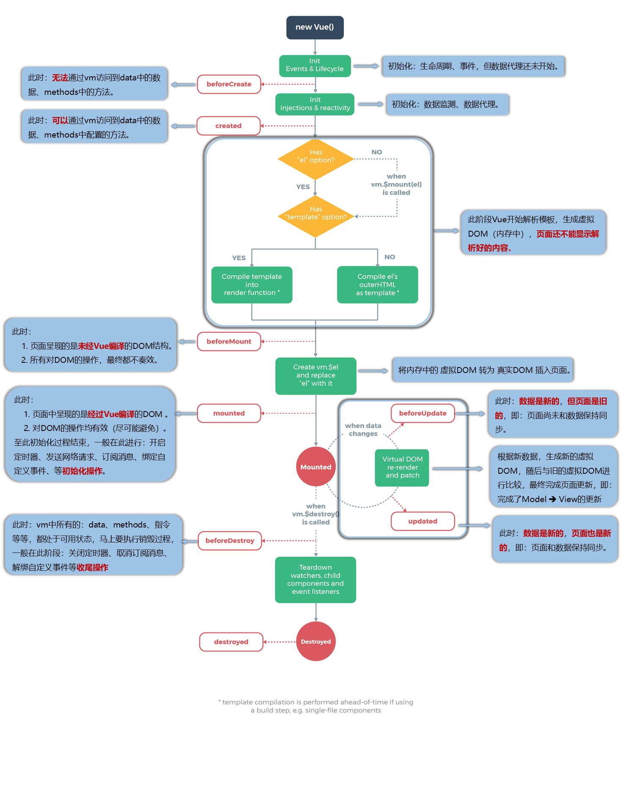

# html/css


# JavaScript


# vue

### 1.请系统讲讲 Vue2 与 Vue3 的核心差异（响应式、API 设计、性能与编译器）。


Vue2 和 Vue3 的核心差异主要体现在以下几个方面：


**1. 响应式系统（底层原理的根本性变化）**


| **特性**     | **Vue2**                                                     | **Vue3**                                                     |
| ------------ | ------------------------------------------------------------ | ------------------------------------------------------------ |
| **底层实现** | 使用 **`Object.defineProperty`**                             | 使用 **`Proxy`** API                                         |
| **检测限制** | 无法监听对象属性的**新增**和**删除**，需要使用 `$set` 或 `$delete` 。 | 可以直接监听对象属性的**新增**和**删除**，不需要特殊 API。   |
| **数组检测** | 需要重写数组原型方法（如 `push`, `pop` ,`shift`,`unshift`,`splice`,`sort`,`reverse`）。 | `可以通过 `Proxy` 直接拦截数组操作，支持数组索引访问和修改。` |

**`Proxy` 的优势：** 提供了完整的对象代理能力，性能更好，且解决了 Vue2 中无法追踪新增/删除属性的痛点。

```
<template>
  <div>
    <h1>个人信息</h1>
    <h2>name:{{ student.name }}</h2>
    <h2 v-show="student.sex">sex:{{ student.sex }}</h2>
    <h2 v-show="student.height">height:{{ student.height }}</h2>
    <h2>hobby:{{ student.hobby }}</h2>

    <button @click="addproperty">添加身高属性</button>
    <button @click="deleteproperty">删除性别属性</button>
    <button @click="changeproperty">修改爱好属性</button>
  </div>
</template>

<script>
export default {
  name: "App",
  data() {
    return {
      student: {
        name: "zk",
        sex: "male",
        hobby: ["drink", "walk"],
      },
    };
  },
  // 3_src_vue2响应式原理
  methods: {
    addproperty() {
      console.log(this.student);
      // 在vue2环境下，添加成功，但是页面并不会响应更新
      console.log(this.student.height);
      // this.student.height = "170";
      console.log(this.student.height);
      // 解决办法,记得在vue2环境下执行
      this.$set(this.student, "height", 170);
      // 问题：使用数组下标添加不会响应生效
      // this.student.hobby[0] = "play";
      // 解决
      this.student.hobby.splice(0, 0, "paly");
    },
    changeproperty() {
      // 问题：使用数组下标添加不会响应生效
      // this.student.hobby[0] = "play";
      // 解决
      this.student.hobby.splice(0, 1, "paly");
    },
    deleteproperty() {
      // 同样在vue2环境下，页面不能够及时响应
      // delete this.student.sex;
      // 解决办法
      this.$delete(this.student, "sex");
    },
  },
};
</script>

<style></style>

```


**2. 组件编写方式（代码组织方式的变化）**


| **特性**       | **Vue2**                                                     | **Vue3**                                                     |
| -------------- | ------------------------------------------------------------ | ------------------------------------------------------------ |
| **API 风格**   | **选项式 API (Options API)**：将逻辑分散到不同的选项中（`data`、`methods`、`computed`、`watch` 等） 。 | **组合式 API (Composition API)**：通过 `setup` 函数，将同一功能的逻辑集中写在一起 。 |
| **逻辑复用**   | 主要通过 `Mixins` 实现，容易造成命名冲突和数据来源不清晰。   | 通过自定义 **`Hooks`** (例如：`useMousePosition`) 实现，逻辑清晰，类型推导友好（配合 TypeScript 6）。 |
| **TypeScript** | 对 TS 支持不友好，需要额外的装饰器或工具。                   | 对 TS 支持是**原生**的， Composition API 更容易进行类型推导 7。 |


**组合式 API (Composition API) 的优势：** 提高了大型项目逻辑的可读性、可维护性和复用性，特别适合复杂组件的开发 8。


**3. 性能优化与打包体积**


| **特性**     | **Vue2**                          | **Vue3**                                                     |
| ------------ | --------------------------------- | ------------------------------------------------------------ |
| **编译优化** | 缺少静态提升，全量虚拟 DOM 比对。 | **静态提升 (Static Hoisting)** 和 **块级 (Block Tree) 优化**。 |
| **虚拟 DOM** | 全量遍历比对 VDOM 树。            | 编译时标记静态内容，运行时只比对**动态**部分，减少了不必要的比对，提升了渲染性能。 |
| **打包体积** | 难以进行彻底的 **Tree-shaking**。 | 许多内部模块（如 `Transition`、`KeepAlive`）是按需导入的，配合 Composition API，能实现更彻底的 Tree-shaking，减小打包体积。 |


**总结**

1. **响应式系统**：

   - **Vue 2**：基于Object.defineProperty，无法自动检测**对象属性的添加/删除**和**数组索引变化**，需借助Vue.set/Vue.delete等特殊 API。
   - **Vue 3**：基于Proxy，**原生支持**对对象和数组的各种变化监听，无上述限制，性能更优。

2. **API 设计**：

   - **Vue 2 (Options API)**：按选项（data,methods等）组织代码，逻辑分散。复用代码使用 **Mixins**，容易引发命名冲突。
   - **Vue 3 (Composition API)**：按**逻辑功能**组织代码，相关代码集中，更利于维护和阅读。复用代码使用**自定义 Hook 函数**，清晰灵活，且**原生 TypeScript 支持极佳**。

3. **性能与编译器**：

   - Vue 3

      在编译阶段进行了大量优化：

     - **Tree-shaking**：未使用的 API 不会打包进最终产物，体积更小。
     - **Patch Flags**：编译时标记动态节点，Diff 算法时直接定位变化，大幅提升虚拟 DOM 比对效率。
     - **静态提升**：将静态节点缓存，跳过重复渲染。

   - 结果：Vue 3 在**打包体积、更新性能、内存占用**上均优于 Vue 2。

4. **新特性**：

   - **Vue 3** 新增了 **Teleport**（将组件渲染到指定DOM）、**Fragment**（支持多根节点模板）等特性，解决了常见开发痛点。


### 2.说说 Vue 的生命周期（含父子组件先后顺序）以及常见实践放在哪些钩子里。




Vue生命周期总共可以分为8个阶段：创建前后, 载入前后,更新前后,销毁前销毁后，以及一些特殊场景的生命周期

| 生命周期      | 描述                               |
| :------------ | :--------------------------------- |
| beforeCreate  | 组件实例被创建之初                 |
| created       | 组件实例已经完全创建               |
| beforeMount   | 组件挂载之前                       |
| mounted       | 组件挂载到实例上去之后             |
| beforeUpdate  | 组件数据发生变化，更新之前         |
| updated       | 组件数据更新之后                   |
| beforeDestroy | 组件实例销毁之前                   |
| destroyed     | 组件实例销毁之后                   |
| activated     | keep-alive 缓存的组件激活时        |
| deactivated   | keep-alive 缓存的组件停用时调用    |
| errorCaptured | 捕获一个来自子孙组件的错误时被调用 |

==**生命周期流程**==

**使用场景**

1. **创建阶段（Creation）**：初始化响应式数据和事件。
   - beforeCreate：实例刚创建，**数据data和事件methods还未初始化**。
   - created：**实例创建完成**。数据data已响应式化，事件methods已配置，**可在此发起异步请求**。**但未挂载，DOM 不存在**。
2. **挂载阶段（Mounting）**：将模板编译渲染成真实 DOM 并插入页面。
   - beforeMount：模板已编译，**但尚未将渲染内容挂载到页面上**。
   - mounted：**实例已挂载到页面**，真实 DOM 已生成并可访问，**可在此进行 DOM 操作或访问$refs**。
3. **更新阶段（Updating）**：当数据变化时，虚拟 DOM 重新渲染和打补丁。
   - beforeUpdate：数据发生变化，**但虚拟 DOM 尚未重新渲染**。
   - updated：数据更改导致虚拟 DOM 重新渲染和打补丁完成，**可在此操作更新后的 DOM**（但要谨慎，避免无限循环更新）。
4. **卸载阶段（Unmouting/Destruction）**：实例被销毁。
   - beforeUnmount(Vue 3) /beforeDestroy(Vue 2)：**实例即将被销毁**，此刻实例仍完全可用。
   - unmounted(Vue 3) /destroyed(Vue 2)：**实例已销毁**，所有指令被解绑，事件监听器被移除，子实例也被销毁。**在此进行最终的清理工作**（如清除定时器、取消事件总线监听）。

> **注意**：Vue 3 将beforeDestroy和destroyed重命名为beforeUnmount和unmounted，语义更准确。

**beforeCreate -> created**

- 初始化`vue`实例，进行数据观测

**created**

- 完成数据观测，属性与方法的运算，`watch`、`event`事件回调的配置
- 可调用`methods`中的方法，访问和修改data数据触发响应式渲染`dom`，可通过`computed`和`watch`完成数据计算
- 此时`vm.$el` 并没有被创建

**created -> beforeMount**

- 判断是否存在`el`选项，若不存在则停止编译，直到调用`vm.$mount(el)`才会继续编译
- 优先级：`render` > `template` > `outerHTML`
- `vm.el`获取到的是挂载`DOM`的

**beforeMount**

- 在此阶段可获取到`vm.el`
- 此阶段`vm.el`虽已完成DOM初始化，但并未挂载在`el`选项上

**beforeMount -> mounted**

- 此阶段`vm.el`完成挂载，`vm.$el`生成的`DOM`替换了`el`选项所对应的`DOM`

**mounted**

- `vm.el`已完成`DOM`的挂载与渲染，此刻打印`vm.$el`，发现之前的挂载点及内容已被替换成新的DOM

**beforeUpdate**

- 更新的数据必须是被渲染在模板上的（`el`、`template`、`render`之一）
- 此时`view`层还未更新
- 若在`beforeUpdate`中再次修改数据，不会再次触发更新方法

**updated**

- 完成`view`层的更新
- 若在`updated`中再次修改数据，会再次触发更新方法（`beforeUpdate`、`updated`）

**beforeDestroy**

- 实例被销毁前调用，此时实例属性与方法仍可访问

**destroyed**

- 完全销毁一个实例。可清理它与其它实例的连接，解绑它的全部指令及事件监听器
- 并不能清除DOM，仅仅销毁实例

==数据请求在created在mounted的区别==

`created`是在组件实例一旦创建完成的时候立刻调用，这时候页面`dom`节点并未生成；`mounted`是在页面`dom`节点渲染完毕之后就立刻执行的。触发时机上`created`是比`mounted`要更早的，两者的相同点：都能拿到实例对象的属性和方法。 讨论这个问题本质就是触发的时机，放在`mounted`中的请求有可能导致页面闪动（因为此时页面`dom`结构已经生成），但如果在页面加载前完成请求，则不会出现此情况。建议对页面内容的改动放在`created`生命周期当中。

==父子组件生命周期顺序==

这是一个高频面试点，顺序如下：

- **加载渲染过程**：
  父 beforeCreate->父 created->父 beforeMount-> **子 beforeCreate->子 created->子 beforeMount->子 mounted** ->父 mounted
- **更新过程**：
  父 beforeUpdate-> **子 beforeUpdate->子 updated** ->父 updated
- **销毁过程**：
  父 beforeUnmount-> **子 beforeUnmount->子 unmounted** ->父 unmounted

**规律**：父组件总会等待其内部的子组件完成后，自己才会完成。如同“父组件搭建好框架(beforeMount)，子组件进去装修完工(mounted)，父组件才算整体完工(mounted)”

==常见实践和钩子选择==

| 生命周期钩子                    | 常见实践与操作                                               |
| :------------------------------ | :----------------------------------------------------------- |
| **created**                     | **最常用**。进行**异步数据请求**（如调用 API）、初始化一些非响应式的数据。此时可访问data和methods，但无法操作 DOM。 |
| **mounted**                     | **操作 DOM**、使用$refs访问子组件或 DOM 元素、集成第三方库（如图表库、地图库）需要 DOM 的场景。 |
| **beforeUnmount/beforeDestroy** | **清理工作**。清除定时器 (clearInterval)、取消事件总线监听 ($off)、取消未完成的网络请求，防止内存泄漏。 |
| **updated**                     | **在数据更改后操作更新后的 DOM**。使用较少，需特别小心，因为任何数据修改都可能触发此钩子，容易导致无限更新循环。 |
| **activated/deactivated**       | （配合\<keep-alive>使用）当组件被切换时，用于执行激活或停用的逻辑（如重新请求数据、暂停视频播放）。 |


### 3.Vue 的 MVVM 模式

1. **View（视图）**

视图是用户直接与之交互的部分，通常是 HTML 页面中的元素。它负责展示数据和接收用户的输入。在 Vue 中，视图通过模板语法（如 `{{ }}` 和 `v-bind`）来展示数据，通过事件监听（如 `v-on`）来响应用户的操作。

2. **Model（模型）**

模型是应用程序的数据存储部分。它包含了应用程序需要处理的所有数据。在 Vue 中，模型通常是 Vue 实例的 `data` 属性中定义的数据对象。模型中的数据可以是简单的变量，也可以是复杂的对象。

3. **ViewModel（视图模型）**

视图模型是连接视图和模型的桥梁。它负责监听模型中的数据变化，并将这些变化同步到视图上；同时，它也负责将视图中的用户操作（如输入框的值变化）同步到模型中。Vue 的核心功能之一就是实现了这个视图模型的自动化。

4. **`v-model` 的作用**

`v-model` 是 Vue 中实现双向数据绑定的重要指令，它是视图模型（ViewModel）的一个重要手段。通过 `v-model`，Vue 实现了视图和模型之间的自动同步。


**总结**

- **View（视图）**：展示数据和接收用户输入。
- **Model（模型）**：存储和管理数据。
- **ViewModel（视图模型）**：通过 `v-model` 等机制实现视图和模型之间的双向数据绑定，确保它们之间的数据同步。


### 4.什么是SPA

**1. 什么是单页面应用（SPA）**

单页面应用（SPA）是一种网页应用，用户在浏览时不需要重新加载整个页面。就像你在手机上用一个APP，点击不同的按钮，页面内容会变，但整个APP不会重新启动一样。

**2. 举个例子**

想象你有一个电子书阅读器的网站：

- **传统网页应用** ：每次你点击不同的章节，整个页面都会重新加载，就像你每次换书都要重新打开一个新的书一样。
- **单页面应用（SPA）** ：你点击不同的章节，只有书的内容会变，但整个页面不会重新加载，就像你在同一个书里翻页一样。

**3. SPA 的工作原理**

- **初始加载** ：用户第一次访问时，加载一个主页面，这个页面包含了所有需要的代码。
- **动态更新** ：用户点击按钮或进行操作时，只有需要的部分会更新，不需要重新加载整个页面。

官方专业一些的写法：

1. **初始加载** ：当用户首次访问 SPA 时，浏览器会加载一个主页面（通常是 `index.html`），这个页面包含了应用的基本结构和必要的脚本（如 JavaScript 文件）。
2. **动态内容加载** ：用户在应用中进行操作（如点击菜单、提交表单等）时，应用会通过 JavaScript 动态地从服务器请求数据（通常是 JSON 格式），然后根据这些数据更新页面的局部内容，而不是重新加载整个页面。
3. **路由管理** ：SPA 通常使用前端路由（也称为客户端路由）来管理不同的视图。前端路由通过监听 URL 的变化（通常是通过 `hash` 或 `history` API）来决定加载哪个组件或视图。


### 5.v-show和v-if有什么区别？使用场景分别是什么？


**v-show与v-if的共同点**

我们都知道在 `vue` 中 `v-show` 与 `v-if` 的作用效果是相同的(不含v-else)，都能控制元素在页面是否显示

在用法上也是相同的

```js
<Model v-show="isShow" />
<Model v-if="isShow" />
```

- 当表达式为`true`的时候，都会占据页面的位置
- 当表达式都为`false`时，都不会占据页面位置

**v-show与v-if的区别**

- 控制手段不同
- 编译过程不同
- 编译条件不同

控制手段：`v-show`隐藏则是为该元素添加`css--display:none`，`dom`元素依旧还在。`v-if`显示隐藏是将`dom`元素整个添加或删除

编译过程：`v-if`切换有一个局部编译/卸载的过程，切换过程中合适地销毁和重建内部的事件监听和子组件；`v-show`只是简单的基于css切换

编译条件：`v-if`是真正的条件渲染，它会确保在切换过程中条件块内的事件监听器和子组件适当地被销毁和重建。只有渲染条件为假时，并不做操作，直到为真才渲染

- `v-show` 由`false`变为`true`的时候不会触发组件的生命周期
- `v-if`由`false`变为`true`的时候，触发组件的`beforeCreate`、`create`、`beforeMount`、`mounted`钩子，由`true`变为`false`的时候触发组件的`beforeDestory`、`destoryed`方法

性能消耗：`v-if`有更高的切换消耗；`v-show`有更高的初始渲染消耗；


**v-show与v-if的使用场景**

`v-if` 与 `v-show` 都能控制`dom`元素在页面的显示

`v-if` 相比 `v-show` 开销更大的（直接操作`dom`节点增加与删除）

如果需要非常频繁地切换，则使用 v-show 较好

如果在运行时条件很少改变，则使用 v-if 较好


==下面的看不懂==

**v-show与v-if原理分析**

具体解析流程这里不展开讲，大致流程如下

- 将模板`template`转为`ast`结构的`JS`对象
- 用`ast`得到的`JS`对象拼装`render`和`staticRenderFns`函数
- `render`和`staticRenderFns`函数被调用后生成虚拟`VNODE`节点，该节点包含创建`DOM`节点所需信息
- `vm.patch`函数通过虚拟`DOM`算法利用`VNODE`节点创建真实`DOM`节点

**v-show原理**


不管初始条件是什么，元素总是会被渲染

我们看一下在`vue`中是如何实现的

代码很好理解，有`transition`就执行`transition`，没有就直接设置`display`属性

```js
// https://github.com/vuejs/vue-next/blob/3cd30c5245da0733f9eb6f29d220f39c46518162/packages/runtime-dom/src/directives/vShow.ts
export const vShow: ObjectDirective<VShowElement> = {
  beforeMount(el, { value }, { transition }) {
    el._vod = el.style.display === 'none' ? '' : el.style.display
    if (transition && value) {
      transition.beforeEnter(el)
    } else {
      setDisplay(el, value)
    }
  },
  mounted(el, { value }, { transition }) {
    if (transition && value) {
      transition.enter(el)
    }
  },
  updated(el, { value, oldValue }, { transition }) {
    // ...
  },
  beforeUnmount(el, { value }) {
    setDisplay(el, value)
  }
}
```

**v-if原理**

`v-if`在实现上比`v-show`要复杂的多，因为还有`else` `else-if` 等条件需要处理，这里我们也只摘抄源码中处理 `v-if` 的一小部分

返回一个`node`节点，`render`函数通过表达式的值来决定是否生成`DOM`

```js
// https://github.com/vuejs/vue-next/blob/cdc9f336fd/packages/compiler-core/src/transforms/vIf.ts
export const transformIf = createStructuralDirectiveTransform(
  /^(if|else|else-if)$/,
  (node, dir, context) => {
    return processIf(node, dir, context, (ifNode, branch, isRoot) => {
      // ...
      return () => {
        if (isRoot) {
          ifNode.codegenNode = createCodegenNodeForBranch(
            branch,
            key,
            context
          ) as IfConditionalExpression
        } else {
          // attach this branch's codegen node to the v-if root.
          const parentCondition = getParentCondition(ifNode.codegenNode!)
          parentCondition.alternate = createCodegenNodeForBranch(
            branch,
            key + ifNode.branches.length - 1,
            context
          )
        }
      }
    })
  }
)
```


### 6.v-if和v-for的优先级是什么？

==用法==

`v-if` 指令用于条件性地渲染一块内容。这块内容只会在指令的表达式返回 `true`值的时候被渲染

`v-for` 指令基于一个数组来渲染一个列表。`v-for` 指令需要使用 `item in items` 形式的特殊语法，其中 `items` 是源数据数组或者对象，而 `item` 则是被迭代的数组元素的别名

在 `v-for` 的时候，建议设置`key`值，并且保证每个`key`值是独一无二的，这便于`diff`算法进行优化

==优先级==

最终结论：`v-for`优先级比`v-if`高

**详情可以去看(网址)[https://vue3js.cn/interview/vue/if_for.html#%E4%BA%8C%E3%80%81%E4%BC%98%E5%85%88%E7%BA%A7]**

### 7.SPA首屏加载速度慢怎么解决

==什么是首屏加载==

首屏时间（First Contentful Paint），指的是浏览器从响应用户输入网址地址，到首屏内容渲染完成的时间，此时整个网页不一定要全部渲染完成，但需要展示当前视窗需要的内容

首屏加载可以说是用户体验中**最重要**的环节。

==加载缓慢的原因==

在页面渲染的过程，导致加载速度慢的因素可能如下：

- 网络延时问题
- 资源文件体积是否过大
- 资源是否重复发送请求去加载了
- 加载脚本的时候，渲染内容堵塞了

==解决方案==

常见的几种SPA首屏优化方式

- 减小入口文件积
- 静态资源本地缓存
- UI框架按需加载
- 图片资源的压缩
- 组件重复打包
- 开启GZip压缩
- 使用SSR

**减入口文件体积**

常用的手段是路由懒加载，把不同路由对应的组件分割成不同的代码块，待路由被请求的时候会单独打包路由，使得入口文件变小，加载速度大大增加

在`vue-router`配置路由的时候，采用动态加载路由的形式

```
routes:[ 
    path: 'Blogs',
    name: 'ShowBlogs',
    component: () => import('./components/ShowBlogs.vue')
]
```

以函数的形式加载路由，这样就可以把各自的路由文件分别打包，只有在解析给定的路由时，才会加载路由组件

**静态资源本地缓存**

后端返回资源问题：

- 采用`HTTP`缓存，设置`Cache-Control`，`Last-Modified`，`Etag`等响应头
- 采用`Service Worker`离线缓存

前端合理利用`localStorage`

**UI框架按需加载**

在日常使用`UI`框架，例如`element-UI`、或者`antd`，我们经常性直接引用整个`UI`库

```js
import ElementUI from 'element-ui'
Vue.use(ElementUI)
```

但实际上我用到的组件只有按钮，分页，表格，输入与警告 所以我们要按需引用

```js
import { Button, Input, Pagination, Table, TableColumn, MessageBox } from 'element-ui';
Vue.use(Button)
Vue.use(Input)
Vue.use(Pagination)
```

**组件重复打包**

假设`A.js`文件是一个常用的库，现在有多个路由使用了`A.js`文件，这就造成了重复下载

解决方案：在`webpack`的`config`文件中，修改`CommonsChunkPlugin`的配置

```js
minChunks: 3
```

`minChunks`为3表示会把使用3次及以上的包抽离出来，放进公共依赖文件，避免了重复加载组件

**图片资源压缩**

图片资源虽然不在编码过程中，但它却是对页面性能影响最大的因素

对于所有的图片资源，我们可以进行适当的压缩

对页面上使用到的`icon`，可以使用在线字体图标，或者雪碧图，将众多小图标合并到同一张图上，用以减轻`http`请求压力。

**开启Gzip压缩**

拆完包之后，我们再用`gzip`做一下压缩 安装`compression-webpack-plugin`

```js
cnmp i compression-webpack-plugin -D
```

在`vue.congig.js`中引入并修改`webpack`配置

```js
const CompressionPlugin = require('compression-webpack-plugin')

configureWebpack: (config) => {
        if (process.env.NODE_ENV === 'production') {
            // 为生产环境修改配置...
            config.mode = 'production'
            return {
                plugins: [new CompressionPlugin({
                    test: /\.js$|\.html$|\.css/, //匹配文件名
                    threshold: 10240, //对超过10k的数据进行压缩
                    deleteOriginalAssets: false //是否删除原文件
                })]
            }
        }
```

在服务器我们也要做相应的配置 如果发送请求的浏览器支持`gzip`，就发送给它`gzip`格式的文件 我的服务器是用`express`框架搭建的 只要安装一下`compression`就能使用

```text
const compression = require('compression')
app.use(compression())  // 在其他中间件使用之前调用
```

**使用SSR**

SSR（Server side render ），也就是服务端渲染，组件或页面通过服务器生成html字符串，再发送到浏览器

从头搭建一个服务端渲染是很复杂的，`vue`应用建议使用`Nuxt.js`实现服务端渲染

### 8.为什么data属性是一个函数而不是一个对象？

- 根实例对象`data`可以是对象也可以是函数（根实例是单例），不会产生数据污染情况
- 组件实例对象`data`必须为函数，目的是为了防止多个组件实例对象之间共用一个`data`，产生数据污染。采用函数的形式，`initData`时会将其作为工厂函数都会返回全新`data`对象

**[详细原理分析](https://vue3js.cn/interview/vue/data.html#%E4%B8%89%E3%80%81%E5%8E%9F%E7%90%86%E5%88%86%E6%9E%90)**

### 9.动态给vue的data添加一个新的属性的时候会发生什么？怎么解决

==一、直接添加属性的问题==

我们从一个例子开始

定义一个`p`标签，通过`v-for`指令进行遍历

然后给`botton`标签绑定点击事件，我们预期点击按钮时，数据新增一个属性，界面也 新增一行

```html
<p v-for="(value,key) in item" :key="key">
    {{ value }}
</p>
<button @click="addProperty">动态添加新属性</button>
```

实例化一个`vue`实例，定义`data`属性和`methods`方法

```js
const app = new Vue({
    el:"#app",
   	data:()=>{
       	item:{
            oldProperty:"旧属性"
        }
    },
    methods:{
        addProperty(){
            this.items.newProperty = "新属性"  // 为items添加新属性
            console.log(this.items)  // 输出带有newProperty的items
        }
    }
})
```

点击按钮，发现结果不及预期，数据虽然更新了（`console`打印出了新属性），但页面并没有更新

==二、原理分析==

为什么产生上面的情况呢？

下面来分析一下

`vue2`是用过`Object.defineProperty`实现数据响应式

```js
const obj = {}
Object.defineProperty(obj, 'foo', {
        get() {
            console.log(`get foo:${val}`);
            return val
        },
        set(newVal) {
            if (newVal !== val) {
                console.log(`set foo:${newVal}`);
                val = newVal
            }
        }
    })
}
```

当我们访问`foo`属性或者设置`foo`值的时候都能够触发`setter`与`getter`

```js
obj.foo   
obj.foo = 'new'
```

但是我们为`obj`添加新属性的时候，却无法触发事件属性的拦截

```js
obj.bar  = '新属性'
```

原因是一开始`obj`的`foo`属性被设成了响应式数据，而`bar`是后面新增的属性，并没有通过`Object.defineProperty`设置成响应式数据

==三、解决方案==

`Vue` 不允许在已经创建的实例上动态添加新的响应式属性

若想实现数据与视图同步更新，可采取下面三种解决方案：

- Vue.set()
- Object.assign()
- $forcecUpdated()

==Vue.set()==

Vue.set( target, propertyName/index, value )

```
new Vue({
  el: '#app',
  data: {
    user: {
      name: '张三'
    }
  },
  methods: {
    addAge() {
      // 使用 Vue.set 动态添加新属性
      this.$set(this.user, 'age', 25);
    }
  }
});
```


参数

- `{Object | Array} target`
- `{string | number} propertyName/index`
- `{any} value`

返回值：设置的值

通过`Vue.set`向响应式对象中添加一个`property`，并确保这个新 `property`同样是响应式的，且触发视图更新

关于`Vue.set`源码（省略了很多与本节不相关的代码）

源码位置：`src\core\observer\index.js`

```js
function set (target: Array<any> | Object, key: any, val: any): any {
  ...
  defineReactive(ob.value, key, val)
  ob.dep.notify()
  return val
}
```

这里无非再次调用`defineReactive`方法，实现新增属性的响应式

关于`defineReactive`方法，内部还是通过`Object.defineProperty`实现属性拦截

大致代码如下：

```js
function defineReactive(obj, key, val) {
    Object.defineProperty(obj, key, {
        get() {
            console.log(`get ${key}:${val}`);
            return val
        },
        set(newVal) {
            if (newVal !== val) {
                console.log(`set ${key}:${newVal}`);
                val = newVal
            }
        }
    })
}
```

==Object.assign()==

直接使用`Object.assign()`添加到对象的新属性不会触发更新

应创建一个新的对象，合并原对象和混入对象的属性

```js
this.someObject = Object.assign({},this.someObject,{newProperty1:1,newProperty2:2 ...})
```

```
new Vue({
  el: '#app',
  data: {
    user: {
      name: '张三',
      age: 20
    }
  },
  methods: {
    updateUser() {
      // 使用 Object.assign 更新 user 对象
      //{} 是一个空对象，用作 Object.assign 的目标对象。这一步是为了确保我们不会直接修改原始的 this.user 对象，而是创建一个新的对象。
      this.user = Object.assign({}, this.user, {
        name: '李四',
        age: 25
      });
      //添加属性
     this.user = Object.assign({}, this.user, {
        email: 'zhangsan@example.com'
      });
    }
  }
});
```

==$forceUpdate==

如果你发现你自己需要在 `Vue`中做一次强制更新，99.9% 的情况，是你在某个地方做错了事

`$forceUpdate`迫使`Vue` 实例重新渲染

PS：仅仅影响实例本身和插入插槽内容的子组件，而不是所有子组件。

==小结==

- 如果为对象添加少量的新属性，可以直接采用`Vue.set()`
- 如果需要为新对象添加大量的新属性，则通过`Object.assign()`创建新对象
- 如果你实在不知道怎么操作时，可采取`$forceUpdate()`进行强制刷新 (不建议)

PS：`vue3`是用过`proxy`实现数据响应式的，直接动态添加新属性仍可以实现数据响应式

### 10.vue中组件和插件有什么区别

==一、组件是什么==

回顾以前对组件的定义：

组件就是把图形、非图形的各种逻辑均抽象为一个统一的概念（组件）来实现开发的模式，在`Vue`中每一个`.vue`文件都可以视为一个组件

组件的优势

- 降低整个系统的耦合度，在保持接口不变的情况下，我们可以替换不同的组件快速完成需求，例如输入框，可以替换为日历、时间、范围等组件作具体的实现
- 调试方便，由于整个系统是通过组件组合起来的，在出现问题的时候，可以用排除法直接移除组件，或者根据报错的组件快速定位问题，之所以能够快速定位，是因为每个组件之间低耦合，职责单一，所以逻辑会比分析整个系统要简单
- 提高可维护性，由于每个组件的职责单一，并且组件在系统中是被复用的，所以对代码进行优化可获得系统的整体升级

==二、插件是什么==

插件通常用来为 `Vue` 添加全局功能。插件的功能范围没有严格的限制——一般有下面几种：

- 添加全局方法或者属性。如: `vue-custom-element`
- 添加全局资源：指令/过滤器/过渡等。如 `vue-touch`
- 通过全局混入来添加一些组件选项。如`vue-router`
- 添加 `Vue` 实例方法，通过把它们添加到 `Vue.prototype` 上实现。
- 一个库，提供自己的 `API`，同时提供上面提到的一个或多个功能。如`vue-router`

==三、两者的区别==

两者的区别主要表现在以下几个方面：

- 编写形式
- 注册形式
- 使用场景

**编写形式**

- 编写组件

编写一个组件，可以有很多方式，我们最常见的就是`vue`单文件的这种格式，每一个`.vue`文件我们都可以看成是一个组件

`vue`文件标准格式

```vue
<template>
</template>
<script>
export default{ 
    ...
}
</script>
<style>
</style>
```

我们还可以通过`template`属性来编写一个组件，如果组件内容多，我们可以在外部定义`template`组件内容，如果组件内容并不多，我们可直接写在`template`属性上

```js
<template id="testComponent">     // 组件显示的内容
    <div>component!</div>   
</template>

Vue.component('componentA',{ 
    template: '#testComponent'  
    template: `<div>component</div>`  // 组件内容少可以通过这种形式
})
```

- 编写插件

`vue`插件的实现应该暴露一个 `install` 方法。这个方法的第一个参数是 `Vue` 构造器，第二个参数是一个可选的选项对象

```js
js文件中：
MyPlugin.install = function (Vue, options) {
  // 1. 添加全局方法
  //这里定义了一个全局方法 myGlobalMethod，可以通过 Vue.myGlobalMethod() 调用。
  //全局方法可以在任何地方使用，但通常用于工具函数或通用逻辑
  Vue.myGlobalMethod = function () {
    console.log('这是一个全局方法');
  };

  // 2. 添加全局指令
  //这里定义了一个全局指令 my-directive，可以通过 v-my-directive 使用。
  //指令的 bind 钩子在指令绑定到元素时调用，可以用来操作 DOM。
  Vue.directive('my-directive', {
    bind (el, binding, vnode) {
      console.log('指令绑定到元素上');
      el.style.color = 'red'; // 示例：将元素文字颜色变为红色
    }
  });

  // 3. 注入组件选项
  //这里使用 Vue.mixin 注入了一个全局的 created 钩子。
  //这个钩子会在每个组件的 created 钩子之前执行，可以用来添加全局的逻辑。
  Vue.mixin({
    created: function () {
      console.log('每个组件创建时都会执行这里');
    }
  });

  // 4. 添加实例方法
  //这里定义了一个实例方法 $myMethod，可以通过 this.$myMethod() 在任何组件中调用。
  //实例方法通常用于组件内部的逻辑，可以接收参数。
  Vue.prototype.$myMethod = function (methodOptions) {
    console.log('这是一个实例方法', methodOptions);
  };
};
```

```
<template>
    <div id="app">
      <p v-my-directive>{{ message }}</p>
    </div>
</template>
<script>
    import Vue from 'vue';
    import MyPlugin from './MyPlugin';

    // 使用插件
    Vue.use(MyPlugin);

    new Vue({
      el: '#app',
      data: {
        message: 'Hello Vue!'
      },
      mounted() {
        // 调用全局方法
        Vue.myGlobalMethod();

        // 调用实例方法
        this.$myMethod({ name: 'Kimi' });
      }
    });
</script>
```

输出：

这是一个全局方法
这是一个实例方法 { name: 'Kimi' }
每个组件创建时都会执行这里

页面显示：

Hello Vue!

文字颜色为红色（因为 `v-my-directive` 指令将文字颜色变为红色）。


**注册形式**

- 组件注册

`vue`组件注册主要分为全局注册与局部注册

全局注册通过`Vue.component`方法，第一个参数为组件的名称，第二个参数为传入的配置项

```js
Vue.component('my-component-name', { /* ... */ })
```

局部注册只需在用到的地方通过`components`属性注册一个组件

```js
const component1 = {...} // 定义一个组件

export default {
	components:{
		component1   // 局部注册
	}
}
```

- 插件注册

插件的注册通过`Vue.use()`的方式进行注册（安装），第一个参数为插件的名字，第二个参数是可选择的配置项

```js
Vue.use(插件名字,{ /* ... */} )
```

注意的是：

注册插件的时候，需要在调用 `new Vue()` 启动应用之前完成

`Vue.use`会自动阻止多次注册相同插件，只会注册一次

==使用场景==

具体的其实在插件是什么章节已经表述了，这里在总结一下

组件 `(Component)` 是用来构成你的 `App` 的业务模块，它的目标是 `App.vue`

插件 `(Plugin)` 是用来增强你的技术栈的功能模块，它的目标是 `Vue` 本身

简单来说，插件就是指对`Vue`的功能的增强或补充

### 11.组件间的通信方式有哪些

整理`vue`中8种常规的通信方案

1. 通过 props 传递
2. 通过 $emit 触发自定义事件
3. 使用 ref
4. EventBus
5. $parent 或$root

通过共同祖辈`$parent`或者`$root`搭建通信桥连

兄弟组件

```
this.$parent.on('add',this.add)
```

另一个兄弟组件

```
this.$parent.emit('add')
```

attrs 与 listeners

Provide 与 Inject

Vuex/pinia
