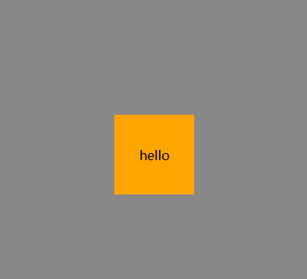

## `HTML`

### 1.src和href的区别

| 特性         | `src`(Source)                                | `href`(Hypertext Reference) |
| :----------- | :------------------------------------------- | :-------------------------- |
| **含义**     | 源，表示**嵌入**资源                         | 引用，表示**建立链接**      |
| **加载行为** | **阻塞式加载**，暂停其他资源                 | **非阻塞式加载**，并行下载  |
| **用途**     | 将资源**嵌入**到当前文档                     | 与外部资源**建立关联**      |
| **常见标签** | `<script>`, `<iframe>`, `<audio>`, `<video>` | `<a>`, `<link>`, `<area>`   |

**src**当浏览器解析到该元素时，会暂停其他资源的加载和处理，直到该资源加载完成。 它会将资源内容嵌入到当前标签所在的位置，将其指向的资源下载应用到文档内，如`js`脚本等。常用在`img`、`script`、`iframe`等标签。

**href**指向外部资源所在的位置，和当前元素位置建立链接，当浏览器解识别到它指向的位置，将其下载的时候不会阻止其他资源的加载解析。常用在`a` 、 `link`标签。

- `src`是"请把资源**放进来**" → 阻塞式，用于嵌入内容
- `href`是"这里有个**相关资源**" → 非阻塞式，用于建立关联


> src-源（阻塞式加载）

当浏览器遇到 `src`属性时，会**暂停当前文档的解析**，先下载并执行/显示该资源。

```js
<!DOCTYPE html>
<html>
<head>
    <title>src 示例</title>
</head>
<body>
    <h1>页面内容开始加载</h1>
    
    <!-- 这个 script 会阻塞页面渲染 -->
    <script src="https://example.com/large-script.js"></script>
    
    <p>这段内容要等上面的脚本加载执行完成后才会显示</p>
    <!-- 如果 large-script.js 加载很慢，用户会看到白屏 -->
</body>
</html>

优化方案
<!-- 使用 async 或 defer 避免阻塞 -->
<script src="script.js" defer></script>
<script src="analytics.js" async></script>

```


> `href`- 超链接（非阻塞式加载）

```js
<!DOCTYPE html>
<html>
<head>
    <title>href 示例</title>
    <!-- CSS 加载不会阻塞 HTML 解析 -->
    <link rel="stylesheet" href="styles.css">
</head>
<body>
    <h1>页面内容立即显示</h1>
    <p>即使 styles.css 加载很慢，文字内容也会立即显示</p>
    <!-- 只是样式应用会延迟 -->
</body>
</html>
```


### 2.HTML5新增特性

新增语义化标签，`head`、`footer`、`nav`、`main`、`section`等

新增表单类型属性，`email`、`number`、`时间控件`、`color颜色拾取器`、`placeholder`、`autofocus自动获取焦点...`

新增音视频标签，`video`、`audio`

```js
<video controls>
  <source src="movie.mp4" type="video/mp4">
</video>
<audio controls>
  <source src="audio.mp3" type="audio/mpeg">
</audio>
```

新增`canvas`画布、`websocket通信`、拖拽等

```js
<div draggable="true" id="dragItem">可拖拽元素</div>
<div id="dropZone">放置区域</div>

// 设置拖拽数据
dragItem.ondragstart = (e) => {
  e.dataTransfer.setData('text', e.target.id);
};

// 处理放置
dropZone.ondrop = (e) => {
  e.preventDefault();
  const data = e.dataTransfer.getData('text');
};

```

新增本地存储`localStorage`、`sessionStorage`

### 3.对HTML语义化理解（1）

- 根据内容来选择合适的标签

- 方便浏览器爬虫更好的识别内容。
- 有利于代码可读性，开发者能清晰的看出网页的结构，便于团队的开发与维护


### DOCTYPE(文档类型) 的作用

核心理解

`<!DOCTYPE>`是一个**文档类型声明**，它位于 HTML 文档的最顶部。它的核心作用是**告诉浏览器使用哪种HTML 或XHTML 规范来解析和渲染当前页面**。


通俗解释

您可以把浏览器理解为一个"翻译官"，它需要把 HTML 代码"翻译"成我们看到的网页。但是 HTML 有不同的"方言"或"版本"（如 HTML4, XHTML, HTML5）。

`<!DOCTYPE>`就像是告诉翻译官："请使用 HTML5 的语法规则来翻译这篇文档"。


### iframe 有那些优点和缺点？

`iframe`通常用来加载外部链接，不会影响网页内容的加载。

**优点**

- 可以将网页原封不动的加载进来
- 增加代码的可用性
- 用来加载显示较慢的内容，如广告、视频等

**缺点**

- 加载的内容无法被浏览器引擎识别，对`SEO`不友好
- 会阻塞`onload`事件加载
- 会产生很多页面，不利于管理


### Canvas和SVG的区别

- **Canvas 是位图画布**，通过 JavaScript API 进行像素级绘制。绘制完成后，图形信息丢失，性能很高，适合游戏、动态可视化等需要频繁重绘的场景。
- **SVG 是矢量图形**，使用 XML 描述图形，每个图形都是独立的 DOM 元素。可以单独添加样式和事件，缩放不失真，适合制作图标、地图等需要交互的静态或半静态图形。


### script标签中defer和async的区别

他俩都是表示**异步加载外部JS脚本**，不会阻碍页面的加载解析。 **区别**

- 执行顺序：有多个`async`标签不能保证先后加载顺序，而多个`defer`标签可以按先后顺序加载。
- 是否立即执行：`async`加载完脚本后会**立即执行**，`defer`是要等**文档解析完成后才执行**。

### script标签在不同位置中加载的区别（1）

1. 放在`<head>`标签内

```
<!DOCTYPE html>
<html>
<head>
    <script src="external.js"></script>
</head>
<body>
    <!-- 页面内容 -->
</body>
</html>
```

**特点**：

- **阻塞渲染**：浏览器解析到`<script>`时会暂停HTML解析，立即下载并执行JS文件
- **延迟显示**：用户会看到更长时间的白屏，因为页面内容要等JS下载执行完才渲染
- **DOM不可用**：此时`<body>`还未解析，无法操作DOM元素

**适用场景**：需要尽早执行的JS（如polyfill、关键性能监控代码）

2. 放在`<body>`底部（`</body>`标签前）

```
<!DOCTYPE html>
<html>
<body>
    <!-- 页面内容 -->
    <script src="external.js"></script>
</body>
</html>
```

**特点**：

- **不阻塞渲染**：页面内容先加载显示，用户体验好
- **DOM可用**：执行JS时整个DOM已加载完成，可安全操作DOM
- **渐进增强**：即使JS加载失败，基础内容仍可访问

**适用场景**：大多数情况下的最佳实践，特别是非关键的JS

3. 使用`async`属性

```
<head>
    <script async src="external.js"></script>
</head>
```

**特点**：

- **异步下载**：不阻塞HTML解析，并行下载JS
- **立即执行**：下载完成后立即执行，此时会阻塞HTML解析
- **执行顺序不确定**：多个`async`脚本谁先下载完谁先执行
- **不保证DOMContentLoaded顺序**：可能在DOM加载完成前或后执行

**适用场景**：独立第三方脚本（如分析统计代码），不依赖其他JS且不操作DOM

4. 使用`defer`属性

```
<head>
    <script defer src="external.js"></script>
</head>
```

**特点**：

- **异步下载**：不阻塞HTML解析
- **延迟执行**：在DOM解析完成后、`DOMContentLoaded`事件前按顺序执行
- **保持顺序**：多个`defer`脚本按HTML中的顺序执行
- **DOM已就绪**：执行时DOM已构建完成

**适用场景**：依赖DOM或有执行顺序要求的脚本，现代Web开发推荐方式

对比表格

| 位置/属性  | 加载时机 | 执行时机          | 阻塞解析               | 执行顺序 | DOM可用性 |
| ---------- | -------- | ----------------- | ---------------------- | -------- | --------- |
| `<head>`内 | 立即加载 | 立即执行          | 阻塞                   | 按顺序   | 不可用    |
| `<body>`底 | 解析到时 | 立即执行          | 不阻塞                 | 按顺序   | 可用      |
| `async`    | 异步加载 | 下载完立即执行    | 加载不阻塞，执行时阻塞 | 下载顺序 | 不一定    |
| `defer`    | 异步加载 | DOM解析后按序执行 | 不阻塞                 | 按顺序   | 可用      |

实际性能影响示例

```
<!-- 方案A：阻塞渲染 -->
<head>
    <script src="heavy-script.js"></script> <!-- 2秒下载 -->
</head>
<body>
    <h1>用户2秒后才看到我</h1>
</body>

<!-- 方案B：不阻塞 -->
<body>
    <h1>用户立即看到我</h1>
    <script src="heavy-script.js"></script> <!-- 2秒下载 -->
</body>
```

现代最佳实践

1. **关键JS用`defer`放`<head>`**

   ```
   <head>
       <script defer src="app.js"></script>
   </head>
   ```

2. **非关键JS用`async`或放底部**

   ```
   <script async src="analytics.js"></script>
   ```

3. **内联关键CSS，异步加载非关键CSS**

   ```
   <link rel="preload" href="style.css" as="style" onload="this.rel='stylesheet'">
   ```


**总结**：将`<script>`放在`<body>`底部或使用`defer`属性，能让页面内容更快显示，提升用户体验。`async`适合独立脚本，传统阻塞方式应尽量避免。


### 行内元素、块级元素、空（void）（1）

不同类型元素的区别：

| 类型           | 显示方式                   | 能否设置宽高   | 默认宽度       | 常见标签                                                    |
| :------------- | :------------------------- | :------------- | :------------- | :---------------------------------------------------------- |
| **块级元素**   | **独占一行**，前后有换行   | **可以**       | 父元素的100%   | `div`, `p`, `h1`-`h6`, `ul`, `li`, `section`,`dl`,`dt`,`dd` |
| **行内元素**   | **不换行**，并排显示       | **不可以**     | 内容的宽度     | `span`, `a`, `strong`, `b`, `select`                        |
| **行内块元素** | **不换行**                 | **可以**       |                | `img`,`input`                                               |
| **空元素**     | 根据其类型决定（块或行内） | 根据其类型决定 | 根据其类型决定 | `br`, `hr`, `img`, `input`, `link`, `meta`                  |

判断一个元素是否是空元素则是根据标签结构来划分的，普通元素：有开始标签和结束标签，中间可以放内容，空元素：自闭合，没有子内容（`<hr>`、`<br>`、``、`<input>`）

```
hr   → 块级  + 空元素
br   → 行内  + 空元素
img  → 行内块 + 空元素
div  → 块级  + 普通元素
span → 行内  + 普通元素
```


### 怎样添加、移除、移动、复制、创建和查找节点

- 添加节点`document.appendChild(dom)`
- 移除节点`document.removeChild(dom)`
- 移动节点`document.appendChild(targetDom)`
- 复制节点`dom.cloneNode(true)`，参数`true`表示是否复制子节点
- 创建节点`document.createElement(dom)`
- 查找节点:
  - `document.getElementById("elementId")`
  - `document.getElementsByClassName("className")`
  - `document.getElementsByTagName("tagName")`
  - `document.querySelector("selector")`
  - `document.querySelectorAll("selector")`

### 浏览器的重绘重排了解吗？（1）

 什么是重绘和重排？

要理解这两个概念，首先要知道浏览器渲染页面的基本流程：

1. **构建DOM树**：解析HTML，生成文档对象模型（DOM）。
2. **构建CSSOM树**：解析CSS，生成CSS对象模型（CSSOM）。
3. **生成渲染树（Render Tree）**：将DOM和CSSOM合并，形成包含所有可见节点及其样式的渲染树。
4. **布局（Layout / Reflow）**：计算渲染树中每个节点在屏幕上的确切位置和大小。这个过程就是**重排**。
5. **绘制（Painting / Repaint）**：根据计算好的布局和样式，将每个节点绘制到屏幕上。这个过程就是**重绘**。

- **重排 (Reflow)**：当元素的**几何属性**（如宽度、高度、位置、边距等）发生变化时，浏览器需要重新计算该元素以及可能受其影响的其他元素的位置和大小，这个过程称为重排。
  - 修改了元素尺寸
  - 更改了显示状态（例如元素在页面消失了，不占位了，所以opacity：0这些占据位置的操作是不会引发重排）
  - 修改了margin padding border等
  - 修改了元素内容（例如修改了文字，增添了文字等）
  - 修改布局方式，float position

- **重绘 (Repaint)**：当元素的**视觉属性**（如颜色、背景、可见性等）发生变化，但**不影响其几何布局**时，浏览器只需要重新绘制该元素，这个过程称为重绘。
  - 该背景色
  - 该文字颜色
  - 修改透明度

⚖️ 核心区别与联系

重绘和重排最核心的区别在于**是否影响页面布局**，这也直接决定了它们的性能开销。

| 对比维度         | 重排 (Reflow)            | 重绘 (Repaint)         |
| ---------------- | ------------------------ | ---------------------- |
| **是否影响布局** | ✅ 是                     | ❌ 否                   |
| **性能开销**     | ❌ **大** (涉及复杂计算)  | ✅ **小** (仅像素绘制)  |
| **影响范围**     | 可能影响父、子、兄弟元素 | 通常只影响当前元素本身 |
| **触发关系**     | **一定会**触发重绘       | **不一定**触发重排     |

**一句话总结**：重排是重新计算布局，开销大；重绘是重新上色，开销小。**重排必然导致重绘，但重绘不一定导致重排。**

 常见触发场景

了解哪些操作会触发它们，是进行性能优化的前提。

**触发重排的操作**

- **DOM结构变化**：添加、删除或移动DOM元素。

- **几何属性变更**：修改元素的 `width`, `height`, `margin`, `padding`, `border`, `top`, `left` 等。

- **内容变化**：文本内容改变（尤其是可能导致尺寸变化时）、图片加载完成。

- **浏览器窗口变化**：窗口 `resize` 或页面滚动（某些情况下）。

- 读取特定属性

  ：这是最容易被忽略的一点！读取某些需要即时计算的布局属性会强制触发一次同步重排

  ，例如：

  - `offsetWidth`, `offsetHeight`, `offsetTop`, `offsetLeft`
  - `clientWidth`, `clientHeight`
  - `scrollTop`, `scrollLeft`
  - `window.getComputedStyle()`

**仅触发重绘的操作**

- **视觉样式变更**：修改不影响布局的CSS属性，如 `color`, `background-color`, `visibility`, `outline`, `box-shadow` 等。

**🚀 如何优化？**

优化的核心思想是**减少重排的次数和影响范围**。

1. **批量修改DOM**
   - **使用 `DocumentFragment`**：先在内存中的文档片段上进行所有DOM操作，最后再一次性添加到页面，避免多次重排。
   - **先隐藏再显示**：对需要大量修改的元素，先设置 `display: none`（使其脱离文档流），修改完后再显示。这只会触发两次重排。（设置为该属性后，浏览器就不会计算他的位置了，设置为none会引发一次重排，然后我们对该元素进行若干操作，修改大小颜色之类的，不会引发重排，然后将其设置为可见，会触发第二次重排。通过将操作集中到元素消失的阶段来达到减少消耗的目的。）
   - **合并样式修改**：通过修改CSS类（`className`）来一次性应用多个样式，而不是多次修改 `style` 属性。
2. **避免“强制同步布局”**
   - **读写分离**：避免在JavaScript中交替进行“读取布局属性”和“写入样式”的操作。应将所有读取操作集中在一起，所有写入操作集中在一起。
   - **缓存布局信息**：如果某个布局属性的值在短时间内不会改变，可以将其缓存起来，避免重复读取。
3. **使用高性能的CSS属性**
   - **动画使用 `transform` 和 `opacity`**：对于动画，尽量使用 `transform` (如 `translateX`, `scale`) 和 `opacity` 来替代 `top`, `left`, `width`, `height`。`transform` 和 `opacity` 的变化通常可以由GPU直接处理，不触发重排，甚至不触发重绘，性能极佳。
   - **让动画元素脱离文档流**：将频繁变动的元素设置为 `position: absolute` 或 `fixed`，可以将其重排的影响范围降到最低。

**dom操作可能导致重排，例如修改了位置大小，宽高，增删节点，修改几何属性或删除，添加修改了节点。dom操作可能导致重绘，例如修改了颜色，透明度。重排是渲染过程，不会直接导致dom操作，所以要记住因果关系，dom可能导致重排，而不是重排导致dom操作**

### 什么是骨架屏

**"骨架屏是一种页面加载时的占位方案。**

在页面数据还没请求回来之前，先展示一个和真实页面结构相似的灰色占位图，等数据加载完成后再替换成真实内容。

为什么要用骨架屏？

用户最怕的不是等待，而是**不知道要等多久、不知道页面是否在加载**。

没有骨架屏的情况下，数据没回来页面就是一片空白或者转圈，用户体验很差，甚至以为页面崩了直接关掉。

骨架屏的作用就是给用户一个**"页面正在加载"的视觉反馈**，让等待过程不那么煎熬，感知上觉得页面加载更快了。

骨架屏 vs 普通 loading 转圈

|          | 骨架屏               | loading 转圈       |
| -------- | -------------------- | ------------------ |
| 视觉效果 | 和真实页面结构相似   | 只有一个菊花转     |
| 用户感知 | 知道页面大概长什么样 | 完全不知道加载什么 |
| 体验     | 更好，焦虑感更低     | 较差               |
| 适用场景 | 内容型页面、列表页   | 简单操作的等待     |

怎么实现？

**方法一：手写 CSS 占位块**

用灰色背景的 div 模拟页面结构，加上闪光动画：

```css
.skeleton {
  background: linear-gradient(
    90deg,
    #f0f0f0 25%,
    #e0e0e0 50%,
    #f0f0f0 75%
  );
  background-size: 200% 100%;
  animation: shimmer 1.5s infinite;
}

@keyframes shimmer {
  0% { background-position: 200% 0; }
  100% { background-position: -200% 0; }
}
```

**方法二：用现成的组件库**

Element Plus、Vant 这些组件库都内置了骨架屏组件，直接用就行：

```html
<!-- Element Plus -->
<el-skeleton :rows="5" animated />
```

**方法三：自动生成骨架屏**

有一些工具可以根据真实页面自动生成对应的骨架屏，比如 `vue-skeleton-webpack-plugin`，不需要手动写占位结构。什么场景适合用骨架屏？

- 列表页、文章详情页这类**内容型页面**
- 首屏加载时间较长的页面
- 用户需要感知页面结构的场景

不适合的场景：操作结果等待（比如提交表单），这种用普通 loading 就够了。

> 骨架屏本质是一种**用户心理优化**，不是真的让页面加载更快，而是让用户感觉没那么慢，降低等待焦虑，减少用户流失。

## 

**Q：骨架屏和白屏有什么关系？**

> 骨架屏就是解决白屏问题的方案之一，首屏白屏时间过长会导致用户流失，骨架屏能在数据回来之前先给用户看到页面轮廓，避免白屏。

**Q：骨架屏算不算性能优化？**

> 严格来说骨架屏不是技术层面的性能优化，不会让页面真的加载更快，但它是**用户体验层面的优化**，能降低用户对加载时间的感知，从产品角度来说也是很重要的优化手段。

**Q:有的时候，API 的请求回来的特别快，往往骨架占位刚刚被渲染，真实的数据就已经回来了，用户的界面会突然一闪， 如何应对这种情况呢**

**方案一：设置骨架屏最短展示时间**

不管数据多快回来，骨架屏至少展示 300ms ~ 500ms，避免一闪而过：

```js
const fetchData = async () => {
  const startTime = Date.now()
  
  // 数据请求和最短时间并行
  const [res] = await Promise.all([
    getListApi(),
    new Promise(resolve => setTimeout(resolve, 300)) // 至少等 300ms
  ])
  
  // 两个都完成才隐藏骨架屏
  data.value = res
  showSkeleton.value = false
}
```

用 `Promise.all` 同时等待接口和计时器，两个都完成才切换，既不影响数据快的情况，也能保证骨架屏有足够的展示时间。

**方案二：根据网速决定是否需要展示骨架屏**

网速快的时候根本不需要骨架屏，可以判断接口响应时间，超过一定阈值才展示：

例如200ms之后，如果数据还没有回来就展示骨架屏。在这200ms的等待期间，如果数据回来了，就销毁定时器。

```js
const fetchData = async () => {
  // 延迟 200ms 再显示骨架屏
  const timer = setTimeout(() => {
    showSkeleton.value = true
  }, 200)

  const res = await getListApi()
  
  // 数据回来了，清除计时器，骨架屏根本不会出现
  clearTimeout(timer)
  showSkeleton.value = false
  data.value = res
}
```

数据在 200ms 内回来，骨架屏压根不展示；超过 200ms 才展示，完全避免了闪烁问题。

**方案三：结合两者**

Element Plus 骨架屏的 `throttle` 属性，控制的是：

```
leading（前置）  →  骨架屏多久后才开始显示
trailing（后置） →  数据回来后骨架屏多久才消失
```

html

```html
<!-- 200ms 后才显示骨架屏，数据回来后再等 500ms 才消失 -->
<el-skeleton :throttle="{ leading: 200, trailing: 500 }" />
```

这样就解决了两个问题：

```
数据很快回来  →  leading=200，200ms 内数据回来，骨架屏根本不出现，不会闪
数据慢慢回来  →  trailing=500，数据回来后再撑 500ms，不会一闪而过
```

### Localstorage、SessionStorage和Cookie

📊 三者在浏览器存储中的定位

| 特性         | **Cookie**                        | **LocalStorage**       | **SessionStorage**   |
| ------------ | --------------------------------- | ---------------------- | -------------------- |
| **存储容量** | 4KB（每个域名）                   | 5-10MB（每个域名）     | 5-10MB（每个域名）   |
| **生命周期** | 可设置过期时间（默认会话结束）    | 永久存储，除非手动删除 | 当前标签页关闭即清除 |
| **作用域**   | 同源页面共享（可设置路径）        | 同源页面共享           | 仅当前标签页独享     |
| **自动发送** | 每次HTTP请求自动携带              | 不自动发送             | 不自动发送           |
| **访问权限** | 服务端和客户端均可访问            | 仅客户端访问           | 仅客户端访问         |
| **安全性**   | 可设置 HttpOnly、Secure、SameSite | 易受 XSS 攻击          | 易受 XSS 攻击        |
| **主要用途** | 身份认证、会话管理                | 用户偏好、离线数据     | 临时会话数据         |


## `CSS`

### CSS3新增特性

- 新增CSS选择器、伪类
- 特效：`text-shadow`、`box-shadow`
- 线性渐变: `gradient`
- 旋转过渡：`transform`、`transtion`
- 动画: `animation`
- 圆角: `border-radius`


### 盒模型（1）


盒模型都是由四个部分组成的，分别是`margin`、`border`、`padding`和`content`。

标准盒模型和IE盒模型的区别在于设置`width`和`height`时，对应的范围不同。

- **标准盒模型**的`width`、`height`只包含了`content`
- **IE盒模型的**的`width`、`height`除了`content`本身，还包含了`border`、`padding`

通过修改元素的`box-sizing`属性来改变元素的盒模型

- `box-sizeing: content-box`表示标准盒模型（默认值）
- `box-sizeing: border-box`表示IE盒模型（IE盒模型)

通过box-sizing：content-box（标准）/border-box（ie）开启，推荐使用IE盒模型。

 总结：使用场景决策指南

| 场景类型            | 推荐盒模型  | 原因                         | 示例                 |
| ------------------- | ----------- | ---------------------------- | -------------------- |
| **UI组件/设计系统** | border-box  | 控制最终尺寸，易于布局       | 按钮、卡片、弹窗     |
| **内容/文档排版**   | content-box | 保持内容区域稳定             | 博客、文档、编辑器   |
| **响应式布局**      | border-box  | 百分比计算简单               | 栅格系统、flex布局   |
| **表单元素**        | border-box  | 避免溢出，易于对齐           | 输入框、选择框、按钮 |
| **固定尺寸组件**    | 按需选择    | 看需要控制总尺寸还是内容尺寸 | 图标、头像、徽章     |
| **动画/过渡**       | border-box  | 动画更可控，减少重排         | 切换按钮、展开面板   |
| **企业后台**        | border-box  | 布局精确，开发效率高         | 数据表格、侧边栏     |
| **移动端**          | border-box  | 适配安全区域，计算简单       | 移动页面、PWA        |

### CSS选择器和优先级

**选择器**

| 选择器                                                       | 权重 |
| ------------------------------------------------------------ | ---- |
| id选择器  `#id`                                              | 100  |
| 类选择器 `.classname`                                        | 10   |
| 属性选择器 `div[class="foo"]`                                | 10   |
| 伪类选择器 `div:last-child\div:hover`**针对现有元素的状态或位置进行选择和样式修改（如鼠标悬停时）** | 10   |
| 标签选择器 `div`                                             | 1    |
| 伪元素选择器 `div::after\div::before`**用于创建虚拟的子元素，像插入额外的内容或装饰（如在元素前后添加图标）** | 1    |
| 兄弟选择器 `div+span`                                        | 0    |
| 子选择器 `ui>li`                                             | 0    |
| 后代选择器 `div span`                                        | 0    |
| 通配符选择器                                                 | 0    |

权重规则速记

- **!important**>**行内样式**>ID选择器 (100) > **类/属性/伪类选择器** (10) > **标签/伪元素选择器** (1) > **关系选择器** (0)

1. ID选择器 (权重: 100)

```
<div id="header">网站标题</div>
#header {
    color: blue; /* 权重: 100 */
}
div {
    color: red;   /* 权重: 1 - 这个样式不会生效 */
}
```

2. 类选择器 (权重: 10)

```
<button class="btn primary">主要按钮</button>
.btn.primary {    /* 权重: 10 + 10 = 20 */
    background: blue;
}
.btn {            /* 权重: 10 */
    background: gray; /* 不会生效 */
}
```

3. 属性选择器 (权重: 10)

```
<input type="email" required>
input[required] {    /* 权重: 1 + 10 = 11 */
    border-color: red;
}
input {              /* 权重: 1 */
    border-color: #ccc; /* 不会生效 */
}
```

4. 伪类选择器 (权重: 10)

```
<ul>
    <li>第一项</li>
    <li>第二项</li>
    <li>第三项</li>
</ul>
li:first-child {     /* 权重: 1 + 10 = 11 */
    color: red;
}
li:nth-child(2) {    /* 权重: 1 + 10 = 11 */
    color: blue;
}
```

5. 标签选择器 (权重: 1)

```
<section>
    <p>段落文本</p>
</section>
p {                  /* 权重: 1 */
    font-size: 16px;
}
section p {          /* 权重: 1 + 1 = 2 */
    font-size: 14px; /* 这个会生效 */
}
```

6. 伪元素选择器 (权重: 1)

```
<p>这是一段文字</p>
p::before {          /* 权重: 1 + 1 = 2 */
    content: "前缀: ";
    color: gray;
}
p::first-letter {    /* 权重: 1 + 1 = 2 */
    font-size: 2em;
}


```


权重计算实战示例

示例1：基础权重比较

```
<div id="content" class="article">
    <p class="text">Hello World</p>
</div>
/* 权重: 100 + 10 + 1 = 111 */
#content.article p {
    color: blue;    /* ✅ 生效 */
}
/* 权重: 10 + 1 = 11 */
.text p {
    color: red;     /* ❌ 不生效 */
}
/* 权重: 1 */
p {
    color: green;   /* ❌ 不生效 */
}
```

示例2：复杂选择器权重计算

```
<nav id="main-nav" class="navigation">
    <ul class="menu">
        <li class="item active"><a href="#">首页</a></li>
        <li class="item"><a href="#">关于</a></li>
    </ul>
</nav>
/* 权重: 100 + 10 + 10 + 1 + 10 = 131 */
#main-nav.menu li.item.active a:hover {
    color: gold;    /* ✅ 鼠标悬停时生效 */
}
/* 权重: 100 + 10 + 10 + 1 = 121 */
#main-nav.menu li.item a {
    color: blue;     /* ✅ 正常状态 */
}
/* 权重: 10 + 1 = 11 */
.item a {
    color: red;      /* ❌ 被覆盖 */
}
```

示例3：关系选择器 (权重: 0)

```
<div class="container">
    <p>直接子元素</p>
    <section>
        <p>后代元素</p>
    </section>
</div>
/* 权重: 10 + 1 = 11 */
.container p {
    color: blue;     /* 两个p都会变蓝 */
}

/* 权重: 10 + 0 + 1 = 11 */
.container > p {
    color: red;      /* 只影响直接子元素p */
}
/* 注意：这两个权重相同，后面的会覆盖前面的 */
```

重要规则和例外情况

`!important`最高权重

```
p {
    color: red !important; /* 权重: 无穷大 */
}
#special {
    color: blue;           /* 即使ID选择器也无效 */
}
```

行内样式 (权重: 1000)

```
<p style="color: purple;">行内样式</p>
#content p { color: blue; } /* 权重: 100 + 1 = 101，但不会生效 */
```

### CSS可继承属性和不可继承属性

**可继承**

- `font-weight`
- `color`
- `font-size`
- `line-height`
- `cursor`
- ...

**不可继承**

- `margin`、`padding`、`border`
- `display`
- `background`
- `overflow`
- `width`、`height`
- `position`
- ...


### dislpay的属性和作用

| 属性         | 作用                                                       |
| ------------ | ---------------------------------------------------------- |
| block        | 块类型。默认宽度为父元素宽度，可设置宽高，换行显示。       |
| inline       | 行内元素类型。默认宽度为内容宽度，不可设置宽高，同行显示。 |
| inline-block | 行内块级元素，默认宽度为内容宽度，可以设置宽高，同行显示   |
| table        | 块级表格                                                   |
| flex         | flex容器布局                                               |
| none         | 隐藏元素                                                   |
| inherit      | 从父类继承display属性，diaplay:inherit                     |


### 隐藏元素的方式

`display：none`：元素在文档中不存在，不会占据位置。

`visibility:hidden`：元素在文档中的位置还保留，仍然占据空间。

`opacity：0`：将透明度设置为0。

`z-index`：负值，直接将元素放置在最下层，利用其他元素来遮盖。

`position：absolute`：将元素定位到可视区域以外。


### 面试官：单行、多行文本溢出该如何解决？

**单行**

```css
overflow: hidden; // 溢出隐藏
text-overflow: ellipsis; // 溢出用省略号显示
white-space: nowrap; //规定段落中的文本不进行换行
```

**多行**

```CSS
overflow:hidden
text-overflow: ellipsis;     // 溢出用省略号显示
display:-webkit-box;         // 作为弹性伸缩盒子模型显示。
-webkit-box-orient:vertical; // 设置伸缩盒子的子元素排列方式：从上到下垂直排列
-webkit-line-clamp:3;        // 显示的行数
```

---


### 面试官：有了使用过Sass、Less 吗？他们的区别是什么？

他们都是 `CSS` 预处理器，是 CSS上的一种抽象层。他们是一种特殊的语法/语言编译成 `CSS`。 增加了 `CSS`代码的复用性，层级，`mixin`， 变量，循环， 函数等对编写以及开发UI组件都极为方便。 

**区别**

1. 编译环境不一样
   - `Sass`是在服务端处理的，以前是`Ruby`，现在是`Dart-Sass`或`Node-Sass`
   - 而`Less`是需要引入`less.js`来处理Less代码输出CSS到浏览器，也可以在开发服务器将Less语法编译成css文件，输出CSS文件到生产包目录
2. 变量符不一样，Less是`@`，而Sass是`$`。
3. `Sass`支持条件语句，可以使用`if{}else{},for{}`循环等等。而`Less`不支持

| 特性            | Sass (Syntactically Awesome Style Sheets)           | Less (Leaner Style Sheets)         |
| --------------- | --------------------------------------------------- | ---------------------------------- |
| **编译环境**    | 基于 **Ruby** (早期) 或 **Dart/Node.js** (现代)     | 基于 **JavaScript** (Node.js)      |
| **变量符号**    | `$`美元符号                                         | `@`at 符号                         |
| **条件语句**    | 支持 `@if`、`@else`、`@for`、`@each`、`@while`      | 不支持原生条件语句，可通过函数模拟 |
| **生态成熟度**  | **更成熟**，框架支持更多（Bootstrap 4/5 使用 Sass） | 成熟，Bootstrap 3 使用 Less        |
| **混入(Mixin)** | 功能更强大，支持参数和逻辑                          | 基础混入功能                       |
| **学习曲线**    | 稍陡峭，功能更丰富                                  | 更平缓，类似 CSS 语法              |

**选择建议**：

- 复杂项目、需要高级功能时选择 **Sass**
- 简单项目、快速上手时选择 **Less**
- 现代开发中 **Sass 是主流选择**


1. 变量定义 - 符号不同

```
// Sass 使用 $
$primary-color: #3498db;
$font-size: 16px;

.header {
  color: $primary-color;
  font-size: $font-size;
}
// Less 使用 @
@primary-color: #3498db;
@font-size: 16px;

.header {
  color: @primary-color;
  font-size: @font-size;
}
```

2. 嵌套语法 - 两者相同

```
// Sass 和 Less 的嵌套语法基本一致
nav {
  ul {
    margin: 0;
    padding: 0;
    
    li {
      display: inline-block;
      
      a {
        color: blue;
        &:hover {  // & 表示父选择器
          color: red;
        }
      }
    }
  }
}
```

编译后的 CSS：

```
nav ul { margin: 0; padding: 0; }
nav ul li { display: inline-block; }
nav ul li a { color: blue; }
nav ul li a:hover { color: red; }
```

3. 混入(Mixin) - Sass 更强大

```
// Sass Mixin（支持逻辑判断）
@mixin button-style($color, $size: medium) {
  background-color: $color;
  padding: if($size == large, 20px, 10px);
  
  @if $color == red {
    color: white;
  } @else {
    color: black;
  }
}

.btn-danger {
  @include button-style(red, large);
}

.btn-success {
  @include button-style(green);
}
// Less Mixin（功能较简单）
.button-style(@color, @size: 10px) {
  background-color: @color;
  padding: @size;
}

.btn-danger {
  .button-style(red, 20px);
}
```

4. 条件语句 - 只有 Sass 支持

```
// Sass 支持完整的条件语句
$theme: dark;

body {
  @if $theme == dark {
    background: black;
    color: white;
  } @else {
    background: white;
    color: black;
  }
}

// 循环语句
@for $i from 1 through 3 {
  .col-#{$i} {
    width: 100px * $i;
  }
}
```

编译结果：

```
body { background: black; color: white; }
.col-1 { width: 100px; }
.col-2 { width: 200px; }
.col-3 { width: 300px; }
```

5. 函数功能 - Sass 更丰富

```
// Sass 内置函数
$colors: red, green, blue;

@each $color in $colors {
  .btn-#{$color} {
    background: lighten($color, 20%);
    border: 1px solid darken($color, 10%);
  }
}

// 自定义函数
@function calculate-width($columns, $gap) {
  @return percentage(1 / $columns) - $gap;
}

.grid-item {
  width: calculate-width(4, 2%);
}
// Less 函数功能相对简单
@base-color: #036;

.header {
  background-color: lighten(@base-color, 20%);
  color: darken(@base-color, 10%);
}
```


---


### link和@import的区别

| 特性         | `<link>`标签                 | `@import`指令                  |
| :----------- | :--------------------------- | :----------------------------- |
| **语法类型** | HTML 标签                    | CSS 语法                       |
| **加载方式** | **并行加载**，不阻塞页面渲染 | **串行加载**，页面加载完才执行 |
| **兼容性**   | 所有浏览器完美支持           | CSS2.1+，IE5+                  |
| **DOM 控制** | 可通过 JavaScript 操作       | 无法通过 JS 控制               |
| **功能范围** | 可引入 CSS、图标、预加载等   | 只能引入 CSS                   |
| **性能**     | **更好**，不阻塞渲染         | **较差**，可能造成闪屏         |


1. 基本语法

```js
<!-- 使用 link 标签 -->
<head>
    <link rel="stylesheet" href="styles.css">
    <link rel="stylesheet" href="theme.css">
</head>
<!-- 使用 @import -->
<style>
    @import url("styles.css");
    @import url("theme.css");
</style>
<!-- 或者直接在 CSS 文件中 -->
```

```js
<!-- 使用 @import -->
<style>
    @import url("styles.css");
    @import url("theme.css");
</style>
<!-- 或者直接在 CSS 文件中 -->
```

----


### 常见的CSS单位

- px像素
  - CSS像素
  - 物理像素
- **百分比%**，作用于父元素， 当浏览器的宽度或者高度发生变化时，当前元素依据比例发生变化。
- **em和rem**，相对长度单位，它们之间的区别：**em相对于父元素，rem相对于根元素。**
- **vw/vh**是与视图窗口有关的单位，代表视图窗口的宽高

具体区别

- `px` 固定像素单位，不能随其它元素的变化而变化
- `em`是相对于父元素的单位，会随着父元素变化而变化
- `rem`是相对于根元素`html`，它会随着`html`元素变化而变化


```css
html { font-size: 16px; }

.parent {
    font-size: 20px;      /* 父元素字号 */
}

.child {
    font-size: 1.5em;     /* 实际：20px × 1.5 = 30px */
    margin: 2em;           /* 实际：30px × 2 = 60px */
}

.grandchild {
    font-size: 0.8em;      /* 实际：30px × 0.8 = 24px */
}
```

```css
html {
    font-size: 16px;      /* 基准值 */
}

.element {
    font-size: 1.5rem;     /* 始终：16px × 1.5 = 24px */
    padding: 2rem;         /* 始终：16px × 2 = 32px */
}

/* 响应式根字体设置 */
@media (max-width: 768px) {
    html { font-size: 14px; } /* 所有rem单位自动缩放 */
}
```


---

### 如何实现两栏布局

- **利用浮动**，将左边元素宽度设置为200px，并且设置向左浮动。将右边元素的margin-left设置为200px，宽度设置为auto（默认为auto，撑满整个父元素）。

```CSS
.outer {
  height: 100px;
}
.left {
  float: left;
  width: 200px;
  background: tomato;
}
.right {
  margin-left: 200px;
  width: auto;
  background: gold;
}
设置float是有必要的，如果left和right都是block块元素，他们会独占一行，所以需要先设置left为float元素，脱离文档流，right才会与left并排。
```

- **利用浮动**，左侧元素设置固定大小，并左浮动，右侧元素设置overflow: hidden; 这样右边就触发了BFC，BFC的区域不会与浮动元素发生重叠，所以两侧就不会发生重叠。

```CSS
.left{
     width: 100px;
     height: 200px;
     background: red;
     float: left;
 }
 .right{
     height: 300px;
     background: blue;
     overflow: hidden; //不加BFC的话，浮动元素left会覆盖right，开启bfc后，两者就不会重叠了，right占据右边位置。
 }
width：auto，自动填满。
```

- **利用flex布局**，将左边元素设置为固定宽度200px，将右边的元素设置为flex:1。

```CSS
.outer {
  display: flex;
  height: 100px;
}
.left {
  width: 200px;
  background: tomato;
}
.right {
  flex: 1;
  background: gold;
}
```

- **利用绝对定位**，将父级元素设置为相对定位。左边元素设置为absolute定位，并且宽度设置为200px。将右边元素的margin-left的值设置为200px。

```CSS
.outer {
  position: relative;
  height: 100px;
}
.left {
  position: absolute;
  width: 200px;
  height: 100px;
  background: tomato;
}
.right {
  margin-left: 200px;
  background: gold;
}
 绝对定位的元素完全脱离了文档流，不会影响其他元素的布局
```

---

### 如何实现三栏布局

1. 绝对定位方案

```
<div class="container">
    <div class="left">左侧定宽</div>
    <div class="middle">中间自适应</div>
    <div class="right">右侧定宽</div>
</div>
.container {
    position: relative;
    height: 300px;
}
.left, .right {
    position: absolute;
    top: 0;
    width: 200px;
    background: #f0f0f0;
}
.left { left: 0; }
.right { right: 0; }
.middle {
    margin: 0 210px; /* 留出左右空间 */
    background: #e0e0e0;
    height: 100%;
}
```

2. Flex 弹性布局（推荐）

```
<div class="container">
    <div class="left">左侧定宽</div>
    <div class="middle">中间自适应</div>
    <div class="right">右侧定宽</div>
</div>
.container {
    display: flex;
    height: 300px;
}
.left, .right {
    width: 200px;
    background: #f0f0f0;
}
.middle {
    flex: 1; /* 关键属性 */
    background: #e0e0e0;
    margin: 0 10px;

```


现代开发推荐

**2023年当前最推荐方案：Flexbox**

```
/* 现代三栏布局最佳实践 */
.layout {
    display: flex;
    min-height: 100vh;
}
. {
    width: 250px;
    flex-shrink: 0; /* 防止侧边栏被压缩 */
}
.main {
    flex: 1;
    margin: 0 20px;
}

/* 响应式适配 */
@media (max-width: 768px) {
    .layout {
        flex-direction: column;
    }
    .sidebar {
        width: 100%;
        order: 2; /* 移动端调整顺序 */
    }
}
```

---

### 水平垂直居中（1）

- 利用绝对定位，先将元素的左上角通过`top:50%`和`left:50%`定位到页面的中心，然后再通过`translate`来调整元素的中心点到页面的中心。该方法需要考虑浏览器兼容问题。

```CSS
.parent {
    position: relative;
}
 
.child {
    position: absolute;
    left: 50%;
    top: 50%;
    transform: translate(-50%,-50%);
}
```

- 利用绝对定位，先将元素的左上角通过`top:50%`和`left:50%`定位到页面的中心，然后再通过`margin`负值来调整元素的中心点到页面的中心。该方法适用于盒子宽高已知的情况。

```css
.parent {
    position: relative;
}
 
.child {
    position: absolute;
    top: 50%;
    left: 50%;
    margin-top: -50px;     /* 自身 height 的一半 */
    margin-left: -50px;    /* 自身 width 的一半 */
}
```

- 利用绝对定位，设置四个方向的值都为0，并将`margin`设置为`auto`，由于宽高固定，因此对应方向实现平分，可以实现水平和垂直方向上的居中。该方法适用于盒子有宽高的情况：

```CSS
.parent {
    position: relative;
    width: 20px;
    height: 20px;
}
 
.child {
    position: absolute;
    width: 200px;
    height: 200px;
    top: 0;
    bottom: 0;
    left: 0;
    right: 0;
    margin: auto;
}
```

- 使用`flex`布局，通过`align-items:center`和`justify-content:center`设置容器的垂直和水平方向上为居中对齐，然后它的子元素也可以实现垂直和水平的居中。该方法要考虑兼容的问题，该方法在移动端用的较多：

```CSS
.parent {
    display: flex;
    justify-content:center;
    align-items:center;
}

```

**内含文字的情况**


方法一、方法二实现水平居中

方法一：

```html
#让bottom-list水平居中
<div class="container">
   <div class="list">
       这是一个测试行
    </div>
</div>

.list{
    widht:100px;
    height:200px;
    line-height:200px; //文字垂直居中
    text-align:center;//文字水平居中
    display:inline-block;
    text-align:center; //将list转换为行内块，使得其水平居中
}
```

```css
#其生效的前提是list必须要有一个明确的宽度
margin:0 auto
#文字“这是一个测试行”并不会居中
如果想要list垂直居中呢？在container中使用line-height=height是不可行的，这种方法确实能让元素内部的文本垂直居中，但这种方法对非文本内容（如 div 子元素）没有效果，不过可以让list中的单行文本垂直居中
#父元素使用text-align：center可以使得子元素水平居中
#生效条件：子元素必须是文字、行内块、行内元素
#如果不是，需要使用display更改属性
```


方法三（水平垂直居中）：

```html
<div class="outer">
    <div class="inner">
       <span>hello</span>
    </div>
</div>
```

1.使inner居中

```css
.outer{
    //使用弹性盒子布局，直接子元素变为弹性元素
    display:flex;
    //主轴方向元素居中
    justify-content:center;
    //侧轴方向元素居中
    align-items:center;
}
```

2.令元素span中文字居中

```
.outer{
    //使用弹性盒子布局，直接子元素变为弹性元素
    diaplay:flex;
    #主轴方向元素居中
    justify-content:center;
    #侧轴方向元素居中
    align-items:center;
}
.inner{
	display:flex;
	    #主轴方向元素居中
    justify-content:center;
    #侧轴方向元素居中
    align-items:center;
}
```



方法四（水平垂直居中）：

```html
<div class="outer">
    <div class="inner">
        <span>hello</span>
    </div>
</div>
```

1.使inner居中

```css
.outer{
    //使用弹性盒子布局，直接子元素变为弹性元素
    display:flex;
    margin:auto;
}
```

2.令元素span中文字居中

```css
.outer{
    //使用弹性盒子布局，直接子元素变为弹性元素
    display:flex;
    margin:auto;
}
.inner{
	display:flex;
    margin:auto;
}
```

###浮动创建、消除与常见问题（1）

1. 浮动的创建方式

1.1 基本语法

```
/* 左浮动 */
.element {
  float: left;
}

/* 右浮动 */
.element {
  float: right;
}

/* 不浮动（默认）*/
.element {
  float: none;
}
```

2. 清除浮动的方法

2.1 空div清除法（传统方法）

```
<div class="container">
  <div class="float-left">浮动元素</div>
  <div class="clearfix"></div> <!-- 清除浮动的空div -->
</div>

<style>
.float-left { float: left; }
.clearfix { clear: both; } /* 清除左右两侧的浮动 */
</style>
```

2.2 父元素添加 overflow 属性

```
.parent {
  overflow: hidden; /* 或 overflow: auto */
  /* 触发BFC，使父元素包裹浮动元素 */
}
```

**缺点**：可能裁剪内容或产生滚动条

2.3 使用伪元素清除浮动（现代推荐）

```
.clearfix::after {
  content: "";
  display: block; /* 或 table */
  clear: both;
}

/* 或更完整的版本 */
.clearfix::before,
.clearfix::after {
  content: "";
  display: table;
}
.clearfix::after {
  clear: both;
}
.clearfix {
  *zoom: 1; /* 兼容IE6/7 */
}
```

2.4 使用 display: flow-root（现代最佳方案）

```
.parent {
  display: flow-root; /* 创建BFC，不会产生overflow的副作用 */
}
```

2.5 浮动父元素自身

```
.parent {
  float: left; /* 父元素也浮动 */
  width: 100%; /* 通常需要设置宽度 */
}
```

3. 浮动导致的常见问题

3.1 高度塌陷（最常见问题）

**现象**：父元素高度变为0，背景/边框无法显示

```
<div class="parent" style="border: 2px solid red;">
  <div class="child" style="float: left; height: 100px;">浮动元素</div>
</div>
<!-- parent的高度为0，边框会塌陷成一条线 -->
```

**原因**：浮动元素脱离文档流，父元素计算高度时忽略浮动元素


7. 面试常见问题与回答

Q: 为什么要清除浮动？

**A**: 主要解决两个问题：

1. **高度塌陷**：父元素无法自动计算高度，影响布局和背景显示
2. **布局混乱**：后续元素位置错乱，内容环绕不符合预期

Q: 清除浮动的方法有哪些？

**A**: 按推荐顺序：

1. **现代方案**：`display: flow-root`（无副作用）
2. **伪元素法**：`.clearfix::after`（兼容性好）
3. **overflow法**：`overflow: hidden/auto`（可能裁剪内容）
4. **空div法**：`<div style="clear:both"></div>`（污染HTML结构）

Q: 浮动与绝对定位的区别？

**A**:

| 特性         | 浮动 (float)           | 绝对定位 (absolute)  |
| ------------ | ---------------------- | -------------------- |
| **文档流**   | 脱离文档流，但保留位置 | 完全脱离文档流       |
| **环绕效果** | 文字环绕               | 不产生文字环绕       |
| **定位参考** | 容器或前一个浮动元素   | 最近的定位祖先       |
| **宽度**     | 根据内容自动调整       | 可手动设置，默认auto |

Q: 什么时候应该使用浮动？

**A**: 现代开发中，浮动应仅用于：

1. 文字环绕图片（原始设计目的）
2. 维护遗留代码
3. 需要兼容非常旧的浏览器

对于布局，**优先使用 Flexbox 或 Grid**，它们更直观、强大且易于维护。

---

### grid布局（1）

1. 基本概念

Grid 布局是 CSS 中最强大的二维布局系统，可以同时处理**行和列**的布局。

1.1 核心术语

- **Grid 容器**：设置 `display: grid`的元素
- **Grid 项目**：Grid 容器的**直接子元素**
- **网格线**：划分网格的线条，有**水平网格线**和**垂直网格线**
- **网格轨道**：两条相邻网格线之间的空间（行或列）
- **网格单元格**：四条网格线围成的区域
- **网格区域**：一个或多个单元格组成的矩形区域

2. 容器属性

2.1 定义网格结构

```
.container {
  display: grid; /* 或 inline-grid */
  grid-template-columns: 100px 200px 100px; /* 定义3列，宽度分别为100px,200px,100px */
  grid-template-rows: 100px 200px; /* 定义2行，高度分别为100px,200px */
}
```

2.2 常用单位与函数

```
.container {
  /* 固定值 */
  grid-template-columns: 100px 200px;
  
  /* 百分比 */
  grid-template-columns: 30% 70%;
  
  /* fr 单位（弹性系数） */
  grid-template-columns: 1fr 2fr 1fr; /* 中间列是两侧的两倍 */
  
  /* repeat() 函数 */
  grid-template-columns: repeat(3, 100px); /* 创建3个100px的列 */
  grid-template-columns: repeat(auto-fill, 100px); /* 自动填充 */
  grid-template-columns: repeat(4, 1fr); /* 4等分 */
  
  /* minmax() 函数 */
  grid-template-columns: 200px minmax(100px, 1fr); /* 最小100px，最大1fr */
  
  /* auto 关键字 */
  grid-template-columns: 100px auto 100px; /* 中间列自适应 */
}
```

2.3 网格间距

```
.container {
  /* 简写 */
  gap: 20px; /* 行和列间距都为20px */
  gap: 20px 10px; /* 行间距20px，列间距10px */
  
  /* 分开设置（旧版） */
  row-gap: 20px;
  column-gap: 10px;
}
```

2.4 对齐方式

```
.container {
  /* 项目在单元格内的对齐 */
  justify-items: start | end | center | stretch; /* 水平对齐 */
  align-items: start | end | center | stretch;    /* 垂直对齐 */
  place-items: center; /* 简写：align-items justify-items */
  
  /* 整个内容区域在容器内的对齐 */
  justify-content: start | end | center | stretch | space-around | space-between | space-evenly;
  align-content: start | end | center | stretch | space-around | space-between | space-evenly;
  place-content: center; /* 简写：align-content justify-content */
}

```

| 值              | 效果                                                  | 示意图             |
| --------------- | ----------------------------------------------------- | ------------------ |
| `flex-start`    | 向主轴起点对齐                                        | `[●][●][●]_______` |
| `flex-end`      | 向主轴终点对齐                                        | `_______[●][●][●]` |
| `center`        | 居中对齐                                              | `___[●][●][●]___`  |
| `space-between` | 两端对齐，项目间等距                                  | `[●]___[●]___[●]`  |
| `space-around`  | 项目两侧等距（项目之间间距相同，两端为项目间距的1/2） | `_[●]__[●]__[●]_`  |
| `space-evenly`  | 所有间距相等                                          | `_[●]_[●]_[●]_`    |


| 值           | 效果                     |
| ------------ | ------------------------ |
| `stretch`    | 拉伸填满容器高度（默认） |
| `flex-start` | 向交叉轴起点对齐（顶部） |
| `flex-end`   | 向交叉轴终点对齐（底部） |
| `center`     | 在交叉轴居中对齐         |
| `baseline`   | 按第一行文字的基线对齐   |

3. 项目属性

3.1 项目定位

```
.item {
  /* 通过网格线定位 */
  grid-column-start: 2; /* 从第2条垂直线开始 */
  grid-column-end: 4;   /* 到第4条垂直线结束 */
  grid-row-start: 1;    /* 从第1条水平线开始 */
  grid-row-end: 3;      /* 到第3条水平线结束 */
  
  /* 简写 */
  grid-column: 2 / 4;   /* 等价于上面两行 */
  grid-row: 1 / 3;      /* 等价于上面两行 */
  
  /* span 关键字 */
  grid-column: span 2;  /* 跨越2列 */
  grid-row: 2 / span 3; /* 从第2行开始，跨越3行 */
  
  /* 通过命名的网格线（需先在容器中定义） */
  grid-column: sidebar-start / content-end;
}
```

3.2 命名网格区域

```
.container {
  grid-template-areas:
    "header header header"
    "sidebar content content"
    "footer footer footer";
}

.header { grid-area: header; }
.sidebar { grid-area: sidebar; }
.content { grid-area: content; }
.footer { grid-area: footer; }
```

3.3 项目对齐

```
.item {
  /* 单独设置某个项目的对齐方式 */
  justify-self: start | end | center | stretch;
  align-self: start | end | center | stretch;
  place-self: center; /* 简写：align-self justify-self */
}
```

4. 实际应用示例

4.1 经典 Holy Grail 布局

```
<div class="container">
  <header>Header</header>
  <nav>Navigation</nav>
  <main>Main Content</main>
  <aside>Sidebar</aside>
  <footer>Footer</footer>
</div>
.container {
  display: grid;
  grid-template-columns: 200px 1fr 200px;
  grid-template-rows: auto 1fr auto;
  grid-template-areas:
    "header header header"
    "nav main aside"
    "footer footer footer";
  min-height: 100vh;
  gap: 10px;
}

header { grid-area: header; }
nav { grid-area: nav; }
main { grid-area: main; }
aside { grid-area: aside; }
footer { grid-area: footer; }
```

4.2 响应式卡片网格

```
.card-grid {
  display: grid;
  grid-template-columns: repeat(auto-fill, minmax(250px, 1fr));
  gap: 20px;
  padding: 20px;
}

/* 在容器中定义，在项目中引用 */
.card:nth-child(1) {
  grid-column: span 2; /* 第一个卡片占两列 */
  grid-row: span 2;    /* 第一个卡片占两行 */
}
```

4.3 瀑布流布局

```
.masonry {
  display: grid;
  grid-template-columns: repeat(auto-fill, minmax(200px, 1fr));
  grid-auto-rows: 20px; /* 控制行的基准高度 */
  gap: 10px;
}

.masonry-item {
  /* 每个项目跨越不同行数实现瀑布流 */
  grid-row-end: span 8; /* 这个项目占8个行轨道 */
}
```

5. Grid vs Flexbox

| 特性         | **Grid**               | **Flexbox**              |
| ------------ | ---------------------- | ------------------------ |
| **维度**     | 二维（行和列）         | 一维（行或列）           |
| **方向**     | 同时控制行和列         | 一次只能控制一个方向     |
| **内容驱动** | 先定义结构，再放内容   | 内容决定布局             |
| **适合场景** | 整体页面布局、复杂网格 | 组件内部布局、导航、列表 |
| **项目对齐** | 在单元格内对齐         | 在主/侧轴上对齐          |

## 

### flex布局理解（1）

`flex`布局是`CSS3`新增的一种布局方式，能够根据不同屏幕尺寸的变化来自适应大小。

常用的属性：

- `flex-direction`属性决定主轴的方向（即项目的排列方向）。
- `flex-wrap`属性定义，如果一条轴线排不下，如何换行。
- `flex-flow`属性是`flex-direction`属性和`flex-wrap`属性的简写形式，默认值为`row nowrap`。
- `justify-content`属性定义了项目在主轴上的对齐方式。
- `align-items`属性定义项目在交叉轴上如何对齐。
- `align-content`属性定义了多根轴线的对齐方式。如果项目只有一根轴线，该属性不起作用。

面试题：一个盒子开启flex，里面四个定高定宽的子盒子，子盒子占满父元素高度，如果再向里面放一个盒子，会怎么样？

答案是等比例缩放，因为flex布局下，flex-shrink默认为1，开启缩放。


假如父元素400px，flex布局，内含四个width为100px的子元素，如果再插入一个宽度10px的子盒子，他们会均分父元素宽度吗

```markdown
收缩权重总和 = (100×1) + (100×1) + (100×1) + (100×1) + (10×1) = 410

每个盒子的收缩量 = 溢出空间 × (该盒子的收缩权重 ÷ 总收缩权重)
                 = 10px × (该盒子的基础宽度 ÷ 410)

计算：
盒子1-4（100px）：收缩量 = 10px × (100÷410) ≈ 2.439px
盒子5（10px）：   收缩量 = 10px × (10÷410)  ≈ 0.244px

最终宽度：
盒子1-4：100px - 2.439px ≈ 97.561px
盒子5：   10px - 0.244px  ≈ 9.756px
```


---

### flex: 1表示什么（1）

` flex: 1`是`flex-grow`、`flex-shrink`、`flex-basis`的缩写，默认值是`0 1 auto`。`flex：1`也表示`flex： 1 1 auto`。

1. `flex-grow`定义项目放大比例，默认为0，即存在剩余空间，也不放大。
2. `flex-shrink`定义项目收缩比例，默认为1，即空间不足，也会进行缩小。
3. `flex-basis`定义项目给上面两个属性分配多余空间之前, 计算项目是否有多余空间, 默认值为 auto, 即项目本身的大小。

🔄 `flex-basis`在空间分配中的角色

计算过程简化

```markdown
1. 计算总基础尺寸 = 所有项目的 flex-basis 之和
2. 计算剩余空间 = 容器尺寸 - 总基础尺寸
3. 分配剩余空间 = 按 flex-grow 比例分配
4. 最终尺寸 = flex-basis + 分配的剩余空间
```

需要注意的是flex只针对于主轴方向，由flex-direction来决定。

当剩余空间不足的时候，flex-grow失效：因为无额外空间可分配。flex-shrink生效：项目根据 flex-shrink值（此处为1）和初始基准尺寸，按比例收缩以避免溢出。

```html
<div class="container">
  <div class="item1">Item 1</div>
  <div class="item2">Item 2</div>
  <div class="item3">Item 3</div>
</div>
```

```css
.container {
  display: flex;
  width: 600px;
}
.item1 { flex-basis: 100px; }  /* 初始 100px */
.item2 { flex-basis: 30%; }    /* 初始 180px (30% of 600px) */
.item3 { flex: 1; }            /* flex-basis: auto; 剩余空间分配 */

```


```

当设置为flex: 2表示：
flex-grow: 2;
flex-shrink: 1; （注意：默认值为1，所以这里被设置为1）
flex-basis: 0; （注意：当flex属性只有一个单位值（无单位数字）时，flex-basis被设为0）
所以，flex: 2;的意思就是：
该项目在容器中有剩余空间时将放大，且放大比例是2（相对于其他项目）。
在空间不足时，该项目会缩小，缩小比例是1（默认）。
该项目在分配多余空间之前，其初始大小为0。
```


---

### 什么是magin塌陷问题？

什么是margin塌陷？

**margin塌陷**是指：**相邻的垂直外边距会合并成一个外边距**，取两者中的较大值。

三种常见的塌陷情况

- 情况1：相邻兄弟元素塌陷（最常见）

```
<div class="box1">盒子1</div>
<div class="box2">盒子2</div>
.box1 {
    margin-bottom: 50px;  /* 下外边距50px */
    background: lightblue;
}
.box2 {
    margin-top: 30px;     /* 上外边距30px */
    background: lightcoral;
}
```

**预期效果**：50px + 30px = 80px 间距

**实际效果**：取最大值 50px 间距

```
[ 盒子1 ]
    ↓ 50px (不是80px！)
[ 盒子2 ]
```

- 情况2：父子元素塌陷，上下边距都会出现。

```
<div class="parent">
    <div class="child">子元素</div>
</div>
.parent {
    margin-top: 40px;
    background: lightgray;
    border: 1px solid #ccc; /* 有边框就不会塌陷 */
}
.child {
    margin-top: 20px;     /* 这个会"穿透"到父元素 */
    background: lightyellow;
}
```

**实际效果**：父子元素上边距合并，取最大值40px

- 情况3：空元素自身塌陷

```
<div class="empty"></div>
.empty {
    margin-top: 30px;
    margin-bottom: 20px;
    /* 没有内容，高度为0 */
}
```

**实际效果**：上下外边距合并，取最大值30px


**什么时候会发生margin塌陷？**

触发条件

- ✅ **垂直方向**相邻的外边距（水平方向不会塌陷）
- ✅ **块级元素**（行内元素、浮动元素、绝对定位元素不会塌陷）
- ✅ **没有被阻隔**（没有边框、内边距、内容等隔开）

不会塌陷的情况

```
/* 1. 水平方向不塌陷 */
.box { margin-left: 20px; margin-right: 30px; } /* 最终50px间距 */

/* 2. 有边框阻隔 */
.parent { border-top: 1px solid transparent; } /* 阻止塌陷 */

/* 3. 有内边距阻隔 */  
.parent { padding-top: 1px; } /* 阻止塌陷 */

/* 4. 浮动元素不塌陷 */
.float-box { float: left; margin: 20px; } /* 不塌陷 */

/* 5. 绝对/固定定位不塌陷 */
.absolute-box { position: absolute; margin: 20px; } /* 不塌陷 */
```


**解决方案：如何阻止margin塌陷？**

方法1：添加边框（最常用）

```
.parent {
    border-top: 1px solid transparent; /* 透明边框 */
    /* 或者 */
    border: 1px solid #ccc; /* 可见边框 */
}
```

方法2：添加内边距

```
.parent {
    padding-top: 1px; /* 最小阻隔 */
}
```

方法3：创建BFC（块级格式上下文）

```
.parent {
    overflow: hidden;    /* 创建BFC */
    /* 或者 */
    display: flow-root;  /* 专门用于创建BFC */
    /* 或者 */
    position: absolute;
    float: left;
}
```

方法4：使用Flexbox/Grid布局

```
.parent {
    display: flex;       /* Flex容器内不塌陷 */
    /* 或者 */
    display: grid;       /* Grid容器内不塌陷 */
}
```

---


### 对BFC的理解，如何创建BFC

**BFC（块级格式化上下文）是页面上的一个独立渲染区域**，内部的布局不会影响外部，外部也不会影响内部。

可以理解为一个“特异功能”，在默认情况下属于关闭情况下，当满足某些条件的时候，该功能被激活，BFC开启了。

**开启了BFC能解决什么问题？**

1.元素开启BFC后，其子元素不会再产生margin塌陷问题。

2.元素开启BFC后，自己不会被其他浮动元素所覆盖。

​	上下两个盒子，上面的盒子开启浮动，下面的盒子会窜上去，bfc可以解决这个问题。

3.元素开启BFC后，就算其子元素浮动，元素自身高度也不会塌陷。

​	父元素有子盒子，父元素没有设置高度，是被子元素撑起来的。子盒子开启浮动，父元素高度为0.bfc可以解决这个问题。

**创建BFC的常用方法**：

1. 根元素 `<html>`，天生开启BFC
2. 浮动元素（`float`不为 `none`），开启浮动，开启BFC
3. 绝对定位元素（`position`为 `absolute/fixed`）
4. `overflow`不为 `visible`（最常用）
5. `display: inline-block/table-cell/flow-root`

**现代开发中**，推荐使用 `display: flow-root`或 `overflow: hidden`来创建BFC，因为它们副作用最小。


**如何创建BFC？**

以下是创建BFC的常见方法：

1. 根元素（自动创建）

```
<html> <!-- 根元素自动成为BFC -->
<body> <!-- 也是BFC -->
```

2. 浮动元素（float不为none）

```
.container {
    float: left;    /* 或 right */
    /* 现在 .container 是一个BFC */
}
```

3. 绝对定位元素

```
.container {
    position: absolute;  /* 或 fixed */
    /* 现在是一个BFC */
}
```

4. display 为特定值

```
.container {
    display: inline-block;  /* 成为BFC */
    /* 或者 */
    display: table-cell;
    display: table-caption;
    display: flex;          /* 注意：flex容器是FFC，不是BFC */
    display: grid;         /* 注意：grid容器是GFC，不是BFC */
}
```

5. overflow 不为 visible

```
.container {
    overflow: hidden;    /* 最常用的创建BFC方法 */
    /* 或者 */
    overflow: auto;
    overflow: scroll;
}
```

6. 其他特殊值

```
.container {
    display: flow-root;  /* CSS3新增，专门用于创建BFC */
    contain: layout;     /* 新的CSS属性，创建隔离的布局上下文 */
}
```

------

**BFC的特性与作用（实际应用）**

特性1：解决外边距重叠（Margin Collapse）

```
<style>
    .box { margin: 20px; background: #ccc; }
</style>

<div class="box">盒子1</div>
<div class="box">盒子2</div>
<!-- 两个盒子之间的外边距是20px（不是40px） -->

<!-- 解决方案：用BFC隔离 -->
<div style="overflow: hidden;">
    <div class="box">盒子1</div>
</div>
<div style="overflow: hidden;">
    <div class="box">盒子2</div>
</div>
<!-- 现在外边距是40px -->
```

特性2：清除浮动（包含浮动元素）

```
<style>
    .parent { 
    border: 2px solid red;
    }
    .child {
    float: left; 
    width: 100px; 
    height: 100px; 
    background: blue;
    }
</style>

<!-- 浮动导致父元素高度塌陷 -->
<div class="parent">
    <div class="child"></div>
</div>
<!-- 父元素高度为0，边框看不见 -->

<!-- 解决方案：让父元素成为BFC -->
<div class="parent" style="overflow: hidden;">
    <div class="child"></div>
</div>
<!-- 父元素现在能包含浮动子元素了 -->
```

特性3：阻止元素被浮动元素覆盖

```
<style>
    .float-left { 
        float: left; 
        width: 200px; 
        height: 100px; 
        background: lightblue; 
    }
    .normal { 
        height: 150px; 
        background: lightcoral; 
    }
</style>

<div class="float-left">浮动元素</div>
<div class="normal">普通元素（被浮动元素覆盖）</div>

<!-- 解决方案：让普通元素成为BFC -->
<div class="float-left">浮动元素</div>
<div class="normal" style="overflow: hidden;">BFC元素（不被覆盖）</div>
//结果是不被覆盖，两者不重叠了。
```

特性4：BFC内部是独立的布局环境

```
<style>
    .bfc-container {
        overflow: hidden;
        border: 2px solid blue;
        margin: 20px;
    }
    .float-inside { 
        float: left; 
        background: yellow; 
        margin: 10px; 
    }
</style>

<div class="bfc-container">
    <div class="float-inside">BFC内的浮动元素</div>
    <p>BFC内的其他内容</p>
</div>
<!-- 浮动元素被限制在BFC容器内 -->
```


**实际应用场景**

场景1：两栏自适应布局

```html
<style>
    .sidebar {
        float: left;
        width: 200px;
        background: #f0f0f0;
    }
    .main-content {
        overflow: hidden; /* 创建BFC，避免被浮动元素覆盖 */
        background: #e0e0e0;
    }
</style>

<div class="sidebar">侧边栏</div>
<div class="main-content">主内容区（自适应宽度）</div>
```

场景2：清除内部浮动

```html
<style>
    .clearfix::after {
        content: "";
        display: table;
        clear: both;
    }
    
    /* 或者更简单的BFC方案 */
    .container {
        overflow: hidden; /* 创建BFC包含浮动 */
    }
    .item {
        float: left;
        width: 100px;
        height: 100px;
        margin: 10px;
        background: #ccc;
    }
</style>

<div class="container">
    <div class="item">1</div>
    <div class="item">2</div>
    <div class="item">3</div>
</div>
```

场景3：表单布局优化

```
<style>
    .form-group {
        overflow: hidden; /* 创建BFC */
        margin-bottom: 15px;
    }
    label {
        float: left;
        width: 100px;
    }
    .input-container {
        overflow: hidden; /* BFC避免被label浮动影响 */
    }
</style>

<div class="form-group">
    <label for="name">姓名：</label>
    <div class="input-container">
        <input type="text" id="name" style="width: 100%;">
    </div>
</div>
```


**现代替代方案**

1. `display: flow-root`（推荐）

```
.container {
    display: flow-root; /* 专门用于创建BFC，无副作用 */
}
```

2. CSS Containment

```
.container {
    contain: layout; /* 高性能的布局隔离 */
}
```

------


### 什么是margin重叠，如何解决

两个块级元素分别设置上下`margin`时可能会导致边距合并为一个边距，合并到边距取最大的那个值。需要注意的是，浮动的元素和绝对定位这种脱离文档流的元素的外边距不会折叠。**重叠只会出现在垂直方向。**

**计算规则**

- 都是正数，取最大的。`20px 40px ---> 40px`
- 一正一负，用正数减去负数后。`20px -50px ---> -30px`
- 都是负数，用0减去两个中绝对值大的那个。`-30px -10px ---> -20px`


**解决方案** 对于重叠的情况，主要有两种：**兄弟之间重叠（margin合并）** 和 **父子之间重叠（margin塌陷）**

- 兄弟之间重叠
  - 底部元素变为行内盒子：`display: inline-block`
  - 底部元素设置浮动：`float`
  - 底部元素的`position`的值为`absolute/fixed`
- 父子之间重叠
  - 父元素加入：`overflow: hidden`
  - 父元素添加透明边框：`border:1px solid transparent`
  - 子元素变为行内盒子：`display: inline-block`
  - 子元素加入浮动属性或定位

---

### position 常用属性 默认值是什么

- `static` 默认值，没有定位，元素正常在文档流中显示
- `relative` 相对定位，相对于原来的位置进行定位
- `absolute` 绝对定位，相对于static定位意外以外的一个父元素进行定位。
- `fixed` 绝对定位，相对于浏览器窗口
- `sticky` 粘性定位，基于用户滚动位置

---

### 实现一个三角形

通过设置不同方向边框来实现

```CSS
div {
    width: 0;
    height: 0;
    border-top: 50px solid red;
    border-right: 50px solid transparent;
    border-left: 50px solid transparent;
}
```

content的width和height为0的时候，坍缩为一个点，那么它的具有厚度的边框将是最后以一个三角形指向这个点


然后取消下边框就可以了。

尖角朝下

### 画一条0.5px的线

- 使用`transform: scale()`的方式，该方法用来定义元素的2D 缩放转换：

```CSS
.scale {
    width: 100%;
    height: 1px;
    background-color: red;
    transform: scaleY(0.5);
}
```

- 采用`meta viewport`的方式，这样就能缩放到原来的0.5倍，如果是1px那么就会变成0.5px。`viewport`只针对于移动端，只在移动端上才能看到效果。

### 如何解决1px

1px 问题指的是：在一些 `Retina`屏幕的机型上，移动端页面的 `1px `会变得很粗，呈现出不止` 1px` 的效果。原因很简单——CSS 中的 `1px `并不能和移动设备上的 `1px` 划等号。

- 直接写`0.5px`
- 利用伪元素，先放大再缩小
- 使用`viewport`缩放来解决


# `JavaScript`

### 1.说说JavaScript中的数据类型？存储上的差别？
在`JavaScript`中，我们可以分成两种类型：
- 基本类型
- 复杂类型
两种类型的区别是：存储位置不同.
==基本类型==
基本类型主要为以下6种：

- Number
- String
字符串可以使用双引号（"）、单引号（'）或反引号（\`）标示，字符串是不可变的，意思是一旦创建，它们的值就不能变了。
- Boolean
`Boolean`（布尔值）类型有两个字面值： `true` 和`false`,通过`Boolean`可以将其他类型的数据转化成布尔值
- Undefined
`Undefined` 类型只有一个值，就是特殊值 `undefined`。当使用 `var`或 `let`声明了变量但没有初始化时，就相当于给变量赋予了 `undefined`值。包含`undefined` 值的变量跟未定义变量是有区别的

```js
let message; // 这个变量被声明了，只是值为 undefined

console.log(message); // "undefined"
console.log(age); // 没有声明过这个变量，报错
```
- null
`Null`类型同样只有一个值，即特殊值 `null`,逻辑上讲， null 值表示一个空对象指针
- symbol

他可以最为唯一的对象属性名称，作为 Symbol **最重要**的用途。由于每个 Symbol 都是唯一的，可以避免属性名冲突。

**场景：** 为对象添加"元数据"或"隐藏属性"

```
// 不同的库或模块可能都想给对象添加属性
const user = { name: 'Alice' };

// 模块A想添加一个标识
const MODULE_A_FLAG = Symbol('moduleA');
user[MODULE_A_FLAG] = true;

// 模块B也想添加类似的标识
const MODULE_B_FLAG = Symbol('moduleB'); 
user[MODULE_B_FLAG] = 'processed';

// 两个属性不会冲突，即使描述相同也不会冲突
const ANOTHER_FLAG = Symbol('moduleA'); // 描述相同但Symbol不同
user[ANOTHER_FLAG] = 'another';

console.log(user);
//控制台输出的信息可以观察到，第一个和第三个描述key都是一样的，但是实际上他们是完全独立的，
// {
//   name: 'Alice',
//   [Symbol(moduleA)]: true,
//   [Symbol(moduleB)]: 'processed',
//   [Symbol(moduleA)]: 'another'
// }
//对于同名key该如何访问呢？
console.log(user[MODULE_A_FLAG]) //true
console.log(user[ANOTHER_FLAG])  //another
```


==引用类型==
复杂类型统称为`Object`，我们这里主要讲述下面三种：

- Object
- Array
- Function

==存储区别==
基本数据类型和引用数据类型存储在内存中的位置不同：

- 基本数据类型存储在栈中    
- 引用类型的对象存储于堆中


1. **基本数据类型 (Primitives):**
   - 存在栈里。
   - `let a = 10;` 栈上的 `a` 变量就**直接**保存着 `10` 这个**值**。
2. **引用数据类型 (References):**
   - **地址**在栈里。
   - **值**（即对象 `{...}` 或数组 `[...]` 本身）在堆里。
   - `let obj = { name: 'Tom' };` 栈上的 `obj` 变量保存的是一个**地址**（比如 `0x1A2B`），这个地址指向堆内存中存储 `{ name: 'Tom' }` 的那个位置。


- **栈 (Stack)** 是高度有序的，必须严格遵循**后进先出 (LIFO)** 的规则来分配和释放，就像叠盘子，非常高效。
- **堆 (Heap)** 就像一个大仓库，当你需要存东西（创建对象）时，系统就在仓库里找个**大小足够的空位**把东西放进去，它不需要按顺序放。因此，它的内存分配是**动态**且相对**无序**的。

==小结==

- 声明变量时不同的内存地址分配：
    - 简单类型的值存放在栈中，在栈中存放的是对应的值
    - 引用类型对应的值存储在堆中，在栈中存放的是指向堆内存的地址
- 不同的类型数据导致赋值变量时的不同：
    - 简单类型赋值，是生成相同的值，两个对象对应不同的地址
    - 复杂类型赋值，是将保存对象的内存地址赋值给另一个变量。也就是两个变量指向堆内存中同一个对象


### 2.数组常用的方法有哪些

现总结：
- 数组和字符串的转换方法：`toString()`、`toLocalString()`、`join()` 其中 `join()` 方法可以指定转换为字符串时的分隔符。

```js
console.log(num.toString()); // "123"
//返回对象的本地化字符串表示，根据语言环境和地区设置格式化。
const number = 1234567.89;
console.log(number.toString()); // "1234567.89"
console.log(number.toLocaleString()); // 中文环境："1,234,567.89"
console.log(number.toLocaleString('de-DE')); // 德语环境："1.234.567,89"
console.log(number.toLocaleString('ar-EG')); // 阿拉伯语环境："١٬٢٣٤٬٥٦٧٫٨٩"
```

- 数组尾部操作的方法 `pop()` 和 `push()`，`push` 方法可以传入多个参数。

- 数组首部操作的方法 `shift()` 和 `unshift()` ，重排序的方法 `reverse()` 和 `sort()`，`sort()` 方法可以传入一个函数来进行比较，传入前后两个值，如果返回值为正数，则交换两个参数的位置。

- 数组连接的方法 `concat()` ，返回的是拼接好的数组，不影响原数组。

- 数组截取办法 `slice()`，用于截取数组中的一部分返回，不影响原数组。

- 数组插入方法 `splice()`，影响原数组查找特定项的索引的方法`indexOf()` 和 `lastIndexOf()` ，迭代方法 `every()`、`some()`、`filter()`、`map()` 和`forEach()`方法

```
//every用于判断元素是否全部都满足条件，任何一个不满足就返回false
const numbers1 = [1, 2, 3, 4, 5];
const allPositive = numbers1.every(num => num > 0);
console.log(allPositive); // true

some()- 至少有一个元素满足条件

filter()- 过滤留下满足条件的元素
map()- 映射/转换每个元素
```

- 数组归并方法 `reduce()` 方法

```js
// 使用reduce
const sumReduce = numbers.reduce((acc, curr) => acc + curr, 0);
console.log(sumReduce); // 15
```

- **改变原数组的方法**：`fill()`、`pop()`、`push()`、`shift()`、`splice()`、`unshift()`、`reverse()`、`sort()`；

```
array.fill(value, start, end)
// 填充整个数组
const arr1 = new Array(5).fill(0);
console.log(arr1); // [0, 0, 0, 0, 0]
```

- **不改变原数组的方法**：`concat()`、`every()`、`filter()`、`find()`、`findIndex()`、`forEach()`、`indexOf()`、`join()`、`lastIndexOf()`、`map()`、`reduce()`、`reduceRight()`、`slice()`、`some()`。

>增删查改

数组基本操作可以归纳为 增、删、改、查，需要留意的是哪些方法会对原数组产生影响，哪些方法不会
==增==
下面前三种是对原数组产生影响的增添方法，第四种则不会对原数组产生影响

- push()
  `push()`方法接收任意数量的参数，并将它们添加到数组末尾，返回数组的最新长度
- unshift()
  unshift()在数组开头添加任意多个值，然后返回新的数组长度
- splice()
  传入三个参数，分别是开始位置、0（要删除的元素数量）、插入的元素，返回空数组
- concat(）
  首先会创建一个当前数组的副本，然后再把它的参数添加到副本末尾，最后返回这个新构建的数组，不会影响原始数组


==删==

下面三种都会影响原数组，最后一项不影响原数组：

- pop()
  `pop()` 方法用于删除数组的最后一项，同时减少数组的`length` 值，返回被删除的项
- shift()、
  `shift()`方法用于删除数组的第一项，同时减少数组的`length` 值，返回被删除的项
- splice()
  传入两个参数，分别是开始位置，删除元素的数量，返回包含删除元素的数组
- slice(）
slice() 用于创建一个包含原有数组中一个或多个元素的新数组，不会影响原始数组

==改==
splice
传入三个参数，分别是开始位置，要删除元素的数量，要插入的任意多个元素，返回删除元素的数组，对原数组产生影响
==查==
即查找元素，返回元素坐标或者元素值

- indexOf()
返回要查找的元素在数组中的位置，如果没找到则返回 -1
- includes()
返回要查找的元素在数组中的位置，找到返回`true`，否则`false`
- find()
返回第一个匹配的元素
>排序方法


数组有两个方法可以用来对元素重新排序：
- reverse()
顾名思义，将数组元素方向反转
- sort()
sort()方法接受一个比较函数，用于判断哪个值应该排在前面
```js
function compare(value1, value2) {
    if (value1 < value2) {
        return -1;
    } else if (value1 > value2) {
        return 1;
    } else {
        return 0;
    }
}
let values = [0, 1, 5, 10, 15];
values.sort(compare);
alert(values); // 0,1,5,10,15
```


>转换方法

join
join() 方法接收一个参数，即字符串分隔符，返回包含所有项的字符串

```js
let colors = ["red", "green", "blue"];
alert(colors.join(",")); // red,green,blue
alert(colors.join("||")); // red||green||blue
```

>迭代方法
- some()
对数组每一项都运行传入的测试函数，如果至少有1个元素返回 true ，则这个方法返回 true

```js
let numbers = [1, 2, 3, 4, 5, 4, 3, 2, 1];
let someResult = numbers.some((item, index, array) => item > 2);
console.log(someResult) // true
```
- every()
对数组每一项都运行传入的测试函数，如果所有元素都返回 true ，则这个方法返回 true

```js
let numbers = [1, 2, 3, 4, 5, 4, 3, 2, 1];
let everyResult = numbers.every((item, index, array) => item > 2);
console.log(everyResult) // false
```
- forEach()
没有返回值
- filter()
对数组每一项都运行传入的函数，函数返回 `true` 的项会组成数组之后返回
- map()
对数组每一项都运行传入的函数，返回由每次函数调用的结果构成的数组


```js
let numbers = [1, 2, 3, 4, 5, 4, 3, 2, 1];
let mapResult = numbers.map((item, index, array) => item * 2);
console.log(mapResult) // 2,4,6,8,10,8,6,4,2
```

### 3.字符串常用的方法
==增==
这里增的意思并不是说直接增添内容，而是创建字符串的一个副本，再进行操作
除了常用`+`以及`${}`进行字符串拼接之外，还可通过`concat`

```js
concat
let stringValue = "hello ";
let result = stringValue.concat("world");
console.log(result); // "hello world"
console.log(stringValue); // "hello"
```

==删==
这里的删的意思并不是说删除原字符串的内容，而是创建字符串的一个副本，再进行操作
常见的有：

- slice()
- substr()
- substring()

这三个方法都返回调用它们的字符串的一个子字符串，而且都接收一或两个参数。

```js
let stringValue = "hello world";
console.log(stringValue.slice(3)); // "lo world"
console.log(stringValue.substring(3)); // "lo world"
console.log(stringValue.substr(3)); // "lo world"
console.log(stringValue.slice(3, 7)); // "lo w"
console.log(stringValue.substring(3,7)); // "lo w"
console.log(stringValue.substr(3, 7)); // "lo worl"
```
==改==
这里改的意思也不是改变原字符串，而是创建字符串的一个副本，再进行操作
常见的有：

- trim()、trimLeft()、trimRight()
删除前、后或前后所有空格符，再返回新的字符串
```js
let stringValue = " hello world ";
let trimmedStringValue = stringValue.trim();
console.log(stringValue); // " hello world "
console.log(trimmedStringValue); // "hello world"
```
- repeat()
```js
let stringValue = "na ";
let copyResult = stringValue.repeat(2) // na na 
```
- padStart()、padEnd()
复制字符串，如果小于指定长度，则在相应一边填充字符，直至满足长度条件
```js
let stringValue = "foo";
console.log(stringValue.padStart(6)); // " foo"
console.log(stringValue.padStart(9, ".")); // "......foo"
```
- toLowerCase()、 toUpperCase()

==查==
除了通过索引的方式获取字符串的值，还可通过：

- chatAt()
返回给定索引位置的字符，由传给方法的整数参数指定

```js
let message = "abcde";
console.log(message.charAt(2)); // "c"
```
- indexOf()
从字符串开头去搜索传入的字符串，并返回位置（如果没找到，则返回 -1 ）

```js
let stringValue = "hello world";
console.log(stringValue.indexOf("o")); // 4
```
- startWith()
- includes()
从字符串中搜索传入的字符串，并返回一个表示是否包含的布尔值

```js
let message = "foobarbaz";
console.log(message.startsWith("foo")); // true
console.log(message.startsWith("bar")); // false
console.log(message.includes("bar")); // true
console.log(message.includes("qux")); // false
```
==转换方法==
把字符串按照指定的分割符，拆分成数组中的每一项

```js
let str = "12+23+34"
let arr = str.split("+") // [12,23,34]
```

==模板匹配方法==
针对正则表达式，字符串设计了几个方法：

- match()
接收一个参数，可以是一个正则表达式字符串，也可以是一个`RegExp`对象，返回数组。
```js
let text = "cat, bat, sat, fat";
let pattern = /.at/;
let matches = text.match(pattern);
console.log(matches[0]); // "cat"
```
- search()
接收一个参数，可以是一个正则表达式字符串，也可以是一个`RegExp`对象，找到则返回匹配索引，否则返回 -1

```js
let text = "cat, bat, sat, fat";
let pos = text.search(/at/);
console.log(pos); // 1
```
- replace()
接收两个参数，第一个参数为匹配的内容，第二个参数为替换的元素（可用函数）
```js
let text = "cat, bat, sat, fat";
let result = text.replace("at", "ond");
console.log(result); // "cond, bat, sat, fat"
```

### 4. 谈谈js中的类型转换机制
常见的类型转换有：
- 强制转换（显示转换）

- 自动转换（隐式转换）

  

  ==显示转换==
  显示转换，即我们很清楚可以看到这里发生了类型的转变，常见的方法有：

- Number()

- parseInt()

- String()

- Boolean(）

**number()**
将任意类型的值转化为数值
先给出类型转换规则：
实践一下：

```js
Number(324) // 324
// 字符串：如果可以被解析为数值，则转换为相应的数值
Number('324') // 324
// 字符串：如果不可以被解析为数值，返回 NaN
Number('324abc') // NaN
// 空字符串转为0
Number('') // 0
// 布尔值：true 转成 1，false 转成 0
Number(true) // 1
Number(false) // 0
// undefined：转成 NaN
Number(undefined) // NaN
// null：转成0
Number(null) // 0
// 对象：通常转换成NaN(除了只包含单个数值的数组)
Number({a: 1}) // NaN
Number([1, 2, 3]) // NaN
Number([5]) // 5
```

从上面可以看到，`Number`转换的时候是很严格的，只要有一个字符无法转成数值，整个字符串就会被转为`NaN`。
**parseint**
`parseInt`相比`Number`，就没那么严格了，`parseInt`函数逐个解析字符，遇到不能转换的字符就停下来。

```js
parseInt('32a3') //32
```

**string**
可以将任意类型的值转化成字符串
实践一下：

```js
// 数值：转为相应的字符串
String(1) // "1"
//字符串：转换后还是原来的值
String("a") // "a"
//布尔值：true转为字符串"true"，false转为字符串"false"
String(true) // "true"
//undefined：转为字符串"undefined"
String(undefined) // "undefined"
//null：转为字符串"null"
String(null) // "null"
//对象
String({a: 1}) // "[object Object]"
String([1, 2, 3]) // "1,2,3"
```

**Boolean**

```js
Boolean(undefined) // false
Boolean(null) // false
Boolean(0) // false
Boolean(NaN) // false
Boolean('') // false
Boolean({}) // true
Boolean([]) // true
Boolean(new Boolean(false)) // true
```

==隐式转换==
在隐式转换中，我们可能最大的疑惑是 ：何时发生隐式转换？

我们这里可以归纳为两种情况发生隐式转换的场景：

- 比较运算（`==`、`!=`、`>`、`<`）、`if`、`while`需要布尔值地方
- 算术运算（`+`、`-`、`*`、`/`、`%`）

除了上面的场景，还要求运算符两边的操作数不是同一类型
**自动转换为布尔值**
在需要布尔值的地方，就会将非布尔值的参数自动转为布尔值，系统内部会调用`Boolean`函数

可以得出个小结：
- undefined

- null

- false

- +0

- -0

- NaN

- ""
  除了上面几种会被转化成`false`，其他都换被转化成`true`

  

**自动转换为字符串**

遇到预期为字符串的地方，就会将非字符串的值自动转为字符串

具体规则是：先将复合类型的值转为原始类型的值，再将原始类型的值转为字符串

常发生在`+`运算中，一旦存在字符串，则会进行字符串拼接操作

```js
'5' + 1 // '51'
'5' + true // "5true"
'5' + false // "5false"
'5' + {} // "5[object Object]"
'5' + [] // "5"
'5' + function (){} // "5function (){}"
'5' + undefined // "5undefined"
'5' + null // "5null"
```
**自动转换为数值**
除了`+`有可能把运算子转为字符串，其他运算符都会把运算子自动转成数值

```js
'5' - '2' // 3
'5' * '2' // 10
true - 1  // 0
false - 1 // -1
'1' - 1   // 0
'5' * []    // 0
false / '5' // 0
'abc' - 1   // NaN
null + 1 // 1
undefined + 1 // NaN
```


###  5.\==和\=\==区别，分别在什么情况下使用

==\==操作符==
等于操作符用两个等于号（ == ）表示，如果操作数相等，则会返回 `true`

前面文章，我们提到在`JavaScript`中存在隐式转换。等于操作符（\==）在比较中会先进行类型转换，再确定操作数是否相等。

遵循以下规则：

如果任一操作数是布尔值，则将其转换为数值再比较是否相等

```js
let result1 = (true == 1); // true
```

如果一个操作数是字符串，另一个操作数是数值，则尝试将字符串转换为数值，再比较是否相等

```js
let result1 = ("55" == 55); // true
```

如果一个操作数是对象，另一个操作数不是，则调用对象的 `valueOf()`方法取得其原始值，再根据前面的规则进行比较

```js
let obj = {valueOf:function(){return 1}}
let result1 = (obj == 1); // true
```

`null`和`undefined`相等

```js
let result1 = (null == undefined ); // true
```

如果有任一操作数是 `NaN` ，则相等操作符返回 `false`

```js
let result1 = (NaN == NaN ); // false
```

如果两个操作数都是对象，则比较它们是不是同一个对象。如果两个操作数都指向同一个对象，则相等操作符返回`true`

```js
let obj1 = {name:"xxx"}
let obj2 = {name:"xxx"}
let result1 = (obj1 == obj2 ); // false
```

下面进一步做个小结：

- 两个都为简单类型，字符串和布尔值都会转换成数值，再比较
  
- 简单类型与引用类型比较，对象转化成其原始类型的值，再比较
  
- 两个都为引用类型，则比较它们是否指向同一个对象
  
- null 和 undefined 相等
  
- 存在 NaN 则返回 false

==\=\==操作符==
全等操作符由 3 个等于号（ === ）表示，只有两个操作数在不转换的前提下相等才返回 `true`。即类型相同，值也需相同

```
let result1 = ("55" === 55); // false，不相等，因为数据类型不同
let result2 = (55 === 55); // true，相等，因为数据类型相同值也相同
```

`undefined` 和 `null` 与自身严格相等

```
let result1 = (null === null)  //true
let result2 = (undefined === undefined)  //false
```

==区别==
相等操作符（\==）会做类型转换，再进行值的比较，全等运算符不会做类型转换

```
let result1 = ("55" === 55); // false，不相等，因为数据类型不同
let result2 = (55 === 55); // true，相等，因为数据类型相同值也相同
```

`null` 和 `undefined` 比较，相等操作符（\==）为`true`，全等为`false`

```js
let result1 = (null == undefined ); // true
let result2 = (null  === undefined); // false
```

==总结==
相等运算符隐藏的类型转换，会带来一些违反直觉的结果

```js
'' == '0' // false
0 == '' // true
0 == '0' // true

false == 'false' // false
false == '0' // true

false == undefined // false
false == null // false
null == undefined // true

' \t\r\n' == 0 // true
```

但在比较`null`的情况的时候，我们一般使用相等操作符`==`

```js
const obj = {};

if(obj.x == null){
  console.log("1");  //执行
}
```

等同于下面写法

```js
if(obj.x === null || obj.x === undefined) {
    ...
}
```

使用相等操作符（\==）的写法明显更加简洁了

所以，除了在比较对象属性为`null`或者`undefined`的情况下，我们可以使用相等操作符（\==），其他情况建议一律使用全等操作符（\=\==）

---


### 6. 深拷贝和浅拷贝的区别？如何实现深拷贝？


下面简单实现一个浅拷贝

```js
function shallowClone(obj) {
    const newObj = {};
    for(let prop in obj) {
        if(obj.hasOwnProperty(prop)){
            newObj[prop] = obj[prop];
        }
    }
    return newObj;
}

只是复制了地址，如果对深层次的数据进行修改，源数据也会发生变化。
只是复制了第一层属性/元素的值引用，而不复制嵌套对象或数组的内部结构。
```

hasOwnProperty是JavaScript中**对象原型方法**（Object.prototype.hasOwnProperty），它的作用是：

> **判断一个属性是否是对象“自身的属性”（own property），而不是从原型链上继承来的。**

JavaScript 是基于**原型继承**的语言，对象可以从原型链上继承属性。

```
const obj = { name: 'Alice' };
```
```js
Object.prototype.a = 100

const obj = {
  b: 200
}
for (const key in obj) {
  newObj[key] = obj[key]
}
实际遍历到的是：
key = 'b'   // obj 自身
key = 'a'   // 来自 Object.prototype ❌

```

但是对于原型链上的toString等非“可枚举属性”，是不能使用for循环遍历出来的。

```
'name' in obj;           // true  ← 自身属性
'toString' in obj;       // true  ← 继承来的！
```
使用 in 操作符**无法区分**是自身属性还是继承属性。
而 hasOwnProperty **只检查自身**：

```
obj.hasOwnProperty('name');       // true
obj.hasOwnProperty('toString');   // false ←--不是自身的
obj.hasOwnProperty('b');   // false ←--不是自身的
```

在`JavaScript`中，存在浅拷贝的现象有：

- `Object.assign`
- `Array.prototype.slice()`, `Array.prototype.concat()`
- 使用拓展运算符实现的复制

Object.assign

```
var obj = {
    age: 18,
    nature: ['smart', 'good'],
    names: {
        name1: 'fx',
        name2: 'xka'
    },
    love: function () {
        console.log('fx is a great girl')
    }
}
var newObj = Object.assign({}, Obj);
newObj.nature[0]='abc'
console.log(obj.nature[0]) //'abc',被修改了。
```

slice()

```
const arr = [1, { name: 'Alice' }, [10, 20]]; //这是一个数组，不是类数组对象

const copy = arr.slice();
copy[1].name = 'Bob'; 
console.log(arr[1].name); // 'Bob' ← 原数组也被改了！
```

concat()

```
const arr = [1, { age: 25 }];
const copy = arr.concat(); // 等价于 [].concat(arr)
copy[1].age = 30; 
console.log(arr[1].age); // 30 ← 共享引用
```

拓展运算符

```
const obj = { a: 1, b: { x: 10 }, c: [1, 2] };
const copy = { ...obj };
copy.b.x = 99; 
console.log(obj.b.x); // 99 ← 原对象被改了！

```

==深拷贝==
深拷贝开辟一个新的栈，两个对象属完成相同，但是对应两个不同的地址，修改一个对象的属性，不会改变另一个对象的属性

常见的深拷贝方式有：

- _.cloneDeep()
  
- jQuery.extend()
  
- JSON.stringify()
  
- 手写循环递归
  

**\_cloneDeep**

```js
const _ = require('lodash');
//- 引入 **Lodash** 库，一个流行的 JavaScript 工具库。
- _ 是 Lodash 的默认导出对象，包含大量实用函数。
const obj1 = {
    a: 1,
    b: { f: { g: 1 } },
    c: [1, 2, 3]
};
const obj2 = _.cloneDeep(obj1);
console.log(obj1.b.f === obj2.b.f);// false
```

```
import cloneDeep from 'lodash/cloneDeep'
const obj1 = {
    a: 1,
    b: { f: { g: 1 } },
    c: [1, 2, 3]
};
const obj2 = cloneDeep(obj1);
console.log(obj1.b.f === obj2.b.f);// false
```


**jQuery.extend()**

```js
const $ = require('jquery');
const obj1 = {
    a: 1,
    b: { f: { g: 1 } },
    c: [1, 2, 3]
};
const obj2 = $.extend(true, {}, obj1);
console.log(obj1.b.f === obj2.b.f); // false
```

**JSON.stringify()**

```js
const obj2=JSON.parse(JSON.stringify(obj1））
//先把对象转换为JSON字符串，序列化
//在把JSON字符串转换为js对象，反序列化
//得到一个与 obj1 结构相同、但完全独立的新对象（深拷贝）
```

但是这种方式存在弊端，会忽略`undefined`、`symbol`和`函数`
```js
const obj = {
    name: 'A',
    name1: undefined,
    name3: function() {},
    name4:  Symbol('A')
}
const obj2 = JSON.parse(JSON.stringify(obj));
console.log(obj2); // {name: "A"}
```

**递归循环**
```js
function deepCopy(obj, map = new Map()) {
      // null==='object'  true,所以要先进行判断
      if (!obj || typeof obj != "object") {
        return obj;
      }
      //针对于一些特殊的构成循环的对象，例如obj.self=obj,如果不检查的话，会构成死循环。
      // 判断 obj 是否在 map 中存在 如果存在就不需要递归调用 直接返回数据
      if (map.get(obj)) return map.get(obj);

      const newobj = Array.isArray(obj) ? [] : {};

      //map.set(key,value),map中对象可以做key
      // 放入 map 中 记录当前对象 避免重复拷贝 循环引用
      map.set(obj, newobj);
      for (let key in obj) {
        if (obj.hasOwnProperty(key)) {
          // 如果 value 还是一个对象 递归获取 否则就赋值
          newobj[key] =
            typeof obj[key] === "object" ? deepCopy(obj[key], map) : obj[key];
        }
      }
      return newobj;
    }

    const obj = {
      name: "zhangkang",
      age: "24",
      school: {
        class: "1",
        ID: "2024051073",
        name: "CDUT",
      },
    };
    const newobj = deepCopy(obj);

    //改变浅层次对象,obj无异常
    newobj.name = "zhangkangting";
    console.log(newobj);
    console.log(obj);
    // 改变深层次对象，obj无异常
    newobj.school.class = "2";
    console.log(newobj);
    console.log(obj);
```

###  7. 什么是闭包？应用场景有哪些？

==什么是闭包==

在一个函数环境中，闭包=函数+词法环境。
在 JavaScript（前端最常用的语言）里，**闭包（Closure）**指的是**函数 + 它能够访问的外层函数作用域中的变量** 的组合。

**先总结：**

**闭包优点：**

- 创建全局私有变量，避免变量全局污染
- 可以实现封装、缓存等

**闭包缺点：**

- 创建的变量不能被回收，容易消耗内存，使用不当会导致内存溢出
  - **解决：**在不需要使用的时候把变量设为`null`

**使用场景：**

- 用于创建全局私有变量
- 封装类和模块
- 实现函数柯里化


它的核心价值在于：

1. **数据私有化 / 封装** 让变量只能被内部函数访问，外部无法直接读取或修改，实现“私有成员”。
2. **保持状态（记忆功能）** 每次调用闭包函数时，都能“记住”之前创建时的环境变量，实现计数器、缓存、配置等持久化状态。
3. **模块化 / 避免全局污染** 通过立即执行函数（IIFE）或模块模式，把实现细节隐藏，只暴露必要的 API。
4. **实现柯里化、函数工厂、事件绑定、回调等高级模式**

1.数据私有化,保持状态

```js
function createCounter() {
  let count = 0;               // 私有变量
  return function () {         // 闭包
    return ++count;
  };
}

const counter = createCounter();
console.log(counter()); // 1
console.log(counter()); // 2
console.log(counter()); // 3

// 外部无法直接访问 count
console.log(typeof count); // undefined
```

**解释**

- count 只在 createCounter 的词法环境中。
- 返回的匿名函数形成了闭包，**记住**了 count。
- 每次调用 counter() 都会操作同一个 count，实现私有计数器。

2.函数工厂（柯里化）

```js
function makeAdder(base) {
  return function (x) {
    return base + x;   // 记住 base
  };
}

const add5 = makeAdder(5);
const add10 = makeAdder(10);

console.log(add5(3));  // 8
console.log(add10(3)); // 13
```

3.模块函数

```JS
const MyModule = (function () {
  // 私有数据
  const API_KEY = 'abc123';
  const cache = {};

  // 私有方法
  function _fetch(url) {
    if (cache[url]) return cache[url];
    // 模拟异步请求
    return fetch(url + '?key=' + API_KEY).then(res => {
      cache[url] = res;
      return res;
    });
  }

  // 暴露的公共 API
  return {
    get: _fetch,
    clearCache() {
      for (let k in cache) delete cache[k];
    }
  };
})();

MyModule.get('/data').then(console.log);
MyModule.clearCache();
```

==应用场景==


| 作用          | 典型场景                  | 关键点                 |
| ------------- | ------------------------- | ---------------------- |
| **数据私有**  | 计数器、配置对象          | 外部不可直接访问变量   |
| **保持状态**  | 防抖/节流、缓存           | 闭包记住上一次调用环境 |
| **模块化**    | IIFE 模块、ES6 前私有成员 | 只暴露 API             |
| **循环/事件** | for 循环绑定事件          | 用闭包捕获每次迭代的值 |

==会不会造成内存泄露==
闭包并不一定会造成内存泄漏，如果在使用闭包后变量没有及时销毁，可能会造成内存泄漏的风险。如果后续还需要使用这个闭包变量，那么就没有造成泄露。

---

### 8.谈谈你对作用域链的理解

==一、作用域==
作用域，即变量（变量作用域又称上下文）和函数生效（能被访问）的区域或集合
换句话说，作用域决定了代码区块中变量和其他资源的可见性
举个例子

```
function myFunction() {
    let inVariable = "函数内部变量";
}
myFunction();//要先执行这个函数，否则根本不知道里面是啥
console.log(inVariable); // Uncaught ReferenceError: inVariable is not defined
```

上述例子中，函数`myFunction`内部创建一个`inVariable`变量，当我们在全局访问这个变量的时候，系统会报错
这就说明我们在全局是无法获取到（闭包除外）函数内部的变量
我们一般将作用域分成：

- 全局作用域

- 函数作用域

- 块级作用域
  

**1.全局作用域**

任何不在函数中或是大括号中声明的变量，都是在全局作用域下，全局作用域下声明的变量可以在程序的任意位置访问

```
// 全局变量
var greeting = 'Hello World!';
function greet() {
  console.log(greeting);
}
// 打印 'Hello World!'
greet();
```

**2.函数作用域**

函数作用域也叫局部作用域，如果一个变量是在函数内部声明的它就在一个函数作用域下面。这些变量只能在函数内部访问，不能在函数以外去访问

```
function greet() {
  var greeting = 'Hello World!';
  console.log(greeting);
}
// 打印 'Hello World!'
greet();
// 报错： Uncaught ReferenceError: greeting is not defined
console.log(greeting);
```

可见上述代码中在函数内部声明的变量或函数，在函数外部是无法访问的，这说明在函数内部定义的变量或者方法只是函数作用域

**3.块级作用域**

ES6引入了`let`和`const`关键字,和`var`关键字不同，在大括号中使用`let`和`const`声明的变量存在于块级作用域中。在大括号之外不能访问这些变量

```
{
  // 块级作用域中的变量
  let greeting = 'Hello World!';
  var lang = 'English';
  console.log(greeting); // Prints 'Hello World!'
}
// 变量 'English'
console.log(lang);
// 报错：Uncaught ReferenceError: greeting is not defined
console.log(greeting);
```

==二、词法作用域==
词法作用域，又叫静态作用域，变量被创建时就确定好了，而非执行阶段确定的。也就是说我们写好代码时它的作用域就确定了，`JavaScript` 遵循的就是词法作用域。函数访问外部变量时，依据的是函数定义时的位置，而不是调用时的位置。

```
var a = 2;
function foo(){
    console.log(a)
}
function bar(){
    var a = 3;
    foo(); //2
}
bar()
```

由于`JavaScript`遵循词法作用域，相同层级的 `foo` 和 `bar` 就没有办法访问到彼此块作用域中的变量，所以输出2
==三、作用域链==
当在`Javascript`中使用一个变量的时候，首先`Javascript`引擎会尝试在当前作用域下去寻找该变量，如果没找到，再到它的上层作用域寻找，以此类推直到找到该变量或是已经到了全局作用域。

如果在全局作用域里仍然找不到该变量，它就会在全局范围内隐式声明该变量(非严格模式下)或是直接报错，

把作用域比喻成一个建筑，这份建筑代表程序中的嵌套作用域链，第一层代表当前的执行作用域，顶层代表全局作用域。

变量的引用会顺着当前楼层进行查找，如果找不到，则会往上一层找，一旦到达顶层，查找的过程都会停止。

下面代码演示下：

```
var sex = '男';
function person() {
    var name = '张三';
    function student() {
        var age = 18;
        console.log(name); // 张三
        console.log(sex); // 男 
    }
    student();
    console.log(age); // Uncaught ReferenceError: age is not defined
}
person();
```

上述代码主要主要做了以下工作：

- `student`函数内部属于最内层作用域，找不到`name`，向上一层作用域`person`函数内部找，找到了输出“张三”
- `student`内部输出`sex`时找不到，向上一层作用域`person`函数找，还找不到继续向上一层找，即全局作用域，找到了输出“男”
- 在`person`函数内部输出`age`时找不到，向上一层作用域找，即全局作用域，还是找不到则报错


---


### 9.JS原型、原型链？有什么特点？（2）

==1.原型==
`JavaScript` 常被描述为一种基于原型的语言——每个对象拥有一个原型对象

当试图访问一个对象的属性时，它不仅仅在该对象上搜寻，还会搜寻该对象的原型，以及该对象的原型的原型，依次层层向上搜索，直到找到一个名字匹配的属性或到达原型链的末尾。

准确地说，这些属性和方法定义在Object的构造器函数（constructor functions）之上的`prototype`属性上，而非实例对象本身

下面举个例子：

函数可以有属性。 每个函数都有一个特殊的属性叫作原型`prototype`

```
function doSomething(){}
console.log( doSomething.prototype );
```

控制台输出

```
{
    constructor: ƒ doSomething(),
    __proto__: {
        constructor: ƒ Object(),
        hasOwnProperty: ƒ hasOwnProperty(),
        isPrototypeOf: ƒ isPrototypeOf(),
        propertyIsEnumerable: ƒ propertyIsEnumerable(),
        toLocaleString: ƒ toLocaleString(),
        toString: ƒ toString(),
        valueOf: ƒ valueOf()
    }
}
```

上面这个对象，就是大家常说的原型对象

可以看到，原型对象有一个自有属性`constructor`，这个属性指向该函数，如下图关系展示


==2.原型链==
原型对象也可能拥有原型，并从中继承方法和属性，一层一层、以此类推。这种关系常被称为原型链 (prototype chain)，它解释了为何一个对象会拥有定义在其他对象中的属性和方法

在对象实例和它的构造器之间建立一个链接（它是`__proto__`属性，是从构造函数的`prototype`属性派生的），之后通过上溯原型链，在构造器中找到这些属性和方法

下面举个例子：

```
function Person(name) {
    this.name = name;
    this.age = 18;
    this.sayName = function() {
        console.log(this.name);
    }
}
// 第二步 创建实例
var person = new Person('person')
```

下面分析一下：

- 构造函数`Person`存在原型对象`Person.prototype`

- 构造函数生成实例对象`person`，`person`的`__proto__`指向构造函数`Person`原型对象

- `Person.prototype.__proto__` 指向内置对象，因为 `Person.prototype` 是个对象，默认是由 `Object`函数作为类创建的，而 `Object.prototype` 为内置对象

- `Person.__proto__` 指向内置匿名函数 `anonymous`，因为 Person 是个函数对象，默认由 Function 作为类创建

- `Function.prototype` 和 `Function.__proto__`同时指向内置匿名函数 `anonymous`，这样原型链的终点就是 `null`

==3.总结==
下面首先要看几个概念：

`__proto__`作为不同对象之间的桥梁，用来指向创建它的构造函数的原型对象的

每个对象的`__proto__`都是指向它的构造函数的原型对象`prototype`的

```
person1.__proto__ === Person.prototype
```

构造函数是一个函数对象，是通过 `Function`构造器产生的

```
Person.__proto__ === Function.prototype
```

原型对象本身是一个普通对象，而普通对象的构造函数都是`Object`

```
Person.prototype.__proto__ === Object.prototype
```

刚刚上面说了，所有的构造器都是函数对象，函数对象都是 `Function`构造产生的

```
Object.__proto__ === Function.prototype
```

`Object`的原型对象也有`__proto__`属性指向`null`，`null`是原型链的顶端

```
Object.prototype.__proto__ === null
```

下面作出总结：

- 一切对象都是继承自`Object`对象，`Object` 对象直接继承根源对象`null`

- 一切的函数对象（包括 `Object` 对象），都是继承自 `Function` 对象

- `Object` 对象直接继承自 `Function` 对象

- `Function`对象的`__proto__`会指向自己的原型对象，最终还是继承自`Object`对象

---


### 10.JS如何实现继承

==1.继承是什么？==
继承（inheritance）是面向对象软件技术当中的一个概念。
如果一个类别B“继承自”另一个类别A，就把这个B称为“A的子类”，而把A称为“B的父类别”也可以称“A是B的超类”

- 继承的优点
  继承可以使得子类具有父类别的各种属性和方法，而不需要再次编写相同的代码
  在子类别继承父类别的同时，可以重新定义某些属性，并重写某些方法，即覆盖父类别的原有属性和方法，使其获得与父类别不同的功能
  虽然`JavaScript`并不是真正的面向对象语言，但它天生的灵活性，使应用场景更加丰富
  关于继承，我们举个形象的例子：
  定义一个类（Class）叫汽车，汽车的属性包括颜色、轮胎、品牌、速度、排气量等

```
class Car{
    constructor(color,speed){
        this.color = color
        this.speed = speed
        // ...
    }
}
```

由汽车这个类可以派生出“轿车”和“货车”两个类，在汽车的基础属性上，为轿车添加一个后备厢、给货车添加一个大货箱

```
// 货车
class Truck extends Car{
    constructor(color,speed){
        super(color,speed)
        this.Container = true // 货箱
    }
}
```

这样轿车和货车就是不一样的，但是二者都属于汽车这个类，汽车、轿车继承了汽车的属性，而不需要再次在“轿车”中定义汽车已经有的属性

在“轿车”继承“汽车”的同时，也可以重新定义汽车的某些属性，并重写或覆盖某些属性和方法，使其获得与“汽车”这个父类不同的属性和方法

```
class Truck extends Car{
    constructor(color,speed){
        super(color,speed)
        this.color = "black" //覆盖
        this.Container = true // 货箱
    }
}
```

从这个例子中就能详细说明汽车、轿车以及卡车之间的继承关系
==2.实现方式==

下面给出`JavaScript`常见的继承方式：

- 原型链继承
- 构造函数继承（借助 call）
- 组合继承
- 原型式继承
- 寄生式继承
- 寄生组合式继承


> 原型链继承

原型链继承是比较常见的继承方式之一，其中涉及的构造函数、原型和实例，三者之间存在着一定的关系，即每一个构造函数都有一个原型对象，原型对象又包含一个指向构造函数的指针，而实例则包含一个原型对象的指针

举个例子

```
 function Parent() {
    this.name = 'parent1';
    this.play = [1, 2, 3]
  }
  function Child() {
    this.type = 'child2';
  }
  //这里的指的就是上面的Child函数，也就是构造方法。
  Child.prototype = new Parent();
  console.log(new Child())
```


上面代码看似没问题，实际存在潜在问题

```
var s1 = new Child();
var s2 = new Child();
s1.play.push(4);
console.log(s1.play, s2.play); // [1,2,3,4]
```

改变`s1`的`play`属性，会发现`s2`也跟着发生变化了，这是因为两个实例使用的是同一个原型对象，也就是同一个Parent实例对象，内存空间是共享的


>构造函数继承（借助 call）

借助 `call`调用`Parent`函数

```
function Parent(){
    this.name = 'parent1';
}
//给原型对象设置了一个属性方法getName
Parent.prototype.getName = function () {
    return this.name;
}
function Child(){
//- **在 Child 内部，把 Parent 当成普通函数执行，但强制把 Parent 里的 `this` 指向当前正在创建的 Child 实例**。
//结果：每个 Child 实例都会**复制一份** `name` 属性，**不会共享**。
    Parent.call(this);
    this.type = 'child'
}
let child = new Child();
console.log(child);  // 没问题
//`child` 自己身上确实有了 `name`，但**并没有继承 Parent.prototype 上的方法**。
console.log(child.getName());  // 会报错
```

借用构造函数继承**只能“搬”父类构造函数里的实例属性**，**搬不到父类原型上的方法**；  

因此**引用属性不共享**是优点，**原型方法丢失**是缺点。

相比第一种原型链继承方式，父类的引用属性不会被共享，优化了第一种继承方式的弊端，但是只能继承父类的实例属性和方法，不能继承原型属性或者方法


>组合继承

将构造函数继承和原型链继承组合到一起

```js
┌-------- ① 定义部分 --------┐
function Parent(){
    this.name   = 'parent';
    this.play   = [1,2,3];     // 引用类型
}
Parent.prototype.getName = function(){
    return this.name;
};

function Child(){
    Parent.call(this);     // ② 第二次调用 —— 为每个实例复制一份 name + play,覆盖了第一次调用的原型链提供的name和play，从此属性不再共享了。
    this.type = 'child3';
}

Child.prototype = new Parent();  // ① 第一次调用 —— 为原型链提供 getName,name,play
//构造函数在初始化的时候，会默认分配一个原型对象，该原型对象内容为{constructor:Child...}
//现在我们强行改变了原型对象为Parent实例，现在新的原型对象内容为Child.prototype也就是parent实例对象，parent实例对象没有constructor属性，这里我们就手动创建一个，让其纠正为Child，而不是通过--proto--原型链
//找到parent的构造函数
Child.prototype.constructor = Child;

┌-------- ③ 使用部分 --------┐
var s3 = new Child();
var s4 = new Child();
s3.play.push(4);
console.log(s3.play); // [1,2,3,4]
console.log(s4.play); // [1,2,3]   ←— 互不影响 ✅
console.log(s3.getName()); // 'parent' ✅
```

把“属性”和“方法”拆成两条跑道

| 要继承的东西                                                 | 存在位置                | 该用哪种手段                             |
| :----------------------------------------------------------- | :---------------------- | :--------------------------------------- |
| **实例属性**（name、play 等）                                | 父类构造函数体内        | 借用构造函数  <br>`Parent.call(this)`    |
| **原型方法**（getName 等）                                   | 父类 `Parent.prototype` | 原型链继承  <br>`Child.prototype = 对象` |
| 这种方式看起来就没什么问题，方式一和方式二的问题都解决了，但是从上面代码我们也可以看到`Parent` 执行了两次，造成了多构造一次的性能开销 |                         |                                          |


> 原型式继承

这里主要借助`Object.create`方法实现普通对象的继承

```
let parent = {
    name: "parent",
    friends: ["p1", "p2", "p3"],
    getName: function() {
      return this.name;
    }
  };

  let person = Object.create(parent);
  //相当于
  //let person={}
  //person.__proto__=parent
  
  person.name = "tom";
  person.friends.push("jerry");

  let person = Object.create(parent);
  person.friends.push("lucy");

  console.log(person.name); // tom
  console.log(person.name === person.getName()); // true
  console.log(person.name); // parent
  console.log(person.friends); // ["p1", "p2", "p3","jerry","lucy"]
  console.log(person.friends); // ["p1", "p2", "p3","jerry","lucy"]
```

这种继承方式的缺点也很明显，因为`Object.create`方法实现的是浅拷贝，多个实例的引用类型属性指向相同的内存，存在篡改的可能

Object.create 把**普通对象直接当原型**；  

值类型属性“读共享、写复制”，引用类型属性“读写都共享”；  

想不互串，就要在子对象里**重新赋值整个数组**，而不是**原地修改**。
想要让friends也独立，这样做

```javascript
let person4 = Object.create(parent);
person4.friends = [...parent.friends]; // 复制一份再改
person4.friends.push('jerry');
```


>寄生式继承


寄生式继承在上面继承基础上进行优化，利用这个浅拷贝的能力再进行增强，添加一些方法

```js
let parent = {
    name: 'parent',
    friends: ['p1','p2','p3'],
    getName() { return this.name; }
};

function clone(original) {
    // ① 浅拷贝：新建对象，并把 original 设为其原型
    let clone1 = Object.create(original);
	
    // ② 增强：给这个副本额外挂一个方法
    clone1.getFriends = function () {
        return this.friends;   // 这里的 this 指向运行时调用者
    };

    return clone1;              // 返回“加强版”对象
}

let person = clone(parent);
```

- `getName` 沿原型链找到 `parent.getName`

- `getFriends` 是**直接挂在 person 自己身上**的方法，因此**每个克隆体都有一份新函数**（内存开销比原型方式大）。

```javascript
console.log(person.getName());    // parent
console.log(person.getFriends()); // ["p1","p2","p3"]
```

好绕呀，没看明白。


>寄生组合式继承

寄生组合式继承，借助解决普通对象的继承问题的`Object.create` 方法，在前面几种继承方式的优缺点基础上进行改造，这也是所有继承方式里面相对最优的继承方式

```
function clone (parent, child) {
    // 这里改用 Object.create 就可以减少组合继承中多进行一次构造的过程
    child.prototype = Object.create(parent.prototype);
    child.prototype.constructor = child;
}

function Parent6() {
    this.name = 'parent6';
    this.play = [1, 2, 3];
}
Parent6.prototype.getName = function () {
    return this.name;
}
function Child6() {
    Parent6.call(this);
    this.friends = 'child5';
}

clone(Parent6, Child6);

Child6.prototype.getFriends = function () {
    return this.friends;
}

let person6 = new Child6();
console.log(person6); //{friends:"child5",name:"child5",play:[1,2,3],__proto__:Parent6}
console.log(person6.getName()); // parent6
console.log(person6.getFriends()); // child5
```

可以看到 person6 打印出来的结果，属性都得到了继承，方法也没问题

文章一开头，我们是使用`ES6` 中的`extends`关键字直接实现 `JavaScript`的继承

```
class Person {
  constructor(name) {
    this.name = name
  }
  // 原型方法
  // 即 Person.prototype.getName = function() { }
  // 下面可以简写为 getName() {...}
  getName = function () {
    console.log('Person:', this.name)
  }
}
class Gamer extends Person {
  constructor(name, age) {
    // 子类中存在构造函数，则需要在使用“this”之前首先调用 super()。
    super(name)
    this.age = age
  }
}
const asuna = new Gamer('Asuna', 20)
asuna.getName() // 成功访问到父类的方法
```

利用`babel`工具进行转换，我们会发现`extends`实际采用的也是寄生组合继承方式，因此也证明了这种方式是较优的解决继承的方式。
晕

---


### 11.instanceof 运算符的实现及实现原理

该运算符通过原型链检查判断对象是否属于特定类型。当执行 `key instanceof Array` 返回 `true` 时，说明变量 `key` 的原型链中存在 `Array.prototype`，即 `key` 是通过数组构造函数创建的实例。

`instanceof` 原理一句话：

> **不断拿右边构造函数的原型（`prototype`），去跟左边对象的整条原型链（`__proto__`）做全等比对**，只要有一次命中就返回 `true`，走到 `null` 还没命中就返回 `false`。

模拟实现（ES5 版）

```javascript
function myInstanceOf(left, right) {
  // 基本类型直接出局
  if (left === null || (typeof left !== 'object' && typeof left !== 'function')) {
    return false;
  }

  // 取目标原型
  const target = right.prototype;

  // 兼容 IE 非标准 __proto__
  left = left.__proto__;

  while (left !== null) {
    if (left === target) return true;
    left = left.__proto__; // 继续往上爬
  }
  return false;
}

```

```
但以上并不是标准写法， left = left.__proto__;获取原型对象需要使用getPrototypeOf
function myInstanceOf(left, right) {
  // 1. 右侧必须是函数，因为只有函数才有prototype
  if (typeof right !== 'function') {
    throw new TypeError('Right-hand side of instanceof is not callable');
  }

  // 2. 基本类型直接 false，只有对象才有__proto__
  if (left === null || (typeof left !== 'object' && typeof left !== 'function')) {
    return false;
  }

  let proto = Object.getPrototypeOf(left);
  const prototype = right.prototype;

  // 3. prototype 为 null，直接 false
  if (prototype === null) return false;

  // 4. 遍历原型链
  while (proto !== null) {
    if (proto === prototype) return true;
    proto = Object.getPrototypeOf(proto);
  }

  return false;
}

```


快速验证

```javascript
function Foo() {}
const f = new Foo();

console.log(myInstanceOf(f, Foo));      // true
console.log(myInstanceOf(f, Object));   // true
console.log(myInstanceOf([], Array));   // true
console.log(myInstanceOf(123, Number)); // false
```

---

### 12.typeof 和 instanceof 区别

一句话先给结论：  

**`typeof` 只能告诉你“基本类型”或“是不是函数”；**  

**`instanceof` 只能告诉你“对象是谁构造的，沿着原型链找”。**instanceof判断不了非引用类型，一律返回false，因为非引用类型不是Object类型，没有原型链。

| 对比维度     | typeof                                                       | instanceof                                      |
| ------------ | ------------------------------------------------------------ | ----------------------------------------------- |
| 返回值       | `'string' \| 'number' \| 'boolean' \| 'undefined' \| 'function' \| 'object' \| 'symbol' \| 'bigint'` | `true / false`                                  |
| 判断依据     | 机器码低位（Tag）                                            | 原型链（`__proto__` 能否找到 `Ctor.prototype`） |
| 适合基本类型 | ✅ 精准                                                       | ❌ 报错或 false（非对象）                        |
| 适合对象细分 | ❌ 统称 `'object'` 或 `'function'`                            | ✅ 精准识别数组、日期、自定义类等                |
| 常见坑       | `typeof null === 'object'`                                   | 跨 iframe 原型链断裂会 false                    |

```javascript
typeof 42;                           // 'number'
typeof 'abc';                        // 'string'
typeof null;                         // 'object'（历史 bug）
typeof [];                           // 'object'
typeof function f(){};               // 'function'

[] instanceof Array;                 // true
[] instanceof Object;                // true
new Date() instanceof Date;          // true
/abc/ instanceof RegExp;             // true
```

------------------------------------------------

一句话总结（写卷子上）

> **基本类型用 `typeof`，对象细分用 `instanceof`（例如Object，Arrary，Function，Date，Error，Map，set）；** **两者互补，绝不重叠。**

---

### 13.null和undefined的区别

`Undefined` 和 `Null` 都是基本数据类型，这两个基本数据类型分别都只有一个值，就是 `undefined` 和 `null`。

- **undefined** 代表的含义是**未定义**，一般变量**声明了但还没有赋值**的时候会返回 `undefined`，`typeof`为`undefined`
- **null** 代表的含义是**空对象**，null主要用于赋值给一些可能会返回对象的变量，作为初始化，`typeof`为`object`


```
null == undefined // true 
null === undefined //false
```


  ### 14.为什么0.1+0.2!\==0.3

  因为0.1和0.2是浮点数，转换为二进制，是无限不循环小数，计算机中只能存储有限位数，所以会被截断，导致

  ```js
0.1 + 0.2 === 0.30000000000000004 // true
  ```

解决办法：
1.对于简单的可以先乘10的倍数，将其转换为整数，然后再加合，最后除回来。
2.使用to.Fixed(1)

```
(0.1 + 0.2).toFixed(1) === '0.3' // true
但是返回的是字符串
(0.1 + 0.2).toFixed(1) == 0.3 // true（隐式类型转换）
(0.1 + 0.2).toFixed(1) === 0.3 // false

```

3.使用误差范围，在一定的误差范围内，证明他们相等。

```js
function isEqual(a, b, epsilon = Number.EPSILON) {
  return Math.abs(a - b) < epsilon;
}

isEqual(0.1 + 0.2, 0.3); // true
```

4.使用decimal库，适用于高精度计算
如果你在做**金融、货币、科学计算**，不能用原生浮点！

推荐库：

- [decimal.js](https://github.com/MikeMcl/decimal.js/)
- [big.js](https://github.com/MikeMcl/big.js/)
- [bignumber.js](https://github.com/MikeMcl/bignumber.js/)

```js
import Decimal from 'decimal.js';

console.log(new Decimal(0.1).plus(0.2).equals(0.3)); // true
```

以decimal为例，有设计好的api

| 任务                      | 原生写法  | 高精度写法                              |
| :------------------------ | :-------- | :-------------------------------------- |
| 创建                      | `0.1`     | `new Decimal('0.1')` ⚠️ 一定要传字符串   |
| 加法                      | `a + b`   | `a.plus(b)`                             |
| 减法                      | `a - b`   | `a.minus(b)`                            |
| 乘法                      | `a * b`   | `a.times(b)` 或 `mul()`                 |
| 除法                      | `a / b`   | `a.div(b)`                              |
| 取余                      | `a % b`   | `a.mod(b)`                              |
| 幂                        | `a ** b`  | `a.pow(b)`                              |
| 比较                      | `a === b` | `a.eq(b)` / `gt` / `gte` / `lt` / `lte` |
| 保留 n 位                 | 无原生    | `toFixed(n)` 或 `toDecimalPlaces(n)`    |
| 转 Number                 | 无        | `toNumber()`（可能再丢精度）            |
| 转字符串                  | 无        | `toString()`                            |
| 实战 1：0.1 + 0.2 === 0.3 |           |                                         |

```js
import Decimal from 'decimal.js';

const a = new Decimal('0.1');
const b = new Decimal('0.2');
const c = new Decimal('0.3');

console.log(a.plus(b).eq(c));   // true
console.log(a.plus(b).toString()); // "0.3"
```

---

### 15.判断数组的方式有哪些

1.通过Object.prototype.toString.call()做判断

```
Object.prototype.toString.call(obj).slice(8,-1) === 'Array';
```

**`Object.prototype.toString.call(value)` 就是“查内置标签”**：  

引擎不看 `.constructor`、不看 `instanceof`，只看 **创建时写死的内部插槽**； 
数组的插槽永远是 `"Array"`，所以返回 `"[object Array]"`——**一锤定音，无法伪造**。

2.通过原型链做判断

```
obj.__proto__ === Array.prototype;
```

3.Arrary.isArrary()

```
Array.isArrray(obj);
```

4.instanceof

```
obj instanceof Array
const isArr=instanceof(obj,Array) //true或false
```

---

### 16.对类数组对象的理解，如何转化为数组

类数组对象（Array-like Objects）通常指的是：**拥有 `length` 属性，且属性名是数字索引**，但它们**不具备** `Array.prototype` 上的方法（如 `map`, `slice`, `push` 等）。

以下是 JavaScript 中最常见、最典型的四个类数组对象例子：

1.`arguments` 对象 (Function Arguments)

这是最经典、最古老的类数组对象。在函数内部，`arguments` 对象包含函数被调用时传入的所有参数。

```
function sum(a, b, c) {
//函数中默认会使用arguments接受所有的参数，如果对arguments进行重新定义和赋值的话，丢失所有参数。
  console.log(arguments); 
  // 输出: [Arguments] { '0': 10, '1': 20, '2': 30 }
  
  console.log(typeof arguments); // object
  console.log(arguments.length); // 3 (✔ 有 length 属性)
  console.log(arguments[0]);     // 10 (✔ 可以通过索引访问)

  // arguments.slice(1); // ❌ 错误：arguments.slice is not a function
  console.log(Array.isArray(arguments));   //false
  console.log(arguments instanceof Array);   //false
}

sum(10, 20, 30);
```

**特点：**

- 有 `length` 属性。
- 可以通过索引 `[0]`, `[1]` 访问元素。
- **不继承** `Array.prototype` 上的方法。


2.DOM `NodeList`

当你使用某些 DOM 查询方法（比如 `document.getElementsByTagName()` 或 `document.querySelectorAll()`）时，返回的结果通常是 `NodeList`。

**示例：**

假设你的 HTML 页面中有三个 `<div>` 元素。

```
// 使用 document.querySelectorAll
const nodeList = document.querySelectorAll('div'); 

console.log(nodeList); 
// 输出: NodeList(3) [div, div, div] (看起来像数组)

console.log(nodeList.length);  // 3
console.log(nodeList[0]);      // 第一个 div 元素

// nodeList.map((el) => el.tagName); // ❌ 错误：nodeList.map is not a function
```

**特点：**

- `NodeList` 是一个实时的或静态的 DOM 元素集合。
- 有 `length` 属性，可以通过索引访问。
- **传统上**它没有数组方法，因此被视为类数组。
  - *注意：* 现代浏览器中的 `NodeList` 已经有 `forEach` 方法了，但仍然没有 `slice`, `map`, `filter` 等方法，所以它依然是类数组的代表。


3.DOM `HTMLCollection`

当你使用 `document.getElementsByClassName()` 或 `document.images`（获取所有 `` 元素）时，返回的结果是 `HTMLCollection`。

```
const collection = document.getElementsByClassName('item');
// 假设有 2 个 class="item" 的元素

console.log(collection.length); // 2
console.log(collection[0]);     // 第一个元素

// collection.slice(); // ❌ 错误：collection.slice is not a function
```

**特点：**

- `HTMLCollection` 是一个**实时 (live)** 的 DOM 元素集合。
- 有 `length` 属性，可以通过索引访问。
- **不继承** `Array.prototype` 上的方法。


4.任何自定义的、带有 `length` 和数字索引的对象

你可以手动创建一个类数组对象，只要它符合那两个基本特征：

```
const customArrayLike = {
  0: 'Red',
  1: 'Green',
  2: 'Blue',
  length: 3 // 必须手动设置 length 属性
};

console.log(customArrayLike.length); // 3
console.log(customArrayLike[1]);     // Green

// customArrayLike.push('Yellow'); // ❌ 错误：customArrayLike.push is not a function
```

**特点：**

- 你无法对它使用 `push` 或 `pop` 等数组操作方法。
- 它完全由你手动定义，是人为创建的类数组对象。

💡 如何把类数组对象转换成真正的数组？


由于类数组对象没有数组方法，如果想对它们使用 `slice`、`map` 等操作，你需要先将它们转换为真正的数组。

最常用的方法有三种：

**使用 `Array.from()` (ES6+)**：

```
const realArray1 = Array.from(nodeList); 
```

**使用扩展运算符 `[...]` (ES6+)**：

```
const realArray2 = [...nodeList];
```

**使用 `Array.prototype.slice.call()` (经典方法)**：

```
// 借用 Array 的 slice 方法来处理类数组对象,
const realArray3 = Array.prototype.slice.call(arguments);
```

**通过 `call` 调用数组的 `splice` 方法来实现转换**

```
Array.prototype.splice.call(arrayLike, 0)

```

**通过 `apply` 调用数组的 `concat` 方法来实现转换**

```
Array.prototype.concat.apply([], arrayLike)

```

**Array.propotype.slice.call()是什么** 比如`Array.prototype.slice.call(arguments)`这句里，就是把 `arguments` 当做this。

也就是说 要调用的是 `arguments` 的 `slice` 方法，而`arguments instanceof Array` 结果为false，它没有`slice`这个方法，通过这么`Array.prototype.slice.call`调用，也就是通过这种方式使得arguments能够执行自己没有的方法，JS的内部机制应该是把`arguments`对象转化为`Array`。后续想使用数组方法，就不需要操作arguments了，直接使用返回的数组对象realArray3了。


### 17.substring和substr的区别

它们都是字符串方法，用于截取字符串的一部分，主要区别在于参数不同

- `substring(startIndex, endIndex)`： 接收两个参数，一个起始索引和结束索引，来指定字符串范围，如果省略第二个参数，则截取到字符串末尾。
- `substr(startIndex, length)`： 接收两个参数，并返回从 `startIndex` 开始，长度为 `length` 的子字符串。如果省略第二个参数，则截取到字符串末尾。

```js
const str = "Hello, World!";

console.log(str.substring(0, 5)); // 输出: "Hello"

console.log(str.substr(7, 5)); // 输出: "World"
```


### 18.object.assign和扩展运算法是深拷贝还是浅拷贝，两者区别

基本类型独立，复杂类型不独立，也就是浅拷贝。

- `Object.assign()`方法接收的第一个参数作为目标对象，后面的所有参数作为源对象。然后把所有的源对象合并到目标对象中。它会修改了一个对象，因此会触发 ES6 setter。
- 扩展操作符`（…）`使用它时，数组或对象中的每一个值都会被拷贝到一个新的数组或对象中。它不复制继承的属性或类的属性，但是它会复制ES6的 `symbols` 属性。


### 19.new操作符的实现原理

1. 创建空对象 `obj`。
2. 把 `obj` 的 `[[Prototype]]`（即 `__proto__`）指向构造函数的 `prototype` 属性。
3. 以 `obj` 为 `this` 执行构造函数(意思就是构造函数执行的时候，使用obj的环境)，拿到返回值 `result`。

这一步非常关键。它描述了如何将第一步创建的空对象与构造函数关联起来。通过使用 `apply`（或 `call`）方法，可以强制改变函数内部 `this`的指向。在这里，就是用新创建的对象作为 `this`的上下文去调用构造函数。这样，在构造函数内部，所有对 `this`的操作（例如 `this.name = ‘Alice’`) 实际上都是在给这个新对象添加属性。


4. 如果 `result` 是对象（含函数、数组）且 **不为 null**，则返回 `result`；否则返回 `obj`。

- 如果构造函数**没有 `return`语句**，或者 `return`了一个基本类型的值，那么 `new`操作符会**忽略**这个返回值，并正常返回第一步创建的新对象。
- 如果构造函数**显式 `return`了一个对象（引用类型）**，那么 `new`操作符会**返回这个指定的对象**，而第一步创建的新对象就会被“丢弃”。


根据上面的原理，我们可以模拟一个 `myNew`函数来实现 `new`的功能：

```
function myNew(constructorFn, ...args) {
	if (typeof constructorFn !== "function") {
	  throw new TypeError("constructorFn must be a function");
	}

  // 1. 创建一个新对象，并链接到构造函数的原型
  //object.create的作用是创建新对象newObj,并把constructorFn.prototype作为newObj原型。
  let newObj = Object.create(constructorFn.prototype);
  // 这行代码等价于：
  // let newObj = {};
  // newObj.__proto__ = constructorFn.prototype;

  // 2. 将 this 指向新对象，并在newObj的环境下执行构造函数（给新对象添加属性）
  let result = constructorFn.apply(newObj, args);

  // 3. 判断返回值：如果结果是对象则返回，否则返回新创建的对象（注:我没有搞明白为什么要这样设计？只需要记住构造构造函数的返回值不仅仅是undifined，还可以是对象和函数即可，为了一些现在暂时不用了解的高级功能设计）
  if (result && (typeof result === 'object' || typeof result === 'function')) {
    return result;
  }
  return newObj;
}

// 测试用例
function Person(name, age) {
  this.name = name;
  this.age = age;
  // 没有return语句，默认返回 undefined（基本类型），所以 myNew 会返回 newObj
}
Person.prototype.sayHello = function() {
  console.log(`Hello, I'm ${this.name}`);
};

let p1 = myNew(Person, 'Alice', 25);
console.log(p1.name); // Alice
p1.sayHello(); // Hello, I'm Alice
console.log(p1 instanceof Person); // true

// 测试构造函数返回对象的情况
function Car(brand) {
  this.brand = brand;
  return { type: 'SUV' }; // 显式返回一个对象
}

let c1 = myNew(Car, 'Toyota');
console.log(c1.brand); // undefined （因为新创建的 newObj 被丢弃了）
console.log(c1.type); // SUV
```


### 20.如何使用for...of遍历对象

`for…of`是作为ES6新增的遍历方式，能被其遍历的数据内部都有一个**遍历器iterator接口**，而数组、字符串、`Map`、`Set`内部已经实现，普通对象内部没有，所以在遍历的时候会报错。想要遍历对象，可以给对象添加一个`Symbol.iterator`属性，并指向一个迭代器即可

在迭代器里面，通过`Object.keys`获取对象所有的`key`，然后遍历返回`key 、value`。

```js
var obj = {
    a:1,
    b:2,
    c:3
};
//function*()是生成器函数，它是一种特殊的函数，调用时会自动返回一个迭代器对象，大大简化了手动实现 next()方法的复杂度
obj[Symbol.iterator] = function*(){
    var keys = Object.keys(obj);
    for(var k of keys){
        yield [k,obj[k]]
    }
};
//生成器函数内部使用 yield关键字来定义每次迭代返回的值。
for(var [k,v] of obj){
    console.log(k,v);
}
```

对象遍历可以使用for in，数组遍历尽量使用for of

### 21.对AJAX的理解，实现一个AJAX请求

`AJAX`是 Asynchronous JavaScript and XML 的缩写，**指的是通过 JavaScript 的异步通信**，从服务器获取 `XML` 文档，从中提取数据，再更新当前网页的对应部分，而不用刷新整个网页。 创建`AJAX`请求的步骤：

- 创建一个 `XMLHttpRequest` 对象。
- 在这个对象上使用 `open` 方法创建一个 `HTTP` 请求，`open` 方法所需要的参数是请求的方法、请求的地址、是否异步和用户的认证信息。
- 在发起请求前，可以为这个对象添加一些信息和监听函数。比如说可以通过 `setRequestHeader` 方法来为请求添加头信息。还可以为这个对象添加一个状态监听函数。一个 `XMLHttpRequest` 对象一共有 5 个状态，当它的状态变化时会触发`onreadystatechange` 事件，可以通过设置监听函数，来处理请求成功后的结果。当对象的 `readyState` 变为 4 的时候，代表服务器返回的数据接收完成，这个时候可以通过判断请求的状态，如果状态是 2xx 或者 304 的话则代表返回正常。这个时候就可以通过 `response` 中的数据来对页面进行更新了。
- 当对象的属性和监听函数设置完成后，最后调用 `send` 方法来向服务器发起请求，可以传入参数作为发送的数据体。

```js
const SERVER_URL = "/server";
let xhr = new XMLHttpRequest();
// 创建 Http 请求
xhr.open("GET", url, true);
// 设置状态监听函数
xhr.onreadystatechange = function() {
  if (this.readyState !== 4) return;
  // 当请求成功时
  if (this.status === 200) {
    handle(this.response);
  } else {
    console.error(this.statusText);
  }
};
// 设置请求失败时的监听函数
xhr.onerror = function() {
  console.error(this.statusText);
};
// 设置请求头信息
xhr.responseType = "json";
xhr.setRequestHeader("Accept", "application/json");
// 发送 Http 请求
xhr.send(null);
```


### 22.ajax,axios,fetch的区别

**ajax**

- **架构不清晰**：API 设计比较底层和冗长，配置和调用方式复杂。
- **基于事件的异步模型**：需要通过监听 `onreadystatechange`等事件来处理响应，容易产生“回调地狱”。
- **不符合 MVVM**：在 Vue、React 等现代框架中，这种基于事件的回调模式与声明式的数据驱动开发风格不匹配

特点：
✅ 浏览器原生
 ❌ 写法复杂
 ❌ 回调地狱
 ❌ 不支持 Promise（早期）

**核心概念：什么是 AJAX？**

**AJAX** 是一种技术概念，全称是 Asynchronous JavaScript and XML（异步 JavaScript 和 XML）。它允许网页在不重新加载整个页面的情况下，与服务器交换数据并更新部分网页内容。我们通常所说的“AJAX”指的是使用 `XMLHttpRequest`对象来实现这一技术。

下面我将基于你提供的要点进行解释，并补充一些例子。

```
// 1. 创建 XHR 对象
const xhr = new XMLHttpRequest();

// 2. 配置请求：方法、URL、是否异步
xhr.open('GET', '/api/user/1', true);

// 3. 设置事件监听器（回调函数）
xhr.onreadystatechange = function() {
    if (xhr.readyState === 4) { // 请求完成
        if (xhr.status === 200) { // 请求成功
            console.log(JSON.parse(xhr.responseText));
        } else {
            console.error('请求失败');
        }
    }
};

// 4. 设置错误监听器（另一个回调）
xhr.onerror = function() {
    console.error('网络错误');
};

// 5. 发送请求
xhr.send();
```

**问题**：如果下一个请求依赖于上一个请求的结果，代码就会嵌套很深，形成回调地狱。


**axios**

Axios 是一个基于 Promise 的**第三方 HTTP 库**，它是对原生 `XMLHttpRequest`的封装，使其更易用、功能更强大。

- **支持 Promise API**：使用 `.then()`和 `.catch()`处理响应，支持 `async/await`，解决了回调地狱问题。
- **浏览器和 Node.js 通用**：在浏览器中用 XHR，在 Node.js 中用 `http`模块。
- **拦截器**：可以在请求发出前或响应返回后统一处理（例如添加认证 token、统一报错处理）。
- **自动转换 JSON**：响应数据会自动转换为 JavaScript 对象。
- **防御 CSRF**：可以自动在请求头中添加 CSRF token。

**代码示例：**

```
// 使用 Promise 链
axios.get('/api/user/1')
    .then(response => {
        console.log(response.data);
        return axios.post('/api/profile', { name: 'new name' }); // 链式调用
    })
    .then(response => {
        console.log('更新成功');
    })
    .catch(error => {
        console.error('请求出错', error);
    });

// 使用 async/await（更清晰）
async function getUserData() {
    try {
        const userResponse = await axios.get('/api/user/1');
        const profileResponse = await axios.post('/api/profile', { name: userResponse.data.name });
        console.log(profileResponse.data);
    } catch (error) {
        console.error('操作失败', error);
    }
}

// 添加请求拦截器
axios.interceptors.request.use(config => {
    config.headers.Authorization = `Bearer ${getToken()}`; // 自动添加 token
    return config;
});
```


**fetch**

特点：
✅ 原生支持 Promise
 ✅ 语法简洁
 ✅ 支持 async/await
 ✅ 流式读取（高级能力）


Fetch 是浏览器原生的、现代化的**替代 AJAX 的方案**，它基于 Promise 设计，语法更简洁。

- **浏览器原生**：无需安装第三方库。
- **基于 Promise**：和 Axios 一样，支持 `.then()`和 `async/await`。
- **默认不携带 Cookie**：需要显式设置 `credentials: 'include'`。
- **对 HTTP 错误状态码不报错**：`fetch()`只有在网络故障时才会被标记为 reject（拒绝），而 404、500 等 HTTP 错误状态码会被标记为 resolve（完成）。这是与 Axios 最大的行为差异之一。
- **无法监控进度**：不像 XHR 可以监听上传/下载进度。

```js
// 基本使用
fetch('/api/user/1')
    .then(response => {
        // 注意：即使状态码是404，这里也会进入then
        if (!response.ok) { // 需要手动检查响应是否成功
            throw new Error(`HTTP error! status: ${response.status}`);
        }
        return response.json(); // 解析JSON数据
    })
    .then(data => {
        console.log(data);
    })
    .catch(error => {
        // 这里会捕获网络错误和上面手动抛出的错误
        console.error('Error:', error);
    });

// 使用 async/await
async function fetchUser() {
    try {
        const response = await fetch('/api/user/1');
        if (!response.ok) {
            throw new Error(`HTTP error! status: ${response.status}`);
        }
        const userData = await response.json();
        console.log(userData);
    } catch (error) {
        console.error('Fetch failed:', error);
    }
}

// 配置项：携带Cookie、设置请求头等
fetch('/api/data', {
    method: 'POST',
    headers: {
        'Content-Type': 'application/json',
    },
    body: JSON.stringify({ key: 'value' }),
    credentials: 'include' // 携带Cookie
});
```

| 对比             | AJAX    | fetch      | axios    |
| ---------------- | ------- | ---------- | -------- |
| 类型             | 原生XHR | 原生API    | 第三方库 |
| Promise          | ❌       | ✅          | ✅        |
| async/await      | ❌       | ✅          | ✅        |
| 自动 JSON        | ❌       | ❌          | ✅        |
| HTTP错误自动抛出 | ❌       | ❌          | ✅        |
| 请求拦截器       | ❌       | ❌          | ✅        |
| 响应拦截器       | ❌       | ❌          | ✅        |
| 超时控制         | 麻烦    | 不方便     | ✅        |
| 取消请求         | 难      | 支持       | ✅        |
| 上传进度         | ✅       | 较难       | ✅        |
| 浏览器兼容       | 极好    | 较新浏览器 | 极好     |

AJAX 基于 XMLHttpRequest，写法复杂；
 fetch 是浏览器提供的 Promise 化请求 API，但需要手动处理错误；
 axios 是对请求进行高级封装的库，提供拦截器、自动 JSON 解析和统一错误处理，因此在工程中最常用。

### 23.forEach和map方法的区别

两个方法都是用来遍历循环数组，区别如下：

- `forEach()`对数据的操作会改变原数组，该方法没有返回值；
- `map()`方法不会改变原数组的值，**返回一个新数组**，新数组中的值为原数组调用函数处理之后的值；


### 24.什么是尾调用，使用尾调用有什么好处？

尾调用就是在函数的**最后一步调用函数**，在一个函数里调用另外一个函数会**保留当前执行的上下文**，如果在函数尾部调用，因为已经是函数最后一步，所以这时可以不用保留当前的执行上下文，**从而节省内存**。但是ES6的尾调用只能在**严格模式下开启**，正常模式是无效的。

### 事件循环（1）

**"事件循环是 JavaScript 处理异步任务的核心机制。**

要理解事件循环，先要知道 JS 是**单线程**的，同一时间只能做一件事。但我们又需要处理网络请求、定时器这些耗时操作，不能让页面卡死，所以就有了事件循环来协调同步和异步任务。**整体运行机制是这样的：**

JS 执行时分三个区域：

- **调用栈**：执行同步代码的地方，先进后出
- **微任务队列**：存放 Promise.then、MutationObserver 等
- **宏任务队列**：存放 setTimeout、setInterval、DOM事件 等

**执行顺序规则：**

1. 先执行**调用栈**里的同步代码，执行完清空

2. 同步代码执行完后，**清空所有微任务**（一个不剩）

3. 微任务清空后，取出**一个宏任务**执行

4. 执行完再回去清空微任务

5. 如此循环往复，这就是"事件循环"

   

   **用一道经典题来说明：**

```js
console.log('1')

setTimeout(() => {
  console.log('2')
}, 0)

Promise.resolve().then(() => {
  console.log('3')
})

console.log('4')
```

输出顺序是：**1 → 4 → 3 → 2**

分析：

- `1` 和 `4` 是同步代码，先执行
- `Promise.then` 是微任务，同步执行完立即执行，输出 `3`
- `setTimeout` 是宏任务，最后执行，输出 `2`

一句话总结：

> 同步代码 → 清空微任务 → 取一个宏任务 → 再清空微任务 → 循环"

 

```
同步先行，微任务紧跟，宏任务最后
每次宏任务执行完，都要先把微任务清空再继续
```

 面试官可能的追问

**Q：微任务和宏任务怎么区分？**

> - 微任务：`Promise.then`、`async/await`、`queueMicrotask`、`MutationObserver`
> - 宏任务：`setTimeout`、`setInterval`、`script整体代码`、`DOM事件回调`、`Ajax回调`

**Q：async/await 算微任务吗？**

> 算。`await` 后面的代码本质上是 `Promise.then` 的语法糖，会被放进微任务队列。

**Q：setTimeout 设置 0ms 为什么不是立即执行？**

> 因为它是宏任务，必须等当前调用栈和所有微任务都清空后才能执行，所以即使设置 0ms 也不会立即执行。

---

### 什么是事件冒泡

**"事件冒泡是浏览器事件传播机制的一部分，指的是事件从触发的元素开始，逐级向上传播到父元素，一直到 document 为止。"**

用代码理解

```html
<div id="grandpa">
  爷爷
  <div id="father">
    父亲
    <div id="son">儿子</div>
  </div>
</div>
document.getElementById('grandpa').addEventListener('click', () => {
  console.log('爷爷被点击了')
})
document.getElementById('father').addEventListener('click', () => {
  console.log('父亲被点击了')
})
document.getElementById('son').addEventListener('click', () => {
  console.log('儿子被点击了')
})
```

当你点击**儿子**这个 div，输出顺序是：

```
儿子被点击了
父亲被点击了
爷爷被点击了
```

事件从儿子出发，一级一级往上冒，就像气泡从水底往上浮，这就是"冒泡"这个名字的由来。

------

**事件传播的完整三个阶段：**

其实浏览器事件传播分三个阶段，不只是冒泡：

```
捕获阶段   document → 爷爷 → 父亲 → 儿子   （从上往下）
目标阶段   到达触发事件的元素
冒泡阶段   儿子 → 父亲 → 爷爷 → document   （从下往上）
```

`addEventListener` 默认监听的是**冒泡阶段**，如果第三个参数传 `true`，则监听捕获阶段：

```js
// 监听捕获阶段
el.addEventListener('click', handler, true)

// 监听冒泡阶段（默认）
el.addEventListener('click', handler, false)
```

------

怎么阻止冒泡？

```js
document.getElementById('son').addEventListener('click', (e) => {
  e.stopPropagation() // 阻止冒泡，事件不再往上传播
  console.log('只有儿子响应')
})
```

⚠️ 面试官可能的追问

**Q：e.stopPropagation 和 e.preventDefault 的区别？**

> `stopPropagation` 是阻止事件继续冒泡，不影响默认行为；`preventDefault` 是阻止浏览器的默认行为（比如链接跳转、表单提交），不影响冒泡。两个是完全不同的概念。

**Q：哪些事件不会冒泡？**

> `focus`、`blur`、`scroll`、`mouseenter`、`mouseleave` 这些事件不会冒泡，所以也不能用事件委托，可以用 `focusin`、`focusout`、`mouseover`、`mouseout` 替代。

------


### 什么是事件委托

"事件委托是利用事件冒泡机制，把子元素的事件监听器绑定到父元素上，由父元素统一处理。"

为什么需要事件委托？

假设有一个列表，有 1000 条数据：

html

```html
<ul id="list">
  <li>item 1</li>
  <li>item 2</li>
  <!-- ...1000 个 li -->
</ul>
```

**不用事件委托：**

```js
// 给每个 li 都绑定事件，1000 个监听器
document.querySelectorAll('li').forEach(li => {
  li.addEventListener('click', handleClick)
})
```

问题很明显：

- 绑定 1000 个监听器，内存消耗大
- 动态新增的 li 没有事件，还要手动再绑定

**用事件委托：**

```js
// 只给父元素绑定一个监听器
document.getElementById('list').addEventListener('click', (e) => {
  // 通过 e.target 判断点击的是哪个 li
  if (e.target.tagName === 'LI') {
    console.log('点击了', e.target.textContent)
  }
})
```

只需要一个监听器，动态新增的 li 也自动有事件了。

核心原理

```
点击 li  →  事件冒泡到 ul  →  ul 的监听器触发
                               ↓
                          e.target  =  真正被点击的 li
                          e.currentTarget  =  绑定事件的 ul
```

`e.target` 是实际触发事件的元素，`e.currentTarget` 是绑定事件的元素，这两个的区别是事件委托的关键。

优缺点

|                    | 说明                               |
| ------------------ | ---------------------------------- |
| ✅ 节省内存         | 只需一个监听器，不管有多少子元素   |
| ✅ 支持动态元素     | 新增的子元素自动享有事件           |
| ❌ 事件不冒泡时失效 | focus、blur 等事件不冒泡，委托无效 |
| ❌ 层级太深影响性能 | 冒泡层级太多，判断逻辑复杂         |

Vue 中还需要事件委托吗？

Vue 里一般不需要手动写事件委托，因为：

- 列表用 `v-for` 渲染，每个 item 直接绑 `@click` 就行
- Vue 内部会优化事件处理，动态元素也不需要手动管理

但理解事件委托的原理对排查事件相关的 bug 很有帮助，面试也是必考点。

💡 一句话总结

```
事件委托  =  利用冒泡  +  绑在父元素上  +  e.target 判断来源
好处      =  省内存  +  天然支持动态元素
```

⚠️ 面试官可能的追问

**Q：e.target 和 e.currentTarget 的区别？**

> `e.target` 是触发事件的那个元素（用户实际点的）；`e.currentTarget` 是绑定事件监听器的那个元素。事件委托时两者不同，普通绑定时两者相同。

**Q：哪些事件不能用事件委托？**

> `focus`、`blur` 不会冒泡，无法委托。可以用它们的冒泡版本 `focusin`、`focusout` 代替。

------


### 讲一下MutationObserver

**"MutationObserver 是浏览器提供的一个原生 API，用来监听 DOM 树的变化，比如节点的增删、属性的修改、文本内容的改变等。"**

基本用法

```js
// 1. 创建观察者
const observer = new MutationObserver((mutations) => {
  mutations.forEach(mutation => {
    console.log('DOM 变化了', mutation)
  })
})

// 2. 指定要观察的目标节点和配置
observer.observe(document.getElementById('app'), {
  childList: true,      // 监听子节点增删
  attributes: true,     // 监听属性变化
  subtree: true,        // 监听所有后代节点
  characterData: true   // 监听文本内容变化
})

// 3. 不需要时停止观察，避免内存泄漏
observer.disconnect()
```

和其他监听方式的区别

|          | MutationObserver | 事件监听 addEventListener |
| -------- | ---------------- | ------------------------- |
| 监听对象 | DOM 结构变化     | 用户交互事件              |
| 触发时机 | 异步（微任务）   | 同步                      |
| 适用场景 | 监听 DOM 变动    | 监听点击、输入等          |

为什么是异步的？

MutationObserver 的回调是**微任务**，不是同步触发的。

当 DOM 发生多次变化时，浏览器会把这些变化**批量收集**，等当前同步代码执行完，再统一触发一次回调，避免频繁触发影响性能：

```js
// DOM 连续改变 3 次
el.textContent = '第一次'
el.textContent = '第二次'
el.textContent = '第三次'

// MutationObserver 只触发一次回调，收到的是最终状态
// 而不是触发三次
```


⚠️ 面试官可能的追问

**Q：MutationObserver 和 watch 有什么区别？**

> Vue 的 watch 监听的是**数据层**的变化，MutationObserver 监听的是**DOM 层**的变化，两者层级不同。一般优先用 watch 监听数据，只有需要监听 DOM 结构本身变化时才用 MutationObserver。

**Q：除了 MutationObserver，还有哪些 Observer API？**

> 浏览器还提供了几个类似的 Observer：
>
> - `IntersectionObserver`：监听元素是否进入可视区域，常用于懒加载、无限滚动
> - `ResizeObserver`：监听元素尺寸变化
> - `PerformanceObserver`：监听性能指标变化

------


# ES6

### 1.说说var、let、const之间的区别

==先总结==
`var`、`let`、`const`三者区别可以围绕下面五点展开：

- 变量提升
- 暂时性死区
- 块级作用域
- 重复声明
- 修改声明的变量
- 使用

**变量提升**

```
var`声明的变量存在变量提升，即变量可以在声明之前调用，值为`undefined
```

`let`和`const`不存在变量提升，即它们所声明的变量一定要在声明后使用，否则报错。

```js
// var
console.log(a)  // undefined
var a = 10

// let 
console.log(b)  // Cannot access 'b' before initialization
let b = 10

// const
console.log(c)  // Cannot access 'c' before initialization
const c = 10
```

**暂时性死区**

**暂时性死区**指的是从代码块开始到变量声明语句执行完毕的这段时间，在这段时间内访问该变量会抛出错误。

`var`不存在暂时性死区

`let`和`const`存在暂时性死区，只有等到声明变量的那一行代码出现，才可以获取和使用该变量

```js
// var
console.log(a)  // undefined
var a = 10

// let
console.log(b)  // Cannot access 'b' before initialization
let b = 10

// const
console.log(c)  // Cannot access 'c' before initialization
const c = 10
```

**块级作用域**
`var`不存在块级作用域
`let`和`const`存在块级作用域

```js
// var
{
    var a = 20
}
console.log(a)  // 20

// let
{
    let b = 20
}
console.log(b)  // Uncaught ReferenceError: b is not defined

// const
{
    const c = 20
}
console.log(c)  // Uncaught ReferenceError: c is not defined
```

**重复声明**
`var`允许重复声明变量
`let`和`const`在同一作用域不允许重复声明变量

```js
// var
var a = 10
var a = 20 // 20

// let
let b = 10
let b = 20 // Identifier 'b' has already been declared

// const
const c = 10
const c = 20 // Identifier 'c' has already been declared
```

**声明变量是否可修改**
`var`和`let`可以
`const`声明一个只读的常量。一旦声明，常量的值就不能改变

```js
// var
var a = 10
a = 20
console.log(a)  // 20

//let
let b = 10
b = 20
console.log(b)  // 20

// const
const c = 10
c = 20
console.log(c) // Uncaught TypeError: Assignment to constant variable
```

**使用**
能用`const`的情况尽量使用`const`，其他情况下大多数使用`let`，避免使用`var`

==1.==var
在ES5中，顶层对象的属性和全局变量是等价的，用`var`声明的变量既是全局变量，也是顶层变量
注意：顶层对象，在浏览器环境指的是`window`对象，在 `Node` 指的是`global`对象

```js
var a = 10;
console.log(window.a) // 10
```

使用`var`声明的变量存在变量提升的情况

```js
console.log(a) // undefined
var a = 20
```

在编译阶段，编译器会将其变成以下执行

```js
var a
console.log(a)
a = 20
```

使用`var`，我们能够对一个变量进行多次声明，后面声明的变量会覆盖前面的变量声明

```js
var a = 20 
var a = 30
console.log(a) // 30
```

在函数中使用使用`var`声明变量时候，该变量是局部的

```js
var a = 20
function change(){
    var a = 30
}
change()
console.log(a) // 20 
```

而如果在函数内不使用`var`，该变量是全局的

```js
var a = 20
function change(){
   a = 30
}
change()
console.log(a) // 30 
```

==2.==let
`let`是`ES6`新增的命令，用来声明变量
用法类似于`var`，但是所声明的变量，只在`let`命令所在的代码块内有效

```js
{
    let a = 20
}
console.log(a) // ReferenceError: a is not defined.
```

不存在变量提升

```js
console.log(a) // 报错ReferenceError
let a = 2
```

这表示在声明它之前，变量`a`是不存在的，这时如果用到它，就会抛出一个错误
只要块级作用域内存在`let`命令，这个区域就不再受外部影响

```js
var a = 123
if (true) {
    a = 'abc' // ReferenceError
    let a;
}
```

使用`let`声明变量前，该变量都不可用，也就是大家常说的“暂时性死区”
最后，`let`不允许在相同作用域中重复声明

```js
let a = 20
let a = 30
// Uncaught SyntaxError: Identifier 'a' has already been declared
```

注意的是相同作用域，下面这种情况是不会报错的

```js
let a = 20
{
    let a = 30
}
```

因此，我们不能在函数内部重新声明参数

```js
function func(arg) {
  let arg;
}
func()
// Uncaught SyntaxError: Identifier 'arg' has already been declared
```

==3.==const
`const`声明一个只读的常量，一旦声明，常量的值就不能改变

```js
const a = 1
a = 3
// TypeError: Assignment to constant variable.
```

这意味着，`const`一旦声明变量，就必须立即初始化，不能留到以后赋值

```js
const a;
// SyntaxError: Missing initializer in const declaration
```

如果之前用`var`或`let`声明过变量，再用`const`声明同样会报错

```js
var a = 20
let b = 20
const a = 30
const b = 30
// 都会报错
```

`const`实际上保证的并不是变量的值不得改动，而是变量指向的那个内存地址所保存的数据不得改动

对于简单类型的数据，值就保存在变量指向的那个内存地址，因此等同于常量

对于复杂类型的数据，变量指向的内存地址，保存的只是一个指向实际数据的指针，`const`只能保证这个指针是固定的，并不能确保改变量的结构不变

```js
const foo = {};

// 为 foo 添加一个属性，可以成功
foo.prop = 123;
foo.prop // 123

// 将 foo 指向另一个对象，就会报错
foo = {}; // TypeError: "foo" is read-only
```

其它情况，`const`与`let`一致


### 2.ES6中数组新增了哪些扩展？

==1.==拓展运算符

ES6通过扩展元素符`...`，好比 `rest` 参数的逆运算，将一个数组转为用逗号分隔的参数序列

```js
console.log(...[1, 2, 3])
// 1 2 3

console.log(1, ...[2, 3, 4], 5)
// 1 2 3 4 5

[...document.querySelectorAll('div')]
// [<div>, <div>, <div>]
```

注意：通过扩展运算符实现的是浅拷贝，修改了引用指向的值，会同步反映到新数组

可以将字符串转为真正的数组

```javascript
[...'hello']
// [ "h", "e", "l", "l", "o" ]
```

==2.==构造函数新增方法

关于构造函数，数组新增的方法有如下：

- Array.from()
- Array.of()

**arrary.from**

将两类对象转为真正的数组：类似数组的对象和可遍历`（iterable）`的对象（包括 `ES6` 新增的数据结构 `Set` 和 `Map`）

```js
let arrayLike = {
    '0': 'a',
    '1': 'b',
    '2': 'c',
    length: 3
};
//控制length可以增加可识别的数量。
let arr2 = Array.from(arrayLike); // ['a', 'b', 'c']
```

还可以接受第二个参数，用来对每个元素进行处理，将处理后的值放入返回的数组

```js
Array.from([1, 2, 3], (x) => x * x)
// [1, 4, 9]
```

**arrary.of**

用于将一组值，转换为数组

```js
Array.of(3, 11, 8) // [3,11,8]
```

没有参数的时候，返回一个空数组

当参数只有一个的时候，实际上是指定数组的长度

参数个数不少于 2 个时，`Array()`才会返回由参数组成的新数组

```js
Array() // []
Array(3) // [, , ,]
Array(3, 11, 8) // [3, 11, 8]
```

==3.==实例对象新增方法

- copyWithin()
- find()、findIndex()
- fill()
- entries()，keys()，values()
- includes()
- flat()，flatMap()

**copyWithin**

将指定位置的成员复制到其他位置（会覆盖原有成员），然后返回当前数组

参数如下：

- target（必需）：从该位置开始替换数据。如果为负值，表示倒数。
- start（可选）：从该位置开始读取数据，默认为 0。如果为负值，表示从末尾开始计算。
- end（可选）：到该位置前停止读取数据，默认等于数组长度。如果为负值，表示从末尾开始计算。

```js
[1, 2, 3, 4, 5].copyWithin(0, 3) // 将从3号位直到数组结束的成员（4 和 5），复制到从 0 号位开始的位置，结果覆盖了原来的 1 和 2
// [4, 5, 3, 4, 5] 
```

**find()、findIndex**

`find()`用于找出第一个符合条件的数组成员

参数是一个回调函数，接受三个参数依次为当前的值、当前的位置和原数组

```js
[1, 5, 10, 15].find(function(value, index, arr) {
  return value > 9;
}) // 10
findIndex`返回第一个符合条件的数组成员的位置，如果所有成员都不符合条件，则返回`-1
[1, 5, 10, 15].findIndex(function(value, index, arr) {
  return value > 9;
}) // 2
```

这两个方法都可以接受第二个参数，用来绑定回调函数的`this`对象。

```js
function f(v){
  return v > this.age;
}
let person = {name: 'John', age: 20};
[10, 12, 26, 15].find(f, person);    // 26
```

**fill**

使用给定值，填充一个数组

```javascript
['a', 'b', 'c'].fill(7)
// [7, 7, 7]

new Array(3).fill(7)
// [7, 7, 7]
```

还可以接受第二个和第三个参数，用于指定填充的起始位置和结束位置

```js
['a', 'b', 'c'].fill(7, 1, 2)
// ['a', 7, 'c']
```

注意，如果填充的类型为对象，则是浅拷贝

**entries()，keys()，values()**

`keys()`是对键名的遍历、`values()`是对键值的遍历，`entries()`是对键值对的遍历

```js
or (let index of ['a', 'b'].keys()) {
  console.log(index);
}
// 0
// 1

for (let elem of ['a', 'b'].values()) {
  console.log(elem);
}
// 'a'
// 'b'

for (let [index, elem] of ['a', 'b'].entries()) {
  console.log(index, elem);
}
// 0 "a"
```

**includes()**

用于判断数组是否包含给定的值

```js
[1, 2, 3].includes(2)     // true
[1, 2, 3].includes(4)     // false
[1, 2, NaN].includes(NaN) // true
```

方法的第二个参数表示搜索的起始位置，默认为`0`

参数为负数则表示倒数的位置

```js
[1, 2, 3].includes(3, 3);  // false
[1, 2, 3].includes(3, -1); // true
```

**flat()，flatMap()**

将数组扁平化处理，返回一个新数组，对原数据没有影响

```js
[1, 2, [3, 4]].flat()
// [1, 2, 3, 4]
```

`flat()`默认只会“拉平”一层，如果想要“拉平”多层的嵌套数组，可以将`flat()`方法的参数写成一个整数，表示想要拉平的层数，默认为1

```js
[1, 2, [3, [4, 5]]].flat()
// [1, 2, 3, [4, 5]]

[1, 2, [3, [4, 5]]].flat(2)
// [1, 2, 3, 4, 5]
```

`flatMap()`方法对原数组的每个成员执行一个函数相当于执行`Array.prototype.map()`，然后对返回值组成的数组执行`flat()`方法。该方法返回一个新数组，不改变原数组

```js
// 相当于 [[2, 4], [3, 6], [4, 8]].flat()
[2, 3, 4].flatMap((x) => [x, x * 2])
// [2, 4, 3, 6, 4, 8]
flatMap()`方法还可以有第二个参数，用来绑定遍历函数里面的`this
```

==数组的空位置==

数组的空位指，数组的某一个位置没有任何值

ES6 则是明确将空位转为`undefined`，包括`Array.from`、扩展运算符、`copyWithin()`、`fill()`、`entries()`、`keys()`、`values()`、`find()`和`findIndex()`

建议大家在日常书写中，避免出现空位

==排序稳定性==

将`sort()`默认设置为稳定的排序算法

```js
const arr = [
  'peach',
  'straw',
  'apple',
  'spork'
];

const stableSorting = (s1, s2) => {
  if (s1[0] < s2[0]) return -1;
  return 1;
};

arr.sort(stableSorting)
// ["apple", "peach", "straw", "spork"]
```

排序结果中，`straw`在`spork`的前面，跟原始顺序一致

### 3.对象新增了哪些扩展？

- 属性的简写：ES6中，当对象键名与对应值名相等的时候，可以进行简写。
- 属性名表达式：ES6 允许字面量定义对象时，将表达式放在括号内。
- super关键字：`this`关键字总是指向函数所在的当前对象，ES6 又新增了另一个类似的关键字`super`，指向当前对象的原型对象

```js
class Animal {
    constructor(name) {
        this.name = name;
    }
}

class Dog extends Animal {
    constructor(name, breed) {
        super(name); // 调用父类 Animal 的构造函数
        this.breed = breed;
    }
}

const myDog = new Dog('Buddy', 'Golden Retriever');
console.log(myDog.name); // "Buddy" (来自父类)
console.log(myDog.breed); // "Golden Retriever" (来自子类)
```

- 拓展运算符
- 属性的遍历方法：Object.keys(obj）、for...in、Object.getOwnPropertyNames(obj)、Reflect.ownKeys(obj)：、Object.getOwnPropertySymbols(obj)
- 对象的新增方法：Object.is()、Object.assign()、Object.getOwnPropertyDescriptors()、Object.setPrototypeOf()，Object.getPrototypeOf()、Object.keys()，Object.values()，Object.entries()、Object.fromEntries()


==1.==属性的简写

ES6中，当对象键名与对应值名相等的时候，可以进行简写

```js
const baz = {foo:foo}

// 等同于
const baz = {foo}
```

方法也能够进行简写

```js
const o = {
  method() {
    return "Hello!";
  }
};

// 等同于

const o = {
  method: function() {
    return "Hello!";
  }
}
```

在函数内作为返回值，也会变得方便很多

```js
function getPoint() {
  const x = 1;
  const y = 10;
  return {x, y};
}

getPoint()
// {x:1, y:10}
```

注意：简写的对象方法不能用作构造函数，否则会报错

```js
const obj = {
  f() {
    this.foo = 'bar';
  }
};

new obj.f() // 报错
```

==2.属性名表达式==

ES6 允许字面量定义对象时，将表达式放在括号内

```js
let lastWord = 'last word';

const a = {
  'first word': 'hello',
  [lastWord]: 'world'
};

a['first word'] // "hello"
a[lastWord] // "world"
a['last word'] // "world"
```

表达式还可以用于定义方法名

```js
let obj = {
  ['h' + 'ello']() {
    return 'hi';
  }
};

obj.hello() // hi
```

注意，属性名表达式与简洁表示法，不能同时使用，会报错

```js
// 报错
const foo = 'bar';
const bar = 'abc';
const baz = { [foo] };
// 正确
const foo = 'bar';
const baz = { [foo]: 'abc'};
```

注意，属性名表达式如果是一个对象，默认情况下会自动将对象转为字符串`[object Object]`

```js
const keyA = {a: 1};
const keyB = {b: 2};

const myObject = {
  [keyA]: 'valueA',
  [keyB]: 'valueB'
};

myObject // Object {[object Object]: "valueB"}
```

==3.super关键字==

`this`关键字总是指向函数所在的当前对象，ES6 又新增了另一个类似的关键字`super`，指向当前对象的原型对象

```javascript
const proto = {
  foo: 'hello'
};

const obj = {
  foo: 'world',
  find() {
    return super.foo;
  }
};

Object.setPrototypeOf(obj, proto); // 为obj设置原型对象
obj.find() // "hello"
```

==4.拓展运算符的应用==

在解构赋值中，未被读取的可遍历的属性，分配到指定的对象上面

```js
let { x, y, ...z } = { x: 1, y: 2, a: 3, b: 4 };
x // 1
y // 2
z // { a: 3, b: 4 }
```

注意：解构赋值必须是最后一个参数，否则会报错

解构赋值是浅拷贝

```js
let obj = { a: { b: 1 } };
let { ...x } = obj;
obj.a.b = 2; // 修改obj里面a属性中键值
x.a.b // 2，影响到了结构出来x的值
```

对象的扩展运算符等同于使用`Object.assign()`方法

==5.属性的遍历==

ES6 一共有 5 种方法可以遍历对象的属性。

- for...in：循环遍历对象自身的和继承的可枚举属性（不含 Symbol 属性）
- Object.keys(obj)：返回一个数组，包括对象自身的（不含继承的）所有可枚举属性（不含 Symbol 属性）的键名
- Object.getOwnPropertyNames(obj)：回一个数组，包含对象自身的所有属性（不含 Symbol 属性，但是包括不可枚举属性）的键名
- Object.getOwnPropertySymbols(obj)：返回一个数组，包含对象自身的所有 Symbol 属性的键名
- Reflect.ownKeys(obj)：返回一个数组，包含对象自身的（不含继承的）所有键名，不
  管键名是 Symbol 或字符串，也不管是否可枚举

上述遍历，都遵守同样的属性遍历的次序规则：

- 首先遍历所有数值键，按照数值升序排列
- 其次遍历所有字符串键，按照加入时间升序排列
- 最后遍历所有 Symbol 键，按照加入时间升序排

```js
Reflect.ownKeys({ [Symbol()]:0, b:0, 10:0, 2:0, a:0 })
// ['2', '10', 'b', 'a', Symbol()]
```

==6.对象的新增方法==

关于对象新增的方法，分别有以下：

- Object.is()
- Object.assign()
- Object.getOwnPropertyDescriptors()
- Object.setPrototypeOf()，Object.getPrototypeOf()
- Object.keys()，Object.values()，Object.entries()
- Object.fromEntries()

**object.is**

严格判断两个值是否相等，与严格比较运算符（===）的行为基本一致，不同之处只有两个：一是`+0`不等于`-0`，二是`NaN`等于自身

```js
+0 === -0 //true
NaN === NaN // false

Object.is(+0, -0) // false
Object.is(NaN, NaN) // true
```

**object.assign**

```
Object.assign()`方法用于对象的合并，将源对象`source`的所有可枚举属性，复制到目标对象`target
```

`Object.assign()`方法的第一个参数是目标对象，后面的参数都是源对象

```javascript
const target = { a: 1, b: 1 };

const source1 = { b: 2, c: 2 };
const source2 = { c: 3 };

Object.assign(target, source1, source2);
target // {a:1, b:2, c:3}
```

注意：`Object.assign()`方法是浅拷贝，遇到同名属性会进行替换

**Object.getOwnPropertyDescriptors()**

返回指定对象所有自身属性（非继承属性）的描述对象

```js
const obj = {
  foo: 123,
  get bar() { return 'abc' }
};

Object.getOwnPropertyDescriptors(obj)
// { foo:
//    { value: 123,
//      writable: true,
//      enumerable: true,
//      configurable: true },
//   bar:
//    { get: [Function: get bar],
//      set: undefined,
//      enumerable: true,
//      configurable: true } }
```

**Object.setPrototypeOf()**

`Object.setPrototypeOf`方法用来设置一个对象的原型对象

```js
Object.setPrototypeOf(object, prototype)

// 用法
const o = Object.setPrototypeOf({}, null);
```

**Object.keys()**

返回自身的（不含继承的）所有可遍历（enumerable）属性的键名的数组

```js
var obj = { foo: 'bar', baz: 42 };
Object.keys(obj)
// ["foo", "baz"]
```

**Object.values()**

```js
const obj = { foo: 'bar', baz: 42 };
Object.values(obj)
// ["bar", 42]
```

**Object.entries()**

返回一个对象自身的（不含继承的）所有可遍历（enumerable）属性的键值对的数组

```js
const obj = { foo: 'bar', baz: 42 };
Object.entries(obj)
// [ ["foo", "bar"], ["baz", 42] ]
```

**Object.fromEntries()**

用于将一个键值对数组转为对象

```js
Object.fromEntries([
  ['foo', 'bar'],
  ['baz', 42]
])
// { foo: "bar", baz: 42 }
```

---

### 4.函数对象新增了哪些扩展

- 允许为参数设置默认值
- 增添了函数的length属性，表示传入没有指定默认值的参数
- 添加了name属性，表示函数名
- 严格模式
- 箭头函数


==1.参数==
`ES6`允许为函数的参数设置默认值

```
function log(x, y = 'World') {
  console.log(x, y);
}

console.log('Hello') // Hello World
console.log('Hello', 'China') // Hello China
console.log('Hello', '') // Hello
```

==2.属性==
**1.函数的length属性**
`length`将返回没有指定默认值的参数个数

```
(function (a) {}).length // 1
(function (a = 5) {}).length // 0
(function (a, b, c = 5) {}).length // 2
```

`rest` 参数也不会计入`length`属性

```
(function(...args) {}).length // 0
```

如果设置了默认值的参数不是尾参数，那么`length`属性也不再计入后面的参数了

```js
(function (a = 0, b, c) {}).length // 0
(function (a, b = 1, c) {}).length // 1
```

**2.name属性**

返回该函数的函数名

```
var f = function () {};

// ES5
f.name // ""

// ES6
f.name // "f"
```

==3.作用域==
一旦设置了参数的默认值，函数进行声明初始化时，参数会形成一个单独的作用域
等到初始化结束，这个作用域就会消失。这种语法行为，在不设置参数默认值时，是不会
出现的
下面例子中，`y=x`会形成一个单独作用域，`x`没有被定义，所以指向全局变量`x`

```
let x = 1;

function f(y = x) { 
  // 等同于 let y = x  
  let x = 2; 
  console.log(y);
}

f() // 1
```

==4.严格模式==
只要函数参数使用了默认值、解构赋值、或者扩展运算符，那么函数内部就不能显式设定为严格模式，否则会报错

```
// 报错
function doSomething(a, b = a) {
  'use strict';
  // code
}

// 报错
const doSomething = function ({a, b}) {
  'use strict';
  // code
};

// 报错
const doSomething = (...a) => {
  'use strict';
  // code
};

const obj = {
  // 报错
  doSomething({a, b}) {
    'use strict';
    // code
  }
};
```

==5.箭头函数==

---

### 5.你是怎么理解ES6新增Set、Map两种数据结构的？

什么是集合？什么又是字典？

- 集合  

是由一堆无序的、相关联的，且不重复的内存结构【数学中称为元素】组成的组合

- 字典  

是一些元素的集合。每个元素有一个称作key的域，不同元素的key各不相同

区别？

- 共同点：集合、字典都可以存储不重复的值
- 不同点：集合是以[值，值]的形式存储元素，字典是以[键，值]的形式存储
  ==set==
  `Set`是`es6`新增的数据结构，类似于数组，但是成员的值都是唯一的，没有重复的值，我们一般称为集合
  `Set`本身是一个构造函数，用来生成 Set 数据结构

```
const s = new Set();
```

`Set`的实例关于增删改查的方法：

- add()
- delete()
- has()  返回一个布尔值，判断该值是否为`Set`的成员
- clear()  清除所有成员，没有返回值
  `Set`实例遍历的方法有如下：
  关于遍历的方法，有如下：
- keys()：返回键名的遍历器
- values()：返回键值的遍历器
- entries()：返回键值对的遍历器
- forEach()：使用回调函数遍历每个成员
  `Set`的遍历顺序就是插入顺序
  `keys`方法、`values`方法、`entries`方法返回的都是遍历器对象

```
let set = new Set(['red', 'green', 'blue']);

for (let item of set.keys()) {
  console.log(item);
}
// red
// green
// blue

for (let item of set.values()) {
  console.log(item);
}
// red
// green
// blue

for (let item of set.entries()) {
  console.log(item);
}
// ["red", "red"]
// ["green", "green"]
// ["blue", "blue"]
```

`forEach()`用于对每个成员执行某种操作，没有返回值，键值、键名都相等，同样的`forEach`方法有第二个参数，用于绑定处理函数的`this`

```
let set = new Set([1, 4, 9]);
set.forEach((value, key) => console.log(key + ' : ' + value))
// 1 : 1
// 4 : 4
// 9 : 9
```

扩展运算符和`Set` 结构相结合实现数组或字符串去重

```
// 数组
let arr = [3, 5, 2, 2, 5, 5];
let unique = [...new Set(arr)]; // [3, 5, 2]

// 字符串
let str = "352255";
let unique = [...new Set(str)].join(""); // "352"
```

实现并集、交集、和差集

```
let a = new Set([1, 2, 3]);
let b = new Set([4, 3, 2]);

// 并集
let union = new Set([...a, ...b]);
// Set {1, 2, 3, 4}

// 交集
let intersect = new Set([...a].filter(x => b.has(x)));
// set {2, 3}

// （a 相对于 b 的）差集
let difference = new Set([...a].filter(x => !b.has(x)));
// Set {1}

```

==Map==
`Map`类型是键值对的有序列表，而键和值都可以是任意类型
`Map`本身是一个构造函数，用来生成 `Map` 数据结构

```
const m = new Map()
```

`Map` 结构的实例针对增删改查有以下属性和操作方法：

- size 属性
- set()
- get()
- has()
- delete()
- clear()

`Map`结构原生提供三个遍历器生成函数和一个遍历方法：

- keys()：返回键名的遍历器
- values()：返回键值的遍历器
- entries()：返回所有成员的遍历器
- forEach()：遍历 Map 的所有成员

---

### 6.你是怎么理解ES6中 Promise的？使用场景？

==什么是Promise==
`Promise`，译为承诺，是异步编程的一种解决方案，比传统的解决方案（回调函数）更加合理和更加强大
在以往我们如果处理多层异步操作，我们往往会像下面那样编写我们的代码

```
doSomething(function(result) {
  doSomethingElse(result, function(newResult) {
    doThirdThing(newResult, function(finalResult) {
      console.log('得到最终结果: ' + finalResult);
    }, failureCallback);
  }, failureCallback);
}, failureCallback);
```

阅读上面代码，是不是很难受，上述形成了经典的回调地狱
现在通过`Promise`的改写上面的代码。

```

doSomething().then(function(result) {
  return doSomethingElse(result);
})
.then(function(newResult) {
  return doThirdThing(newResult);
})
.then(function(finalResult) {
  console.log('得到最终结果: ' + finalResult);
})
.catch(failureCallback);
```

瞬间感受到`promise`解决异步操作的优点：

- 链式操作减低了编码难度
- 代码可读性明显增强

下面我们正式来认识`promise`：

==状态==
`promise`对象仅有三种状态

- `pending`（进行中）
- `fulfilled`（已成功）
- `rejected`（已失败）
  特点：
- 对象的状态不受外界影响，只有异步操作的结果，可以决定当前是哪一种状态
- 一旦状态改变（从`pending`变为`fulfilled`和从`pending`变为`rejected`），就不会再变，任何时候都可以得到这个结果

==用法==
`Promise`对象是一个构造函数，用来生成`Promise`实例

```
const promise = new Promise(function(resolve, reject) {});
```

`Promise`构造函数接受一个函数作为参数，该函数的两个参数分别是`resolve`和`reject`

- `resolve`函数的作用是，将`Promise`对象的状态从“未完成”变为“成功”
- `reject`函数的作用是，将`Promise`对象的状态从“未完成”变为“失败”
  ==实例方法==
  `Promise`构建出来的实例存在以下方法：
- then()
- catch()
- finally()

==then()==

`then`是实例状态发生改变时的回调函数，第一个参数是`resolved`状态的回调函数，第二个参数是`rejected`状态的回调函数
`then`方法返回的是一个新的`Promise`实例，也就是`promise`能链式书写的原因

```
getJSON("/posts.json").then(function(json) {
  return json.post;
}).then(function(post) {
  // ...
});
```

==catch==
`catch()`方法是`.then(null, rejection)`或`.then(undefined, rejection)`的别名，用于指定发生错误时的回调函数

```
getJSON('/posts.json').then(function(posts) {
  // ...
}).catch(function(error) {
  // 处理 getJSON 和 前一个回调函数运行时发生的错误
  console.log('发生错误！', error);
});
```

`Promise`对象的错误具有“冒泡”性质，会一直向后传递，直到被捕获为止

```
getJSON('/post/1.json').then(function(post) {
  return getJSON(post.commentURL);
}).then(function(comments) {
  // some code
}).catch(function(error) {
  // 处理前面三个Promise产生的错误
});
```

一般来说，使用`catch`方法代替`then()`第二个参数
`Promise`对象抛出的错误不会传递到外层代码，即不会有任何反应

```
const someAsyncThing = function() {
  return new Promise(function(resolve, reject) {
    // 下面一行会报错，因为x没有声明
    resolve(x + 2);
  });
};
```

浏览器运行到这一行，会打印出错误提示`ReferenceError: x is not defined`，但是不会退出进程
`catch()`方法之中，还能再抛出错误，通过后面`catch`方法捕获到
==finally()==
`finally()`方法用于指定不管 Promise 对象最后状态如何，都会执行的操作

```
promise
.then(result => {···})
.catch(error => {···})
.finally(() => {···});
```

==构造函数方法==

`Promise`构造函数存在以下方法：

- all()
- race()
- allSettled()
- resolve()
- reject()
- try()

==all()==
`Promise.all()`方法用于将多个 `Promise`实例，包装成一个新的 `Promise`实例

```
const p = Promise.all([p1, p2, p3]);
```

接受一个数组（迭代对象）作为参数，数组成员都应为`Promise`实例
实例`p`的状态由`p1`、`p2`、`p3`决定，分为两种：

- 只有`p1`、`p2`、`p3`的状态都变成`fulfilled`，`p`的状态才会变成`fulfilled`，此时`p1`、`p2`、`p3`的返回值组成一个数组，传递给`p`的回调函数
- 只要`p1`、`p2`、`p3`之中有一个被`rejected`，`p`的状态就变成`rejected`，此时第一个被`reject`的实例的返回值，会传递给`p`的回调函数
  注意，如果作为参数的 `Promise` 实例，自己定义了`catch`方法，那么它一旦被`rejected`，并不会触发`Promise.all()`的`catch`方法

```
const p1 = new Promise((resolve, reject) => {
  resolve('hello');
})
.then(result => result)
.catch(e => e);

const p2 = new Promise((resolve, reject) => {
  throw new Error('报错了');
})
.then(result => result)
.catch(e => e);

Promise.all([p1, p2])
.then(result => console.log(result))
.catch(e => console.log(e));
// ["hello", Error: 报错了]
```

如果`p2`没有自己的`catch`方法，就会调用`Promise.all()`的`catch`方法

```
const p1 = new Promise((resolve, reject) => {
  resolve('hello');
})
.then(result => result);

const p2 = new Promise((resolve, reject) => {
  throw new Error('报错了');
})
.then(result => result);

Promise.all([p1, p2])
.then(result => console.log(result))
.catch(e => console.log(e));
// Error: 报错了
```

==race()==
`Promise.race()`方法同样是将多个 Promise 实例，包装成一个新的 Promise 实例

```
const p = Promise.race([p1, p2, p3]);
```

只要`p1`、`p2`、`p3`之中有一个实例率先改变状态，`p`的状态就跟着改变
率先改变的 Promise 实例的返回值则传递给`p`的回调函数

```
const p = Promise.race([
  fetch('/resource-that-may-take-a-while'),
  new Promise(function (resolve, reject) {
    setTimeout(() => reject(new Error('request timeout')), 5000)
  })
]);

p
.then(console.log)
.catch(console.error);
```

==allSettled()==

`Promise.allSettled()`方法接受一组 Promise 实例作为参数，包装成一个新的 Promise 实例
只有等到所有这些参数实例都返回结果，不管是`fulfilled`还是`rejected`，包装实例才会结束.也就是所有的实例都完成了，无论是成功或失败，allSettled才会返回结果。

```
const promises = [
  fetch('/api-1'),
  fetch('/api-2'),
  fetch('/api-3'),
];

await Promise.allSettled(promises);
removeLoadingIndicator();
```

==resolve()==

将现有对象转为 `Promise`对象，实例状态为`fullfilled`

```
Promise.resolve('foo')
// 等价于
new Promise(resolve => resolve('foo'))
```

参数可以分成四种情况，分别如下：

- 参数是一个 Promise 实例，`promise.resolve`将不做任何修改、原封不动地返回这个实例
- 参数是一个`thenable`对象，`promise.resolve`会将这个对象转为 `Promise`对象，然后就立即执行`thenable`对象的`then()`方法
- 参数不是具有`then()`方法的对象，或根本就不是对象，`Promise.resolve()`会返回一个新的 Promise 对象，状态为`resolved`
- 没有参数时，直接返回一个`resolved`状态的 Promise 对象

==reject()==

`Promise.reject(reason)`方法也会返回一个新的 Promise 实例，该实例的状态为`rejected`

```
const p = Promise.reject('出错了');
// 等同于
const p = new Promise((resolve, reject) => reject('出错了'))

p.then(null, function (s) {
  console.log(s)
});
// 出错了
```

`Promise.reject()`方法的参数，会原封不动地变成后续方法的参数

```
Promise.reject('出错了')
.catch(e => {
  console.log(e === '出错了')
})
// true
```

==三、使用场景==

将图片的加载写成一个`Promise`，一旦加载完成，`Promise`的状态就发生变化

```
const preloadImage = function (path) {
  return new Promise(function (resolve, reject) {
    const image = new Image();
    image.onload  = resolve;
    image.onerror = reject;
    image.src = path;
  });
};
```

通过链式操作，将多个渲染数据分别给个`then`，让其各司其职。或当下个异步请求依赖上个请求结果的时候，我们也能够通过链式操作友好解决问题

```
// 各司其职
getInfo().then(res=>{
    let { bannerList } = res
    //渲染轮播图
    console.log(bannerList)
    return res
}).then(res=>{
    let { storeList } = res
    //渲染店铺列表
    console.log(storeList)
    return res
}).then(res=>{
    let { categoryList } = res
    console.log(categoryList)
    //渲染分类列表
    return res
})
```

通过`all()`实现多个请求合并在一起，汇总所有请求结果，只需设置一个`loading`即可

```
function initLoad(){
    // loading.show() //加载loading
    Promise.all([getBannerList(),getStoreList(),getCategoryList()]).then(res=>{
        console.log(res)
        loading.hide() //关闭loading
    }).catch(err=>{
        console.log(err)
        loading.hide()//关闭loading
    })
}
//数据初始化    
initLoad()
```

通过`race`可以设置图片请求超时

```
//请求某个图片资源
function requestImg(){
    var p = new Promise(function(resolve, reject){
        var img = new Image();
        img.onload = function(){
           resolve(img);
        }
        //img.src = "https://b-gold-cdn.xitu.io/v3/static/img/logo.a7995ad.svg"; 正确的
        img.src = "https://b-gold-cdn.xitu.io/v3/static/img/logo.a7995ad.svg1";
    });
    return p;
}

//延时函数，用于给请求计时
function timeout(){
    var p = new Promise(function(resolve, reject){
        setTimeout(function(){
            reject('图片请求超时');
        }, 5000);
    });
    return p;
}

Promise
.race([requestImg(), timeout()])
.then(function(results){
    console.log(results);
})
.catch(function(reason){
    console.log(reason);
});
```


### 7.你是怎么理解ES6中 Proxy？使用场景？

ES6 中的 `Proxy` 是一个非常强大的特性，它允许你创建一个对象的“代理”，从而**拦截并自定义**该对象上的基本操作。

你可以把 `Proxy` 想象成一个在你和目标对象之间的**“中介”或“看门人”**。所有对该对象的访问（如读取、设置属性等）都必须先经过这个“看门人”（Proxy），而“看门人”可以决定如何处理这些操作。

基本语法
`Proxy` 是一个构造函数，像这样使用：

```
const target = {
  message: "Hello"
};

const handler = {
  // "handler" 是一个配置对象，它定义了要拦截哪些操作
  // 以及如何自定义这些操作（这些自定义函数被称为 "陷阱" trap）
};
const proxy = new Proxy(target, handler);
//Proxy对象的作用就是，当修改属性的时候，会执行handler中的set方法，进行一些预设的操作再判断是否进行设置；当访问属性的时候，会执行handler的get方法，进行一些预设的验证后再返回读取的值。
```

- `target`: 你要代理的原始对象（目标对象）。
- `handler`: 一个配置对象，用于定义各种“陷阱”（traps）。
- `proxy`: 返回的代理对象。

之后，你操作的应该是 `proxy` 对象，而不是 `target` 对象。


`Proxy` 的主要作用（通过 `handler` 陷阱实现）

`Proxy` 的强大之处在于 `handler` 对象可以定义多达 13 种不同的“陷阱”（trap），来拦截几乎所有对目标对象的基本操作。
以下是几个最常见和最有用的作用：

1. 数据验证（使用 `set` 陷阱）
   这是最常见的用途之一。你可以在给对象属性赋值之前，拦截 `set` 操作，以验证新值的有效性。
   **示例：** 确保 `age` 属性只能被设置为数字。

```js
let target = { name: "Alice", age: 30 };

let handler = {
  set(target, property, value) {
    if (property === 'age') {
      if (typeof value !== 'number' || value <= 0) {
        throw new Error("Age must be a positive number.");
      }
    }
    // 如果验证通过，才真正设置值
    target[property] = value;
    return true; // 表示设置成功
  }
};

let proxy = new Proxy(target, handler);

proxy.age = 31;      // 成功
console.log(proxy.age); // 31

// 尝试设置一个无效值
try {
  proxy.age = "fourty"; // 抛出错误: "Age must be a positive number."
} catch (e) {
  console.error(e.message);
}
```

    2. 响应式系统（现代框架的核心）

这是 `Proxy` 最著名的用途。像 **Vue 3** 这样的现代前端框架，其核心的响应式系统就是基于 `Proxy` 构建的。

- **`get` 陷阱**：当读取一个属性时（例如在模板中渲染 `{{ user.name }}`），`get` 陷阱会被触发。此时，框架可以**收集依赖**，即“记录”下是哪个组件的哪部分依赖了这个数据。
- **`set` 陷阱**：当修改一个属性时（例如 `user.name = "Bob"`），`set` 陷阱会被触发。此时，框架可以**通知**所有“记录”在案的、依赖这个数据的组件去重新渲染。

这比 ES5 的 `Object.defineProperty`（Vue 2 使用的）更强大，因为 `Proxy` 可以代理整个对象，包括新增的属性和数组操作，而 `defineProperty` 只能针对已存在的属性。

    3. 日志记录与调试（使用 `get` 和 `set`）

你可以拦截所有读写操作，并将其打印到控制台，以便跟踪对象在何时何处被访问或修改。

---

`Proxy` 与 `Reflect`

提到 `Proxy` 几乎总要提到 `Reflect`。`Reflect` 是 ES6 提供的另一个内置对象，它提供了一套与 `Proxy` 陷阱同名的方法（如 `Reflect.get()`, `Reflect.set()`, `Reflect.apply()`）。
**最佳实践是：** 在 `Proxy` 的 `handler` 陷阱中，使用 `Reflect` 对应的方法来执行对 `target` 对象的**默认操作**。
例如，在 `set` 陷阱中，应该使用 `Reflect.set(target, property, value)` 来代替 `target[property] = value`。

```
let handler = {
  set(target, property, value, receiver) {
    console.log("Setting...");
    // 使用 Reflect.set 来执行默认操作，而不是 target[property] = value
    // 它能正确处理 "receiver"（this指向）并返回一个布尔值
    return Reflect.set(target, property, value, receiver);
  }
};
```

**“为什么在 Proxy 的陷阱函数 (handler) 内部，推荐使用 `Reflect` 的方法（如 `Reflect.set`），而不是直接操作 `target` 对象（如 `target[property] = value`）？”**

答案是：使用 `Reflect` 可以确保**操作的正确性、规范性，并简化代码**。
不使用 `Reflect` 会导致一些难以察觉的 bug，尤其是在涉及 `getter/setter` 和 `this` 指向时。
以下是必须使用 `Reflect` 的几个核心理由：

1. 确保 `this` (receiver) 指向的正确性（最重要）

这是最关键、也是最容易出错的地方。
当你通过 `proxy` 访问一个属性时，如果这个属性在 `target` 对象上是一个 `getter` 或 `setter`，你希望这个 `getter/setter` 内部的 `this` 指向的是 `proxy` 对象，而不是 `target` 对象。
**`Reflect` 方法（如 `Reflect.get`, `Reflect.set`）接受一个 `receiver` 参数，这个参数就是 `Proxy` 陷阱函数接收到的第三个参数（它通常就是 `proxy` 实例本身）。`Reflect` 会确保将这个 `receiver` 作为 `getter/setter` 的 `this` 上下文。**
**如果你直接操作 `target`，`this` 就会指向 `target`**，这就破坏了代理的封装性。
**看个例子：**

```
const target = {
  _name: "Alice",
  get name() {
    // 我们期望这里的 'this' 指向 proxy，而不是 target
    console.log('Getter中的this是否指向Proxy:', this === proxy); 
    return this._name;
  }
};

const handler = {
  get(target, property, receiver) {
    console.log(`拦截到 get 操作: ${property}`);
    
    // 错误的做法：直接操作 target
    // return target[property]; 
    // 上面这行会导致 Getter 中的 'this' 指向 target，输出 false
    
    // 正确的做法：使用 Reflect，并传入 receiver
    return Reflect.get(target, property, receiver);
  }
};

const proxy = new Proxy(target, handler);

// 当我们访问 proxy.name 时...
proxy.name; 
```

**运行结果（使用 `Reflect.get`）：**

```
拦截到 get 操作: name
Getter中的this是否指向Proxy: true
```

**如果改成 `return target[property]`：**

```
拦截到 get 操作: name
Getter中的this是否指向Proxy: false  <-- 问题在这里！
```

2. 保证规范的返回值

`Proxy` 的 `set` 或 `deleteProperty` 陷阱函数**被规范要求必须返回一个布尔值**（`true` 表示成功，`false` 表示失败）。

- **直接操作**：`target[property] = value` 这样的赋值语句，在非严格模式下通常返回赋的值，在严格模式下失败时会抛出错误。你很难统一处理它的返回值。
- **`Reflect` 操作**：`Reflect.set()` 和 `Reflect.deleteProperty()` 被设计为**总是返回一个布尔值**，无论是否在严格模式下。

这使得 `Proxy` 陷阱函数能非常干净地返回 `Reflect` 操作的结果。

```
const target = {};
Object.freeze(target); // 冻结对象，使其不可写

const handler = {
  set(target, property, value, receiver) {
    console.log("拦截 set");
    
    // 错误的做法：
    /*
    try {
      target[property] = value; // 在严格模式下会抛错
      return true; // 即使不抛错，如果静默失败了，这里也会错误地返回 true
    } catch (e) {
      return false; // 需要 try...catch 来捕获
    }
    */

    // 正确的做法：
    const success = Reflect.set(target, property, value, receiver);
    if (!success) {
      console.warn("设置失败!");
    }
    return success; // 直接返回 Reflect 的结果，干净利落
  }
};

const proxy = new Proxy(target, handler);
proxy.name = "Test"; 
// 输出: 拦截 set
// 输出: 设置失败!
```

    3. 代码更简洁且与陷阱一一对应
       `Reflect` 提供了 13 个静态方法，与 `Proxy` 的 13 个陷阱（trap）**一一对应**。

| **Proxy 陷阱 (Handler)** | **Reflect 默认操作 (Method)** |
| ------------------------ | ----------------------------- |
| `get()`                  | `Reflect.get()`               |
| `set()`                  | `Reflect.set()`               |
| `has()`                  | `Reflect.has()`               |
| `apply()`                | `Reflect.apply()`             |
| `deleteProperty()`       | `Reflect.deleteProperty()`    |
| ... (等等)               | ... (等等)                    |

这使得在 `Proxy` 陷阱中调用 `Reflect` 成为一种非常自然和易读的“标准”写法。


### 8. 箭头函数和普通函数的区别

1. 箭头函数是匿名函数，不能作为构造函数，使用 `new`关键字。
2. 箭头函数没有 `arguments`对象

在普通函数中，`arguments`是一个类数组对象，包含传入函数的所有参数。箭头函数本身没有 `arguments`，但可以访问外围函数的 `arguments`。


1. 箭头函数是匿名函数，不能作为构造函数，使用 `new`关键字。

**解释**：箭头函数没有 `[[Construct]]`内部方法，因此无法使用 `new`来实例化对象。

**代码示例**：

```
// 普通函数可以作为构造函数
const Person = function(name) {
    this.name = name;
};
const alice = new Person('Alice'); // 正确
console.log(alice.name); // "Alice"

// 箭头函数不能作为构造函数
const Animal = (name) => {
    this.name = name; // 这里的this是定义时的上下文，不是新对象
};
const cat = new Animal('Cat'); // 报错：TypeError: Animal is not a constructor
```


2. 箭头函数没有 `arguments`对象。

**解释**：在普通函数中，`arguments`是一个类数组对象，包含传入函数的所有参数。箭头函数本身没有 `arguments`，但可以访问外围函数的 `arguments`。

**代码示例**：

```
// 普通函数有 arguments
function regularFunc() {
    console.log(arguments); // Arguments(3) [1, 2, 3]
}
regularFunc(1, 2, 3);

// 箭头函数没有自己的 arguments
const arrowFunc = () => {
    console.log(arguments); // 报错：arguments is not defined
};
arrowFunc(1, 2, 3);

// 但可以访问外围函数的 arguments
function outer() {
    const inner = () => {
        console.log(arguments); // 继承自outer函数的arguments
    };
    inner();
}
outer(1, 2, 3); // 输出：Arguments(3) [1, 2, 3]

// 推荐做法：使用剩余参数（Rest Parameters）
const modernArrow = (...args) => {
    console.log(args); // [1, 2, 3] - 真正的数组
};
modernArrow(1, 2, 3);
```

3. 箭头函数没有自己的 `this`，会获取所在的上下文作为自己的 `this`。

4. `call()`、`apply()`、`bind()`方法不能改变箭头函数中的 `this`指向。

**解释**：由于箭头函数的 `this`在定义时就已经固定，无法通过 `call`、`apply`、`bind`这些方法来改变。

**代码示例**：

```js
const obj1 = { name: 'Alice' };
const obj2 = { name: 'Bob' };

// 普通函数可以被绑定
const regularFunc = function() {
    console.log(this.name);
};
regularFunc.call(obj1); // "Alice"
regularFunc.call(obj2); // "Bob"

// 箭头函数的this无法被改变
const arrowFunc = () => {
    console.log(this.name);
};
arrowFunc.call(obj1); // ""（仍然是定义时的this）
arrowFunc.call(obj2); // ""（不变）

// bind对箭头函数无效
const boundArrow = arrowFunc.bind(obj1);
boundArrow(); // ""（this仍然不变）
```

5. 箭头函数没有 `prototype`属性。

**解释**：由于箭头函数不能作为构造函数，所以不需要 `prototype`属性。


6. 箭头函数不能用作 Generator 函数，不能使用 `yield`关键字。

**解释**：`yield`关键字只能在 `function*`生成器函数中使用，箭头函数不支持这种语法。

**代码示例**：

```
// 正确的Generator函数
function* regularGenerator() {
    yield 1;
    yield 2;
    yield 3;
}
const gen = regularGenerator();
console.log(gen.next().value); // 1

// 箭头函数不能使用yield
const arrowGenerator = *() => {  // 语法错误
    yield 1;
};

// 这也是错误的
const arrowGen = () => {
    yield 1; // 语法错误：Unexpected token 'yield'
};
```


### 10.map和Object的区别

`map`和`Object`都是用键值对来存储数据，区别如下：

- **键的类型**：`Map` 的键可以是**任意数据类型**（包括对象、函数、`NaN `等），而 `Object` 的键**只能是字符串**或者 `Symbol` 类型。

- **键值对的顺序**：`Map`中的键值对是按照插入的顺序存储的，而对象中的键值对则没有顺序。

**Object 的顺序不可靠**

在 ES6 之前，`Object`的属性顺序依赖于 JavaScript 引擎的实现。ES6 规范后，对于**字符串键**有了一定的顺序规则，但依然有特殊情况。

```
const obj = {};
obj['b'] = 2;
obj['a'] = 1;
obj['2'] = '数字2';
obj['1'] = '数字1';

// 遍历顺序：数字键按数字顺序，字符串键按添加顺序
for (let key in obj) {
    console.log(key); // "1", "2", "b", "a"
}

// 但不同浏览器或环境下可能有差异
```

**Map 的插入顺序保证**

`Map`严格按照键值对的插入顺序进行迭代。

```
const map = new Map();
map.set('b', 2);
map.set('a', 1);
map.set(2, '数字2');
map.set(1, '数字1');

// 严格按照插入顺序遍历
for (let [key, value] of map) {
    console.log(key, value); 
    // "b" 2
    // "a" 1
    // 2 "数字2"
    // 1 "数字1"
}
```


- **键值对的遍例**：`Map` 的键值对可以使用 `for...of` 进行遍历，而 `Object` 的键值对需要手动遍历键值对。
- **继承关系**：`Map`没有继承关系，而 `Object` 是所有对象的基类。


### 11.map和weakMap的区别

它们是 `JavaScript` 中的两种不同的键值对集合，主要区别如下：

1. `map`的键可以是任意类型，`weakMap`键只能是对象类型。

**Map：键可以是任意类型**

```
const myMap = new Map();

// 所有类型都可以作为键
myMap.set('string', '字符串键');       // 字符串
myMap.set(42, '数字键');              // 数字
myMap.set(true, '布尔键');            // 布尔值
myMap.set({id: 1}, '对象键');          // 对象
myMap.set(['a', 'b'], '数组键');      // 数组
myMap.set(function() {}, '函数键');    // 函数
myMap.set(Symbol('sym'), 'Symbol键'); // Symbol
myMap.set(null, 'null键');            // null
myMap.set(undefined, 'undefined键');  // undefined

console.log(myMap.get(42)); // "数字键"
console.log(myMap.get(null)); // "null键"
```

**WeakMap：键只能是对象类型**

```
const myWeakMap = new WeakMap();

const obj = { name: 'Alice' };
const func = function() {};
const array = [1, 2, 3];

// 这些是有效的（对象类型）
myWeakMap.set(obj, '关联数据1');
myWeakMap.set(func, '关联数据2'); 
myWeakMap.set(array, '关联数据3');

// 这些会报错（非对象类型）
// myWeakMap.set('string', '值');    // TypeError: Invalid value used as weak map key
// myWeakMap.set(42, '值');          // TypeError
// myWeakMap.set(true, '值');        // TypeError
// myWeakMap.set(null, '值');        // TypeError
// myWeakMap.set(undefined, '值');   // TypeError
// myWeakMap.set(Symbol('sym'), '值'); // TypeError

console.log(myWeakMap.get(obj)); // "关联数据1"
```

2. `map` 使用常规的引用来管理键和值之间的关系，因此即使键不再使用，`map` 仍然会保留该键的内存。`weakMap` 使用弱引用来管理键和值之间的关系，因此如果键不再有其他引用，垃圾回收机制可以自动回收键值对。

这是 `WeakMap`存在的根本原因，也是最重要的区别。

**Map：强引用，阻止垃圾回收**

```
// Map 示例 - 强引用
let obj = { data: '重要数据' };
const myMap = new Map();

myMap.set(obj, '一些元数据');

// 即使我们不再需要 obj，Map 仍然保留着对它的强引用
obj = null; // 解除对对象的引用

// 但对象仍然存在于 Map 中，无法被垃圾回收
console.log([...myMap.keys()]); // [{data: "重要数据"}] - 对象还在！

// 必须手动删除才能释放内存
myMap.delete({data: '重要数据'}); // 这样是删不掉的，因为引用不同
// 正确做法：在设置引用时就保存引用，或者遍历查找
```

**WeakMap：弱引用，允许垃圾回收**

```
// WeakMap 示例 - 弱引用
let obj = { data: '重要数据' };
const myWeakMap = new WeakMap();

myWeakMap.set(obj, '一些元数据');

console.log(myWeakMap.get(obj)); // "一些元数据" - 当前可以访问

// 当我们不再需要 obj 时
obj = null; // 解除对对象的唯一强引用

// 现在，对象只有 WeakMap 的弱引用
// 垃圾回收器会在下次运行时自动回收这个对象
// 同时，WeakMap 中的对应键值对也会被自动移除

// 我们无法验证这一点，因为 WeakMap 不可遍历
// 但可以确信内存已经被释放
```


### 22.说说你对Promise的理解

`Promise`是异步编程的一种解决方案，将异步操作以同步操作的流程表达出来，避免了地狱回调。

`Promise`的实例有三个状态:

- `Pending`（初始状态）
- `Fulfilled`（成功状态）
- `Rejected`（失败状态）

`Promise`的实例有两个过程：

- `pending` -> `fulfilled` : **Resolved（已完成）**

- `pending` -> `rejected`：**Rejected（已拒绝）**

  注意：一旦从进行状态变成为其他状态就永远不能更改状态了，其过程是不可逆的。

`Promise`构造函数接收一个带有`resolve`和`reject`参数的回调函数。

- `resolve`的作用是将`Promise`状态从`pending`变为`fulfilled`，在异步操作成功时调用，并将异步结果返回，作为参数传递出去
- `reject`的作用是将`Promise`状态从`pending`变为`rejected`，在异步操作失败后，将异步操作错误的结果，作为参数传递出去

`Promise`的缺点：

- 无法取消 `Promise`，一旦新建它就会立即执行，无法中途取消。
- 如果不设置回调函数，`Promise`内部抛出的错误，不会反应到外部。
- 当处于`pending`状态时，无法得知目前进展到哪一个阶段（刚刚开始还是即将完成）。


### 23.Promise方法

- `promise.then()`  对应`resolve`成功的处理
- `promise.catch()`对应`reject`失败的处理
- `promise.all()`可以完成并行任务，将多个`Promise`实例数组，包装成一个新的`Promise`实例，返回的实例就是普通的`Promise`。有一个失败，代表该`Primise`失败。当所有的子`Promise`完成，返回值时全部值的数组
- `promise.race()`类似`promise.all()`，区别在于有任意一个完成,状态就立刻改变。
- `promise.allSettled()` 返回一个在所有给定的 `promise` 都已经 `fulfilled` 或 `rejected` 后的 `promise` ，并带有一个对象数组，每个对象表示对应的`promise` 结果。


### 24.promise.all 和 promise.allsettled 区别

`Promise.all()` 和 `Promise.allSettled()` 都是用来处理多个 `Promise` 实例的方法，它们的区别在于以下几点：

- **all:** 只有当所有`Promise`实例都`resolve`后，才会`resolve`返回一个由所有`Promise`返回值组成的数组。如果有一个`Promise`实例`reject`，就会立即被拒绝，并返回拒绝原因。`all`是团队的成功才算，如果有一个人失败就算失败。
- **allSettled：** 等所有`Promise`执行完毕后，不管成功或失败， 都会吧每个`Promise`状态信息放到一个数组里面返回。


注意：async/await函数会阻塞其环境中后面代码的执行，当同一段功能逻辑中有多个await的时候，就会按照顺序执行。如果我们想要多个await同时开始，并行执行的话，就可以使用promise.all，但是需要特别注意的一点时，这些并行的await必须是结果不互相依赖的，也就是下一个的执行不依赖于上一个的结果，不然就不可能实现同步执行了。


### 25.对async/await 的理解

`async/await`其实是Generator 的语法糖，它能实现的效果都能用`then`链来实现，它是为优化`then`链而开发出来的。通过`async`关键字声明一个异步函数， `await `用于等待一个异步方法执行完成，**并且会阻塞执行**。 `async` 函数返回的是一个 Promise 对象，如果在函数中 `return` 一个变量，`async` 会把这个直接量通过 `Promise.resolve()` 封装成 `Promise` 对象。如果没有返回值，返回 `Promise.resolve(undefined)`


### 26.async/await对比Promise的优势

- 代码可读性高，`Promise`虽然摆脱了回掉地狱，但自身的链式调用会影响可读性。
- 相对`Promise`更优雅，传值更方便。
- 对错误处理友好，可以通过`try/catch`捕获，`Promise`的错误捕获⾮常冗余

---

### 27.谈谈你对ES6的理解

**先总结：**

- 解构赋值
- 扩展运算符
- 箭头函数
- 模版字符串
- `Set`、`Map`集合
- 新增`class`类
- `Proxy`
- `Promise`


 ES6（ECMAScript 2015）是 JavaScript 语言的一次里程碑式的更新，它引入了大量的新特性，极大地提升了语言的表达能力、开发效率和工程化水平。可以说，现代前端开发（如 React、Vue 等框架）都是建立在 ES6 的基础之上的。

> 1.解构赋值 (Destructuring Assignment)

**理解**：这是一种从数组或对象中提取值的语法，能显著简化赋值操作。

**应用场景与优势**：

- **数组解构**：快速获取数组元素，交换变量值无需中间变量。

  ```
  const [a, b] = [1, 2]; // a=1, b=2
  [a, b] = [b, a]; // 交换变量值
  ```

- **对象解构**：从函数参数或 API 返回对象中快速提取所需属性，代码更直观。

  ```
  const { name, age } = user; // 从user对象中提取name和age
  function connect({ host, port }) { ... } // 函数参数解构，清晰明了
  connect({ host: 'localhost', port: 8080 });
  ```

  **回答要点**：解构赋值让数据提取变得非常简洁，提高了代码的可读性和编写效率。

> 2.扩展运算符 (Spread Operator) `...`

**理解**：它像一把“语法糖”，用于展开数组或对象。

**应用场景与优势**：

- **数组操作**：轻松实现数组复制、合并。

  ```
  const newArr = [...oldArr, newItem]; // 数组合并
  const arrCopy = [...originalArr]; // 数组浅拷贝
  ```

- **对象操作**：实现对象浅拷贝、合并新属性，是替代 `Object.assign`的更直观方式。

  ```
  const newObj = { ...oldObj, newProp: 'value' }; // 对象合并
  ```

- **函数调用**：将数组展开为函数的参数列表。

  ```
  const nums = [1, 2, 3];
  Math.max(...nums); // 等同于 Math.max(1, 2, 3)
  ```

  **回答要点**：扩展运算符极大地简化了集合数据的操作，使代码更函数式、更优雅。

> 3.箭头函数 (Arrow Functions) `=>`

**理解**：提供了一种更简洁的函数写法，并解决了 `this`指向的难题。

**应用场景与优势**：

- **语法简洁**：特别适合用于回调函数。

  ```
  // 传统函数
  arr.map(function(item) { return item * 2; });
  // 箭头函数
  arr.map(item => item * 2);
  ```

  **没有自己的 `this`**：箭头函数内的 `this`继承自定义它的外层作用域。这彻底解决了传统函数中 `this`指向不确定的问题，尤其在事件处理、定时器回调等场景下非常有用。

  ```
  class Counter {
      constructor() {
          this.count = 0;
          // 传统函数需要 .bind(this)，箭头函数则不需要
          setInterval(() => {
              this.count++; // 这里的this正确地指向Counter实例
          }, 1000);
      }
  }
  ```
  
  **回答要点**：箭头函数不仅让代码更短，更重要的是它词法作用域的 `this`行为，避免了许多潜在错误。

> 4. 模板字符串 (Template Literals)

**理解**：使用反引号 (`) 来定义字符串，允许嵌入变量和表达式。

**应用场景与优势**：

- **字符串拼接**：告别繁琐的 `+`号拼接，支持多行字符串，非常适合拼接 HTML 模板或长文本。

  ```
  const name = 'Alice';
  const message = `Hello, ${name}!
  Welcome to our website.`;
  ```

  **回答要点**：模板字符串极大地改善了字符串的处理体验，使动态字符串的生成更加清晰和方便。

> 5. Set 与 Map 集合

**理解**：提供了更专业的集合数据结构。

- **`Set`**：成员值唯一的集合，常用于数组去重。

  ```
  const unique = [...new Set([1, 2, 2, 3])]; // [1, 2, 3]
  ```

- **`Map`**：键值对集合，但键可以是任意类型（对象、函数等），比普通 Object 更强大。

  ```
  const map = new Map();
  const keyObj = {};
  map.set(keyObj, 'value'); // 对象作为键
  ```

  **回答要点**：`Set`和 `Map`填补了 JavaScript 在特定数据结构上的空白，提供了比普通对象和数组更语义化、更高效的操作方式。

>  6. 新增 Class 类

**理解**：语法糖，让基于原型的继承写法更清晰、更像传统面向对象语言。

**应用场景与优势**：

- 引入了 `class`、`constructor`、`static`、`extends`、`super`等关键字。

  ```
  class Person {
      constructor(name) { this.name = name; }
      sayHello() { console.log(`Hello, I'm ${this.name}`); }
  }
  class Student extends Person {
      constructor(name, grade) {
          super(name); // 调用父类构造函数
          this.grade = grade;
      }
  }
  ```

  **回答要点**：`class`语法并没有改变 JavaScript 基于原型的本质，但它降低了面向对象编程的理解和上手门槛，使代码结构更清晰。

> 7. Proxy

**理解**：用于创建一个对象的代理，从而可以拦截并自定义对象的基本操作（如属性查找、赋值、函数调用等）。

**应用场景与优势**：

- 实现高级功能，如数据绑定（Vue 3 的核心）、验证、日志记录等。

  ```
  const handler = {
      get(target, prop) {
          console.log(`Getting property ${prop}`);
          return target[prop];
      }
  };
  const p = new Proxy({}, handler);
  p.a = 1;
  console.log(p.a); // 会打印日志 "Getting property a"
  ```

  **回答要点**：`Proxy`提供了强大的**元编程**能力，允许我们扩展语言本身的行为，是实现复杂框架和库的基石。

> 8. Promise

**理解**：异步编程的一种解决方案，比传统的回调函数更强大。

**应用场景与优势**：

- **解决回调地狱**：通过链式调用（`.then().catch()`）将嵌套的异步操作变为扁平化的流水线操作，代码可读性大大增强。

  ```
  fetchData()
      .then(processData)
      .then(displayData)
      .catch(handleError);
  ```

- **为 async/await 奠基**：`Promise`是 `async/await`语法的基础，后者让异步代码看起来像同步代码，是目前处理异步的首选方案。 **回答要点**：`Promise`统一了异步编程模型，是现代 JavaScript 异步处理的基石，它使得复杂的异步流程控制变得简单可控。


### 28.ES6 模块与 CommonJS 模块的区别

ES6 模块和 CommonJS 模块是现代 JavaScript 开发中两种主要的模块系统,在前端业务代码部分，主要使用es6，在项目底层、构建工具、npm包生态中，commjs则扮演者更重要的角色。他们是js中两种不同的模块化方案。

> 1. 导入、导出模块方式不同

- **ES6 模块 (ESM)**：使用声明式的 `import`和 `export`关键字。

  ```
  // 导入 (import)
  import { foo, bar } from './module.js'; // 命名导入
  import defaultExport from './module.js'; // 默认导入
  import * as Module from './module.js'; // 全部导入
  
  // 导出 (export)
  export const bar = 'bar'; // 命名导出
  export default foo; // 默认导出
  ```

  **特点**：语法是静态的，意味着导入导出语句必须位于模块的顶层作用域，不能嵌套在条件语句中。这种设计有利于进行静态分析。

- **CommonJS (CJS)**：使用函数式的 `require()`和对象式的 `module.exports`或 `exports`。

  ```
  // 导入 (require)
  const fs = require('fs'); // 导入内置模块
  const myModule = require('./my-module.js'); // 导入本地模块
  
  // 导出 (module.exports / exports)
  module.exports = someValue; // 直接导出
  exports.bar = 'bar'; // 命名导出 (exports 是 module.exports 的一个引用)
  ```

  **特点**：语法是动态的，`require()`可以出现在代码的任何地方（如条件判断、函数中），因为它是一个函数调用。

**核心区别**：ESM 是**静态**的，CJS 是**动态**的。ESM 的静态结构使得打包工具（如 Webpack、Vite）可以在打包阶段就分析出模块的依赖关系，进行 **Tree Shaking**（消除死代码），这是 ESM 的一个巨大优势。

> 2.加载时机与运行方式 (Loading Time & Execution)

这是最本质的区别，决定了它们的应用场景。

- **CommonJS (CJS)**：**同步加载**，主要用于服务器端（如 Node.js 环境）。**过程**：当执行 `require('./module.js')`时，Node.js 会**同步地**阻塞后续代码，先去读取、执行整个 `module.js`文件，然后将 `module.exports`的值返回给 `require`的调用方。**适用场景**：在服务器端，模块文件都在本地磁盘，同步加载速度很快，不会成为性能瓶颈。
- **ES6 模块 (ESM)**：**异步加载**，天生适用于浏览器环境。**过程**：当遇到 `import`语句时，浏览器会**异步地**发起请求获取模块文件，但不会阻塞主线程。它会先解析整个模块的依赖关系，形成一个“模块图”，然后按照依赖顺序执行模块代码。

> 3. 值的引用与拷贝 (Value Reference vs. Copy)

这关系到模块导入值的动态绑定问题。

- **CommonJS (CJS)**：输出的是值的**拷贝**。

  ```
  // commonjs.js
  let count = 0;
  function increment() { count++; }
  module.exports = { count, increment };
  
  // main.js
  const { count, increment } = require('./commonjs.js');
  console.log(count); // 0
  increment();
  console.log(count); // 0 (值没有改变，因为导入的是原始值的拷贝)
  ```

- **ES6 模块 (ESM)**：输出的是值的**引用**（动态绑定）。

  ```
  // esm.js
  export let count = 0;
  export function increment() { count++; }
  
  // main.js
  import { count, increment } from './esm.js';
  console.log(count); // 0
  increment();
  console.log(count); // 1 (值改变了，因为导入的是活的引用)
  ```

**核心区别**：ESM 是**动态绑定**，类似于指针，导入的变量会随着导出模块内值的改变而改变。CJS 是**值的浅拷贝**，导入后就和导出模块没关系了。


### 29.call() 、bind（）、 apply() 的区别？

`call`、`apply`和 `bind`都用于改变函数的 `this`指向，主要区别在于：

**执行时机**：`call`和 `apply`会**立即执行**函数，而 `bind`是**返回一个新函数**供后续调用。

**参数传递**：`call`接受**参数列表**，`apply`接受**参数数组**，`bind`可以分两次传递参数。

**使用场景**：`call`常用于**方法借用**，比如将类数组转为真正数组；`apply`适合处理**参数是数组**的情况，比如数组合并；`bind`主要用于**固定 `this`上下文**，比如事件处理函数和回调函数

简单来说，如果想立即调用函数，根据参数形式选择 `call`或 `apply`；如果想创建一个新的绑定函数供以后使用，就选择 `bind`。

**核心区别总结表**

| 特性         | `call(thisArg, arg1, arg2, ...)` | `apply(thisArg, [argsArray])`         | `bind(thisArg, arg1, arg2, ...)`                   |
| :----------- | :------------------------------- | :------------------------------------ | :------------------------------------------------- |
| **执行时机** | **立即执行**                     | **立即执行**                          | **不立即执行**，返回一个新函数（绑定函数）         |
| **参数形式** | 参数**逐个传递**                 | 参数作为**数组**或**类数组对象**传递  | 参数可逐个传递（分两次：绑定时可传，执行时可再传） |
| **返回值**   | 原函数的返回值                   | 原函数的返回值                        | 一个**新的函数**，其 `this`被永久绑定              |
| **主要用途** | 1. 借用方法 2. 继承              | 1. 参数是数组的情况 2. 与数学函数结合 | 1. 回调函数绑定 `this` 2. 偏函数应用               |


假设我们有一个对象和一个函数：

```
const person = {
  name: 'Alice'
};

function introduce(city, country) {
  console.log(`Hello, I'm ${this.name} from ${city}, ${country}`);
}
```

1.`call()`- 立即调用，参数逐个传递

**语法：** `function.call(thisArg, arg1, arg2, ...)`

```
introduce.call(person, 'Beijing', 'China');
// 立即输出: "Hello, I'm Alice from Beijing, China"
- 第一个参数是 `this`的新指向（`person`）
- 后续参数逐个传递给原函数
```

**经典应用：借用方法**

```
// 类数组对象 arguments 没有数组的 slice 方法
function logArgs() {
  // 借用 Array.prototype.slice 方法
  const argsArray = Array.prototype.slice.call(arguments);
  console.log(argsArray); // 变成真正的数组: [1, 2, 3]
}
logArgs(1, 2, 3);
```

2.`apply()`- 立即调用，参数数组传递

**语法：** `function.apply(thisArg, [argsArray])`

```
const myInfo = ['Shanghai', 'China'];
introduce.apply(person, myInfo);
// 立即输出: "Hello, I'm Alice from Shanghai, China"
- 第一个参数是 `this`的新指向
- 第二个参数是**数组**（或类数组对象），包含所有要传递的参数
```

**经典应用：数组合并**

```
const numbers = [1, 2, 3];
const moreNumbers = [4, 5, 6];

// 将 moreNumbers 的元素 push 到 numbers 中
Array.prototype.push.apply(numbers, moreNumbers);
console.log(numbers); // [1, 2, 3, 4, 5, 6]

// 现代写法（ES6+）：
numbers.push(...moreNumbers);
```

3.`bind()`- 不立即调用，返回新函数

**语法：** `function.bind(thisArg, arg1, arg2, ...)`

```
// 不立即执行，而是返回一个新函数
const introduceAlice = introduce.bind(person, 'Tokyo');
// 此时还没有输出任何内容

// 需要手动调用新函数
introduceAlice('Japan'); 
// 输出: "Hello, I'm Alice from Tokyo, Japan"

// 也可以一次性绑定所有参数
const introduceAliceFromTokyoJapan = introduce.bind(person, 'Tokyo', 'Japan');
introduceAliceFromTokyoJapan(); 
// 输出: "Hello, I'm Alice from Tokyo, Japan"
- 返回一个**新函数**，其 `this`被永久绑定到 `thisArg`
- 绑定的参数是"部分应用"的，调用新函数时可以继续传递剩余参数
```

**经典应用：事件处理函数**

```
class Button {
  constructor() {
    this.text = 'Click me';
    // 将 handleClick 的 this 永久绑定到当前实例
    this.element = document.createElement('button');
    this.element.addEventListener('click', this.handleClick.bind(this));
  }

  handleClick() {
    console.log(`Button text: ${this.text}`); // 这里的 this 始终指向实例
  }
}
```

**连续使用 `bind`时，`this`的指向取决于第一个 `bind`调用，后续的 `bind`调用不会改变 `this`指向。**

这是一个非常重要的知识点，也是面试中常见的陷阱题。

**`bind()`创建的绑定函数的`this`是永久性的，后续再次`bind()`无法覆盖。**

```
const obj1 = { name: 'Object 1' };
const obj2 = { name: 'Object 2' };  
const obj3 = { name: 'Object 3' };

function showName() {
    console.log(this.name);
}

// 连续 bind
const boundFn = showName.bind(obj1).bind(obj2).bind(obj3);

boundFn(); // 输出: "Object 1"（而不是 Object 3！）
```

> 手写call

前置知识：

一、不同环境下的全局对象不同：

```
// 在浏览器中运行
console.log(window); // 存在，是全局对象
console.log(global); // undefined

// 在Node.js中运行  
console.log(window); // undefined
console.log(global); // 存在，是全局对象

// 在Web Workers或其他环境中
console.log(window); // undefined
console.log(global); // undefined
```

代码解析

```
context = context || (typeof window !== 'undefined' ? window : global);
```

这行代码的意思是：

1. 如果用户传入了 `context`，就使用用户传入的
2. 如果用户没传 `context`（即 `context`是 `null`或 `undefined`）：先检查 `window`是否存在（判断是否在浏览器环境）如果 `window`存在，使用 `window`作为默认 `this`指向如果 `window`不存在，使用 `global`（Node.js 环境）

二、一个对象调用了一个函数，那么这个函数内部的this指的就是这个对象。

在 JavaScript 中，**方法的 `this`指向调用该方法的对象**，函数也是一种对象。


>  手写call代码：

```js
Function.prototype.myCall = function(context, ...args) {
    console.log(this) //greet，mycall方法被greet函数对象调用，this指的是greet函数。
    // 1. 处理 context 为 null 或 undefined 的情况，默认指向 window（浏览器）或 global（Node.js）
    context = context || (typeof window !== 'undefined' ? window : global);
    
    // 2. 避免属性名冲突，使用 Symbol 创建唯一键
    const fnKey = Symbol('fn');
    
    // 3. 将当前函数（this）设置为 context 的方法
    context[fnKey] = this;

    // 现在content的内容包括：
    // person{
    //     name:'Alice',
    //     ['fn']:greet(){...}
    // }
    
    // 4. 执行函数，传入参数
    const result = context[fnKey](...args);
    
    // 5. 删除添加的属性，避免污染原对象
    delete context[fnKey];
    
    // 6. 返回执行结果
    return result;
};

```

测试：

```js
const person = {
    name: 'Alice'
};

function greet(age, city) {
    console.log(`Hello, I'm ${this.name}, ${age} years old, from ${city}`);
}

// 原生 call
greet.call(person, 25, 'Beijing');        // Hello, I'm Alice, 25 years old, from Beijing

// 手写 myCall
greet.myCall(person, 25, 'Beijing');      // Hello, I'm Alice, 25 years old, from Beijing

// 边界情况测试
greet.myCall(null, 30, 'Shanghai');       // Hello, I'm undefined, 30 years old, from Shanghai（指向全局）
```


> 手写apply

```js
Function.prototype.myApply = function(context, argsArray) {
    // 1. 处理 context
    context = context || (typeof window !== 'undefined' ? window : global);
    
    // 2. 处理参数数组（argsArray 可能为 undefined 或 null）
    const args = argsArray || [];
    
    // 3. 使用 Symbol 避免属性冲突
    const fnKey = Symbol('fn');
    
    // 4. 将函数设置为 context 的方法
    context[fnKey] = this;
    
    // 5. 执行函数，使用展开语法传递参数数组
    const result = context[fnKey](...args);
    
    // 6. 清理属性
    delete context[fnKey];
    
    // 7. 返回结果
    return result;
};
```

```js
const numbers = [1, 2, 3, 4, 5];

// 求最大值 - 原生 apply
const max1 = Math.max.apply(null, numbers);

// 求最大值 - 手写 myApply  
const max2 = Math.max.myApply(null, numbers);

console.log(max1, max2); // 5 5

// 数组拼接测试
const arr1 = [1, 2, 3];
const arr2 = [4, 5, 6];

Array.prototype.push.myApply(arr1, arr2);
console.log(arr1); // [1, 2, 3, 4, 5, 6]
```


> 手写bind

实现思路：

1. 返回一个新函数（闭包）
2. 新函数执行时，使用正确的 `this`上下文
3. 支持参数合并（绑定时参数 + 执行时参数）
4. 处理 `new`操作符的情况（构造函数调用）

代码实现：

```js
Function.prototype.myBind = function(context, ...bindArgs) {
    const originalFn = this;
    
    // 返回绑定函数
    const boundFn = function(...callArgs) {
        // 判断是否通过 new 调用（构造函数调用）
        const isNewCall = this instanceof boundFn;
        
        // 如果是 new 调用，this 指向新创建的对象，否则使用绑定的 context
        const thisContext = isNewCall ? this : context;
        
        return originalFn.apply(thisContext, [...bindArgs, ...callArgs]);
    };
    
    // 维护原型关系：确保 boundFn 与 originalFn 有相同的原型链
    // 这样 instanceof 操作符才能正常工作
    if (originalFn.prototype) {
        // 使用空函数中转，避免直接修改 boundFn.prototype 影响 originalFn.prototype
        const Empty = function() {};
        Empty.prototype = originalFn.prototype;
        boundFn.prototype = new Empty();
    }
    
    return boundFn;
};
```

```js
const person = {
    name: 'Alice'
};

function introduce(age, city, hobby) {
    console.log(`I'm ${this.name}, ${age} years old, from ${city}, like ${hobby}`);
}

// 原生 bind
const bound1 = introduce.bind(person, 25);
bound1('Beijing', 'coding');  // I'm Alice, 25 years old, from Beijing, like coding

// 手写 myBind  
const bound2 = introduce.myBind(person, 25);
bound2('Beijing', 'coding');  // I'm Alice, 25 years old, from Beijing, like coding

// 测试参数合并
const boundWithArgs = introduce.myBind(person, 25, 'Shanghai');
boundWithArgs('reading');  // I'm Alice, 25 years old, from Shanghai, like reading

// 测试 new 操作符
function Person(name) {
    this.name = name;
}

const BoundPerson = Person.myBind({}, 'Initial');
const instance = new BoundPerson();  // this 指向新实例，不是绑定的 {}
console.log(instance.name);  // 'Initial'
```

bind没看明白。


### 30.浏览器的垃圾回收机制

**垃圾回收**：`JavaScript`代码运行时，需要分配内存空间来储存变量和值。当变量不再参与运行时，就需要系统收回被占用的内存空间。如果不及时清理，会造成系统卡顿、内存溢出，这就是垃圾回收。

在 V8 中，会把堆分为**新生代和老生代**两个区域，新生代中存放的是生存时间短的对象，老生代中存放生存时间久的对象：

- Major  GC(主垃圾回收器)

  ：主要负责老生代垃圾的回收

  - 内存占用比较小

- Minor GC(副垃圾回收器)

  ：主要负责新生代垃圾的回收

  - 对象的占用空间大  对象存活时间长 

**新生代（副垃圾回收器）**

副垃圾回收器主要负责新⽣代的垃圾回收。大多数的对象最开始都会被分配在新生代，该存储空间相对较小，分为两个空间：**from 空间**（对象区）和 **to 空间**（空闲区）。

- 新增变量会放到`To`空间，当空间满后需要执行一次垃圾清理操作
- 对垃圾数据进行标记，标记完成后**将存活的数据复制到From空间中**，有序排列
- 交换两个空间，原来的`To`变成`From`，旧的`From`变成`To`

**老生代（主垃圾回收器）**

主垃圾回收器主要负责⽼⽣代中的垃圾回收。存储一些占用空间大、存活时间长的数据，采用**标记清除**算法进行垃圾回收。

主要分为**标记**、**清除**两个阶段。

- **标记**：将所有的变量打上标记0，然后从根节点(`window`对象、DOM树等)开始遍历，把存活的变量标记为1
- **清除**：清除标记为0的对象，释放内存。清除后将1的变量改为0，方便下一轮回收。

对⼀块内存多次执⾏标记清除算法后，会**产⽣⼤量不连续的内存碎⽚**。⽽碎⽚过多会导致⼤对象⽆法分配到⾜够的连续内存，于是⼜引⼊了另外⼀种算法——**标记整理**。

**标记整理**的标记过程仍然与标记清除算法⾥的是⼀样的，先标记可回收对象，但后续步骤不是直接对可回收对象进⾏清理，⽽是让所有**存活的对象都向⼀端移动**，然后直接清理掉这⼀端之外的内存。

**引用计数法**

一个对象被引用一次，引用数就+1，反之就-1。当引用为0，就会出发垃圾回收。

这种方式会产生一个问题，在循环引用时，引用数永远不会为0，无法回收。


### 31.哪些情况会导致内存泄漏

意外的全局变量：由于使用未声明的变量，而意外的创建了一个全局变量，而使这个变量一直留在内存中无法被回收。

被遗忘的计时器或回调函数：设置了 `setInterval` 定时器，而忘记取消它，如果循环函数有对外部变量的引用的话，那么这个变量会被一直留在内存中，而无法被回收。

脱离 `DOM` 的引用：获取一个 `DOM` 元素的引用，而后面这个元素被删除，由于一直保留了对这个元素的引用，所以它也无法被回收。

闭包：不合理的使用闭包，从而导致某些变量一直被留在内存当中。


# `vue`

### 1.请系统讲讲 Vue2 与 Vue3 的核心差异（响应式、API 设计、性能与编译器）。

Vue2 和 Vue3 的核心差异主要体现在以下几个方面：
**1. 响应式系统（底层原理的根本性变化）**

| **特性**     | **Vue2**                                                     | **Vue3**                                                     |
| ------------ | ------------------------------------------------------------ | ------------------------------------------------------------ |
| **底层实现** | 使用 **`Object.defineProperty`**                             | 使用 **`Proxy`** API                                         |
| **检测限制** | 1.无法监听对象属性的**新增**和**删除** ，数组的新增、修改和删除 ，需要使用 `$set` 或 `$delete` 。 | 可以直接监听对象属性的**新增**和**删除**，不需要特殊 API。   |
| **数组检测** | 需要重写数组原型方法（如 `push`, `pop` ,`shift`,`unshift`,`splice`,`sort`,`reverse`）。 | `可以通过 `Proxy` 直接拦截数组操作，支持数组索引访问和修改。` |
|              |                                                              | **`Proxy` 的优势：** 提供了完整的对象代理能力，性能更好，且解决了 Vue2 中无法追踪新增/删除属性的痛点。 |

```js
<template>
  <div>
    <h1>个人信息</h1>
    <h2>name:{{ student.name }}</h2>
    <h2 v-show="student.sex">sex:{{ student.sex }}</h2>
    <h2 v-show="student.height">height:{{ student.height }}</h2>
    <h2>hobby:{{ student.hobby }}</h2>
    <button @click="addproperty">添加身高属性</button>
    <button @click="deleteproperty">删除性别属性</button>
    <button @click="changeproperty">修改爱好属性</button>
  </div>
</template>

<script>
export default {
  name: "App",
  data() {
    return {
      student: {
        name: "zk",
        sex: "male",
        hobby: ["drink", "walk"],
      },
    };
  },
  // 3_src_vue2响应式原理
  methods: {
    addproperty() {
      console.log(this.student);
      // 在vue2环境下，添加成功，但是页面并不会响应更新
      console.log(this.student.height);
      // this.student.height = "170";
      console.log(this.student.height);
      // 解决办法,记得在vue2环境下执行
      this.$set(this.student, "height", 170);
      // 问题：使用数组下标添加不会响应生效
      // this.student.hobby[0] = "play";
      // 解决
      this.student.hobby.splice(0, 0, "paly");
    },
    changeproperty() {
      // 问题：使用数组下标添加不会响应生效
      // this.student.hobby[0] = "play";
      // 解决，表示在0位置删除一个元素，在此位置添加一个“play”
      this.student.hobby.splice(0, 1, "paly");
    },
    deleteproperty() {
      // 同样在vue2环境下，页面不能够及时响应
      // delete this.student.sex;
      // 解决办法
      this.$delete(this.student, "sex");
    },
  },
};
</script>

<style></style>

```


**2. 组件编写方式（代码组织方式的变化）**

| **特性**       | **Vue2**                                                     | **Vue3**                                                     |
| -------------- | ------------------------------------------------------------ | ------------------------------------------------------------ |
| **API 风格**   | **选项式 API (Options API)**：将逻辑分散到不同的选项中（`data`、`methods`、`computed`、`watch` 等） 。 | **组合式 API (Composition API)**：通过 `setup` 函数，将同一功能的逻辑集中写在一起 。 |
| **逻辑复用**   | 主要通过 `Mixins` 实现，容易造成命名冲突和数据来源不清晰。   | 通过自定义 **`Hooks`** (例如：`useMousePosition`) 实现，逻辑清晰，类型推导友好（配合 TypeScript 6）。 |
| **TypeScript** | 对 TS 支持不友好，需要额外的装饰器或工具。                   | 对 TS 支持是**原生**的， Composition API 更容易进行类型推导 7。 |


**组合式 API (Composition API) 的优势：** 提高了大型项目逻辑的可读性、可维护性和复用性，特别适合复杂组件的开发 8。

**3. 性能优化与打包体积**

| **特性**     | **Vue2**                          | **Vue3**                                                     |
| ------------ | --------------------------------- | ------------------------------------------------------------ |
| **编译优化** | 缺少静态提升，全量虚拟 DOM 比对。 | **静态提升 (Static Hoisting)** 和 **块级 (Block Tree) 优化**。 |
| **虚拟 DOM** | 全量遍历比对 VDOM 树。            | 编译时标记静态内容，运行时只比对**动态**部分，减少了不必要的比对，提升了渲染性能。 |
| **打包体积** | 难以进行彻底的 **Tree-shaking**。 | 许多内部模块（如 `Transition`、`KeepAlive`）是按需导入的，配合 Composition API，能实现更彻底的 Tree-shaking，减小打包体积。 |

**总结**

1. **响应式系统**：

   - **Vue 2**：基于Object.defineProperty，无法自动检测**对象和数组属性的添加/删除**和**数组索引变化**，需借助Vue.set/Vue.delete等特殊 API。
   - **Vue 3**：基于Proxy，**原生支持**对对象和数组的各种变化监听，无上述限制，性能更优。

2. **API 设计**：

   - **Vue 2 (Options API)**：按选项（data,methods等）组织代码，逻辑分散。复用代码使用 **Mixins**，容易引发命名冲突。
   - **Vue 3 (Composition API)**：按**逻辑功能**组织代码，相关代码集中，更利于维护和阅读。复用代码使用**自定义 Hook 函数**，清晰灵活，且**原生 TypeScript 支持极佳**。

3. **性能与编译器**：

   - Vue 3

     在编译阶段进行了大量优化：

     - **Tree-shaking**：未使用的 API 不会打包进最终产物，体积更小。通过import和export来判断是否使用了某些模块，没有使用的不会打包。
     - **Patch Flags**：编译时标记动态节点，Diff 算法时直接定位变化，大幅提升虚拟 DOM 比对效率。
     - **静态提升**：将静态节点缓存，跳过重复渲染。

   - 结果：Vue 3 在**打包体积、更新性能、内存占用**上均优于 Vue 2。

4. **新特性**：

   - **Vue 3** 新增了 **Teleport**（将组件渲染到指定DOM）、**Fragment**（支持多根节点模板）等特性，解决了常见开发痛点。


### 2.说说Vue的生命周期（含父子组件先后顺序）以及常见实践放在哪些钩子里。(2)


Vue生命周期总共可以分为8个阶段：创建前后, 载入前后,更新前后,销毁前销毁后，以及一些特殊场景的生命周期。

==**生命周期流程**==

**使用场景**

1. **创建阶段（Creation）**：初始化响应式数据和事件。
   - beforeCreate：实例刚创建，**数据data和事件methods还未初始化**。
   - created：**实例创建完成**。数据data已响应式化，事件methods已配置，可以访问到data中的数据，定义method中定义方法，**可在此发起异步请求**。**但未挂载，DOM 不存在**。
2. **挂载阶段（Mounting）**：将模板编译渲染成真实 DOM 并插入页面。
   - beforeMount：模板已编译，**但尚未将渲染内容挂载到页面上**。
   - mounted：**实例已挂载到页面**，真实 DOM 已生成并可访问，**可在此进行 DOM 操作或访问$refs**。
3. **更新阶段（Updating）**：当数据变化时，虚拟 DOM 重新渲染和打补丁。
   - beforeUpdate：数据发生变化，**但虚拟 DOM 尚未重新渲染**。
   - updated：数据更改导致虚拟 DOM 重新渲染和打补丁完成，**可在此操作更新后的 DOM**（但要谨慎，避免无限循环更新）。
4. **卸载阶段（Unmouting/Destruction）**：实例被销毁。
   - beforeUnmount(Vue 3) /beforeDestroy(Vue 2)：**实例即将被销毁**，此刻实例仍完全可用。
   - unmounted(Vue 3) /destroyed(Vue 2)：**实例已销毁**，所有指令被解绑，事件监听器被移除，子实例也被销毁。**在此进行最终的清理工作**（如清除定时器、取消事件总线监听）。

> **注意**：Vue 3将beforeDestroy和destroyed重命名为beforeUnmount和unmounted，语义更准确。

**beforeCreate -> created**

- 初始化`vue`实例，进行数据观测

**created**

- 完成数据观测，属性与方法的运算，`watch`、`event`事件回调的配置
- 可调用`methods`中的方法，访问和修改data数据触发响应式渲染`dom`，可通过`computed`和`watch`完成数据计算
- 此时`vm.$el` 并没有被创建

**created -> beforeMount**

- 判断是否存在`el`选项，若不存在则停止编译，直到调用`vm.$mount(el)`才会继续编译
- 优先级：`render` > `template` > `outerHTML`
- `vm.el`获取到的是挂载`DOM`的

**beforeMount**

- 在此阶段可获取到`vm.el`
- 此阶段`vm.el`虽已完成DOM初始化，但并未挂载在`el`选项上

**beforeMount -> mounted**

- 此阶段`vm.el`完成挂载，`vm.$el`生成的`DOM`替换了`el`选项所对应的`DOM`

**mounted**

- `vm.el`已完成`DOM`的挂载与渲染，此刻打印`vm.$el`，发现之前的挂载点及内容已被替换成新的DOM

**beforeUpdate**

- 更新的数据必须是被渲染在模板上的（`el`、`template`、`render`之一）
- 此时`view`层还未更新
- 若在`beforeUpdate`中再次修改数据，不会再次触发更新方法

**updated**

- 完成`view`层的更新
- 若在`updated`中再次修改数据，会再次触发更新方法（`beforeUpdate`、`updated`）

**beforeDestroy**

- 实例被销毁前调用，此时实例属性与方法仍可访问

**destroyed**

- 完全销毁一个实例。可清理它与其它实例的连接，解绑它的全部指令及事件监听器
- 并不能清除DOM，仅仅销毁实例

==数据请求在created在mounted的区别==

`created`是在组件实例一旦创建完成的时候立刻调用，这时候页面`dom`节点并未生成；`mounted`是在页面`dom`节点渲染完毕之后就立刻执行的。触发时机上`created`是比`mounted`要更早的，两者的相同点：都能拿到实例对象的属性和方法。 讨论这个问题本质就是触发的时机，放在`mounted`中的请求有可能导致页面闪动（因为此时页面`dom`结构已经生成），但如果在页面加载前完成请求，则不会出现此情况。建议对页面内容的改动放在`created`生命周期当中。

==父子组件生命周期顺序==

这是一个高频面试点，顺序如下：

- **加载渲染过程**：
  父 beforeCreate->父 created->父 beforeMount-> **子 beforeCreate->子 created->子 beforeMount->子 mounted** ->父 mounted
- **更新过程**：
  父 beforeUpdate-> **子 beforeUpdate->子 updated** ->父 updated
- **销毁过程**：
  父 beforeUnmount-> **子 beforeUnmount->子 unmounted** ->父 unmounted

**规律**：父组件总会等待其内部的子组件完成后，自己才会完成。如同“父组件搭建好框架(beforeMount)，子组件进去装修完工(mounted)，父组件才算整体完工(mounted)”

==常见实践和钩子选择==

| 生命周期钩子                    | 常见实践与操作                                               |
| :------------------------------ | :----------------------------------------------------------- |
| **created**                     | **最常用**。进行**异步数据请求**（如调用 API）、初始化一些非响应式的数据。此时可访问data和methods，但无法操作 DOM。 |
| **mounted**                     | **操作 DOM**、使用$refs访问子组件或 DOM 元素、集成第三方库（如图表库、地图库）需要 DOM 的场景。 |
| **beforeUnmount/beforeDestroy** | **清理工作**。清除定时器 (clearInterval)、取消事件总线监听 ($off)、取消未完成的网络请求，防止内存泄漏。 |
| **updated**                     | **在数据更改后操作更新后的 DOM**。使用较少，需特别小心，因为任何数据修改都可能触发此钩子，容易导致无限更新循环。 |
| **activated/deactivated**       | （配合\<keep-alive>使用）当组件被切换时，用于执行激活或停用的逻辑（如重新请求数据、暂停视频播放）。 |


### 3.Vue 的 MVVM 模式

1. **View（视图）**

视图是用户直接与之交互的部分，通常是 HTML 页面中的元素。它负责展示数据和接收用户的输入。在 Vue 中，视图通过模板语法（如 `{{ }}` 和 `v-bind`）来展示数据，通过事件监听（如 `v-on`）来响应用户的操作。

2. **Model（模型）**

模型是应用程序的数据存储部分。它包含了应用程序需要处理的所有数据。在 Vue 中，模型通常是 Vue 实例的 `data` 属性中定义的数据对象。模型中的数据可以是简单的变量，也可以是复杂的对象。

3. **ViewModel（视图模型）**

视图模型是连接视图和模型的桥梁。它负责监听模型中的数据变化，并将这些变化同步到视图上；同时，它也负责将视图中的用户操作（如输入框的值变化）同步到模型中。Vue 的核心功能之一就是实现了这个视图模型的自动化。

4. **`v-model` 的作用**

`v-model` 是 Vue 中实现双向数据绑定的重要指令，它是视图模型（ViewModel）的一个重要手段。通过 `v-model`，Vue 实现了视图和模型之间的自动同步。


**总结**

- **View（视图）**：展示数据和接收用户输入。
- **Model（模型）**：存储和管理数据。
- **ViewModel（视图模型）**：通过 `v-model` 等机制实现视图和模型之间的双向数据绑定，确保它们之间的数据同步。


### 4.什么是SPA

**1. 什么是单页面应用（SPA）**

单页面应用（SPA）是一种网页应用，用户在浏览时不需要重新加载整个页面。就像你在手机上用一个APP，点击不同的按钮，页面内容会变，但整个APP不会重新启动一样。

**2. 举个例子**

想象你有一个电子书阅读器的网站：

- **传统网页应用** ：每次你点击不同的章节，整个页面都会重新加载，就像你每次换书都要重新打开一个新的书一样。
- **单页面应用（SPA）** ：你点击不同的章节，只有书的内容会变，但整个页面不会重新加载，就像你在同一个书里翻页一样。

**3. SPA 的工作原理**

- **初始加载** ：用户第一次访问时，加载一个主页面，这个页面包含了所有需要的代码。
- **动态更新** ：用户点击按钮或进行操作时，只有需要的部分会更新，不需要重新加载整个页面。

官方专业一些的写法：

1. **初始加载** ：当用户首次访问 SPA 时，浏览器会加载一个主页面（通常是 `index.html`），这个页面包含了应用的基本结构和必要的脚本（如 JavaScript 文件）。
2. **动态内容加载** ：用户在应用中进行操作（如点击菜单、提交表单等）时，应用会通过 JavaScript 动态地从服务器请求数据（通常是 JSON 格式），然后根据这些数据更新页面的局部内容，而不是重新加载整个页面。
3. **路由管理** ：SPA 通常使用前端路由（也称为客户端路由）来管理不同的视图。前端路由通过监听 URL 的变化（通常是通过 `hash` 或 `history` API）来决定加载哪个组件或视图。

---

SPA和多页面有什么区别

| 特性         | SPA（单页面应用）        | 多页面应用（MPA）     |
| :----------- | :----------------------- | :-------------------- |
| **页面加载** | ⚡ 只加载一次，后续无刷新 | 🔄 每次跳转整页刷新    |
| **用户体验** | ✅ 流畅如原生App          | ⚠️ 有白屏等待          |
| **技术架构** | 🏗️ 前端路由 + API数据     | 🏢 后端渲染 + 页面跳转 |
| **SEO优化**  | ⚠️ 需要特殊处理（SSR）    | ✅ 天然友好            |
| **开发模式** | 🔧 组件化、工程化         | 📄 页面为单位          |
| **适用场景** | 后台系统、Web应用        | 官网、博客、电商      |

SPA和多页面的主要区别是：

**SPA**像是一个**单间公寓** - 所有功能都在一个页面内动态切换，用户体验流畅，但首次加载较慢。

**多页面**像是**多个房间** - 每个页面独立，跳转需要重新加载，但SEO更友好。

**选择依据**：要用户体验选SPA（React/Vue），要SEO选多页面。

**SPA的优势**：

- 🚀 **用户体验好**：无刷新切换，如原生App般流畅
- 🛠️ **开发效率高**：组件化开发，代码复用性强
- 📱 **适合Web应用**：后台管理系统、SAAS平台等

**SPA的挑战**：

- ⏳ **首屏加载慢**：需要代码分割优化
- 🔍 **SEO难度大**：需服务端渲染(SSR)解决
- 💾 **内存占用高**：页面状态需前端管理

**多页面的优势**：

- ✅ **SEO友好**：每个页面都可被搜索引擎直接抓取
- 🚀 **首屏加载快**：页面内容直接返回
- 🏢 **架构简单**：传统开发模式，学习成本低

使用场景

选择SPA当：

- 做后台管理系统、Dashboard
- 需要App般交互体验
- 团队熟悉现代前端框架

选择多页面当：

- 做企业官网、内容型网站
- SEO是首要考虑因素
- 项目简单、开发周期短

---

### 什么是SEO

**SEO**（Search Engine Optimization，搜索引擎优化）是**让网站在搜索引擎（如百度、Google）中排名更靠前的技术和方法**。


**把搜索引擎想象成图书馆**：

- **网站** = 一本书
- **SEO** = 让这本书在图书馆里更容易被找到的方法
- **搜索结果排名** = 书在书架上的位置

---

### 5.v-show和v-if有什么区别？使用场景分别是什么？

**v-show与v-if的共同点**

我们都知道在 `vue` 中 `v-show` 与 `v-if` 的作用效果是相同的(不含v-else)，都能控制元素在页面是否显示

在用法上也是相同的

```js
<Model v-show="isShow" />
<Model v-if="isShow" />
```

- 当表达式为`true`的时候，都会占据页面的位置
- 当表达式都为`false`时，都**不会**占据页面位置

**v-show与v-if的区别**

- 控制手段不同
- 编译过程不同
- 编译条件不同

控制手段：`v-show`隐藏则是为该元素添加`css--display:none`，`dom`元素依旧还在。`v-if`显示隐藏是将`dom`元素整个添加或删除

编译过程：`v-if`切换有一个局部编译/卸载的过程，切换过程中合适地销毁和重建内部的事件监听和子组件；`v-show`只是简单的基于css切换

编译条件：`v-if`是真正的条件渲染，它会确保在切换过程中条件块内的事件监听器和子组件适当地被销毁和重建。只有渲染条件为假时，并不做操作，直到为真才渲染。

- `v-show` 由`false`变为`true`的时候不会触发组件的生命周期
- `v-if`由`false`变为`true`的时候，触发组件的`beforeCreate`、`create`、`beforeMount`、`mounted`钩子，由`true`变为`false`的时候触发组件的`beforeDestory`、`destoryed`/`beforeUnmounted`、`Unmounted`方法

性能消耗：`v-if`有更高的切换消耗；`v-show`有更高的初始渲染消耗；


**v-show与v-if的使用场景**

`v-if` 与 `v-show` 都能控制`dom`元素在页面的显示

`v-if` 相比 `v-show` 开销更大的（直接操作`dom`节点增加与删除）

如果需要非常频繁地切换，则使用 v-show 较好

如果在运行时条件很少改变，则使用 v-if 较好

**需要频繁切换时（如Tab页）**：用 `v-show`。宁可初始渲染成本高一点，也要保证后续切换如丝般顺滑。

**运行时条件很少改变，或希望初始加载更快时**：用 `v-if`。宁可切换慢一点，也要减少初始负载和内存占用


**v-show只是设置了元素的显示与隐藏，改变了css属性，不会引起dom操作，只会引起重排，show对应的重排会调整元素之间的位置大小关系，但是对于这个整个dom树来说的话并没有什么变化；而v-if则涉及到将元素从dom树中删除、增添，直接操作dom，会引起组件的创建、销毁，生命周期函数的执行，事件绑定、解绑等，所以开销会比较大。if和show都会引起重排操作，if是由于dom结构重新建立，页面布局构建引起的重排，而show则是因为元素不占空间，改变了布局引起的。**

****


### 7.首屏加载速度慢怎么解决(1)

==什么是首屏加载==

首屏时间FCP（First Contentful Paint），指的是浏览器从响应用户输入网址地址，到首屏内容渲染完成的时间，此时整个网页不一定要全部渲染完成，但需要展示当前视窗需要的内容，首屏加载可以说是用户体验中**最重要**的环节。

==加载缓慢的原因==

在页面渲染的过程，导致加载速度慢的因素可能如下：

- 网络延时问题
- 资源文件体积是否过大
- 资源是否重复发送请求去加载了
- 加载脚本的时候，渲染内容堵塞了

==解决方案==

常见的几种SPA首屏优化方式

- 减小入口文件积
- 静态资源本地缓存
- UI框架按需加载
- 图片资源的压缩
- 组件重复打包
- 开启GZip压缩
- 使用SSR

**减入口文件体积**

常用的手段是路由懒加载，把不同路由对应的组件分割成不同的代码块，待路由被请求的时候会单独打包路由，使得入口文件变小，加载速度大大增加

在`vue-router`配置路由的时候，采用动态加载路由的形式

```
routes:[ 
    path: 'Blogs',
    name: 'ShowBlogs',
    component: () => import('./components/ShowBlogs.vue')
]
```

以函数的形式加载路由，这样就可以把各自的路由文件分别打包，只有在解析给定的路由时，才会加载路由组件。

**静态资源本地缓存**

后端返回资源问题：

- 采用`HTTP`缓存，设置`Cache-Control`，`Last-Modified`，`Etag`等响应头
- 采用`Service Worker`离线缓存

前端合理利用`localStorage`

**UI框架按需加载**

在日常使用`UI`框架，例如`element-UI`、或者`antd`，我们经常性直接引用整个`UI`库

```js
import ElementUI from 'element-ui'
Vue.use(ElementUI)
```

但实际上我用到的组件只有按钮，分页，表格，输入与警告 所以我们要按需引用

```js
import { Button, Input, Pagination, Table, TableColumn, MessageBox } from 'element-ui';
Vue.use(Button)
Vue.use(Input)
Vue.use(Pagination)
```

**组件重复打包**

假设`A.js`文件是一个常用的库，现在有多个路由使用了`A.js`文件，这就造成了重复下载

解决方案：在`webpack`的`config`文件中，修改`CommonsChunkPlugin`的配置

```js
minChunks: 3
```

`minChunks`为3表示会把使用3次及以上的包抽离出来，放进公共依赖文件，避免了重复加载组件。

我暂时还没有使用过webpack。

**图片资源压缩**

图片资源虽然不在编码过程中，但它却是对页面性能影响最大的因素

对于所有的图片资源，我们可以进行适当的压缩

对页面上使用到的`icon`，可以使用在线字体图标，或者雪碧图，将众多小图标合并到同一张图上，用以减轻`http`请求压力。

(图片懒加载lazy)

**开启Gzip压缩**

拆完包之后，我们再用`gzip`做一下压缩 安装`compression-webpack-plugin`

```js
cnmp i compression-webpack-plugin -D
```

在`vue.congig.js`中引入并修改`webpack`配置

```js
const CompressionPlugin = require('compression-webpack-plugin')

configureWebpack: (config) => {
        if (process.env.NODE_ENV === 'production') {
            // 为生产环境修改配置...
            config.mode = 'production'
            return {
                plugins: [new CompressionPlugin({
                    test: /\.js$|\.html$|\.css/, //匹配文件名
                    threshold: 10240, //对超过10k的数据进行压缩
                    deleteOriginalAssets: false //是否删除原文件
                })]
            }
        }
```

在服务器我们也要做相应的配置 如果发送请求的浏览器支持`gzip`，就发送给它`gzip`格式的文件 我的服务器是用`express`框架搭建的 只要安装一下`compression`就能使用

```text
const compression = require('compression')
app.use(compression())  // 在其他中间件使用之前调用
```

**使用SSR**

SSR（Server side render ），也就是服务端渲染，组件或页面通过服务器生成html字符串，再发送到浏览器

从头搭建一个服务端渲染是很复杂的，`vue`应用建议使用`Nuxt.js`实现服务端渲染

---

### 8.vue2中，为什么data属性是一个函数而不是一个对象？

- 根实例对象`data`可以是对象也可以是函数（根实例是单例），不会产生数据污染情况
- 组件实例对象`data`必须为函数，目的是为了防止多个组件实例对象之间共用一个`data`，产生数据污染。采用函数的形式，`initData`时会将其作为工厂函数都会返回全新`data`对象


上面讲到组件`data`必须是一个函数，不知道大家有没有思考过这是为什么呢？

在我们定义好一个组件的时候，`vue`最终都会通过`Vue.extend()`构成组件实例

这里我们模仿组件构造函数，定义`data`属性，采用对象的形式

```js
function Component(){
 
}
Component.prototype.data = {
	count : 0
}
```

创建两个组件实例

```text
const componentA = new Component()
const componentB = new Component()
```

修改`componentA`组件`data`属性的值，`componentB`中的值也发生了改变

```js
console.log(componentB.data.count)  // 0
componentA.data.count = 1
console.log(componentB.data.count)  // 1
```

产生这样的原因这是两者共用了同一个内存地址，`componentA`修改的内容，同样对`componentB`产生了影响

如果我们采用函数的形式，则不会出现这种情况（函数返回的对象内存地址并不相同）

```js
function Component(){
	this.data = this.data()
}
Component.prototype.data = function (){
    return {
   		count : 0
    }
}
```

修改`componentA`组件`data`属性的值，`componentB`中的值不受影响

```js
console.log(componentB.data.count)  // 0
componentA.data.count = 1
console.log(componentB.data.count)  // 0
```

`vue`组件可能会有很多个实例，采用函数返回一个全新`data`形式，使每个实例对象的数据不会受到其他实例对象数据的污染

一、问题演示：如果data是对象会怎样？

❌ 错误情况：data 为对象（会出bug）

```
// 假设Vue允许data是对象
const SharedData = {
  count: 0
}

Vue.component('my-counter', {
  data: SharedData,  // 所有实例共享同一个对象！
  template: '<button @click="count++">{{ count }}</button>'
})

// 使用组件
<my-counter></my-counter>
<my-counter></my-counter>
<my-counter></my-counter>
```

**结果**：点击任何一个按钮，**所有**计数器都会同时增加！因为它们共享同一个count。

✅ 正确情况：data 为函数（正常工作）

```
Vue.component('my-counter', {
  data() {  // 每次创建实例时调用函数
    return {  // 返回新的数据对象
      count: 0
    }
  },
  template: '<button @click="count++">{{ count }}</button>'
})

// 使用组件
<my-counter></my-counter>  <!-- 实例1：count=0 -->
<my-counter></my-counter>  <!-- 实例2：count=0 --> 
<my-counter></my-counter>  <!-- 实例3：count=0 -->
```

**结果**：每个计数器独立计数，互不影响。

---

### 9.动态给vue的data添加一个新的属性的时候会发生什么？（无法实现数据同步更新）怎么解决

==一、直接添加属性的问题==

我们从一个例子开始

定义一个`p`标签，通过`v-for`指令进行遍历

然后给`botton`标签绑定点击事件，我们预期点击按钮时，数据新增一个属性，界面也新增一行

```html
<p v-for="(value,key) in item" :key="key">
    {{ value }}
</p>
<button @click="addProperty">动态添加新属性</button>
```

实例化一个`vue`实例，定义`data`属性和`methods`方法

```js
const app = new Vue({
    el:"#app",
    data: function() {
        return {
            items: {
                oldProperty: "旧属性"
            }
        }
    }
    methods:{
        addProperty(){
            this.items.newProperty = "新属性"  // 为items添加新属性
            console.log(this.items)  // 输出带有newProperty的items
        }
    }
})
```

点击按钮，发现结果不及预期，数据虽然更新了（`console`打印出了新属性），但页面并没有更新

==二、原理分析==

为什么产生上面的情况呢？

下面来分析一下

`vue2`是用过`Object.defineProperty`实现数据响应式

```js
const obj = {}
Object.defineProperty(obj, 'foo', {
        get() {
            console.log(`get foo:${val}`);
            return val
        },
        set(newVal) {
            if (newVal !== val) {
                console.log(`set foo:${newVal}`);
                val = newVal
            }
        }
    })
}
```

当我们访问`foo`属性或者设置`foo`值的时候都能够触发`setter`与`getter`

```js
obj.foo   
obj.foo = 'new'
```

但是我们为`obj`添加新属性的时候，却无法触发事件属性的拦截.

```js
obj.bar  = '新属性'
```

原因是一开始`obj`的`foo`属性被设成了响应式数据，而`bar`是后面新增的属性，并没有通过`Object.defineProperty`设置成响应式数据

==三、解决方案==

`Vue` 不允许在已经创建的实例上动态添加新的响应式属性

若想实现数据与视图同步更新，可采取下面三种解决方案：

- Vue.set()
- Object.assign()
- $forcecUpdated()

==Vue.set()==

Vue.set( target, propertyName/index, value )

```
new Vue({
  el: '#app',
  data: {
    user: {
      name: '张三'
    }
  },
  methods: {
    addAge() {
      // 使用 Vue.set 动态添加新属性
      this.$set(this.user, 'age', 25);
    }
  }
});
```

参数

- `{Object | Array} target`
- `{string | number} propertyName/index`
- `{any} value`

返回值：设置的值

通过`Vue.set`向响应式对象中添加一个`property`，并确保这个新 `property`同样是响应式的，且触发视图更新

关于`Vue.set`源码（省略了很多与本节不相关的代码）

源码位置：`src\core\observer\index.js`

```js
function set (target: Array<any> | Object, key: any, val: any): any {
  ...
  defineReactive(ob.value, key, val)
  ob.dep.notify()
  return val
}
```

这里无非再次调用`defineReactive`方法，实现新增属性的响应式

关于`defineReactive`方法，内部还是通过`Object.defineProperty`实现属性拦截

大致代码如下：

```js
function defineReactive(obj, key, val) {
    Object.defineProperty(obj, key, {
        get() {
            console.log(`get ${key}:${val}`);
            return val
        },
        set(newVal) {
            if (newVal !== val) {
                console.log(`set ${key}:${newVal}`);
                val = newVal
            }
        }
    })
}
```

==Object.assign()==

直接使用`Object.assign()`添加到对象的新属性不会触发更新

应创建一个新的对象，合并原对象和混入对象的属性

```js
this.someObject = Object.assign({},this.someObject,{newProperty1:1,newProperty2:2 ...})
```

```js
new Vue({
  el: '#app',
  data: {
    user: {
      name: '张三',
      age: 20
    }
  },
  methods: {
    updateUser() {
      // 使用 Object.assign 更新 user 对象
      //{} 是一个空对象，用作 Object.assign 的目标对象。这一步是为了确保我们不会直接修改原始的 this.user 对象，而是创建一个新的对象。
      this.user = Object.assign({}, this.user, {
        name: '李四',
        age: 25
      });
      //添加属性
     this.user = Object.assign({}, this.user, {
        email: 'zhangsan@example.com'
      });
    }
  }
});
```

==$forceUpdate==

如果你发现你自己需要在 `Vue`中做一次强制更新，99.9% 的情况，是你在某个地方做错了事

`$forceUpdate`迫使`Vue` 实例重新渲染

PS：仅仅影响实例本身和插入插槽内容的子组件，而不是所有子组件。

==小结==

- 如果为对象添加少量的新属性，可以直接采用`Vue.set()`
- 如果需要为新对象添加大量的新属性，则通过`Object.assign()`创建新对象
- 如果你实在不知道怎么操作时，可采取`$forceUpdate()`进行强制刷新 (不建议)

PS：`vue3`是用过`proxy`实现数据响应式的，直接动态添加新属性仍可以实现数据响应式

---

### Object.defineProperty对对象或数组元素进行增删的时候，为什么实现不了响应式呢？vue3的proxy为什么又可以呢?

**因为 `Object.defineProperty` 的机制决定的——它只能劫持"已经存在"的属性。**

Vue2 初始化时做的事情是这样的：

```js
// Vue2 简化原理
function defineReactive(obj, key, value) {
  Object.defineProperty(obj, key, {
    get() {
      return value
    },
    set(newVal) {
      value = newVal
      notify() // 通知视图更新
    }
  })
}

// 遍历 data 里已有的属性，逐个劫持
Object.keys(data).forEach(key => {
  defineReactive(data, key, data[key])
})
```

关键就在这里：**Vue2 只在初始化时遍历了 data 里已有的属性**，给它们装上了 getter/setter。

```js
data() {
  return {
    obj: { name: '张康' }  // 初始化时只劫持了 name
  }
}

// 后来新增一个属性
this.obj.age = 18  // age 是后来加的，没有被劫持过
                   // 没有 setter，Vue 不知道它变了
                   // 所以视图不更新 ❌
```

`Object.defineProperty` 没有办法监听"还不存在的属性"，它必须明确知道属性名才能劫持，所以**新增的属性天然没有响应式**。

在这里我们需要补充一下，数据响应式指的是数据和视图始终保持同步，在vue2中的视图中，我们通过{{obj.name}}的时候，会首先触发name的getter，getter会返回相应的数据，要是访问的属性没有getter或setter属性，那么就会出现数据视图不同步的问题了。


在补充一些，从js的引擎层面理解，JS 引擎在执行 `obj.age = 18` 这行代码时，底层其实是调用了一个叫 **[[Set]]** 的内部方法：

```
obj.age = 18
    ↓ JS 引擎翻译
obj.[[Set]]('age', 18)  ← 这是引擎层面的操作
```

JS 里对对象的所有操作，引擎底层都有对应的内部方法：

| 你写的代码        | 引擎底层调用             |
| ----------------- | ------------------------ |
| `obj.name`        | `obj.[[Get]]('name')`    |
| `obj.age = 18`    | `obj.[[Set]]('age', 18)` |
| `delete obj.name` | `obj.[[Delete]]('name')` |
| `'name' in obj`   | `obj.[[Has]]('name')`    |

Proxy 做了什么？

Proxy 的本质是：**允许你替换掉对象的这些底层内部方法**。

````
const proxy = new Proxy(obj, {
  set(target, key, value) { ... }
})

proxy.age = 18
    ↓ JS 引擎翻译
proxy.[[Set]]('age', 18)
    ↓ 但 [[Set]] 已经被 Proxy 替换掉了
执行你自定义的 set 拦截器
```
所以不是 Vue 有什么魔法，而是 **JS 引擎在执行任何赋值操作时，都必须走 \[\[Set\]\] 这个内部方法**，而 Proxy 把这个方法替换掉了，自然任何赋值都能被拦截。
---

## 为什么 Object.defineProperty 做不到？

因为 `Object.defineProperty` 只是修改了**某个具体属性**的 getter/setter，并没有替换对象的底层 `[[Set]]` 方法：
```
obj.age = 18  （age 是新增属性，没有 setter）
    ↓ JS 引擎
obj.[[Set]]('age', 18)  ← 走的是原始 [[Set]]
    ↓ 原始 [[Set]] 里查找有没有 age 的 setter
    ↓ 没有 → 直接赋值，Vue 感知不到 ❌
```

---

## 💡 一句话总结
```
JS 引擎执行任何对象操作，底层都要走内部方法 [[Get]] [[Set]] [[Delete]]
Object.defineProperty  →  只改了某个属性的读写行为，引擎还是走原始 [[Set]]
Proxy                  →  直接替换了整个 [[Set]]，引擎必须走你的拦截器
````

而在vue3中视图数据方式：访问一个代理数据，会直接访问[[set]]、[[get]]、[[delete]方法，这些方法被我们重写了，并且一定能够找得到，这是proxy底层决定的，所以，不会出现找不到getter、setter函数，从而导致数据视图不能够同步更新的问题了。


### 10.vue中组件和插件有什么区别

==一、组件是什么==

回顾以前对组件的定义：

组件就是把图形、非图形的各种逻辑均抽象为一个统一的概念（组件）来实现开发的模式，在`Vue`中每一个`.vue`文件都可以视为一个组件。

组件的优势

- 降低整个系统的耦合度，在保持接口不变的情况下，我们可以替换不同的组件快速完成需求，例如输入框，可以替换为日历、时间、范围等组件作具体的实现。
- 调试方便，由于整个系统是通过组件组合起来的，在出现问题的时候，可以用排除法直接移除组件，或者根据报错的组件快速定位问题，之所以能够快速定位，是因为每个组件之间低耦合，职责单一，所以逻辑会比分析整个系统要简单。
- 提高可维护性，由于每个组件的职责单一，并且组件在系统中是被复用的，所以对代码进行优化可获得系统的整体升级。

==二、插件是什么==

插件通常用来为 `Vue` 添加全局功能。插件的功能范围没有严格的限制——一般有下面几种：

- 添加全局方法或者属性。如: `vue-custom-element`
- 添加全局资源：指令/过滤器/过渡等。如 `vue-touch`
- 通过全局混入来添加一些组件选项。如`vue-router`
- 添加 `Vue` 实例方法，通过把它们添加到 `Vue.prototype` 上实现。
- 一个库，提供自己的 `API`，同时提供上面提到的一个或多个功能。如`vue-router`

==三、两者的区别==

两者的区别主要表现在以下几个方面：

- 编写形式
- 注册形式
- 使用场景

**编写形式**

- 编写组件

编写一个组件，可以有很多方式，我们最常见的就是`vue`单文件的这种格式，每一个`.vue`文件我们都可以看成是一个组件

`vue`文件标准格式

```vue
<template>
</template>
<script>
export default{ 
    ...
}
</script>
<style>
</style>
```

我们还可以通过`template`属性来编写一个组件，如果组件内容多，我们可以在外部定义`template`组件内容，如果组件内容并不多，我们可直接写在`template`属性上

```js
<template id="testComponent">     // 组件显示的内容
    <div>component!</div>   
</template>

Vue.component('componentA',{ 
    template: '#testComponent'  
    template: `<div>component</div>`  // 组件内容少可以通过这种形式
})
```

- 编写插件

`vue`插件的实现应该暴露一个 `install` 方法。这个方法的第一个参数是 `Vue` 构造器，第二个参数是一个可选的选项对象

```js
js文件中：
MyPlugin.install = function (Vue, options) {
  // 1. 添加全局方法
  //这里定义了一个全局方法 myGlobalMethod，可以通过 Vue.myGlobalMethod() 调用。
  //全局方法可以在任何地方使用，但通常用于工具函数或通用逻辑
  Vue.myGlobalMethod = function () {
    console.log('这是一个全局方法');
  };

  // 2. 添加全局指令
  //这里定义了一个全局指令 my-directive，可以通过 v-my-directive 使用。
  //指令的 bind 钩子在指令绑定到元素时调用，可以用来操作 DOM。
  Vue.directive('my-directive', {
    bind (el, binding, vnode) {
      console.log('指令绑定到元素上');
      el.style.color = 'red'; // 示例：将元素文字颜色变为红色
    }
  });

  // 3. 注入组件选项
  //这里使用 Vue.mixin 注入了一个全局的 created 钩子。
  //这个钩子会在每个组件的 created 钩子之前执行，可以用来添加全局的逻辑。
  Vue.mixin({
    created: function () {
      console.log('每个组件创建时都会执行这里');
    }
  });

  // 4. 添加实例方法
  //这里定义了一个实例方法 $myMethod，可以通过 this.$myMethod() 在任何组件中调用。
  //实例方法通常用于组件内部的逻辑，可以接收参数。
  Vue.prototype.$myMethod = function (methodOptions) {
    console.log('这是一个实例方法', methodOptions);
  };
};
```

```
<template>
    <div id="app">
      <p v-my-directive>{{ message }}</p>
    </div>
</template>
<script>
    import Vue from 'vue';
    import MyPlugin from './MyPlugin';

    // 使用插件
    Vue.use(MyPlugin);

    new Vue({
      el: '#app',
      data: {
        message: 'Hello Vue!'
      },
      mounted() {
        // 调用全局方法
        Vue.myGlobalMethod();

        // 调用实例方法
        this.$myMethod({ name: 'Kimi' });
      }
    });
</script>
```

输出：

这是一个全局方法
这是一个实例方法 { name: 'Kimi' }
每个组件创建时都会执行这里

页面显示：

Hello Vue!

文字颜色为红色（因为 `v-my-directive` 指令将文字颜色变为红色）。


**注册形式**

- 组件注册

`vue`组件注册主要分为全局注册与局部注册

全局注册通过`Vue.component`方法，第一个参数为组件的名称，第二个参数为传入的配置项

```js
Vue.component('my-component-name', { /* ... */ })
```

局部注册只需在用到的地方通过`components`属性注册一个组件

```js
const component1 = {...} // 定义一个组件

export default {
	components:{
		component1   // 局部注册
	}
}
```

- 插件注册

插件的注册通过`Vue.use()`的方式进行注册（安装），第一个参数为插件的名字，第二个参数是可选择的配置项

```js
Vue.use(插件名字,{ /* ... */} )
```

注意的是：

注册插件的时候，需要在调用 `new Vue()` 启动应用之前完成

`Vue.use`会自动阻止多次注册相同插件，只会注册一次

==使用场景==

组件 `(Component)` 是用来构成你的 `App` 的业务模块，它的目标是 `App.vue`

插件 `(Plugin)` 是用来增强你的技术栈的功能模块，它的目标是 `Vue` 本身

简单来说，插件就是指对`Vue`的功能的增强或补充

---

### 11.组件间的通信方式有哪些（1）

整理`vue`中8种常规的通信方案

1. 通过 props 传递
2. 通过 $emit 触发自定义事件
3. 使用 ref
4. EventBus
5. $parent 或$root

通过共同祖辈`$parent`或者`$root`搭建通信桥连

兄弟组件

```
this.$parent.on('add',this.add)
```

另一个兄弟组件

```
this.$parent.emit('add')
```

attrs 与 listeners

Provide 与 Inject

Vuex/pinia

### 12.说说你对数据双向绑定的理解

好的，我来进一步简化和详细解释这段代码，特别是其中的关键部分，帮助你更好地理解 Vue 的双向绑定机制。

1. ==双向绑定的核心概念==

**双向绑定** 是指数据（Model）和视图（View）之间的自动同步。具体来说：

- **单向绑定**：数据变化时，视图自动更新。
- **双向绑定**：数据变化时，视图自动更新；视图变化时，数据也自动更新。

2. Vue ==的双向绑定实现==

Vue 的双向绑定主要通过以下三个部分实现：

1. **数据层（Model）**：存储数据和业务逻辑。
2. **视图层（View）**：展示数据和用户界面。
3. **业务逻辑层（ViewModel）**：连接数据层和视图层，实现数据和视图的同步。

4. ==实现双向绑定的关键步骤==

3.1 数据响应化处理

Vue 使用 `Object.defineProperty` 来实现数据的响应化处理。这意味着当数据发生变化时，Vue 能够自动检测到这些变化并触发视图更新。

```javascript
function defineReactive(obj, key, val) {
  const dep = new Dep(); // 创建一个依赖收集器
  Object.defineProperty(obj, key, {
    get() {
      if (Dep.target) {
        dep.addDep(Dep.target); // 收集依赖
      }
      return val;
    },
    set(newVal) {
      if (newVal !== val) {
        val = newVal;
        dep.notify(); // 通知依赖更新
      }
    }
  });
}
```

3.2 依赖收集

依赖收集是双向绑定的关键部分。当视图读取数据时，Vue 会自动将视图的更新函数（Watcher）添加到依赖列表中。

```javascript
class Dep {
  constructor() {
    this.deps = []; // 依赖列表
  }

  addDep(dep) {
    this.deps.push(dep); // 添加依赖
  }

  notify() {
    this.deps.forEach(dep => dep.update()); // 通知所有依赖更新
  }
}
```

3.3 视图更新

当数据发生变化时，依赖收集器会通知所有依赖的更新函数（Watcher），从而触发视图更新。

```javascript
class Watcher {
  constructor(vm, key, updater) {
    this.vm = vm;
    this.key = key;
    this.updater = updater;

    Dep.target = this; // 设置当前 Watcher
    this.vm[this.key]; // 触发 getter，收集依赖
    Dep.target = null; // 清除当前 Watcher
  }

  update() {
    this.updater.call(this.vm, this.vm[this.key]); // 更新视图
  }
}
```

4. ==实现一个简单的双向绑定==

为了更好地理解这些概念，我们来实现一个简单的双向绑定。


```html
<div id="app">
  <input v-model="message" />
  <p>{{ message }}</p>
</div>
```


```javascript
class Dep {
  constructor() {
    this.deps = [];
  }

  addDep(dep) {
    this.deps.push(dep);
  }

  notify() {
    this.deps.forEach(dep => dep.update());
  }
}

class Watcher {
  constructor(vm, key, updater) {
    this.vm = vm;
    this.key = key;
    this.updater = updater;

    Dep.target = this;
    this.vm[this.key];
    Dep.target = null;
  }

  update() {
    this.updater.call(this.vm, this.vm[this.key]);
  }
}

function defineReactive(obj, key, val) {
  const dep = new Dep();
  Object.defineProperty(obj, key, {
    get() {
      if (Dep.target) {
        dep.addDep(Dep.target);
      }
      return val;
    },
    set(newVal) {
      if (newVal !== val) {
        val = newVal;
        dep.notify();
      }
    }
  });
}

class Vue {
  constructor(options) {
    this.$options = options;
    this.$data = options.data;

    // 响应化处理
    Object.keys(this.$data).forEach(key => {
      defineReactive(this.$data, key, this.$data[key]);
    });

    // 代理 data 到 vm
    Object.keys(this.$data).forEach(key => {
      Object.defineProperty(this, key, {
        get() {
          return this.$data[key];
        },
        set(newVal) {
          this.$data[key] = newVal;
        }
      });
    });

    // 编译模板
    new Compile(options.el, this);
  }
}

class Compile {
  constructor(el, vm) {
    this.$vm = vm;
    this.$el = document.querySelector(el);
    this.compile(this.$el);
  }

  compile(el) {
    const childNodes = el.childNodes;
    Array.from(childNodes).forEach(node => {
      if (this.isElement(node)) {
        this.compileElement(node);
      } else if (this.isInterpolation(node)) {
        this.compileText(node);
      }
      if (node.childNodes && node.childNodes.length > 0) {
        this.compile(node);
      }
    });
  }

  compileElement(node) {
    const attrs = node.attributes;
    Array.from(attrs).forEach(attr => {
      const { name, value } = attr;
      if (name === 'v-model') {
        const key = value;
        new Watcher(this.$vm, key, (newVal) => {
          node.value = newVal;
        });
        node.addEventListener('input', (e) => {
          this.$vm[key] = e.target.value;
        });
      }
    });
  }

  compileText(node) {
    const reg = /\{\{(.*)\}\}/;
    const match = node.textContent.match(reg);
    if (match) {
      const key = match[1].trim();
      new Watcher(this.$vm, key, (newVal) => {
        node.textContent = newVal;
      });
    }
  }

  isElement(node) {
    return node.nodeType === 1;
  }

  isInterpolation(node) {
    return node.nodeType === 3 && /\{\{(.*)\}\}/.test(node.textContent);
  }
}

// 使用
new Vue({
  el: '#app',
  data: {
    message: 'Hello Vue!'
  }
});
```

代码解释

1. **`Dep` 类**：
   - 管理依赖（`Watcher`）。
   - 提供 `addDep` 方法添加依赖，`notify` 方法通知依赖更新。

2. **`Watcher` 类**：
   - 用于更新视图。
   - 在构造函数中，将当前 `Watcher` 添加到依赖列表中。
   - 提供 `update` 方法，用于更新视图。

3. **`defineReactive` 函数**：
   - 使用 `Object.defineProperty` 为数据属性添加 `getter` 和 `setter`。
   - 在 `getter` 中收集依赖，在 `setter` 中通知依赖更新。

4. **`Vue` 构造函数**：
   - 初始化选项 `options`。
   - 对 `data` 执行响应化处理。
   - 代理 `data` 到 `vm` 上。
   - 执行编译。

5. **`Compile` 类**：
   - 遍历 DOM 节点，解析指令和插值文本。
   - 对每个节点进行递归编译。
   - 处理 `v-model` 指令，实现双向绑定。

### 13.$nexttick原理及作用

`$nextTick` 是 Vue 提供的一个方法，用于在 DOM 更新完成后执行某个操作

==工作远离==

Vue 在数据更新后，将 DOM 更新放入队列中，在下一个“tick”中处理队列，`$nextTick` 的回调函数会在 DOM 更新完成后被调用。

==为什么要是用它？==

在 Vue 中，数据更新后，DOM 的更新是异步的。这意味着如果你在数据更新后立即操作 DOM，可能会因为 DOM 还未更新而得不到预期的结果。`$nextTick` 提供了一个在 DOM 更新完成后执行操作的方法。

==vue的异步更新机制==

Vue 的异步更新机制确保了在同一个事件循环中，对数据的多次修改只会触发一次 DOM 更新。具体步骤如下：

1.**数据变化队列**：

- 当你修改数据时，Vue 将这些修改放入一个队列中。
- 这个队列被称为 **“异步更新队列”**。

2.**去重机制**：

- Vue 的异步更新队列会自动去重。如果同一个数据属性在同一个事件循环中被多次修改，Vue 只会保留最后一次修改。
- 这意味着，即使你在 `for` 循环中多次修改同一个属性，Vue 只会保留最后一次修改的内容。

3.**批量更新**：

- 在当前事件循环结束后，Vue 会从队列中取出所有待处理的修改，**并一次性更新 DOM**。
- 这个过程称为 **“批量更新"**

```
<template>
  <div>
    <p v-for="item in items" :key="item.id">{{ item.text }}</p>
    <button @click="updateItems">更新列表</button>
  </div>
</template>
//vue的异步更新机制保证同一个数据的多次改变只引起一次dom的更新，从而有性能优化的作用。
<script>
export default {
  data() {
    return {
      items: [
        { id: 1, text: 'Item 1' },
        { id: 2, text: 'Item 2' },
        { id: 3, text: 'Item 3' }
      ]
    };
  },
  methods: {
    updateItems() {
      for (let i = 0; i < 1000; i++) {
        this.items[i % 3].text = `Item ${i + 1}`;
      }
      this.$nextTick(() => {
        console.log('DOM 已更新');
        // 在这里可以安全地操作 DOM
      });
    }
  }
};
</script>
```

`nextTick()` 是 Vue.js 提供的一个核心方法，用于在 DOM 更新周期后 执行延迟回调。它的核心作用是解决数据变化后立即操作 DOM 可能导致的时机问题。以下是详细使用指南：

我们可以引入vue的生命周期函数来解释一下这件事情：

```
<template>
  <div ref="box">{{ msg }}</div>
  <button @click="change">Change</button>
</template>

<script setup>
import { ref, nextTick, onBeforeUpdate, onUpdated } from 'vue'

const msg = ref('hello')
const box = ref(null)

onBeforeUpdate(() => {
  console.log('beforeUpdate:', box.value?.innerText)
})

onUpdated(() => {
  console.log('updated:', box.value.innerText)
})

function change() {
  msg.value = 'world'
	//页面的数据还没有更新。
  console.log('同步读取:', box.value.innerText)
  console.log('同步读取 msg:', msg.value)

  // 这里还是 "hello"

  nextTick(() => {
    console.log('nextTick 回调:', box.value.innerText)
    // 这里是 "world"
  })
}
</script>

```

输出结果是：

```
同步读取: hello
同步读取msg: world
beforeUpdate: hello
updated: world
nextTick 回调: world

```

这意味着

- beforeupdate之前：首先数据发生变化，需要引发dom更新，页面重新渲染，所以输出msg值为world，
- beforeupdate时：数据是新的，页面还没有更新，box.value.innerText值为未更新的页面数据hello.
- update时：页面渲染完毕，dom更新完成，数据是新的，dom也是新的，box.value.innerText值为更新后的页面数据world.
- updated后：nexttick就是在这个阶段，页面渲染完毕，dom更新完毕，全部都是最新的。

简单一句，nexttick的作用就是将其后续的操作延迟到dom更新完毕再执行。

| 名称         | 数据状态 | DOM 状态 | 触发时机           | 使用场景                          |
| ------------ | -------- | -------- | ------------------ | --------------------------------- |
| beforeUpdate | 已更新   | 旧 DOM   | 数据变化后，渲染前 | 想在 DOM 更新前基于新数据做逻辑   |
| updated      | 已更新   | 新 DOM   | DOM 更新完成后     | 基于最新 DOM 做操作               |
| nextTick     | 已更新   | 新 DOM   | DOM 更新完成后     | 任何地方保证 DOM 更新完成后再执行 |


关键点解释
• 为什么直接读取是旧值？  

  Vue 的数据变化到 DOM 更新是异步的，同步代码执行时 DOM 还未更新。

• 为什么 nextTick 能拿到新值？  

  它的回调会被压入微任务队列，在 DOM 更新后执行。


**总结一下**

vue中存在异步更新任务队列，对某些数据进行更改后，并不会立刻进行新旧dom的对比更新，而是将更新放到一个队列中，这个队列完成需要一些时间，在这个队列完成之前如果我们对这些数据进行更新的的话，拿到的就是旧值，所以我们需要一个函数知道到什么时候队列执行结束，nexttik就可以做到，将期内的操作严格保证在dom视图更新完毕之后再执行。

### 14.什么是mixin

在 Vue.js 中，**mixin（混入）** 是一种非常灵活的方式，用于在组件之间共享逻辑。Mixin 允许你定义一些可复用的功能，然后在多个组件中混入这些功能，而不需要重复编写相同的代码。Mixin 在 Vue.js 中的作用类似于其他编程语言中的“类”或“模块”，用于共享属性和方法。Mixin 提供了一种灵活的方式，让你可以在多个组件之间复用代码，而不需要重复编写相同的逻辑，不同之处在于其没有继承机制。vue3中虽然有mixin，但是官方推荐通过composition api来来提高代码的复用性和可维护性。

==1. 什么是 Mixin==

Mixin 是一个包含 Vue 组件选项的对象。当你将一个 mixin 混入到组件中时，mixin 中的选项会被“混入”到组件的选项中。如果 mixin 和组件有相同的选项，Vue 会按照一定的规则进行合并。

==2. Mixin 的使用场景==

- **共享方法和计算属性**：在多个组件中复用逻辑。
- **共享生命周期钩子**：在多个组件中执行相同的初始化或销毁逻辑。
- **共享数据**：在多个组件中共享数据。

==3. 定义和使用 Mixin==

定义 Mixin

你可以定义一个 mixin 对象，包含 Vue 组件支持的所有选项：

```javascript
const myMixin = {
  data() {
    return {
      mixinData: 'Mixin Data'
    };
  },
  methods: {
    mixinMethod() {
      console.log('Mixin Method');
    }
  },
  created() {
    console.log('Mixin Created');
  }
};
```

使用 Mixin

在组件中使用 mixin 时，可以通过 `mixins` 选项将 mixin 混入到组件中：

```javascript
import Vue from 'vue';
import myMixin from './myMixin';

export default {
  mixins: [myMixin],
  data() {
    return {
      componentData: 'Component Data'
    };
  },
  methods: {
    componentMethod() {
      console.log('Component Method');
    }
  },
  created() {
    console.log('Component Created');
    this.mixinMethod(); // 调用 mixin 中的方法
  }
};
```

==4. Mixin 的合并策略==

当 mixin 和组件有相同的选项时，Vue 会按照以下规则进行合并：

- **数据（data）**：如果 mixin 和组件都有 `data` 选项，它们会被合并为一个对象。
- **方法（methods）**：如果 mixin 和组件有相同的方法名，组件中的方法会覆盖 mixin 中的方法。
- **生命周期钩子**：如果 mixin 和组件有相同的生命周期钩子，它们会被调用多次，按照 mixin 的顺序依次调用。
- **计算属性（computed）**：如果 mixin 和组件有相同的计算属性，组件中的计算属性会覆盖 mixin 中的计算属性。
- **其他选项**：其他选项（如 `props`、`watch` 等）也会按照类似的规则进行合并。

==5. 全局 Mixin==

你还可以定义全局 mixin，这样所有组件都会自动混入这个 mixin：

```javascript
import Vue from 'vue';

Vue.mixin({
  created() {
    console.log('Global Mixin Created');
  }
});
```

==6. 注意事项==

- **命名冲突**：如果 mixin 和组件有相同的选项，可能会导致命名冲突。尽量避免在 mixin 和组件中使用相同的选项名。
- **复杂性**：过度使用 mixin 可能会使代码难以维护，特别是当多个 mixin 之间存在复杂的依赖关系时。尽量保持 mixin 的简单和清晰。

==7.示例代码==

定义 Mixin

```javascript
// myMixin.js
export default {
  data() {
    return {
      mixinData: 'Mixin Data'
    };
  },
  methods: {
    mixinMethod() {
      console.log('Mixin Method');
    }
  },
  created() {
    console.log('Mixin Created');
  }
};
```

使用 Mixin

```javascript
// MyComponent.vue
<template>
  <div>
    <p>{{ mixinData }}</p>
    <p>{{ componentData }}</p>
    <button @click="mixinMethod">调用 Mixin 方法</button>
    <button @click="componentMethod">调用组件方法</button>
  </div>
</template>

<script>
import myMixin from './myMixin';

export default {
  mixins: [myMixin],
  data() {
    return {
      componentData: 'Component Data'
    };
  },
  methods: {
    componentMethod() {
      console.log('Component Method');
    }
  },
  created() {
    console.log('Component Created');
    this.mixinMethod(); // 调用 mixin 中的方法
  }
};
</script>
```

==8. 输出结果==

- 当组件创建时，会依次调用 mixin 和组件的 `created` 钩子：

  ```
  Mixin Created
  Component Created
  ```

- 点击按钮时，会调用 mixin 和组件中的方法：

  ```
  Mixin Method
  Component Method
  ```

==为什么要有mixin，直接导出函数或属性不可以吗？==

因为mixin导出的不只是属性或函数，而是带有状态的逻辑。

✅ `mixin` 是一种**将一组 data、method、生命周期函数等“混合”到组件中**的机制。不能使用“导出函数export”代替mixin，因为vue2的相应机制限制了这种可能，- 你无法在一个普通函数中创建一个“能被 Vue 自动追踪”的响应式变量。 - 你无法从外部函数注册 `created` 或 `mounted` 钩子。所以，**普通函数无法替代 mixin 的“状态 + 生命周期”复用能力**。在vue3中。普通的export只适用于工具函数（如格式化，计算，日期），配置常量，与vue组件状态无关的逻辑，无法复用“响应式数据”或“组件生命周期”

==在vue3中是如何实现这种“带状态的逻辑”复用==

1.通过ref和reactive创建响应式状态

```js
// composables/useCounter.js
import { ref } from 'vue';

export function useCounter(initialValue = 0) {
  const count = ref(initialValue); // ✅ 响应式状态
  const double = computed(() => count.value * 2);

  function increment() {
    count.value++;
  }

  return { count, double, increment }; // 暴露给组件使用
}
//这里的 count 是一个响应式引用（ref），它的变化会被 Vue 自动追踪，视图会随之更新。
```

2.在函数中使用生命周期和副作用

```js
import { onMounted, watch } from 'vue';

export function useCounter() {
  const count = ref(0);
  // ✅ 注册生命周期钩子
  onMounted(() => {
    console.log('计数器功能已加载');
  });

  // ✅ 监听状态变化
  watch(() => count.value, (newVal) => {
    console.log('计数变为：', newVal);
  });

  function increment() {
    count.value++;
  }

  return { count, increment };
}
//👉 这些 onMounted、watch 只有在组件的 setup() 上下文中才能正常工作，Composition API 确保了这一点。
```

3.在组件中导入并使用

```javascript
<script setup>
import { useCounter } from './useCounter';

const { count, increment } = useCounter();
</script>

<template>
  <div>当前计数：{{ count }}</div>
  <button @click="increment">+1</button>
</template>
```

**疑问？这不就是组件引用吗，vue2也能做到，在vue3中生命周期函数也不能够在js文件中生效。**

你说到点子上了：**“纯 JS 文件中不能使用 `onMounted` 等生命周期函数” —— 这完全正确！**

但这并不意味着这些函数“无效”，关键在于：

> 🔑 **这些组合函数（composable）虽然写在 `.js` 或 `.ts` 文件中，但它们只能在 `setup()` 或 `<script setup>` 的组件上下文中被调用时，才能正常工作。**

**疑问？那为什么在vue2中的生命周期函数就不能写入到js文件中，然后后面再import呢？为什么vue3中就可以在js中写一些生命周期函数，执行一些操作，在引入呢？**

首先，这种“带状态的逻辑”vue3通过ref和reactive实现了响应式，vue2中没有，这是可以理解的。其次，vue2中的生命周期是“声明式配置”，必须在组件定义时写好，这些钩子是 **“静态声明”** 的；Vue 在创建组件实例时，会去读取这些特定名字的选项；你不能在运行时“动态注册”一个 `mounted` 钩子；所以如果你想复用逻辑，就必须用 `mixin` 或 HOC 来“合并配置”。

而vue3中，则是提供了“命令式的钩子”，可以在setup中动态注册这些钩子，在vue创建时，内部有固定的生命周期操作执行，同时外部也可以通过引入钩子API 来添加一些操作”

总结：

✅ 在 Vue 2 中，生命周期钩子是组件配置的一部分，必须在定义组件时**静态声明**，Vue 在初始化时读取并执行。

✅ 在 Vue 3 中，Vue 仍然有固定的生命周期流程，但它提供了一组 **“副作用注册 API”**（如 `onMounted`、`onUpdated`），允许你在 `setup()` 中**动态注册**额外的操作。

这些 API 并不是“替代”了内部生命周期，而是**扩展了它** —— 就像给一辆车预留了“插槽”，你可以随时插入自己的模块。

### 15.slot是什么

==slot是什么==

`Slot` 艺名插槽，花名“占坑”，我们可以理解为`solt`在组件模板中占好了位置，当使用该组件标签时候，组件标签里面的内容就会自动填坑（替换组件模板中`slot`位置）。

==使用场景==

通过插槽可以让用户可以拓展组件，去更好地复用组件和对其做定制化处理如果父组件在使用到一个复用组件的时候，获取这个组件在不同的地方有少量的更改，如果去重写组件是一件不明智的事情,通过`slot`插槽向组件内部指定位置传递内容，完成这个复用组件在不同场景的应用,比如布局组件、表格列、下拉选、弹框显示内容等.

==分类==

`slot`可以分来以下三种：

- 默认插槽
- 具名插槽
- 作用域插槽

**默认插槽**

子组件用`<slot>`标签来确定渲染的位置，标签里面可以放`DOM`结构，当父组件使用的时候没有往插槽传入内容，标签内`DOM`结构就会显示在页面

父组件在使用的时候，直接在子组件的标签内写入内容即可。

子组件`Child.vue`

```html
<template>
    <slot>
      <p>插槽后备的内容</p>
    </slot>
</template>
```

父组件

```html
<Child>
  <div>默认插槽</div>  
</Child>
```

**具名插槽**

子组件用`name`属性来表示插槽的名字，不传为默认插槽

父组件中在使用时在默认插槽的基础上加上`slot`属性，值为子组件插槽`name`属性值

子组件`Child.vue`

```html
<template>
  <slot>插槽后备的内容</slot>
  <slot name="content">插槽后备的内容</slot>
</template>
```

父组件

```html
<child>
    <template v-slot:default>具名插槽</template>
    <!-- 具名插槽⽤插槽名做参数 -->
    <template v-slot:content>内容...</template>
</child>
```

**作用域插槽**

子组件在作用域上绑定属性来将子组件的信息传给父组件使用，这些属性会被挂在父组件`v-slot`接受的对象上。

父组件中在使用时通过`v-slot:`（简写：#）获取子组件的信息，在内容中使用。

子组件`Child.vue`

```html
<!-- ChildComponent.vue -->
<template>
  <div>
    <h3>我是子组件</h3>
    <!-- 将内部数据 `user` 和 `age` 通过插槽传递出去 -->
    <slot :user="userInfo" :age="userAge"></slot>
  </div>
</template>

<script setup>
import { ref } from 'vue';

const userInfo = ref('张三');
const userAge = ref(25);
</script>
```

父组件

```html
<!-- ParentComponent.vue -->
<template>
  <div>
    <h2>我是父组件</h2>
    <ChildComponent>
      <!-- 使用 `v-slot` 接收插槽传递的数据对象，这里命名为 `slotProps` -->
      <template v-slot="slotProps">
        从子组件接收到的数据：{{ slotProps.user }}， 年龄：{{ slotProps.age }}
      </template>
    </ChildComponent>
  </div>
</template>

<script setup>
import ChildComponent from './ChildComponent.vue';
</script>
```

解构与命名插槽

- **解构插槽 Props**：像解构函数参数一样，直接提取所需属性。

  ```vue
  <template v-slot="{ user, age }">
    用户名：{{ user }}， 年龄：{{ age }}
  </template>
  ```

- **命名作用域插槽**：与具名插槽结合使用。`v-slot:name`或 `#name`。

  ```vue
  <!-- 子组件 -->
  <slot name="header" :text="headerText"></slot>
  
  <!-- 父组件 -->
  <template #header="{ text }">
    <h1>{{ text }}</h1>
  </template>
              
          
  ```

小结：

- `v-slot`属性只能在`<template>`上使用，但在只有默认插槽时可以在组件标签上使用
- 默认插槽名为`default`，可以省略default直接写`v-slot`
- 缩写为`#`时不能不写参数，写成`#default`
- 可以通过解构获取`v-slot={user}`，还可以重命名`v-slot="{user: newName}"`和定义默认值`v-slot="{user = '默认值'}"`

### 16.讲一下Vue.obserbable

`Vue.observable` 是 Vue 2.6+ 提供的一个方法，它**可以直接将一个普通对象变成响应式对象**，而不需要定义在组件的 `data` 中。

```
import Vue from 'vue';

const state = Vue.observable({
  count: 0,
  name: 'Alice'
});
```

👉 `state` 现在是一个**响应式对象**，你可以在任何地方修改它，所有依赖它的 Vue 组件都会自动更新。

==为什么需要他？==

在 Vue 2 中，**只有在组件的 `data` 中定义的数据才是响应式的**。这导致一个问题：

> ❌ 你无法在组件外部创建一个“可被 Vue 追踪”的响应式对象。

比如你想实现一个全局状态管理（类似 Vuex），但又不想用 Vuex，该怎么办？

`Vue.observable` 就是为此设计的

==使用示例：创建一个简单的全局状态管理==

==创建一个响应式状态模块==

```
// store.js
import Vue from 'vue';

export const store = Vue.observable({
  count: 0,
  message: 'Hello'
});

export const mutations = {
  increment() {
    store.count++;
  },
  setMessage(msg) {
    store.message = msg;
  }
};
```

 **==在组件中使用（自动响应式更新）==**

```
<template>
  <div>
    <p>Count: {{ count }}</p>
    <p>Message: {{ message }}</p>
    <button @click="increment">+1</button>
    <button @click="setMessage('Hi')">Set Message</button>
  </div>
</template>

<script>
import { store, mutations } from '@/store';

export default {
  computed: {
    count() {
      return store.count; // ✅ 依赖响应式对象
    },
    message() {
      return store.message;
    }
  },
  methods: {
    increment() {
      mutations.increment();
    },
    setMessage(msg) {
      mutations.setMessage(msg);
    }
  }
}
</script>
```

✅ 当 `store.count` 被修改时，组件会自动重新渲染！

==本质==

其实就是：

> **一个轻量级的、手动创建的响应式对象**，相当于 `data()` 函数返回的对象。

```
// 这两个是等价的
const a = Vue.observable({ count: 0 });

const b = new Vue({
  data() {
    return { count: 0 }
  }
}).$data;
```

它们都被 Vue 的响应式系统（`Object.defineProperty`）处理过。

==缺点==

- 在 Vue 3 中，`Vue.observable` 被 **废弃**，推荐使用 `reactive()` 或 `ref()`。
- 因为 Vue 3 的响应式系统基于 `Proxy`，`reactive()` 更强大。
- 只能用于vue2.6+，不支持早期版本
- 不如vuex、pinia规范

👉 所以你可以把 `Vue.observable` 看作是 **Vue 3 `reactive()` 的“前身”**。

### 17.Vue常用的修饰符有哪些，应用场景是什么

在`Vue`中，修饰符处理了许多`DOM`事件的细节，让我们不再需要花大量的时间去处理这些烦恼的事情，而能有更多的精力专注于程序的逻辑处理

`vue`中修饰符分为以下五种：

- 表单修饰符
- 事件修饰符
- 鼠标按键修饰符
- 键值修饰符
- v-bind修饰符

==修饰符的作用==

1.表单修饰符

在我们填写表单的时候用得最多的是`input`标签，指令用得最多的是`v-model`

关于表单的修饰符有如下：

- lazy
- trim
- number

**lazy**

在我们填完信息，光标离开标签的时候，才会将值赋予给`value`，也就是在`change`事件之后再进行信息同步

```js
<input type="text" v-model.lazy="value">
<p>{{value}}</p>
```

**trim**

自动过滤用户输入的首空格字符，而中间的空格不会过滤

```js
<input type="text" v-model.trim="value">
```

**number**

自动将用户的输入值转为数值类型，但如果这个值无法被`parseFloat`解析，则会返回原来的值

```js
<input v-model.number="age" type="number">
```

2.事件修饰符

事件修饰符是对事件捕获以及目标进行了处理，有如下修饰符：

- stop
- prevent
- self
- once
- capture
- passive
- native

**stop**

阻止了事件冒泡，相当于调用了`event.stopPropagation`方法

```js
<div @click="shout(2)">
  <button @click.stop="shout(1)">ok</button>
</div>
//只输出1
```

**prevent**

阻止了事件的默认行为，相当于调用了`event.preventDefault`方法

```js
<form v-on:submit.prevent="onSubmit"></form>
```

**self**

✅ **只有当事件是从该元素本身触发时，才触发回调函数**，而不是从它的子元素“冒泡”上来的

```
<template>
  <div @click.self="handleClick">
    <!-- 子元素 -->
    <button>点我</button>
  </div>
</template>
```

👉 只有当点击的是 `div` 本身（而不是里面的 `button`）时，`handleClick` 才会执行。

**once**

绑定了事件以后只能触发一次，第二次就不会触发

```js
<button @click.once="shout(1)">ok</button>
```

**capture**

作用：在捕获阶段就执行这个事件，而不是等到目标阶段或冒泡阶段。

在 DOM 中，一个事件的传播分为三个阶段：

1. **捕获阶段（Capture）**：事件从 `window` → `document` → 父元素 → ... → 目标元素（由外向内）
2. **目标阶段（Target）**：事件到达目标元素
3. **冒泡阶段（Bubble）**：事件从目标元素 → 父元素 → ... → `window`（由内向外）

⚠️ 默认情况下，Vue 和原生 DOM 事件都是在 **冒泡阶段** 触发。

==实际例子对比==

```
<div id="outer" @click="outerClick">
  外层 div
  <div id="inner" @click="innerClick">
    内层 div
    <button @click="btnClick">按钮</button>
  </div>
</div>
```

情况 1：无 `.capture`（默认冒泡）

```
outerClick() { console.log('outer clicked (bubble)'); }
innerClick() { console.log('inner clicked (bubble)'); }
btnClick()   { console.log('button clicked'); }
```

👉 点击按钮，输出顺序：

```
button clicked
inner clicked (bubble)
outer clicked (bubble)
```

情况 2：外层使用 `.capture`

```
<div id="outer" @click.capture="outerClick">
```

👉 输出顺序：

```
outer clicked (capture)  ← 捕获阶段先执行！
button clicked
inner clicked (bubble)
```

> 🔥 注意：`outerClick` 在事件到达目标前就执行了！

**passive**

在移动端，当我们在监听元素滚动事件的时候，会一直触发`onscroll`事件会让我们的网页变卡，因此我们使用这个修饰符的时候，相当于给`onscroll`事件整了一个`.lazy`修饰符

```js
<!-- 滚动事件的默认行为 (即滚动行为) 将会立即触发 -->
<!-- 而不会等待 `onScroll` 完成  -->
<!-- 这其中包含 `event.preventDefault()` 的情况 -->
<div v-on:scroll.passive="onScroll">...</div>
```

> 不要把 `.passive` 和 `.prevent` 一起使用,因为 `.prevent` 将会被忽略，同时浏览器可能会向你展示一个警告。
>
> `passive` 会告诉浏览器你不想阻止事件的默认行为

**native**

让组件变成像`html`内置标签那样监听根元素的原生事件，否则组件上使用 `v-on` 只会监听自定义事件

```js
<my-component v-on:click.native="doSomething"></my-component>
```

> 使用.native修饰符来操作普通HTML标签是会令事件失效的

在 vue2 中

```
<!-- MyButton.vue -->
<template>
  <button @click="handleClick">
    点我
  </button>
</template>

<script>
export default {
  methods: {
    handleClick() {
      // 1. 浏览器触发原生 click（自动）
      // 2. 我们手动触发一个自定义 click 事件
      this.$emit('click', 'Hello from button');
    }
  }
}
</script>
```

```vue
<!-- Parent.vue -->
<template>
  <div>
    <!-- 方式1：监听自定义 click -->
    <MyButton @click="onCustom" />

    <!-- 方式2：监听原生 click -->
    <MyButton @click.native="onNative" />
  </div>
</template>

<script>
export default {
  methods: {
    onCustom(msg) {
      console.log('自定义 click:', msg); // 输出: Hello from button
    },
    onNative() {
      console.log('原生 click 被触发');
    }
  }
}
</script>
```

在 Vue 3 中：

- 如果你**没有**在 `emits: ['click']` 中声明 `click`，那么 `@click` 默认监听原生事件；
- 如果你**有**声明 `emits: ['click']`，那么 `@click` 就是自定义事件；
- `.native` 被移除。


==鼠标按钮修饰符==

鼠标按钮修饰符针对的就是左键、右键、中键点击，有如下：

- left 左键点击
- right 右键点击
- middle 中键点击

```js
<button @click.left="shout(1)">ok</button>
<button @click.right="shout(1)">ok</button>
<button @click.middle="shout(1)">ok</button>
```

==键盘修饰符==

键盘修饰符是用来修饰键盘事件（`onkeyup`，`onkeydown`）的，有如下：

`keyCode`存在很多，但`vue`为我们提供了别名，分为以下两种：

- 普通键（enter、tab、delete、space、esc、up...）
- 系统修饰键（ctrl、alt、meta、shift...）

```js
// 只有按键为keyCode的时候才触发
<input type="text" @keyup.keyCode="shout()">
```

还可以通过以下方式自定义一些全局的键盘码别名

```js
Vue.config.keyCodes.f2 = 113
```

==v-bind修饰符==

v-bind修饰符主要是为属性进行操作，用来分别有如下：

- async
- prop
- camel

==async==

能对`props`进行一个双向绑定

```js
//父组件
<comp :myMessage.sync="bar"></comp> 
//子组件
this.$emit('update:myMessage',params);
```

以上这种方法相当于以下的简写

```js
//父亲组件
<comp :myMessage="bar" @update:myMessage="func"></comp>
func(e){
 this.bar = e;
}
//子组件js
func2(){
  this.$emit('update:myMessage',params);
}
```

使用`async`需要注意以下两点：

- 使用`sync`的时候，子组件传递的事件名格式必须为`update:value`，其中`value`必须与子组件中`props`中声明的名称完全一致
- 注意带有 `.sync` 修饰符的 `v-bind` 不能和表达式一起使用
- 将 `v-bind.sync` 用在一个字面量的对象上，例如 `v-bind.sync=”{ title: doc.title }”`，是无法正常工作的


### 18.你有写过自定义指令吗？应用场景有哪些？

我们看到的`v-`开头的行内属性，都是指令，不同的指令可以完成或实现不同的功能

除了核心功能默认内置的指令 (`v-model` 和 `v-show`)，`Vue` 也允许注册自定义指令

==如何使用==

注册一个自定义指令有全局注册与局部注册

全局注册主要是通过`Vue.directive`方法进行注册

`Vue.directive`第一个参数是指令的名字（不需要写上`v-`前缀），第二个参数可以是对象数据，也可以是一个指令函数

==注册方式==

1.全局注册

```
import { createApp } from 'vue';
import App from './App.vue';

const app = createApp(App);

// 全局注册 v-focus 指令
app.directive('focus', {
  // 指令钩子函数
  mounted(el) {
    el.focus(); // 自动聚焦
  }
});

app.mount('#app');
```

2.局部注册的

```vue3
<template>
  <input v-focus placeholder="自动聚焦" />
</template>

<script setup>
// 自动聚焦指令
const vFocus = {
  mounted(el) {
    el.focus();
  }
}
</script>
//在 <script setup>中，任何以 v开头的驼峰式命名变量都会被自动识别为自定义指令
```


在钩子函数中，第二个参数 `binding` 是一个对象，包含以下属性：

| 属性        | 说明                                                         |
| ----------- | ------------------------------------------------------------ |
| `value`     | 指令的值，如 `v-mydir="1 + 1"` → `value: 2`                  |
| `arg`       | 动态参数，如 `v-mydir:arg="value"` → `arg: 'arg'`            |
| `modifiers` | 修饰符对象，如 `v-mydir.foo.bar` → `{ foo: true, bar: true }` |
| `instance`  | 绑定元素的组件实例                                           |
| `dir`       | 指令定义对象                                                 |

场景 1：`v-color="'red'"`

```
app.directive('color', (el, binding) => {
  el.style.color = binding.value; // binding.value = 'red'
});
```

- `el`: 被着色的元素
- `binding.value`: 颜色值

------

场景 2

```
<template>
  <!-- 使用所有 binding 属性 -->
  <input v-example:500.focus.trim="handleInput" />
</template>

<script>
export default {
  directives: {
    example: {
      mounted(el, binding) {
        console.log('value:', binding.value);      // handleInput 函数
        console.log('arg:', binding.arg);          // "500"（字符串）
        console.log('modifiers:', binding.modifiers); // {focus: true, trim: true}
        console.log('instance:', binding.instance);  // 当前组件实例
        console.log('dir:', binding.dir);            // 指令定义对象本身
        
        // 使用这些属性
        const delay = parseInt(binding.arg) || 300;
        
        if (binding.modifiers.focus) {
          el.focus();
        }
        
        if (binding.modifiers.trim) {
          el.value = el.value.trim();
        }
      }
    }
  }
}
</script>
```

------

场景 3：权限指令 `v-permission="'admin'"

```
app.directive('permission', {
  mounted(el, binding) {
    const userRole = localStorage.getItem('role');
    if (userRole !== binding.value) { // binding.value = 'admin'
      el.remove(); // 无权限则移除元素
    }
  }
});
```

==实战==

1.自动聚焦

```
app.directive('focus', {
  mounted(el) {
    el.focus();
  }
});


<input v-focus />
```

2.权限控制

```
app.directive('permission', {
  mounted(el, binding) {
    const userRole = localStorage.getItem('role');
    const requiredRole = binding.value;

    if (userRole !== requiredRole) {
      el.parentNode.removeChild(el); // 无权限则移除
    }
  }
});


<button v-permission="'admin'">删除用户</button>


```

3.防抖

```
app.directive('debounce', {
  mounted(el, binding) {
    let timeout;
    const delay = parseInt(binding.arg) || 300; // 确保延迟时间为数字
    const handler = binding.value;
    
    if (typeof handler !== 'function') {
      console.warn('v-debounce 指令需要接收一个函数');
      return;
    }
    // 创建防抖函数
    const debouncedHandler = (event) => {
      clearTimeout(timeout);
      timeout = setTimeout(() => {
        handler.call(null, event); // 传递事件对象
      }, delay);
    };
    // 添加事件监听
    el.addEventListener('input', debouncedHandler);
    // 保存防抖函数以便解绑
    el._debounceHandler = debouncedHandler;
  },
  unmounted(el) {
    if (el._debounceHandler) {
      el.removeEventListener('input', el._debounceHandler);
      delete el._debounceHandler; // 清理引用
    }
  }
});
```

4.`v-click-outside` 点击外部关闭

```
app.directive('click-outside', {
//在挂载后，定义监听函数。
//el表示modal，e表示触发点击事件的对象，可能是modal内部的按钮，可能其modal以外的其他组件
//如果是modal内部的，不关闭，如果不是，执行关闭事件。
  mounted(el, binding) {
    const onClick = (e) => {
      if (!el.contains(e.target)) {
        binding.value(e); // 执行传入的函数
      }
    };
    //监听整个浏览器对象
   
    document.addEventListener('click', onClick);
    el._clickOutside = onClick;
  },
  unmounted(el) {
    document.removeEventListener('click', el._clickOutside);
  }
});

<div v-click-outside="closeModal"  class="modal">
  我是一个弹窗
  <button @click="handleButtonClick">内部按钮</button>
</div>
```

### 19.Vue中的过滤器了解么，应用场景有哪些？

过滤器实质不改变原始数据，只是对数据进行加工处理后返回过滤后的数据再进行调用处理，我们也可以理解其为一个纯函数。

vue3中已经废弃了过滤器，可以使用computed属性来代替。

```vue2
//局部过滤器
<template>
  <p>{{ price | formatPrice }}</p> <!-- 输出：$100.00 -->
</template>

<script>
export default {
  data() {
    return { price: 100 };
  },
  filters: {
    formatPrice(value) {
      return `$${value.toFixed(2)}`;
    }
  }
};
</script>
```

```
//全局过滤器，main.js中
import Vue from 'vue';

Vue.filter('formatPrice', (value) => {
  return `$${value.toFixed(2)}`;
});

new Vue({ ... }).$mount('#app');
```

**vue3中已经启用，可以使用计算属性，方法来代替**

==应用场景==

需要用到过滤器的地方有很多，比如单位转换、数字打点、文本格式化、时间格式化之类的等

### 20.什么是dom，什么是虚拟dom，如何实现一个虚拟dom

DOM 是 **Document Object Model**（文档对象模型）的缩写，是一个编程接口，用于表示和操作 HTML 和 XML 文档。

DOM 将网页文档表示为一个树形结构，其中每个 HTML 元素都是一个"节点"（node）。通过 DOM，JavaScript 可以访问和修改网页的内容、结构和样式。

这是是一个静态的网页内容，下图是其对应的dom树，只能提供内容的展示，不能提供动态的内容，也就是我们无法对其内容进行更改。

```js
<!DOCTYPE html>
<html>
<head>
    <title>我的网页</title>
</head>
<body>
    <h1 id="title">欢迎光临</h1>
    <div class="content">
        <p>这是一个段落</p>
        <button>点击我</button>
    </div>
</body>
</html>
```


这是时候浏览器将其解析为一个对象，这个对象是js可以识别的。

```js
// 这就是 DOM 对象！
document = {
    documentElement: {
        tagName: "HTML",
        children: [
            { tagName: "HEAD", children: [...] },
            { 
                tagName: "BODY", 
                children: [
                    { 
                        id: "title",
                        tagName: "H1", 
                        textContent: "欢迎光临",
                        style: { color: "black" },
                        onclick: null
                    }
                ]
            }
        ]
    }
}
```


同时，浏览器也提供了一系列的api，供人来使用，js也可以通过这些api对dom树进行一系列的增删查改的操作。

```js
// 元素选择
document.getElementById('app')
document.querySelector('.container')

// 元素操作
element.textContent = '新内容'
element.style.color = 'red'
element.classList.add('active')

// 事件处理
element.addEventListener('click', handler)
element.removeEventListener('click', handler)

// 节点操作
parent.appendChild(child)
element.remove()
```

常用操作

```javascript
// 获取元素
document.getElementById('myId');
document.querySelector('.myClass');

// 修改内容
element.textContent = '新内容';
element.innerHTML = '<strong>粗体文本</strong>';

// 修改样式
element.style.color = 'red';

// 添加/删除元素
const newDiv = document.createElement('div');
document.body.appendChild(newDiv);
element.remove();

// 事件监听
element.addEventListener('click', function() {
  alert('被点击了！');
});
```

DOM 是前端开发的基础，它让网页从静态文档变成可以动态交互的应用程序。所有现代 JavaScript 框架（如 React、Vue）底层都在操作 DOM。

==什么是虚拟dom==

虚拟DOM就是用JS对象来表述DOM节点，是对真实DOM的一层抽象，以`JavaScript` 对象 (`VNode` 节点) 作为基础的树，用对象的属性来描述节点，最终可以通过一系列操作使这棵树映射到真实环境上。创建虚拟`DOM`就是为了更好将虚拟的节点渲染到页面视图中，所以虚拟`DOM`对象的节点与真实`DOM`的属性一一照应。

如在`Vue`中，会把代码转换为虚拟DOM，在最终渲染到页面，在每次数据发生变化前，都会缓存一份虚拟DOM，通过`diff`算法来对比新旧虚拟DOM记录到一个对象中按需更新，最后创建真实DOM，从而提升页面渲染性能。

==作用==

`DOM`是很慢的，其元素非常庞大，页面的性能问题，大部分都是由`DOM`操作引起的。真实的`DOM`节点，哪怕一个最简单的`div`也包含着很多属性。由此可见，操作`DOM`的代价仍旧是昂贵的，频繁操作还是会出现页面卡顿，影响用户的体验。

**举个例子：**

你用传统的原生`api`或`jQuery`去操作`DOM`时，浏览器会从构建`DOM`树开始从头到尾执行一遍流程。

当你在一次操作时，需要更新10个`DOM`节点，浏览器没这么智能，收到第一个更新`DOM`请求后，并不知道后续还有9次更新操作，因此会马上执行流程，最终执行10次流程。

而通过`VNode`，同样更新10个`DOM`节点，虚拟`DOM`不会立即操作`DOM`，而是将这10次更新的`diff`内容保存到本地的一个`js`对象中，最终将这个`js`对象一次性`attach`到`DOM`树上，避免大量的无谓计算。

**虚拟dom一定比真实dom快嘛？**

在复杂情况下，虚拟DOM可以比真实DOM操作更快，因为它是在内存中维护一个虚拟的DOM树，将真实DOM操作转换为对虚拟DOM的操作，然后通过`diff`算法找出需要更新的部分，最后只变更这部分到真实DOM就可以。在频繁变更下，它可以批量处理这些变化从而减少对真实DOM的访问和操作，减少浏览器的回流重绘，提高页面渲染性能。

而在一些简单场景下，直接操作真实DOM可能会更快，当更新操作很少或者只是局部改变时，直接操作真实DOM比操作虚拟DOM更高效，省去了虚拟DOM的计算、对比开销。

**虚拟dom的解析过程**

首先对将要插入到文档中的 DOM 树结构进行分析，使用 js 对象将其表示出来，比如一个元素对象，包含 `TagName`、`props` 和 `Children` 这些属性。然后将这个 js 对象树给保存下来，最后再将 DOM 片段插入到文档中。

当页面的状态发生改变，需要对页面的 DOM 的结构进行调整的时候，首先根据变更的状态，重新构建起一棵对象树，然后将这棵新的对象树和旧的对象树进行比较，记录下两棵树的的差异。

最后将记录的有差异的地方应用到真正的 DOM 树中去，这样视图就更新了。

**虚拟dom的更新机制是什么**

⏱️ 虚拟DOM更新的时机

虚拟DOM从创建到映射到真实DOM，**并不存在一个由开发者设定的固定“时间间隔”**。这个更新过程是由所使用的前端框架（如React或Vue）的内部更新机制控制的，其核心目标是**批量更新和高效渲染** 。

具体来说，这个过程主要依赖于以下两种机制：

1. **框架的批量更新策略** 框架会尽可能地将多次连续的数据变更合并成一次虚拟DOM的更新和真实DOM的渲染。例如，在Vue中快速修改多个响应式数据，框架都会将这些更新收集起来，在同一个“周期”内处理，最终只执行一次差异对比和DOM更新。这有效避免了不必要的中间状态渲染。
2. **事件循环与异步更新** 像Vue这样的框架，其DOM更新是**异步**的。当你修改数据后，Vue会将这次更新推入一个队列，并等待下一个JavaScript事件循环的“tick”来执行整个队列的刷新和DOM的最终更新。这可以通过 `Vue.nextTick()`观察到。

### 21.什么是diff算法

Vue 的 Diff 算法用于高效地更新 DOM，通过比较新旧虚拟 DOM 树的差异，只更新真正变化的部分。

Diff 算法基于三个假设来优化性能：

1. **只比较同层级节点**，不跨层级比较
2. **不同类型的元素产生不同的树**
3. **通过 key 来标识哪些元素是稳定的**


`diff`整体策略为：深度优先，同层比较

1. 比较只会在同层级进行, 不会跨层级比较


1. 比较的过程中，循环从两边向中间收拢


下面举个`vue`通过`diff`算法更新的例子：

新旧`VNode`节点如下图所示：


第一次循环后，发现旧节点D与新节点D相同，直接复用旧节点D作为`diff`后的第一个真实节点，同时旧节点`endIndex`移动到C，新节点的 `startIndex` 移动到了 C


第二次循环后，同样是旧节点的末尾和新节点的开头(都是 C)相同，同理，`diff` 后创建了 C 的真实节点插入到第一次创建的 D 节点后面。同时旧节点的 `endIndex` 移动到了 B，新节点的 `startIndex` 移动到了 E。


第三次循环中，发现E没有找到，这时候只能直接创建新的真实节点 E，插入到第二次创建的 C 节点之后。同时新节点的 `startIndex` 移动到了 A。旧节点的 `startIndex` 和 `endIndex` 都保持不动


第四次循环中，发现了新旧节点的开头(都是A)相同，于是 `diff` 后创建了 A 的真实节点，插入到前一次创建的 E 节点后面。同时旧节点的 `startIndex` 移动到了 B，新节点的`startIndex` 移动到了 B


第五次循环中，情形同第四次循环一样，因此 `diff` 后创建了 B 真实节点 插入到前一次创建的 A 节点后面。同时旧节点的 `startIndex`移动到了 C，新节点的 startIndex 移动到了 F


新节点的 `startIndex` 已经大于 `endIndex` 了，需要创建 `newStartIdx` 和 `newEndIdx` 之间的所有节点，也就是节点F，直接创建 F 节点对应的真实节点放到 B 节点后面


### 22.vue项目中封装过axios吗，封装哪一方面？

==一、axios是什么==

`axios` 是一个轻量的 `HTTP`客户端

基于 `XMLHttpRequest` 服务来执行 `HTTP` 请求，支持丰富的配置，支持 `Promise`，支持浏览器端和 `Node.js` 端。自`Vue`2.0起，尤大宣布取消对 `vue-resource` 的官方推荐，转而推荐 `axios`。现在 `axios` 已经成为大部分 `Vue` 开发者的首选。`axios`是对`XMLHttpRequest`的二次封装。

- 从浏览器中创建 `XMLHttpRequests`
- 从 `node.js` 创建 `http`请求
- 支持 `Promise` API
- 拦截请求和响应
- 转换请求数据和响应数据
- 取消请求
- 自动转换`JSON` 数据
- 客户端支持防御`XSRF`

基本使用

安装

```js
// 项目中安装
npm install axios --S
// cdn 引入
<script src="https://unpkg.com/axios/dist/axios.min.js"></script>
```

导入

```js
import axios from 'axios'
```

发送请求

```js
axios({        
  url:'xxx',    // 设置请求的地址
  method:"GET", // 设置请求方法
  params:{      // get请求使用params进行参数凭借,如果是post请求用data
    type: '',
    page: 1
  }
}).then(res => {  
  // res为后端返回的数据
  console.log(res);   
})
```

并发请求`axios.all([])`

```js
function getUserAccount() {
    return axios.get('/user/12345');
}

function getUserPermissions() {
    return axios.get('/user/12345/permissions');
}

axios.all([getUserAccount(), getUserPermissions()])
    .then(axios.spread(function (res1, res2) { 
    // res1第一个请求的返回的内容，res2第二个请求返回的内容
    // 两个请求都执行完成才会执行
}));
```

==二、为什么要封装==

`axios` 的 API 很友好，你完全可以很轻松地在项目中直接使用。

不过随着项目规模增大，如果每发起一次`HTTP`请求，就要把这些比如设置超时时间、设置请求头、根据项目环境判断使用哪个请求地址、错误处理等等操作，都需要写一遍

这种重复劳动不仅浪费时间，而且让代码变得冗余不堪，难以维护。为了提高我们的代码质量，我们应该在项目中二次封装一下 `axios` 再使用

举个例子：

```js
axios('http://localhost:3000/data', {
  // 配置代码
  method: 'GET',
  timeout: 1000,
  withCredentials: true,
  headers: {
    'Content-Type': 'application/json',
    Authorization: 'xxx',
  },
  transformRequest: [function (data, headers) {
    return data;
  }],
  // 其他请求配置...
})
.then((data) => {
  // todo: 真正业务逻辑代码
  console.log(data);
}, (err) => {
  // 错误处理代码  
  if (err.response.status === 401) {
  // handle authorization error
  }
  if (err.response.status === 403) {
  // handle server forbidden error
  }
  // 其他错误处理.....
  console.log(err);
});
```

如果每个页面都发送类似的请求，都要写一堆的配置与错误处理，就显得过于繁琐了。这时候我们就需要对`axios`进行二次封装，让使用更为便利。

==三、如何封装==

封装的同时，你需要和 后端协商好一些约定，请求头，状态码，请求超时时间.......

设置接口请求前缀：根据开发、测试、生产环境的不同，前缀需要加以区分

请求头 : 来实现一些具体的业务，必须携带一些参数才可以请求(例如：会员业务)

状态码: 根据接口返回的不同`status` ， 来执行不同的业务，这块需要和后端约定好

请求方法：根据`get`、`post`等方法进行一个再次封装，使用起来更为方便

请求拦截器: 根据请求的请求头设定，来决定哪些请求可以访问

响应拦截器： 这块就是根据 后端`返回来的状态码判定执行不同业务

==设置接口请求前缀==

利用`node`环境变量来作判断，用来区分开发、测试、生产环境

```js
if (process.env.NODE_ENV === 'development') {
  axios.defaults.baseURL = 'http://dev.xxx.com'
} else if (process.env.NODE_ENV === 'production') {
  axios.defaults.baseURL = 'http://prod.xxx.com'
}
```

在本地调试的时候，还需要在`vue.config.js`文件中配置`devServer`实现代理转发，从而实现跨域

```js
devServer: {
    proxy: {
      '/proxyApi': {
        target: 'http://dev.xxx.com',
        changeOrigin: true,
        pathRewrite: {
          '/proxyApi': ''
        }
      }
    }
  }
```

设置请求头与超时时间

大部分情况下，请求头都是固定的，只有少部分情况下，会需要一些特殊的请求头，这里将普适性的请求头作为基础配置。当需要特殊请求头时，将特殊请求头作为参数传入，覆盖基础配置。

```js
const service = axios.create({
    ...
    timeout: 30000,  // 请求 30s 超时
	  headers: {
        get: {
          'Content-Type': 'application/x-www-form-urlencoded;charset=utf-8'
          // 在开发中，一般还需要单点登录或者其他功能的通用请求头，可以一并配置进来
        },
        post: {
          'Content-Type': 'application/json;charset=utf-8'
          // 在开发中，一般还需要单点登录或者其他功能的通用请求头，可以一并配置进来
        }
  },
})
```

封装请求方法

先引入封装好的方法，在要调用的接口重新封装成一个方法暴露出去

```js
// get 请求
export function httpGet({
  url,
  params = {}
}) {
  return new Promise((resolve, reject) => {
    axios.get(url, {
      params
    }).then((res) => {
      resolve(res.data)
    }).catch(err => {
      reject(err)
    })
  })
}

// post
// post请求
export function httpPost({
  url,
  data = {},
  params = {}
}) {
  return new Promise((resolve, reject) => {
    axios({
      url,
      method: 'post',
      transformRequest: [function (data) {
        let ret = ''
        for (let it in data) {
          ret += encodeURIComponent(it) + '=' + encodeURIComponent(data[it]) + '&'
        }
        return ret
      }],
      // 发送的数据
      data,
      // url参数
      params

    }).then(res => {
      resolve(res.data)
    })
  })
}
```

把封装的方法放在一个`api.js`文件中

```js
import { httpGet, httpPost } from './http'
export const getorglist = (params = {}) => httpGet({ url: 'apps/api/org/list', params })
```

页面中就能直接调用

```js
// .vue
import { getorglist } from '@/assets/js/api'

getorglist({ id: 200 }).then(res => {
  console.log(res)
})
```

这样可以把`api`统一管理起来，以后维护修改只需要在`api.js`文件操作即可

**请求拦截器**

请求拦截器可以在每个请求里加上token，做了统一处理后维护起来也方便

```js
// 请求拦截器
axios.interceptors.request.use(
  config => {
    // 每次发送请求之前判断是否存在token
    // 如果存在，则统一在http请求的header都加上token，这样后台根据token判断你的登录情况，此处token一般是用户完成登录后储存到localstorage里的
    token && (config.headers.Authorization = token)
    return config
  },
  error => {
    return Promise.error(error)
  })
```

**响应拦截器**

响应拦截器可以在接收到响应后先做一层操作，如根据状态码判断登录状态、授权

```js
// 响应拦截器
axios.interceptors.response.use(response => {
  // 如果返回的状态码为200，说明接口请求成功，可以正常拿到数据
  // 否则的话抛出错误
  if (response.status === 200) {
    if (response.data.code === 511) {
      // 未授权调取授权接口
    } else if (response.data.code === 510) {
      // 未登录跳转登录页
    } else {
      return Promise.resolve(response)
    }
  } else {
    return Promise.reject(response)
  }
}, error => {
  // 我们可以在这里对异常状态作统一处理
  if (error.response.status) {
    // 处理请求失败的情况
    // 对不同返回码对相应处理
    return Promise.reject(error.response)
  }
})
```

### 23.SSR解决了哪些问题，有做过SSR吗，怎么做的？

什么是 SSR

**SSR（Server-Side Rendering，服务端渲染）** 是指在服务器上将页面渲染成完整的 HTML，然后发送给浏览器的技术。

SSR vs CSR 对比

CSR（客户端渲染）传统流程

```
1. 浏览器请求页面
2. 服务器返回空 HTML + JS 文件
   <div id="app"></div>
   <script src="app.js"></script>

请求空壳：浏览器向服务器请求一个非常简单的HTML文件。这个文件几乎是个空壳，通常只包含一个用于挂载应用的根元素（比如 <div id="root"></div>）和引入JavaScript文件的脚本标签。

3. 浏览器下载并执行 JS
下载脚本：浏览器开始下载这个HTML中引用的（通常是非常大的）JavaScript文件。
执行与渲染：JavaScript文件下载完成后，浏览器执行它。脚本会动态地创建页面所需的DOM元素，并将它们插入到之前那个空的根元素中，从而“渲染”出用户看到的界面。

4. JS 发起 API 请求获取数据
数据获取（可选）：如果页面需要数据，JavaScript会再通过Ajax或Fetch API向服务器发起请求，获取数据（通常是JSON格式），然后用这些数据更新已经渲染出的部分界面。

5. 渲染页面内容
```

SSR 流程

```
1. 浏览器请求页面
2. 服务器执行 Vue/React 代码
3. 服务器获取数据并渲染 HTML
4. 返回完整的 HTML 内容
   <div id="app">
     <h1>已渲染的标题</h1>
     <p>已渲染的内容</p>
   </div>
5. 浏览器显示内容（水合 hydration）
6. JS 接管交互功能
```

```
CSR时间线：
0-1s: 下载空HTML
1-3s: 下载JS文件（2MB）
3-4s: 执行JS，请求API数据
4-5s: JS生成DOM，显示内容
⏱️ 总时间：5秒看到内容

SSR时间线：
0-0.5s: 下载完整HTML，立即显示
0.5-3s: 后台下载JS文件（2MB）
3-4s: JS执行，绑定事件
⏱️ 0.5秒看到内容，4秒完全可交互
```


SSR没做（仍然是浏览器做）：

```
❌ 不执行浏览器相关的API（DOM/BOM）
❌ 布局计算（元素位置大小）
❌ 样式计算（CSS解析）
❌ 实际绘制（像素到屏幕）
❌ 用户交互（点击、滚动）
浏览器仍然需要：
解析HTML​ → 解析服务器返回的HTML字符串
构建DOM树​ → 基于HTML生成DOM树
构建CSSOM树​ → 解析CSS样式
执行JavaScript​ → 下载并执行客户端JS（水合）
构建渲染树​ → 结合DOM和CSSOM
布局​ → 计算元素位置和大小
绘制​ → 实际绘制到屏幕
```

简单说：SSR只解决了"快速显示内容"的问题，浏览器仍然要做剩下的所有渲染工作。

SSR 的优势

1. **更好的 SEO（搜索引擎优化）**

搜索引擎爬虫可以直接看到完整的 HTML 内容。

```html
<!-- CSR：爬虫看到的 -->
<div id="app"></div>

<!-- SSR：爬虫看到的 -->
<div id="app">
  <h1>商品标题</h1>
  <p>商品描述，价格 ¥299</p>
</div>
```

2. **更快的首屏加载**

用户无需等待 JS 下载和执行就能看到内容。

3. **更好的用户体验**

特别是在网络较慢或设备性能较差的情况下。

==SSR 的劣势==

1. **服务器负载增加** - 每次请求都需要服务器渲染
2. **开发复杂度提高** - 需要考虑服务端和客户端环境差异
3. **部署成本更高** - 需要 Node.js 服务器，不能简单部署到静态服务器
4. **某些浏览器 API 不可用** - 如 `window`、`document` 在服务端不存在

Vue SSR 示例

基础示例

```javascript
// server.js
const Vue = require('vue');
const express = require('express');
const renderer = require('vue-server-renderer').createRenderer();

const app = express();

app.get('*', async (req, res) => {
  // 创建 Vue 实例
  const vueApp = new Vue({
    data: {
      message: '来自服务器的问候'
    },
    template: 
      `<div>
        <h1>{{ message }}</h1>
        <p>当前时间：{{ new Date().toLocaleString() }}</p>
      </div>
     `
  });

  try {
    // 渲染成 HTML
    const html = await renderer.renderToString(vueApp);
    
    res.send(`
      <!DOCTYPE html>
      <html>
        <head><title>SSR Demo</title></head>
        <body>
          <div id="app">${html}</div>
        </body>
      </html>
    `);
  } catch (err) {
    res.status(500).send('Server Error');
  }
});

app.listen(3000);
```


==SSR 的变体==

1. **SSG（Static Site Generation，静态站点生成）**

构建时预渲染，适合内容不常变的页面。

```javascript
// Next.js
export async function getStaticProps() {
  // 构建时执行一次
  const data = await fetchData();
  return { props: { data } };
}
```

2. **ISR（Incremental Static Regeneration，增量静态再生）**

定期更新静态页面。

```javascript
export async function getStaticProps() {
  return {
    props: { data },
    revalidate: 60 // 每 60 秒重新生成
  };
}
```

3. **Streaming SSR（流式 SSR）**

边渲染边传输，React 18 的新特性。

```jsx
<Suspense fallback={<Loading />}>
  <SlowComponent />
</Suspense>
```

**何时使用 SSR**

✅ 适合使用 SSR

- 需要良好 SEO 的网站（电商、博客、新闻）
- 首屏加载速度要求高
- 内容动态变化但需要被搜索引擎索引

❌ 不适合 SSR

- 后台管理系统（不需要 SEO）
- 高度交互的应用（如在线编辑器）
- 实时性要求极高的应用
- 团队缺乏 SSR 经验且项目时间紧


实际项目建议

```javascript
// 选择渲染策略的决策树
if (需要 SEO) {
  if (内容很少变化) {
    return 'SSG'; // 最快
  } else if (内容经常变化) {
    return 'SSR'; // 实时性好
  } else {
    return 'ISR'; // 平衡性能和实时性
  }
} else {
  return 'CSR'; // 最简单
}
```

SSR 是现代 Web 开发的重要技术，特别是在需要平衡性能、SEO 和用户体验的场景下。选择合适的框架和渲染策略，可以大大提升应用的质量。

### 24.vue的权限管理应该怎么做，控制到按钮级别的权限要怎么做？

 ==一、是什么==

权限是对特定资源的访问许可，所谓权限控制，也就是确保用户只能访问到被分配的资源

而前端权限归根结底是请求的发起权，请求的发起可能有下面两种形式触发

- 页面加载触发
- 页面上的按钮点击触发

总的来说，所有的请求发起都触发自前端路由或视图

所以我们可以从这两方面入手，对触发权限的源头进行控制，最终要实现的目标是：

- 路由方面，用户登录后只能看到自己有权访问的导航菜单，也只能访问自己有权访问的路由地址，否则将跳转 `4xx` 提示页。
- 视图方面，用户只能看到自己有权浏览的内容和有权操作的控件。
- 最后再加上请求控制作为最后一道防线，路由可能配置失误，按钮可能忘了加权限，这种时候请求控制可以用来兜底，越权请求将在前端被拦截。

==二、如何做==

前端权限控制可以分为四个方面：

- 接口权限
- 按钮权限
- 菜单权限
- 路由权限


**接口权限**

接口权限目前一般采用`jwt`的形式来验证，没有通过的话一般返回`401`，跳转到登录页面重新进行登录

登录完拿到`token`，将`token`存起来，通过`axios`请求拦截器进行拦截，每次请求的时候头部携带`token`

```js
axios.interceptors.request.use(config => {
    config.headers['token'] = cookie.get('token')
    return config
})
axios.interceptors.response.use(res=>{},{response}=>{
    if (response.data.code === 40099 || response.data.code === 40098) { //token过期或者错误
        router.push('/login')
    }
})
```


**路由权限控制**

**方案一**

初始化即挂载全部路由，并且在路由上标记相应的权限信息，每次路由跳转前做校验

```js
const routerMap = [
  {
    path: '/permission',
    component: Layout,
    redirect: '/permission/index',
    alwaysShow: true, // will always show the root menu
    meta: {
      title: 'permission',
      icon: 'lock',
      roles: ['admin', 'editor'] // you can set roles in root nav
    },
    children: [{
      path: 'page',
      component: () => import('@/views/permission/page'),
      name: 'pagePermission',
      meta: {
        title: 'pagePermission',
        roles: ['admin'] // or you can only set roles in sub nav
      }
    }, {
      path: 'directive',
      component: () => import('@/views/permission/directive'),
      name: 'directivePermission',
      meta: {
        title: 'directivePermission'
        // if do not set roles, means: this page does not require permission
      }
    }]
  }]
```

这种方式存在以下四种缺点：

- 加载所有的路由，如果路由很多，而用户并不是所有的路由都有权限访问，对性能会有影响。
- 全局路由守卫里，每次路由跳转都要做权限判断。
- 菜单信息写死在前端，要改个显示文字或权限信息，需要重新编译
- 菜单跟路由耦合在一起，定义路由的时候还有添加菜单显示标题，图标之类的信息，而且路由不一定作为菜单显示，还要多加字段进行标识

**方案二**

初始化的时候先挂载不需要权限控制的路由，比如登录页，404等错误页。如果用户通过URL进行强制访问，则会直接进入404，相当于从源头上做了控制

登录后，获取用户的权限信息，然后筛选有权限访问的路由，在全局路由守卫里进行调用`addRoutes`添加路由

```
// //对外暴露配置路由(常量路由):全部用户都可以访问到的路由
// 静态(常量)路由:大家都可以拥有的路由
// login、首页、数据大屏、404

// 异步路由:不同的身份有的有这个路由、有的没有
// 权限管理(三个子路由)
// 商品管理模块(四个子路由)
// 任意路由:任意路由(输入非上述路径，就会跳转到的路由是任意路由)

//对外暴露配置路由(常量路由):全部用户都可以访问到的路由
export const constantRoute = [
  {
    //登录
    path: '/login',
    component: () => import('@/views/login/index.vue'),
    name: 'login',
    meta: {
      title: '登录', //菜单标题
      hidden: true, //代表路由标题在菜单中是否隐藏  true:隐藏 false:不隐藏
      icon: 'Promotion', //菜单文字左侧的图标,支持element-plus全部图标
    },
  },
  {
    //登录成功以后展示数据的路由
    path: '/',
    component: () => import('@/layout/index.vue'),
    name: 'layout',
    meta: {
      title: '',
      hidden: false,
      icon: '',
    },
    // 只要访问/就会自动跳转到/home对应的组件。
    redirect: '/home',
    children: [
      // 这些都是layout的子路由，后续会渲染到layout的router-view的位置
      {
        path: '/home',
        component: () => import('@/views/home/index.vue'),
        meta: {
          title: '首页',
          hidden: false,
          icon: 'HomeFilled',
        },
      },
    ],
  },
	.......
  {
    //404
    path: '/404',
    component: () => import('@/views/404/index.vue'),
    name: '404',
    meta: {
      title: '404',
      hidden: true,
      icon: 'DocumentDelete',
    },
  },
  {
    path: '/screen',
    component: () => import('@/views/screen/index.vue'),
    name: 'Screen',
    meta: {
      hidden: false,
      title: '数据大屏',
      icon: 'Platform',
    },
  },
]

//异步路由
export const asnycRoute = [
  {
    path: '/acl',
    component: () => import('@/layout/index.vue'),
    name: 'Acl',
    meta: {
      title: '权限管理',
      icon: 'Lock',
    },
    redirect: '/acl/user',
    children: [
      {
        path: '/acl/user',
        component: () => import('@/views/acl/user/index.vue'),
        name: 'User',
        meta: {
          title: '用户管理',
          icon: 'User',
        },
      },
      {
        path: '/acl/role',
        component: () => import('@/views/acl/role/index.vue'),
        name: 'Role',
        meta: {
          title: '角色管理',
          icon: 'UserFilled',
        },
      },
      {
        path: '/acl/permission',
        component: () => import('@/views/acl/permission/index.vue'),
        name: 'Permission',
        meta: {
          title: '菜单管理',
          icon: 'Monitor',
        },
      },
    ],
  },
  {
    path: '/product',
    component: () => import('@/layout/index.vue'),
    name: 'Product',
    meta: {
      title: '商品管理',
      icon: 'Goods',
    },
    redirect: '/product/trademark',
    children: [
      {
        path: '/product/trademark',
        component: () => import('@/views/product/trademark/index.vue'),
        name: 'Trademark',
        meta: {
          title: '品牌管理',
          icon: 'ShoppingCartFull',
        },
      },
      {
        path: '/product/attr',
        component: () => import('@/views/product/attr/index.vue'),
        name: 'Attr',
        meta: {
          title: '属性管理',
          icon: 'ChromeFilled',
        },
      },
      {
        path: '/product/spu',
        component: () => import('@/views/product/spu/index.vue'),
        name: 'Spu',
        meta: {
          title: 'SPU管理',
          icon: 'Calendar',
        },
      },
      {
        path: '/product/sku',
        component: () => import('@/views/product/sku/index.vue'),
        name: 'Sku',
        meta: {
          title: 'SKU管理',
          icon: 'Orange',
        },
      },
    ],
  },
]

//任意路由
export const anyRoute = {
  //任意路由
  path: '/:pathMatch(.*)*',
  redirect: '/404',
  name: 'Any',
  meta: {
    title: '任意路由',
    hidden: true,
    icon: 'DataLine',
  },
}

```


```js
//路由鉴权:鉴权,项目当中路由能不能被的权限的设置(某一个路由什么条件下可以访问、什么条件下不可以访问)
import router from '@/router'
import setting from './setting'
//@ts-expect-error
import nprogress from 'nprogress'
//引入进度条样式
import 'nprogress/nprogress.css'
nprogress.configure({ showSpinner: false })
//获取用户相关的小仓库内部token数据,去判断用户是否登录成功
import useUserStore from './store/modules/user'
import pinia from './store/index'
const userStore = useUserStore(pinia)
//全局守卫:项目当中任意路由切换都会触发的钩子
//全局前置守卫
router.beforeEach(async (to: any, from: any, next: any) => {
  document.title = `${setting.title} - ${to.meta.title}`
  //to:你将要访问那个路由
  //from:你从来个路由而来
  //next:路由的放行函数
  nprogress.start()
  //获取token,去判断用户登录、还是未登录
  const token = userStore.token
  //获取用户名字
  const username = userStore.username
  //用户登录判断
  if (token) {
    //登录成功,访问login,不能访问,指向首页
    if (to.path == '/login') {
      next({ path: '/' })
    } else {
      //登录成功访问其余六个路由(登录排除)
      //有用户信息,整个页面刷新也可能会导致username丢失，因为username是存储在pinia内存当中，而不是持久化存储(如localstorage)
      if (username) {
        //放行
        next()
      } else {
        //如果没有用户信息,在守卫这里发请求获取到了用户信息再放行
        try {
          //获取用户信息
          await userStore.userInfo()
          //放行
          //万一:刷新的时候是异步路由,有可能获取到用户信息、异步路由还没有加载完毕,出现空白的效果
          // 常量路由constRoute是直接在路由实例注册的时候（createRoute）的时候就传入注册了，可是异步路由需要根据用户去动态的加载asyncRoute,这就会导致出现上述的情况上述的白屏情况？？？
          next({ ...to })
        } catch (error) {
          //token过期:获取不到用户信息了
          //用户手动修改本地存储token
          //退出登录->用户相关的数据清空
          await userStore.userLogout()
          next({ path: '/login', query: { redirect: to.path } })
        }
      }
    }
  } else {
    //用户未登录判断
    if (to.path == '/login') {
      next()
    } else {
      // 如果未登录的时候，在浏览器输入http://localhost:5173/#/acl/role，那么就会走这条路
      console.log(to.path)
      next({ path: '/login', query: { redirect: to.path } })
    }
  }
})
//全局后置守卫
router.afterEach((to: any, from: any) => {
  nprogress.done()
})

//第一个问题:任意路由切换实现进度条业务 ---nprogress
//第二个问题:路由鉴权(路由组件访问权限的设置)
//全部路由组件:登录|404|任意路由|首页|数据大屏|权限管理(三个子路由)|商品管理(四个子路由)

//用户未登录:可以访问login,其余六个路由不能访问(指向login)
//用户登录成功:不可以访问login[指向首页],其余的路由可以访问

```

按需挂载，路由就需要知道用户的路由权限，也就是在用户登录进来的时候就要知道当前用户拥有哪些路由权限

这种方式也存在了以下的缺点：

- 全局路由守卫里，每次路由跳转都要做判断
- 菜单信息写死在前端，要改个显示文字或权限信息，需要重新编译
- 菜单跟路由耦合在一起，定义路由的时候还有添加菜单显示标题，图标之类的信息，而且路由不一定作为菜单显示，还要多加字段进行标识

**菜单权限控制**

菜单权限可以理解成将页面与理由进行解耦

**方案1**

菜单与路由分离，菜单由后端返回

前端定义路由信息

```js
{
    name: "login",
    path: "/login",
    component: () => import("@/pages/Login.vue")
}
```

`name`字段都不为空，需要根据此字段与后端返回菜单做关联，后端返回的菜单信息中必须要有`name`对应的字段，并且做唯一性校验

全局路由守卫里做判断

```js
function hasPermission(router, accessMenu) {
  if (whiteList.indexOf(router.path) !== -1) {
    return true;
  }
  let menu = Util.getMenuByName(router.name, accessMenu);
  if (menu.name) {
    return true;
  }
  return false;
}

Router.beforeEach(async (to, from, next) => {
  if (getToken()) {
    let userInfo = store.state.user.userInfo;
    if (!userInfo.name) {
      try {
        await store.dispatch("GetUserInfo")
        await store.dispatch('updateAccessMenu')
        if (to.path === '/login') {
          next({ name: 'home_index' })
        } else {
          //Util.toDefaultPage([...routers], to.name, router, next);
          next({ ...to, replace: true })//菜单权限更新完成,重新进一次当前路由
        }
      }  
      catch (e) {
        if (whiteList.indexOf(to.path) !== -1) { // 在免登录白名单，直接进入
          next()
        } else {
          next('/login')
        }
      }
    } else {
      if (to.path === '/login') {
        next({ name: 'home_index' })
      } else {
        if (hasPermission(to, store.getters.accessMenu)) {
          Util.toDefaultPage(store.getters.accessMenu,to, routes, next);
        } else {
          next({ path: '/403',replace:true })
        }
      }
    }
  } else {
    if (whiteList.indexOf(to.path) !== -1) { // 在免登录白名单，直接进入
      next()
    } else {
      next('/login')
    }
  }
  let menu = Util.getMenuByName(to.name, store.getters.accessMenu);
  Util.title(menu.title);
});

Router.afterEach((to) => {
  window.scrollTo(0, 0);
});
```

每次路由跳转的时候都要判断权限，这里的判断也很简单，因为菜单的`name`与路由的`name`是一一对应的，而后端返回的菜单就已经是经过权限过滤的

如果根据路由`name`找不到对应的菜单，就表示用户有没权限访问

如果路由很多，可以在应用初始化的时候，只挂载不需要权限控制的路由。取得后端返回的菜单后，根据菜单与路由的对应关系，筛选出可访问的路由，通过`addRoutes`动态挂载

这种方式的缺点：

- 菜单需要与路由做一一对应，前端添加了新功能，需要通过菜单管理功能添加新的菜单，如果菜单配置的不对会导致应用不能正常使用
- 全局路由守卫里，每次路由跳转都要做判断

**方案二**

菜单和路由都由后端返回

前端统一定义路由组件

```js
const Home = () => import("../pages/Home.vue");
const UserInfo = () => import("../pages/UserInfo.vue");
export default {
    home: Home,
    userInfo: UserInfo
};
```

后端路由组件返回以下格式

```js
[
    {
        name: "home",
        path: "/",
        component: "home"
    },
    {
        name: "home",
        path: "/userinfo",
        component: "userInfo"
    }
]
```

在将后端返回路由通过`addRoutes`动态挂载之间，需要将数据处理一下，将`component`字段换为真正的组件

如果有嵌套路由，后端功能设计的时候，要注意添加相应的字段，前端拿到数据也要做相应的处理

这种方法也会存在缺点：

- 全局路由守卫里，每次路由跳转都要做判断
- 前后端的配合要求更高

**按钮权限**

**方案1**

按钮权限也可以用`v-if`判断

但是如果页面过多，每个页面页面都要获取用户权限`role`和路由表里的`meta.btnPermissions`，然后再做判断

这种方式就不展开举例了

**方案二**

通过自定义指令进行按钮权限的判

自定义权限鉴定指令

```js
import pinia from '@/store'
import useUserStore from '@/store/modules/user'
const userStore = useUserStore(pinia)
export const isHasButton = (app: any) => {
  //获取对应的用户仓库
  //全局自定义指令:实现按钮的权限
  app.directive('has', {
    //代表使用这个全局自定义指令的DOM|组件挂载完毕的时候会执行一次
    // el:表示使用该自定义指令的dom元素，这里指的是button对象
    // options：表示v-has右侧的键值。
    mounted(el: any, options: any) {
      //自定义指令右侧的数值:如果在用户信息buttons数组当中没有
      //从DOM树上干掉
      // console.log('123')
      // console.log(userStore.buttons, 'buttons')
      if (!userStore.buttons.includes(options.value)) {
        el.parentNode.removeChild(el)
      }
    },
  })
}
/**
 * 1. 封装性与逻辑集中
v-if='useStore.buttons.includes('btn.Trademark.add')：这种写法将权限判断的具体逻辑暴露在了每一个模板中。
这意味着，如果你未来需要改变权限判断的逻辑（比如，从 includes 改为其他更复杂的判断方式，或者权限数据源发生了变化），你必须遍历项目中所有使用到这个判断的按钮，并逐一修改。
v-has='btn.Trademark.add'：这种写法将权限判断的核心逻辑封装在了自定义指令 v-has 的实现中。模板中只关心“这个按钮是否有 btn.Trademark.add 这个权限”，而不关心如何判断。
如果将来你需要修改权限判断逻辑，只需要修改 isHasButton 这个自定义指令的定义即可，所有使用 v-has 的地方都会自动应用新的逻辑。
 */

```

在使用的按钮中只需要引用`v-has`指令

```js
      <el-button
        type="primary"
        :icon="Plus"
        @click="addTrademark"
        v-has="`btn.Trademark.add`"
      >
        添加品牌
      </el-button>
```

### 25.vue项目中是如何解决跨域问题的

==一、跨域是什么==

跨域本质是浏览器基于**同源策略**的一种安全手段

同源策略（Sameoriginpolicy），是一种约定，它是浏览器最核心也最基本的安全功能

所谓同源（即指在同一个域）具有以下三个相同点

- 协议相同（protocol）
- 主机相同（host）
- 端口相同（port）

反之非同源请求，也就是协议、端口、主机其中一项不相同的时候，这时候就会产生跨域

> 一定要注意跨域是浏览器的限制，你用抓包工具抓取接口数据，是可以看到接口已经把数据返回回来了，只是浏览器的限制，你获取不到数据。用postman请求接口能够请求到数据。这些再次印证了跨域是浏览器的限制。


==二、如何解决==

解决跨域的方法有很多，下面列举了三种：

- JSONP
- CORS
- Proxy

而在`vue`项目中，我们主要针对`CORS`或`Proxy`这两种方案进行展开

**CORS**

CORS （Cross-Origin Resource Sharing，跨域资源共享）是一个系统，它由一系列传输的HTTP头组成，这些HTTP头决定浏览器是否阻止前端 JavaScript 代码获取跨域请求的响应。

`CORS` 实现起来非常方便，只需要增加一些 `HTTP` 头，让服务器能声明允许的访问来源

只要后端实现了 `CORS`，就实现了跨域

以`koa`框架举例

添加中间件，直接设置`Access-Control-Allow-Origin`响应头

```js
app.use(async (ctx, next)=> {
  ctx.set('Access-Control-Allow-Origin', '*');
  ctx.set('Access-Control-Allow-Headers', 'Content-Type, Content-Length, Authorization, Accept, X-Requested-With , yourHeaderFeild');
  ctx.set('Access-Control-Allow-Methods', 'PUT, POST, GET, DELETE, OPTIONS');
  if (ctx.method == 'OPTIONS') {
    ctx.body = 200; 
  } else {
    await next();
  }
})
```

ps: `Access-Control-Allow-Origin` 设置为*其实意义不大，可以说是形同虚设，实际应用中，上线前我们会将`Access-Control-Allow-Origin` 值设为我们目标`host`

**Proxy**

代理（Proxy）也称网络代理，是一种特殊的网络服务，允许一个（一般为客户端）通过这个服务与另一个网络终端（一般为服务器）进行非直接的连接。一些网关、路由器等网络设备具备网络代理功能。一般认为代理服务有利于保障网络终端的隐私或安全，防止攻击

**方案一**

如果是通过`vue-cli`脚手架工具搭建项目，我们可以通过`webpack`为我们起一个本地服务器作为请求的代理对象

通过该服务器转发请求至目标服务器，得到结果再转发给前端，但是最终发布上线时如果web应用和接口服务器不在一起仍会跨域

在`vue.config.js`文件，新增以下代码

```js
amodule.exports = {
    devServer: {
        host: '127.0.0.1',
        port: 8084,
        open: true,// vue项目启动时自动打开浏览器
        proxy: {
            '/api': { // '/api'是代理标识，用于告诉node，url前面是/api的就是使用代理的
                target: "http://xxx.xxx.xx.xx:8080", //目标地址，一般是指后台服务器地址
                changeOrigin: true, //是否跨域
                pathRewrite: { // pathRewrite 的作用是把实际Request Url中的'/api'用""代替
                    '^/api': "" 
                }
            }
        }
    }
}
```

通过`axios`发送请求中，配置请求的根路径

```js
axios.defaults.baseURL = '/api'
```


也可以使用vite搭建脚手架，使用其对应的配置写法：

```
// vite.config.ts
server: {
  proxy: {
    '/api': { // 使用环境变量
      target: "http://sph-api.atguigu.cn",
      changeOrigin: true,
      rewrite: (path) => path.replace(/^\/api/, ''), // Vite 用 rewrite
    }
  }
}
```


**方案二**

此外，还可通过服务端实现代理请求转发

以`express`框架为例

```js
var express = require('express');
const proxy = require('http-proxy-middleware')
const app = express()
app.use(express.static(__dirname + '/'))
app.use('/api', proxy({ target: 'http://localhost:4000', changeOrigin: false
                      }));
module.exports = app
```

**方案三**

通过配置`nginx`实现代理

```js
server {
    listen 80;
    # server_name www.josephxia.com;
    location / {
        root  /var/www/html;
        index  index.html index.htm;
        try_files $uri $uri/ /index.html;
    }
    location /api {
        proxy_pass  http://127.0.0.1:3000;
        proxy_redirect   off;
        proxy_set_header  Host       $host;
        proxy_set_header  X-Real-IP     $remote_addr;
        proxy_set_header  X-Forwarded-For  $proxy_add_x_forwarded_for;
    }
}
```

### 26.Vue3.0性能提升主要是通过哪几方面体现的？

==编译阶段优化==


**1.静态提升（Static Hoisting / Static Tree Hoisting）**

这是 Vue 3 编译优化中最核心的改进之一。

- **原理：**

  - Vue 3 的编译器会分析模板，识别出**完全不会改变**的静态内容（例如，纯文本节点、没有动态绑定的 HTML 元素等）。

  - 在编译阶段，这些静态内容会被提升（hoist）到 `render` 函数的外部，**只创建一次**。

  - 在组件后续的重新渲染和 Diff 过程中，可以直接重用这些创建好的静态 VNode，

    **完全跳过对这些静态节点的 Diff 比较**。

> **示例：** 一个组件模板中有一个纯粹的 `<h1>静态标题</h1>`，在 Vue 3 中，这个 `h1` 元素对应的 VNode 会被提升，无论父组件数据如何变化，`h1` VNode 都会被复用。

**2.事件监听缓存（Cache Handler）**

这是针对**事件绑定**的优化。

- **目标：** 解决 Vue 2 中由于内联函数导致的重复创建问题。
- **Vue 2 的问题：** 当在模板中像 `@click="count++"` 或 `@click="someMethod()"` 这样使用内联函数或方法引用时，**每次组件更新**，Vue 2 都会**创建一个新的内联函数**，即使这个逻辑没有变化。这会导致：
  1. 每次更新都需要解绑旧的事件监听器。
  2. 每次更新都需要绑定新的事件监听器。
  3. 每次更新都会创建新的函数对象，造成一定的内存和 GC 压力。
- **Vue 3 的优化（Cache Handler）：**
  - Vue 3 编译器会**自动缓存**这些内联事件监听器。
  - 在组件的初次渲染时创建事件处理函数，并在随后的更新中**直接复用**这个缓存的函数。
- **带来的优化：** 避免了不必要的解绑/绑定操作和函数对象的重复创建，提高了事件处理的效率。

**3.SSR 优化（Server-Side Rendering Optimization）**

Vue 3 的 SSR 性能相比 Vue 2 有了显著提升，核心在于**更高效的字符串拼接**和对**流式传输**

的支持。

- **目标：** 提高服务器端渲染速度，加快首屏时间。
- **主要优化点：**
  1. **更快的模板编译产物：**
     - 在 SSR 模式下，Vue 3 的模板被编译成**更优化、更高效的字符串拼接函数**，而不是 Vue 2 中的 VNode `render` 函数。
     - 直接拼接字符串比先创建 VNode 对象再序列化为字符串的效率更高。
  2. **流式 SSR (Streaming SSR)：**
     - Vue 3 提供了对**流式渲染**的原生支持。这意味着服务器可以**分块**将 HTML 发送给浏览器，而不是等待整个应用渲染完成再发送。
     - 浏览器可以立即开始解析和渲染已接收到的部分，**缩短了“首次内容绘制”（FCP）时间**，改善了用户体验。
  3. **水合（Hydration）优化：**
     - SSR 生成的 HTML 在客户端需要“水合”以变得可交互。Vue 3 的 VNode 树结构更高效，能**更快地匹配**服务器端渲染的 DOM 结构进行水合。

==源码体积==

相比`Vue2`，`Vue3`整体体积变小了，除了移出一些不常用的API，再重要的是`Tree shanking`

任何一个函数，如`ref`、`reavtived`、`computed`等，仅仅在用到的时候才打包，没用到的模块都被丢弃，打包的整体体积变小

==响应式系统==

`vue2`中采用 `defineProperty`来劫持整个对象，然后进行深度遍历所有属性，给每个属性添加`getter`和`setter`，实现响应式

`vue3`采用`proxy`重写了响应式系统，因为`proxy`可以对整个对象进行监听，所以不需要深度遍历

- 可以监听动态属性的添加
- 可以监听到数组的索引和数组`length`属性
- 可以监听删除属性

### 27.Vue3.0里为什么要用 Proxy API 替代 defineProperty API ？

==一、Object.defineProxy==

定义：`Object.defineProperty()` 方法会直接在一个对象上定义一个新属性，或者修改一个对象的现有属性，并返回此对象

**为什么能实现响应式**

通过`defineProperty` 两个属性，`get`及`set`

- get

属性的 getter 函数，当访问该属性时，会调用此函数。执行时不传入任何参数，但是会传入 this 对象（由于继承关系，这里的this并不一定是定义该属性的对象）。该函数的返回值会被用作属性的值

- set

属性的 setter 函数，当属性值被修改时，会调用此函数。该方法接受一个参数（也就是被赋予的新值），会传入赋值时的 this 对象。默认为 undefined

下面通过代码展示：

定义一个响应式函数`defineReactive`

```js
function update() {
    app.innerText = obj.foo
}

function defineReactive(obj, key, val) {
    Object.defineProperty(obj, key, {
        get() {
            console.log(`get ${key}:${val}`);
            return val
        },
        set(newVal) {
            if (newVal !== val) {
                val = newVal
                update()
            }
        }
    })
}
```

调用`defineReactive`，数据发生变化触发`update`方法，实现数据响应式

```js
const obj = {}
defineReactive(obj, 'foo', '')
setTimeout(()=>{
    obj.foo = new Date().toLocaleTimeString()
},1000)
```

在对象存在多个`key`情况下，需要进行遍历

```js
function observe(obj) {
    if (typeof obj !== 'object' || obj == null) {
        return
    }
    Object.keys(obj).forEach(key => {
        defineReactive(obj, key, obj[key])
    })
}
```

如果存在嵌套对象的情况，还需要在`defineReactive`中进行递归

```js
function defineReactive(obj, key, val) {
    observe(val)
    Object.defineProperty(obj, key, {
        get() {
            console.log(`get ${key}:${val}`);
            return val
        },
        set(newVal) {
            if (newVal !== val) {
                val = newVal
                update()
            }
        }
    })
}
```

当给`key`赋值为对象的时候，还需要在`set`属性中进行递归

```js
set(newVal) {
    if (newVal !== val) {
        observe(newVal) // 新值是对象的情况
        notifyUpdate()
    }
}
```

上述例子能够实现对一个对象的基本响应式，但仍然存在诸多问题

现在对一个对象进行删除与添加属性操作，无法劫持到

```js
const obj = {
    foo: "foo",
    bar: "bar"
}
observe(obj)
delete obj.foo // no ok
obj.jar = 'xxx' // no ok
```

当我们对一个数组进行监听的时候，并不那么好使了

```js
const arrData = [1,2,3,4,5];
arrData.forEach((val,index)=>{
    defineProperty(arrData,index,val)
})
arrData.push() // no ok
arrData.pop()  // no ok
arrDate[0] = 99 // ok
```

可以看到数据的`api`无法劫持到，从而无法实现数据响应式，

所以在`Vue2`中，增加了`set`、`delete` API，并且对数组`api`方法进行一个重写

还有一个问题则是，如果存在深层的嵌套对象关系，需要深层的进行监听，造成了性能的极大问题

**小结**

- 检测不到对象属性的添加和删除
- 数组`API`方法无法监听到
- 需要对每个属性进行遍历监听，如果嵌套对象，需要深层监听，造成性能问题

==proxy==

`Proxy`的监听是针对一个对象的，那么对这个对象的所有操作会进入监听操作，这就完全可以代理所有属性了

下面通过代码进行展示：

定义一个响应式方法`reactive`

```js
function reactive(obj) {
    if (typeof obj !== 'object' && obj != null) {
        return obj
    }
    // Proxy相当于在对象外层加拦截
    const observed = new Proxy(obj, {
        get(target, key, receiver) {
            const res = Reflect.get(target, key, receiver)
            console.log(`获取${key}:${res}`)
            return res
        },
        set(target, key, value, receiver) {
            const res = Reflect.set(target, key, value, receiver)
            console.log(`设置${key}:${value}`)
            return res
        },
        deleteProperty(target, key) {
            const res = Reflect.deleteProperty(target, key)
            console.log(`删除${key}:${res}`)
            return res
        }
    })
    return observed
}
```

测试一下简单数据的操作，发现都能劫持

```js
const state = reactive({
    foo: 'foo'
})
// 1.获取
state.foo // ok
// 2.设置已存在属性
state.foo = 'fooooooo' // ok
// 3.设置不存在属性
state.dong = 'dong' // ok
// 4.删除属性
delete state.dong // ok
```

再测试嵌套对象情况，这时候发现就不那么 OK 了

```js
const state = reactive({
    bar: { a: 1 }
})

// 设置嵌套对象属性
state.bar.a = 10 // no ok
```

如果要解决，需要在`get`之上再进行一层代理

```js
function reactive(obj) {
    if (typeof obj !== 'object' && obj != null) {
        return obj
    }
    // Proxy相当于在对象外层加拦截
    const observed = new Proxy(obj, {
        get(target, key, receiver) {
            const res = Reflect.get(target, key, receiver)
            console.log(`获取${key}:${res}`)
            return isObject(res) ? reactive(res) : res
        },
    return observed
}
```

==问题总结==

`Object.defineProperty`只能遍历对象属性进行劫持

```js
function observe(obj) {
    if (typeof obj !== 'object' || obj == null) {
        return
    }
    Object.keys(obj).forEach(key => {
        defineReactive(obj, key, obj[key])
    })
}
```

`Proxy`直接可以劫持整个对象，并返回一个新对象，我们可以只操作新的对象达到响应式目的

```js
function reactive(obj) {
    if (typeof obj !== 'object' && obj != null) {
        return obj
    }
    // Proxy相当于在对象外层加拦截
    const observed = new Proxy(obj, {
        get(target, key, receiver) {
            const res = Reflect.get(target, key, receiver)
            console.log(`获取${key}:${res}`)
            return res
        },
        set(target, key, value, receiver) {
            const res = Reflect.set(target, key, value, receiver)
            console.log(`设置${key}:${value}`)
            return res
        },
        deleteProperty(target, key) {
            const res = Reflect.deleteProperty(target, key)
            console.log(`删除${key}:${res}`)
            return res
        }
    })
    return observed
}
```

`Proxy`可以直接监听数组的变化（`push`、`shift`、`splice`）

```js
const obj = [1,2,3]
const proxtObj = reactive(obj)
obj.psuh(4) // ok
```

`Proxy`有多达13种拦截方法,不限于`apply`、`ownKeys`、`deleteProperty`、`has`等等，这是`Object.defineProperty`不具备的

正因为`defineProperty`自身的缺陷，导致`Vue2`在实现响应式过程需要实现其他的方法辅助（如重写数组方法、增加额外`set`、`delete`方法）

```js
// 数组重写
const originalProto = Array.prototype
const arrayProto = Object.create(originalProto)
['push', 'pop', 'shift', 'unshift', 'splice', 'reverse', 'sort'].forEach(method => {
  arrayProto[method] = function () {
    originalProto[method].apply(this.arguments)
    dep.notice()
  }
});

// set、delete
Vue.set(obj,'bar','newbar')
Vue.delete(obj),'bar')
```


### 28.Vue3.0 所采用的 Composition Api 与 Vue2.x 使用的 Options Api 有什么不同？

Composition API（组合式 API）与 Vue 2.x 使用的 Options API（选项式 API）在**代码组织、逻辑复用**和**类型推导**方面存在根本性的不同。

Vue API 区别对比


| **特点**          | **Composition API (Vue 3.0+)**                               | **Options API (Vue 2.x)**                                    |
| ----------------- | ------------------------------------------------------------ | ------------------------------------------------------------ |
| **代码组织**      | **按逻辑组织**（通过 `setup()` 函数）                        | **按选项类型组织**（`data`, `methods`, `computed` 等）       |
| **逻辑复用**      | 🌟 **非常出色**，通过自定义 Hook（函数）实现，参数和返回值非常灵活。 | 较困难，主要通过 `mixin` 实现，易产生命名冲突和数据来源不清晰。 |
| **代码阅读**      | 逻辑紧密的代码块更集中，阅读一个功能时不需要在文件内来回跳转。 | 一个功能的逻辑分散在不同的选项中（“横向切割”）。             |
| **类型推导**      | 🌟 **优秀**，大量使用普通函数，对 TypeScript 的支持和类型推导非常友好。 | 较弱，组件实例上的 `this` 类型需要更复杂的工具支持。         |
| **性能/运行时**   | 内部实现对 tree-shaking 友好，打包体积更小。                 | 相对固定。                                                   |
| **上手难度**      | 上手需要理解响应式原理（`ref`, `reactive`），心智负担稍重。  | 上手简单，遵循固定的对象结构即可。                           |
| **`this` 关键字** | 基本不使用 `this`，一切都是通过函数调用和返回值来处理。      | 广泛依赖 `this` 上下文来访问数据和方法。                     |

**代码组织**

**Options API：** 是一种“横向切割”的组织方式。

- 当实现一个功能（比如一个计数器）时，你需要将这个功能的逻辑分散到不同的选项块中：状态放到 `data`，计算属性放到 `computed`，方法放到 `methods`，生命周期逻辑放到 `mounted` 等。
- 对于大型组件，一个功能的逻辑代码往往需要你不断`上下滚动文件`查找。

**Composition API：** 是一种“纵向聚合”的组织方式。

- 通过一个统一的入口函数 `setup()`，你可以将**同一个功能相关联的**状态、计算属性和方法**集中写在一起**。
- 这样，当阅读或维护代码时，你只需要关注这个功能所在的逻辑块即可，极大地提高了大型组件的可维护性。


**逻辑复用**

在`Vue2`中，我们是用过`mixin`去复用相同的逻辑

下面举个例子，我们会另起一个`mixin.js`文件

```js
export const MoveMixin = {
  data() {
    return {
      x: 0,
      y: 0,
    };
  },

  methods: {
    handleKeyup(e) {
      console.log(e.code);
      // 上下左右 x y
      switch (e.code) {
        case "ArrowUp":
          this.y--;
          break;
        case "ArrowDown":
          this.y++;
          break;
        case "ArrowLeft":
          this.x--;
          break;
        case "ArrowRight":
          this.x++;
          break;
      }
    },
  },

  mounted() {
    window.addEventListener("keyup", this.handleKeyup);
  },

  unmounted() {
    window.removeEventListener("keyup", this.handleKeyup);
  },
};
```

然后在组件中使用

```js
<template>
  <div>
    Mouse position: x {{ x }} / y {{ y }}
  </div>
</template>
<script>
import mousePositionMixin from './mouse'
export default {
  mixins: [mousePositionMixin]
}
</script>
```

使用单个`mixin`似乎问题不大，但是当我们一个组件混入大量不同的 `mixins` 的时候

```js
mixins: [mousePositionMixin, fooMixin, barMixin, otherMixin]
```

会存在两个非常明显的问题：

- 命名冲突
- 数据来源不清晰

现在通过`Compositon API`这种方式改写上面的代码

```js
import { onMounted, onUnmounted, reactive } from "vue";
export function useMove() {
  const position = reactive({
    x: 0,
    y: 0,
  });

  const handleKeyup = (e) => {
    console.log(e.code);
    // 上下左右 x y
    switch (e.code) {
      case "ArrowUp":
        // y.value--;
        position.y--;
        break;
      case "ArrowDown":
        // y.value++;
        position.y++;
        break;
      case "ArrowLeft":
        // x.value--;
        position.x--;
        break;
      case "ArrowRight":
        // x.value++;
        position.x++;
        break;
    }
  };

  onMounted(() => {
    window.addEventListener("keyup", handleKeyup);
  });

  onUnmounted(() => {
    window.removeEventListener("keyup", handleKeyup);
  });

  return { position };
}
```

在组件中使用

```js
<template>
  <div>
    Mouse position: x {{ x }} / y {{ y }}
  </div>
</template>

<script>
import { useMove } from "./useMove";
import { toRefs } from "vue";
export default {
  setup() {
    const { position } = useMove();
    const { x, y } = toRefs(position);
    return {
      x,
      y,
    };

  },
};
</script>
```

可以看到，整个数据来源清晰了，即使去编写更多的 hook 函数，也不会出现命名冲突的问题


### VUE性能优化有哪些？

**编码阶段**

- `v-if`和`v-for`不一起使用
- `v-for`保证`key`的唯一性
- 使用`keep-alive`缓存组件
- `v-if`和`v-show`酌情使用
- 路由懒加载、异步组件
- 图片懒加载
- 节流防抖
- 第三方模块按需引入
- 服务端与渲染


**打包优化**

- 压缩代码
- 使用CDN加载第三方模块
- 抽离公共文件

**用户体验**

- 骨架屏
- 客户端缓存


**SEO优化**

- 预渲染
- 服务端渲染
- 合理使用 `meta` 标签


详细解释：

**编码阶段**

- `v-if`和`v-for`不一起使用

```js
<!-- ❌ 错误做法 -->
<ul>
  <li v-for="user in users" v-if="user.isActive" :key="user.id">
    {{ user.name }}
  </li>
</ul>
<!-- 问题：即使user.isActive为false，也会循环所有users -->

<!-- ✅ 正确做法1：使用计算属性 -->
<template>
  <ul>
    <li v-for="user in activeUsers" :key="user.id">
      {{ user.name }}
    </li>
  </ul>
</template>

<script>
computed: {
  activeUsers() {
    return this.users.filter(user => user.isActive)
  }
}
</script>
```


- `v-for`保证`key`的唯一性

```js
<!-- ❌ 错误：用index作为key -->
<div v-for="(item, index) in list" :key="index">
  {{ item.name }}
</div>
<!-- 问题：列表变化时，index会变，导致重新渲染 -->

<!-- ✅ 正确：用唯一ID -->
<div v-for="item in list" :key="item.id">
  {{ item.name }}
</div>
```


- 使用`keep-alive`缓存组件

```js
<template>
  <!-- 缓存动态组件 -->
  <keep-alive :include="['HomePage', 'UserProfile']">
    <component :is="currentComponent"></component>
  </keep-alive>
  
  <!-- 缓存路由组件 -->
  <keep-alive>
    <router-view v-if="$route.meta.keepAlive"></router-view>
  </keep-alive>
  <router-view v-if="!$route.meta.keepAlive"></router-view>
</template>
```


- `v-if`和`v-show`酌情使用

```js
<!-- v-if：条件为false时完全销毁组件 -->
<div v-if="isVisible">内容A</div>  <!-- 切换开销大，初始渲染快 -->

<!-- v-show：只是CSS显示隐藏 -->
<div v-show="isVisible">内容B</div>  <!-- 切换开销小，初始渲染慢 -->

<!-- 使用场景：
  - 频繁切换：用 v-show
  - 条件很少改变：用 v-if
-->
```


- 路由懒加载、异步组件

```js
// ❌ 同步导入（所有路由打包到一个文件）
import Home from '@/views/Home.vue'
const routes = [{ path: '/home', component: Home }]

// ✅ 懒加载（按需加载）
const routes = [
  {
    path: '/home',
    component: () => import('@/views/Home.vue')
  },
  {
    path: '/about', 
    component: () => import('@/views/About.vue')
  }
]

// ✅ 异步组件
const AsyncComponent = defineAsyncComponent(() => 
  import('@/components/HeavyComponent.vue')
)
```

- 图片懒加载

```js
<template>
  <!-- 原生懒加载 图片进入可视区域的时候才会加载-->
  
  
  <!-- 自定义懒加载指令 -->
  
</template>

<script>
// 自定义懒加载指令
app.directive('lazy', {
  mounted(el, binding) {
    const observer = new IntersectionObserver((entries) => {
      if (entries[0].isIntersecting) {
        el.src = binding.value
        observer.unobserve(el)
      }
    })
    observer.observe(el)
  }
})
</script>
```


- 节流防抖
- 第三方模块按需引入

```js
// ❌ 完整引入
import ElementPlus from 'element-plus'
import 'element-plus/dist/index.css'

// ✅ 按需引入
import { ElButton, ElInput } from 'element-plus'
app.use(ElButton).use(ElInput)

// ✅ 自动按需引入（unplugin-vue-components）
// vite.config.js
import Components from 'unplugin-vue-components/vite'
import { ElementPlusResolver } from 'unplugin-vue-components/resolvers'

export default {
  plugins: [
    Components({
      resolvers: [ElementPlusResolver()]
    })
  ]
}                                                    
```


- 服务端与渲染


**打包优化**

- 压缩代码

```js
// vite.config.js / vue.config.js
export default {
  build: {
    // 压缩JS/CSS
    minify: 'terser',
    terserOptions: {
      compress: {
        drop_console: true, // 移除console
        drop_debugger: true // 移除debugger
      }
    },
    
    // 生成分析报告
    rollupOptions: {
      output: {
        manualChunks: {
          'vue-vendor': ['vue', 'vue-router', 'pinia'],
          'ui-library': ['element-plus', 'vant']
        }
      }
    }
  }
}
```


- 使用CDN加载第三方模块

```js
// vue.config.js
module.exports = {
  configureWebpack: {
    externals: {
      vue: 'Vue',
      'vue-router': 'VueRouter',
      axios: 'axios'
    }
  }
}

<!-- index.html -->
<script src="https://cdn.jsdelivr.net/npm/vue@3.2.0/dist/vue.global.prod.js"></script>
<script src="https://cdn.jsdelivr.net/npm/vue-router@4.0.0/dist/vue-router.global.min.js"></script>
```


- 抽离公共文件

```js
// webpack配置
module.exports = {
  optimization: {
    splitChunks: {
      cacheGroups: {
        commons: {
          name: 'chunk-commons',
          test: /[\\/]node_modules[\\/]/,
          priority: 10,
          chunks: 'initial'
        }
      }
    }
  }
}
```


**用户体验**

- 骨架屏

```js
<template>
  <div class="user-profile">
    <!-- 骨架屏 -->
    <div v-if="loading" class="skeleton">
      <div class="skeleton-avatar"></div>
      <div class="skeleton-line"></div>
      <div class="skeleton-line short"></div>
    </div>
    
    <!-- 真实内容 -->
    <div v-else>
      
      <h3>{{ user.name }}</h3>
      <p>{{ user.bio }}</p>
    </div>
  </div>
</template>

<style scoped>
.skeleton-avatar {
  width: 80px;
  height: 80px;
  background: #f0f0f0;
  border-radius: 50%;
  animation: pulse 1.5s ease-in-out infinite;
}

@keyframes pulse {
  0% { opacity: 1; }
  50% { opacity: 0.5; }
  100% { opacity: 1; }
}
</style>
```


- 客户端缓存

```js
// 缓存工具类
class ApiCache {
  constructor() {
    this.cache = new Map()
  }
  
  async getWithCache(key, fetchFunction, ttl = 300000) { // 5分钟
    const cached = this.cache.get(key)
    if (cached && Date.now() - cached.timestamp < ttl) {
      return cached.data
    }
    
    const data = await fetchFunction()
    this.cache.set(key, { data, timestamp: Date.now() })
    return data
  }
}

// 在Vue中使用
const cache = new ApiCache()

export default {
  methods: {
    async fetchUserData(userId) {
      return cache.getWithCache(
        `user-${userId}`,
        () => axios.get(`/api/users/${userId}`)
      )
    }
  }
}
```


**SEO优化**

- 预渲染
- 服务端渲染
- 合理使用 `meta` 标签


### 常用的属性、指令有哪些

**属性**：

- `data`：用于定义组件的初始数据。
- `props`：用于传递数据给子组件。
- `computed`：用于定义计算属性。
- `methods`：用于定义组件的方法。
- `watch`：用于监听组件的数据变化。
- `components`：用于注册子组件。可以通过 `components` 属性将其他组件注册为当前组件的子组件，从而在模板中使用这些子组件。

**指令**：

- `v-if`：条件渲染指令，根据表达式的真假来决定是否渲染元素。
- `v-show`：条件显示指令，根据表达式的真假来决定元素的显示和隐藏。
- `v-for`：列表渲染指令，用于根据数据源循环渲染元素列表。
- `v-bind`：属性绑定指令，用于动态绑定元素属性到 `Vue` 实例的数据。
- `v-on`：事件绑定指令，用于监听 `DOM` 事件，并执行对应的 `Vue` 方法。
- `v-model`：双向数据绑定指令，用于在表单元素和 `Vue` 实例的数据之间建立双向绑定关系。
- `v-text`：文本插值指令，用于将数据插入到元素的文本内容中。
- `v-html`：`HTML` 插值指令，用于将数据作为 `HTML` 解析并插入到元素中。

### computed和watch的区别

`computed` 确实和 `watch`/`watchEffect` 监视属性有相似之处，但它们有着本质的区别。让我来对比一下：

**相似之处**

都会自动追踪依赖

```javascript
const count = ref(0);
const name = ref('John');

// computed - 追踪 count 和 name
const info = computed(() => `${name.value}: ${count.value}`);

// watch - 追踪 count 和 name  
watch([count, name], ([newCount, newName]) => {
  console.log(`${newName}: ${newCount}`);
});

// watchEffect - 自动追踪用到的所有依赖
watchEffect(() => {
  console.log(`${name.value}: ${count.value}`);
});
```

**本质区别**

1. **用途和返回值**

```javascript
const price = ref(100);
const quantity = ref(2);

// ✅ computed - 返回计算结果，用于模板或其他计算
const total = computed(() => price.value * quantity.value);
console.log(total.value); // 200 - 有返回值

// ✅ watch - 执行副作用，无返回值
watch([price, quantity], ([newPrice, newQuantity]) => {
  // 执行副作用：保存到localStorage、发送请求等
  localStorage.setItem('cartTotal', newPrice * newQuantity);
  // 没有返回值用于其他地方
});
```

2. **缓存机制**

```javascript
const data = ref([1, 2, 3, 4, 5]);

// computed - 有缓存，多次访问不重复计算
const expensiveComputed = computed(() => {
  console.log('computed 计算中...');
  return data.value.reduce((sum, item) => sum + item * item, 0);
});

console.log(expensiveComputed.value); // 输出: "computed 计算中..." 和 55
console.log(expensiveComputed.value); // 直接返回 55，不再计算
console.log(expensiveComputed.value); // 直接返回 55，不再计算

// watch - 无缓存，每次依赖变化都执行
watch(data, (newData) => {
  console.log('watch 执行中...');
  console.log(newData.reduce((sum, item) => sum + item * item, 0));
}, { deep: true });

data.value.push(6); // 总是输出: "watch 执行中..." 和新结果
```

3. **使用场景对比**

```javascript
const user = reactive({
  firstName: 'John',
  lastName: 'Doe',
  age: 25
});

// ✅ computed - 用于派生数据，在模板中显示
const fullName = computed(() => `${user.firstName} ${user.lastName}`);
const userCategory = computed(() => user.age >= 18 ? '成年人' : '未成年人');
//**副作用（side effects）**指的是那些不直接影响组件渲染结果，但需要在数据变化时执行的操作,指的是除了更新视图之外的其他操作。
// ✅ watch - 用于副作用：API调用、本地存储等
watch(() => user.age, (newAge) => {
  // 副作用：发送统计数据
  analytics.track('user_age_changed', { age: newAge });
});

watch(fullName, (newFullName) => {
  // 副作用：更新文档标题
  document.title = `用户: ${newFullName}`;
});
```

4. **在模板中的使用**

```vue
<template>
  <div>
    <!-- ✅ computed 可以直接在模板中使用 -->
    <h1>{{ fullName }}</h1>
    <p>分类: {{ userCategory }}</p>
    <p>总价: {{ totalPrice }}</p>
    
    <!-- ❌ watch 不能在模板中直接使用，它没有返回值 -->
    <!-- <p>{{ someWatch }}</p> 这样写是错误的 -->
  </div>
</template>

<script setup>
const user = reactive({ firstName: 'John', lastName: 'Doe', age: 25 });
const cart = ref([{ price: 100, qty: 2 }, { price: 50, qty: 1 }]);

// computed - 返回值供模板使用
const fullName = computed(() => `${user.firstName} ${user.lastName}`);
const userCategory = computed(() => user.age >= 18 ? '成年人' : '未成年人');
const totalPrice = computed(() => cart.value.reduce((sum, item) => sum + item.price * item.qty, 0));

// watch - 执行副作用，不返回值给模板
watch(totalPrice, (newTotal) => {
  if (newTotal > 200) {
    console.log('购物车金额超过200元！');
  }
});
</script>
```

5. **组合使用的例子**

```javascript
const searchKeyword = ref('');
const searchResults = ref([]);
const loading = ref(false);

// computed - 派生搜索状态
const hasResults = computed(() => searchResults.value.length > 0);
const resultCount = computed(() => searchResults.value.length);
const isSearching = computed(() => loading.value && searchKeyword.value.length > 0);

// watch - 执行搜索副作用
watch(searchKeyword, async (newKeyword) => {
  if (newKeyword.length < 2) {
    searchResults.value = [];
    return;
  }
  
  loading.value = true;
  try {
    // 副作用：API调用
    const results = await searchAPI(newKeyword);
    searchResults.value = results;
  } catch (error) {
    console.error('搜索失败:', error);
  } finally {
    loading.value = false;
  }
});

// watchEffect - 自动追踪，执行日志记录
watchEffect(() => {
  if (searchKeyword.value) {
    console.log(`搜索"${searchKeyword.value}"，找到${resultCount.value}个结果`);
  }
});
```

**总结对比**

| 特性         | computed             | watch/watchEffect          |
| ------------ | -------------------- | -------------------------- |
| **主要用途** | 派生数据计算         | 执行副作用                 |
| **返回值**   | ✅ 有，可在模板中使用 | ❌ 无                       |
| **缓存**     | ✅ 智能缓存           | ❌ 无缓存                   |
| **执行时机** | 访问时计算           | 依赖变化时立即执行         |
| **依赖追踪** | ✅ 自动               | ✅ 自动                     |
| **适用场景** | 数据转换、状态派生   | API调用、DOM操作、日志记录 |

所以虽然机制相似，但 `computed` 是**声明式的数据派生**，而 `watch` 是**命令式的副作用执行**。它们在响应式系统中扮演着不同但互补的角色！

### v-html的原理

会先移除节点下的所有节点，调用`html`方法，通过`addProp`添加`innerHTML`属性，归根结底还是设置`innerHTML`为`v-html`的值。

### v-model是如何实现的，语法糖实际是什么呢

**一句话总结**：`v-model`= `v-bind`+ `v-on`的语法糖

一、表单元素上的 v-model

1. 基础实现原理

```
<!-- 语法糖写法 -->
<input v-model="message">

<!-- 等价于 -->
<input 
  :value="message" 
  @input="message = $event.target.value"
>
```

2. 不同类型表单元素的处理

```
<!-- 1. 文本输入框 -->
<input v-model="text">
<!-- 等价于 -->
<input :value="text" @input="text = $event.target.value">

<!-- 2. 复选框 -->
<input type="checkbox" v-model="checked">
<!-- 等价于 -->
<input 
  type="checkbox" 
  :checked="checked" 
  @change="checked = $event.target.checked"
>

<!-- 3. 单选框 -->
<input type="radio" v-model="picked" value="vue">
<!-- 等价于 -->
<input 
  type="radio" 
  :checked="picked === 'vue'" 
  @change="picked = 'vue'"
>

<!-- 4.下拉选择框 -->
<select v-model="selected">
  <option value="A">A</option>
  <option value="B">B</option>
</select>
<!-- 等价于 -->
<select :value="selected" @change="selected = $event.target.value">
  <option value="A">A</option>
  <option value="B">B</option>
</select>
```

3. 修饰符原理

```
<!-- .lazy - 监听 change 事件而非 input -->
<input v-model.lazy="message">
<!-- 等价于 -->
<input :value="message" @change="message = $event.target.value">

<!-- .number - 自动转为数字 -->
<input v-model.number="age">
<!-- 等价于 -->
<input 
  :value="age" 
  @input="age = Number($event.target.value)"
>

<!-- .trim - 自动去除首尾空格 -->
<input v-model.trim="name">
<!-- 等价于 -->
<input 
  :value="name" 
  @input="name = $event.target.value.trim()"
>
```

------

二、自定义组件上的 v-model

1. Vue 2 中的实现

```
<!-- 父组件使用 -->
<CustomInput v-model="message" />

<!-- 等价于 -->
<CustomInput 
  :value="message" 
  @input="message = $event" 
/>

<!-- 子组件实现 -->
<script>
export default {
  props: ['value'],
  methods: {
    handleInput(event) {
      this.$emit('input', event.target.value)
    }
  },
  template: `
    <input 
      :value="value" 
      @input="handleInput"
    >
  `
}
</script>
```

2. Vue 3 中的进化（支持多个 v-model）

```
<!-- Vue 3: 默认使用 modelValue 替代 value -->
<CustomInput v-model="message" />
<!-- 等价于 -->
<CustomInput 
  :modelValue="message" 
  @update:modelValue="message = $event" 
/>

<!-- 多个 v-model -->
<UserForm
  v-model:name="userName"
  v-model:email="userEmail"
/>
<!-- 等价于 -->
<UserForm
  :name="userName"
  :email="userEmail" 
  @update:name="userName = $event"
  @update:email="userEmail = $event"
/>
```

3. 自定义组件实现示例

```
<!-- CustomInput.vue -->
<template>
  <div class="custom-input">
    <input
      :value="modelValue"
      @input="$emit('update:modelValue', $event.target.value)"
      placeholder="请输入..."
    >
  </div>
</template>

<script>
export default {
  props: ['modelValue'],
  emits: ['update:modelValue']
}
</script>
```

三、编译过程解析

1. 模板编译阶段

```
<!-- 源码 -->
<input v-model="searchText">

<!-- 编译为渲染函数 -->
function render(_ctx, _cache) {
  return _withDirectives(
    _createElementVNode("input", {
      "onUpdate:modelValue": $event => (_ctx.searchText = $event),
      "modelValue": _ctx.searchText
    }, null, 8 /* PROPS */, ["modelValue"])
  , [
    [_vModelText, _ctx.searchText]
  ])
}
```

2. 指令实现核心

```
// v-model 指令的核心逻辑
const vModelText = {
  created(el, { value }) {
    el.value = value == null ? '' : value
    el._assign = getModelAssigner(el)
    
    // 添加事件监听
    const onInput = e => {
      el._assign(e.target.value)
    }
    el.addEventListener('input', onInput)
    el._onInput = onInput
  },
  
  beforeUpdate(el, { value, oldValue }) {
    if (value === oldValue) return
    el.value = value == null ? '' : value
  }
}

function getModelAssigner(el) {
  return value => {
    // 触发更新
    el._value = value
    // 这里会触发组件的重新渲染
  }
}
```

四、不同版本的演进

Vue 2 的局限性

```
// 问题1：只能有一个 v-model
<CustomComponent v-model="value" />

// 问题2：固定使用 value 属性和 input 事件
props: ['value']
this.$emit('input', newValue)

// 问题3：需要 .sync 修饰符实现多个"双向绑定"
<CustomComponent :title.sync="pageTitle" />
<!-- 等价于 -->
<CustomComponent 
  :title="pageTitle" 
  @update:title="pageTitle = $event" 
/>
```

Vue 3 的改进

```
// 改进1：支持多个 v-model
<CustomComponent 
  v-model:first-name="firstName"
  v-model:last-name="lastName" 
/>

// 改进2：可自定义属性名
<CustomComponent v-model:title="pageTitle" />

// 改进3：更灵活的修饰符
<CustomComponent v-model.capitalize="text" />
```

------

五、实际应用示例

示例1：自定义表单组件

```
<!-- CustomCheckbox.vue -->
<template>
  <label class="checkbox">
    <input
      type="checkbox"
      :checked="modelValue"
      @change="$emit('update:modelValue', $event.target.checked)"
    >
    <span>{{ label }}</span>
  </label>
</template>

<script>
export default {
  props: {
    modelValue: Boolean,
    label: String
  },
  emits: ['update:modelValue']
}
</script>

<!-- 使用 -->
<CustomCheckbox v-model="agreed" label="我同意协议" />
```

示例2：复杂的自定义组件

```
<!-- ColorPicker.vue -->
<template>
  <div class="color-picker">
    <input 
      type="color" 
      :value="modelValue"
      @input="updateValue($event.target.value)"
    >
    <input 
      type="text" 
      :value="modelValue"
      @input="updateValue($event.target.value)"
      placeholder="#FFFFFF"
    >
  </div>
</template>

<script>
export default {
  props: ['modelValue'],
  emits: ['update:modelValue'],
  methods: {
    updateValue(value) {
      // 可以在这里添加验证逻辑
      if (/^#[0-9A-F]{6}$/i.test(value)) {
        this.$emit('update:modelValue', value.toUpperCase())
      }
    }
  }
}
</script>

<!-- 使用 -->
<ColorPicker v-model="themeColor" />
```


---


### mixin和mixins的区别

**一句话总结**：`mixin`是**单个混入对象**，`mixins`是**接收多个混入的数组属性**。

一、基本概念澄清

mixin（单数）：混入对象

```
// 这是一个 mixin（单个混入对象）
const myMixin = {
  data() {
    return {
      message: 'Hello from mixin'
    }
  },
  methods: {
    hello() {
      console.log(this.message)
    }
  }
}
```

mixins（复数）：组件选项

```
// 这是组件的 mixins 选项（数组）
export default {
  mixins: [myMixin, anotherMixin], // 接收多个 mixin
  data() {
    return {
      localData: 'Local data'
    }
  }
}
```

------

二、完整语法解析

1. 定义 mixin（可复用的代码块）

```
// mixin 是一个普通的 JavaScript 对象
const loggerMixin = {
  created() {
    console.log('组件已创建')
  },
  methods: {
    log(message) {
      console.log(`[${this.$options.name}]: ${message}`)
    }
  }
}

const validationMixin = {
  methods: {
    validateEmail(email) {
      return /^[^\s@]+@[^\s@]+\.[^\s@]+$/.test(email)
    }
  }
}
```

2. 使用 mixins（在组件中引入）

```
<script>
export default {
  // mixins 是数组，包含多个 mixin
  mixins: [loggerMixin, validationMixin],
  
  data() {
    return {
      email: 'test@example.com'
    }
  },
  
  created() {
    this.log('组件初始化完成') // 来自 loggerMixin
    const isValid = this.validateEmail(this.email) // 来自 validationMixin
    console.log('邮箱验证:', isValid)
  }
}
</script>
```


- **`mixin`（单数）**：指**单个混入对象**，是一个包含组件选项的普通对象
- **`mixins`（复数）**：是组件的**选项属性**，值为数组，用于注册多个mixin

语法示例

```
// mixin定义
const myMixin = { ... }          // 这是一个mixin

// 在组件中使用
export default {
  mixins: [myMixin, otherMixin] // mixins选项包含多个mixin
}
```


### 路由的hash和history模式的区别

**先总结**

**hash模式** 开发中默认的模式，地址栏URL后携带`#`，后面为路由。 原理是通过`onhashchange()`事件监听`hash`值变化，在页面`hash`值发生变化后，`window`就可以监听到事件改变，并按照规则加载相应的代码。`hash`值变化对应的URL都会被记录下来，这样就能实现浏览器历史页面前进后退。

**history模式** `history`模式中URL没有`#`，这样相对`hash`模式更好看，但是需要后台配置支持。

`history`原理是使用`HTML5 history`提供的`pushState`、`replaceState`两个API，用于浏览器记录历史浏览栈，并且在修改URL时不会触发页面刷新和后台数据请求。

| 特性           | hash 模式                               | history 模式                          |
| -------------- | --------------------------------------- | ------------------------------------- |
| **URL 显示**   | 带 `#`，如 `http://example.com/#/about` | 无 `#`，如 `http://example.com/about` |
| **SEO 友好性** | ❌ 较差                                  | ✅ 更好                                |
| **服务器配置** | ✅ 无需特殊配置                          | ❌ 需要配置支持                        |
| **兼容性**     | ✅ 所有浏览器支持                        | ❌ IE10+                               |
| **部署要求**   | ✅ 简单                                  | ❌ 需要后端配合                        |

一、URL 表现形式对比

hash 模式

```
http://example.com/#/user/profile
http://example.com/#/products/123
http://example.com/#/about?tab=info
```

**特点**：URL 中始终包含 `#`符号

history 模式

```
http://example.com/user/profile
http://example.com/products/123  
http://example.com/about?tab=info
```

**特点**：URL 看起来像正常的服务器路径

二、实现原理深度解析

1. hash 模式原理

```
class HashRouter {
  constructor() {
    // 1. 监听 hashchange 事件
    window.addEventListener('hashchange', () => {
      this.onHashChange()
    })
    
    // 2. 初始加载
    window.addEventListener('load', () => {
      this.onHashChange()
    })
  }
  
  onHashChange() {
    // 获取 # 后面的路径
    const hash = window.location.hash.slice(1) || '/'
    console.log('当前路由:', hash)
    
    // 根据 hash 渲染对应组件
    this.renderComponent(hash)
  }
  
  push(path) {
    // 修改 URL 的 hash 部分
    window.location.hash = path
  }
  
  replace(path) {
    // 替换当前 hash（无历史记录）
    window.location.replace(`#${path}`)
  }
}

// 使用示例
const router = new HashRouter()
router.push('/user') // URL变为: http://example.com/#/user
```

**关键点**：

- 利用 `window.location.hash`管理路由
- 通过 `hashchange`事件监听变化
- **不会触发页面刷新**，只改变 # 后面的内容

2. history 模式原理

```
class HistoryRouter {
  constructor() {
    // 1. 监听 popstate 事件（浏览器前进/后退）
    window.addEventListener('popstate', (event) => {
      const path = window.location.pathname
      this.renderComponent(path)
    })
    
    // 2. 初始加载
    window.addEventListener('load', () => {
      this.renderComponent(window.location.pathname)
    })
  }
  push(path) {
    // 使用 history.pushState - 添加历史记录
    window.history.pushState(null, '', path)
    this.renderComponent(path)
  }
  replace(path) {
    // 使用 history.replaceState - 替换当前记录
    window.history.replaceState(null, '', path)
    this.renderComponent(path)
  } 
  go(n) {
    window.history.go(n) // 前进/后退
  }
}

// 使用示例
const router = new HistoryRouter()
router.push('/user') // URL变为: http://example.com/user
```

**关键点**：

- 使用 History API (`pushState`, `replaceState`)
- 通过 `popstate`事件监听浏览器前进后退
- **可以创建"假"的URL变化**，不刷新页面

------

三、实际配置示例

Vue Router 配置

```
import { createRouter, createWebHistory, createWebHashHistory } from 'vue-router'

// hash 模式
const hashRouter = createRouter({
  history: createWebHashHistory(), // 使用 hash 模式
  routes: [
    { path: '/', component: Home },
    { path: '/about', component: About }
  ]
})

// history 模式  
const historyRouter = createRouter({
  history: createWebHistory(), // 使用 history 模式
  routes: [
    { path: '/', component: Home },
    { path: '/about', component: About }
  ]
})
```


四、服务器配置要求

hash 模式：零配置

```
// 任何服务器都直接支持
// 因为 # 后面的内容不会发送到服务器

http://example.com/#/about
// 服务器实际收到：http://example.com/
```

history 模式：需要配置

```
# Nginx 配置
server {
    listen 80;
    server_name example.com;
    
    location / {
        root /usr/share/nginx/html;
        index index.html;
        try_files $uri $uri/ /index.html;  # 关键配置！
    }
}
// Node.js Express 配置
const express = require('express')
const history = require('connect-history-api-fallback')
const app = express()

app.use(history()) // 处理 SPA 路由
app.use(express.static('dist'))
```

**原理**：当访问 `/about`时，服务器应返回 `index.html`，然后由前端路由处理

------

五、完整对比示例

项目结构

```
src/
  components/
    Home.vue
    About.vue
    User.vue
  router/
    index.js
```

路由配置对比

```
// router/index.js
import { createRouter, createWebHistory, createWebHashHistory } from 'vue-router'

const routes = [
  { path: '/', component: () => import('../components/Home.vue') },
  { path: '/about', component: () => import('../components/About.vue') },
  { path: '/user/:id', component: () => import('../components/User.vue') }
]

// 方案1：hash 模式
export const hashRouter = createRouter({
  history: createWebHashHistory(),
  routes
})

// 方案2：history 模式  
export const historyRouter = createRouter({
  history: createWebHistory(process.env.BASE_URL), // 可配置基础路径
  routes
})
```

导航方式对比

```
<template>
  <div>
    <!-- 两种模式用法相同 -->
    <router-link to="/">首页</router-link>
    <router-link to="/about">关于</router-link>
    
    <!-- 编程式导航 -->
    <button @click="goToUser">用户页面</button>
  </div>
</template>

<script>
export default {
  methods: {
    goToUser() {
      // 两种模式 API 一致
      this.$router.push('/user/123')
    }
  }
}
</script>
```


七、选择建议

选择 hash 模式当：

- ✅ 项目简单，无需SEO
- ✅ 无后端支持或服务器不可配置
- ✅ 需要兼容老旧浏览器
- ✅ 快速原型开发

选择 history 模式当：

- ✅ 需要美观的URL
- ✅ 需要SEO支持
- ✅ 有后端配合配置
- ✅ 现代浏览器环境

现代最佳实践

```
// 根据环境自动选择
const router = createRouter({
  history: process.env.NODE_ENV === 'development' 
    ? createWebHashHistory()  // 开发环境用hash，部署简单
    : createWebHistory()       // 生产环境用history，URL美观
  routes
})
```

------


### useRouter和useRoute的区别（route和router的区别）

**在vue3中需要使用useRouter和useRoute来获取router和route，在vue2中直接通过this.$router即可**

想要实现了路由跳转，需要引入安装vue-router

```
npm i vue-router
```

vue-router包含着两个重要的函数`useRoute`和`useRouter`

```
import {useRouter,useRoute} from 'vue-router'
let $router =useRouter()
let $route =useRoute()
```


他们的区别是：

- **`useRouter()`** 用于**获取路由器实例**。你可以用它来**控制路由跳转**、修改路由历史记录、添加路由守卫等。它返回的是一个全局的路由器对象。

就像是一辆车，可以带你去一些地方，查看可以走的路线。

1.路由跳转

```
$router.push('/home')
$router.push({ name: 'User', params: { id: 123 } });
```

2.前进、后退

```
// 返回上一页
$router.go(-1);
// 前进一页
$router.go(1);
```

3.访问全局配置

```
// 获取所有路由记录
console.log($router.getRoutes());
```

- **`useRoute()`** 用于**获取当前路由对象**。这个对象包含了关于当前路由的全部信息，例如**路径**（`path`）、**参数**（`params`）、**查询参数**（`query`）、**名称**（`name`）和 **元数据**（`meta`）等。它是一个只读的响应式对象，当路由变化时，它会同步更新。

  把它想象成你的**GPS信息**，只告诉你**你现在在哪里**，以及你**是如何到达**的。它不会带你走，只提供信息。

1.获取当前路径

```
// 比如当前 URL 是 /product/123?category=shoes
console.log($route.path); // '/product/123'
```

2.获取路由参数

```
console.log($route.params.id); // '123'
```

3.获取路由元数据:

```
// 访问路由配置中的 meta 字段
console.log($route.meta.title);
```

4.监听路由变化

```
import { useRoute } from 'vue-router';
import { watch } from 'vue';

const route = useRoute();
watch(
  () => route.path,
  (newPath, oldPath) => {
    console.log(`路由从${oldPath}切换到${newPath}`);
  }
);
```

5.$route.matched

直接上案例

```vue
<template>

  <!-- 左侧面包屑 -->
  <el-breadcrumb separator-icon="ArrowRight">
    <!-- 面包动态展示路由名字与标题 -->
    <!-- matched是一个数组，若路径是/home/user/profile，那么数组内容就是/home、/home/user 和 /home/user/profile这三个路由，并不仅仅是字符串。每一项记录都包含该路由的所有信息，包括path，name，component，meta。。。 -->
    <!-- 将面包屑绑定为一个可点击的链接 -->
    <el-breadcrumb-item v-for="(item, index) in $route.matched" :key="index" v-show="item.meta.title" :to="item.path">
      <!-- 图标 -->
      <el-icon>
        <component :is="item.meta.icon"></component>
      </el-icon>
      <!-- 面包屑展示匹配路由的标题 -->
      <span>{{ item.meta.title }}</span>
    </el-breadcrumb-item>
  </el-breadcrumb>

</template>

<script setup lang="ts">
import { useRoute } from 'vue-router'

//获取路由对象
let $route = useRoute()

</script>
<script lang="ts">
export default {
  name: 'Breadcrumb',
}
</script>

<style scoped></style>

```

useRouter|useRoute的外部、内部引入

> 注意：`useRouter()` 和 `useRoute()` 这两个 Vue Router 的 Composition API 函数 **只能在 Vue 组件的 `setup()` 函数或其生命周期钩子中调用**。它们依赖于 Vue 组件的上下文来找到当前的路由器实
>
> 例。所以在pinia中是不能够直接使用这两个api函数的。

在vue组件外部（如pinia中）该如何引入呢？

在 Vue 3 项目中，路由器（router）的引入方式取决于你是在**组件内部**还是**组件外部**（比如 Pinia Store 或 JavaScript 文件）使用它。

------


1. 在 Vue 组件中引入


在 Vue 组件中，你应该使用 Composition API 提供的 Hook 函数来引入路由器。

- **`useRouter()`**：用于获取路由器实例，可以进行**导航操作**（如 `router.push()`）。
- **`useRoute()`**：用于获取当前路由对象，可以访问**当前路由信息**（如 `route.params`）。

**示例代码：**

HTML

```
<template>
  <button @click="goToHomePage">前往首页</button>
  <p>当前路径: {{ currentPath }}</p>
</template>

<script setup>
import { computed } from 'vue';
import { useRouter, useRoute } from 'vue-router';

// 获取路由器实例
const router = useRouter();
// 获取当前路由对象
const route = useRoute();

// 一个导航方法
const goToHomePage = () => {
  router.push('/');
};

// 访问当前路由路径
const currentPath = computed(() => route.path);
</script>
```

------


2. 在 Vue 组件外部引入

- 引入router

在 Vue 组件外部，例如在**Pinia Store**、**全局路由守卫**文件（如 `permission.ts`）或普通的 `.js` / `.ts` 文件中，你不能使用 `useRouter()` 或 `useRoute()`。

在这种情况下，你需要直接**从路由器实例的创建文件**中导入它。通常，这个文件是 `router/index.ts`。

**示例代码：**

假设你的项目结构如下：

```
src/
├── router/
│   └── index.ts  // 路由器实例在这里创建并导出
└── store/
    └── user.ts   // Pinia Store 文件
```

在 `src/router/index.ts` 文件中，你会看到类似这样的代码：

JavaScript

```
import { createRouter, createWebHistory } from 'vue-router';
// ... 定义你的路由数组
const router = createRouter({
  history: createWebHistory(),
  routes: [/* ... */],
});
// 导出路由器实例
export default router;
```

然后，在你的 `src/store/user.ts` 文件中，你可以直接导入这个导出的路由器实例：

```js
// src/store/user.ts
import { defineStore } from 'pinia';
import router from '@/router'; // 从 router/index.ts 直接导入路由器实例

const useUserStore = defineStore('user', {
  actions: {
    // 动态添加路由的action
    addAsyncRoutes() {
      // 假设这些是需要添加的路由
      const newRoutes = [
        { path: '/profile', component: () => import('@/views/Profile.vue') }
      ];
      
      newRoutes.forEach(route => {
        router.addRoute(route); // 直接使用导入的 router 实例
      });
    },
  },
});
```

- 引入route

通过vue组件实例将参数route传入到pinia

```
<script setup>
import { useRoute } from 'vue-router';
import useProductStore from '@/store/modules/product';
import { onMounted } from 'vue';

const route = useRoute();
const productStore = useProductStore();

onMounted(() => {
  // 在组件挂载时，将 route 对象作为参数传递给 Store 的 action
  productStore.fetchProductDetails(route);
});
</script>
```


```
// src/store/modules/product.ts
import { defineStore } from 'pinia';
import { RouteLocationNormalizedLoaded } from 'vue-router'; // 引入路由类型

const useProductStore = defineStore('product', {
  state: () => ({
    productId: null,
    productDetails: null,
  }),
  actions: {
    // 接受路由对象作为参数
    async fetchProductDetails(route: RouteLocationNormalizedLoaded) {
      // 从路由参数中获取 id
      const productId = route.params.id;
      if (productId) {
        this.productId = productId;
        // 假设这里调用 API 获取产品详情
        this.productDetails = await fetchProductApi(productId);
      }
    },
  },
});

export default useProductStore;
```


总而言之，记住这个简单的规则：

- **在组件内部**使用 **`useRouter`** 和 **`useRoute`**。
- **在组件外部**（如 Pinia Store）直接 **`import router from '@/router'`**。

------


createRouter()和useRouter()的区别

`createRouter()` 和 `useRouter()` 创建的 `router` 是**同一个路由器实例**，但它们的作用和使用场景完全不同。

简单来说：

- **`createRouter()`** 是**路由器实例的创建者**。它只在你的应用程序的**入口文件**（通常是 `main.js` 或 `main.ts`）中被调用一次。
- **`useRouter()`** 是一个**路由器实例的访问者**。它允许你在**组件内部**访问这个已经创建好的、全局唯一的路由器实例。

------

- `createRouter()` 的作用

`createRouter()` 是 Vue Router 库的核心函数，用于**创建**一个新的路由器实例。它需要配置应用的路由规则（`routes`）和历史模式（`history`），然后返回一个完整的、可供整个应用使用的路由器对象。

使用场景：

仅在应用程序的初始化阶段使用，例如在 main.ts 文件中：

JavaScript

```
// main.ts
import { createApp } from 'vue'
import { createRouter, createWebHistory } from 'vue-router'
import App from './App.vue'

// 1. 使用 createRouter() 创建路由器实例
const router = createRouter({
  history: createWebHistory(),
  routes: [
    { path: '/', component: () => import('./views/Home.vue') },
    // ...更多路由
  ],
})

const app = createApp(App)
// 2. 将路由器实例挂载到 Vue 应用上
app.use(router)

app.mount('#app')
```

这个 `router` 对象是全局唯一的，管理着整个应用的导航状态。

- `useRouter()` 的作用

`useRouter()` 是 Vue 3 的 Composition API 提供的一个 Hook 函数。它让你可以**在组件的 `setup()` 函数中**获取到由 `createRouter()` 创建的那个**唯一的路由器实例**。

使用场景：

在任何需要进行路由操作的组件内部使用。

```
<template>
  <button @click="goToAboutPage">前往关于我们</button>
</template>

<script setup>
import { useRouter } from 'vue-router'

// 1. 在组件内部通过 useRouter() 获取路由器实例
const router = useRouter()

const goToAboutPage = () => {
  // 2. 使用这个实例进行编程式导航
  router.push('/about')
}
</script>
```


总结区别

用一个例子来比喻概括它们之间的关系：

- **`createRouter`** 就像**建造房子**。它一次性地把房子的所有结构（路由规则、历史模式）都建好，这个房子（路由器实例）是整个应用唯一的。
- **`useRouter`** 就像**一把钥匙**。它不是用来造房子的，而是让你在房子的某个房间里（组件内部），能够轻松地拿到这把钥匙，然后自由地在房子里走动（进行路由跳转、访问路由实例）。


| 特性         | `createRouter()`                             | `useRouter()`                       |
| ------------ | -------------------------------------------- | ----------------------------------- |
| **功能**     | **创建**一个路由器实例                       | **访问**一个已存在的路由器实例      |
| **返回值**   | 一个完整的、可配置的路由器对象               | 一个用于操作路由的路由器对象        |
| **调用位置** | 仅在**应用程序入口**（`main.js/ts`）调用一次 | 在**任何组件**的 `setup` 钩子中调用 |
| **作用**     | 定义应用的路由规则和行为                     | 执行路由跳转、导航守卫等操作        |

你遇到的问题通常是尝试在组件外部（如 Pinia Store）使用 `useRouter()`，这会导致报错，因为 `useRouter()` 依赖于

组件的上下文。在这种情况下，你应该直接导入由 `createRouter()` 创建的那个 `router` 实例。

---


### 如何设置动态路由

vue2中

- params传参
  - 路由配置： `/index/:id`
  - 路由跳转：`this.$router.push({name: 'index', params: {id: "zs"}});`
  - 路由参数获取：`$route.params.id`
  - 最后形成的路由：`/index/zs`
- query传参
  - 路由配置：`/index`正常的路由配置
  - 路由跳转：`this.$rouetr.push({path: 'index', query:{id: "zs"}});`
  - 路由参数获取：`$route.query.id`
  - 最后形成的路由：`/index?id=zs`

vue3中区别就在于获取router的方式不同了。


**区别**

- 获取参数方式不一样，一个通过`$route.params`，一个通过 `$route.query`
- 参数的生命周期不一样，`query`参数在URL地址栏中显示不容易丢失，`params`参数不会在地址栏显示，刷新后会消失

---

### 路由守卫

- 全局前置钩子：`beforeEach`、`beforeResolve`、`afterEach`
- 路由独享守卫：`beforeEnter`
- 组件内钩子：`beforeRouterEnter`、`beforeRouterUpdate`、`beforeRouterLeave`

**举例**

```js
// router/index.js
import router from './router'

router.beforeEach((to, from, next) => {
  console.log('从', from.path, '导航到', to.path)
  
  // 场景1：登录验证
  if (to.meta.requiresAuth && !isLoggedIn()) {
    next('/login') // 跳转到登录页
    return
  }
  
  // 场景2：管理员权限检查
  if (to.meta.requiresAdmin && !isAdmin()) {
    next(false) // 取消导航
    return
  }
  
  // 场景3：记录页面访问
  if (to.name) {
    analytics.trackPageView(to.name)
  }
  
  next() // 继续导航
})
```

---

### Vue中key的作用(1)

`key`的作用主要是为了高效的更新虚拟DOM，其原理是`vue`在`patch`过程中通过`key`可以精准判断两个节点是否是同一个，从而避免频繁更新不同元素，减少`DOM`操作量，提高性能。

**为什么不建议用index作为key?**

如果将数组下标作为`key`值，那么当列表发生变化时，可能会导致`key`值发生改变，从而引发不必要的组件重新渲染，甚至会导致性能问题。例如，当删除列表中某个元素时，其后面的所有元素的下标都会发生改变，导致`Vue`重新渲染整个列表。

---


### 为什么v-for和v-if不能一起使用

在vue2和vue3中两者的优先级是不同的

vue2中，v-for 优先级高于 v-if  →  先遍历再判断  →  性能浪费，一起使用的话每次渲染列表时都要执行一次条件判断，造成不必要的计算，影响性能。

Vue3  →  v-if 优先级高于 v-for  →  同元素上用会报错

```
<!-- Vue3 中这样写会报错,v-if执行的时候item还拿不到 ❌ -->
<li v-for="item in list" v-if="item.show">
```


---


### 双向数据绑定的原理

采用**数据劫持**结合**发布者-订阅者模式**的方式，`data`数据在初始化的时候，会实例化一个`Observe`类，在它会将`data`数据进行递归遍历，并通过`Object.defineProperty`方法，给每个值添加上一个`getter`和一个`setter`。在数据读取的时候会触发`getter`进行依赖（Watcher）收集，当数据改变时，会触发`setter`，对刚刚收集的依赖进行触发，并且更新`watcher`通知视图进行渲染。

---

### Vue2中的数据双向绑定和Vue3相比有什么区别？

`Vue3`采用了`Proxy`代理的方式，`Proxy`是ES6引入的一个新特性，它提供了一个用于创建代理对象的构造函数。它是对整个对象的监听和拦截，可以对对象所

有操作进行处理。而`Object.defineProperty`只能监听单个属性的读写，无法监听新增、删除等操作。

---


### 对keep-alive的理解，它是如何实现的，具体缓存的是什么？

**先总结**

`keep-alive`是Vue.js的一个内置组件。它能够将不活动的组件实例保存在内存中，而不是直接将其销毁，它是一个抽象组件，不会被渲染到真实DOM中，也不会出现在父组件链中。

- `include` 字符串或正则表达式，只有名称匹配的组件会被匹配；
- `exclude` 字符串或正则表达式，任何名称匹配的组件都不会被缓存；
- `max` 数字，最多可以缓存多少组件实例。

**2 个生命周期 activated ， deactivated**

- `activated`：当缓存的组件被激活时，该钩子函数被调用。可以在该钩子函数中进行一些状态恢复、数据更新等操作。
- `deactivated`：当缓存的组件被停用时，该钩子函数被调用。可以在该钩子函数中进行一些状态保存、数据清理等操作。

`keep-alive`内部其实是一个函数式组件，没有`template`标签。在`render`中通过获取组件的`name`和`include、exclude`进行匹配。匹配不成功，则不需要进行缓存，直接返回该组件的`vnode`。

匹配成功就进行缓存，获取组件的`key`在`cache`中进行查找，如果存在，则将他原来位置上的` key` 给移除，同时将这个组件的 `key` 放到数组最后面（`LRU`）也就实现了`max`功能。

不存在的话，就需要对组件进行缓存。将当前组件`push(key)`添加到尾部，然后再判断当前缓存的`max`是否超出指定个数，如果超出直接将第一个组件销毁（缓存淘汰策略LRU）。

> LRU（**Least recently used**，最近最少使用）算法根据数据的历史访问记录来进行淘汰数据，其核心思想是“如果数据最近被访问过，那么将来被访问的几率也更高”。


一、核心概念解析

1. `keep-alive`是什么？

```
<!-- 普通组件：切换时会销毁重建 -->
<component :is="currentComponent" />

<!-- 使用 keep-alive：切换时保持状态 -->
<keep-alive>
  <component :is="currentComponent" />
</keep-alive>
```

**效果对比**：

- ❌ **无 keep-alive**：切换组件 → 销毁 → 重新创建（状态丢失）
- ✅ **有 keep-alive**：切换组件 → 隐藏 → 再次显示（状态保留）


二、属性详解与示例

1. `include`- 白名单

```
<template>
  <div>
    <!-- 只缓存 Home 和 About 组件 -->
    <keep-alive :include="['Home', 'About']">
      <component :is="currentComponent" />
    </keep-alive>
    
    <!-- 使用正则表达式 -->
    <keep-alive :include="/^Test/">
      <component :is="currentComponent" /> <!-- 只缓存 Test 开头的组件 -->
    </keep-alive>
  </div>
</template>

<script>
export default {
  components: {
    Home: { name: 'Home' },      // 会被缓存
    About: { name: 'About' },    // 会被缓存  
    Contact: { name: 'Contact' } // 不会被缓存
  }
}
</script>
```

2. `exclude`- 黑名单

```
<keep-alive :exclude="['UserProfile', 'Settings']">
  <component :is="currentComponent" />
</keep-alive>
<!-- UserProfile 和 Settings 组件不会被缓存 -->
```

3. `max`- 最大缓存数

```
<keep-alive :max="3">
  <component :is="currentComponent" />
</keep-alive>
<!-- 最多缓存3个组件实例，超过时淘汰最久未使用的 -->
```

三、生命周期钩子实战

组件示例：带缓存的数据列表

```
<template>
  <div>
    <keep-alive>
      <DataList v-if="showList" />
    </keep-alive>
    <button @click="toggle">切换显示</button>
  </div>
</template>

<script>
export default {
  data() {
    return {
      showList: true
    }
  },
  methods: {
    toggle() {
      this.showList = !this.showList
    }
  }
}
</script>
```

DataList 组件实现

```
<template>
  <div>
    <h3>数据列表（共 {{ data.length }} 条）</h3>
    <input v-model="searchKeyword" placeholder="搜索...">
    <ul>
      <li v-for="item in filteredData" :key="item.id">
        {{ item.name }}
      </li>
    </ul>
  </div>
</template>

<script>
export default {
  name: 'DataList',
  data() {
    return {
      data: [],           // 数据列表
      searchKeyword: '',  // 搜索关键词
      lastUpdate: null    // 最后更新时间
    }
  },
  
  computed: {
    filteredData() {
      return this.data.filter(item => 
        item.name.includes(this.searchKeyword)
      )
    }
  },
  
  // 普通生命周期
  created() {
    console.log('DataList created')
    this.loadData()
  },
  
  mounted() {
    console.log('DataList mounted')
  },
  
  destroyed() {
    console.log('DataList destroyed') // keep-alive 下不会执行
  },
  
  // keep-alive 特有生命周期
  activated() {
    console.log('DataList 被激活')
    // 恢复滚动位置
    if (this.$el) {
      this.$el.scrollTop = this.scrollPosition || 0
    }
    
    // 定期刷新数据（比如每5分钟）
    const now = Date.now()
    if (!this.lastUpdate || now - this.lastUpdate > 5 * 60 * 1000) {
      this.refreshData()
    }
  },
  
  deactivated() {
    console.log('DataList 被停用')
    // 保存滚动位置
    this.scrollPosition = this.$el?.scrollTop || 0
    
    // 暂停视频/音频播放
    this.pauseMedia()
  },
  
  methods: {
    async loadData() {
      this.data = await this.$api.getData()
      this.lastUpdate = Date.now()
    },
    
    async refreshData() {
      console.log('刷新数据...')
      await this.loadData()
    },
    
    pauseMedia() {
      // 暂停所有媒体播放
      this.$el.querySelectorAll('video, audio').forEach(media => {
        media.pause()
      })
    }
  }
}
</script>
```

**控制台输出顺序**：

```
第一次显示：
DataList created
DataList mounted

切换到其他组件：
DataList deactivated

再次切回：
DataList activated
```

四、LRU 缓存算法实现原理

简化版 LRU 实现

```
class LRUCache {
  constructor(maxSize) {
    this.maxSize = maxSize
    this.cache = new Map() // 利用 Map 保持插入顺序
  }
  
  // 获取缓存
  get(key) {
    if (!this.cache.has(key)) return null
    
    // 移动到最新位置（表示最近使用）
    const value = this.cache.get(key)
    this.cache.delete(key)
    this.cache.set(key, value)
    return value
  }
  
  // 设置缓存
  set(key, value) {
    if (this.cache.has(key)) {
      // 已存在：删除后重新插入（更新位置）
      this.cache.delete(key)
    } else if (this.cache.size >= this.maxSize) {
      // 缓存已满：删除最久未使用的（第一个）
      const firstKey = this.cache.keys().next().value
      this.cache.delete(firstKey)
      console.log(`淘汰缓存: ${firstKey}`)
    }
    
    this.cache.set(key, value)
  }
}

// 模拟 keep-alive 的缓存管理
const componentCache = new LRUCache(3)

// 缓存组件
componentCache.set('Home', homeComponentInstance)
componentCache.set('About', aboutComponentInstance)
componentCache.set('Contact', contactComponentInstance)

// 访问 About，使其变为最近使用
componentCache.get('About')

// 添加新组件，触发淘汰
componentCache.set('Settings', settingsComponentInstance)
// 输出：淘汰缓存: Home（最久未使用）
```

keep-alive 中的实际应用

```
// 简化版 keep-alive 实现
export default {
  name: 'keep-alive',
  abstract: true, // 标记为抽象组件
  
  props: {
    include: [String, Array, RegExp],
    exclude: [String, Array, RegExp], 
    max: [String, Number]
  },
  
  created() {
    this.cache = Object.create(null) // 缓存对象
    this.keys = [] // 缓存键数组（实现LRU）
  },
  
  destroyed() {
    // 清理所有缓存
    for (const key in this.cache) {
      pruneCacheEntry(this.cache, key, this.keys)
    }
  },
  
  render() {
    const slot = this.$slots.default
    const vnode = slot[0] // 获取子组件vnode
    
    // 获取组件名称
    const componentOptions = vnode.componentOptions
    if (!componentOptions) return vnode
    
    const name = getComponentName(componentOptions)
    
    // 检查 include/exclude
    if (
      (this.include && (!name || !matches(this.include, name))) ||
      (this.exclude && name && matches(this.exclude, name))
    ) {
      return vnode // 不缓存，直接返回
    }
    
    const key = vnode.key == null
      ? componentOptions.Ctor.cid + (componentOptions.tag ? `::${componentOptions.tag}` : '')
      : vnode.key
    
    // LRU 缓存管理
    if (this.cache[key]) {
      // 已缓存：移动到最后（最近使用）
      vnode.componentInstance = this.cache[key].componentInstance
      remove(this.keys, key)
      this.keys.push(key)
    } else {
      // 新缓存：添加到末尾
      this.cache[key] = vnode
      this.keys.push(key)
      
      // 检查缓存限制
      if (this.max && this.keys.length > parseInt(this.max)) {
        // 淘汰最久未使用的（第一个）
        pruneCacheEntry(this.cache, this.keys[0], this.keys)
      }
    }
    
    vnode.data.keepAlive = true // 标记为 keep-alive 组件
    return vnode
  }
}
```

五、实际应用场景

场景1：标签页切换

```
<template>
  <div class="tab-container">
    <div class="tabs">
      <button 
        v-for="tab in tabs" 
        :key="tab.name"
        @click="currentTab = tab.name"
        :class="{ active: currentTab === tab.name }"
      >
        {{ tab.title }}
      </button>
    </div>
    
    <keep-alive :include="cachedTabs" :max="5">
      <component :is="currentTab" class="tab-content" />
    </keep-alive>
  </div>
</template>

<script>
export default {
  data() {
    return {
      currentTab: 'Home',
      tabs: [
        { name: 'Home', title: '首页' },
        { name: 'Products', title: '产品' },
        { name: 'About', title: '关于' },
        { name: 'Contact', title: '联系' }
      ]
    }
  },
  computed: {
    cachedTabs() {
      // 缓存除 Contact 外的所有标签页
      return this.tabs
        .filter(tab => tab.name !== 'Contact')
        .map(tab => tab.name)
    }
  },
  components: {
    Home: { 
      name: 'Home',
      template: '<div>首页内容 <input placeholder="输入测试状态保持"></div>'
    },
    Products: { 
      name: 'Products', 
      template: '<div>产品列表...</div>' 
    },
    About: { 
      name: 'About', 
      template: '<div>关于我们...</div>' 
    },
    Contact: { 
      name: 'Contact', 
      template: '<div>联系方式 <input placeholder="此页不被缓存"></div>' 
    }
  }
}
</script>
```

场景2：表单步骤向导

```
<template>
  <div class="wizard">
    <keep-alive>
      <component :is="currentStep" @next="nextStep" @prev="prevStep" />
    </keep-alive>
    
    <div class="wizard-actions">
      <button @click="prevStep" :disabled="currentStepIndex === 0">上一步</button>
      <button @click="nextStep" :disabled="currentStepIndex === steps.length - 1">下一步</button>
    </div>
  </div>
</template>

<script>
export default {
  data() {
    return {
      currentStepIndex: 0,
      steps: ['Step1', 'Step2', 'Step3']
    }
  },
  computed: {
    currentStep() {
      return this.steps[this.currentStepIndex]
    }
  },
  methods: {
    nextStep() {
      if (this.currentStepIndex < this.steps.length - 1) {
        this.currentStepIndex++
      }
    },
    prevStep() {
      if (this.currentStepIndex > 0) {
        this.currentStepIndex--
      }
    }
  },
  components: {
    Step1: {
      name: 'Step1',
      data() {
        return { formData: {} } // 数据会被保持
      },
      template: `
        <div>
          <h3>步骤1: 基本信息</h3>
          <input v-model="formData.name" placeholder="姓名">
          <input v-model="formData.email" placeholder="邮箱">
        </div>
      `
    },
    Step2: {
      name: 'Step2', 
      // ... 类似实现
    }
  }
}
</script>
```

---


$nextTick 原理及作用

Vue 的 `nextTick` 其本质是对 `JavaScript` 执行原理 `EventLoop` 的一种应用。 `nextTick`是将回调函数放到一个异步队列中，保证在异步更新DOM的`watcher`后面，从而获取到更新后的DOM。

因为在`created()`钩子函数中，页面的DOM还未渲染，这时候也没办法操作DOM，所以，此时如果想要操作DOM，必须将操作的代码放在`nextTick()`的回调函数中。

---

### Vue模版编译原理

模版编译主要过程：`template ---> ast ---> render`，分别对象三个方法

- `parse` 函数解析 `template`
- `optimize` 函数优化静态内容
- `generate` 函数创建 `render` 函数字符串

调用`parse`方法，将`template`转化为`AST`（抽象语法树），`AST`定义了三种类型，一种`html`标签，一种文本，一种插值表达式，并且通过 `children` 这个字段层层嵌套形成了树状的结构。

`optimize`方法对`AST`树进行静态内容优化，分析出哪些是静态节点，给其打一个标记，为后续更新渲染可以直接跳过静态节点做优化。

`generate`将`AST`抽象语法树编译成 `render`字符串，最后通过`new Function(render)`生成可执行的`render`函数

---

### Vuex

`Vuex`是专门为`Vue`设计的状态管理，当`Vue`从`store`中读取数据后，数据发生改变，组件中的数据也会发生变化。


- `Vue Components` 负责接收用户操作交互行为，执行dispatch触发对应的action进行回应
- `dispatch`唯一能执行action的方法
- `action`用来接收components的交互行为，包含异步同步操作
- `commit`对mutation进行提交，唯一能执行mutation的方法
- `mutation`唯一可以修改state状态的方法，必须是同步方法。
- `state`页面状态管理容器，用于存储状态
- `getters`读取state方法

Vue组件接收交互行为，调用`dispatch`方法触发`action`相关处理，若页面状态需要改变，则调用`commit`方法提交`mutation`修改`state`，通过`getters`获取到`state`新值，重新渲染`Vue Components`，界面随之更新。

### Vuex中action和mutation的区别

- `mutation`更专注于修改`state`，必须是同步执行。
- `action`提交的是`mutation`，而不是直接更新数据，可以是异步的，如业务代码，异步请求。
- `action`可以包含多个`mutation`

### Vuex 和 localStorage 的区别

- `Vuex`存储在内存中，页面关闭刷新就会消失。而`localstorage`存储在本地，读取内存比读取硬盘速度要快
- `Vuex`应用于组件之间的传值，`localstorage`主要用于不同页面之间的传递
- `Vuex`是响应式的，`localstorage`需要刷新


### 什么是JWT

jwt结构

JWT 由三部分组成，用点（.）分隔：

```
header.payload.signature
```

1. **Header（头部）**：包含令牌类型和加密算法。

通常包含两部分信息：

```json
{
  "alg": "HS256",  // 加密算法，如 HMAC SHA256 或 RSA
  "typ": "JWT"     // 令牌类型
}
```

这个 JSON 会被 **Base64URL 编码**成第一部分。

1. **Payload（载荷）**：包含用户信息和其他数据

包含声明（claims），即要传递的信息：

```json
{
  "sub": "1234567890",      // subject: 用户ID
  "name": "张三",           // 自定义信息
  "admin": true,            // 自定义信息
  "iat": 1516239022,        // issued at: 签发时间
  "exp": 1516242622         // expiration: 过期时间
}
```

**标准声明字段**：

- `iss` (issuer): 签发者
- `sub` (subject): 主题，通常是用户ID
- `aud` (audience): 接收方
- `exp` (expiration): 过期时间戳
- `nbf` (not before): 生效时间
- `iat` (issued at): 签发时间
- `jti` (JWT ID): 唯一标识符

**Signature（签名）**：用于验证令牌的完整性

用于验证消息的完整性，防止数据被篡改：

```javascript
HMACSHA256(
  base64UrlEncode(header) + "." + base64UrlEncode(payload),
  secret  // 服务器的密钥
)
```

 核心步骤

**用户登录与JWT的生成**

用户在前端页面输入用户名和密码。服务器验证通过后，会生成一个JWT。JWT的Payload（负载）部分通常会包含用户ID、用户名等信息，并设置一个过期时间（例如1小时）。然后，服务器用密钥（Secret Key）对JWT进行签名，确保令牌不被篡改，最后将其返回给前端。

**前端存储与发送JWT**

前端收到JWT后，通常会将其存储在本地，比如 `localStorage`或 `sessionStorage`中。当用户需要访问受保护的资源（如“我的个人信息”）时，前端需要在HTTP请求的 `Authorization`头中携带此JWT，格式通常为：`Authorization: Bearer <你的JWT令牌>`。可以使用请求拦截器自动完成这个步骤。

**服务器验证JWT并返回数据**

后端服务器收到带有JWT的请求后，会进行验证，包括检查签名是否有效、令牌是否过期等。如果验证通过，服务器就会认为请求来自合法用户，并从JWT的Payload中解析出用户ID等信息，然后从数据库查询对应的个人信息并返回。如果验证失败（例如签名无效或令牌过期），则返回401未授权错误。

---


### 注册全局组件的方法

在 Vue 中注册全局组件有以下几种方式：

Vue 3

**1. 在 `main.js` 中注册**

```js
import { createApp } from 'vue'
import App from './App.vue'
import MyButton from './components/MyButton.vue'

const app = createApp(App)

app.component('MyButton', MyButton)
app.mount('#app')
```

**2. 注册多个组件（链式调用）**

```js
app
  .component('MyButton', MyButton)
  .component('MyInput', MyInput)
  .component('MyModal', MyModal)
```

**3. 批量注册（推荐做法）**

创建 `src/plugins/globalComponents.js`：

```js
import MyButton from '@/components/MyButton.vue'
import MyInput from '@/components/MyInput.vue'

export default {
  install(app) {
    app.component('MyButton', MyButton)
    app.component('MyInput', MyInput)
  }
}
```

然后在 `main.js` 中引入：

```js
import globalComponents from './plugins/globalComponents'

const app = createApp(App)
app.use(globalComponents)
app.mount('#app')


```

注册后直接在任意模板中使用，无需 import

```html
<template>
  <div>
    <MyButton />
    <MyInput />
  </div>
</template>
```

- **组件命名**推荐使用 PascalCase（如 `MyButton`），在模板中 `<MyButton />` 和 `<my-button />` 都能识别
- **不要滥用全局注册**，只把真正高频复用的基础组件（按钮、输入框、弹窗等）注册为全局，其余组件按需局部引入，有利于 tree-shaking 减小打包体积
- Vue 3 项目推荐用**插件形式**统一管理全局组件，保持 `main.js` 整洁

### 数据请求放在生命周期哪个阶段核实，如何避免白屏问题 （1）

1. Vue 3 生命周期概览

1.1 组合式 API 生命周期对应关系

```
// 组合式 API
import { onBeforeMount, onMounted, onBeforeUpdate, onUpdated, onBeforeUnmount, onUnmounted } from 'vue'

setup() {
  // setup 相当于 created 阶段
  onBeforeMount(() => {})   // 挂载前
  onMounted(() => {})       // 挂载后
  onBeforeUpdate(() => {})  // 更新前
  onUpdated(() => {})       // 更新后
  onBeforeUnmount(() => {}) // 卸载前
  onUnmounted(() => {})     // 卸载后
}
```

2. 数据请求的最佳生命周期选择

2.1 setup() 中立即执行（相当于 created）

```
<script setup>
import { ref, onMounted } from 'vue'

// 在 setup 中立即执行 - 最早时机
const data = ref(null)
const loading = ref(true)
const error = ref(null)

// 立即执行异步函数
const fetchData = async () => {
  try {
    const response = await fetch('/api/data')
    data.value = await response.json()
  } catch (e) {
    error.value = e
  } finally {
    loading.value = false
  }
}

// 立即调用，不等待 DOM
fetchData()
</script>
```

**优点**：

- 最早发起请求，减少用户等待时间
- 服务端渲染友好
- 适合不依赖 DOM 的初始化数据

**缺点**：

- DOM 未挂载，无法操作 DOM
- 如果请求过快完成，可能比 DOM 渲染还早

2.2 onMounted 钩子中执行

```
<script setup>
import { ref, onMounted } from 'vue'

const data = ref(null)
const loading = ref(true)

onMounted(async () => {
  // DOM 已挂载，可操作 DOM
  data.value = await fetch('/api/data')
  loading.value = false
})
</script>
```

**优点**：

- DOM 已存在，可基于 DOM 进行请求
- 适合需要元素尺寸/位置的请求
- 避免 SSR 中的客户端/服务端差异

**缺点**：

- 请求时机较晚
- 不适合首屏关键数据

3. 白屏问题的根本原因与解决方案

3.1 什么导致白屏？

**白屏的核心原因**：不是请求放在哪个生命周期，而是**组件渲染时没有内容显示**。

```
<!-- 问题代码：没有处理加载状态 -->
<template>
  <div>
    <!-- 数据返回前，这里什么都不显示 -->
    <h1>{{ data.title }}</h1>
    <ul>
      <li v-for="item in data.list" :key="item.id">
        {{ item.name }}
      </li>
    </ul>
  </div>
</template>

<script setup>
import { ref } from 'vue'

const data = ref({}) // 空对象，模板会报错
data.value = await fetchData() // 异步获取
</script>
```

3.2 生命周期对白屏的实际影响

```
// 实验：不同生命周期的渲染时间线
console.time('组件渲染')

// 1. setup 阶段请求
const data = ref(null)
fetchData().then(res => {
  data.value = res
  console.timeLog('组件渲染', '数据返回')
})

onMounted(() => {
  console.timeLog('组件渲染', 'DOM 挂载完成')
})

console.timeEnd('组件渲染', '组件初始化完成')

// 输出可能：
// 组件初始化完成: 2ms
// DOM 挂载完成: 10ms  
// 数据返回: 200ms (网络请求时间)
```

**关键发现**：

1. 组件总是**先完成初始渲染**，然后才处理异步请求
2. 无论请求放在哪个生命周期，都会触发**两次渲染**：
   - 第一次：初始渲染（无数据）
   - 第二次：数据返回后重新渲染
3. 白屏时间 = 数据返回时间 - 初始渲染时间

4. Vue 3 特优解决方案

4.1 Suspense 组件（解决异步依赖）

```
<!-- App.vue -->
<template>
  <Suspense>
    <!-- 默认插槽：要渲染的异步组件 -->
    <template #default>
      <AsyncComponent />
    </template>
    
    <!-- 回退插槽：加载时显示 -->
    <template #fallback>
      <div class="skeleton-screen">
        <SkeletonHeader />
        <SkeletonContent />
        <SkeletonFooter />
      </div>
    </template>
  </Suspense>
</template>

<!-- AsyncComponent.vue -->
<script setup>
// 顶层 await - 组件会等待数据返回再渲染
const { data: user } = await useFetch('/api/user')
const { data: posts } = await useFetch('/api/posts')

// 或者使用 async setup
export default defineComponent({
  async setup() {
    const data = await fetchData()
    return { data }
  }
})
</script>
```

**优势**：

- 自动处理异步依赖
- 内置加载状态管理
- 避免闪屏问题

4.2 骨架屏 + 组件懒加载

```
<script setup>
import { defineAsyncComponent, shallowRef } from 'vue'

// 1. 先显示骨架屏
const showSkeleton = shallowRef(true)

// 2. 异步加载组件
const AsyncContent = defineAsyncComponent({
  loader: () => import('./Content.vue'),
  loadingComponent: SkeletonComponent,
  delay: 200, // 延迟显示 loading
  timeout: 3000
})

// 3. 在合适时机隐藏骨架屏
onMounted(() => {
  // 模拟数据加载完成
  setTimeout(() => {
    showSkeleton.value = false
  }, 1000)
})
</script>

<template>
  <!-- 骨架屏 -->
  <div v-if="showSkeleton" class="skeleton">
    <!-- 骨架内容 -->
  </div>
  
  <!-- 实际内容 -->
  <Suspense v-else>
    <AsyncContent />
  </Suspense>
</template>
```

4.3 组合式函数封装最佳实践

```
// composables/useDataFetch.ts
import { ref, onMounted, onServerPrefetch } from 'vue'

export function useDataFetch<T>(
  fetcher: () => Promise<T>,
  options: {
    immediate?: boolean
    lifecycle?: 'setup' | 'mounted' | 'manual'
    initialData?: T
    ssr?: boolean
  } = {}
) {
  const data = ref<T | null>(options.initialData ?? null)
  const loading = ref(false)
  const error = ref<Error | null>(null)
  const isMounted = ref(false)

  const execute = async () => {
    loading.value = true
    error.value = null
    
    try {
      data.value = await fetcher()
    } catch (err) {
      error.value = err as Error
      console.error('数据请求失败:', err)
    } finally {
      loading.value = false
    }
  }

  // SSR 预取
  if (import.meta.env.SSR && options.ssr) {
    onServerPrefetch(async () => {
      await execute()
    })
  }
  
  // 自动执行策略
  if (options.immediate !== false) {
    if (options.lifecycle === 'mounted') {
      onMounted(async () => {
        isMounted.value = true
        await execute()
      })
    } else {
      // 默认在 setup 中执行
      execute()
    }
  }

  return {
    data,
    loading,
    error,
    execute,
    isMounted
  }
}
```

5. 性能优化策略

5.1 请求优先级与并行处理

```
<script setup>
import { useDataFetch } from '@/composables/useDataFetch'

// 关键数据：立即加载
const { data: user, loading: userLoading } = useDataFetch(
  () => fetchUser(),
  { immediate: true, lifecycle: 'setup' }
)

// 次要数据：DOM 挂载后加载
const { data: suggestions, loading: suggestionsLoading } = useDataFetch(
  () => fetchSuggestions(),
  { immediate: true, lifecycle: 'mounted' }
)

// 交互数据：用户触发时加载
const { data: details, execute: fetchDetails } = useDataFetch(
  () => fetchDetails(),
  { immediate: false }
)
</script>
```

5.2 请求竞态处理

```
<script setup>
import { ref } from 'vue'

let abortController = null

const fetchData = async (params) => {
  // 取消之前的请求
  if (abortController) {
    abortController.abort()
  }
  
  abortController = new AbortController()
  
  try {
    const response = await fetch('/api/data', {
      signal: abortController.signal,
      ...params
    })
    return await response.json()
  } catch (err) {
    if (err.name !== 'AbortError') {
      throw err
    }
  }
}
</script>
```

6. 实际场景决策树

```
graph TD
    A[开始数据请求] --> B{数据是否关键?}
    B -->|是: 首屏渲染需要| C[setup 中立即请求]
    B -->|否: 非关键/交互数据| D[mounted 或用户触发时请求]
    
    C --> E{是否依赖 DOM?}
    E -->|是| F[mounted 中请求]
    E -->|否| G[setup 中请求]
    
    D --> H{是否 SSR?}
    H -->|是| I[使用 onServerPrefetch + setup]
    H -->|否| J[根据情况选择]
    
    C --> K[配合 Suspense 使用]
    F --> L[显示加载状态/骨架屏]
    G --> L
    K --> M[避免白屏]
    L --> M
```


8. 总结回答

**Q: Vue 3 中，数据网络请求放在哪个生命周期阶段，会不会导致白屏？**

**A:**

1. **生命周期选择**：

   - **首屏关键数据** → `setup()`中立即执行（相当于 created），最早发起请求
   - **依赖 DOM 的数据** → `onMounted()`中执行，确保 DOM 可用
   - **非关键/懒加载数据** → 用户交互时或条件触发时执行
   - **SSR 场景** → 使用 `onServerPrefetch()`+ `setup()`

2. **白屏问题真相**：

   - **不会**因为请求放在不同生命周期而**直接导致白屏**
   - 白屏的真正原因是：**组件初始渲染时没有内容可显示**
   - Vue 3 组件总是先完成初始渲染，再处理异步数据更新
   - 无论请求放在哪里，都会触发两次渲染

3. **Vue 3 特优解决方案**：

   ```
   <!-- 方案1：Suspense + 顶层 await（最简单） -->
   <Suspense>
     <AsyncComponent />
     <template #fallback>
       <SkeletonScreen />
     </template>
   </Suspense>
   
   <!-- 方案2：组合式函数 + 响应式状态 -->
   <script setup>
   const { data, loading, error } = useFetch('/api/data')
   </script>
   
   <template>
     <Skeleton v-if="loading" />
     <Content v-else :data="data" />
   </template>
   ```

4. **最佳实践**：

   - 关键数据在 `setup()`中尽早请求
   - 非关键数据在 `onMounted()`或交互时请求
   - 使用组合式函数封装请求逻辑
   - 合理设置初始数据，避免 `undefined`
   - 配合骨架屏、加载状态提升用户体验
   - 考虑 SSR 场景使用 `onServerPrefetch`

**核心结论**：在 Vue 3 中，选择哪个生命周期发起请求**不会直接影响白屏**，关键在于**如何处理加载状态**。通过合理的加载指示、骨架屏和错误处理，可以避免白屏并提供流畅的用户体验。

### LCP和FCP

fcp,Icp指标是什么，怎么优化?
一、FCP －First Contentful Paint(首次内容绘制)

1. 是什么？
FCP衡量的是从页面开始加载到浏览器首次在视口中渲染出任何文本、图像、SVG 或\<canvas>元素的时间点。
●核心思想：它标志着页面加载过程中第一个“有东西”呈现给用户的时刻。在此之前，用户看到的可能只是一个空白的屏幕或加载指示器。
关键区分：
FP:First Paint(首次绘制)，范围更广，指任何像素的第一次改变（可能是背景色等)，对用户来说感知不强。FCP：First Contentful Paint，特指有意义的“内容”(文字、图片）的首次出现。因此，FCP比FP 更能代表用户感知到的“页面开始加载”的时刻。
●用户体验意义：FCP 越快，用户就会觉得页面响应越迅速，他们等待的焦虑感就越低。
2. 如何测量？
a） 实验室工具 (Lab Tools)
这些工具在受控环境下模拟页面加载，提供一致、可重复的结果，非常适合开发阶段调试。
● Lighthouse：Chrome DevTools 内置的审计工具。
a. 打开 Chrome DevTools (F12)。
b. 点击 Lighthouse 选项卡。
c. 选择Performance 类别，设备选Mobile 或Desktop。
d. 点击Analyze page load。

二、LCP －Largest Contentful Paint (最大内容绘制)
1. 是什么？
LCP衡量的是从页面开始加载到视口中最大的文本块或图像元素完全渲染完成的时间点。
●核心思想：它标志着页面的主要内容已经加载完成，用户可以开始消费核心信息了。这是CoreWebVitals中最重要的指标之一。
●“最大元素”的判定：浏览器会在页面加载过程中持续追踪视口内可见的最大元素(通常是\，\<image>inside SVG,video>poster,或带有文本的块级元素如\<p>，\<h1>等)。当新的更大元素被渲染出来，或者现有元素尺寸变大时，这个值就会更新。LCP 取的是这个过程中的最后一个（也是最终最大的）元素渲染完成的时间。
●用户体验意义：LCP 的好坏直接关系到用户对页面加载速度的整体感受。一个快速的LCP 意味着用户能迅速看到页面的主体内容。
2. 如何测量？
与 FCP 类似，也分为实验室工具和现场数据。
a）实验室工具
● Lighthouse：同样在 Performance 报告中， Metrics 部分可
以找到LCP。通常LCP会比FCP晚一些。
●WebPageTest：在结果摘要中清晰标出LCP。

## `TypeScript`

### interface和type的区别

TypeScript 中的 `interface`和 `type`都可以用来定义类型，但它们有一些关键区别。以下是详细对比：

🆚 核心区别总结

| 特性                   | **`interface`**              | **`type`**                                               |
| ---------------------- | ---------------------------- | -------------------------------------------------------- |
| **定义范围**           | 主要用于定义**对象类型**     | 可定义**任意类型**（对象、联合、交叉、元组、基本类型等） |
| **继承/扩展**          | 通过 `extends`继承           | 通过 `&`交叉类型扩展                                     |
| **声明合并**           | **支持**（同名接口自动合并） | **不支持**（同名类型会报错）                             |
| **实现（implements）** | 类可以 `implements`接口      | 类可以 `implements`类型别名（对象类型时）                |
| **性能**               | 在交叉类型中有时更优         | 联合类型、映射类型等操作更强大                           |
| **可读性**             | 更适合面向对象设计           | 更适合复杂的类型操作                                     |

------

📝 基本语法对比

定义对象类型

```
// interface - 定义对象形状
interface Person {
  name: string;
  age: number;
  sayHello(): void;
}

// type - 同样可以定义对象
type PersonType = {
  name: string;
  age: number;
  sayHello(): void;
};
```

定义其他类型

```
// interface ❌ 无法定义非对象类型
// interface ID = string | number; // 错误

// type ✅ 可以定义任意类型
type ID = string | number;  // 联合类型
type Point = [number, number];  // 元组
type Callback = (data: string) => void;  // 函数类型
type Maybe<T> = T | null | undefined;  // 泛型类型
```


🔄 扩展与继承

**`interface`使用 `extends`**

```
interface Animal {
  name: string;
}

interface Dog extends Animal {
  breed: string;
  bark(): void;
}

// 可以多重继承
interface ServiceDog extends Dog {
  serviceType: string;
}
```

**`type`使用 `&`交叉类型**

```
type Animal = {
  name: string;
};

type Dog = Animal & {
  breed: string;
  bark(): void;
};

// 也可以与 interface 交叉
interface Cat {
  meow(): void;
}

type Pet = Dog & Cat;
```

**`interface`扩展 `type`**

```
type Animal = {
  name: string;
};

interface Dog extends Animal {  // ✅ interface 可以 extends type
  breed: string;
}
```

**`type`扩展 `interface`**

```
interface Animal {
  name: string;
}

type Dog = Animal & {  // ✅ type 可以与 interface 交叉
  breed: string;
};
```

**🧩 声明合并（关键区别！）**

这是 `interface`独有的重要特性：

**`interface`支持合并**

```
// 第一次定义
interface User {
  name: string;
  age: number;
}

// 第二次定义（自动合并）
interface User {
  email: string;
  getInfo(): string;
}

// 实际效果：
// interface User {
//   name: string;
//   age: number;
//   email: string;
//   getInfo(): string;
// }

const user: User = {
  name: "Alice",
  age: 30,
  email: "alice@example.com",
  getInfo() {
    return `${this.name} (${this.age})`;
  }
};
```

**`type`不支持合并**

```
type User = {
  name: string;
};

// ❌ 错误：重复标识符 'User'
type User = {
  age: number;
};
```


🎯 面试回答要点

**当面试官问"interface 和 type 的区别"时，可以这样回答：**

1. **基本定义**："interface 主要用于定义对象类型，强调形状和契约；type 可以为任何类型定义别名，功能更全面。"
2. **核心区别**：
   - "interface 支持声明合并，type 不支持"
   - "interface 用 extends 继承，type 用 & 交叉类型扩展"
   - "type 能定义联合类型、元组、条件类型等，interface 不能"
3. **使用场景**：
   - "定义对象结构、API 契约、类实现时用 interface"
   - "需要联合类型、复杂类型操作时用 type"
4. **共同点**："都可以描述对象类型，大部分情况下可以互换"
5. **最佳实践**："根据团队规范选择。个人习惯是：能用 interface 就用 interface，需要 type 特有功能时用 type"

**可以补充**："TypeScript 官方建议优先使用 interface，直到需要 type 的特定功能。"


## `网络`

### 常见状态码


以下是 HTTP 状态码的可视化速查表：HTTP 状态码按首位数字分为五类，以下是开发中最需要掌握的重点：

**2xx（成功）** 中，**`200 OK` 是最常见的成功响应**，`201 Created` 用于 POST 创建资源后返回，`204 No Content` 常见于 DELETE 操作。

**3xx（重定向）** 里要特别注意 `301` 和 `302` 的区别——前者是永久跳转（SEO 会传递权重），后者是临时跳转。另外 `304 Not Modified` 不是错误，而是浏览器缓存命中的信号。

**4xx（客户端错误）** 开发中最常踩的坑：**`401` 表示"你是谁我不知道"（需要登录）**，**`403` 是"我知道你是谁，但你没权限"（已登录，但是无权限）**，这两个经常被混淆。**404代表资源不存在，**`422` 在 REST API 中很常见，表示请求格式没问题但业务逻辑校验失败（比如邮箱格式对但已被注册）。`429` 是触发了限流。

**5xx（服务端错误）** 里 `502 Bad Gateway` 和 `504 Gateway Timeout` 通常出现在有反向代理（如 Nginx）的架构中，前者是上游返回了垃圾数据，后者是上游没有及时响应。**500代表服务器出现了未知的错误。**

### 在网页输入一个地址到页面完全展示的过程（1）

这是一个经典的面试题，考察对浏览器工作原理、网络协议、渲染过程的理解。整个过程可以分为以下几个阶段：

1. URL 解析阶段

- **地址栏输入**：用户输入网址（如 `www.example.com`）
- **协议判断**：浏览器判断输入是搜索内容还是URL
- **URL补全**：自动补全协议（如 `http://`或 `https://`）
- **安全检查**：检查是否为恶意网站（如有恶意网站警告列表）

2. DNS 域名解析

- **浏览器缓存**：首先检查浏览器自身的DNS缓存
- **系统缓存**：查找系统 hosts 文件和系统DNS缓存
- **路由器缓存**：查询路由器DNS缓存
- **ISP DNS缓存**：查询互联网服务提供商的DNS服务器
- **递归查询**：
  - 本地DNS服务器向根域名服务器查询 → 顶级域名服务器（.com）→ 权威域名服务器
  - 最终获取到域名对应的IP地址

3. 建立TCP连接（三次握手）

```
1. 客户端 → 服务器：SYN=1, seq=x
2. 服务器 → 客户端：SYN=1, ACK=1, seq=y, ack=x+1
3. 客户端 → 服务器：ACK=1, seq=x+1, ack=y+1
```

- 如果是HTTPS，还会进行TLS握手（4次）协商加密参数,证书验证,密钥交换,建立加密通道

4. 发送HTTP请求

浏览器构建HTTP请求报文：

```
请求行：GET /index.html HTTP/1.1
请求头：Host、Cookie、Cache-Control、User-Agent 等
请求体：GET 请求没有，POST 请求有
Host: www.example.com
Connection: keep-alive
User-Agent: Mozilla/5.0...
Accept: text/html,application/xhtml+xml
Accept-Encoding: gzip, deflate
Cookie: ...
```

- 包含请求行、请求头、请求体（GET通常无请求体）
- 自动携带该域下的Cookie

5. 服务器处理请求

- **负载均衡**：请求可能先到负载均衡服务器
- **Web服务器处理**：Nginx/Apache接收请求
- **应用服务器处理**：PHP/Java/Python等后端程序处理业务逻辑
- **数据库查询**：可能需要查询数据库
- **生成响应**：服务器生成HTML响应

6. 服务器返回响应

```
响应行：HTTP/1.1 200 OK
响应头：Content-Type、Cache-Control、Set-Cookie 等
响应体：HTML 文件内容

HTTP/1.1 200 OK
Content-Type: text/html; charset=utf-8
Content-Length: 1024
Cache-Control: max-age=3600
Set-Cookie: session_id=abc123
//空壳html
<!DOCTYPE html><html>...</html>
```

- 状态码（200成功，301/302重定向，404未找到，500服务器错误等）
- 响应头（Content-Type、Cache-Control、Set-Cookie等）
- 响应体（HTML内容）

7. 浏览器解析和渲染

7.1 构建DOM树

- **HTML解析**：逐行读取HTML，解析为Tokens
- **构建DOM树**：将Tokens转换为DOM节点，形成DOM树
- **遇到阻塞**：
  - 遇到 `<script>` 会暂停解析，执行完再继续（所以 script 一般放底部或加 defer/async)
  - 遇到 `<link rel="stylesheet">`会异步下载，但会阻塞渲染

7.2 构建CSSOM树

- **解析CSS**：解析外部CSS、内部样式、内联样式

  ```
  CSS 字节流 → 解析 → CSSOM 树
  ```

  CSS 不阻塞 DOM 解析，但阻塞渲染

7.3 执行JavaScript

```
// JS执行可能触发
1. DOM操作 → 触发重排(reflow)
2. 样式读取 → 触发强制同步布局(FSL)
3. 事件绑定 → 添加到事件队列
```

7.4 构建渲染树（Render Tree）

- 结合DOM树和CSSOM树
- 排除不可见元素（`display: none`）
- 计算每个节点的样式

DOM 树 + CSSOM 树 → Render Tree

7.5 布局（Layout/Reflow）

- **计算几何信息**：计算每个节点在视口中的精确位置和大小
- **重排**：布局变化（如窗口大小改变）会触发重新布局

7.6 绘制（Paint）

- 将布局计算的每个节点转换为屏幕上的实际像素
- 包括文本、颜色、边框、阴影等视觉效果
- 分层绘制，提升性能

7.7 合成（Compositing）

- 将各层合并，显示在屏幕上
- 利用GPU加速（transform、opacity等属性）

8. 加载后续资源

```
// 浏览器继续加载：
1. 图片、字体等静态资源
2. 异步JavaScript
3. 懒加载内容
4. 预加载资源
```

9. 连接管理

- **HTTP/1.1**：默认保持连接（keep-alive），可复用TCP连接
- **HTTP/2**：多路复用，一个连接并行多个请求
- **连接关闭**：页面完全加载后，TCP连接可能保持一段时间以备复用

10. 页面完全加载

- **load事件**：所有资源加载完成后触发
- **后续交互**：事件监听、异步请求、动态内容更新

关键性能优化点

1. 缓存策略

- **DNS缓存**：减少DNS查询时间
- **HTTP缓存**：强缓存（Cache-Control/Expires）、协商缓存（ETag/Last-Modified）
- **Service Worker**：离线缓存和网络代理

2. 网络优化

- **CDN加速**：静态资源就近访问
- **HTTP/2**：多路复用、头部压缩、服务器推送
- **预连接**：`<link rel="preconnect">`
- **DNS预取**：`<link rel="dns-prefetch">`

3. 渲染优化

- **关键渲染路径优化**：内联关键CSS、JS异步加载
- **减少重排重绘**：使用transform/opacity、避免频繁读写样式
- **图片优化**：懒加载、WebP格式、响应式图片

**实际示例流程**

```
用户输入: "example.com"
↓
浏览器补全为: "https://example.com"
↓
DNS查询得到IP: 93.184.216.34
↓
TCP三次握手建立连接
↓
TLS握手（HTTPS）
↓
发送HTTP GET请求
↓
服务器返回HTML
↓
浏览器解析HTML，构建DOM树
↓
遇到<link>标签，请求CSS，构建CSSOM树
↓
遇到<script>标签，请求并执行JS
↓
构建渲染树 → 布局 → 绘制 → 合成
↓
页面显示，异步加载图片等资源
↓
触发DOMContentLoaded → load事件
```

### tcp报文握手挥手（1）


建立一个 TCP 连接需要“三次握手”，缺一不可：

1. **第一次握手 (SYN)**: 客户端向服务端发送一个 SYN（Synchronize Sequence Numbers）报文段，其中包含一个由客户端随机生成的初始序列号（Initial Sequence Number, ISN），例如 seq=x。发送后，客户端进入 **SYN_SENT** 状态，等待服务端的确认。

2. 第二次握手 (SYN+ACK)

   : 服务端收到 SYN 报文段后，如果同意建立连接，会向客户端回复一个确认报文段。该报文段包含两个关键信息： 

   - **SYN**：服务端也需要同步自己的初始序列号，因此报文段中也包含一个由服务端随机生成的初始序列号，例如 seq=y。
   - **ACK** (Acknowledgement)：用于确认收到了客户端的请求。其确认号被设置为客户端初始序列号加一，即 ack=x+1。
   - 发送该报文段后，服务端进入 **SYN_RCVD** （也称 SYN_RECV）状态。

3. **第三次握手 (ACK)**: 客户端收到服务端的 SYN+ACK 报文段后，会向服务端发送一个最终的确认报文段。该报文段包含确认号 ack=y+1。发送后，客户端进入 **ESTABLISHED** 状态。服务端收到这个 ACK 报文段后，也进入 **ESTABLISHED** 状态。

至此，双方都确认了连接的建立，TCP 连接成功创建，可以开始进行双向数据传输。


- 客户端打算关闭连接，此时会发送一个 TCP 首部 FIN 标志位被置为 1 的报文，也即 FIN 报文，之后客户端进入 FIN_WAIT_1 状态。
- 服务端收到该报文后，就向客户端发送 ACK 应答报文，接着服务端进入 CLOSE_WAIT 状态。
- 客户端收到服务端的 ACK 应答报文后，之后进入 FIN_WAIT_2 状态。
- 等待服务端处理完数据后，也向客户端发送 FIN 报文，之后服务端进入 LAST_ACK 状态。
- 客户端收到服务端的 FIN 报文后，回一个 ACK 应答报文，之后进入 TIME_WAIT 状态
- 服务端收到了 ACK 应答报文后，就进入了 CLOSE 状态，至此服务端已经完成连接的关闭。
- 客户端在经过 2MSL 一段时间后，自动进入 CLOSE 状态，至此客户端也完成连接的关闭。

**为什么挥手需要四次？不是三次**

TCP协议是一种**面向连接的、可靠的、基于字节流的**运输层通信协议。TCP是**全双工模式**：这就意味着，关闭连接时，客户端向服务端发送 FIN 时，仅仅表示客户端不再发送数据了，但是客户端还能接收服务端的数据。

- 服务端收到客户端的 FIN 报文时，先回一个 ACK 应答报文，但此时服务端可能还有数据需要处理和发送，等服务端不再发送数据时，才发送 FIN 报文给客户端来表示同意现在关闭连接。

从上面过程可知，服务端通常需要等待完成数据的发送和处理，所以服务端的 `ACK` 和 `FIN` 一般都会分开发送，因此是需要四次挥手。

简单地说，**前 2 次挥手用于关闭一个方向的数据通道，后两次挥手用于关闭另外一个方向的数据通道*。

> **注意：在特定情况下，四次挥手是可以变成三次挥手的**

### 什么是CDN？有哪些服务商？实际项目中该如何使用？


**CDN 全称是内容分发网络（Content Delivery Network）。**

它的核心思路是：把静态资源（JS、CSS、图片等）分发部署到全球各地的服务器节点上，用户请求资源时，自动就近分配到离他最近的节点去下载，而不是所有人都跑到同一台源服务器上取。

打个比方：就像便利店一样，全国各地都有门店，你不需要专门去总仓库买东西，在家门口的店就能买到，又快又省力。

**对前端来说，用 CDN 的好处主要有三点：**

1. **加载更快**：用户从最近的节点下载，延迟低
2. **减轻服务器压力**：流量分散到各节点，源服务器压力小
3. **浏览器缓存**：同一个 CDN 链接在不同网站用过，浏览器直接走缓存，不用重复下载

## 

**"常用的 CDN 服务商主要分两类：专门托管开源库的公共 CDN，和云厂商提供的商业 CDN。**

**第一类：公共 CDN（托管开源库，免费）**

这类主要用来引入第三方开源库，不需要自己上传资源：

- **jsDelivr**：最常用，直接同步 npm 上所有包，国内访问速度快
- **unpkg**：和 jsDelivr 类似，也是同步 npm，但服务器在国外，国内稍慢
- **BootCDN**：国内团队维护，速度快，但收录的包没有前两个全

使用方式非常简单，直接在 HTML 里加 script 标签就行：

```html
<script src="https://cdn.jsdelivr.net/npm/vue@3.4.0/dist/vue.global.prod.js"></script>
```


**第二类：商业 CDN（托管自己的资源，付费）**

这类主要用来加速自己项目的静态资源，比如图片、JS、CSS 打包产物：

- **阿里云 CDN**：国内用得最多，接入简单，控制台可视化配置
- **腾讯云 CDN**：和阿里云类似，价格差不多
- **Cloudflare**：国际上最流行，有免费套餐，海外项目首选**实际项目中怎么用？举两个典型场景：**

**场景一：Vite 项目引入第三方库**

把 highlight.js、ECharts 这类体积大的库改用 CDN 引入，不打进 bundle，减小打包体积。我在 AI 对话项目里就是这样处理 highlight.js 的，打包体积明显减小。

**场景二：部署时静态资源走 CDN**

项目打包后，把 dist 目录里的静态资源上传到阿里云 OSS，再开启 CDN 加速。用户访问时走 CDN 节点，比直接访问服务器快很多，尤其是用户分布在全国各地的 C 端项目效果非常明显。"

```
开源库  →  用 jsDelivr / unpkg（免费、直接用）
自己资源 →  用阿里云 / 腾讯云 CDN（上传 OSS + 开启加速）
```

### 什么是强缓存，什么是弱缓存


这是一个很好的前端面试问题，考察对缓存机制的理解深度和实践经验。下面是一个结构清晰、内容全面的回答：

------

一、什么是弱缓存？

**弱缓存**（协商缓存）是指：当浏览器向服务器请求资源时，浏览器会携带缓存标识，**由服务器判断资源是否可继续使用**。如果资源未变，服务器返回 `304 Not Modified`，告知浏览器使用本地缓存；否则返回新资源。它指的不是具体的资源，而是一种请求策略。

**关键特性**：

- **中心决策在服务器**：缓存是否有效由服务器判断
- **必然有一次请求**：无论缓存是否有效，都要发起 HTTP 请求
- **轻量**：若命中，只传输很小的响应头（约 200B），不传资源体
- **精度高**：总能获取到最新的资源（如资源被修改）

二、弱缓存的两种实现方式

1. **Last-Modified / If-Modified-Since**

```
# 第一次请求，服务器返回资源时带上：
Last-Modified: Fri, 12 May 2023 08:00:00 GMT

# 第二次请求，浏览器带上这个时间：
If-Modified-Since: Fri, 12 May 2023 08:00:00 GMT

# 服务器比较时间：
# - 如果未修改 → 返回 304，用缓存
# - 如果已修改 → 返回 200 + 新资源
```

**特点**：

- 基于修改时间，精度为秒
- 文件可能被修改但内容不变，导致不必要的重新下载
- 修改时间可被篡改

2. **ETag / If-None-Match**（更常用）

```
# 第一次请求，服务器返回资源时生成唯一标识：
ETag: "33a64df551425fcc55e4d42a148795d9f25f89d4"

# 第二次请求，浏览器带上这个标识：
If-None-Match: "33a64df551425fcc55e4d42a148795d9f25f89d4"

# 服务器比较标识：
# - 如果匹配 → 返回 304，用缓存
# - 如果不匹配 → 返回 200 + 新资源
```

**ETag 类型**：

- **强验证 ETag**：字节级完全一致，如 `"xyzzy"`
- **弱验证 ETag**：内容语义一致即可，以 `W/`开头，如 `W/"xyzzy"`

三、弱缓存的使用场景（面试回答重点）

1. **频繁更新的静态资源**

```
# 适合：新闻网站的首页HTML、股票价格展示
# 理由：内容频繁变，但短时间内可能未变
# 配置：
location /news {
  etag on;
  add_header Cache-Control "no-cache"; # 必须每次请求验证
}
```

2. **需要实时性的用户数据**

```
// 适合：用户个人信息、未读消息数
// 理由：需保持最新，但每次全量更新开销大
fetch('/api/user/profile', {
  headers: {
    'If-None-Match': localStorage.getItem('userETag')
  }
}).then(response => {
  if (response.status === 304) {
    // 使用本地缓存的数据
    return JSON.parse(localStorage.getItem('userData'));
  }
  // ...处理新数据
});
```

3. **大型文件的部分更新**

```
场景：一个 10MB 的 PDF 手册，只修改了其中一页
强缓存 → 用户重新下载 10MB
弱缓存 → 如果 ETag 未变，直接 304，节省流量

```

五、在代码中的具体应用

1. **Fetch API 中使用**

```
async function fetchWithCache(url, options = {}) {
  const cacheKey = `cache_${url}`;
  const cached = sessionStorage.getItem(cacheKey);
  
  if (cached) {
    const { data, etag, timestamp } = JSON.parse(cached);
    
    // 如果缓存未过期（5分钟内）
    if (Date.now() - timestamp < 5 * 60 * 1000) {
      const response = await fetch(url, {
        headers: { 'If-None-Match': etag }
      });
      
      if (response.status === 304) {
        console.log('使用缓存数据');
        return data;
      }
    }
  }
  
  // 重新获取
  const response = await fetch(url);
  const newData = await response.json();
  const newEtag = response.headers.get('ETag');
  
  // 保存到缓存
  sessionStorage.setItem(cacheKey, JSON.stringify({
    data: newData,
    etag: newEtag,
    timestamp: Date.now()
  }));
  
  return newData;
}
```


```
HTTP缓存分为强缓存和协商缓存两种策略，这是HTTP协议层面的规范。"
"服务器通过Cache-Control、ETag等响应头告诉浏览器如何缓存资源。"
"浏览器根据这些策略，将资源存储在本地的内存或磁盘中。"
"强缓存策略下，浏览器在缓存有效期内直接使用本地副本，不发起请求。"
"协商缓存策略下，浏览器会发起请求验证缓存有效性，服务器返回304或新资源。"
```

### webSocket了解吗

WebSocket 是一种在**单个 TCP 连接**上进行**全双工通信**的网络协议，它实现了浏览器与服务器之间的**持久性实时通信**。

🌐 WebSocket 基本概念

与 HTTP 的关键区别

| 特性         | HTTP                 | WebSocket                    |
| ------------ | -------------------- | ---------------------------- |
| **连接类型** | 短连接（请求-响应）  | 长连接（持久连接）           |
| **通信方向** | 半双工（客户端发起） | 全双工（双向实时）           |
| **头部开销** | 每个请求都有完整头部 | 初始握手后，只有2-10字节头部 |
| **实时性**   | 延迟高，需要轮询     | 实时，服务器可主动推送       |
| **适用场景** | 网页浏览、API调用    | 聊天、游戏、实时数据         |

🔌 WebSocket 握手过程

1. **HTTP 升级请求**

```
GET /chat HTTP/1.1
Host: server.example.com
Upgrade: websocket
Connection: Upgrade
Sec-WebSocket-Key: dGhlIHNhbXBsZSBub25jZQ==
Sec-WebSocket-Version: 13
```

2. **服务器响应**

```
HTTP/1.1 101 Switching Protocols
Upgrade: websocket
Connection: Upgrade
Sec-WebSocket-Accept: s3pPLMBiTxaQ9kYGzzhZRbK+xOo=
```

**握手成功后**，**连接从 HTTP 升级为 WebSocket 协议。**

💻 前端 WebSocket API 使用

基本使用

```
// 1. 创建 WebSocket 连接
const socket = new WebSocket('ws://localhost:8080/chat');
// 或 wss:// (加密，相当于 HTTPS)

// 2. 连接事件监听
socket.onopen = (event) => {
  console.log('连接已建立');
  socket.send('Hello Server!'); // 发送消息
};

// 3. 接收消息
socket.onmessage = (event) => {
  console.log('收到消息:', event.data);
  const data = JSON.parse(event.data); // 通常用JSON格式
  updateUI(data);
};

// 4. 错误处理
socket.onerror = (error) => {
  console.error('WebSocket错误:', error);
};

// 5. 连接关闭
socket.onclose = (event) => {
  console.log('连接关闭', event.code, event.reason);
  // code: 1000(正常), 1001(离开), 1006(异常)
};
```


🎯 实际应用场景

1. **实时聊天应用**

```
// 聊天室实现
class ChatRoom {
  constructor() {
    this.ws = new WebSocketClient('wss://chat.example.com/ws');
    this.messages = [];
    
    this.ws.onMessage((data) => {
      if (data.type === 'message') {
        this.addMessage(data);
      } else if (data.type === 'user_list') {
        this.updateUserList(data.users);
      }
    });
  }
  
  sendMessage(text) {
    this.ws.send({
      type: 'message',
      content: text,
      timestamp: Date.now(),
      user: this.currentUser
    });
  }
}
```


📊 WebSocket 与替代方案对比

| 技术                   | 实时性 | 复杂度 | 浏览器支持 | 适用场景           |
| ---------------------- | ------ | ------ | ---------- | ------------------ |
| **WebSocket**          | 实时   | 中等   | 优秀       | 双向实时通信       |
| **Server-Sent Events** | 实时   | 低     | 良好       | 服务器到客户端推送 |
| **长轮询**             | 准实时 | 高     | 优秀       | 兼容性要求高       |
| **短轮询**             | 延迟高 | 低     | 优秀       | 简单更新           |
| **HTTP/2 Server Push** | 较好   | 高     | 现代浏览器 | 资源推送           |

🎯 面试回答要点

**当面试官问"了解WebSocket吗"时，可以这样回答：**

1. **基本定义**："WebSocket是一种在单个TCP连接上进行全双工通信的协议，实现了浏览器和服务器之间的实时双向通信。"
2. **核心特点**：
   - "基于HTTP升级握手，之后使用独立协议通信"
   - "持久连接，服务器可以主动推送数据"
   - "头部开销小，适合高频次通信"
3. **与HTTP区别**："不同于HTTP的请求-响应模式，WebSocket建立连接后双方可以随时发送数据，更适合聊天、实时游戏等场景。相比http轮询节省了大量资源"
4. **实际使用**：
   - "前端使用WebSocket API，监听open、message、error、close事件"
   - "需要考虑重连机制、心跳检测、消息队列等"
   - "生产环境一定要用WSS（加密）"
5. **应用场景**："实时聊天、在线协作、股票行情、多人在线游戏、实时监控等需要实时数据交换的场景。"

**可以补充**："在项目中我封装过WebSocket客户端，加入了自动重连、心跳检测、消息确认等机制，确保连接的稳定性和消息的可靠性。"


**websocket和axios的区别**

📊 核心区别对比

| 维度         | **WebSocket**            | **Axios**                      |
| ------------ | ------------------------ | ------------------------------ |
| **协议类型** | 独立的 WebSocket 协议    | 基于 HTTP/HTTPS 协议           |
| **通信模式** | 全双工、双向实时通信     | 半双工、请求-响应模式          |
| **连接状态** | 持久长连接               | 短暂连接（每次请求建立新连接） |
| **数据流向** | 服务器可主动推送数据     | 只能客户端主动请求             |
| **实时性**   | 毫秒级延迟，真正实时     | 秒级延迟，需要轮询             |
| **使用场景** | 聊天、实时游戏、协作编辑 | API调用、表单提交、资源获取    |

🔄 技术架构对比

WebSocket 架构

```markdown
客户端 ↔ 服务器
   ↕        ↕
持续连接，双向通信
任何一方随时发送消息
```

Axios（HTTP）架构

```markdown
客户端 → 请求 → 服务器
客户端 ← 响应 ← 服务器
每次通信都需要建立新连接（HTTP/1.1）或复用连接但独立请求（HTTP/2）
```

### HTTP/1.0和HTTP/1.1的区别

HTTP/1.1 在 HTTP/1.0 基础上进行了多项重要改进，主要区别如下：

📊 核心区别对比表

| 特性           | HTTP/1.0                          | HTTP/1.1                           |
| -------------- | --------------------------------- | ---------------------------------- |
| **连接方式**   | **短连接（每次请求新建TCP连接）** | **持久连接（默认保持连接复用）**   |
| **Host头**     | 不支持（无法虚拟主机）            | 必须包含（支持虚拟主机）           |
| **缓存控制**   | 简单（Expires、Pragma）           | 强大（Cache-Control、ETag等）      |
| **管道化**     | 不支持                            | 支持（但有限制）                   |
| **分块传输**   | 不支持                            | 支持（Transfer-Encoding: chunked） |
| **错误状态码** | 较少                              | 新增24个状态码                     |
| **带宽优化**   | 无范围请求                        | 支持范围请求（Range）              |

🔄 详细区别解析

**连接管理：最大的改进**

```http
# HTTP/1.0 - 每次请求都新建连接
客户端 → 建立TCP连接 → 请求1 → 响应1 → 关闭连接
客户端 → 建立TCP连接 → 请求2 → 响应2 → 关闭连接
# 高延迟，高资源消耗

# HTTP/1.1 - 持久连接（默认）
客户端 → 建立TCP连接 → 请求1 → 响应1 → 请求2 → 响应2 → ... → 关闭连接
# Connection: keep-alive（默认）
# 显著减少连接建立开销
```

### HTTP和HTTPS的区别

HTTP 和 HTTPS 的核心区别在于 **安全性**。HTTPS 是 HTTP 的安全版本，通过在 HTTP 协议之下加入 SSL/TLS 加密层来实现。

🔐 核心区别一览

| 特性           | HTTP                                       | HTTPS                                                       |
| -------------- | ------------------------------------------ | ----------------------------------------------------------- |
| **协议与端口** | 超文本传输协议，默认端口 **80**            | HTTP over SSL/TLS，默认端口 **443**                         |
| **数据传输**   | **明文传输**，内容可被窃听、篡改           | **加密传输**，内容被加密，无法直接读取                      |
| **安全性**     | **不安全**，无身份验证，易受中间人攻击     | **安全**，通过证书验证服务器身份，防止中间人攻击            |
| **SEO与信任**  | 对搜索引擎排名**不利**，浏览器标记“不安全” | 搜索引擎的**排名因素**，浏览器显示安全锁标志                |
| **性能开销**   | 无加密解密开销，速度稍快                   | 有 SSL/TLS 握手和加解密开销，速度稍慢（但现代硬件影响极小） |
| **所需配置**   | 无需额外配置                               | 需要从权威机构（CA）获取并安装 **SSL 证书**                 |

------

🛡️ 安全性机制详解

HTTPS 的安全主要依靠 **SSL/TLS 协议**，它解决了三大安全问题：

1. **加密传输（防窃听）**

- **HTTP**：数据像明信片一样在网络上传递，任何中转节点都能看到内容（账号、密码、聊天记录）。
- **HTTPS**：数据像装在保险箱里传递，只有拥有密钥的收发双方才能打开。这是通过**混合加密**实现的：
  - **非对称加密**：在握手初期，用于安全地交换一个“会话密钥”。
  - **对称加密**：握手完成后，使用交换来的“会话密钥”对实际传输的数据进行加解密，效率高。

2. **身份验证（防冒充）**

- **HTTP**：无法确认你连接的是否是真正的银行网站，可能是钓鱼网站。
- **HTTPS**：通过 **SSL 证书** 验证网站身份。证书由受信任的**证书颁发机构（CA）** 签发，包含网站的公钥和所有者信息。浏览器会严格校验证书的有效性和真实性。

3. **完整性校验（防篡改）**

- **HTTP**：数据在传输中被篡改（如插入广告、修改转账金额），无法察觉。
- **HTTPS**：使用**消息认证码（MAC）** 等机制，就像给数据加上一个唯一的“指纹”。接收方校验“指纹”，任何微小改动都会被立即发现。

------

🔄 连接建立过程对比

HTTP 连接建立

```
客户端 → 发送TCP连接请求 → 服务器
客户端 ← 建立TCP连接 ← 服务器
客户端 → 发送HTTP请求（明文）→ 服务器
客户端 ← 返回HTTP响应（明文）← 服务器
```

**特点**：简单快速，但毫无隐私。

HTTPS 连接建立（TLS握手简化版）

```
1. 客户端发起 HTTPS 连接请求（ClientHello）。
2. 服务器返回 SSL 证书（ServerHello）。
3. 客户端验证证书：
   - 是否由可信CA签发？
   - 是否在有效期内？
   - 域名是否匹配？
4. 验证通过后，客户端生成一个“会话密钥”，用证书里的公钥加密，发送给服务器。
5. 服务器用私钥解密，获得“会话密钥”。
6. 双方使用这个“会话密钥”进行对称加密通信。
```

**特点**：初次握手有额外往返，但建立安全通道后，通信既安全又高效。


🚀 如何从 HTTP 升级到 HTTPS？

对于网站运营者，升级步骤通常如下：

1. **购买或申请证书**：从可信 CA（如 Let‘s Encrypt*免费*、DigiCert、GlobalSign）获取 SSL 证书。
2. **安装证书**：在网站服务器（如 Nginx、Apache）上配置证书和私钥。
3. **强制跳转**：配置服务器，将所有 HTTP 请求 **301 重定向** 到对应的 HTTPS 地址。
4. **更新资源链接**：确保网站内所有资源（图片、JS、CSS）都使用 HTTPS 链接，避免“混合内容”警告。
5. **向搜索引擎提交**：在 Google Search Console 等工具中更新网站为 HTTPS 版本。

> *Let‘s Encrypt 提供了免费的自动化证书签发服务，极大地推动了 HTTPS 的普及。*

💎 总结

简单来说，**HTTPS = HTTP + 加密 + 身份验证 + 完整性保护**。


## `工程化`


### 开发模式和生产模式有什么区别？

**"一个项目通常有开发模式和生产模式，两者的目标不同，所以构建方式和配置也完全不一样。"**

------

**开发模式（development）**

目标是**开发体验好、调试方便**，不追求极致性能：

- **不压缩代码**：代码保持原样，变量名不混淆，方便调试
- **开启热更新 HMR**：改了代码页面自动刷新，不需要手动重启
- **开启 Source Map**：报错时能定位到源码的具体行数，而不是压缩后的乱码
- **启动速度快**：Vite 利用浏览器原生 ESM，按需编译，冷启动极快
- **不做代码分割**：不需要优化打包产物

```bash
vite dev  # 或 npm run dev
```

------

**生产模式（production）**

目标是**体积小、加载快、安全**，不追求调试方便：

- **压缩混淆代码**：JS、CSS 压缩，变量名混淆，体积更小，也防止源码泄露
- **Tree Shaking**：自动删掉没有用到的代码，减少打包体积
- **代码分割**：把代码拆成多个 chunk，按需加载，首屏更快
- **关闭 Source Map**：不暴露源码结构（也可以按需开启）
- **资源加 hash**：打包后文件名带 hash，防止浏览器缓存旧文件

```bash
vite build  # npm run build
```

**还有一种：测试模式（staging）**

很多公司还有一个介于开发和生产之间的模式，用于部署到测试环境：

```
开发模式  →  本地开发用
测试模式  →  部署到测试服务器，给测试人员验收
生产模式  →  部署到正式服务器，真实用户使用
```

测试模式通常和生产模式构建方式相同，但接口地址指向测试服务器。

**Vite 里怎么区分模式？**

Vite 通过 `.env` 文件管理不同模式的环境变量：

```
.env                # 所有模式都生效
.env.development    # 只在开发模式生效
.env.production     # 只在生产模式生效
.env.staging        # 自定义的测试模式
# .env.development
VITE_API_URL=http://localhost:3000

# .env.production
VITE_API_URL=https://api.example.com
```

在代码里用 `import.meta.env.VITE_API_URL` 读取，Vite 会自动根据当前模式注入对应的值。

自定义模式构建：

```bash
vite build --mode staging  # 使用 .env.staging 里的变量
```

**两种模式核心对比**

|              | 开发模式 | 生产模式  |
| ------------ | -------- | --------- |
| 代码压缩     | ❌        | ✅         |
| Source Map   | ✅        | ❌（可选） |
| 热更新 HMR   | ✅        | ❌         |
| Tree Shaking | ❌        | ✅         |
| 代码分割     | ❌        | ✅         |
| 构建速度     | 快       | 慢        |
| 产物体积     | 大       | 小        |


⚠️ 面试官可能的追问

**Q：Tree Shaking 是什么原理？**

> Tree Shaking 依赖 ES Module 的静态分析特性，打包时能静态分析出哪些代码没有被引用，构建时直接删掉。CommonJS 是动态导入，无法静态分析，所以不支持 Tree Shaking。

**Q：Source Map 是什么？**

> Source Map 是一个映射文件，记录了压缩后的代码和源码之间的对应关系，浏览器调试时能根据它还原到源码，方便定位报错位置。生产环境一般关闭，防止源码泄露。

**Q：为什么生产环境要关闭 Source Map？**

> 开启了 Source Map 用户可以在浏览器里看到你的源码，有安全风险，而且 Source Map 文件本身也有体积，影响加载速度。

------


## `开放性问题`

### 自我介绍

自我介绍：面试官您好，我叫张康，目前就读于成都理工大学软件工程专业。我的技术方向是Vue3前端开发，熟悉JavaScript/ES6、HTML/CSS，了解 TypeScript 和常见的计算机网络知识。

在项目经验方面，我做过两个完整的项目。一个是AI对话应用，基于Vue3实现了流式响应渲染、语音输入、Markdown 高亮等功能，其中流式解析是通过封装 Fetch 的 HTTP Chunk 机制来实现的，模拟了 SSE 实时输出效果。另一个是中后台管理系统，实现了动态路由权限控制、Axios 二次封装、按钮级别的自定义权限指令，还封装了通用 Hook 抽象分页逻辑，减少了约 30% 的重复代码。我对前端开发很感兴趣，学习能力强，也在持续深入学习中。希望能有机会加入贵公司，谢谢！

英文：

Hello, my name is Zhang Kang. I'm a graduate student at Chengdu University of Technology, studying Software Engineering.

My main focus is frontend development. I'm good at Vue3, JavaScript, HTML and CSS, and have some knowledge of TypeScript and common computer networking concepts.

I have built two projects. The first is an AI chat app using Vue3. It supports real-time streaming output, voice input, and Markdown rendering. The second is an admin management system. I implemented permission control, request handling with Axios, and reusable components to reduce repeated code.

I love frontend development and I'm always learning new things. I hope to join your team and grow together. Thank you.


### 谈谈前端岗位的职责理解，以及未来的发展方向

关于前端岗位的职责，我理解主要有以下几个层面：

第一是还原设计、实现交互，这是最基础的职责，把设计稿精准转化为页面，同时保证交互体验流畅、响应及时。

第二是与后端协作，打通数据，前端不只是写页面，还要处理接口联调、异常兜底、数据格式适配等工作。比如我在做中后台系统时，专门对 Axios 做了二次封装，统一了拦截器和错误处理。

第三是关注性能与可维护性，好的前端不只是功能能跑，还要考虑加载速度、代码复用、组件设计合理性。比如我在项目里封装了通用 Hook 和虚拟列表组件，都是为了提升可维护性和性能。

关于未来的发展方向，我有两个阶段的规划：

短期内，我希望在工程化和框架原理上打得更深，比如深入理解 Vue3 的响应式原理、Vite 的构建机制，同时把 TypeScript 用得更熟练，能在实际项目中写出更健壮的代码。

长期来看，我希望往全栈方向拓展，了解 Node.js 服务端开发，能独立承担从接口到页面的完整功能。同时也对低代码平台和AI结合前端这个方向很感兴趣——我在做AI对话项目时就有体会，前端在 AI 产品的交互层有很大的发挥空间。


### 刚刚谈到了渲染优化，你是怎么做的

性能优化我理解可以从三个维度来看：加载性能、渲染性能、代码层面的优化。

第一块：加载性能

主要目标是让页面加载更快。

- 路由懒加载：我在中后台项目里用 Vue Router 配合动态 `import()` 实现了路由懒加载，页面组件只有在访问时才会加载对应的 chunk，减少首屏的 JS 体积。
- 资源压缩：Vite 打包时开启 gzip 压缩，图片使用 WebP 格式，减少网络传输体积。
- CDN 加速：将第三方库通过 CDN 引入，减少打包体积，利用浏览器缓存。

第二块：渲染性能

主要目标是让页面运行更流畅。

- 虚拟列表：我在中后台项目里实现了虚拟列表组件，当列表数据量很大时，只渲染可视区域内的 DOM 节点，避免一次性渲染几千条数据导致页面卡顿。核心思路是监听滚动事件，动态计算 startIndex 和 endIndex，只挂载这个范围内的元素。
- 合理使用 computed：避免不必要的重新渲染，computed 有缓存，依赖不变不会重复计算。
- 防抖和节流：对搜索框输入、滚动事件等高频触发的操作做防抖节流处理，减少无效计算和请求。

第三块：代码层面的优化

主要目标是让代码更易维护、运行更高效。

- 组件按需引入：Element Plus 我们用了按需引入，没有全量加载，减少打包体积。
- 通用 Hook 抽象：我在项目中封装了列表分页、搜索的通用 Hook，减少了约 30% 的重复代码，逻辑复用也让后续维护更方便。
- 避免内存泄漏：在组件销毁时及时清除定时器、取消事件监听，在 AI 对话项目里我也注意了语音录制的资源释放。

## 

```
加载性能（首屏快）→ 渲染性能（运行流畅）→ 代码优化（可维护）→ 工具定位问题
    ↓                    ↓                      ↓
路由懒加载           虚拟列表 / 防抖节流        Hook封装 / 按需引入
```

### 经常使用js吗？

是的，JS 是我日常开发中用得最多的语言，基本上所有的业务逻辑都离不开它。结合我做过的项目，主要在这几个场景里用到：

第一，数据处理和接口交互

后端返回的数据中通常要经过二次处理，比如在中后台项目中，路由权限数据需要经过过滤，我就会使用`map`,`filter`等处理方法处理，留下与当前用户匹配的路由记录，再配合async/await处理异步请求来完成路由权限的控制。

还有对于axios的二次封装，请求和响应的拦截，对服务器状态的统一处理，都是通过js来完成的。还有就是对后端发起请求，我也是将这些请求进行分类，例如用户相关请求、权限相关请求、菜单相关请求，针对每一个分类，我都是通过js来书写封装的。

```
export const reqUserInfo = (page: number, limit: number, username: string) =>
  request.get<any, UserResponseData>(
    // username是一个可选参数，用户名模糊查询
    API.ALLUSER_URL + `${page}/${limit}/?username=${username}`,
    // API.ALLUSER_URL + `${page}/${limit}`,
  )
```

第二、封装通用逻辑

我在中后台管理系统中封装了通用HOOK，把列表分页、搜索、表单提交验证这些重复逻辑抽象出来，这些都是用到了JS的`filter`、`forEach`，函数封装的能力。

第三：复杂逻辑交互

在AI对话项目中，api请求发送，流式信息处理、用户小仓库的一些列操作、以及markdown渲染都是通过js来处理的。

第三、自定义指令与工具函数

封装了自定义指令来进行权限控制，指令的生命周期钩子里通过js来判断用户权限，动态决定是否移除dom节点。也会写一些工具函数，例如防抖、节流、深拷贝、格式化日期等等。


大部分场景都是异步流程控制、数据处理、模块封装这些场景。


### 如果你的意见和产品经理不一样，你会怎么做？

第一我会先搞清楚产品经理这么设计的原因是什么，是基于用户需求、业务目标、时间控制还是其他的一些考量。很多分歧都是因为站的角度不同，产品更关注用户体验、功能上线和业务价值，我作为前端更关注技术上可不可行，所以先理解经理的逻辑。

第二、我会主动跟经理沟通，各个角度说清楚具体原因，例如从技术层面，实现的复杂度比较高，影响上线时间，体验层面，用户可能使用不方面，性能方面，需求可能导致页面渲染压力过大。有理有据地表达自己的诉求。然后尽可能的给出替代方案。

第三，如果实在是达不到意见统一，那我当然是尊重产品经理的意见，我只是一个初级开发，产品经理无论是从业务理解还是代码技术上的水平都比我高，我的顾虑不一定是对的，执行过程当中如果发现了问题，一定及时反馈，积极交流沟通。

### 面对一个从未接触到的困难的技术难点，你会怎么做？

第一，先搞清楚问题难点，先把问题想清楚，我到底卡在哪里，是概念不理解、不知道怎么实现、还是某个报错，问题定义清晰了才能高效解决。

第二，现在AI工具很发达，遇到问题我会首先问AI该如何解决，尽量把问题描述清楚，让AI根据我的场景给出针对性的答案，这比翻阅技术文档要快的多。

第三，AI也会出错，给的代码不一定能够直接使用，先跑一遍验证，有问题的话再进行追问。如果实在解决不了，问题过于小众，我就会求助github、csdn、stackoverflow，进行针对性的搜索，最后再请教同事，真的解决不了，就跟领导进行沟通交流。

### 如果要实现一个功能，你是直接让ai生成吗？还是进行拆解

这个要看功能的复杂程度，不会无脑使用AI，也不会完全不使用AI。

简单功能，比如封装一个时间格式化函数，写一个防抖节流，实现一个简单的CSS效果，这些需求简单，边界清晰的任务可以直接让ai生成，验证可以通过就可以了。

对于复杂功能，肯定要先拆解，首先是AI的上下文理解能力是有限的，把一个复杂需求丢给他，容易生成一堆看起来能跑但是实际上有问题的代码，容易出bug，再者及时复杂功能设计项目的具体业务逻辑和数据结构，AI不了解项目背景，生成的代码需要进行大量改造，需要自己拆解清楚再让他辅助。

当然，在任何的一种情况下，必须要做的事情是：看懂再用。保证除了bug自己能够排查，代码review能够解释清楚，而且这样才能够培养自己的能力。


### 在使用ai工具的过程当中，是否不利于自己的代码书写能力

这个问题要一分为二的去看待，用的好是提效，用的不好会造成能力退化。

如果养成了遇到问题直接问AI，拿来复制粘贴，跑通就写的这种习惯，长期下来确实会有问题，自己动手写代码的机会少了，熟练度下降；遇到ai解决不了的问题就没有思路了；代码看不懂，debug就没有思路；面试时手写代码会生疏。

ai代替了思考，能力就会退化。

但是如果用的好，ai其实是很好的学习工具：

遇到不懂的概念，让ai解释，比查文档更加直观；ai生成的代码中经常会有自己没有用过的写法，自己主动的去学习理解，也能开阔视野；把重复、机械的代码交给ai，自己可以专注于架构设计、业务逻辑，也更有价值。

### 如果要你学习一个新的技术，你会怎么开始学习

第一，先建立整体认知，不着急上手些代码，先搞清楚这个就是是干嘛的，为了解决什么问题的，适用于什么场景，建立一个整体的印象。

第二，建立整体认知后，先跟着官方文档的快速上手部分，或者是高质量的视频教程，动手写一个简单的demo，这个阶段不追求深度，先跑起来。

第三，就是在实际的项目中运用，遇到问题再去学习对应的部分，慢慢地深入原理。

### 如果让你学习react，你会怎么学

因为我已经有 Vue 的基础，学 React 我不会从零开始，而是会用迁移的思维来学，效率会快很多。

第一、我会先让 AI 帮我梳理 Vue 和 React 的核心差异对比，建立一个认知映射：

```
Vue                   React
-----------------------------------------
template 模板      →   JSX
v-if / v-show      →   条件表达式 / &&
v-for              →   .map()
ref / reactive     →   useState
computed           →   useMemo
watch              →   useEffect
组件传参 props     →   props（基本一样）
emit               →   回调函数 props
Vue Router         →   React Router
Pinia              →   Zustand / Redux
```

有了这个映射，很多概念不需要重新学，直接平移理解就行。

第二、建立整体认知后，先跟着官方文档的快速上手部分，或者是高质量的视频教程，动手写一个简单的demo，这个阶段不追求深度，先跑起来

第三，尝试将之前的一些vue项目改造为react，慢慢的就能够熟悉起来了，这样通过对比学习，对于vue的理解会更深，react也学会了。

### 平时如何使用ai辅助开发

ai已经是我日常开发中很重要的一部分了，主要在以下几个场景中使用到：

1.快速理解陌生api和概念

遇到没有使用到的api比如我在ai对话项目中使用到的web speech api和readableStream，我会直接问ai这个api怎么使用，有哪些注意事项，以及一些拓展的功能，比翻阅文档要快的多，而且能够根据我的项目场景快速地给出答案。

2.辅助编写重复的代码

开发中会有很多重复的机械的代码，比如表单校验，接口的ts类型定义，一些工具函数（时间格式化等），我会让ai来辅助编写，自己再检查调整，可以节省大量的时间，提高开发效率。

3.代码review和优化建议

写完一段代码，我会问ai这段代码有没有什么问题，或者是有没有更好的写法，能否发现我忽略的一些边界条件，或者是更简洁的编写方式。

4.排查bug

遇到解决不了的报错，我会把相关信息告诉ai，让他让我分析可能的原因。从它给出的方向中排查问题，比我自己一个个排查要快的多。

5.技术方案选型

做一个项目或功能之前，我会问ai实现xx项目、xx功能有哪些方案，各自的优缺点是什么，帮我快速了解，再结合项目实际情况做决策。

当然需要注意的一点是：

- ai给的代码必须自己看懂再用，不直接复制粘贴
- 设计关键逻辑或安全相关的代码，到官方文档进行二次确认
- 核心业务逻辑自己编写，不完全依赖ai，保持自己的编码能力。


### 你说的核心业务逻辑自己编写，结合你的两个项目，你自己手动编写了哪些核心业务逻辑呢？

ai对话项目中

1.流式响应逻辑

这是整个项目最核心的部分，我自己实现了基于 Fetch 的 HTTP Chunk 流式读取：

这块逻辑涉及 ReadableStream、TextDecoder、异步循环读取，边界情况比较多，比如数据截断、数据处理，都是自己一点点调试出来的，没办法让 AI 一次生成就能用。

2.多轮上下文管理

每次发送消息时，需要把历史对话按格式组装成 messages 数组传给 API，同时要控制上下文长度不超限，这块逻辑和数据结构都是我自己设计和实现的。

3.语音输入状态控制

Web Speech API 的状态管理比较复杂，录音中、识别中、识别完成、出错这几个状态需要自己维护，同时要处理浏览器兼容性判断、麦克风权限申请、识别结果实时更新这些逻辑，这块完全是自己手动写的。

中后台管理项目

1.动态路由配置和生成

根据后端返回的权限菜单数据，动态生成路由配置并注册到 Vue Router，这块逻辑需要递归处理树形菜单结构，把后端数据格式转换成 Vue Router 认识的格式。

2.自定义权限指令

封装了 `v-permission` 指令，在指令的 mounted 钩子里判断用户是否有对应权限，没有就把 DOM 节点移除：

```
app.directive('permission', {
  mounted(el, binding) {
    const { value } = binding
    const permissions = store.userPermissions
    if (!permissions.includes(value)) {
      el.parentNode?.removeChild(el)
    }
  }
})
```


### 关于vite

1. unplugin-vue-components     # 组件按需引入
2. unplugin-auto-import        # API自动导入
3. vite-plugin-compression     # gzip压缩
4. vite-plugin-imagemin        # 图片压缩
5. @vitejs/plugin-legacy       # 浏览器兼容
6. rollup-plugin-visualizer    # 包分析


harmmys

+react
