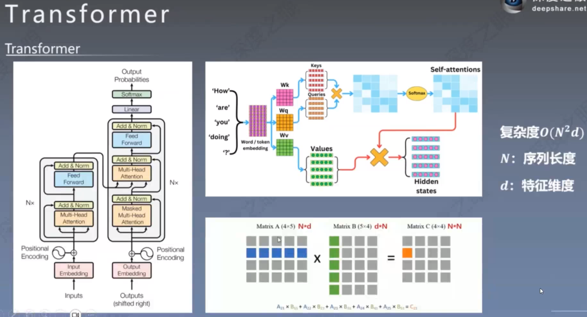
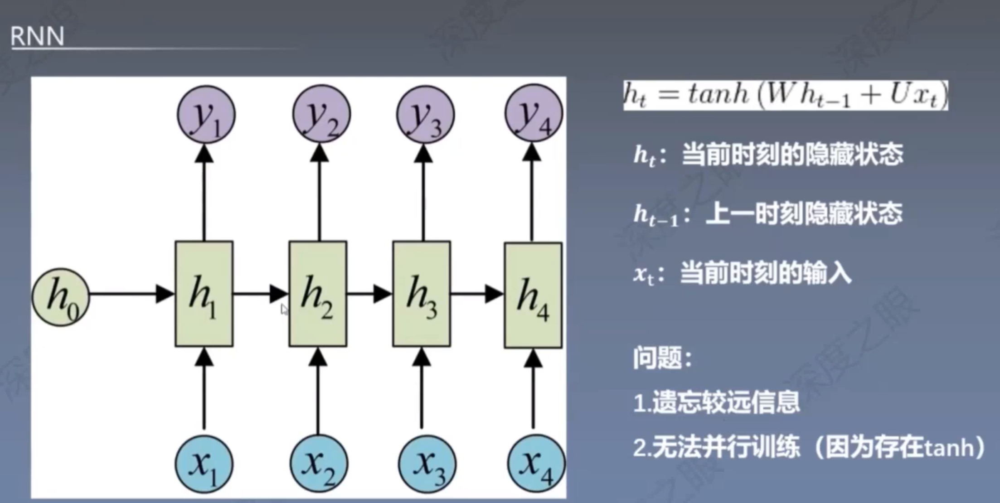
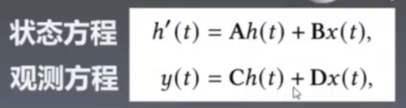
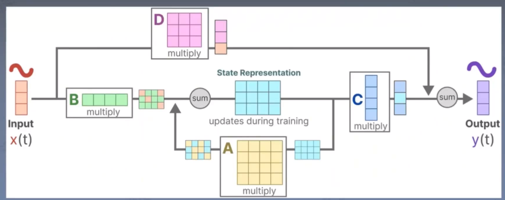
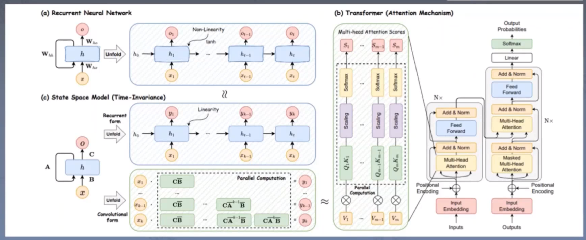

# SSM

`transformer`

`rnn`

`SSM`

等价于：

**状态方程：**它和rnn中的概念非常的相似，当前的状态就等于前一时刻的状态h(t)和当前的输入x(t)的加权平均，结果就作为

下一组的输入。

**观测方程：**和状态类似，只不过是换了一组不同的权重而已。

在rnn中，上一时刻的输出ht需要经过一个非线性变化激活函数tanh，但是SSM中对这一点进行了一些修改，上一时刻输出

ht需要经过一个线性变换。

